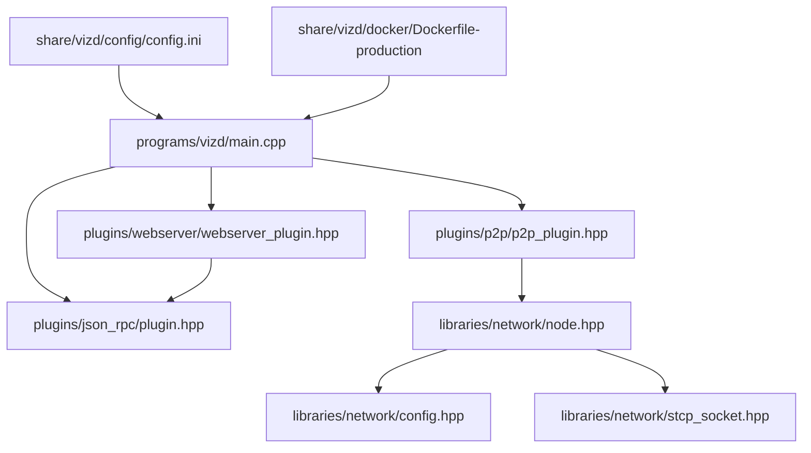
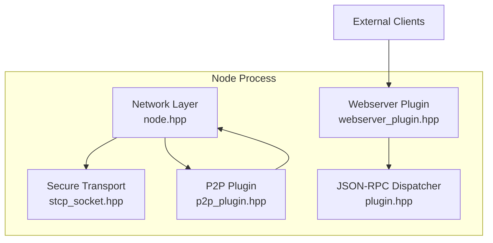
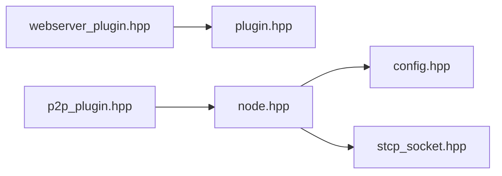

# Security Hardening

<cite>
**Referenced Files in This Document**
- [config.ini](file://share/vizd/config/config.ini)
- [config_testnet.ini](file://share/vizd/config/config_testnet.ini)
- [Dockerfile-production](file://share/vizd/docker/Dockerfile-production)
- [main.cpp](file://programs/vizd/main.cpp)
- [config.hpp](file://libraries/network/include/graphene/network/config.hpp)
- [node.hpp](file://libraries/network/include/graphene/network/node.hpp)
- [stcp_socket.hpp](file://libraries/network/include/graphene/network/stcp_socket.hpp)
- [p2p_plugin.hpp](file://plugins/p2p/include/graphene/plugins/p2p/p2p_plugin.hpp)
- [webserver_plugin.hpp](file://plugins/webserver/include/graphene/plugins/webserver/webserver_plugin.hpp)
- [plugin.hpp](file://plugins/json_rpc/include/graphene/plugins/json_rpc/plugin.hpp)
</cite>

## Table of Contents
1. [Introduction](#introduction)
2. [Project Structure](#project-structure)
3. [Core Components](#core-components)
4. [Architecture Overview](#architecture-overview)
5. [Detailed Component Analysis](#detailed-component-analysis)
6. [Dependency Analysis](#dependency-analysis)
7. [Performance Considerations](#performance-considerations)
8. [Troubleshooting Guide](#troubleshooting-guide)
9. [Conclusion](#conclusion)
10. [Appendices](#appendices)

## Introduction
This document provides comprehensive security hardening guidance for deploying VIZ CPP Node across environments from development to production. It focuses on network security, API security, cryptography, system-level controls, monitoring, vulnerability management, updates, and incident response. The guidance is grounded in the repository’s configuration, plugin architecture, and network/cryptography components.

## Project Structure
VIZ CPP Node is organized around:
- Application entry and plugin registration
- Network stack with P2P and secure transport
- Webserver and JSON-RPC API surface
- Configuration-driven runtime behavior
- Containerized production packaging

**Diagram sources**
- [main.cpp](file://programs/vizd/main.cpp#L106-L158)
- [p2p_plugin.hpp](file://plugins/p2p/include/graphene/plugins/p2p/p2p_plugin.hpp#L18-L52)
- [webserver_plugin.hpp](file://plugins/webserver/include/graphene/plugins/webserver/webserver_plugin.hpp#L32-L57)
- [plugin.hpp](file://plugins/json_rpc/include/graphene/plugins/json_rpc/plugin.hpp#L84-L118)
- [node.hpp](file://libraries/network/include/graphene/network/node.hpp#L190-L304)
- [config.hpp](file://libraries/network/include/graphene/network/config.hpp#L26-L106)
- [stcp_socket.hpp](file://libraries/network/include/graphene/network/stcp_socket.hpp#L37-L93)
- [config.ini](file://share/vizd/config/config.ini#L1-L130)
- [Dockerfile-production](file://share/vizd/docker/Dockerfile-production#L66-L88)

**Section sources**
- [main.cpp](file://programs/vizd/main.cpp#L106-L158)
- [config.ini](file://share/vizd/config/config.ini#L1-L130)
- [Dockerfile-production](file://share/vizd/docker/Dockerfile-production#L66-L88)

## Core Components
- P2P networking and peer management
- Secure transport via ECDH/AES
- HTTP/WebSocket API via webserver plugin backed by JSON-RPC
- Configuration-driven behavior and logging

Key security-relevant elements:
- Network limits and timeouts
- Logging configuration
- Plugin exposure surface
- Transport encryption

**Section sources**
- [config.hpp](file://libraries/network/include/graphene/network/config.hpp#L26-L106)
- [node.hpp](file://libraries/network/include/graphene/network/node.hpp#L190-L304)
- [stcp_socket.hpp](file://libraries/network/include/graphene/network/stcp_socket.hpp#L37-L93)
- [webserver_plugin.hpp](file://plugins/webserver/include/graphene/plugins/webserver/webserver_plugin.hpp#L32-L57)
- [plugin.hpp](file://plugins/json_rpc/include/graphene/plugins/json_rpc/plugin.hpp#L84-L118)
- [config.ini](file://share/vizd/config/config.ini#L1-L130)

## Architecture Overview
The node exposes:
- P2P endpoint for peer-to-peer synchronization
- HTTP and WebSocket endpoints for API access
- Optional witness production and related APIs

**Diagram sources**
- [node.hpp](file://libraries/network/include/graphene/network/node.hpp#L190-L304)
- [stcp_socket.hpp](file://libraries/network/include/graphene/network/stcp_socket.hpp#L37-L93)
- [webserver_plugin.hpp](file://plugins/webserver/include/graphene/plugins/webserver/webserver_plugin.hpp#L32-L57)
- [plugin.hpp](file://plugins/json_rpc/include/graphene/plugins/json_rpc/plugin.hpp#L84-L118)
- [p2p_plugin.hpp](file://plugins/p2p/include/graphene/plugins/p2p/p2p_plugin.hpp#L18-L52)

## Detailed Component Analysis

### Network Security Configuration
- P2P endpoint binding and advertised ports
- Connection limits and timeouts
- Message size limits and bandwidth parameters
- Logging for P2P subsystem

Recommendations:
- Restrict P2P listen address to internal or DMZ interfaces as appropriate
- Limit maximum connections and desired connections per operational profile
- Harden message size and rate parameters to mitigate resource exhaustion
- Enable and tune logging for anomaly detection

**Section sources**
- [config.ini](file://share/vizd/config/config.ini#L1-L130)
- [config.hpp](file://libraries/network/include/graphene/network/config.hpp#L26-L106)
- [node.hpp](file://libraries/network/include/graphene/network/node.hpp#L200-L304)

### Port Management and Network Isolation
- Exposed ports in production container:
  - HTTP API: 8090
  - WebSocket API: 8091
  - P2P: 2001
- Default configuration binds P2P to 0.0.0.0:4243

Guidance:
- Apply firewall rules to restrict inbound access to only required ports
- Segment networks via VLANs or namespaces; prefer loopback/internal binding for P2P where feasible
- Use reverse proxies or gateways for external API access with TLS termination

**Section sources**
- [Dockerfile-production](file://share/vizd/docker/Dockerfile-production#L79-L86)
- [config.ini](file://share/vizd/config/config.ini#L2-L20)

### API Security: Authentication, Rate Limiting, Access Control
- Current configuration does not define explicit authentication or rate limiting for RPC endpoints
- JSON-RPC is the transport mechanism; API exposure depends on loaded plugins

Recommendations:
- Deploy API behind an authenticating gateway or reverse proxy
- Enforce per-endpoint quotas and sliding window rate limits
- Restrict sensitive RPC methods to trusted IPs or VPN
- Rotate secrets and enforce mutual TLS where applicable

Note: The repository does not include built-in authentication or rate limiting in the referenced files.

**Section sources**
- [plugin.hpp](file://plugins/json_rpc/include/graphene/plugins/json_rpc/plugin.hpp#L84-L118)
- [webserver_plugin.hpp](file://plugins/webserver/include/graphene/plugins/webserver/webserver_plugin.hpp#L32-L57)
- [config.ini](file://share/vizd/config/config.ini#L13-L20)

### Cryptographic Security Measures
- Secure TCP socket uses ECDH key exchange and AES encryption for P2P transport
- Shared secret derived per-connection

Recommendations:
- Ensure private keys for signing are managed externally and rotated regularly
- Use hardware security modules or key management systems for key storage
- Validate certificates and enforce strict TLS policies at ingress

**Section sources**
- [stcp_socket.hpp](file://libraries/network/include/graphene/network/stcp_socket.hpp#L37-L93)
- [config_testnet.ini](file://share/vizd/config/config_testnet.ini#L105-L111)

### System-Level Security
- Production container creates a dedicated node user and separates volumes
- Logging configuration supports console and file appenders

Recommendations:
- Run as non-root user with minimal privileges
- Bind mount persistent volumes with restrictive filesystem permissions
- Enable filesystem integrity monitoring and immutable logs where possible
- Disable unnecessary plugins to reduce attack surface

**Section sources**
- [Dockerfile-production](file://share/vizd/docker/Dockerfile-production#L69-L88)
- [main.cpp](file://programs/vizd/main.cpp#L106-L158)
- [config.ini](file://share/vizd/config/config.ini#L111-L130)

### Security Monitoring and Threat Detection
- Logging configuration supports separate loggers and appenders
- P2P subsystem tracks propagation timing and peer status

Recommendations:
- Centralize logs and correlate P2P and API events
- Monitor for unusual spikes in transactions or blocks
- Alert on repeated handshake failures, unexpected disconnects, or malformed messages

**Section sources**
- [main.cpp](file://programs/vizd/main.cpp#L167-L289)
- [node.hpp](file://libraries/network/include/graphene/network/node.hpp#L173-L179)

### Vulnerability Assessment and Patch Management
- Build-time toggles for optional components and memory safety checks
- Release builds recommended for production

Recommendations:
- Perform static/dynamic analysis on release artifacts
- Establish a patch cadence aligned with upstream releases and security advisories
- Maintain SBOM and track third-party dependencies

**Section sources**
- [Dockerfile-production](file://share/vizd/docker/Dockerfile-production#L46-L54)

### Incident Response Protocols
- Graceful shutdown hooks and structured logging
- Clear separation of concerns between plugins and network layers

Recommendations:
- Define runbooks for high load, connectivity issues, and crypto key rotation
- Automate log collection and isolate affected nodes immediately
- Review and update configurations post-incident

**Section sources**
- [main.cpp](file://programs/vizd/main.cpp#L106-L158)
- [node.hpp](file://libraries/network/include/graphene/network/node.hpp#L190-L220)

## Dependency Analysis
The API stack depends on the webserver plugin and JSON-RPC dispatcher. The P2P stack depends on the node and secure transport components.

**Diagram sources**
- [webserver_plugin.hpp](file://plugins/webserver/include/graphene/plugins/webserver/webserver_plugin.hpp#L32-L57)
- [plugin.hpp](file://plugins/json_rpc/include/graphene/plugins/json_rpc/plugin.hpp#L84-L118)
- [p2p_plugin.hpp](file://plugins/p2p/include/graphene/plugins/p2p/p2p_plugin.hpp#L18-L52)
- [node.hpp](file://libraries/network/include/graphene/network/node.hpp#L190-L304)
- [config.hpp](file://libraries/network/include/graphene/network/config.hpp#L26-L106)
- [stcp_socket.hpp](file://libraries/network/include/graphene/network/stcp_socket.hpp#L37-L93)

**Section sources**
- [webserver_plugin.hpp](file://plugins/webserver/include/graphene/plugins/webserver/webserver_plugin.hpp#L32-L57)
- [plugin.hpp](file://plugins/json_rpc/include/graphene/plugins/json_rpc/plugin.hpp#L84-L118)
- [p2p_plugin.hpp](file://plugins/p2p/include/graphene/plugins/p2p/p2p_plugin.hpp#L18-L52)
- [node.hpp](file://libraries/network/include/graphene/network/node.hpp#L190-L304)
- [config.hpp](file://libraries/network/include/graphene/network/config.hpp#L26-L106)
- [stcp_socket.hpp](file://libraries/network/include/graphene/network/stcp_socket.hpp#L37-L93)

## Performance Considerations
- Lock wait and retry parameters influence resilience under load
- Single write thread reduces contention but may bottleneck high-throughput scenarios
- Adjust thread pool sizes and connection limits according to workload

[No sources needed since this section provides general guidance]

## Troubleshooting Guide
Common areas to inspect:
- P2P connectivity and peer counts
- API latency and throughput
- Log levels and destinations
- Resource exhaustion symptoms (locks, memory, disk)

Operational tips:
- Temporarily increase log verbosity for diagnosis
- Verify endpoint reachability and firewall rules
- Confirm plugin initialization order and dependencies

**Section sources**
- [config.ini](file://share/vizd/config/config.ini#L22-L47)
- [main.cpp](file://programs/vizd/main.cpp#L167-L289)
- [node.hpp](file://libraries/network/include/graphene/network/node.hpp#L248-L253)

## Conclusion
This guide consolidates security hardening practices for VIZ CPP Node deployments using repository-provided configuration and components. By applying network isolation, robust logging, transport encryption, and operational controls, teams can significantly improve security posture across environments.

[No sources needed since this section summarizes without analyzing specific files]

## Appendices

### Compliance and Audit Considerations
- Maintain audit trails for sensitive operations
- Enforce least privilege and segregation of duties
- Document configuration baselines and deviations
- Align logging retention and immutability policies with compliance requirements

[No sources needed since this section provides general guidance]