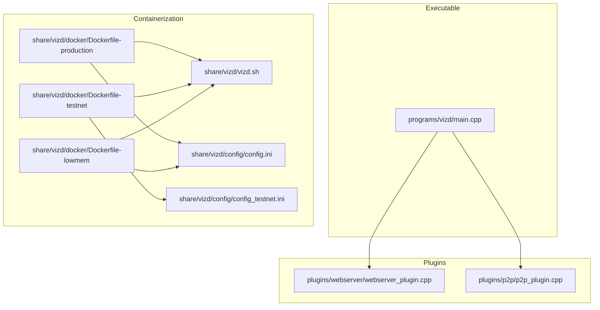
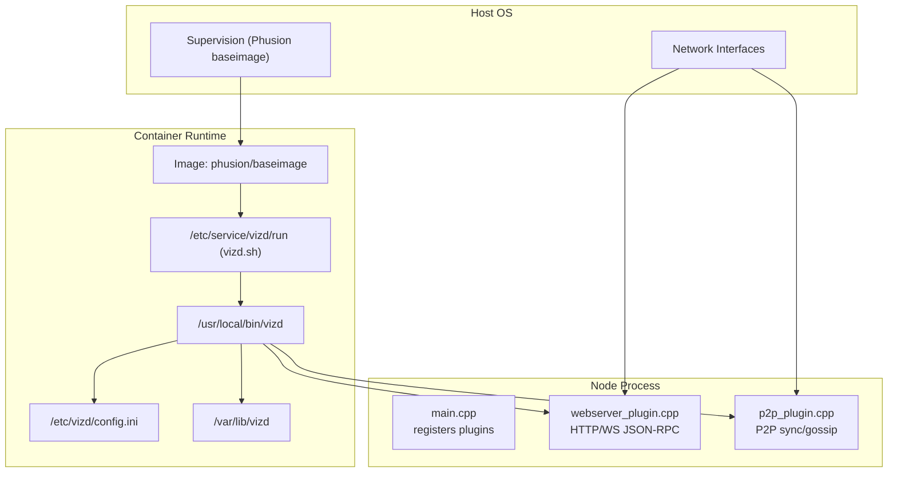
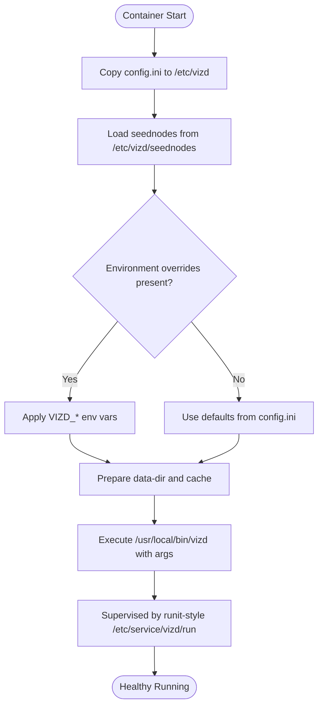
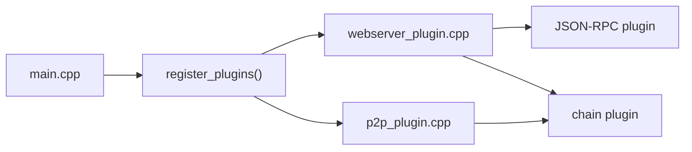

# Service Integration

<cite>
**Referenced Files in This Document**
- [vizd.sh](file://share/vizd/vizd.sh)
- [config.ini](file://share/vizd/config/config.ini)
- [config_testnet.ini](file://share/vizd/config/config_testnet.ini)
- [Dockerfile-production](file://share/vizd/docker/Dockerfile-production)
- [Dockerfile-testnet](file://share/vizd/docker/Dockerfile-testnet)
- [Dockerfile-lowmem](file://share/vizd/docker/Dockerfile-lowmem)
- [docker-main.yml](file://.github/workflows/docker-main.yml)
- [main.cpp](file://programs/vizd/main.cpp)
- [webserver_plugin.cpp](file://plugins/webserver/webserver_plugin.cpp)
- [p2p_plugin.cpp](file://plugins/p2p/p2p_plugin.cpp)
</cite>

## Table of Contents
1. [Introduction](#introduction)
2. [Project Structure](#project-structure)
3. [Core Components](#core-components)
4. [Architecture Overview](#architecture-overview)
5. [Detailed Component Analysis](#detailed-component-analysis)
6. [Dependency Analysis](#dependency-analysis)
7. [Performance Considerations](#performance-considerations)
8. [Troubleshooting Guide](#troubleshooting-guide)
9. [Conclusion](#conclusion)
10. [Appendices](#appendices)

## Introduction
This document provides comprehensive service integration guidance for deploying and operating the VIZ CPP Node across Linux and Windows environments. It covers:
- Linux service configuration via containerized runtime with Phusion baseimage and runit-style supervision
- Windows service installation and management procedures
- Reverse proxy, load balancer, and API gateway integration
- Monitoring, health checks, metrics, and alerting
- Log rotation, centralized logging, and log aggregation
- Cloud platform, container orchestration, and CI/CD pipeline integration
- Backup and recovery, disaster recovery, and high availability
- Integration examples with monitoring/logging/infrastructure platforms

## Project Structure
The repository organizes the VIZ node around:
- A main executable entry point
- A modular plugin architecture for P2P networking and HTTP/WebSocket APIs
- Container images and scripts for Linux deployment
- Configuration templates for mainnet and testnet

**Diagram sources**
- [main.cpp](file://programs/vizd/main.cpp#L106-L158)
- [webserver_plugin.cpp](file://plugins/webserver/webserver_plugin.cpp#L248-L335)
- [p2p_plugin.cpp](file://plugins/p2p/p2p_plugin.cpp#L461-L603)
- [Dockerfile-production](file://share/vizd/docker/Dockerfile-production#L66-L87)
- [Dockerfile-testnet](file://share/vizd/docker/Dockerfile-testnet#L67-L87)
- [Dockerfile-lowmem](file://share/vizd/docker/Dockerfile-lowmem#L60-L81)
- [vizd.sh](file://share/vizd/vizd.sh#L1-L82)
- [config.ini](file://share/vizd/config/config.ini#L1-L130)
- [config_testnet.ini](file://share/vizd/config/config_testnet.ini#L1-L132)

**Section sources**
- [main.cpp](file://programs/vizd/main.cpp#L106-L158)
- [webserver_plugin.cpp](file://plugins/webserver/webserver_plugin.cpp#L248-L335)
- [p2p_plugin.cpp](file://plugins/p2p/p2p_plugin.cpp#L461-L603)
- [Dockerfile-production](file://share/vizd/docker/Dockerfile-production#L66-L87)
- [Dockerfile-testnet](file://share/vizd/docker/Dockerfile-testnet#L67-L87)
- [Dockerfile-lowmem](file://share/vizd/docker/Dockerfile-lowmem#L60-L81)
- [vizd.sh](file://share/vizd/vizd.sh#L1-L82)
- [config.ini](file://share/vizd/config/config.ini#L1-L130)
- [config_testnet.ini](file://share/vizd/config/config_testnet.ini#L1-L132)

## Core Components
- Executable entry point initializes plugins and starts the application lifecycle.
- Webserver plugin exposes HTTP and WebSocket endpoints for JSON-RPC.
- P2P plugin manages peer-to-peer connectivity, block synchronization, and transaction propagation.
- Container images define runtime user, exposed ports, and supervised startup script.
- Configuration files define endpoints, plugins, and logging behavior for mainnet and testnet.

Key runtime and configuration touchpoints:
- HTTP and WebSocket endpoints are configurable via program options and configuration files.
- Logging configuration is loaded from the configuration file and supports console and file appenders.
- P2P endpoint and seed nodes are configurable via program options and environment variables in the container script.

**Section sources**
- [main.cpp](file://programs/vizd/main.cpp#L106-L158)
- [webserver_plugin.cpp](file://plugins/webserver/webserver_plugin.cpp#L254-L312)
- [p2p_plugin.cpp](file://plugins/p2p/p2p_plugin.cpp#L467-L529)
- [config.ini](file://share/vizd/config/config.ini#L1-L130)
- [config_testnet.ini](file://share/vizd/config/config_testnet.ini#L1-L132)
- [vizd.sh](file://share/vizd/vizd.sh#L62-L81)

## Architecture Overview
The VIZ node runs as a single binary with pluggable components. The containerized runtime supervises the process, injects configuration, and exposes network endpoints. The webserver plugin serves HTTP and WebSocket JSON-RPC traffic, while the P2P plugin handles blockchain synchronization and gossip.

**Diagram sources**
- [Dockerfile-production](file://share/vizd/docker/Dockerfile-production#L66-L87)
- [vizd.sh](file://share/vizd/vizd.sh#L74-L81)
- [main.cpp](file://programs/vizd/main.cpp#L106-L158)
- [webserver_plugin.cpp](file://plugins/webserver/webserver_plugin.cpp#L248-L335)
- [p2p_plugin.cpp](file://plugins/p2p/p2p_plugin.cpp#L531-L566)

## Detailed Component Analysis

### Linux Service Configuration (Containerized)
The repository provides a production-ready container image that:
- Creates a dedicated node user
- Copies a supervision script to run the node under runit-style supervision
- Exposes RPC and P2P ports
- Mounts persistent volumes for configuration and data

Operational guidance:
- Use the provided Dockerfile-production or testnet variant to build images.
- Run the container with volume mounts for configuration and data directories.
- Configure environment variables in the container to override endpoints and seed nodes as needed.
- The supervision script ensures the node restarts on failure and applies environment overrides.

**Diagram sources**
- [Dockerfile-production](file://share/vizd/docker/Dockerfile-production#L69-L87)
- [vizd.sh](file://share/vizd/vizd.sh#L1-L82)
- [config.ini](file://share/vizd/config/config.ini#L1-L130)

**Section sources**
- [Dockerfile-production](file://share/vizd/docker/Dockerfile-production#L66-L87)
- [Dockerfile-testnet](file://share/vizd/docker/Dockerfile-testnet#L67-L87)
- [Dockerfile-lowmem](file://share/vizd/docker/Dockerfile-lowmem#L60-L81)
- [vizd.sh](file://share/vizd/vizd.sh#L1-L82)
- [config.ini](file://share/vizd/config/config.ini#L1-L130)

### Windows Service Installation and Management
The repository does not include Windows-specific service files or scripts. To deploy on Windows:
- Package the VIZ node binary and required configuration files into a Windows-compatible artifact.
- Create a Windows service wrapper using a launcher such as NSSM or WinSW to manage the process lifecycle.
- Configure the service to run under a dedicated user account with appropriate permissions.
- Use the configuration files from the repository to define endpoints and plugins.
- Integrate with Windows Event Log for logging and monitoring.

[No sources needed since this section provides general guidance]

### Integration with Reverse Proxies, Load Balancers, and API Gateways
The node exposes:
- HTTP JSON-RPC endpoint
- WebSocket JSON-RPC endpoint
- P2P endpoint for peers

Recommended integration patterns:
- Place an HTTP load balancer or reverse proxy in front of the HTTP and WebSocket endpoints.
- Configure health checks against the HTTP endpoint and/or a dedicated health path if available.
- Use sticky sessions only if required by client workflows; otherwise, distribute across multiple node instances.
- For API gateways, expose only the JSON-RPC endpoints and apply rate limiting and authentication policies at the gateway layer.

[No sources needed since this section provides general guidance]

### Monitoring Integration (Health Checks, Metrics, Alerting)
Monitoring capabilities:
- Health checks: Poll the HTTP endpoint to verify node responsiveness.
- Logs: The node supports console and file appenders configured via the configuration file.
- Metrics: No built-in metrics endpoint is present in the referenced code; integrate external metrics collection at the host/container level.

Operational recommendations:
- Centralize logs from the node’s file appender to a SIEM or log aggregation platform.
- Use host/container metrics (CPU, memory, disk) and network throughput for alerting.
- Define alerts for restart storms, high latency, low free disk, and P2P connection counts.

**Section sources**
- [config.ini](file://share/vizd/config/config.ini#L111-L130)
- [main.cpp](file://programs/vizd/main.cpp#L167-L191)

### Log Rotation, Centralized Logging, and Log Aggregation
Logging configuration:
- Console and file appenders are supported and configurable.
- File appender rotation and flushing are programmatically enabled during configuration loading.

Integration guidance:
- Route node logs to a centralized logging system (e.g., ELK, Loki, Splunk) using standard collectors.
- Ensure log paths are persisted via mounted volumes and managed by the container runtime.
- Rotate logs at the collector level to avoid blocking the node process.

**Section sources**
- [main.cpp](file://programs/vizd/main.cpp#L211-L288)
- [config.ini](file://share/vizd/config/config.ini#L111-L130)

### Cloud Platforms, Container Orchestration, and Automated Pipelines
Container images:
- Production and testnet images are built from the provided Dockerfiles.
- GitHub Actions workflow builds and publishes images on pushes to master.

Orchestration and CI/CD:
- Deploy containers to Kubernetes, ECS, or similar orchestrators using the published images.
- Use the workflow as a template for automated image builds and publishing.

**Section sources**
- [Dockerfile-production](file://share/vizd/docker/Dockerfile-production#L1-L88)
- [Dockerfile-testnet](file://share/vizd/docker/Dockerfile-testnet#L1-L88)
- [docker-main.yml](file://.github/workflows/docker-main.yml#L1-L41)

### Backup and Recovery, Disaster Recovery, and High Availability
Backup and recovery:
- Back up the data directory (blockchain state) regularly.
- Snapshot the configuration directory to preserve runtime settings.
- Test restoration procedures in isolated environments before applying to production.

High availability:
- Run multiple node instances behind a load balancer.
- Prefer witness nodes with redundant infrastructure and monitoring.
- Use rolling updates to minimize downtime during maintenance.

[No sources needed since this section provides general guidance]

### Integration Examples with Monitoring, Logging, and Infrastructure Platforms
- Monitoring: Prometheus node_exporter + custom JSON-RPC health exporter; Grafana dashboards for latency and peer counts.
- Logging: Fluent Bit or Filebeat shipping logs to Elasticsearch/OpenSearch; centralized dashboards.
- Infrastructure: Terraform/AWS/GCP/Azure for provisioning; Helm/Kustomize for Kubernetes deployments.

[No sources needed since this section provides general guidance]

## Dependency Analysis
The node executable registers and initializes plugins. The webserver plugin depends on the JSON-RPC plugin and chain plugin state. The P2P plugin depends on the chain plugin for database operations.

**Diagram sources**
- [main.cpp](file://programs/vizd/main.cpp#L62-L90)
- [webserver_plugin.cpp](file://plugins/webserver/webserver_plugin.cpp#L314-L326)
- [p2p_plugin.cpp](file://plugins/p2p/p2p_plugin.cpp#L531-L566)

**Section sources**
- [main.cpp](file://programs/vizd/main.cpp#L62-L90)
- [webserver_plugin.cpp](file://plugins/webserver/webserver_plugin.cpp#L314-L326)
- [p2p_plugin.cpp](file://plugins/p2p/p2p_plugin.cpp#L531-L566)

## Performance Considerations
- Thread pool sizing: Tune the webserver thread pool size according to CPU cores and expected concurrency.
- Lock contention: The configuration enables single-write-thread mode to reduce database lock contention.
- Shared memory sizing: Adjust shared file size and thresholds to prevent frequent resizing during operation.
- P2P connections: Limit maximum connections and carefully select seed nodes to balance connectivity and resource usage.

**Section sources**
- [config.ini](file://share/vizd/config/config.ini#L13-L67)
- [webserver_plugin.cpp](file://plugins/webserver/webserver_plugin.cpp#L254-L263)

## Troubleshooting Guide
Common operational issues and resolutions:
- Startup failures: Verify configuration file syntax and required directories exist inside the container.
- Network connectivity: Confirm P2P endpoint binding and firewall rules; ensure seed nodes are reachable.
- Log visibility: Check file appender paths and permissions; confirm log levels are set appropriately.
- Health checks failing: Validate HTTP/WS endpoints and ensure plugins are fully synced before exposing to clients.

**Section sources**
- [config.ini](file://share/vizd/config/config.ini#L111-L130)
- [p2p_plugin.cpp](file://plugins/p2p/p2p_plugin.cpp#L531-L566)
- [webserver_plugin.cpp](file://plugins/webserver/webserver_plugin.cpp#L314-L326)

## Conclusion
The VIZ CPP Node is designed for containerized deployment with robust supervision and flexible configuration. By leveraging the provided Docker images, configuration templates, and plugin architecture, operators can integrate the node into modern infrastructure with reverse proxies, load balancers, monitoring, logging, and CI/CD pipelines. For Windows environments, a Windows service wrapper should be created alongside the configuration artifacts. Disaster recovery and high availability are achieved through multiple node instances, regular backups, and careful orchestration.

## Appendices
- Environment variable overrides in the container script:
  - RPC and P2P endpoints
  - Witness name and private key
  - Seed nodes
  - Extra options

**Section sources**
- [vizd.sh](file://share/vizd/vizd.sh#L62-L81)