# Build Helper Scripts

<cite>
**Referenced Files in This Document**
- [CMakeLists.txt](file://CMakeLists.txt)
- [build-linux.sh](file://build-linux.sh)
- [build-mac.sh](file://build-mac.sh)
- [build-mingw.bat](file://build-mingw.bat)
- [build-msvc.bat](file://build-msvc.bat)
- [programs/build_helpers/CMakeLists.txt](file://programs/build_helpers/CMakeLists.txt)
- [programs/build_helpers/cat-parts.cpp](file://programs/build_helpers/cat-parts.cpp)
- [programs/build_helpers/cat_parts.py](file://programs/build_helpers/cat_parts.py)
- [programs/build_helpers/check_reflect.py](file://programs/build_helpers/check_reflect.py)
- [programs/build_helpers/configure_build.py](file://programs/build_helpers/configure_build.py)
- [libraries/chain/hardfork.d/0-preamble.hf](file://libraries/chain/hardfork.d/0-preamble.hf)
- [libraries/chain/hardfork.d/1.hf](file://libraries/chain/hardfork.d/1.hf)
- [documentation/building.md](file://documentation/building.md)
</cite>

## Table of Contents
1. [Introduction](#introduction)
2. [Project Structure](#project-structure)
3. [Core Components](#core-components)
4. [Architecture Overview](#architecture-overview)
5. [Detailed Component Analysis](#detailed-component-analysis)
6. [Dependency Analysis](#dependency-analysis)
7. [Performance Considerations](#performance-considerations)
8. [Troubleshooting Guide](#troubleshooting-guide)
9. [Conclusion](#conclusion)

## Introduction
This document explains the build helper scripts and automation tools used to compile the VIZ blockchain node across multiple platforms. It covers the shell and batch scripts for Linux/macOS/Windows, the CMake-based build system, and specialized helper utilities that assist with hardfork file concatenation, reflection validation, and cross-platform configuration.

## Project Structure
The build system is organized around:
- Platform-specific build scripts for quick configuration and compilation
- A centralized CMake configuration that defines compile-time options and platform flags
- Helper utilities under programs/build_helpers for specialized tasks like hardfork file assembly and reflection consistency checks
- Documentation that describes all supported build options and workflows

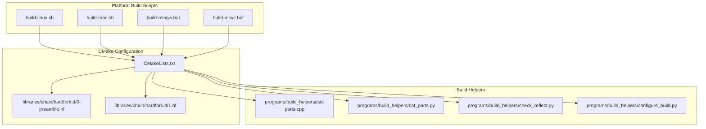

**Diagram sources**
- [CMakeLists.txt](file://CMakeLists.txt)
- [build-linux.sh](file://build-linux.sh)
- [build-mac.sh](file://build-mac.sh)
- [build-mingw.bat](file://build-mingw.bat)
- [build-msvc.bat](file://build-msvc.bat)
- [programs/build_helpers/CMakeLists.txt](file://programs/build_helpers/CMakeLists.txt)
- [programs/build_helpers/cat-parts.cpp](file://programs/build_helpers/cat-parts.cpp)
- [programs/build_helpers/cat_parts.py](file://programs/build_helpers/cat_parts.py)
- [programs/build_helpers/check_reflect.py](file://programs/build_helpers/check_reflect.py)
- [programs/build_helpers/configure_build.py](file://programs/build_helpers/configure_build.py)
- [libraries/chain/hardfork.d/0-preamble.hf](file://libraries/chain/hardfork.d/0-preamble.hf)
- [libraries/chain/hardfork.d/1.hf](file://libraries/chain/hardfork.d/1.hf)

**Section sources**
- [CMakeLists.txt](file://CMakeLists.txt)
- [documentation/building.md](file://documentation/building.md)

## Core Components
- Platform build scripts:
  - Linux: automated dependency installation, submodule initialization, CMake configuration, parallel build, and optional install
  - macOS: Xcode/Homebrew checks, OpenSSL detection, CMake configuration, parallel build, and optional install
  - Windows MSVC: CMake configuration with Visual Studio generator, build execution, and optional install
  - Windows MinGW: CMake configuration with MinGW generator, build execution, and optional install
- CMake configuration:
  - Centralized compile-time options (build type, memory mode, testnet, MongoDB plugin, shared/static libs)
  - Platform-specific compiler flags and static linking policies
  - Hardfork file inclusion and generation pipeline
- Build helper utilities:
  - Concatenate hardfork .hf files into a single header
  - Validate FC_REFLECT declarations match Doxygen-extracted class members
  - Cross-platform CMake configuration helper for Windows builds
  - Python-based file concatenation utility

**Section sources**
- [build-linux.sh](file://build-linux.sh)
- [build-mac.sh](file://build-mac.sh)
- [build-mingw.bat](file://build-mingw.bat)
- [build-msvc.bat](file://build-msvc.bat)
- [CMakeLists.txt](file://CMakeLists.txt)
- [programs/build_helpers/cat-parts.cpp](file://programs/build_helpers/cat-parts.cpp)
- [programs/build_helpers/cat_parts.py](file://programs/build_helpers/cat_parts.py)
- [programs/build_helpers/check_reflect.py](file://programs/build_helpers/check_reflect.py)
- [programs/build_helpers/configure_build.py](file://programs/build_helpers/configure_build.py)

## Architecture Overview
The build architecture integrates platform scripts with CMake and helper utilities to provide a unified, repeatable build experience across platforms.

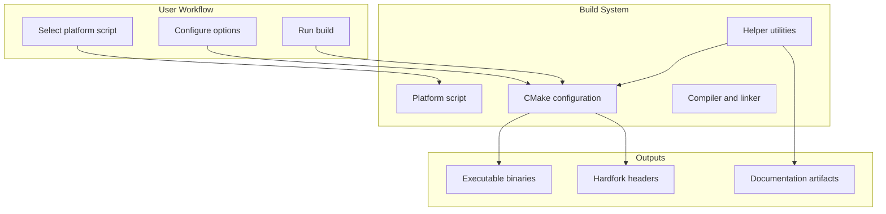

**Diagram sources**
- [build-linux.sh](file://build-linux.sh)
- [build-mac.sh](file://build-mac.sh)
- [build-mingw.bat](file://build-mingw.bat)
- [build-msvc.bat](file://build-msvc.bat)
- [CMakeLists.txt](file://CMakeLists.txt)
- [programs/build_helpers/cat-parts.cpp](file://programs/build_helpers/cat-parts.cpp)
- [programs/build_helpers/cat_parts.py](file://programs/build_helpers/cat_parts.py)
- [programs/build_helpers/check_reflect.py](file://programs/build_helpers/check_reflect.py)
- [programs/build_helpers/configure_build.py](file://programs/build_helpers/configure_build.py)

## Detailed Component Analysis

### Linux Build Script
The Linux script automates dependency installation (based on detected package manager), submodule initialization, CMake configuration with configurable options, parallel build execution, and optional installation.

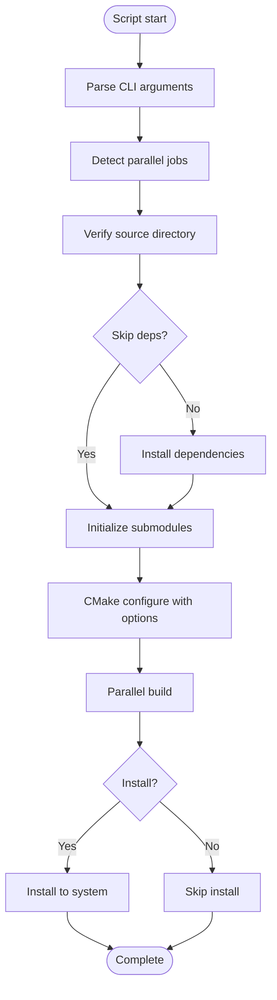

**Diagram sources**
- [build-linux.sh](file://build-linux.sh)

**Section sources**
- [build-linux.sh](file://build-linux.sh)
- [documentation/building.md](file://documentation/building.md)

### macOS Build Script
The macOS script verifies Xcode Command Line Tools and Homebrew, detects OpenSSL path, initializes submodules, configures CMake, builds in parallel, and optionally installs.

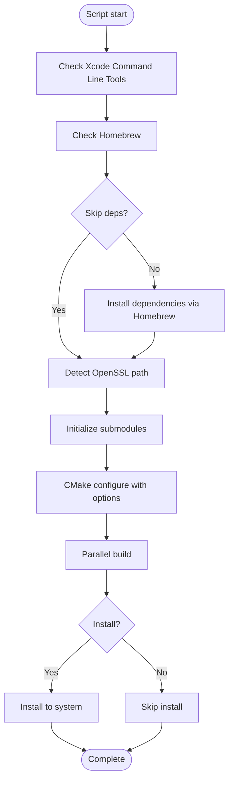

**Diagram sources**
- [build-mac.sh](file://build-mac.sh)

**Section sources**
- [build-mac.sh](file://build-mac.sh)
- [documentation/building.md](file://documentation/building.md)

### Windows Build Scripts
Two Windows scripts support different toolchains:
- MSVC: Uses Visual Studio generator and CMake configuration with optional extra flags
- MinGW: Uses MinGW Makefiles generator and CMake configuration with static/full-static options

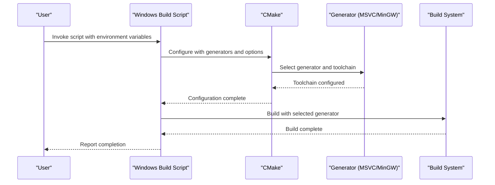

**Diagram sources**
- [build-msvc.bat](file://build-msvc.bat)
- [build-mingw.bat](file://build-mingw.bat)

**Section sources**
- [build-msvc.bat](file://build-msvc.bat)
- [build-mingw.bat](file://build-mingw.bat)
- [documentation/building.md](file://documentation/building.md)

### CMake Configuration and Compile-Time Options
CMake centralizes build configuration, compile-time flags, and platform-specific settings. Key options include build type, memory mode, testnet, MongoDB plugin, shared/static libraries, and chainbase lock checking.

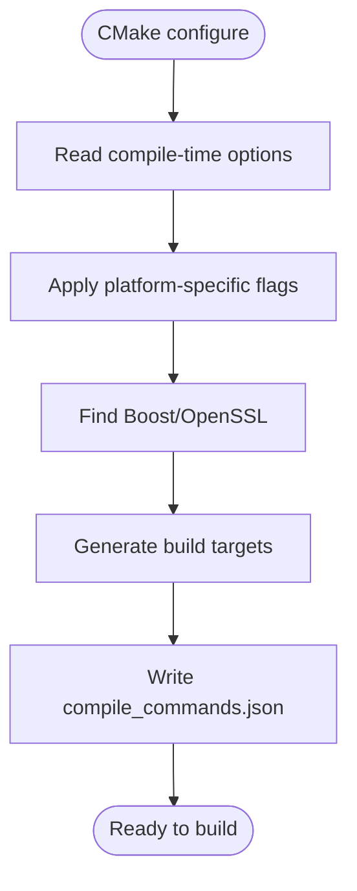

**Diagram sources**
- [CMakeLists.txt](file://CMakeLists.txt)

**Section sources**
- [CMakeLists.txt](file://CMakeLists.txt)
- [documentation/building.md](file://documentation/building.md)

### Hardfork File Concatenation Utility (C++)
The C++ utility scans a directory for .hf files, sorts them, concatenates their contents, and writes a single output file if the content differs from existing output.

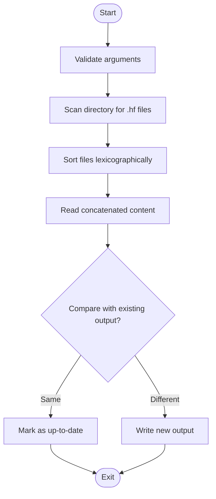

**Diagram sources**
- [programs/build_helpers/cat-parts.cpp](file://programs/build_helpers/cat-parts.cpp)

**Section sources**
- [programs/build_helpers/cat-parts.cpp](file://programs/build_helpers/cat-parts.cpp)
- [libraries/chain/hardfork.d/0-preamble.hf](file://libraries/chain/hardfork.d/0-preamble.hf)
- [libraries/chain/hardfork.d/1.hf](file://libraries/chain/hardfork.d/1.hf)

### Hardfork File Concatenation Utility (Python)
The Python utility provides equivalent functionality to the C++ version with robust error handling and directory creation.

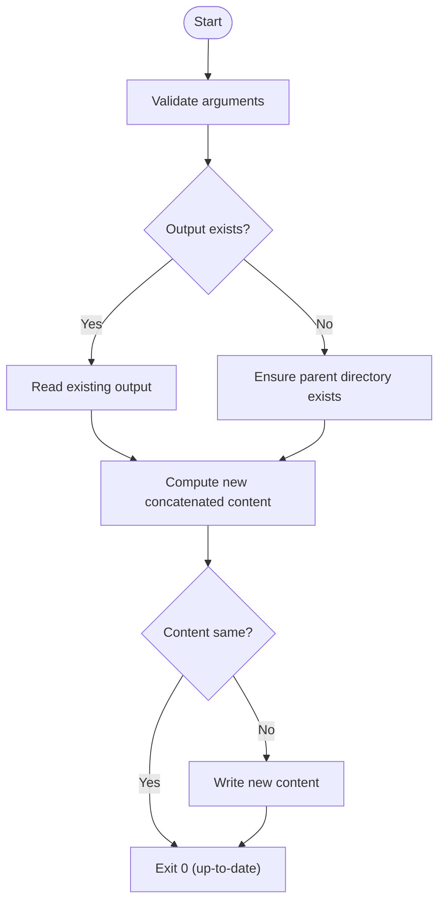

**Diagram sources**
- [programs/build_helpers/cat_parts.py](file://programs/build_helpers/cat_parts.py)

**Section sources**
- [programs/build_helpers/cat_parts.py](file://programs/build_helpers/cat_parts.py)

### Reflection Consistency Checker
The Python script validates that FC_REFLECT declarations match Doxygen-extracted class members, reporting mismatches and duplicates.

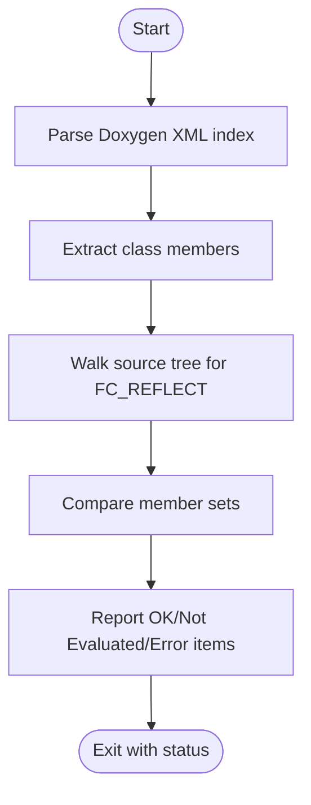

**Diagram sources**
- [programs/build_helpers/check_reflect.py](file://programs/build_helpers/check_reflect.py)

**Section sources**
- [programs/build_helpers/check_reflect.py](file://programs/build_helpers/check_reflect.py)

### Cross-Platform CMake Configuration Helper (Windows)
The Python helper constructs CMake commands with platform-specific flags, environment variable support, and optional additional options.

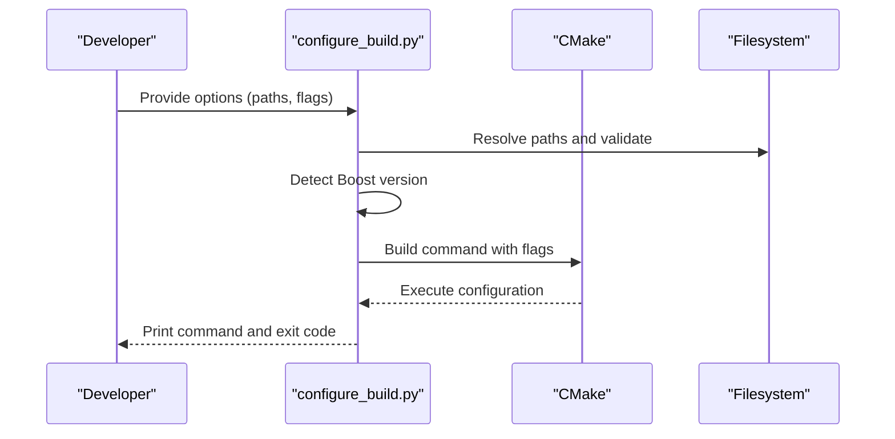

**Diagram sources**
- [programs/build_helpers/configure_build.py](file://programs/build_helpers/configure_build.py)

**Section sources**
- [programs/build_helpers/configure_build.py](file://programs/build_helpers/configure_build.py)

## Dependency Analysis
The build system exhibits clear separation of concerns:
- Platform scripts depend on CMake and system tools
- CMake depends on Boost and OpenSSL availability
- Helper utilities are standalone and can be invoked independently
- Hardfork concatenation utilities depend on filesystem access and input ordering

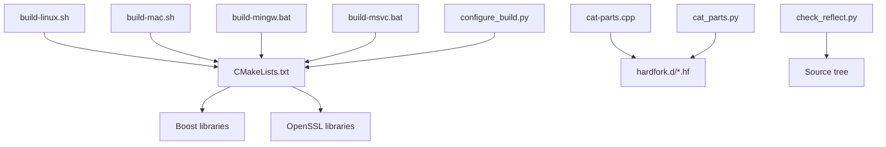

**Diagram sources**
- [build-linux.sh](file://build-linux.sh)
- [build-mac.sh](file://build-mac.sh)
- [build-mingw.bat](file://build-mingw.bat)
- [build-msvc.bat](file://build-msvc.bat)
- [CMakeLists.txt](file://CMakeLists.txt)
- [programs/build_helpers/cat-parts.cpp](file://programs/build_helpers/cat-parts.cpp)
- [programs/build_helpers/cat_parts.py](file://programs/build_helpers/cat_parts.py)
- [programs/build_helpers/check_reflect.py](file://programs/build_helpers/check_reflect.py)
- [programs/build_helpers/configure_build.py](file://programs/build_helpers/configure_build.py)
- [libraries/chain/hardfork.d/0-preamble.hf](file://libraries/chain/hardfork.d/0-preamble.hf)
- [libraries/chain/hardfork.d/1.hf](file://libraries/chain/hardfork.d/1.hf)

**Section sources**
- [CMakeLists.txt](file://CMakeLists.txt)
- [programs/build_helpers/CMakeLists.txt](file://programs/build_helpers/CMakeLists.txt)

## Performance Considerations
- Parallel builds: All platform scripts support parallel job counts to speed up compilation
- Dependency caching: CMake and ccache integration reduce rebuild times
- Static linking: Windows scripts offer full static builds to simplify deployment
- Hardfork concatenation: Efficient sorting and streaming minimize I/O overhead

## Troubleshooting Guide
- Linux/macOS dependency issues: Use the provided scripts to install required packages; verify submodules are initialized
- Windows environment variables: Ensure BOOST_ROOT and OPENSSL_ROOT_DIR are set and point to valid directories
- Hardfork header mismatch: Re-run the concatenation utility to regenerate the combined header
- Reflection validation failures: Fix FC_REFLECT declarations to match Doxygen-extracted members
- CMake configuration errors: Confirm compiler versions meet minimum requirements and required libraries are discoverable

**Section sources**
- [documentation/building.md](file://documentation/building.md)
- [build-linux.sh](file://build-linux.sh)
- [build-mac.sh](file://build-mac.sh)
- [build-mingw.bat](file://build-mingw.bat)
- [build-msvc.bat](file://build-msvc.bat)
- [programs/build_helpers/check_reflect.py](file://programs/build_helpers/check_reflect.py)

## Conclusion
The build helper scripts and CMake configuration provide a robust, cross-platform build system for the VIZ node. They automate dependency management, platform-specific configurations, and quality checks, enabling contributors and operators to build reliably across Linux, macOS, and Windows environments.