# Build Helper Tools

<cite>
**Referenced Files in This Document**
- [cat-parts.cpp](file://programs/build_helpers/cat-parts.cpp)
- [cat_parts.py](file://programs/build_helpers/cat_parts.py)
- [check_reflect.py](file://programs/build_helpers/check_reflect.py)
- [newplugin.py](file://programs/util/newplugin.py)
- [pretty_schema.py](file://programs/util/pretty_schema.py)
- [schema_test.cpp](file://programs/util/schema_test.cpp)
- [configure_build.py](file://programs/build_helpers/configure_build.py)
- [install-deps-linux.sh](file://install-deps-linux.sh)
- [build-linux.sh](file://build-linux.sh)
- [build-mac.sh](file://build-mac.sh)
- [CMakeLists.txt (build_helpers)](file://programs/build_helpers/CMakeLists.txt)
- [CMakeLists.txt (util)](file://programs/util/CMakeLists.txt)
- [building.md](file://documentation/building.md)
- [README.md](file://README.md)
</cite>

## Update Summary
**Changes Made**
- Added comprehensive documentation for the new install-deps-linux.sh dependency installer script
- Updated build system architecture documentation to reflect the separation of dependency management from the main build process
- Revised build-linux.sh documentation to reflect the use of --clean instead of --skip-deps option
- Enhanced security practices documentation highlighting the improved build system architecture
- Updated practical examples to demonstrate the new two-script build workflow

## Table of Contents
1. [Introduction](#introduction)
2. [Project Structure](#project-structure)
3. [Core Components](#core-components)
4. [Architecture Overview](#architecture-overview)
5. [Detailed Component Analysis](#detailed-component-analysis)
6. [Dependency Analysis](#dependency-analysis)
7. [Performance Considerations](#performance-considerations)
8. [Compilation Correctness and Best Practices](#compilation-correctness-and-best-practices)
9. [Security and Build System Architecture](#security-and-build-system-architecture)
10. [Troubleshooting Guide](#troubleshooting-guide)
11. [Conclusion](#conclusion)
12. [Appendices](#appendices)

## Introduction
This document describes the VIZ C++ Node build helper tools that streamline development tasks such as assembling source fragments, validating reflection metadata, scaffolding custom plugins, generating formatted schema representations, and validating database schemas. It explains command-line usage, input/output formats, and integration with the main build process. The build system has been enhanced with a new dependency installer script that separates system dependency management from the main build process, improving security and maintainability.

**Updated** Enhanced with new dependency management capabilities and improved build system architecture.

## Project Structure
The build helper tools live under programs/build_helpers and programs/util. They integrate with CMake via dedicated CMakeLists.txt files and complement the broader build system described in documentation/building.md. The system now includes a new dependency installer script that manages system-level dependencies separately from the main build process.

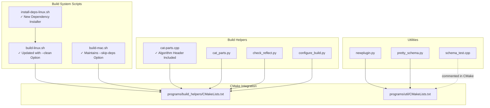

**Diagram sources**
- [install-deps-linux.sh:1-113](file://install-deps-linux.sh#L1-L113)
- [build-linux.sh:1-191](file://build-linux.sh#L1-L191)
- [build-mac.sh:1-242](file://build-mac.sh#L1-L242)
- [CMakeLists.txt (build_helpers):1-8](file://programs/build_helpers/CMakeLists.txt#L1-L8)
- [CMakeLists.txt (util):1-69](file://programs/util/CMakeLists.txt#L1-L69)

**Section sources**
- [CMakeLists.txt (build_helpers):1-8](file://programs/build_helpers/CMakeLists.txt#L1-L8)
- [CMakeLists.txt (util):1-69](file://programs/util/CMakeLists.txt#L1-L69)
- [building.md:183-220](file://documentation/building.md#L183-L220)

## Core Components
- **install-deps-linux.sh**: New dependency installer script that installs all required system dependencies for VIZ C++ Node builds. Requires root privileges and supports both Ubuntu/Debian (apt-get) and Fedora/RHEL (dnf) package managers.
- **build-linux.sh**: Enhanced Linux build script that uses --clean option instead of --skip-deps, improving build system architecture and security practices by separating dependency management from the main build process.
- **build-mac.sh**: macOS build script that maintains the --skip-deps option for Homebrew dependency management.
- **cat-parts**: Concatenates hardfork fragment files (.hf) from a directory into a single output file, with up-to-date checks and minimal rebuild behavior. **Enhanced with proper algorithm header inclusion for compilation correctness**.
- **cat_parts.py**: Python counterpart to cat-parts with similar behavior and robustness for directory creation and file existence checks.
- **check_reflect.py**: Validates FC_REFLECT and FC_REFLECT_DERIVED declarations against Doxygen XML class member lists to ensure reflection parity.
- **newplugin.py**: Generates a complete plugin skeleton with standardized file structure and boilerplate code for a given provider and plugin name.
- **pretty_schema.py**: Queries a local debug node JSON-RPC endpoint to fetch and pretty-print the schema representation.
- **schema_test.cpp**: Demonstrates retrieving and printing schema information for specific chain objects using the schema API.
- **configure_build.py**: A helper to invoke cmake with sensible defaults and optional cross-compilation and external library flags.

**Section sources**
- [install-deps-linux.sh:1-113](file://install-deps-linux.sh#L1-L113)
- [build-linux.sh:17-29](file://build-linux.sh#L17-L29)
- [build-mac.sh:15-26](file://build-mac.sh#L15-L26)
- [cat-parts.cpp:1-68](file://programs/build_helpers/cat-parts.cpp#L1-L68)
- [cat_parts.py:1-74](file://programs/build_helpers/cat_parts.py#L1-L74)
- [check_reflect.py:1-160](file://programs/build_helpers/check_reflect.py#L1-L160)
- [newplugin.py:1-251](file://programs/util/newplugin.py#L1-L251)
- [pretty_schema.py:1-28](file://programs/util/pretty_schema.py#L1-L28)
- [schema_test.cpp:1-57](file://programs/util/schema_test.cpp#L1-L57)
- [configure_build.py:1-202](file://programs/build_helpers/configure_build.py#L1-L202)

## Architecture Overview
The tools are designed to be invoked from the command line and integrated into higher-level build scripts or CI. They rely on:
- Standard filesystem operations for reading/writing files
- Regular expressions for parsing reflection declarations
- XML parsing for Doxygen-generated class member lists
- JSON-RPC calls for schema retrieval
- CMake targets for compilation and installation
- **New**: Separated dependency management system for improved security and maintainability

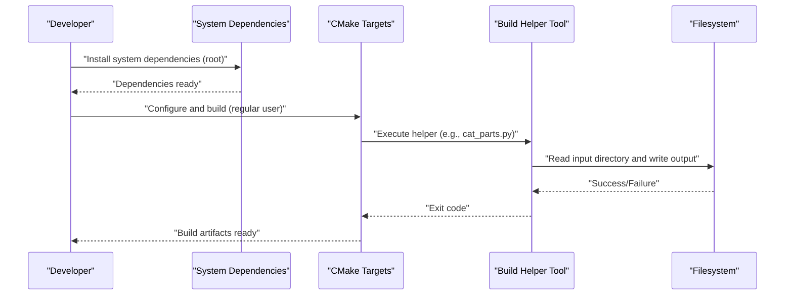

**Updated** Enhanced with new dependency management workflow that separates system-level operations from build operations.

[No sources needed since this diagram shows conceptual workflow, not actual code structure]

## Detailed Component Analysis

### install-deps-linux.sh (New)
A comprehensive dependency installer script that manages all system-level dependencies required for VIZ C++ Node builds. This script separates dependency management from the main build process, improving security and maintainability.

Key behaviors:
- Requires root privileges (sudo) for system-level package installation
- Supports Ubuntu/Debian systems using apt-get package manager
- Supports Fedora/RHEL systems using dnf package manager
- Installs essential build tools: cmake, git, ccache, build-essential
- Installs Boost libraries with comprehensive development headers
- Installs compression libraries: bzip2, lzma, zstd, zlib
- Installs SSL/TLS support and development tools
- Provides color-coded status messages and error handling
- Automatically detects package manager and installs appropriate dependencies

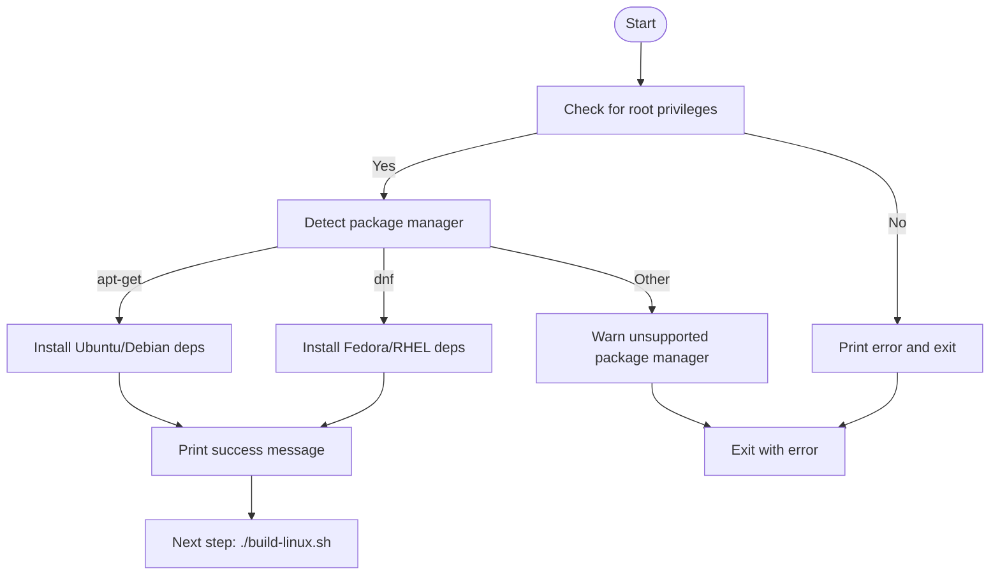

**Diagram sources**
- [install-deps-linux.sh:28-106](file://install-deps-linux.sh#L28-L106)

**Section sources**
- [install-deps-linux.sh:1-113](file://install-deps-linux.sh#L1-L113)

### build-linux.sh (Enhanced)
Enhanced Linux build script that now uses --clean option instead of --skip-deps, reflecting the improved separation between dependency management and build processes. This change improves security by ensuring clean builds and better maintainability.

Key behaviors:
- **Updated**: Uses --clean option for clean build directory management
- **Enhanced**: Improved argument parsing with comprehensive build options
- **Maintained**: Preserves all existing build configurations
- **Improved**: Better error handling and user feedback
- **Security**: Refuses to run as root (build must run as regular user)

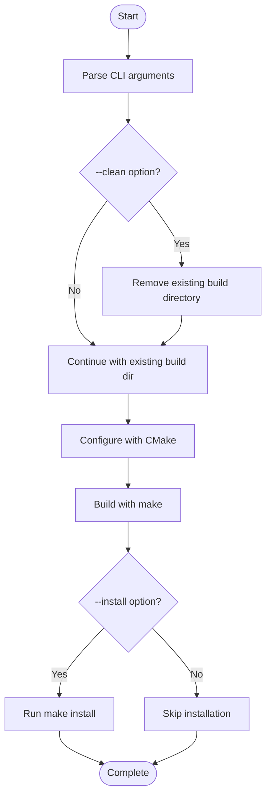

**Diagram sources**
- [build-linux.sh:63-98](file://build-linux.sh#L63-L98)
- [build-linux.sh:120-128](file://build-linux.sh#L120-L128)

**Section sources**
- [build-linux.sh:1-191](file://build-linux.sh#L1-L191)

### build-mac.sh (Maintained)
macOS build script that maintains the --skip-deps option for Homebrew dependency management. This preserves the existing workflow for macOS development environments.

Key behaviors:
- **Maintained**: Uses --skip-deps option for Homebrew dependency management
- **Enhanced**: Improved Xcode Command Line Tools detection
- **Improved**: Better OpenSSL path detection and configuration
- **Preserved**: All existing build configurations and options

**Section sources**
- [build-mac.sh:1-242](file://build-mac.sh#L1-L242)

### cat-parts (C++)
Concatenates .hf files from a directory into a single output file, skipping non-.hf entries and sorting filenames numerically. It compares the generated content with existing output to avoid unnecessary writes.

**Updated** Enhanced with proper algorithm header inclusion for improved compilation reliability across different environments.

Key behaviors:
- Command-line arguments: input directory and output file path
- Filters files by extension and sorts them using std::sort
- Compares new content with existing output to skip redundant writes
- Uses Boost filesystem and streams

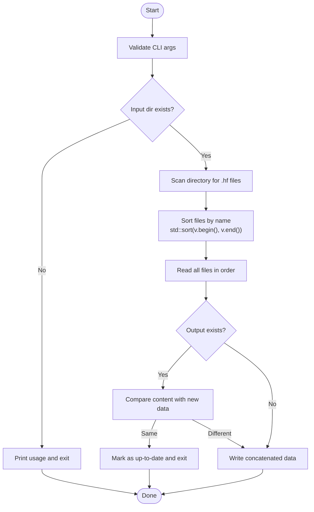

**Diagram sources**
- [cat-parts.cpp:7-68](file://programs/build_helpers/cat-parts.cpp#L7-L68)

**Section sources**
- [cat-parts.cpp:1-68](file://programs/build_helpers/cat-parts.cpp#L1-L68)

### cat_parts.py (Python)
A Python reimplementation of cat-parts with explicit checks for directory creation and file existence. It supports filtering by file suffix and writes the concatenated content to the output file.

Key behaviors:
- Command-line arguments: input directory and output file path
- Creates parent directories if missing
- Reads and concatenates files in sorted order
- Skips writing if content is identical to existing output

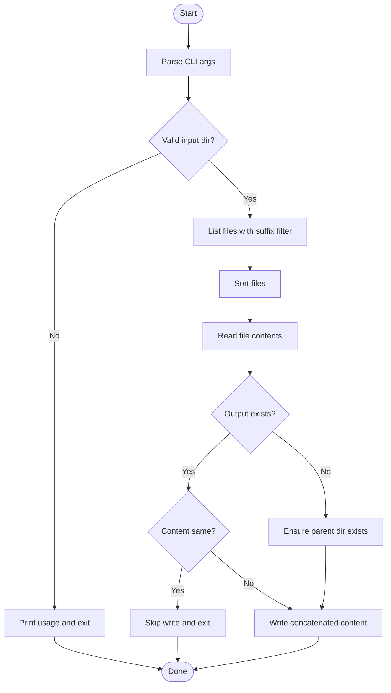

**Diagram sources**
- [cat_parts.py:28-74](file://programs/build_helpers/cat_parts.py#L28-L74)

**Section sources**
- [cat_parts.py:1-74](file://programs/build_helpers/cat_parts.py#L1-L74)

### check_reflect.py (Python)
Validates that FC_REFLECT and FC_REFLECT_DERIVED declarations match Doxygen XML class member lists. It scans source files for reflection macros, parses Doxygen XML, and reports mismatches, duplicates, and missing items.

Key behaviors:
- Parses Doxygen XML index.xml to extract class member lists
- Scans libraries/, programs/, tests/ for .cpp/.hpp files
- Extracts reflection declarations using regular expressions
- Compares member sets and prints categorized results
- Exits with success if no errors are found

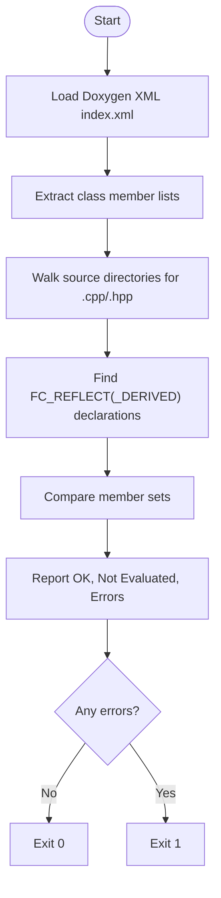

**Diagram sources**
- [check_reflect.py:44-160](file://programs/build_helpers/check_reflect.py#L44-L160)

**Section sources**
- [check_reflect.py:1-160](file://programs/build_helpers/check_reflect.py#L1-L160)

### newplugin.py (Python)
Generates a complete plugin skeleton under libraries/plugins/<plugin_name> with standardized files and boilerplate. It supports templating for CMakeLists.txt, plugin headers, plugin implementation, API headers, and API implementation.

Key behaviors:
- Command-line arguments: provider and plugin name
- Renders templates with placeholders
- Creates directories and writes files atomically
- Outputs generated file paths to console

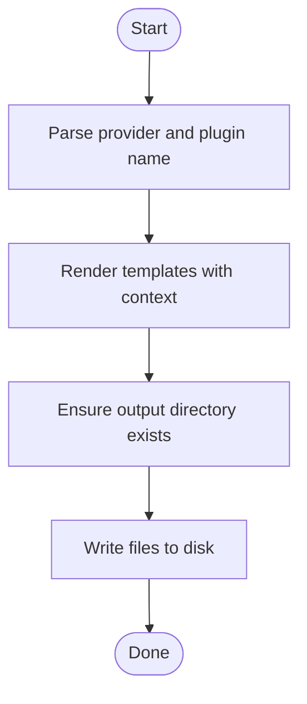

**Diagram sources**
- [newplugin.py:225-247](file://programs/util/newplugin.py#L225-L247)

**Section sources**
- [newplugin.py:1-251](file://programs/util/newplugin.py#L1-L251)

### pretty_schema.py (Python)
Connects to a local debug node JSON-RPC endpoint to retrieve the schema, parses it, pretty-prints it, and handles embedded JSON strings.

Key behaviors:
- Sends a JSON-RPC POST request to the debug node API
- Converts the returned string schema to JSON
- Pretty-prints the schema with indentation and sorted keys

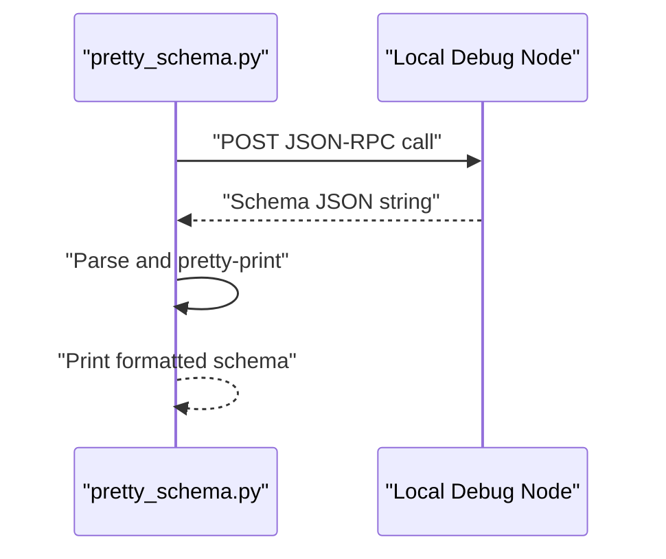

**Diagram sources**
- [pretty_schema.py:9-27](file://programs/util/pretty_schema.py#L9-L27)

**Section sources**
- [pretty_schema.py:1-28](file://programs/util/pretty_schema.py#L1-L28)

### schema_test.cpp (C++)
Demonstrates retrieving and printing schema information for specific chain objects. It uses the schema API to gather dependent schemas and prints names, dependencies, and serialized schema strings.

Key behaviors:
- Includes schema headers and chain objects
- Defines a test struct with FC_REFLECT
- Retrieves schemas for chain objects and dependent schemas
- Prints schema metadata to stdout

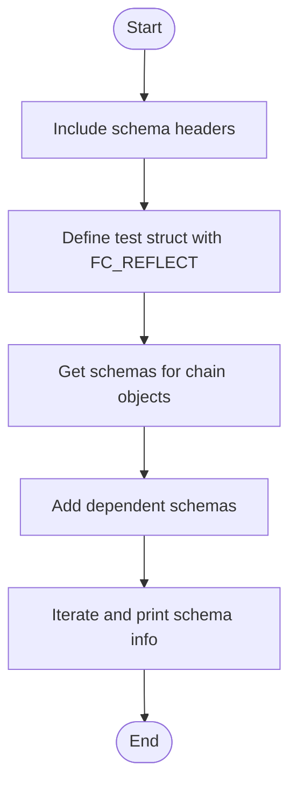

**Diagram sources**
- [schema_test.cpp:15-56](file://programs/util/schema_test.cpp#L15-L56)

**Section sources**
- [schema_test.cpp:1-57](file://programs/util/schema_test.cpp#L1-L57)

### configure_build.py (Python)
A helper to invoke cmake with sensible defaults and optional flags for cross-compilation and external libraries. It supports environment variables for locating Boost and OpenSSL, and passes through additional cmake options.

Key behaviors:
- Parses command-line arguments with mutually exclusive groups
- Resolves environment variables for SYS_ROOT, BOOST_ROOT, OPENSSL_ROOT_DIR
- Detects Boost version and adds appropriate flags
- Supports Windows cross-compilation with MinGW
- Builds and executes cmake with collected options

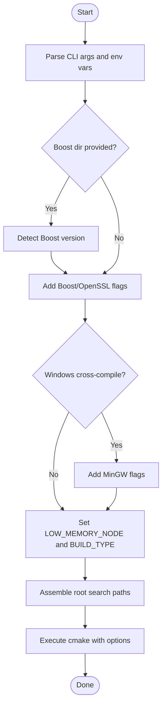

**Diagram sources**
- [configure_build.py:143-196](file://programs/build_helpers/configure_build.py#L143-L196)

**Section sources**
- [configure_build.py:1-202](file://programs/build_helpers/configure_build.py#L1-L202)

## Dependency Analysis
The build helper tools depend on standard libraries and external systems:
- **install-deps-linux.sh**: Depends on system package managers (apt-get/dnf) and root privileges
- **build-linux.sh**: Depends on CMake, make, and system-level build tools
- **build-mac.sh**: Depends on Homebrew, Xcode Command Line Tools, and macOS-specific tools
- cat-parts and cat_parts.py depend on filesystem semantics and sorting
- check_reflect.py depends on Doxygen XML and regular expressions
- newplugin.py depends on Python's string templating and filesystem operations
- pretty_schema.py depends on a running debug node and JSON-RPC
- schema_test.cpp depends on schema headers and chain objects
- configure_build.py depends on cmake, environment variables, and optional toolchains

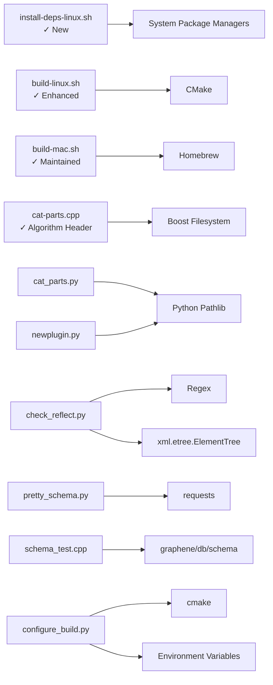

**Diagram sources**
- [install-deps-linux.sh:34-106](file://install-deps-linux.sh#L34-L106)
- [build-linux.sh:155-165](file://build-linux.sh#L155-L165)
- [build-mac.sh:126-171](file://build-mac.sh#L126-L171)
- [cat-parts.cpp:1-6](file://programs/build_helpers/cat-parts.cpp#L1-L6)
- [cat_parts.py:3-4](file://programs/build_helpers/cat_parts.py#L3-L4)
- [check_reflect.py:3-6](file://programs/build_helpers/check_reflect.py#L3-L6)
- [newplugin.py:1-2](file://programs/util/newplugin.py#L1-L2)
- [pretty_schema.py:3-5](file://programs/util/pretty_schema.py#L3-L5)
- [schema_test.cpp:1-3](file://programs/util/schema_test.cpp#L1-L3)
- [configure_build.py:3-6](file://programs/build_helpers/configure_build.py#L3-L6)

**Section sources**
- [install-deps-linux.sh:1-113](file://install-deps-linux.sh#L1-L113)
- [build-linux.sh:1-191](file://build-linux.sh#L1-L191)
- [build-mac.sh:1-242](file://build-mac.sh#L1-L242)
- [cat-parts.cpp:1-6](file://programs/build_helpers/cat-parts.cpp#L1-L6)
- [cat_parts.py:3-4](file://programs/build_helpers/cat_parts.py#L3-L4)
- [check_reflect.py:3-6](file://programs/build_helpers/check_reflect.py#L3-L6)
- [newplugin.py:1-2](file://programs/util/newplugin.py#L1-L2)
- [pretty_schema.py:3-5](file://programs/util/pretty_schema.py#L3-L5)
- [schema_test.cpp:1-3](file://programs/util/schema_test.cpp#L1-L3)
- [configure_build.py:3-6](file://programs/build_helpers/configure_build.py#L3-L6)

## Performance Considerations
- **install-deps-linux.sh**: Package installation performance varies by distribution and network connectivity; consider caching and offline installation for CI environments
- **build-linux.sh**: Enhanced with --clean option for guaranteed clean builds, which may take longer but ensures reproducibility
- **build-mac.sh**: Maintains --skip-deps option for efficient Homebrew dependency management
- cat-parts and cat_parts.py: Sorting and reading many small .hf files is efficient; the up-to-date check avoids unnecessary writes
- check_reflect.py: Walking source trees and parsing XML can be slow on large projects; restrict scanning to necessary directories if needed
- pretty_schema.py: Network latency to the debug node can dominate; cache results locally if regenerating frequently
- schema_test.cpp: Schema traversal is lightweight for a small set of types; adding many types increases runtime linearly
- configure_build.py: cmake invocation overhead is minimal compared to the build itself; passing additional flags can increase configuration time slightly

[No sources needed since this section provides general guidance]

## Compilation Correctness and Best Practices

### Header Management Standards
The cat-parts utility demonstrates proper C++ header management practices that enhance compilation reliability:

**Algorithm Header Inclusion**
- The `<algorithm>` header is properly included to support std::sort operations
- This prevents compilation issues across different compiler environments
- Ensures consistent behavior regardless of platform-specific header implementations

**Best Practices for Header Management**
- Always include headers for functions you use (std::sort requires <algorithm>)
- Place standard library headers before third-party headers
- Keep header includes minimal and specific
- Consider header ordering for compilation speed and predictability

**Cross-Platform Compatibility**
- Proper header inclusion prevents environment-specific compilation failures
- Reduces reliance on implicit declarations that vary between compilers
- Enhances portability across different development environments

**Section sources**
- [cat-parts.cpp:4-33](file://programs/build_helpers/cat-parts.cpp#L4-L33)

## Security and Build System Architecture

### Enhanced Build System Security
The new dependency installer script and improved build architecture significantly enhance security practices:

**Separation of Privileges**
- System-level dependency installation requires root privileges (sudo)
- Main build process runs as regular user for security isolation
- Prevents privilege escalation during build operations

**Clean Build Architecture**
- The --clean option ensures fresh build directories are created
- Eliminates potential contamination from previous builds
- Improves reproducibility and debugging capabilities

**Improved Error Handling**
- Comprehensive error checking and user feedback
- Clear separation between dependency management and build processes
- Better logging and diagnostic information

**Section sources**
- [install-deps-linux.sh:28-31](file://install-deps-linux.sh#L28-L31)
- [build-linux.sh:57-61](file://build-linux.sh#L57-L61)
- [build-linux.sh:83-84](file://build-linux.sh#L83-L84)

## Troubleshooting Guide
Common issues and resolutions:
- **install-deps-linux.sh**
  - Symptom: Permission denied error
  - Resolution: Run with sudo privileges as required by the script
  - Symptom: Unsupported package manager detected
  - Resolution: Install dependencies manually or use supported distributions
- **build-linux.sh**
  - Symptom: Cannot run as root
  - Resolution: Install dependencies first with sudo ./install-deps-linux.sh, then run build as regular user
  - Symptom: Clean build takes too long
  - Resolution: Use --clean option for guaranteed clean builds; consider incremental builds for development
  - Symptom: Build fails due to missing dependencies
  - Resolution: Re-run dependency installer or install missing packages manually
- **build-mac.sh**
  - Symptom: Xcode Command Line Tools not found
  - Resolution: Install Xcode Command Line Tools using xcode-select --install
  - Symptom: Homebrew not detected
  - Resolution: Install Homebrew from https://brew.sh/ and ensure it's in PATH
  - Symptom: --skip-deps option not working
  - Resolution: This option is maintained for macOS compatibility; use --skip-deps to skip Homebrew installation
- **cat-parts/cat_parts.py**
  - Symptom: Incorrect number of arguments or invalid directory.
  - Resolution: Ensure two arguments are provided: input directory and output file. Verify the directory exists and is readable.
  - Symptom: Output not written despite changes.
  - Resolution: Confirm that the concatenated content differs from the existing output; otherwise, the tool considers it up-to-date.
- **check_reflect.py**
  - Symptom: No Doxygen XML found.
  - Resolution: Run doxygen to generate XML before invoking the tool.
  - Symptom: Reflection mismatch reported.
  - Resolution: Align FC_REFLECT declarations with actual class members; remove duplicates and ensure completeness.
- **newplugin.py**
  - Symptom: Permission denied when writing files.
  - Resolution: Ensure the destination directory is writable; run with appropriate privileges.
  - Symptom: Generated files not linked into the build.
  - Resolution: Add the plugin's CMakeLists.txt to the parent CMakeLists.txt and ensure target_link_libraries includes required libraries.
- **pretty_schema.py**
  - Symptom: Connection refused or timeout.
  - Resolution: Start the debug node and ensure the JSON-RPC endpoint is reachable on the configured address.
- **schema_test.cpp**
  - Symptom: Link errors for schema headers.
  - Resolution: Ensure the schema headers are available and the target links against graphene_chain and fc.
- **configure_build.py**
  - Symptom: cmake cannot find Boost or OpenSSL.
  - Resolution: Set BOOST_ROOT and OPENSSL_ROOT_DIR environment variables or pass --boost-dir and --openssl-dir.
  - Symptom: Cross-compilation fails.
  - Resolution: Ensure MinGW toolchain is installed and CMAKE_FIND_ROOT_PATH_MODE settings are correct.

**Section sources**
- [install-deps-linux.sh:28-31](file://install-deps-linux.sh#L28-L31)
- [build-linux.sh:57-61](file://build-linux.sh#L57-L61)
- [build-linux.sh:83-84](file://build-linux.sh#L83-L84)
- [build-mac.sh:108-114](file://build-mac.sh#L108-L114)
- [build-mac.sh:118-122](file://build-mac.sh#L118-L122)
- [build-mac.sh:71-72](file://build-mac.sh#L71-L72)
- [cat-parts.cpp:8-11](file://programs/build_helpers/cat-parts.cpp#L8-L11)
- [cat_parts.py:29-36](file://programs/build_helpers/cat_parts.py#L29-L36)
- [check_reflect.py:44-49](file://programs/build_helpers/check_reflect.py#L44-L49)
- [newplugin.py:236-244](file://programs/util/newplugin.py#L236-L244)
- [pretty_schema.py:9-12](file://programs/util/pretty_schema.py#L9-L12)
- [schema_test.cpp:1-3](file://programs/util/schema_test.cpp#L1-L3)
- [configure_build.py:114-118](file://programs/build_helpers/configure_build.py#L114-L118)

## Conclusion
These build helper tools automate repetitive tasks, enforce consistency, and integrate cleanly with the CMake-based build system. The recent enhancements, particularly the addition of the install-deps-linux.sh dependency installer script and the improved build architecture with --clean option, demonstrate best practices for C++ development that enhance security, maintainability, and reproducibility. The separation of dependency management from the main build process provides better security isolation and cleaner build environments. By following the documented usage patterns and best practices, developers can maintain organized codebases, validate reflection integrity, scaffold plugins efficiently, and inspect schemas reliably while benefiting from improved security and build system architecture.

[No sources needed since this section summarizes without analyzing specific files]

## Appendices

### Practical Examples

- **Install system dependencies (Linux)**
  - Use install-deps-linux.sh to install all required system dependencies with root privileges
  - Example command: sudo ./install-deps-linux.sh

- **Build VIZ node (Linux)**
  - Use build-linux.sh to configure and build the VIZ node after dependencies are installed
  - Example command: ./build-linux.sh --clean --install
  - Note: Must run as regular user (not root)

- **Build VIZ node (macOS)**
  - Use build-mac.sh to configure and build the VIZ node with Homebrew dependencies
  - Example command: ./build-mac.sh --skip-deps --install

- Assemble hardfork fragments
  - Use cat_parts.py to concatenate .hf files from a directory into a single output file. The tool ensures the output is only rewritten when content changes.
  - Example command: python3 programs/build_helpers/cat_parts.py libraries/chain/hardfork.d build/hardforks.inc

- Validate reflection declarations
  - Run check_reflect.py after generating Doxygen XML to compare FC_REFLECT declarations with class members. Fix reported mismatches and duplicates.
  - Example command: python3 programs/build_helpers/check_reflect.py

- Scaffold a new plugin
  - Use newplugin.py to generate a plugin skeleton under libraries/plugins/<plugin_name>. Customize the generated files and integrate with CMake.
  - Example command: python3 programs/util/newplugin.py viz myplugin

- Pretty-print schema
  - Use pretty_schema.py to fetch and format the schema from a running debug node. Pipe to a file for inspection.
  - Example command: python3 programs/util/pretty_schema.py > schema.json

- Test schema retrieval
  - Build and run schema_test.cpp to print schema information for specific chain objects. Useful for debugging schema-related issues.
  - Example command: make schema_test && ./bin/schema_test

- Configure and build
  - Use configure_build.py to invoke cmake with sensible defaults and optional flags for cross-compilation and external libraries.
  - Example command: python3 programs/build_helpers/configure_build.py --boost-dir /opt/boost --openssl-dir /opt/openssl

**Section sources**
- [install-deps-linux.sh:8-9](file://install-deps-linux.sh#L8-L9)
- [build-linux.sh:14-15](file://build-linux.sh#L14-L15)
- [build-linux.sh:204](file://build-linux.sh#L204)
- [build-mac.sh:12-13](file://build-mac.sh#L12-L13)
- [build-mac.sh:349](file://build-mac.sh#L349)
- [cat_parts.py:28-69](file://programs/build_helpers/cat_parts.py#L28-L69)
- [check_reflect.py:153-160](file://programs/build_helpers/check_reflect.py#L153-L160)
- [newplugin.py:225-247](file://programs/util/newplugin.py#L225-L247)
- [pretty_schema.py:9-27](file://programs/util/pretty_schema.py#L9-L27)
- [schema_test.cpp:44-56](file://programs/util/schema_test.cpp#L44-L56)
- [configure_build.py:143-196](file://programs/build_helpers/configure_build.py#L143-L196)

### Integration with Main Build Process
- **CMake targets**
  - cat-parts is built as an executable and linked against fc and platform libs. Use it in custom targets or prebuild steps.
  - Utilities like pretty_schema.py and schema_test.cpp are standalone scripts/executables; integrate them into CI or developer workflows as needed.
- **Build options**
  - Refer to documentation/building.md for CMAKE_BUILD_TYPE and LOW_MEMORY_NODE options. configure_build.py sets these defaults and forwards additional cmake options.
- **New dependency management**
  - The install-deps-linux.sh script is designed to be run separately from the main build process
  - Dependencies are installed once (per system) and cached for subsequent builds
  - Build scripts automatically detect and use installed dependencies

**Section sources**
- [CMakeLists.txt (build_helpers):1-8](file://programs/build_helpers/CMakeLists.txt#L1-L8)
- [CMakeLists.txt (util):46-56](file://programs/util/CMakeLists.txt#L46-L56)
- [building.md:189-220](file://documentation/building.md#L189-L220)
- [README.md:7-10](file://README.md#L7-L10)