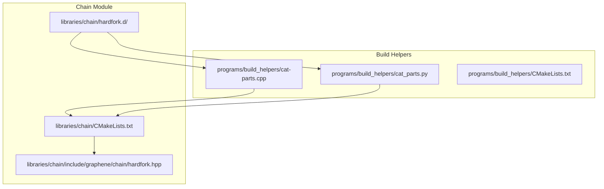
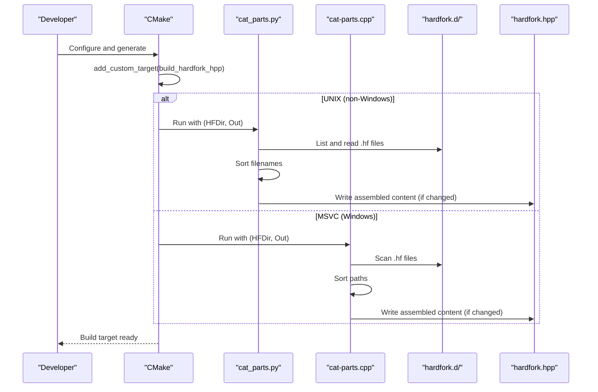
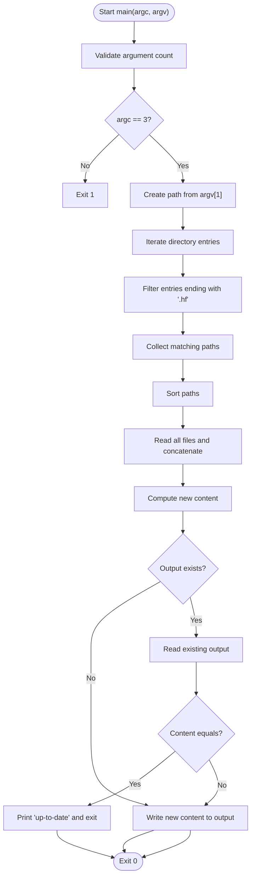
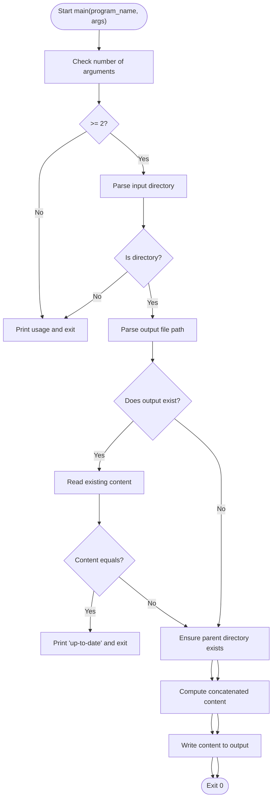
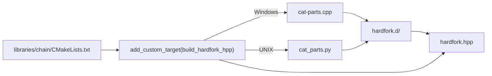
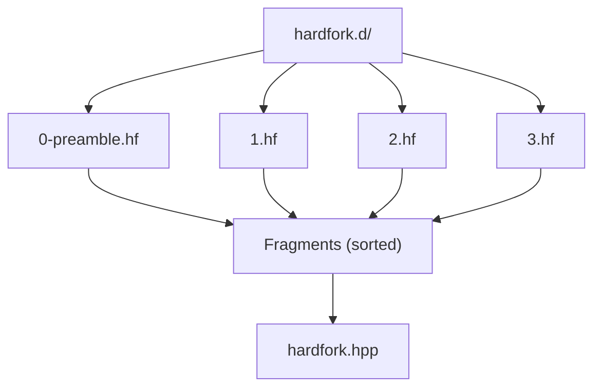
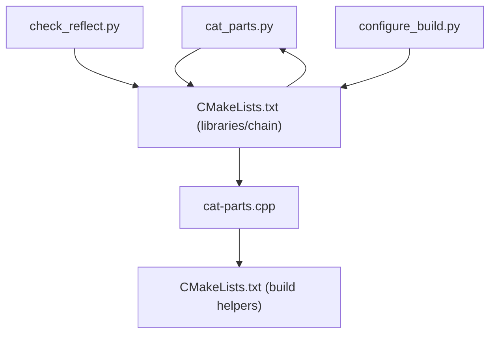

# Code Assembly Tools

<cite>
**Referenced Files in This Document**
- [cat-parts.cpp](file://programs/build_helpers/cat-parts.cpp)
- [cat_parts.py](file://programs/build_helpers/cat_parts.py)
- [CMakeLists.txt (build helpers)](file://programs/build_helpers/CMakeLists.txt)
- [CMakeLists.txt (libraries/chain)](file://libraries/chain/CMakeLists.txt)
- [0-preamble.hf](file://libraries/chain/hardfork.d/0-preamble.hf)
- [1.hf](file://libraries/chain/hardfork.d/1.hf)
- [2.hf](file://libraries/chain/hardfork.d/2.hf)
- [3.hf](file://libraries/chain/hardfork.d/3.hf)
- [configure_build.py](file://programs/build_helpers/configure_build.py)
- [check_reflect.py](file://programs/build_helpers/check_reflect.py)
</cite>

## Table of Contents
1. [Introduction](#introduction)
2. [Project Structure](#project-structure)
3. [Core Components](#core-components)
4. [Architecture Overview](#architecture-overview)
5. [Detailed Component Analysis](#detailed-component-analysis)
6. [Dependency Analysis](#dependency-analysis)
7. [Performance Considerations](#performance-considerations)
8. [Troubleshooting Guide](#troubleshooting-guide)
9. [Conclusion](#conclusion)
10. [Appendices](#appendices)

## Introduction
This document explains the code assembly tools used by the VIZ C++ Node build pipeline. It focuses on:
- The C++ utility cat-parts.cpp for assembling hardfork header files from a directory of fragments.
- The Python counterpart cat_parts.py for similar automation, including change detection and output directory creation.
- The integration of these tools into the CMake build system via custom targets.
- Practical usage scenarios for schema assembly and automated builds.
- Command-line options, input validation, error handling, and troubleshooting guidance.

## Project Structure
The code assembly tools live under programs/build_helpers and are consumed by the libraries/chain module, which organizes hardfork-related fragments in a dedicated directory.

**Diagram sources**
- [CMakeLists.txt (build helpers)](file://programs/build_helpers/CMakeLists.txt#L1-L8)
- [CMakeLists.txt (libraries/chain)](file://libraries/chain/CMakeLists.txt#L1-L12)
- [cat-parts.cpp](file://programs/build_helpers/cat-parts.cpp#L1-L68)
- [cat_parts.py](file://programs/build_helpers/cat_parts.py#L1-L74)

**Section sources**
- [CMakeLists.txt (build helpers)](file://programs/build_helpers/CMakeLists.txt#L1-L8)
- [CMakeLists.txt (libraries/chain)](file://libraries/chain/CMakeLists.txt#L1-L12)

## Core Components
- cat-parts.cpp: A C++ program that scans a directory for files ending with .hf, sorts them, concatenates their contents, and writes the result to an output file. It compares the new content with the existing output file and exits early if unchanged.
- cat_parts.py: A Python script that performs equivalent logic with explicit input validation, output directory creation, and change detection.
- CMake integration: Custom targets generate the hardfork.hpp file from hardfork.d fragments during the build.

Key behaviors:
- Directory scanning: Filters entries by extension and constructs a sorted list of fragment files.
- Concatenation: Reads each file and appends its content to a buffer.
- Change detection: Compares the computed content with the existing output file; if equal, skips writing.
- Output: Writes the assembled content to the target file.

**Section sources**
- [cat-parts.cpp](file://programs/build_helpers/cat-parts.cpp#L7-L68)
- [cat_parts.py](file://programs/build_helpers/cat_parts.py#L11-L69)
- [CMakeLists.txt (libraries/chain)](file://libraries/chain/CMakeLists.txt#L1-L12)

## Architecture Overview
The build system orchestrates code assembly through CMake custom targets. On Unix-like systems, the Python script is invoked; on Windows, the native C++ utility is used. Both produce the same output file from the same input directory of fragments.

**Diagram sources**
- [CMakeLists.txt (libraries/chain)](file://libraries/chain/CMakeLists.txt#L1-L9)
- [cat_parts.py](file://programs/build_helpers/cat_parts.py#L28-L69)
- [cat-parts.cpp](file://programs/build_helpers/cat-parts.cpp#L15-L66)

## Detailed Component Analysis

### cat-parts.cpp
Purpose:
- Assemble hardfork fragments into a single header file.
- Provide change detection to avoid unnecessary rebuilds.

Command-line syntax:
- Syntax: cat-parts DIR OUTFILE
- Exits with non-zero status on invalid arguments or filesystem errors.

Directory scanning logic:
- Iterates over directory entries.
- Filters entries whose names end with ".hf".
- Collects matching paths into a vector.

Sorting algorithm:
- Sorts collected paths lexicographically.

Concatenation process:
- Opens each file and appends its content to a string buffer.
- Writes the buffer to the output file if it differs from the existing content.

Change detection:
- Reads the existing output file into memory.
- Compares the computed content with the existing content.
- Prints a message and exits early if identical.

Error handling:
- Catches filesystem errors and prints diagnostic messages.
- Returns non-zero status on failure.

**Diagram sources**
- [cat-parts.cpp](file://programs/build_helpers/cat-parts.cpp#L7-L68)

**Section sources**
- [cat-parts.cpp](file://programs/build_helpers/cat-parts.cpp#L7-L68)

### cat_parts.py
Purpose:
- Provide a portable, Python-based alternative to cat-parts.cpp.
- Offer robust input validation and automatic output directory creation.

Command-line syntax:
- Syntax: cat_parts.py DIR OUTFILE
- Prints usage and exits with non-zero status if arguments are missing or invalid.

Input validation:
- Validates that the input directory exists and is a directory.
- Ensures the output path is a file (not a directory) when it exists.

Change detection:
- Reads the existing output file and compares it with newly computed content.
- Skips writing if contents match.

Output directory creation:
- Creates parent directories recursively if they do not exist.
- Handles common exceptions during directory creation.

**Diagram sources**
- [cat_parts.py](file://programs/build_helpers/cat_parts.py#L28-L69)

**Section sources**
- [cat_parts.py](file://programs/build_helpers/cat_parts.py#L1-L74)

### CMake Integration
- Adds a custom target that generates hardfork.hpp from hardfork.d.
- Uses cat-parts.cpp on Windows and cat_parts.py on UNIX-like systems.
- Marks the generated file as GENERATED for proper build semantics.
- Adds a dependency so the chain library links against the generated header.

**Diagram sources**
- [CMakeLists.txt (libraries/chain)](file://libraries/chain/CMakeLists.txt#L1-L12)
- [CMakeLists.txt (build helpers)](file://programs/build_helpers/CMakeLists.txt#L1-L8)

**Section sources**
- [CMakeLists.txt (libraries/chain)](file://libraries/chain/CMakeLists.txt#L1-L12)
- [CMakeLists.txt (build helpers)](file://programs/build_helpers/CMakeLists.txt#L1-L8)

### Hardfork Directory Processing Mechanism
- Fragment files are named with .hf extension and placed under hardfork.d.
- The assembly tools sort these files lexicographically to define the order of inclusion.
- Example fragments include preamble definitions and version/time constants for specific hardforks.

**Diagram sources**
- [0-preamble.hf](file://libraries/chain/hardfork.d/0-preamble.hf#L1-L56)
- [1.hf](file://libraries/chain/hardfork.d/1.hf#L1-L7)
- [2.hf](file://libraries/chain/hardfork.d/2.hf#L1-L7)
- [3.hf](file://libraries/chain/hardfork.d/3.hf#L1-L7)

**Section sources**
- [0-preamble.hf](file://libraries/chain/hardfork.d/0-preamble.hf#L1-L56)
- [1.hf](file://libraries/chain/hardfork.d/1.hf#L1-L7)
- [2.hf](file://libraries/chain/hardfork.d/2.hf#L1-L7)
- [3.hf](file://libraries/chain/hardfork.d/3.hf#L1-L7)

## Dependency Analysis
- cat-parts.cpp depends on Boost.Filesystem for directory traversal and file I/O.
- cat_parts.py uses pathlib for path manipulation and file I/O.
- The CMake build integrates both tools into the chain library build process.
- Additional build helpers exist for reflection checks and build configuration, complementing the assembly workflow.

**Diagram sources**
- [CMakeLists.txt (build helpers)](file://programs/build_helpers/CMakeLists.txt#L1-L8)
- [CMakeLists.txt (libraries/chain)](file://libraries/chain/CMakeLists.txt#L1-L12)
- [check_reflect.py](file://programs/build_helpers/check_reflect.py#L1-L160)
- [configure_build.py](file://programs/build_helpers/configure_build.py#L1-L202)

**Section sources**
- [CMakeLists.txt (build helpers)](file://programs/build_helpers/CMakeLists.txt#L1-L8)
- [CMakeLists.txt (libraries/chain)](file://libraries/chain/CMakeLists.txt#L1-L12)
- [check_reflect.py](file://programs/build_helpers/check_reflect.py#L1-L160)
- [configure_build.py](file://programs/build_helpers/configure_build.py#L1-L202)

## Performance Considerations
- Sorting cost: Lexicographic sorting of fragment paths is O(n log n); acceptable for small to moderate numbers of fragments typical in hardfork.d.
- I/O cost: Reading all fragments and writing the output is linear in total content size; efficient for typical hardfork fragment sizes.
- Change detection avoids unnecessary writes and rebuilds, reducing downstream compilation work.
- Using the native C++ tool on Windows and Python tool on UNIX leverages platform-specific strengths.

## Troubleshooting Guide
Common issues and resolutions:
- Incorrect command syntax:
  - Ensure the utility receives exactly two arguments: the input directory and the output file path.
- Input directory does not exist or is not a directory:
  - Verify the path to hardfork.d and permissions to read it.
- Output path is not a file:
  - Ensure the output path points to a regular file; the Python tool validates this and exits with an error if not.
- Output directory creation fails:
  - The Python tool attempts to create parent directories; check write permissions for the parent directory.
- Filesystem errors:
  - The C++ tool catches filesystem errors and prints diagnostics; review stderr output for details.
- Permission problems:
  - Ensure read access to all .hf files and write access to the output file’s directory.
- Fragment ordering concerns:
  - Confirm lexicographic sorting matches intended order; rename files if necessary to achieve desired sequence.

Integration tips:
- On Windows, the CMake target invokes the C++ utility; on UNIX-like systems, the Python script is used.
- The generated header is marked as GENERATED and included in the chain library build.

**Section sources**
- [cat-parts.cpp](file://programs/build_helpers/cat-parts.cpp#L8-L11)
- [cat_parts.py](file://programs/build_helpers/cat_parts.py#L28-L43)
- [CMakeLists.txt (libraries/chain)](file://libraries/chain/CMakeLists.txt#L1-L9)

## Conclusion
The VIZ C++ Node code assembly tools provide a reliable, cross-platform mechanism to generate hardfork.hpp from a collection of .hf fragments. The C++ and Python utilities implement consistent logic with change detection and robust error handling, while CMake integrates them seamlessly into the build pipeline. These tools enable maintainable schema assembly and automated build processes for the chain module.

## Appendices

### Practical Examples
- Generating hardfork.hpp from hardfork.d:
  - Windows: cat-parts hardfork.d hardfork.hpp
  - UNIX-like: python3 cat_parts.py hardfork.d hardfork.hpp
- Automated build integration:
  - CMake adds a custom target that runs the appropriate tool and produces hardfork.hpp.
- Schema assembly:
  - Place preprocessor definitions and version/time constants in .hf files within hardfork.d; the tools will assemble them in lexicographic order.

### Related Build Helpers
- Reflection validation: check_reflect.py compares Doxygen-derived member lists with FC_REFLECT declarations to detect mismatches.
- Build configuration: configure_build.py helps set up CMake with optional flags and environment-driven paths.

**Section sources**
- [check_reflect.py](file://programs/build_helpers/check_reflect.py#L1-L160)
- [configure_build.py](file://programs/build_helpers/configure_build.py#L1-L202)