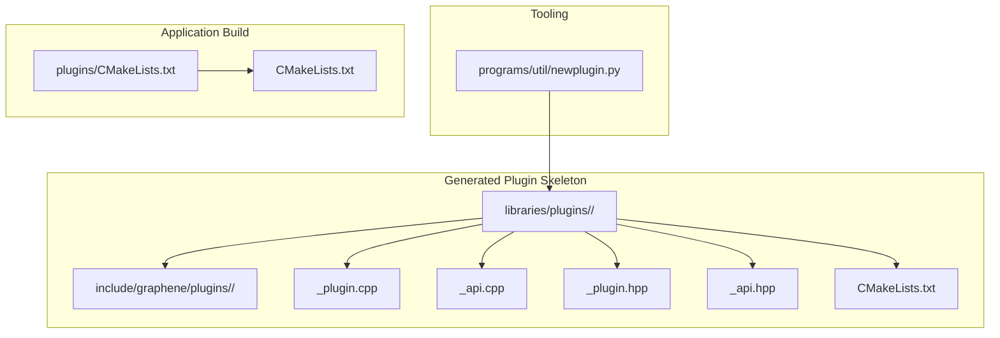
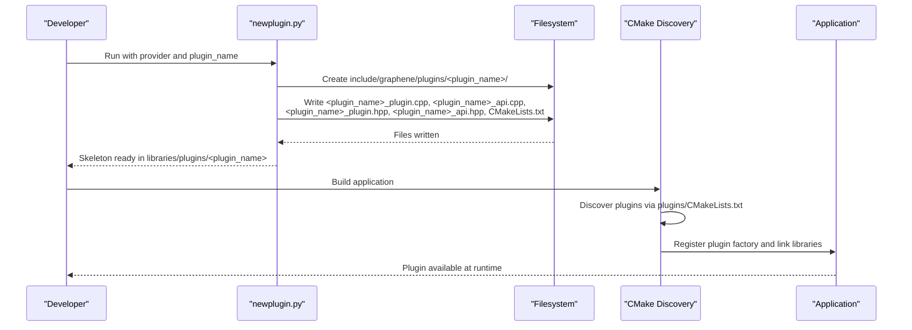
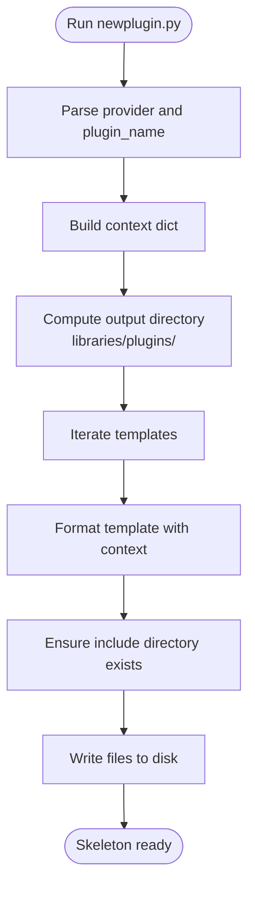
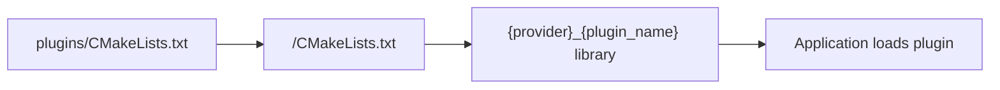
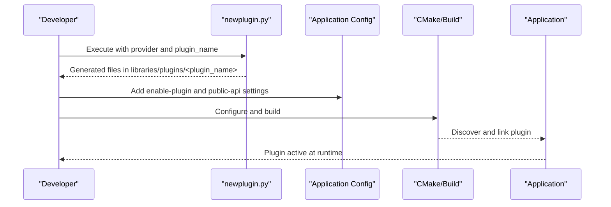
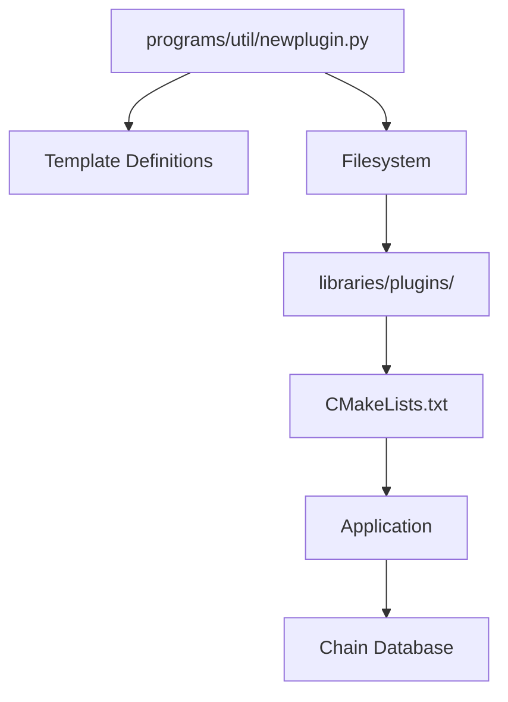

# Plugin Development Tools

<cite>
**Referenced Files in This Document**
- [newplugin.py](file://programs/util/newplugin.py)
- [plugin.md](file://documentation/plugin.md)
- [building.md](file://documentation/building.md)
- [CMakeLists.txt (plugins root)](file://plugins/CMakeLists.txt)
- [CMakeLists.txt (main)](file://CMakeLists.txt)
- [account_by_key_plugin.cpp](file://plugins/account_by_key/plugin.cpp)
- [account_by_key_plugin.hpp](file://plugins/account_by_key/include/graphene/plugins/account_by_key/account_by_key_plugin.hpp)
- [account_by_key_objects.hpp](file://plugins/account_by_key/include/graphene/plugins/account_by_key/account_by_key_objects.hpp)
- [chain_plugin.cpp](file://plugins/chain/plugin.cpp)
- [debug_node_plugin.cpp](file://plugins/debug_node/plugin.cpp)
</cite>

## Table of Contents
1. [Introduction](#introduction)
2. [Project Structure](#project-structure)
3. [Core Components](#core-components)
4. [Architecture Overview](#architecture-overview)
5. [Detailed Component Analysis](#detailed-component-analysis)
6. [Dependency Analysis](#dependency-analysis)
7. [Performance Considerations](#performance-considerations)
8. [Troubleshooting Guide](#troubleshooting-guide)
9. [Conclusion](#conclusion)
10. [Appendices](#appendices)

## Introduction
This document explains the VIZ CPP Node plugin development tool and the template system used to generate custom plugin boilerplate code. It covers the directory structure generation, header and implementation skeleton templates, plugin naming conventions, file organization patterns, and integration requirements into the main application. It also provides step-by-step examples for creating new plugins, modifying generated code, and integrating plugins into the application, along with command-line options, customization parameters, best practices, common pitfalls, testing strategies, and deployment considerations.

## Project Structure
The plugin development workflow centers around a Python script that generates a standardized plugin skeleton under the libraries/plugins directory. The generated plugin integrates with the application via CMake discovery and registration mechanisms.

**Diagram sources**
- [newplugin.py](file://programs/util/newplugin.py#L236-L246)
- [CMakeLists.txt (plugins root)](file://plugins/CMakeLists.txt#L1-L12)
- [CMakeLists.txt (main)](file://CMakeLists.txt#L210-L213)

**Section sources**
- [newplugin.py](file://programs/util/newplugin.py#L1-L251)
- [plugin.md](file://documentation/plugin.md#L1-L28)
- [CMakeLists.txt (plugins root)](file://plugins/CMakeLists.txt#L1-L12)
- [CMakeLists.txt (main)](file://CMakeLists.txt#L210-L213)

## Core Components
- Template engine: A dictionary of file templates keyed by destination paths. Each template contains placeholders for provider and plugin name.
- CLI interface: Accepts provider and plugin name arguments to drive template instantiation.
- Directory generation: Creates include directories and writes all generated files into a new plugin folder under libraries/plugins/<plugin_name>.
- Integration hooks: Generated CMakeLists.txt links against core libraries and registers the plugin via a macro.

Key behaviors:
- Provider naming convention: The provider is a namespace identifier (e.g., viz) used to prefix namespaces and plugin factories.
- Plugin naming convention: The plugin name becomes part of the namespace and filenames.
- Generated files: Header and implementation files for plugin and API classes, plus a CMakeLists.txt tailored for linking and inclusion.

**Section sources**
- [newplugin.py](file://programs/util/newplugin.py#L3-L218)
- [newplugin.py](file://programs/util/newplugin.py#L225-L246)

## Architecture Overview
The plugin generation tool produces a complete, buildable skeleton that integrates with the application’s CMake-based plugin discovery and registration system.

**Diagram sources**
- [newplugin.py](file://programs/util/newplugin.py#L225-L246)
- [CMakeLists.txt (plugins root)](file://plugins/CMakeLists.txt#L1-L12)
- [CMakeLists.txt (main)](file://CMakeLists.txt#L210-L213)

## Detailed Component Analysis

### Template System and File Generation
The template system defines:
- CMakeLists.txt: Adds the library, links against core libraries, and sets include directories.
- Plugin header: Declares the plugin class inheriting from the framework’s plugin base.
- Plugin implementation: Implements lifecycle methods and connects to the chain database.
- API header: Declares the API class and FC_API method list.
- API implementation: Provides API factory registration and helper accessors.

**Diagram sources**
- [newplugin.py](file://programs/util/newplugin.py#L225-L246)

**Section sources**
- [newplugin.py](file://programs/util/newplugin.py#L3-L218)
- [newplugin.py](file://programs/util/newplugin.py#L225-L246)

### Plugin Naming Conventions and File Organization
- Provider: Used as a namespace prefix for plugin and API classes.
- Plugin Name: Used as the base for class names, filenames, and CMake target names.
- Include Path Pattern: include/graphene/plugins/<plugin_name>/<plugin_name>_*.hpp
- Implementation Files: <plugin_name>_plugin.cpp and <plugin_name>_api.cpp
- CMake Target: {provider}_{plugin_name}

Best practices:
- Choose a concise, lowercase provider name.
- Use a descriptive, lowercase plugin name.
- Keep include paths aligned with the pattern to ensure CMake discovery works correctly.

**Section sources**
- [newplugin.py](file://programs/util/newplugin.py#L3-L218)

### Integration Requirements
- CMake Discovery: The plugins root CMakeLists.txt scans subdirectories and adds discovered plugin directories to a list used by the application.
- Link Libraries: Generated CMakeLists.txt links against core libraries (application, chain, protocol).
- Registration Macro: The plugin implementation uses a macro to register the plugin factory with the application.

**Diagram sources**
- [CMakeLists.txt (plugins root)](file://plugins/CMakeLists.txt#L1-L12)
- [newplugin.py](file://programs/util/newplugin.py#L4-L16)

**Section sources**
- [CMakeLists.txt (plugins root)](file://plugins/CMakeLists.txt#L1-L12)
- [newplugin.py](file://programs/util/newplugin.py#L4-L16)

### Step-by-Step Example: Creating a New Plugin
- Prepare: Ensure the environment supports building the project.
- Generate: Run the tool with provider and plugin name to scaffold the plugin.
- Review: Confirm include paths, class names, and CMake target names match expectations.
- Customize: Implement plugin initialization, API methods, and database connections.
- Build: Configure and build the application; the plugin is discovered and linked automatically.
- Enable: Configure the application to enable the plugin and any required dependencies.

**Diagram sources**
- [newplugin.py](file://programs/util/newplugin.py#L225-L246)
- [plugin.md](file://documentation/plugin.md#L11-L28)

**Section sources**
- [plugin.md](file://documentation/plugin.md#L11-L28)
- [building.md](file://documentation/building.md#L1-L212)

### Command-Line Options and Customization Parameters
- Provider: Namespace identifier for plugin and API classes.
- Plugin Name: Base name for all generated files and targets.
- CMake Parameters: Adjust include directories and link libraries as needed in the generated CMakeLists.txt.

Customization tips:
- Modify the generated CMakeLists.txt to add extra include directories or link additional libraries.
- Update plugin and API headers to declare new methods and reflection lists.
- Implement plugin lifecycle methods to register signal handlers and API factories.

**Section sources**
- [newplugin.py](file://programs/util/newplugin.py#L225-L246)
- [newplugin.py](file://programs/util/newplugin.py#L4-L16)

### Best Practices for Plugin Development
- Keep plugin logic decoupled from UI; expose functionality via APIs.
- Use the plugin’s startup/shutdown methods to register/unregister signal handlers.
- Reflect API methods in the FC_API declaration to expose them to clients.
- Avoid heavy computations in hot paths; defer to worker threads when necessary.
- Use database snapshots and weak read locks for safe reads in APIs.

**Section sources**
- [plugin.md](file://documentation/plugin.md#L21-L28)

### Common Plugin Development Pitfalls
- Incorrect include paths preventing CMake discovery.
- Missing API method declarations in FC_API leading to unavailable RPC endpoints.
- Forgetting to register the API factory during plugin startup.
- Not handling chain events properly, causing missed updates or crashes.
- Enabling/disabling plugins that maintain persistent state without replaying the chain.

Mitigation:
- Verify include directories match the expected pattern.
- Ensure all declared API methods are implemented and reflected.
- Connect to chain signals in plugin startup and disconnect in shutdown.
- Rebuild and replay when toggling stateful plugins.

**Section sources**
- [plugin.md](file://documentation/plugin.md#L11-L28)

### Testing Strategies
- Unit tests: Test isolated logic in plugin internals and API helpers.
- Integration tests: Exercise plugin APIs against a live or mocked chain database.
- Replay tests: Validate behavior changes when enabling/disabling stateful plugins by replaying blocks.
- API tests: Use JSON-RPC calls to verify exposed endpoints.

**Section sources**
- [plugin.md](file://documentation/plugin.md#L11-L28)

### Deployment Considerations
- Build variants: Release vs. Debug configurations affect performance and debugging capabilities.
- Low-memory nodes: Specialized builds reduce memory footprint for resource-constrained environments.
- Docker: Containerized builds simplify environment setup and reproducibility.
- External plugins: Third-party plugins can be dropped into external directories and built alongside internal plugins.

**Section sources**
- [building.md](file://documentation/building.md#L1-L212)

## Dependency Analysis
The plugin system relies on a few key relationships:
- The generator depends on Python’s standard library and argparse.
- Generated plugins depend on core libraries (application, chain, protocol).
- Application discovery depends on CMake scanning plugin directories.

**Diagram sources**
- [newplugin.py](file://programs/util/newplugin.py#L225-L246)
- [CMakeLists.txt (plugins root)](file://plugins/CMakeLists.txt#L1-L12)

**Section sources**
- [newplugin.py](file://programs/util/newplugin.py#L225-L246)
- [CMakeLists.txt (plugins root)](file://plugins/CMakeLists.txt#L1-L12)

## Performance Considerations
- Minimize work in event callbacks; offload to worker threads when appropriate.
- Use weak read locks for database reads in APIs to avoid contention.
- Avoid unnecessary allocations and copies in hot paths.
- Tune shared memory and flush intervals for chain performance.

[No sources needed since this section provides general guidance]

## Troubleshooting Guide
- Plugin not discovered:
  - Verify the plugin directory exists under libraries/plugins/<plugin_name>.
  - Ensure the directory contains a CMakeLists.txt and that it is processed by the plugins root CMakeLists.txt.
- API not available:
  - Confirm API methods are declared in the header and reflected in FC_API.
  - Ensure the API factory is registered during plugin startup.
- Chain state inconsistencies:
  - If a plugin maintains persistent state, rebuild and replay the chain when toggling its enablement.

**Section sources**
- [plugin.md](file://documentation/plugin.md#L11-L28)

## Conclusion
The VIZ CPP Node plugin development tool streamlines the creation of new plugins by generating a complete, buildable skeleton that adheres to established naming and organizational conventions. By following the template system, CMake integration, and best practices outlined here, developers can quickly implement robust plugins that integrate seamlessly with the application and support scalable testing and deployment strategies.

[No sources needed since this section summarizes without analyzing specific files]

## Appendices

### Appendix A: Generated File Reference
- CMakeLists.txt: Adds the library, sets include directories, and links core libraries.
- <plugin_name>_plugin.hpp: Declares the plugin class and its lifecycle methods.
- <plugin_name>_plugin.cpp: Implements plugin lifecycle, signal connections, and API registration.
- <plugin_name>_api.hpp: Declares the API class and FC_API method list.
- <plugin_name>_api.cpp: Implements API factory registration and helper accessors.

**Section sources**
- [newplugin.py](file://programs/util/newplugin.py#L3-L218)

### Appendix B: Example Plugin Patterns
- Signal-driven plugins: Connect to chain database signals in plugin startup and disconnect in shutdown.
- API-only plugins: Expose read-only or write APIs via the API class and FC_API declaration.
- Stateful plugins: Maintain indices or caches and handle replay when toggled on/off.

**Section sources**
- [account_by_key_plugin.cpp](file://plugins/account_by_key/plugin.cpp#L197-L222)
- [account_by_key_plugin.hpp](file://plugins/account_by_key/include/graphene/plugins/account_by_key/account_by_key_plugin.hpp#L19-L44)
- [account_by_key_objects.hpp](file://plugins/account_by_key/include/graphene/plugins/account_by_key/account_by_key_objects.hpp#L18-L67)
- [chain_plugin.cpp](file://plugins/chain/plugin.cpp#L254-L396)
- [debug_node_plugin.cpp](file://plugins/debug_node/plugin.cpp#L117-L156)