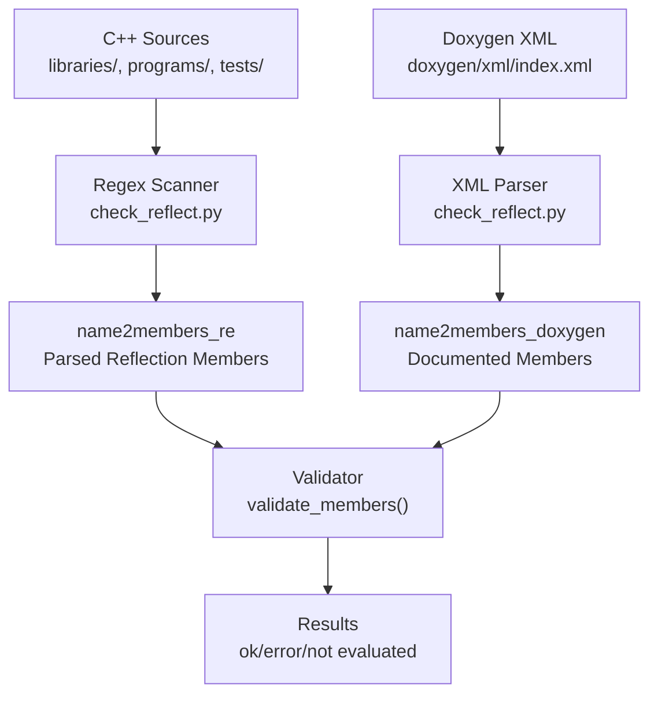
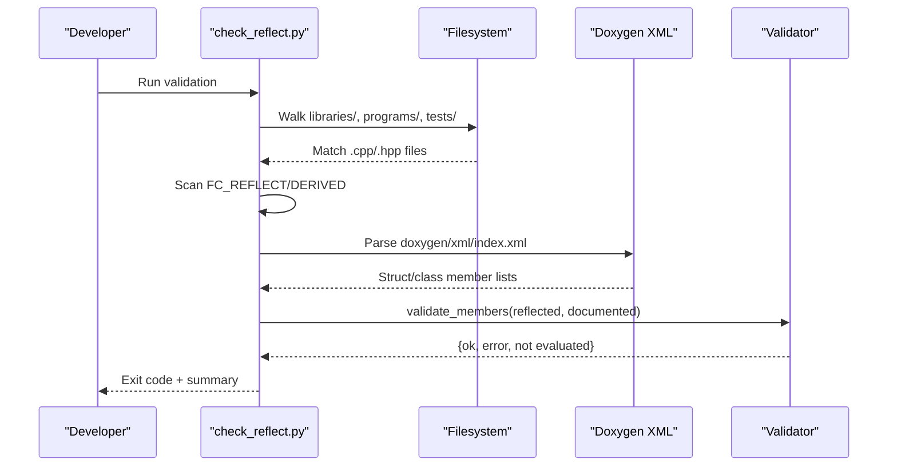
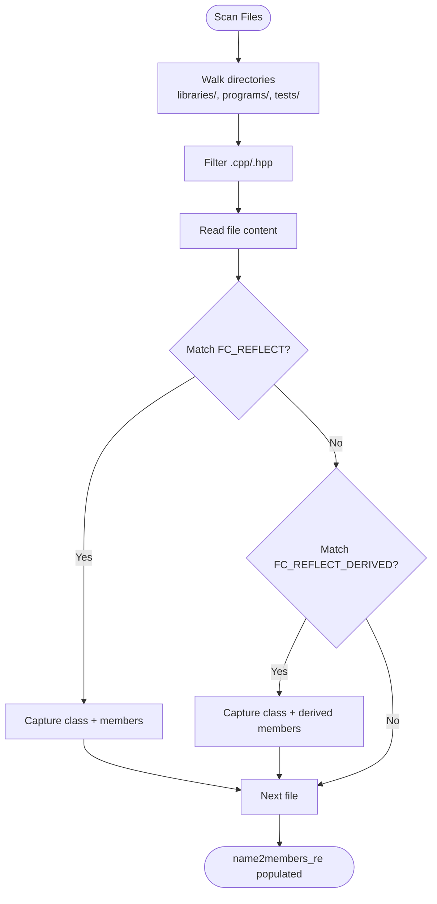
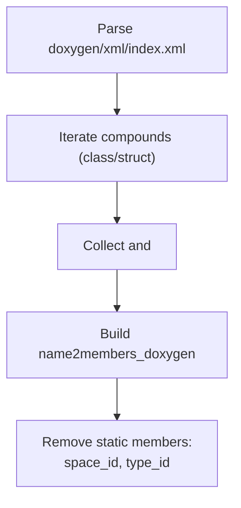
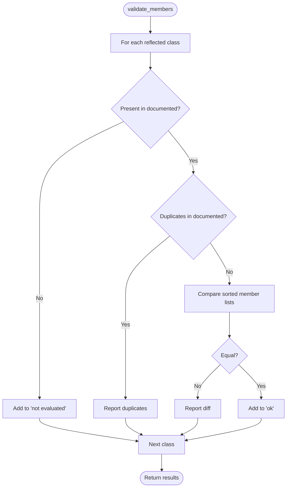
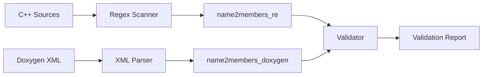

# Reflection Validation Tools

<cite>
**Referenced Files in This Document**
- [check_reflect.py](file://programs/build_helpers/check_reflect.py)
- [Doxyfile](file://Doxyfile)
- [CMakeLists.txt](file://CMakeLists.txt)
- [chain_objects.hpp](file://libraries/chain/include/graphene/chain/chain_objects.hpp)
- [reflect_util.hpp](file://libraries/wallet/include/graphene/wallet/reflect_util.hpp)
- [database.cpp](file://libraries/chain/database.cpp)
- [node.cpp](file://libraries/network/node.cpp)
- [plugin.cpp](file://plugins/json_rpc/plugin.cpp)
- [docker-main.yml](file://.github/workflows/docker-main.yml)
</cite>

## Table of Contents
1. [Introduction](#introduction)
2. [Project Structure](#project-structure)
3. [Core Components](#core-components)
4. [Architecture Overview](#architecture-overview)
5. [Detailed Component Analysis](#detailed-component-analysis)
6. [Dependency Analysis](#dependency-analysis)
7. [Performance Considerations](#performance-considerations)
8. [Troubleshooting Guide](#troubleshooting-guide)
9. [Conclusion](#conclusion)
10. [Appendices](#appendices)

## Introduction
This document explains the VIZ CPP Node reflection validation tool, check_reflect.py, which ensures that reflection metadata for blockchain objects and operations remains consistent between:
- Doxygen-generated documentation of class members
- Actual FC_REFLECT and FC_REFLECT_DERIVED declarations in the codebase

The tool cross-validates reflected member lists to guarantee proper serialization/deserialization behavior across the system, preventing subtle bugs in binary protocols, APIs, and persistence layers.

## Project Structure
The reflection validation pipeline spans three stages:
- Code scanning: Extracts FC_REFLECT and FC_REFLECT_DERIVED declarations from C++ sources
- Documentation extraction: Parses Doxygen XML to obtain documented member lists
- Validation: Compares both sets and reports mismatches

**Diagram sources**
- [check_reflect.py](file://programs/build_helpers/check_reflect.py#L84-L105)
- [check_reflect.py](file://programs/build_helpers/check_reflect.py#L44-L50)
- [check_reflect.py](file://programs/build_helpers/check_reflect.py#L107-L151)

**Section sources**
- [check_reflect.py](file://programs/build_helpers/check_reflect.py#L1-L160)
- [Doxyfile](file://Doxyfile#L783-L786)

## Core Components
- Regex-based scanner for FC_REFLECT and FC_REFLECT_DERIVED
- Doxygen XML parser for documented members
- Validation engine comparing reflected vs documented members
- Exit-code driven integration for CI

Key behaviors:
- Scans libraries/, programs/, tests/ recursively for .cpp/.hpp files
- Builds a map of class names to reflected member lists
- Filters out static members (space_id, type_id) from validation
- Reports duplicates, missing members, and symmetric differences

**Section sources**
- [check_reflect.py](file://programs/build_helpers/check_reflect.py#L61-L77)
- [check_reflect.py](file://programs/build_helpers/check_reflect.py#L84-L105)
- [check_reflect.py](file://programs/build_helpers/check_reflect.py#L107-L151)
- [check_reflect.py](file://programs/build_helpers/check_reflect.py#L51-L54)

## Architecture Overview
The validation tool orchestrates three major phases: discovery, documentation ingestion, and comparison.

**Diagram sources**
- [check_reflect.py](file://programs/build_helpers/check_reflect.py#L86-L105)
- [check_reflect.py](file://programs/build_helpers/check_reflect.py#L44-L50)
- [check_reflect.py](file://programs/build_helpers/check_reflect.py#L107-L151)
- [check_reflect.py](file://programs/build_helpers/check_reflect.py#L153-L160)

## Detailed Component Analysis

### Reflection Scanner (FC_REFLECT/FC_REFLECT_DERIVED)
- Purpose: Extract reflected member lists from C++ sources
- Scope: Recursively scans libraries/, programs/, tests/ for .cpp/.hpp
- Patterns:
  - FC_REFLECT(class, (member1)(member2)...)
  - FC_REFLECT_DERIVED(class, (base), (member1)(member2)...)

Validation rules:
- Member names are captured via a helper that splits parenthesized lists
- Duplicate members are detected and reported
- Case-sensitive ordering is normalized for comparison

**Diagram sources**
- [check_reflect.py](file://programs/build_helpers/check_reflect.py#L86-L105)
- [check_reflect.py](file://programs/build_helpers/check_reflect.py#L61-L77)
- [check_reflect.py](file://programs/build_helpers/check_reflect.py#L80-L82)

**Section sources**
- [check_reflect.py](file://programs/build_helpers/check_reflect.py#L61-L77)
- [check_reflect.py](file://programs/build_helpers/check_reflect.py#L80-L82)
- [check_reflect.py](file://programs/build_helpers/check_reflect.py#L84-L105)

### Doxygen XML Ingestion
- Purpose: Obtain documented member lists for structs/classes
- Mechanism: Parses doxygen/xml/index.xml and collects member names per class
- Post-processing: Removes static members (space_id, type_id) from validation

**Diagram sources**
- [check_reflect.py](file://programs/build_helpers/check_reflect.py#L44-L50)
- [check_reflect.py](file://programs/build_helpers/check_reflect.py#L51-L54)

**Section sources**
- [check_reflect.py](file://programs/build_helpers/check_reflect.py#L44-L50)
- [check_reflect.py](file://programs/build_helpers/check_reflect.py#L51-L54)

### Validation Engine
- Purpose: Compare reflected vs documented members
- Checks:
  - Presence of class in both sets
  - Duplicate members in documented set
  - Symmetric difference between reflected and documented members
- Outputs:
  - Lists of ok, not evaluated, and error classes
  - Detailed diffs for mismatches

**Diagram sources**
- [check_reflect.py](file://programs/build_helpers/check_reflect.py#L107-L151)

**Section sources**
- [check_reflect.py](file://programs/build_helpers/check_reflect.py#L107-L151)

### Practical Usage Examples
- Running the validator:
  - Ensure Doxygen XML exists (generate docs with Doxygen)
  - Execute the script from the repository root
  - Interpret exit code and printed summaries

- Interpreting results:
  - ok: Classes with consistent reflected and documented members
  - not evaluated: Classes reflected but not documented
  - error: Classes with duplicates or differing members

- Fixing reflection issues:
  - Align FC_REFLECT/FC_REFLECT_DERIVED member lists with actual class members
  - Remove duplicates in reflected declarations
  - Add missing members to reflected declarations if they should be serialized

[No sources needed since this subsection provides general guidance]

### Integration with Build System and CI
- Doxygen configuration:
  - INPUT includes libraries/chain, libraries/wallet, libraries/plugins, and libraries/app
  - Output directory configured for documentation/doxygen

- CMake export:
  - CMAKE_EXPORT_COMPILE_COMMANDS enabled to aid tooling

- CI integration:
  - Docker build workflows exist for production/testnet images
  - Validation can be added as a pre-submit step to run check_reflect.py and Doxygen

**Section sources**
- [Doxyfile](file://Doxyfile#L783-L786)
- [Doxyfile](file://Doxyfile#L61-L61)
- [CMakeLists.txt](file://CMakeLists.txt#L24-L24)
- [docker-main.yml](file://.github/workflows/docker-main.yml#L1-L41)

## Dependency Analysis
The validator depends on:
- Filesystem traversal and regex parsing for reflection declarations
- Doxygen XML output for documented members
- Consistent class naming conventions across FC_REFLECT and Doxygen

Potential coupling and risks:
- If Doxygen is not regenerated, documented members may lag behind code changes
- If FC_REFLECT declarations are inconsistent, validation will fail
- Static members filtering must remain synchronized with actual class definitions

**Diagram sources**
- [check_reflect.py](file://programs/build_helpers/check_reflect.py#L86-L105)
- [check_reflect.py](file://programs/build_helpers/check_reflect.py#L44-L50)
- [check_reflect.py](file://programs/build_helpers/check_reflect.py#L107-L151)

**Section sources**
- [check_reflect.py](file://programs/build_helpers/check_reflect.py#L44-L50)
- [check_reflect.py](file://programs/build_helpers/check_reflect.py#L86-L105)
- [check_reflect.py](file://programs/build_helpers/check_reflect.py#L107-L151)

## Performance Considerations
- File scanning is linear in total source lines; typical repositories process quickly
- Regex compilation occurs once; repeated scans are efficient
- XML parsing overhead is bounded by documented class count
- Recommendations:
  - Limit scan scope to modified directories during development
  - Regenerate Doxygen incrementally when only specific modules change

[No sources needed since this section provides general guidance]

## Troubleshooting Guide
Common issues and resolutions:
- No documented members found:
  - Ensure Doxygen is run and doxygen/xml/index.xml exists
  - Verify Doxyfile INPUT paths include relevant modules

- Unexpected "error" items:
  - Check for typos in FC_REFLECT/FC_REFLECT_DERIVED member names
  - Confirm member ordering does not matter (validation normalizes order)
  - Resolve duplicates flagged by the validator

- "not evaluated" items:
  - Add FC_REFLECT/FC_REFLECT_DERIVED declarations for newly added classes
  - Ensure Doxygen documents the class and members

- Static member filtering:
  - space_id and type_id are intentionally excluded from validation
  - Do not add these to reflected lists if they are not real data fields

Debugging tips:
- Temporarily print intermediate maps (name2members_doxygen, name2members_re) to inspect discrepancies
- Run Doxygen with verbose output to confirm XML generation
- Use smaller file subsets to localize issues

**Section sources**
- [check_reflect.py](file://programs/build_helpers/check_reflect.py#L51-L54)
- [check_reflect.py](file://programs/build_helpers/check_reflect.py#L107-L151)

## Conclusion
The check_reflect.py tool provides a robust mechanism to maintain reflection consistency across the VIZ CPP Node codebase. By validating FC_REFLECT declarations against Doxygen documentation, it helps prevent serialization inconsistencies and improves reliability of blockchain operations, APIs, and persistence layers. Integrating this tool into CI and adopting the best practices outlined here will keep reflection metadata accurate and maintainable.

[No sources needed since this section summarizes without analyzing specific files]

## Appendices

### Example Reflection Declarations in the Codebase
- Chain objects:
  - withdraw_vesting_route_object
  - escrow_object
  - award_shares_expire_object
  - block_post_validation_object

- Network and plugins:
  - node_configuration
  - json_rpc_error
  - json_rpc_response

These declarations demonstrate the use of FC_REFLECT for serialization and are validated by the tool.

**Section sources**
- [chain_objects.hpp](file://libraries/chain/include/graphene/chain/chain_objects.hpp#L208-L225)
- [node.cpp](file://libraries/network/node.cpp#L244-L244)
- [plugin.cpp](file://plugins/json_rpc/plugin.cpp#L427-L428)

### Wallet Reflection Utilities
- Utility functions for static_variant mapping and variant conversion
- Support for operation name-to-ID mapping and variant parsing

These utilities complement reflection by enabling runtime handling of polymorphic types.

**Section sources**
- [reflect_util.hpp](file://libraries/wallet/include/graphene/wallet/reflect_util.hpp#L1-L91)