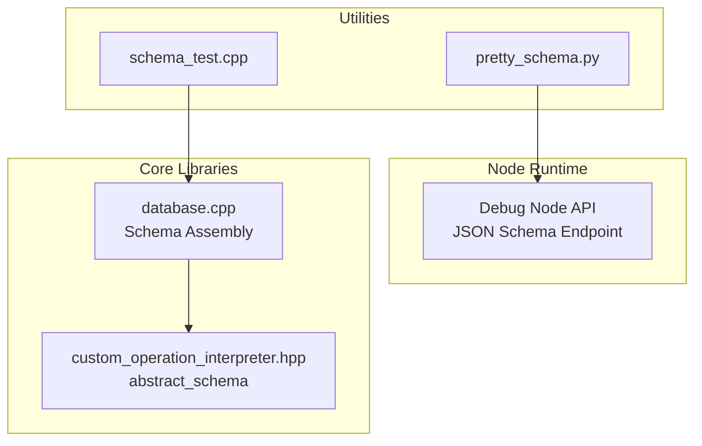
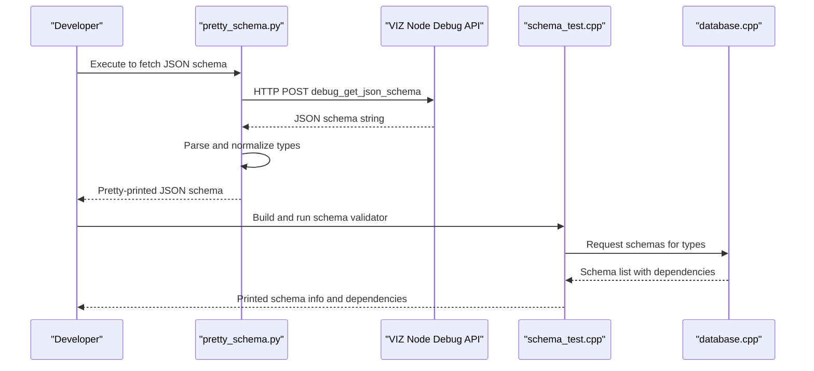
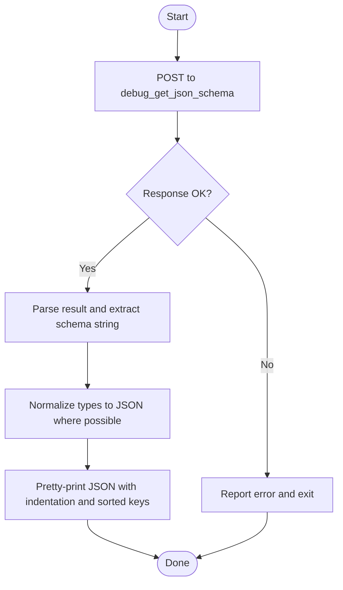
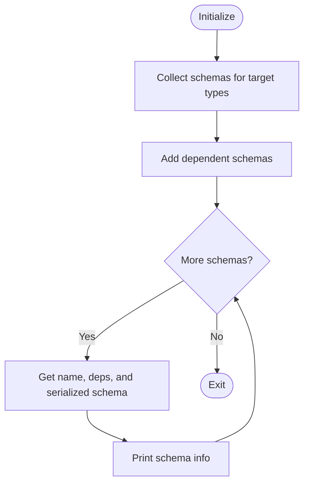
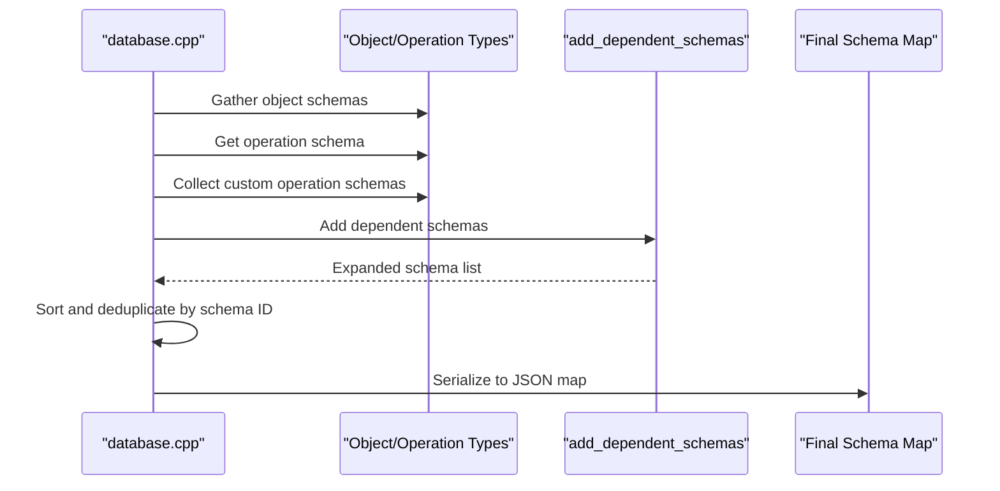
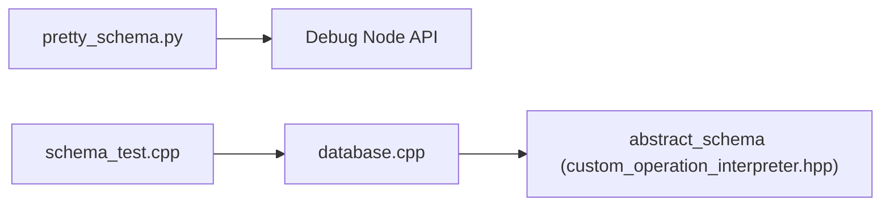

# Schema Generation Tools

<cite>
**Referenced Files in This Document**
- [pretty_schema.py](file://programs/util/pretty_schema.py)
- [schema_test.cpp](file://programs/util/schema_test.cpp)
- [database.cpp](file://libraries/chain/database.cpp)
- [custom_operation_interpreter.hpp](file://libraries/chain/include/graphene/chain/custom_operation_interpreter.hpp)
</cite>

## Table of Contents
1. [Introduction](#introduction)
2. [Project Structure](#project-structure)
3. [Core Components](#core-components)
4. [Architecture Overview](#architecture-overview)
5. [Detailed Component Analysis](#detailed-component-analysis)
6. [Dependency Analysis](#dependency-analysis)
7. [Performance Considerations](#performance-considerations)
8. [Troubleshooting Guide](#troubleshooting-guide)
9. [Conclusion](#conclusion)
10. [Appendices](#appendices)

## Introduction
This document explains the schema generation and validation tools used in the VIZ CPP Node project. It focuses on:
- The pretty_schema.py utility for fetching, parsing, and formatting JSON schema representations from the running node’s debug interface.
- The schema_test.cpp utility for validating and inspecting object schemas and their dependencies at compile-time and runtime.
- How these tools integrate into development workflows, support schema evolution, and help maintain backward compatibility.

These tools enable:
- Generating human-readable schema documentation from blockchain object definitions.
- Validating schema correctness and dependency relationships during development and CI.
- Supporting schema evolution by ensuring consistent type naming, dependency resolution, and unique schema IDs.

## Project Structure
The schema-related capabilities are implemented across:
- A Python script that queries the node’s debug API and prints a formatted JSON schema.
- A C++ program that introspects object schemas and their dependencies via the database schema API.
- Core node logic that builds and stores the canonical JSON schema representation.

**Diagram sources**
- [pretty_schema.py](file://programs/util/pretty_schema.py#L1-L28)
- [schema_test.cpp](file://programs/util/schema_test.cpp#L1-L57)
- [database.cpp](file://libraries/chain/database.cpp#L2997-L3050)
- [custom_operation_interpreter.hpp](file://libraries/chain/include/graphene/chain/custom_operation_interpreter.hpp#L1-L20)

**Section sources**
- [pretty_schema.py](file://programs/util/pretty_schema.py#L1-L28)
- [schema_test.cpp](file://programs/util/schema_test.cpp#L1-L57)
- [database.cpp](file://libraries/chain/database.cpp#L2997-L3050)
- [custom_operation_interpreter.hpp](file://libraries/chain/include/graphene/chain/custom_operation_interpreter.hpp#L1-L20)

## Core Components
- pretty_schema.py
  - Purpose: Connects to the local debug node API endpoint to retrieve the current JSON schema, parses and normalizes types, and prints a sorted, indented JSON schema for documentation.
  - Key steps: HTTP POST to the debug API, JSON parsing, safe conversion of string fields to JSON where applicable, and pretty-printing.
  - Output customization: Indentation and sorting are controlled by the printing routine.
- schema_test.cpp
  - Purpose: Validates and inspects schemas for selected blockchain objects, collects dependent schemas, and prints schema metadata and dependency lists.
  - Key steps: Obtain schemas for target types, add dependent schemas, iterate and print schema names, dependencies, and serialized schema strings.
  - Output customization: Console output formatting is handled by the program itself.

Practical usage examples:
- Documentation generation: Run pretty_schema.py against a running node to produce a stable, sorted schema for inclusion in docs or CI artifacts.
- Validation: Build and run schema_test.cpp to verify schema correctness and dependency resolution for core objects.

**Section sources**
- [pretty_schema.py](file://programs/util/pretty_schema.py#L1-L28)
- [schema_test.cpp](file://programs/util/schema_test.cpp#L1-L57)

## Architecture Overview
The schema generation pipeline integrates a Python client with the node’s debug API and a C++ introspection utility with the schema subsystem.

**Diagram sources**
- [pretty_schema.py](file://programs/util/pretty_schema.py#L9-L13)
- [schema_test.cpp](file://programs/util/schema_test.cpp#L44-L56)
- [database.cpp](file://libraries/chain/database.cpp#L2997-L3050)

## Detailed Component Analysis

### pretty_schema.py
- Fetching the schema:
  - Sends a JSON-RPC 2.0 request to the debug node API endpoint.
  - Reads the response and extracts the schema string.
- Normalizing types:
  - Attempts to parse each type value as JSON; if it fails, keeps the original string.
- Formatting and output:
  - Prints the entire schema with indentation and sorted keys for readability.

**Diagram sources**
- [pretty_schema.py](file://programs/util/pretty_schema.py#L9-L27)

**Section sources**
- [pretty_schema.py](file://programs/util/pretty_schema.py#L1-L28)

### schema_test.cpp
- Schema collection:
  - Requests schemas for specific blockchain object types.
  - Adds dependent schemas to ensure complete dependency coverage.
- Inspection:
  - Iterates over collected schemas, extracting names, dependencies, and serialized schema strings.
- Output:
  - Prints schema metadata to console for inspection and validation.

**Diagram sources**
- [schema_test.cpp](file://programs/util/schema_test.cpp#L44-L56)

**Section sources**
- [schema_test.cpp](file://programs/util/schema_test.cpp#L1-L57)

### Core Schema Assembly in the Node
- The node compiles a comprehensive list of object schemas, operation schemas, and custom operation schemas.
- It ensures uniqueness and ordering by schema ID, then serializes the final schema map for use by APIs and tools.

**Diagram sources**
- [database.cpp](file://libraries/chain/database.cpp#L2997-L3050)

**Section sources**
- [database.cpp](file://libraries/chain/database.cpp#L2997-L3050)

## Dependency Analysis
- pretty_schema.py depends on:
  - A running node exposing the debug API endpoint.
  - The node’s JSON schema serialization mechanism.
- schema_test.cpp depends on:
  - The schema subsystem in the node’s chain library.
  - The presence of specific object types whose schemas are requested.
- Core schema assembly depends on:
  - The schema registry and the abstract schema interface used by custom operation interpreters.

**Diagram sources**
- [pretty_schema.py](file://programs/util/pretty_schema.py#L9-L13)
- [schema_test.cpp](file://programs/util/schema_test.cpp#L10-L13)
- [database.cpp](file://libraries/chain/database.cpp#L2997-L3050)
- [custom_operation_interpreter.hpp](file://libraries/chain/include/graphene/chain/custom_operation_interpreter.hpp#L1-L20)

**Section sources**
- [pretty_schema.py](file://programs/util/pretty_schema.py#L1-L28)
- [schema_test.cpp](file://programs/util/schema_test.cpp#L1-L57)
- [database.cpp](file://libraries/chain/database.cpp#L2997-L3050)
- [custom_operation_interpreter.hpp](file://libraries/chain/include/graphene/chain/custom_operation_interpreter.hpp#L1-L20)

## Performance Considerations
- pretty_schema.py:
  - Network latency to the local debug API is minimal but still present; consider caching outputs when iterating on documentation.
  - JSON parsing and normalization are lightweight; avoid repeated runs in tight loops.
- schema_test.cpp:
  - Schema collection and dependency addition are O(n log n) due to sorting; keep the number of target types reasonable for quick iteration.
  - Printing to console is I/O bound; avoid excessive logging in production builds.

[No sources needed since this section provides general guidance]

## Troubleshooting Guide
Common issues and resolutions:
- pretty_schema.py cannot connect to the debug API:
  - Ensure the node is running and the debug API is enabled.
  - Verify the endpoint URL and port match the node configuration.
- Unexpected schema output:
  - Confirm the node is fully initialized so that all schemas are populated.
  - Re-run after applying recent schema changes to ensure the latest schema is retrieved.
- schema_test.cpp missing types:
  - Ensure the requested types are compiled into the binary and exposed via the schema subsystem.
  - Confirm that dependent schemas are included by invoking the dependency collector before printing.
- Dependency mismatches:
  - Use the printed dependency lists to verify that all referenced types are present and uniquely named.
  - Resolve naming conflicts by adjusting type names or aliases to ensure uniqueness.

Interpreting results:
- Schema names and IDs must be unique; duplicates indicate conflicting definitions.
- Dependencies should form a directed acyclic graph; cycles suggest incorrect schema composition.
- Serialized schema strings should be valid JSON; malformed entries require fixing the underlying type definitions.

**Section sources**
- [pretty_schema.py](file://programs/util/pretty_schema.py#L9-L13)
- [schema_test.cpp](file://programs/util/schema_test.cpp#L25-L42)
- [database.cpp](file://libraries/chain/database.cpp#L3040-L3047)

## Conclusion
The VIZ CPP Node provides robust schema generation and validation tools:
- pretty_schema.py offers a quick way to export a formatted JSON schema for documentation and review.
- schema_test.cpp enables developers to validate schema correctness and dependencies during development.
Together with the node’s schema assembly logic, these tools support reliable schema evolution and backward compatibility checks.

[No sources needed since this section summarizes without analyzing specific files]

## Appendices

### Practical Workflows
- Documentation generation:
  - Start the node with the debug API enabled.
  - Run pretty_schema.py to capture the current schema.
  - Save the output to a documentation artifact or CI cache.
- Development validation:
  - Build schema_test.cpp and run it against the current binary.
  - Review printed schema names, dependencies, and serialized forms.
  - Fix any naming conflicts or missing dependencies before merging changes.
- Automated schema testing:
  - Integrate schema_test.cpp into CI to validate schema integrity on pull requests.
  - Optionally wrap pretty_schema.py in CI to compare diffs in schema outputs across commits.

[No sources needed since this section provides general guidance]