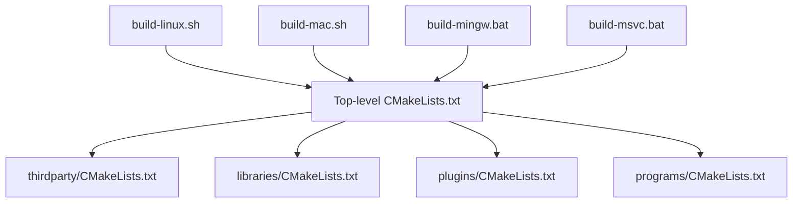
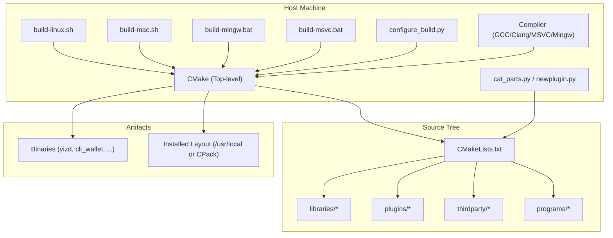
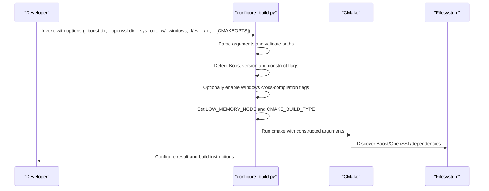
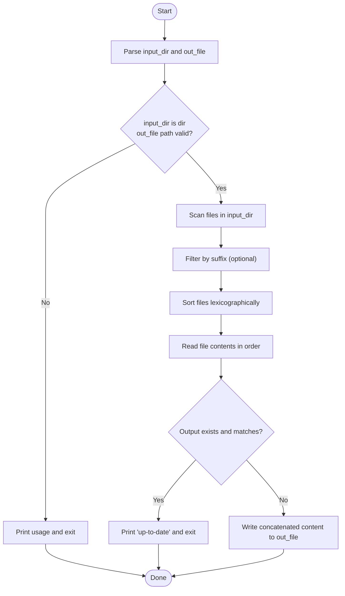
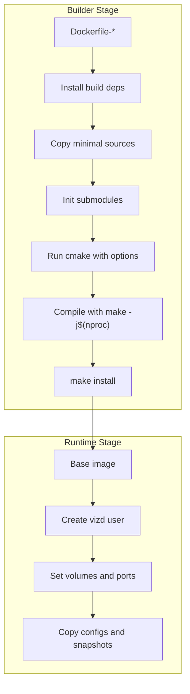
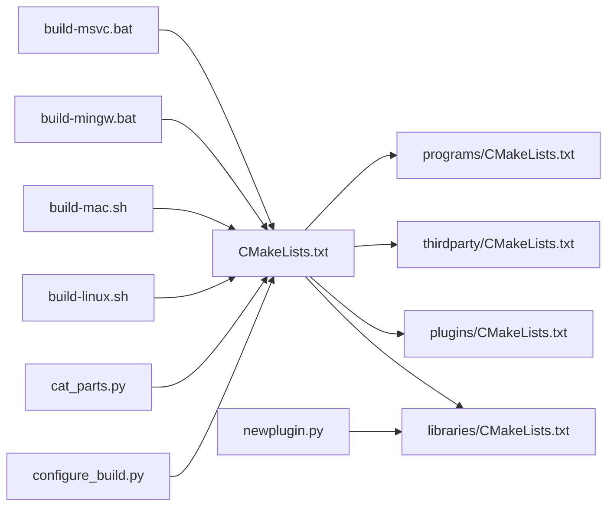

# Build System

<cite>
**Referenced Files in This Document**
- [CMakeLists.txt](file://CMakeLists.txt)
- [programs/CMakeLists.txt](file://programs/CMakeLists.txt)
- [libraries/CMakeLists.txt](file://libraries/CMakeLists.txt)
- [plugins/CMakeLists.txt](file://plugins/CMakeLists.txt)
- [thirdparty/CMakeLists.txt](file://thirdparty/CMakeLists.txt)
- [programs/build_helpers/configure_build.py](file://programs/build_helpers/configure_build.py)
- [programs/build_helpers/cat_parts.py](file://programs/build_helpers/cat_parts.py)
- [programs/util/newplugin.py](file://programs/util/newplugin.py)
- [documentation/building.md](file://documentation/building.md)
- [build-linux.sh](file://build-linux.sh)
- [build-mac.sh](file://build-mac.sh)
- [build-mingw.bat](file://build-mingw.bat)
- [build-msvc.bat](file://build-msvc.bat)
- [share/vizd/docker/Dockerfile-production](file://share/vizd/docker/Dockerfile-production)
- [share/vizd/docker/Dockerfile-lowmem](file://share/vizd/docker/Dockerfile-lowmem)
- [share/vizd/docker/Dockerfile-mongo](file://share/vizd/docker/Dockerfile-mongo)
- [share/vizd/docker/Dockerfile-testnet](file://share/vizd/docker/Dockerfile-testnet)
- [share/vizd/vizd.sh](file://share/vizd/vizd.sh)
</cite>

## Update Summary
**Changes Made**
- Added comprehensive platform-specific build scripts (build-linux.sh, build-mac.sh, build-mingw.bat, build-msvc.bat) with detailed build instructions for Ubuntu 24.04+, macOS with Homebrew, and Windows with MSVC/MinGW support
- Updated Boost library version requirement to 1.71+ across all platforms
- Enhanced documentation with practical build scenarios for each platform
- Added detailed dependency management for each platform-specific build

## Table of Contents
1. [Introduction](#introduction)
2. [Project Structure](#project-structure)
3. [Core Components](#core-components)
4. [Architecture Overview](#architecture-overview)
5. [Detailed Component Analysis](#detailed-component-analysis)
6. [Platform-Specific Build Scripts](#platform-specific-build-scripts)
7. [Dependency Analysis](#dependency-analysis)
8. [Performance Considerations](#performance-considerations)
9. [Troubleshooting Guide](#troubleshooting-guide)
10. [Conclusion](#conclusion)
11. [Appendices](#appendices)

## Introduction
This document explains the build system for VIZ CPP Node, focusing on the CMake-based configuration, cross-platform compilation support, dependency management, and build targets. It covers the new platform-specific build scripts (build-linux.sh, build-mac.sh, build-mingw.bat, build-msvc.bat) along with the traditional CMake configuration and helper tools. The documentation includes comprehensive build instructions for Ubuntu 24.04+, macOS with Homebrew, and Windows with both MSVC and MinGW toolchains, all requiring Boost 1.71+.

## Project Structure
The build system is organized around a top-level CMake project that orchestrates subprojects and provides platform-specific build automation:
- Top-level CMake project defines compiler checks, options, platform-specific flags, and includes subdirectories for thirdparty, libraries, plugins, and programs
- Platform-specific build scripts provide automated dependency installation, configuration, and building for different operating systems
- Subprojects:
  - libraries: API, chain, protocol, network, time, utilities, wallet
  - plugins: dynamically discovered via a scanning mechanism
  - thirdparty: appbase, fc, chainbase
  - programs: build_helpers, cli_wallet, vizd, js_operation_serializer, size_checker, util



**Diagram sources**
- [CMakeLists.txt:206-209](file://CMakeLists.txt#L206-L209)
- [thirdparty/CMakeLists.txt:1-3](file://thirdparty/CMakeLists.txt#L1-L3)
- [libraries/CMakeLists.txt:1-8](file://libraries/CMakeLists.txt#L1-L8)
- [plugins/CMakeLists.txt:1-12](file://plugins/CMakeLists.txt#L1-L12)
- [programs/CMakeLists.txt:1-8](file://programs/CMakeLists.txt#L1-L8)
- [build-linux.sh:1-247](file://build-linux.sh#L1-L247)
- [build-mac.sh:1-242](file://build-mac.sh#L1-L242)
- [build-mingw.bat:1-125](file://build-mingw.bat#L1-L125)
- [build-msvc.bat:1-116](file://build-msvc.bat#L1-L116)

**Section sources**
- [CMakeLists.txt:1-271](file://CMakeLists.txt#L1-L271)
- [libraries/CMakeLists.txt:1-8](file://libraries/CMakeLists.txt#L1-L8)
- [plugins/CMakeLists.txt:1-12](file://plugins/CMakeLists.txt#L1-L12)
- [thirdparty/CMakeLists.txt:1-3](file://thirdparty/CMakeLists.txt#L1-L3)
- [programs/CMakeLists.txt:1-8](file://programs/CMakeLists.txt#L1-L8)

## Core Components
- Top-level CMake project:
  - Enforces minimum CMake version 3.16 and compiler versions for GCC and Clang
  - Configures Boost usage with version 1.71 and coroutine component requirement, optional static/shared libraries, and PCH support
  - Provides compile-time options: BUILD_TESTNET, LOW_MEMORY_NODE, CHAINBASE_CHECK_LOCKING, ENABLE_MONGO_PLUGIN
  - Sets platform-specific flags for Windows (MSVC/Mingw), macOS, and Linux
  - Enables ccache globally when available
  - Supports optional CPack installer generation
- Platform-specific build scripts:
  - **build-linux.sh**: Automated Ubuntu/Fedora dependency installation, CMake configuration, and building for Linux
  - **build-mac.sh**: Automated Xcode/Homebrew dependency installation, OpenSSL detection, and building for macOS
  - **build-mingw.bat**: Windows MinGW build with environment variable configuration and static linking
  - **build-msvc.bat**: Windows MSVC build with Visual Studio generator configuration
- Helper scripts:
  - configure_build.py: wraps cmake with sensible defaults and cross-compilation support
  - cat_parts.py: concatenates files from a directory tree into a single output file
  - newplugin.py: scaffolds a new plugin directory and files

**Section sources**
- [CMakeLists.txt:1-271](file://CMakeLists.txt#L1-L271)
- [build-linux.sh:1-247](file://build-linux.sh#L1-L247)
- [build-mac.sh:1-242](file://build-mac.sh#L1-L242)
- [build-mingw.bat:1-125](file://build-mingw.bat#L1-L125)
- [build-msvc.bat:1-116](file://build-msvc.bat#L1-L116)
- [programs/build_helpers/configure_build.py:1-202](file://programs/build_helpers/configure_build.py#L1-L202)
- [programs/build_helpers/cat_parts.py:1-74](file://programs/build_helpers/cat_parts.py#L1-L74)
- [programs/util/newplugin.py:1-251](file://programs/util/newplugin.py#L1-L251)

## Architecture Overview
The build pipeline integrates CMake configuration, platform detection, dependency discovery, and helper tools to produce binaries and optionally packaging artifacts. The new platform-specific build scripts provide automated workflows for different operating systems while maintaining consistency with the core CMake configuration.



**Diagram sources**
- [CMakeLists.txt:206-209](file://CMakeLists.txt#L206-L209)
- [build-linux.sh:214-229](file://build-linux.sh#L214-L229)
- [build-mac.sh:210-224](file://build-mac.sh#L210-L224)
- [build-mingw.bat:90-111](file://build-mingw.bat#L90-L111)
- [build-msvc.bat:82-102](file://build-msvc.bat#L82-L102)
- [programs/build_helpers/configure_build.py:143-195](file://programs/build_helpers/configure_build.py#L143-L195)
- [programs/build_helpers/cat_parts.py:11-69](file://programs/build_helpers/cat_parts.py#L11-L69)
- [programs/util/newplugin.py:225-246](file://programs/util/newplugin.py#L225-L246)

## Detailed Component Analysis

### CMake Configuration and Options
Key behaviors:
- CMake minimum version: Requires CMake 3.16 or higher for modern C++ features and improved dependency management
- Compiler enforcement: Fails early if GCC < 4.8 or Clang < 3.3
- Boost configuration: Uses Boost 1.71 with coroutine component requirement; supports static usage; removes deprecated 1.53 compatibility logic
- Platform flags:
  - Windows (MSVC): Adds warning suppressions, disables safe-seh, ensures debug info, locates TCL
  - Windows (MinGW): Enables C++11, permissive mode, SSE4.2, big obj, sets Release/Debug optimization flags, supports full static build
  - macOS: Uses libc++, C++14, sets common warnings
  - Linux: Uses C++14, enables rt and pthread, optional crypto library, supports full static build
- Coverage/testing: Optional --coverage flag when enabled
- Options:
  - BUILD_TESTNET: Adds preprocessor defines and prints configuration status
  - LOW_MEMORY_NODE: Adds preprocessor defines and prints configuration status
  - CHAINBASE_CHECK_LOCKING: Adds preprocessor defines and prints configuration status
  - ENABLE_MONGO_PLUGIN: Adds MongoDB plugin linkage and preprocessor defines
  - BUILD_SHARED_LIBRARIES: Defaults to off
  - USE_PCH: Optional cotire precompiled headers support
  - ENABLE_INSTALLER: Optional CPack packaging

Build targets:
- The top-level project includes subprojects for thirdparty, libraries, plugins, and programs. Programs include build_helpers, cli_wallet, vizd, js_operation_serializer, size_checker, and util.

**Section sources**
- [CMakeLists.txt:2-3](file://CMakeLists.txt#L2-L3)
- [CMakeLists.txt:11-20](file://CMakeLists.txt#L11-L20)
- [CMakeLists.txt:38-49](file://CMakeLists.txt#L38-L49)
- [CMakeLists.txt:51-53](file://CMakeLists.txt#L51-L53)
- [CMakeLists.txt:55-80](file://CMakeLists.txt#L55-L80)
- [CMakeLists.txt:82-88](file://CMakeLists.txt#L82-L88)
- [CMakeLists.txt:96-100](file://CMakeLists.txt#L96-L100)
- [CMakeLists.txt:108-152](file://CMakeLists.txt#L108-L152)
- [CMakeLists.txt:154-198](file://CMakeLists.txt#L154-L198)
- [programs/CMakeLists.txt:1-8](file://programs/CMakeLists.txt#L1-L8)
- [libraries/CMakeLists.txt:1-8](file://libraries/CMakeLists.txt#L1-L8)
- [plugins/CMakeLists.txt:1-12](file://plugins/CMakeLists.txt#L1-L12)
- [thirdparty/CMakeLists.txt:1-3](file://thirdparty/CMakeLists.txt#L1-L3)

### Cross-Platform Compilation Flags and Toolchains
- Windows:
  - MSVC: Warning suppressions, safe-seh disable, ensures debug info, finds TCL
  - MinGW: C++11, permissive mode, SSE4.2, big obj, Release/Debug optimization, optional full static build
- macOS:
  - C++14, libc++, common warnings, disables certain conversion warnings
- Linux:
  - C++14, rt and pthread libraries, optional crypto library, optional full static build
- Ninja + Clang diagnostics: colorized diagnostics when generator is Ninja and compiler is Clang
- Debug build: defines DEBUG automatically

**Section sources**
- [CMakeLists.txt:108-152](file://CMakeLists.txt#L108-L152)
- [CMakeLists.txt:154-198](file://CMakeLists.txt#L154-L198)

### Dependency Management
- Boost: Required version 1.71 with components including thread, date_time, system, filesystem, program_options, serialization, chrono, unit_test_framework, context, locale, and coroutine. Static usage is preferred; coroutine is now a mandatory component for Boost >= 1.71
- OpenSSL: Optional via OPENSSL_ROOT_DIR; used when present
- Readline: Found on non-Windows platforms; included if available
- Crypto library: Defaults to crypto on Linux; configurable
- ccache: Detected and used globally for compile/link steps when available

**Updated** Enhanced Boost dependency requirements with version 1.71 and mandatory coroutine component

**Section sources**
- [CMakeLists.txt:38-49](file://CMakeLists.txt#L38-L49)
- [CMakeLists.txt:96-100](file://CMakeLists.txt#L96-L100)
- [CMakeLists.txt:102-106](file://CMakeLists.txt#L102-L106)
- [CMakeLists.txt:156-160](file://CMakeLists.txt#L156-L160)
- [CMakeLists.txt:172-176](file://CMakeLists.txt#L172-L176)

### Build Targets
- Programs:
  - vizd: main node binary
  - cli_wallet: command-line wallet
  - js_operation_serializer: utility for JS operation serialization
  - size_checker: utility for size analysis
  - build_helpers: helper utilities
  - util: various utilities
- Libraries:
  - api, chain, protocol, network, time, utilities, wallet
- Plugins:
  - Discovered dynamically via scanning for subdirectories with CMakeLists.txt

**Section sources**
- [programs/CMakeLists.txt:1-8](file://programs/CMakeLists.txt#L1-L8)
- [libraries/CMakeLists.txt:1-8](file://libraries/CMakeLists.txt#L1-L8)
- [plugins/CMakeLists.txt:1-12](file://plugins/CMakeLists.txt#L1-L12)

### Build Helper Tools

#### configure_build.py
- Purpose: Simplifies invoking cmake with sensible defaults and cross-compilation support
- Features:
  - Accepts --sys-root, --boost-dir, --openssl-dir to guide find modules
  - Supports LOW_MEMORY_NODE and CMAKE_BUILD_TYPE toggles
  - Supports Windows cross-compilation via MinGW with static linking flags and root path modes
  - Passes additional cmake options after a separator
- Typical usage:
  - Configure for Release with LOW_MEMORY_NODE=OFF
  - Configure for Debug with LOW_MEMORY_NODE=ON
  - Cross-compile for Windows using MinGW with static linking



**Diagram sources**
- [programs/build_helpers/configure_build.py:35-119](file://programs/build_helpers/configure_build.py#L35-L119)
- [programs/build_helpers/configure_build.py:143-195](file://programs/build_helpers/configure_build.py#L143-L195)

**Section sources**
- [programs/build_helpers/configure_build.py:1-202](file://programs/build_helpers/configure_build.py#L1-L202)

#### cat_parts.py
- Purpose: Concatenates files from a directory tree into a single output file, preserving order and skipping non-files
- Behavior:
  - Validates input directory and output file path
  - Skips non-file entries and filters by suffix if requested
  - Compares generated content with existing output to avoid unnecessary writes
  - Creates parent directories if missing



**Diagram sources**
- [programs/build_helpers/cat_parts.py:11-69](file://programs/build_helpers/cat_parts.py#L11-L69)

**Section sources**
- [programs/build_helpers/cat_parts.py:1-74](file://programs/build_helpers/cat_parts.py#L1-L74)

#### newplugin.py
- Purpose: Generates boilerplate files for a new plugin under libraries/plugins/<plugin_name>
- Templates:
  - CMakeLists.txt for the plugin target
  - Plugin header and implementation
  - API header and implementation
- Behavior:
  - Accepts provider and plugin name
  - Writes files into a dedicated directory under libraries/plugins/<plugin_name>


**Diagram sources**
- [programs/util/newplugin.py:225-246](file://programs/util/newplugin.py#L225-L246)

**Section sources**
- [programs/util/newplugin.py:1-251](file://programs/util/newplugin.py#L1-L251)

### Docker-Based Builds
The repository ships Dockerfiles for multiple environments:
- Production: Full node build with Release, shared libraries disabled, lock checking disabled, MongoDB plugin disabled
- Low-memory: Same as production but with LOW_MEMORY_NODE enabled
- Mongo: Installs MongoDB C/C++ drivers and enables ENABLE_MONGO_PLUGIN
- Testnet: Builds with BUILD_TESTNET enabled

Each Dockerfile:
- Uses a two-stage build to minimize image size
- Copies only necessary source files to reduce rebuilds
- Runs cmake with explicit options and compiles with parallel jobs
- Installs artifacts and prepares runtime configuration files and volumes

**Updated** Docker configurations now use Boost 1.71 packages (libboost-coroutine-dev, libboost-context-dev) instead of older versions



**Diagram sources**
- [share/vizd/docker/Dockerfile-production:1-98](file://share/vizd/docker/Dockerfile-production#L1-L98)
- [share/vizd/docker/Dockerfile-lowmem:1-80](file://share/vizd/docker/Dockerfile-lowmem#L1-L80)
- [share/vizd/docker/Dockerfile-mongo:1-109](file://share/vizd/docker/Dockerfile-mongo#L1-L109)
- [share/vizd/docker/Dockerfile-testnet:1-98](file://share/vizd/docker/Dockerfile-testnet#L1-L98)

**Section sources**
- [share/vizd/docker/Dockerfile-production:56-62](file://share/vizd/docker/Dockerfile-production#L56-L62)
- [share/vizd/docker/Dockerfile-lowmem:43-49](file://share/vizd/docker/Dockerfile-lowmem#L43-L49)
- [share/vizd/docker/Dockerfile-mongo:72-78](file://share/vizd/docker/Dockerfile-mongo#L72-L78)
- [share/vizd/docker/Dockerfile-testnet:56-62](file://share/vizd/docker/Dockerfile-testnet#L56-L62)

## Platform-Specific Build Scripts

### Linux Build Script (build-linux.sh)
The `build-linux.sh` script provides a comprehensive automated build solution for Ubuntu 24.04+ and Fedora systems:

**Features:**
- Automatic dependency detection and installation for Ubuntu and Fedora
- Support for both Debian-style (apt) and RPM-style (dnf) package managers
- Comprehensive Boost 1.71+ dependency management with all required components
- Flexible configuration options for different build types and requirements
- Parallel job control and optional installation step

**Key Dependencies Installed:**
- Core build tools: cmake, gcc/g++, git, make, pkg-config
- Boost components: chrono, context, coroutine, date_time, filesystem, iostreams, locale, program-options, serialization, system, test, thread
- Compression libraries: bzip2, lzma, zstd, zlib
- Security: OpenSSL development headers
- Optional: readline, ccache, ncurses

**Usage Examples:**
```bash
# Basic build
./build-linux.sh

# Low memory node for witnesses
./build-linux.sh -l

# Testnet build
./build-linux.sh -n

# Debug build with 4 parallel jobs
./build-linux.sh -t Debug -j 4

# Skip dependency installation (already installed)
./build-linux.sh --skip-deps

# Install to system after build
./build-linux.sh --install

# Custom Boost and OpenSSL paths
./build-linux.sh --boost-root /opt/boost_1_74_0 --openssl-root /opt/openssl
```

**Section sources**
- [build-linux.sh:1-247](file://build-linux.sh#L1-L247)

### macOS Build Script (build-mac.sh)
The `build-mac.sh` script streamlines macOS development with Homebrew integration:

**Features:**
- Xcode Command Line Tools verification and automatic installation
- Homebrew dependency management with modern Boost 1.71+
- Automatic OpenSSL path detection from Homebrew
- Comprehensive error handling and validation
- Flexible configuration options mirroring Linux script capabilities

**Key Dependencies Installed via Homebrew:**
- Core: autoconf, automake, boost, cmake, git, libtool, python3, readline
- Security: openssl
- Optional: google-perftools (for LevelDB TCMalloc)

**macOS-Specific Features:**
- Xcode Command Line Tools detection and installation
- Homebrew prefix detection and validation
- OpenSSL path resolution from Homebrew installation
- Automatic environment setup for successful CMake configuration

**Usage Examples:**
```bash
# Basic macOS build
./build-mac.sh

# Low memory node for witness operations
./build-mac.sh -l

# Testnet configuration
./build-mac.sh -n

# Debug build with custom Boost path
./build-mac.sh --boost-root /opt/boost_1_74_0

# Skip dependency installation
./build-mac.sh --skip-deps
```

**Section sources**
- [build-mac.sh:1-242](file://build-mac.sh#L1-L242)

### Windows MinGW Build Script (build-mingw.bat)
The `build-mingw.bat` script provides Windows development support with MinGW-w64:

**Environment Requirements:**
- MinGW-w64 with g++ supporting C++11 and SSE4.2
- CMake 3.16+ installed
- Git for Windows
- Boost 1.71+ built with specific configuration: `link=static threading=multi runtime-link=shared`
- OpenSSL for Windows (Win32OpenSSL)

**Required Environment Variables:**
- `BOOST_ROOT`: Path to Boost installation (e.g., `C:\Boost`)
- `OPENSSL_ROOT_DIR`: Path to OpenSSL installation (e.g., `C:\OpenSSL-Win64`)

**Optional Environment Variables:**
- `VIZ_BUILD_TYPE`: Release or Debug (default: Release)
- `VIZ_LOW_MEMORY`: ON or OFF (default: OFF)
- `VIZ_BUILD_TESTNET`: ON or OFF (default: OFF)
- `VIZ_FULL_STATIC`: ON or OFF (default: OFF, produces static exe)
- `VIZ_CMAKE_EXTRA`: Additional CMake options

**Usage Examples:**
```cmd
REM Set environment variables
set BOOST_ROOT=C:\Boost
set OPENSSL_ROOT_DIR=C:\OpenSSL-Win64

REM Basic MinGW build
build-mingw.bat

REM Full static build for distribution
set VIZ_FULL_STATIC=ON
build-mingw.bat

REM Testnet build
set VIZ_BUILD_TESTNET=ON
build-mingw.bat
```

**Section sources**
- [build-mingw.bat:1-125](file://build-mingw.bat#L1-L125)

### Windows MSVC Build Script (build-msvc.bat)
The `build-msvc.bat` script provides Visual Studio integration for Windows development:

**Requirements:**
- Visual Studio 2019+ with "Desktop development with C++" workload
- CMake 3.16+ (installed or via VS CMake workload)
- Git for Windows
- Boost 1.71+ built with static linking configuration
- OpenSSL for Windows (Win32OpenSSL)

**Environment Requirements:**
- Same as MinGW script: `BOOST_ROOT` and `OPENSSL_ROOT_DIR` environment variables
- Visual Studio generators available for CMake

**Optional Environment Variables:**
- `VIZ_VS_VERSION`: Visual Studio generator version (default: "Visual Studio 17 2022")
- `VIZ_BUILD_TYPE`: Release or Debug (default: Release)
- `VIZ_LOW_MEMORY`: ON or OFF (default: OFF)
- `VIZ_BUILD_TESTNET`: ON or OFF (default: OFF)
- `VIZ_CMAKE_EXTRA`: Additional CMake options

**Usage Examples:**
```cmd
REM Set environment variables
set BOOST_ROOT=C:\Boost
set OPENSSL_ROOT_DIR=C:\OpenSSL-Win64

REM Basic MSVC build
build-msvc.bat

REM Specify Visual Studio version
set VIZ_VS_VERSION=Visual Studio 16 2019
build-msvc.bat
```

**Section sources**
- [build-msvc.bat:1-116](file://build-msvc.bat#L1-L116)

## Dependency Analysis
- Coupling:
  - Top-level CMake depends on subproject CMakeLists.txt files to register targets
  - configure_build.py depends on filesystem layout and optional environment variables for Boost/OpenSSL
  - cat_parts.py depends on directory structure and file suffix filtering
  - newplugin.py depends on the libraries/plugins directory layout
  - Platform-specific build scripts depend on CMake configuration and system package managers
- External dependencies:
  - Boost 1.71 (required), OpenSSL (optional), Readline (optional), ccache (optional), MongoDB drivers (optional)
  - Platform-specific: Ubuntu/Fedora package managers, Homebrew, Visual Studio/MinGW toolchains
- Indirect dependencies:
  - Plugins are discovered dynamically; their presence affects the build graph
  - Platform scripts handle dependency installation automatically



**Diagram sources**
- [CMakeLists.txt:206-209](file://CMakeLists.txt#L206-L209)
- [libraries/CMakeLists.txt:1-8](file://libraries/CMakeLists.txt#L1-L8)
- [plugins/CMakeLists.txt:1-12](file://plugins/CMakeLists.txt#L1-L12)
- [thirdparty/CMakeLists.txt:1-3](file://thirdparty/CMakeLists.txt#L1-L3)
- [programs/CMakeLists.txt:1-8](file://programs/CMakeLists.txt#L1-L8)
- [programs/build_helpers/configure_build.py:143-195](file://programs/build_helpers/configure_build.py#L143-L195)
- [programs/build_helpers/cat_parts.py:11-69](file://programs/build_helpers/cat_parts.py#L11-L69)
- [programs/util/newplugin.py:225-246](file://programs/util/newplugin.py#L225-L246)
- [build-linux.sh:107-178](file://build-linux.sh#L107-L178)
- [build-mac.sh:125-171](file://build-mac.sh#L125-L171)
- [build-mingw.bat:32-56](file://build-mingw.bat#L32-L56)
- [build-msvc.bat:32-56](file://build-msvc.bat#L32-L56)

**Section sources**
- [CMakeLists.txt:206-209](file://CMakeLists.txt#L206-L209)
- [programs/build_helpers/configure_build.py:143-195](file://programs/build_helpers/configure_build.py#L143-L195)
- [programs/build_helpers/cat_parts.py:11-69](file://programs/build_helpers/cat_parts.py#L11-L69)
- [programs/util/newplugin.py:225-246](file://programs/util/newplugin.py#L225-L246)
- [build-linux.sh:107-178](file://build-linux.sh#L107-L178)
- [build-mac.sh:125-171](file://build-mac.sh#L125-L171)
- [build-mingw.bat:32-56](file://build-mingw.bat#L32-L56)
- [build-msvc.bat:32-56](file://build-msvc.bat#L32-L56)

## Performance Considerations
- Compiler flags:
  - Release builds use aggressive optimization for MinGW and Linux
  - Debug builds define DEBUG and can be paired with coverage instrumentation when enabled
- Precompiled headers:
  - USE_PCH enables cotire for faster incremental builds
- Static vs shared libraries:
  - BUILD_SHARED_LIBRARIES defaults to off, reducing runtime dependencies and potentially improving startup performance
- Memory profile:
  - LOW_MEMORY_NODE reduces storage overhead by excluding non-consensus data, beneficial for resource-constrained nodes
- Lock checking:
  - CHAINBASE_CHECK_LOCKING can be disabled for production builds to reduce overhead
- ccache:
  - Global launch wrappers accelerate rebuilds when available
- Platform-specific optimizations:
  - Linux builds leverage system Boost 1.71+ packages for optimal performance
  - macOS builds utilize Homebrew's optimized dependencies
  - Windows builds support both static and dynamic linking configurations

Practical implications:
- Choose Release for production builds to maximize runtime performance
- Disable CHAINBASE_CHECK_LOCKING and LOW_MEMORY_NODE unless required for specific roles
- Enable USE_PCH for faster local development cycles
- Use platform-specific build scripts for optimal dependency management and performance

**Section sources**
- [CMakeLists.txt:144-152](file://CMakeLists.txt#L144-L152)
- [CMakeLists.txt:176-183](file://CMakeLists.txt#L176-L183)
- [CMakeLists.txt:51-53](file://CMakeLists.txt#L51-L53)
- [CMakeLists.txt:65-73](file://CMakeLists.txt#L65-L73)
- [CMakeLists.txt:75-80](file://CMakeLists.txt#L75-L80)
- [CMakeLists.txt:102-106](file://CMakeLists.txt#L102-L106)

## Troubleshooting Guide
Common issues and resolutions:

### Boost Version Issues
- **Problem**: Boost version below 1.71
- **Solution**: Ensure Boost 1.71+ is installed via package manager or built from source
- **Platform-specific**: Ubuntu 24.04 provides Boost 1.74, macOS Homebrew provides recent versions, Windows requires manual installation

### Dependency Installation Problems
- **Linux**: Package manager failures (apt/dnf) - verify internet connectivity and retry
- **macOS**: Homebrew installation issues - run `brew doctor` and fix any reported problems
- **Windows**: Missing Visual Studio/MinGW components - install required workloads and tools

### Environment Variable Issues
- **Windows MinGW**: `BOOST_ROOT` and `OPENSSL_ROOT_DIR` must be set and point to valid installations
- **Windows MSVC**: Same environment variables required for Visual Studio builds
- **macOS**: OpenSSL path detection may fail - set `OPENSSL_ROOT_DIR` manually

### Platform-Specific Issues
- **Linux**: Ensure system Boost 1.71+ packages are installed (coroutine, context components)
- **macOS**: Xcode Command Line Tools must be installed and accepted
- **Windows**: MinGW requires C++11 support and SSE4.2 capability

### Build Script Issues
- **Permission errors**: Make scripts executable with `chmod +x build-*.sh` or `build-*.bat`
- **Path issues**: Run scripts from repository root directory
- **Parallel job issues**: Adjust `-j` parameter based on available CPU cores

**Updated** Enhanced Boost dependency requirements and platform-specific build script troubleshooting

**Section sources**
- [build-linux.sh:107-178](file://build-linux.sh#L107-L178)
- [build-mac.sh:108-171](file://build-mac.sh#L108-L171)
- [build-mingw.bat:32-56](file://build-mingw.bat#L32-L56)
- [build-msvc.bat:32-56](file://build-msvc.bat#L32-L56)
- [CMakeLists.txt:96-100](file://CMakeLists.txt#L96-L100)

## Conclusion
The VIZ CPP Node build system has evolved to provide comprehensive platform-specific automation while maintaining robust CMake configuration. The new build scripts (build-linux.sh, build-mac.sh, build-mingw.bat, build-msvc.bat) offer streamlined workflows for Ubuntu 24.04+, macOS with Homebrew, and Windows with both MSVC and MinGW toolchains, all requiring Boost 1.71+. Recent updates include upgrading to CMake 3.16, Boost 1.71, and adding coroutine component requirements. The platform-specific scripts handle dependency management, configuration, and building automatically, while the traditional CMake approach remains available for advanced users. Dockerfiles continue to streamline both development and production workflows with updated dependency specifications. By leveraging the appropriate build script for your platform, developers can quickly set up consistent builds with optimal performance characteristics.

## Appendices

### Practical Build Scenarios

#### Linux Development Build
```bash
# Clone repository
git clone --recursive https://github.com/VIZ-Blockchain/viz-cpp-node
cd viz-cpp-node

# Make script executable
chmod +x build-linux.sh

# Basic development build
./build-linux.sh

# Low memory node for witness operations
./build-linux.sh -l

# Testnet build
./build-linux.sh -n

# Debug build with custom jobs
./build-linux.sh -t Debug -j 4
```

#### macOS Development Build
```bash
# Clone repository
git clone --recursive https://github.com/VIZ-Blockchain/viz-cpp-node
cd viz-cpp-node

# Make script executable
chmod +x build-mac.sh

# Basic macOS build
./build-mac.sh

# Custom Boost path
./build-mac.sh --boost-root /opt/boost_1_74_0

# Skip dependencies if already installed
./build-mac.sh --skip-deps
```

#### Windows MinGW Build
```cmd
REM Set environment variables
set BOOST_ROOT=C:\Boost
set OPENSSL_ROOT_DIR=C:\OpenSSL-Win64

REM Basic MinGW build
build-mingw.bat

REM Full static build for distribution
set VIZ_FULL_STATIC=ON
build-mingw.bat

REM Testnet configuration
set VIZ_BUILD_TESTNET=ON
build-mingw.bat
```

#### Windows MSVC Build
```cmd
REM Set environment variables
set BOOST_ROOT=C:\Boost
set OPENSSL_ROOT_DIR=C:\OpenSSL-Win64

REM Basic MSVC build
build-msvc.bat

REM Specify Visual Studio version
set VIZ_VS_VERSION=Visual Studio 16 2019
build-msvc.bat
```

#### Advanced CMake Configuration
```bash
# Traditional CMake approach with configure_build.py
python3 programs/build_helpers/configure_build.py --release --src ../..

# Cross-compilation for Windows using MinGW
python3 programs/build_helpers/configure_build.py --win --release

# Custom Boost and OpenSSL paths
python3 programs/build_helpers/configure_build.py --boost-dir /opt/boost_1_74_0 --openssl-dir /opt/openssl --release
```

**Updated** Enhanced platform-specific build script usage examples and advanced configuration options

**Section sources**
- [build-linux.sh:189-209](file://build-linux.sh#L189-L209)
- [build-mac.sh:330-351](file://build-mac.sh#L330-L351)
- [build-mingw.bat:12-22](file://build-mingw.bat#L12-L22)
- [build-msvc.bat:12-22](file://build-msvc.bat#L12-L22)
- [programs/build_helpers/configure_build.py:168-184](file://programs/build_helpers/configure_build.py#L168-L184)