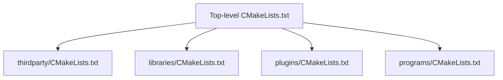
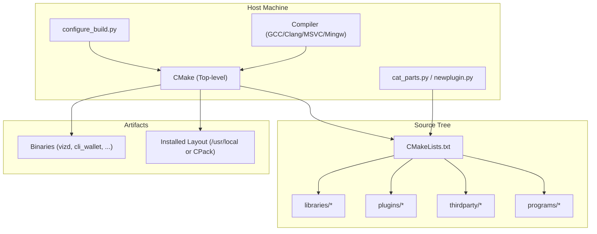
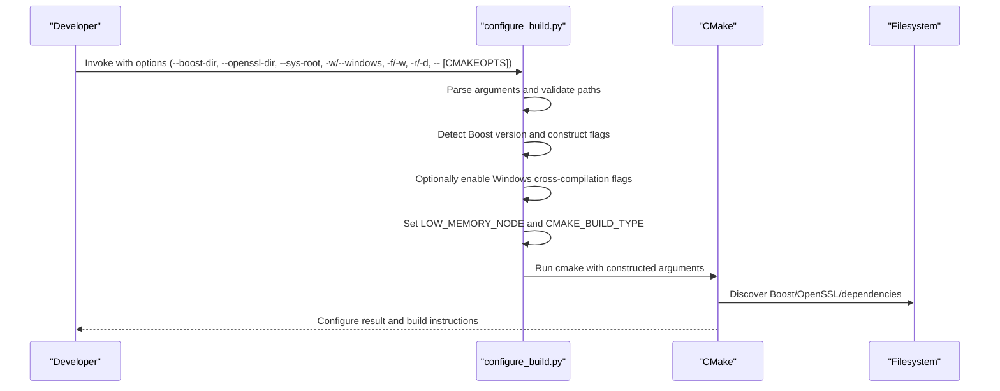
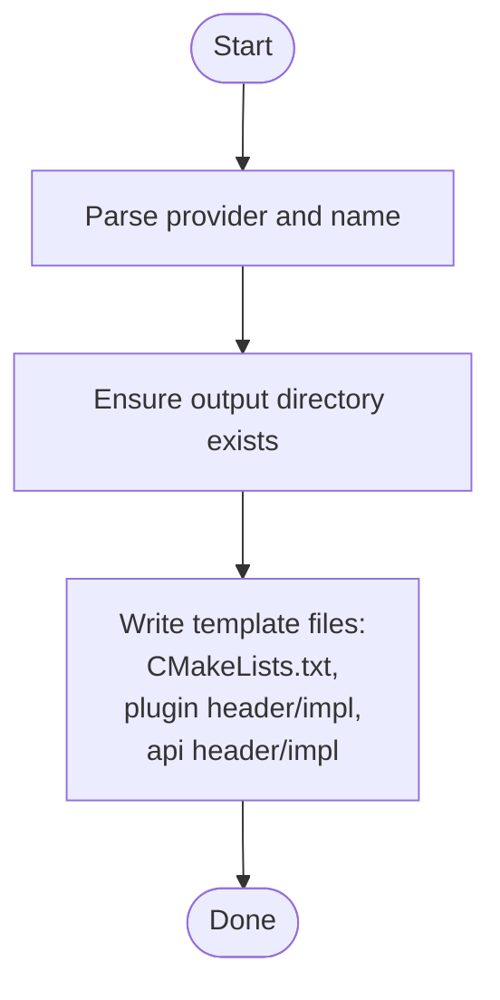
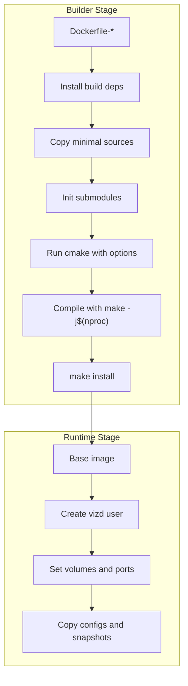
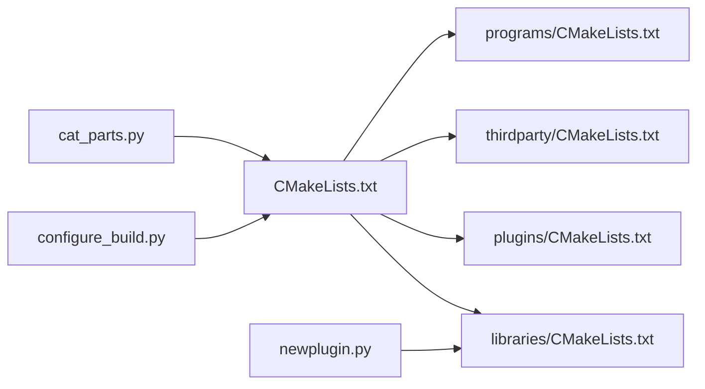

# Build System

<cite>
**Referenced Files in This Document**
- [CMakeLists.txt](file://CMakeLists.txt)
- [programs/CMakeLists.txt](file://programs/CMakeLists.txt)
- [libraries/CMakeLists.txt](file://libraries/CMakeLists.txt)
- [plugins/CMakeLists.txt](file://plugins/CMakeLists.txt)
- [thirdparty/CMakeLists.txt](file://thirdparty/CMakeLists.txt)
- [programs/build_helpers/configure_build.py](file://programs/build_helpers/configure_build.py)
- [programs/build_helpers/cat_parts.py](file://programs/build_helpers/cat_parts.py)
- [programs/util/newplugin.py](file://programs/util/newplugin.py)
- [documentation/building.md](file://documentation/building.md)
- [share/vizd/docker/Dockerfile-production](file://share/vizd/docker/Dockerfile-production)
- [share/vizd/docker/Dockerfile-lowmem](file://share/vizd/docker/Dockerfile-lowmem)
- [share/vizd/docker/Dockerfile-mongo](file://share/vizd/docker/Dockerfile-mongo)
- [share/vizd/docker/Dockerfile-testnet](file://share/vizd/docker/Dockerfile-testnet)
- [share/vizd/vizd.sh](file://share/vizd/vizd.sh)
</cite>

## Table of Contents
1. [Introduction](#introduction)
2. [Project Structure](#project-structure)
3. [Core Components](#core-components)
4. [Architecture Overview](#architecture-overview)
5. [Detailed Component Analysis](#detailed-component-analysis)
6. [Dependency Analysis](#dependency-analysis)
7. [Performance Considerations](#performance-considerations)
8. [Troubleshooting Guide](#troubleshooting-guide)
9. [Conclusion](#conclusion)
10. [Appendices](#appendices)

## Introduction
This document explains the build system for VIZ CPP Node, focusing on the CMake-based configuration, cross-platform compilation support, dependency management, and build targets. It also covers the build helper tools configure_build.py, cat_parts.py, and newplugin.py, and documents Docker-based development and production builds. Practical examples demonstrate common build scenarios such as development, release, and cross-compilation. Finally, it addresses troubleshooting common build issues and how build options influence runtime performance.

## Project Structure
The build system is organized around a top-level CMake project that orchestrates subprojects:
- Top-level CMake project defines compiler checks, options, platform-specific flags, and includes subdirectories for thirdparty, libraries, plugins, and programs.
- Subprojects:
  - libraries: API, chain, protocol, network, time, utilities, wallet
  - plugins: dynamically discovered via a scanning mechanism
  - thirdparty: appbase, fc, chainbase
  - programs: build_helpers, cli_wallet, vizd, js_operation_serializer, size_checker, util

**Diagram sources**
- [CMakeLists.txt](file://CMakeLists.txt#L210-L213)
- [thirdparty/CMakeLists.txt](file://thirdparty/CMakeLists.txt#L1-L3)
- [libraries/CMakeLists.txt](file://libraries/CMakeLists.txt#L1-L8)
- [plugins/CMakeLists.txt](file://plugins/CMakeLists.txt#L1-L12)
- [programs/CMakeLists.txt](file://programs/CMakeLists.txt#L1-L8)

**Section sources**
- [CMakeLists.txt](file://CMakeLists.txt#L1-L277)
- [libraries/CMakeLists.txt](file://libraries/CMakeLists.txt#L1-L8)
- [plugins/CMakeLists.txt](file://plugins/CMakeLists.txt#L1-L12)
- [thirdparty/CMakeLists.txt](file://thirdparty/CMakeLists.txt#L1-L3)
- [programs/CMakeLists.txt](file://programs/CMakeLists.txt#L1-L8)

## Core Components
- Top-level CMake project:
  - Enforces minimum compiler versions for GCC and Clang.
  - Configures Boost usage, optional static/shared libraries, and PCH support.
  - Provides compile-time options: BUILD_TESTNET, LOW_MEMORY_NODE, CHAINBASE_CHECK_LOCKING, ENABLE_MONGO_PLUGIN.
  - Sets platform-specific flags for Windows (MSVC/Mingw), macOS, and Linux.
  - Enables ccache globally when available.
  - Supports optional CPack installer generation.
- Subproject inclusion:
  - thirdparty, libraries, plugins, and programs are added as subdirectories.
- Helper scripts:
  - configure_build.py: wraps cmake with sensible defaults and cross-compilation support.
  - cat_parts.py: concatenates files from a directory tree into a single output file.
  - newplugin.py: scaffolds a new plugin directory and files.

**Section sources**
- [CMakeLists.txt](file://CMakeLists.txt#L1-L277)
- [programs/build_helpers/configure_build.py](file://programs/build_helpers/configure_build.py#L1-L202)
- [programs/build_helpers/cat_parts.py](file://programs/build_helpers/cat_parts.py#L1-L74)
- [programs/util/newplugin.py](file://programs/util/newplugin.py#L1-L251)

## Architecture Overview
The build pipeline integrates CMake configuration, platform detection, dependency discovery, and helper tools to produce binaries and optionally packaging artifacts.

**Diagram sources**
- [CMakeLists.txt](file://CMakeLists.txt#L210-L213)
- [programs/build_helpers/configure_build.py](file://programs/build_helpers/configure_build.py#L143-L195)
- [programs/build_helpers/cat_parts.py](file://programs/build_helpers/cat_parts.py#L11-L69)
- [programs/util/newplugin.py](file://programs/util/newplugin.py#L225-L246)

## Detailed Component Analysis

### CMake Configuration and Options
Key behaviors:
- Compiler enforcement: Fails early if GCC < 4.8 or Clang < 3.3.
- Boost configuration: Uses a curated component list and supports static usage; adds coroutine when available.
- Platform flags:
  - Windows (MSVC): Adds warning suppressions, disables safe-seh, ensures debug info, locates TCL.
  - Windows (MinGW): Enables C++11, permissive mode, SSE4.2, big obj, sets Release/Debug optimization flags, supports full static build.
  - macOS: Uses libc++, C++14, sets common warnings.
  - Linux: Uses C++14, enables rt and pthread, optional crypto library, supports full static build.
- Coverage/testing: Optional --coverage flag when enabled.
- Options:
  - BUILD_TESTNET: Adds preprocessor defines and prints configuration status.
  - LOW_MEMORY_NODE: Adds preprocessor defines and prints configuration status.
  - CHAINBASE_CHECK_LOCKING: Adds preprocessor defines and prints configuration status.
  - ENABLE_MONGO_PLUGIN: Adds MongoDB plugin linkage and preprocessor defines.
  - BUILD_SHARED_LIBRARIES: Defaults to off.
  - USE_PCH: Optional cotire precompiled headers support.
  - ENABLE_INSTALLER: Optional CPack packaging.

Build targets:
- The top-level project includes subprojects for thirdparty, libraries, plugins, and programs. Programs include build_helpers, cli_wallet, vizd, js_operation_serializer, size_checker, and util.

**Section sources**
- [CMakeLists.txt](file://CMakeLists.txt#L11-L20)
- [CMakeLists.txt](file://CMakeLists.txt#L38-L50)
- [CMakeLists.txt](file://CMakeLists.txt#L52-L81)
- [CMakeLists.txt](file://CMakeLists.txt#L83-L89)
- [CMakeLists.txt](file://CMakeLists.txt#L91-L156)
- [CMakeLists.txt](file://CMakeLists.txt#L158-L202)
- [CMakeLists.txt](file://CMakeLists.txt#L204-L208)
- [CMakeLists.txt](file://CMakeLists.txt#L210-L213)
- [programs/CMakeLists.txt](file://programs/CMakeLists.txt#L1-L8)
- [libraries/CMakeLists.txt](file://libraries/CMakeLists.txt#L1-L8)
- [plugins/CMakeLists.txt](file://plugins/CMakeLists.txt#L1-L12)
- [thirdparty/CMakeLists.txt](file://thirdparty/CMakeLists.txt#L1-L3)

### Cross-Platform Compilation Flags and Toolchains
- Windows:
  - MSVC: Warning suppressions, safe-seh disable, ensures debug info, finds TCL.
  - MinGW: C++11, permissive mode, SSE4.2, big obj, Release/Debug optimization, optional full static build.
- macOS:
  - C++14, libc++, common warnings, disables certain conversion warnings.
- Linux:
  - C++14, rt and pthread libraries, optional crypto library, optional full static build.
- Ninja + Clang diagnostics: colorized diagnostics when generator is Ninja and compiler is Clang.
- Debug build: defines DEBUG automatically.

**Section sources**
- [CMakeLists.txt](file://CMakeLists.txt#L123-L156)
- [CMakeLists.txt](file://CMakeLists.txt#L166-L184)
- [CMakeLists.txt](file://CMakeLists.txt#L190-L201)

### Dependency Management
- Boost: Required components include thread, date_time, system, filesystem, program_options, signals, serialization, chrono, unit_test_framework, context, locale. Static usage is preferred; coroutine is conditionally added for non-1.53 versions.
- OpenSSL: Optional via OPENSSL_ROOT_DIR; used when present.
- Readline: Found on non-Windows platforms; included if available.
- Crypto library: Defaults to crypto on Linux; configurable.
- ccache: Detected and used globally for compile/link steps when available.

**Section sources**
- [CMakeLists.txt](file://CMakeLists.txt#L38-L50)
- [CMakeLists.txt](file://CMakeLists.txt#L97-L104)
- [CMakeLists.txt](file://CMakeLists.txt#L106-L110)
- [CMakeLists.txt](file://CMakeLists.txt#L160-L164)
- [CMakeLists.txt](file://CMakeLists.txt#L176-L180)

### Build Targets
- Programs:
  - vizd: main node binary.
  - cli_wallet: command-line wallet.
  - js_operation_serializer: utility for JS operation serialization.
  - size_checker: utility for size analysis.
  - build_helpers: helper utilities.
  - util: various utilities.
- Libraries:
  - api, chain, protocol, network, time, utilities, wallet.
- Plugins:
  - Discovered dynamically via scanning for subdirectories with CMakeLists.txt.

**Section sources**
- [programs/CMakeLists.txt](file://programs/CMakeLists.txt#L1-L8)
- [libraries/CMakeLists.txt](file://libraries/CMakeLists.txt#L1-L8)
- [plugins/CMakeLists.txt](file://plugins/CMakeLists.txt#L1-L12)

### Build Helper Tools

#### configure_build.py
- Purpose: Simplifies invoking cmake with sensible defaults and cross-compilation support.
- Features:
  - Accepts --sys-root, --boost-dir, --openssl-dir to guide find modules.
  - Supports LOW_MEMORY_NODE and CMAKE_BUILD_TYPE toggles.
  - Supports Windows cross-compilation via MinGW with static linking flags and root path modes.
  - Passes additional cmake options after a separator.
- Typical usage:
  - Configure for Release with LOW_MEMORY_NODE=OFF.
  - Configure for Debug with LOW_MEMORY_NODE=ON.
  - Cross-compile for Windows using MinGW with static linking.

**Diagram sources**
- [programs/build_helpers/configure_build.py](file://programs/build_helpers/configure_build.py#L35-L119)
- [programs/build_helpers/configure_build.py](file://programs/build_helpers/configure_build.py#L143-L195)

**Section sources**
- [programs/build_helpers/configure_build.py](file://programs/build_helpers/configure_build.py#L1-L202)

#### cat_parts.py
- Purpose: Concatenates files from a directory tree into a single output file, preserving order and skipping non-files.
- Behavior:
  - Validates input directory and output file path.
  - Skips non-file entries and filters by suffix if requested.
  - Compares generated content with existing output to avoid unnecessary writes.
  - Creates parent directories if missing.

**Diagram sources**
- [programs/build_helpers/cat_parts.py](file://programs/build_helpers/cat_parts.py#L11-L69)

**Section sources**
- [programs/build_helpers/cat_parts.py](file://programs/build_helpers/cat_parts.py#L1-L74)

#### newplugin.py
- Purpose: Generates boilerplate files for a new plugin under libraries/plugins/<plugin_name>.
- Templates:
  - CMakeLists.txt for the plugin target.
  - Plugin header and implementation.
  - API header and implementation.
- Behavior:
  - Accepts provider and plugin name.
  - Writes files into a dedicated directory under libraries/plugins/<plugin_name>.

**Diagram sources**
- [programs/util/newplugin.py](file://programs/util/newplugin.py#L225-L246)

**Section sources**
- [programs/util/newplugin.py](file://programs/util/newplugin.py#L1-L251)

### Docker-Based Builds
The repository ships Dockerfiles for multiple environments:
- Production: Full node build with Release, shared libraries disabled, lock checking disabled, MongoDB plugin disabled.
- Low-memory: Same as production but with LOW_MEMORY_NODE enabled.
- Mongo: Installs MongoDB C/C++ drivers and enables ENABLE_MONGO_PLUGIN.
- Testnet: Builds with BUILD_TESTNET enabled.

Each Dockerfile:
- Uses a two-stage build to minimize image size.
- Copies only necessary source files to reduce rebuilds.
- Runs cmake with explicit options and compiles with parallel jobs.
- Installs artifacts and prepares runtime configuration files and volumes.

**Diagram sources**
- [share/vizd/docker/Dockerfile-production](file://share/vizd/docker/Dockerfile-production#L1-L88)
- [share/vizd/docker/Dockerfile-lowmem](file://share/vizd/docker/Dockerfile-lowmem#L1-L82)
- [share/vizd/docker/Dockerfile-mongo](file://share/vizd/docker/Dockerfile-mongo#L1-L111)
- [share/vizd/docker/Dockerfile-testnet](file://share/vizd/docker/Dockerfile-testnet#L1-L88)

**Section sources**
- [share/vizd/docker/Dockerfile-production](file://share/vizd/docker/Dockerfile-production#L40-L54)
- [share/vizd/docker/Dockerfile-lowmem](file://share/vizd/docker/Dockerfile-lowmem#L39-L53)
- [share/vizd/docker/Dockerfile-mongo](file://share/vizd/docker/Dockerfile-mongo#L68-L82)
- [share/vizd/docker/Dockerfile-testnet](file://share/vizd/docker/Dockerfile-testnet#L40-L55)

## Dependency Analysis
- Coupling:
  - Top-level CMake depends on subproject CMakeLists.txt files to register targets.
  - configure_build.py depends on filesystem layout and optional environment variables for Boost/OpenSSL.
  - cat_parts.py depends on directory structure and file suffix filtering.
  - newplugin.py depends on the libraries/plugins directory layout.
- External dependencies:
  - Boost (required), OpenSSL (optional), Readline (optional), ccache (optional), MongoDB drivers (optional).
- Indirect dependencies:
  - Plugins are discovered dynamically; their presence affects the build graph.

**Diagram sources**
- [CMakeLists.txt](file://CMakeLists.txt#L210-L213)
- [libraries/CMakeLists.txt](file://libraries/CMakeLists.txt#L1-L8)
- [plugins/CMakeLists.txt](file://plugins/CMakeLists.txt#L1-L12)
- [thirdparty/CMakeLists.txt](file://thirdparty/CMakeLists.txt#L1-L3)
- [programs/CMakeLists.txt](file://programs/CMakeLists.txt#L1-L8)
- [programs/build_helpers/configure_build.py](file://programs/build_helpers/configure_build.py#L143-L195)
- [programs/build_helpers/cat_parts.py](file://programs/build_helpers/cat_parts.py#L11-L69)
- [programs/util/newplugin.py](file://programs/util/newplugin.py#L225-L246)

**Section sources**
- [CMakeLists.txt](file://CMakeLists.txt#L210-L213)
- [programs/build_helpers/configure_build.py](file://programs/build_helpers/configure_build.py#L143-L195)
- [programs/build_helpers/cat_parts.py](file://programs/build_helpers/cat_parts.py#L11-L69)
- [programs/util/newplugin.py](file://programs/util/newplugin.py#L225-L246)

## Performance Considerations
- Compiler flags:
  - Release builds use aggressive optimization for MinGW and Linux.
  - Debug builds define DEBUG and can be paired with coverage instrumentation when enabled.
- Precompiled headers:
  - USE_PCH enables cotire for faster incremental builds.
- Static vs shared libraries:
  - BUILD_SHARED_LIBRARIES defaults to off, reducing runtime dependencies and potentially improving startup performance.
- Memory profile:
  - LOW_MEMORY_NODE reduces storage overhead by excluding non-consensus data, beneficial for resource-constrained nodes.
- Lock checking:
  - CHAINBASE_CHECK_LOCKING can be disabled for production builds to reduce overhead.
- ccache:
  - Global launch wrappers accelerate rebuilds when available.

Practical implications:
- Choose Release for production builds to maximize runtime performance.
- Disable CHAINBASE_CHECK_LOCKING and LOW_MEMORY_NODE unless required for specific roles.
- Enable USE_PCH for faster local development cycles.

**Section sources**
- [CMakeLists.txt](file://CMakeLists.txt#L148-L155)
- [CMakeLists.txt](file://CMakeLists.txt#L172-L183)
- [CMakeLists.txt](file://CMakeLists.txt#L52-L54)
- [CMakeLists.txt](file://CMakeLists.txt#L66-L74)
- [CMakeLists.txt](file://CMakeLists.txt#L76-L81)
- [CMakeLists.txt](file://CMakeLists.txt#L27-L31)
- [CMakeLists.txt](file://CMakeLists.txt#L106-L110)

## Troubleshooting Guide
Common issues and resolutions:
- Boost version mismatch:
  - Ensure Boost version satisfies minimum requirements and matches expectations; configure_build.py reads boost/version.hpp to infer version.
- Missing OpenSSL:
  - Set OPENSSL_ROOT_DIR to point to the installation prefix.
- Windows toolchain:
  - MSVC: Verify debug info flags and safe-seh settings; ensure TCL is found if needed.
  - MinGW: Confirm compiler supports C++11 and SSE4.2; use FULL_STATIC_BUILD if distributing static binaries.
- macOS:
  - Use libc++ and appropriate SDK; ensure Boost and OpenSSL are installed via package managers.
- Linux:
  - Ensure rt, pthread, and crypto libraries are available; static builds require static variants of libstdc++/libgcc.
- ccache:
  - If builds fail with unexpected cache behavior, temporarily disable ccache or clear the cache.
- Plugin discovery:
  - Ensure plugin subdirectories contain a CMakeLists.txt; plugins are discovered automatically.
- Docker builds:
  - For mongo builds, confirm MongoDB C/C++ drivers are installed prior to cmake invocation.
  - For testnet builds, ensure BUILD_TESTNET is set during configuration.

**Section sources**
- [programs/build_helpers/configure_build.py](file://programs/build_helpers/configure_build.py#L122-L140)
- [CMakeLists.txt](file://CMakeLists.txt#L97-L104)
- [CMakeLists.txt](file://CMakeLists.txt#L123-L156)
- [CMakeLists.txt](file://CMakeLists.txt#L166-L184)
- [share/vizd/docker/Dockerfile-mongo](file://share/vizd/docker/Dockerfile-mongo#L31-L58)

## Conclusion
The VIZ CPP Node build system centers on a robust CMake configuration with strong cross-platform support, clear options for memory and performance tuning, and practical helper tools. Dockerfiles streamline both development and production workflows. By leveraging configure_build.py, developers can quickly set up consistent builds across platforms, while cat_parts.py and newplugin.py automate common tasks. Proper selection of build options and compiler flags yields predictable runtime performance and maintainable deployment artifacts.

## Appendices

### Practical Build Scenarios

- Development build (Linux/macOS):
  - Configure with Release and LOW_MEMORY_NODE=OFF.
  - Use ccache for faster rebuilds.
  - Example invocation pattern: cmake -DCMAKE_BUILD_TYPE=Release -DLOW_MEMORY_NODE=OFF ..

- Release build (Linux):
  - Use Release with shared libraries disabled and lock checking disabled for production.
  - Example invocation pattern: cmake -DCMAKE_BUILD_TYPE=Release -DBUILD_SHARED_LIBRARIES=FALSE -DCHAINBASE_CHECK_LOCKING=FALSE ..

- Cross-compilation (Windows using MinGW):
  - Use configure_build.py with --windows to enable static linking and proper root path modes.
  - Example invocation pattern: python3 configure_build.py --windows --src ../..

- Low-memory node:
  - Enable LOW_MEMORY_NODE for consensus-only nodes.
  - Example invocation pattern: cmake -DLOW_MEMORY_NODE=ON ..

- Testnet build:
  - Enable BUILD_TESTNET for testnet configuration.
  - Example invocation pattern: cmake -DBUILD_TESTNET=TRUE ..

- MongoDB-enabled build:
  - Install MongoDB C/C++ drivers and enable ENABLE_MONGO_PLUGIN.
  - Example invocation pattern: cmake -DENABLE_MONGO_PLUGIN=TRUE ..

- Docker builds:
  - Production: docker build -f share/vizd/docker/Dockerfile-production -t viz-world .
  - Low-memory: docker build -f share/vizd/docker/Dockerfile-lowmem -t viz-world-lowmem .
  - Mongo: docker build -f share/vizd/docker/Dockerfile-mongo -t viz-world-mongo .
  - Testnet: docker build -f share/vizd/docker/Dockerfile-testnet -t viz-world-testnet .

**Section sources**
- [documentation/building.md](file://documentation/building.md#L1-L212)
- [programs/build_helpers/configure_build.py](file://programs/build_helpers/configure_build.py#L168-L184)
- [share/vizd/docker/Dockerfile-production](file://share/vizd/docker/Dockerfile-production#L46-L51)
- [share/vizd/docker/Dockerfile-lowmem](file://share/vizd/docker/Dockerfile-lowmem#L45-L50)
- [share/vizd/docker/Dockerfile-mongo](file://share/vizd/docker/Dockerfile-mongo#L74-L79)
- [share/vizd/docker/Dockerfile-testnet](file://share/vizd/docker/Dockerfile-testnet#L46-L52)