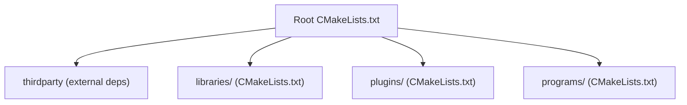
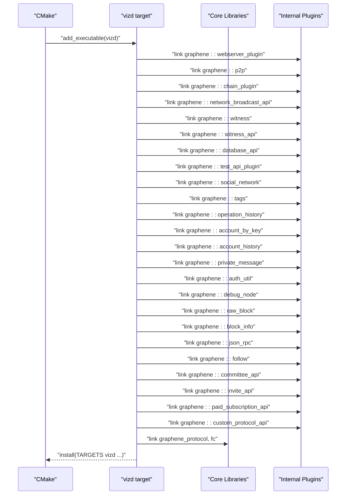
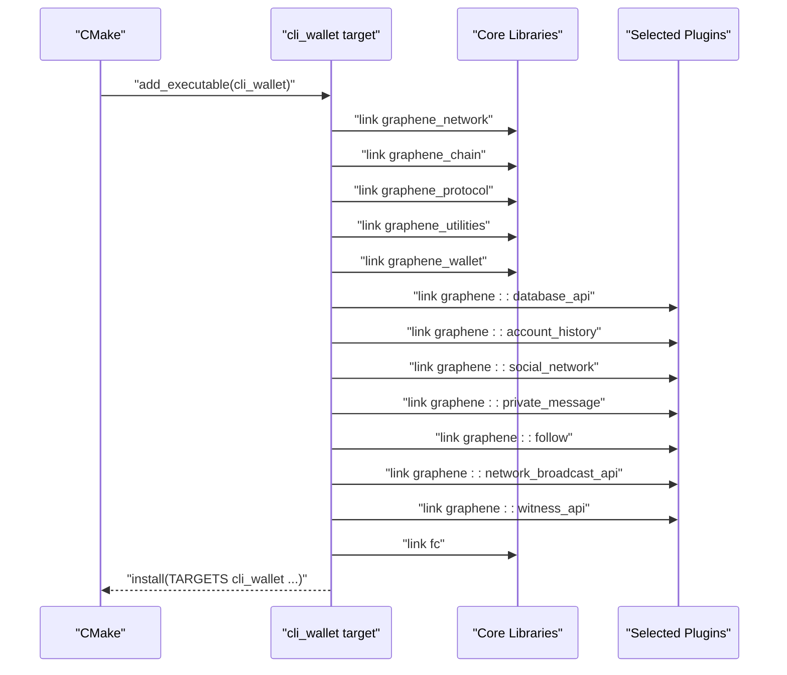
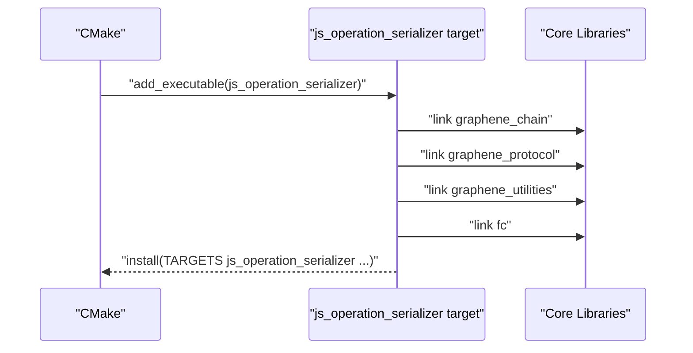
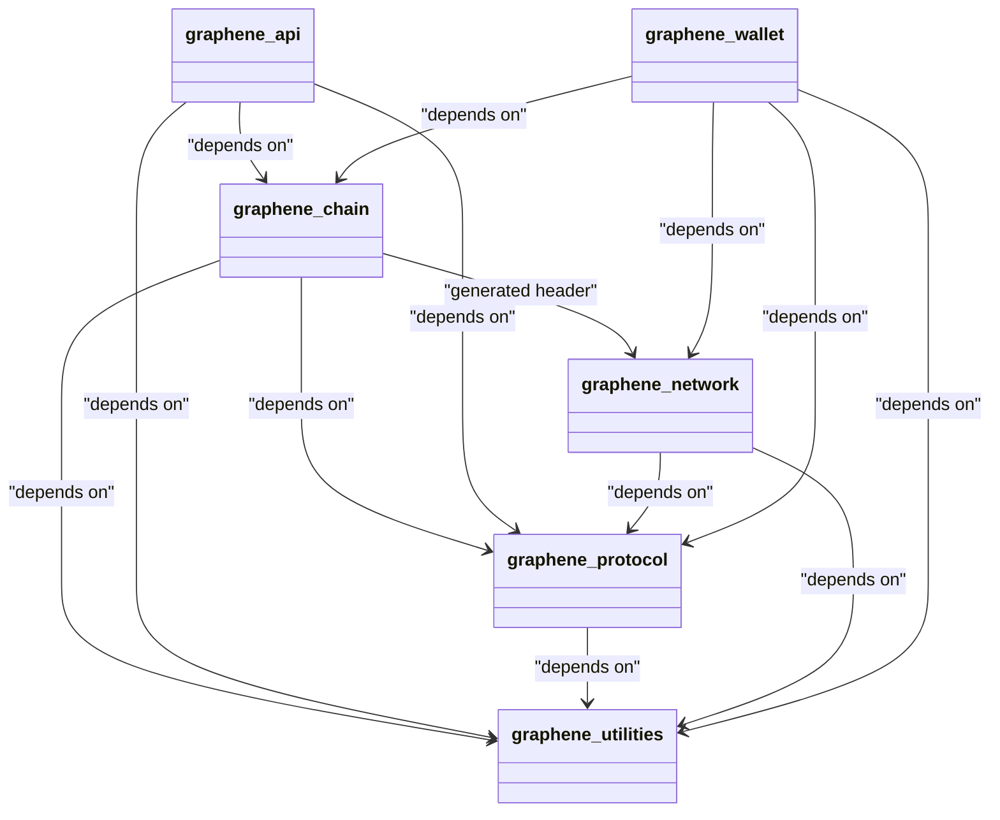
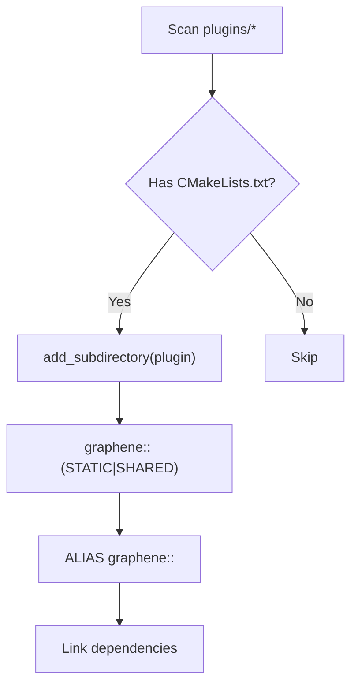
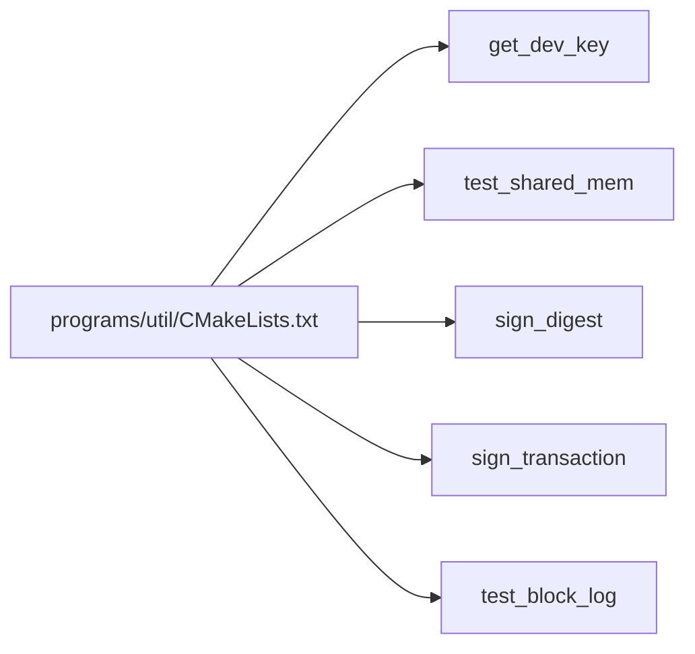
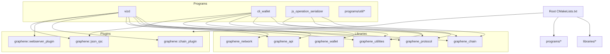

# Build Targets

<cite>
**Referenced Files in This Document**
- [CMakeLists.txt](file://CMakeLists.txt)
- [programs/CMakeLists.txt](file://programs/CMakeLists.txt)
- [libraries/CMakeLists.txt](file://libraries/CMakeLists.txt)
- [plugins/CMakeLists.txt](file://plugins/CMakeLists.txt)
- [programs/vizd/CMakeLists.txt](file://programs/vizd/CMakeLists.txt)
- [programs/cli_wallet/CMakeLists.txt](file://programs/cli_wallet/CMakeLists.txt)
- [programs/js_operation_serializer/CMakeLists.txt](file://programs/js_operation_serializer/CMakeLists.txt)
- [libraries/chain/CMakeLists.txt](file://libraries/chain/CMakeLists.txt)
- [libraries/api/CMakeLists.txt](file://libraries/api/CMakeLists.txt)
- [libraries/protocol/CMakeLists.txt](file://libraries/protocol/CMakeLists.txt)
- [libraries/network/CMakeLists.txt](file://libraries/network/CMakeLists.txt)
- [libraries/utilities/CMakeLists.txt](file://libraries/utilities/CMakeLists.txt)
- [libraries/wallet/CMakeLists.txt](file://libraries/wallet/CMakeLists.txt)
- [plugins/chain/CMakeLists.txt](file://plugins/chain/CMakeLists.txt)
- [plugins/webserver/CMakeLists.txt](file://plugins/webserver/CMakeLists.txt)
- [programs/util/CMakeLists.txt](file://programs/util/CMakeLists.txt)
- [programs/build_helpers/CMakeLists.txt](file://programs/build_helpers/CMakeLists.txt)
</cite>

## Table of Contents
1. [Introduction](#introduction)
2. [Project Structure](#project-structure)
3. [Core Components](#core-components)
4. [Architecture Overview](#architecture-overview)
5. [Detailed Component Analysis](#detailed-component-analysis)
6. [Dependency Analysis](#dependency-analysis)
7. [Performance Considerations](#performance-considerations)
8. [Troubleshooting Guide](#troubleshooting-guide)
9. [Conclusion](#conclusion)

## Introduction
This document describes the build targets for the VIZ CPP Node CMake configuration. It focuses on the main executables (vizd, cli_wallet, js_operation_serializer), library targets (libraries/*), plugin targets (plugins/*), and supporting utilities. It also covers static vs shared library compilation, test-related options, installation targets, and platform-specific considerations. The goal is to help developers customize the build scope for efficient development workflows.

## Project Structure
The top-level CMake configuration orchestrates subdirectories for third-party dependencies, libraries, plugins, and programs. Library and plugin targets are built conditionally based on shared/static selection and optional features.

**Diagram sources**
- [CMakeLists.txt](file://CMakeLists.txt#L210-L213)
- [libraries/CMakeLists.txt](file://libraries/CMakeLists.txt#L1-L8)
- [plugins/CMakeLists.txt](file://plugins/CMakeLists.txt#L1-L12)
- [programs/CMakeLists.txt](file://programs/CMakeLists.txt#L1-L8)

**Section sources**
- [CMakeLists.txt](file://CMakeLists.txt#L210-L213)
- [libraries/CMakeLists.txt](file://libraries/CMakeLists.txt#L1-L8)
- [plugins/CMakeLists.txt](file://plugins/CMakeLists.txt#L1-L12)
- [programs/CMakeLists.txt](file://programs/CMakeLists.txt#L1-L8)

## Core Components
This section summarizes the primary build targets and their roles.

- Executables
  - vizd: Full node executable with numerous internal plugins linked statically by default.
  - cli_wallet: Command-line wallet application linking against chain, protocol, utilities, and wallet libraries plus selected plugins.
  - js_operation_serializer: Operation serialization tool for JavaScript consumers.
- Libraries
  - libraries/chain, api, protocol, network, utilities, wallet: Core libraries compiled either as static or shared depending on BUILD_SHARED_LIBRARIES.
- Plugins
  - plugins/*: Dynamically loaded modules compiled as static or shared per BUILD_SHARED_LIBRARIES; discovery via globbing.
- Utilities
  - programs/util/*: Developer and testing utilities (signing, block log tests, etc.).

Key configuration toggles:
- BUILD_SHARED_LIBRARIES: Controls whether libraries are built as static or shared.
- ENABLE_MONGO_PLUGIN: Enables MongoDB plugin linkage and defines a preprocessor macro.
- BUILD_TESTNET: Adds a preprocessor definition for testnet builds.
- LOW_MEMORY_NODE: Adds a preprocessor definition for low-memory builds.
- CHAINBASE_CHECK_LOCKING: Adds a preprocessor definition enabling chainbase locking checks.
- USE_PCH: Optional precompiled header support via cotire.
- FULL_STATIC_BUILD: Platform-specific static linking flags for MinGW/MSVC.

**Section sources**
- [CMakeLists.txt](file://CMakeLists.txt#L52-L89)
- [libraries/chain/CMakeLists.txt](file://libraries/chain/CMakeLists.txt#L16-L124)
- [libraries/api/CMakeLists.txt](file://libraries/api/CMakeLists.txt#L28-L49)
- [libraries/protocol/CMakeLists.txt](file://libraries/protocol/CMakeLists.txt#L40-L57)
- [libraries/network/CMakeLists.txt](file://libraries/network/CMakeLists.txt#L24-L44)
- [libraries/utilities/CMakeLists.txt](file://libraries/utilities/CMakeLists.txt#L22-L31)
- [libraries/wallet/CMakeLists.txt](file://libraries/wallet/CMakeLists.txt#L38-L70)
- [plugins/CMakeLists.txt](file://plugins/CMakeLists.txt#L1-L12)

## Architecture Overview
The build architecture links applications to libraries and plugins. vizd links to many internal plugins and core libraries. cli_wallet links to core libraries and selected plugins. js_operation_serializer links to minimal core libraries.

```mermaid
graph TB
subgraph "Applications"
VIZD["vizd"]
CLI["cli_wallet"]
SER["js_operation_serializer"]
end
subgraph "Core Libraries"
Chain["graphene_chain"]
Protocol["graphene_protocol"]
Network["graphene_network"]
Utilities["graphene_utilities"]
Wallet["graphene_wallet"]
Api["graphene_api"]
end
subgraph "Plugins"
PChain["graphene::chain_plugin"]
PWeb["graphene::webserver_plugin"]
PJson["graphene::json_rpc"]
PWitness["graphene::witness"]
PTags["graphene::tags"]
PFollow["graphene::follow"]
PCommittee["graphene::committee_api"]
PMongo["graphene::mongo_db (optional)"]
end
VIZD --> PChain
VIZD --> PWeb
VIZD --> PWitness
VIZD --> PTags
VIZD --> PFollow
VIZD --> PCommittee
VIZD --> PMongo
VIZD --> Chain
VIZD --> Protocol
VIZD --> Utilities
VIZD --> Network
VIZD --> Api
CLI --> Chain
CLI --> Protocol
CLI --> Utilities
CLI --> Wallet
CLI --> Api
SER --> Chain
SER --> Protocol
SER --> Utilities
```

**Diagram sources**
- [programs/vizd/CMakeLists.txt](file://programs/vizd/CMakeLists.txt#L16-L49)
- [programs/cli_wallet/CMakeLists.txt](file://programs/cli_wallet/CMakeLists.txt#L21-L41)
- [programs/js_operation_serializer/CMakeLists.txt](file://programs/js_operation_serializer/CMakeLists.txt#L6-L7)
- [libraries/chain/CMakeLists.txt](file://libraries/chain/CMakeLists.txt#L126-L128)
- [libraries/api/CMakeLists.txt](file://libraries/api/CMakeLists.txt#L43-L49)
- [libraries/protocol/CMakeLists.txt](file://libraries/protocol/CMakeLists.txt#L55-L57)
- [libraries/network/CMakeLists.txt](file://libraries/network/CMakeLists.txt#L39)
- [libraries/utilities/CMakeLists.txt](file://libraries/utilities/CMakeLists.txt#L31)
- [libraries/wallet/CMakeLists.txt](file://libraries/wallet/CMakeLists.txt#L50-L70)
- [plugins/chain/CMakeLists.txt](file://plugins/chain/CMakeLists.txt#L26-L33)
- [plugins/webserver/CMakeLists.txt](file://plugins/webserver/CMakeLists.txt#L26-L32)

## Detailed Component Analysis

### vizd (Full Node Executable)
- Purpose: The primary node executable with a broad set of enabled plugins.
- Linkage: Links to appbase, webserver plugin, p2p, chain plugin, network broadcast API, witness, witness API, database API, test API, social network, tags, operation history, account by key, account history, private message, auth utility, debug node, raw block, block info, JSON RPC, follow, committee API, invite API, paid subscription API, custom protocol API, and optionally MongoDB plugin. Also links to protocol, fc, and platform-specific libraries.
- Installation: Installable under bin with standard DESTINATION entries.
- Platform specifics:
  - UNIX (non-Apple): Links to rt if found.
  - Apple: Links to readline if found.
  - Gperftools detection: If found, links to tcmalloc.
- Static vs shared: Libraries are controlled by BUILD_SHARED_LIBRARIES; vizd itself is an executable.

**Diagram sources**
- [programs/vizd/CMakeLists.txt](file://programs/vizd/CMakeLists.txt#L1-L58)

**Section sources**
- [programs/vizd/CMakeLists.txt](file://programs/vizd/CMakeLists.txt#L1-L58)

### cli_wallet (Command-Line Wallet)
- Purpose: A command-line wallet for interacting with the node.
- Linkage: Links to graphene_network, graphene_chain, graphene_protocol, graphene_utilities, graphene_wallet, and several API plugins (database_api, account_history, social_network, private_message, follow, network_broadcast_api, witness_api). Also links to fc, readline (on Apple), dl libs, platform-specific libs, and Boost regex.
- Installation: Installable under bin with standard DESTINATION entries.
- Platform specifics:
  - UNIX (non-Apple): Links to rt if found.
  - Apple: Links to readline if found.
  - Gperftools detection: If found, links to tcmalloc.
  - MSVC: Applies /bigobj to main.cpp.

**Diagram sources**
- [programs/cli_wallet/CMakeLists.txt](file://programs/cli_wallet/CMakeLists.txt#L1-L54)

**Section sources**
- [programs/cli_wallet/CMakeLists.txt](file://programs/cli_wallet/CMakeLists.txt#L1-L54)

### js_operation_serializer (Operation Serialization Tool)
- Purpose: Generates serialized operation schemas for JavaScript.
- Linkage: Minimal linkage to graphene_chain, graphene_protocol, graphene_utilities, and fc with dl libs and platform-specific libs.
- Installation: Installable under bin with standard DESTINATION entries.

**Diagram sources**
- [programs/js_operation_serializer/CMakeLists.txt](file://programs/js_operation_serializer/CMakeLists.txt#L1-L16)

**Section sources**
- [programs/js_operation_serializer/CMakeLists.txt](file://programs/js_operation_serializer/CMakeLists.txt#L1-L16)

### Library Targets (libraries/*)
- graphene_chain
  - Static or shared based on BUILD_SHARED_LIBRARIES.
  - Depends on graphene_protocol, graphene_utilities, fc, chainbase, appbase.
  - Includes generated hardfork.hpp via a custom target.
  - MSVC: Applies /bigobj to database.cpp.
- graphene_api
  - Static or shared based on BUILD_SHARED_LIBRARIES.
  - Depends on graphene_chain, graphene_protocol, graphene_utilities, fc.
- graphene_protocol
  - Static or shared based on BUILD_SHARED_LIBRARIES.
  - Depends on fc; includes version headers.
- graphene_network
  - Static or shared based on BUILD_SHARED_LIBRARIES.
  - Depends on fc and graphene_protocol; supports PCH via cotire if enabled.
  - MSVC: Applies /bigobj to node.cpp.
- graphene_utilities
  - Static or shared based on BUILD_SHARED_LIBRARIES.
  - Depends on fc; generates git_revision.cpp via configure_file.
  - Supports PCH via cotire if enabled.
- graphene_wallet
  - Static or shared based on BUILD_SHARED_LIBRARIES.
  - Depends on multiple API plugins and core libraries; supports PCH via cotire if enabled.
  - MSVC: Applies /bigobj to wallet.cpp.

**Diagram sources**
- [libraries/chain/CMakeLists.txt](file://libraries/chain/CMakeLists.txt#L126-L128)
- [libraries/api/CMakeLists.txt](file://libraries/api/CMakeLists.txt#L43-L49)
- [libraries/protocol/CMakeLists.txt](file://libraries/protocol/CMakeLists.txt#L55-L57)
- [libraries/network/CMakeLists.txt](file://libraries/network/CMakeLists.txt#L39)
- [libraries/utilities/CMakeLists.txt](file://libraries/utilities/CMakeLists.txt#L31)
- [libraries/wallet/CMakeLists.txt](file://libraries/wallet/CMakeLists.txt#L50-L70)

**Section sources**
- [libraries/chain/CMakeLists.txt](file://libraries/chain/CMakeLists.txt#L16-L142)
- [libraries/api/CMakeLists.txt](file://libraries/api/CMakeLists.txt#L28-L60)
- [libraries/protocol/CMakeLists.txt](file://libraries/protocol/CMakeLists.txt#L40-L70)
- [libraries/network/CMakeLists.txt](file://libraries/network/CMakeLists.txt#L24-L64)
- [libraries/utilities/CMakeLists.txt](file://libraries/utilities/CMakeLists.txt#L22-L47)
- [libraries/wallet/CMakeLists.txt](file://libraries/wallet/CMakeLists.txt#L38-L85)

### Plugin Targets (plugins/*)
Plugin discovery is automated via globbing over plugin directories. Each plugin target is built as static or shared according to BUILD_SHARED_LIBRARIES and exposes an alias graphene::<plugin_name>.

- Example: chain plugin
  - Provides graphene::chain_plugin alias.
  - Depends on graphene_chain, graphene_protocol, fc, appbase, and json_rpc.
- Example: webserver plugin
  - Provides graphene::webserver_plugin alias.
  - Depends on graphene::json_rpc, graphene_chain, graphene::chain_plugin, appbase, fc.

**Diagram sources**
- [plugins/CMakeLists.txt](file://plugins/CMakeLists.txt#L1-L12)
- [plugins/chain/CMakeLists.txt](file://plugins/chain/CMakeLists.txt#L10-L33)
- [plugins/webserver/CMakeLists.txt](file://plugins/webserver/CMakeLists.txt#L11-L32)

**Section sources**
- [plugins/CMakeLists.txt](file://plugins/CMakeLists.txt#L1-L12)
- [plugins/chain/CMakeLists.txt](file://plugins/chain/CMakeLists.txt#L1-L44)
- [plugins/webserver/CMakeLists.txt](file://plugins/webserver/CMakeLists.txt#L1-L43)

### Utility Programs (programs/util/*)
- get_dev_key, test_shared_mem, sign_digest, sign_transaction, test_block_log: Each links to core libraries and installs under bin.

**Diagram sources**
- [programs/util/CMakeLists.txt](file://programs/util/CMakeLists.txt#L1-L69)

**Section sources**
- [programs/util/CMakeLists.txt](file://programs/util/CMakeLists.txt#L1-L69)

### Build Helpers (programs/build_helpers)
- cat-parts: A small helper tool linking to fc and platform libs.

**Section sources**
- [programs/build_helpers/CMakeLists.txt](file://programs/build_helpers/CMakeLists.txt#L1-L8)

## Dependency Analysis
This section maps how targets depend on each other and external libraries.

**Diagram sources**
- [CMakeLists.txt](file://CMakeLists.txt#L210-L213)
- [programs/vizd/CMakeLists.txt](file://programs/vizd/CMakeLists.txt#L16-L49)
- [programs/cli_wallet/CMakeLists.txt](file://programs/cli_wallet/CMakeLists.txt#L21-L41)
- [programs/js_operation_serializer/CMakeLists.txt](file://programs/js_operation_serializer/CMakeLists.txt#L6-L7)
- [libraries/chain/CMakeLists.txt](file://libraries/chain/CMakeLists.txt#L126-L128)
- [libraries/api/CMakeLists.txt](file://libraries/api/CMakeLists.txt#L43-L49)
- [libraries/protocol/CMakeLists.txt](file://libraries/protocol/CMakeLists.txt#L55-L57)
- [libraries/network/CMakeLists.txt](file://libraries/network/CMakeLists.txt#L39)
- [libraries/utilities/CMakeLists.txt](file://libraries/utilities/CMakeLists.txt#L31)
- [libraries/wallet/CMakeLists.txt](file://libraries/wallet/CMakeLists.txt#L50-L70)
- [plugins/chain/CMakeLists.txt](file://plugins/chain/CMakeLists.txt#L26-L33)
- [plugins/webserver/CMakeLists.txt](file://plugins/webserver/CMakeLists.txt#L26-L32)

**Section sources**
- [CMakeLists.txt](file://CMakeLists.txt#L210-L213)
- [programs/vizd/CMakeLists.txt](file://programs/vizd/CMakeLists.txt#L16-L49)
- [programs/cli_wallet/CMakeLists.txt](file://programs/cli_wallet/CMakeLists.txt#L21-L41)
- [programs/js_operation_serializer/CMakeLists.txt](file://programs/js_operation_serializer/CMakeLists.txt#L6-L7)
- [libraries/chain/CMakeLists.txt](file://libraries/chain/CMakeLists.txt#L126-L128)
- [libraries/api/CMakeLists.txt](file://libraries/api/CMakeLists.txt#L43-L49)
- [libraries/protocol/CMakeLists.txt](file://libraries/protocol/CMakeLists.txt#L55-L57)
- [libraries/network/CMakeLists.txt](file://libraries/network/CMakeLists.txt#L39)
- [libraries/utilities/CMakeLists.txt](file://libraries/utilities/CMakeLists.txt#L31)
- [libraries/wallet/CMakeLists.txt](file://libraries/wallet/CMakeLists.txt#L50-L70)
- [plugins/chain/CMakeLists.txt](file://plugins/chain/CMakeLists.txt#L26-L33)
- [plugins/webserver/CMakeLists.txt](file://plugins/webserver/CMakeLists.txt#L26-L32)

## Performance Considerations
- Precompiled Headers (PCH): Optional cotire support exists for some libraries (e.g., network, utilities) to speed up compilation. Enable via USE_PCH.
- Compiler flags:
  - Windows (MSVC): Applies /wd4503, /wd4267, /wd4244 warnings suppressions and /SAFESEH:NO linker flags; Debug adds /DEBUG.
  - MinGW: Uses -std=c++11, -fpermissive, -msse4.2, -Wa,-mbig-obj; Debug optimized to -O2; Release to -O3; optional static linking flags via FULL_STATIC_BUILD.
  - Clang on macOS: -stdlib=libc++; Ninja generator adds -fcolor-diagnostics; enables -DDEBUG in Debug.
  - GCC on Linux: Adds -fno-builtin-memcmp; Ninja adds -fcolor-diagnostics; enables -DDEBUG in Debug; optional static linking flags via FULL_STATIC_BUILD.
- Memory profiling: Gperftools detection enables tcmalloc linkage for vizd and cli_wallet when available.
- Coverage: ENABLE_COVERAGE_TESTING toggles --coverage in CXX flags.

**Section sources**
- [CMakeLists.txt](file://CMakeLists.txt#L123-L156)
- [CMakeLists.txt](file://CMakeLists.txt#L166-L202)
- [CMakeLists.txt](file://CMakeLists.txt#L206-L208)
- [programs/vizd/CMakeLists.txt](file://programs/vizd/CMakeLists.txt#L10-L14)
- [programs/cli_wallet/CMakeLists.txt](file://programs/cli_wallet/CMakeLists.txt#L10-L14)

## Troubleshooting Guide
- Boost static/shared linkage:
  - Boost_USE_STATIC_LIBS defaults to TRUE globally.
  - On Windows, BOOST_ALL_DYN_LINK is OFF to force static linking; ensure compatible Boost libraries.
- MongoDB plugin:
  - ENABLE_MONGO_PLUGIN adds graphene::mongo_db to vizd and defines DMONGODB_PLUGIN_BUILT macros.
- Testnet and Low-Memory:
  - BUILD_TESTNET and LOW_MEMORY_NODE inject -DBUILD_TESTNET and -DIS_LOW_MEM respectively.
- Chainbase locking checks:
  - CHAINBASE_CHECK_LOCKING adds -DCHAINBASE_CHECK_LOCKING when enabled.
- Hardfork header generation:
  - chain library depends on a generated hardfork.hpp via a custom target; ensure cat-parts is available on Windows or Python-based script on Unix-like systems.
- Platform-specific libraries:
  - UNIX (non-Apple): rt library linkage.
  - Apple: readline linkage.
  - dl libs automatically linked via ${CMAKE_DL_LIBS}.
- Static vs shared:
  - BUILD_SHARED_LIBRARIES controls library type for libraries/* and plugins/*.
  - FULL_STATIC_BUILD toggles static linking flags for MinGW/MSVC.

**Section sources**
- [CMakeLists.txt](file://CMakeLists.txt#L52-L89)
- [CMakeLists.txt](file://CMakeLists.txt#L91-L156)
- [CMakeLists.txt](file://CMakeLists.txt#L158-L202)
- [libraries/chain/CMakeLists.txt](file://libraries/chain/CMakeLists.txt#L1-L9)
- [programs/vizd/CMakeLists.txt](file://programs/vizd/CMakeLists.txt#L4-L8)
- [programs/cli_wallet/CMakeLists.txt](file://programs/cli_wallet/CMakeLists.txt#L2-L8)

## Conclusion
The VIZ CPP Node build system organizes targets into libraries, plugins, and applications. Libraries support both static and shared modes controlled by BUILD_SHARED_LIBRARIES. Applications link to core libraries and selected plugins, with platform-specific optimizations and optional features like MongoDB plugin, testnet/low-memory configurations, and PCH support. Developers can tailor builds by toggling options and selectively enabling/disabling components.