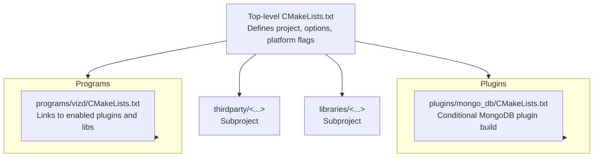
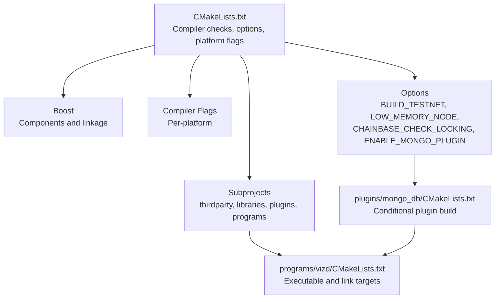
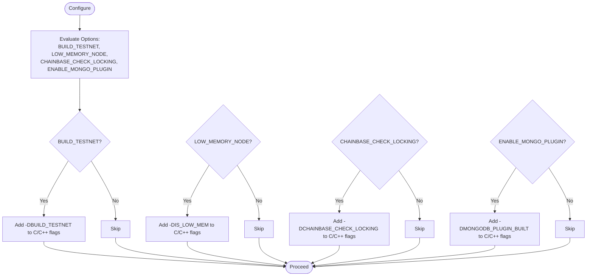
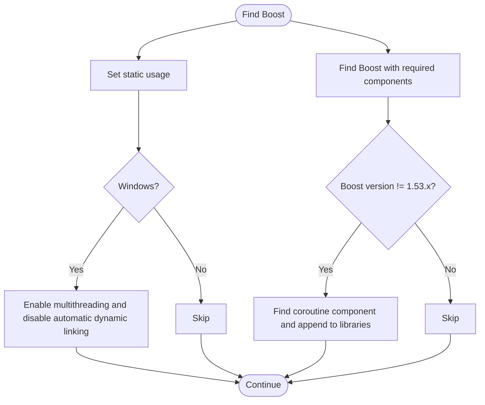
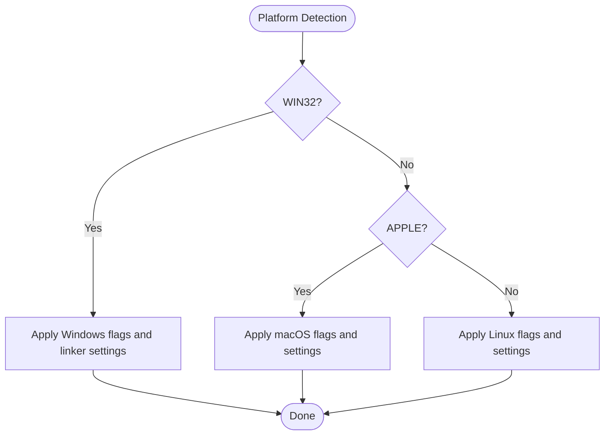
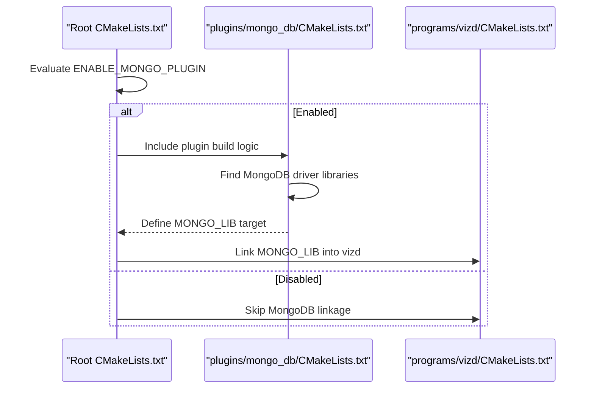
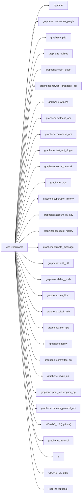

# CMake Configuration

<cite>
**Referenced Files in This Document**
- [CMakeLists.txt](file://CMakeLists.txt)
- [libraries/CMakeLists.txt](file://libraries/CMakeLists.txt)
- [plugins/mongo_db/CMakeLists.txt](file://plugins/mongo_db/CMakeLists.txt)
- [programs/vizd/CMakeLists.txt](file://programs/vizd/CMakeLists.txt)
- [documentation/building.md](file://documentation/building.md)
- [documentation/testing.md](file://documentation/testing.md)
- [share/vizd/docker/Dockerfile-production](file://share/vizd/docker/Dockerfile-production)
- [share/vizd/docker/Dockerfile-testnet](file://share/vizd/docker/Dockerfile-testnet)
</cite>

## Table of Contents
1. [Introduction](#introduction)
2. [Project Structure](#project-structure)
3. [Core Components](#core-components)
4. [Architecture Overview](#architecture-overview)
5. [Detailed Component Analysis](#detailed-component-analysis)
6. [Dependency Analysis](#dependency-analysis)
7. [Performance Considerations](#performance-considerations)
8. [Troubleshooting Guide](#troubleshooting-guide)
9. [Conclusion](#conclusion)
10. [Appendices](#appendices)

## Introduction
This document explains the CMake configuration for the VIZ CPP Node, focusing on the top-level CMake project setup, compiler requirements, platform-specific configurations, build options, Boost library configuration, compiler flags, and practical CMake invocation examples. It also covers how options affect compilation flags and feature availability, and provides troubleshooting guidance for common build issues.

## Project Structure
The build system is organized around a top-level CMake project that orchestrates subprojects:
- Top-level project defines compiler requirements, options, and platform flags.
- Subprojects include thirdparty libraries, internal libraries, plugins, and programs.
- Platform-specific logic configures flags for Windows, macOS, and Linux.
- Optional MongoDB plugin integrates via dedicated CMake logic gated by an option.

**Diagram sources**
- [CMakeLists.txt](file://CMakeLists.txt#L210-L213)
- [libraries/CMakeLists.txt](file://libraries/CMakeLists.txt#L1-L8)
- [plugins/mongo_db/CMakeLists.txt](file://plugins/mongo_db/CMakeLists.txt#L2-L81)
- [programs/vizd/CMakeLists.txt](file://programs/vizd/CMakeLists.txt#L1-L58)

**Section sources**
- [CMakeLists.txt](file://CMakeLists.txt#L1-L277)
- [libraries/CMakeLists.txt](file://libraries/CMakeLists.txt#L1-L8)

## Core Components
This section documents the primary CMake configuration elements defined in the top-level CMakeLists.txt.

- Project setup and minimum CMake version
  - The project is named and requires a minimum CMake version.
  - Compiler requirement enforcement for GCC and Clang is performed early in configuration.

- Build options and their effects
  - BUILD_TESTNET: Adds preprocessor definitions enabling testnet-specific code paths.
  - LOW_MEMORY_NODE: Adds preprocessor definitions enabling low-memory node behavior.
  - CHAINBASE_CHECK_LOCKING: Adds preprocessor definitions enabling chainbase locking checks.
  - ENABLE_MONGO_PLUGIN: Enables MongoDB plugin build and adds a preprocessor definition; links the plugin target when found.

- Boost library configuration
  - Declares required Boost components.
  - Forces static Boost usage by default.
  - Adjusts Windows-specific Boost settings and handles coroutine component detection.
  - Requires a minimum Boost version and locates Boost with COMPONENTS.

- Platform-specific configurations
  - Windows (MSVC/MINGW): Applies Windows-specific compiler and linker flags, TLS/CCache integration, and TCL library discovery.
  - macOS: Uses C++ standard and libc++, sets warning flags, and applies platform-specific behavior.
  - Linux: Uses C++ standard, sets warning flags, locates readline, and applies platform-specific libraries.

- Compiler flags and optimization
  - Sets C++ standard per platform.
  - Configures debug and release flags, including debug macro definitions.
  - Adds coverage flags when enabled.
  - Uses ccache when detected.

- Subproject inclusion
  - Includes thirdparty, libraries, plugins, and programs subdirectories.

**Section sources**
- [CMakeLists.txt](file://CMakeLists.txt#L1-L277)

## Architecture Overview
The CMake configuration enforces compiler requirements, exposes build options, configures platform flags, locates dependencies, and wires subprojects together. The MongoDB plugin is conditionally included and linked into the node executable when enabled.

**Diagram sources**
- [CMakeLists.txt](file://CMakeLists.txt#L12-L20)
- [CMakeLists.txt](file://CMakeLists.txt#L38-L104)
- [CMakeLists.txt](file://CMakeLists.txt#L112-L202)
- [plugins/mongo_db/CMakeLists.txt](file://plugins/mongo_db/CMakeLists.txt#L2-L81)
- [programs/vizd/CMakeLists.txt](file://programs/vizd/CMakeLists.txt#L16-L49)

## Detailed Component Analysis

### Compiler Requirements and Toolchain
- GCC minimum version enforced during configuration.
- Clang minimum version enforced during configuration.
- Early failure if requirements are not met prevents downstream build issues.

**Section sources**
- [CMakeLists.txt](file://CMakeLists.txt#L12-L20)

### Build Options and Feature Flags
- BUILD_TESTNET
  - Adds preprocessor definitions for both C and C++.
  - Prints configuration status and final mode selection.
- LOW_MEMORY_NODE
  - Adds preprocessor definitions for both C and C++.
  - Prints configuration status and final mode selection.
- CHAINBASE_CHECK_LOCKING
  - Adds preprocessor definitions for both C and C++.
- ENABLE_MONGO_PLUGIN
  - Enables MongoDB plugin build and adds a preprocessor definition.
  - Links the plugin target into dependent executables.

**Diagram sources**
- [CMakeLists.txt](file://CMakeLists.txt#L56-L89)

**Section sources**
- [CMakeLists.txt](file://CMakeLists.txt#L56-L89)

### Boost Library Configuration
- Declares required components and forces static usage by default.
- On Windows, sets multithreading and disables automatic dynamic linking.
- Locates Boost with a minimum version and augments with coroutine when available.

**Diagram sources**
- [CMakeLists.txt](file://CMakeLists.txt#L38-L50)
- [CMakeLists.txt](file://CMakeLists.txt#L52-L54)
- [CMakeLists.txt](file://CMakeLists.txt#L91-L104)

**Section sources**
- [CMakeLists.txt](file://CMakeLists.txt#L38-L50)
- [CMakeLists.txt](file://CMakeLists.txt#L52-L54)
- [CMakeLists.txt](file://CMakeLists.txt#L91-L104)

### Platform-Specific Configurations
- Windows (MSVC/MINGW)
  - Adds MSVC warnings suppressions and linker flags.
  - Ensures debug info presence in Debug configuration.
  - Detects and configures TCL library for Windows toolchains.
  - Applies C++11 flags and optimizations for MinGW.
- macOS
  - Uses C++ standard and libc++.
  - Applies warning flags and macOS-specific behavior.
- Linux
  - Uses C++ standard and warning flags.
  - Locates readline and sets platform-specific libraries.
  - Supports static linking when requested.

**Diagram sources**
- [CMakeLists.txt](file://CMakeLists.txt#L112-L202)

**Section sources**
- [CMakeLists.txt](file://CMakeLists.txt#L112-L202)

### Compiler Flags, Optimization, and Debug/Release
- Debug and Release configurations receive distinct flags.
- Debug configuration adds a debug macro.
- Coverage testing can be enabled to inject coverage flags.
- Ninja generator receives color diagnostics for Clang.

**Section sources**
- [CMakeLists.txt](file://CMakeLists.txt#L196-L208)
- [CMakeLists.txt](file://CMakeLists.txt#L190-L194)

### MongoDB Plugin Integration
- When enabled, the plugin is discovered and built conditionally.
- The plugin target is linked into the node executable.
- Preprocessor definitions enable MongoDB-related code paths.

**Diagram sources**
- [CMakeLists.txt](file://CMakeLists.txt#L82-L89)
- [plugins/mongo_db/CMakeLists.txt](file://plugins/mongo_db/CMakeLists.txt#L2-L81)
- [programs/vizd/CMakeLists.txt](file://programs/vizd/CMakeLists.txt#L44-L44)

**Section sources**
- [CMakeLists.txt](file://CMakeLists.txt#L82-L89)
- [plugins/mongo_db/CMakeLists.txt](file://plugins/mongo_db/CMakeLists.txt#L2-L81)
- [programs/vizd/CMakeLists.txt](file://programs/vizd/CMakeLists.txt#L44-L44)

## Dependency Analysis
The build system composes the final executable by linking together appbase, internal libraries, enabled plugins, and platform-specific libraries. The MongoDB plugin target is conditionally included when enabled.

**Diagram sources**
- [programs/vizd/CMakeLists.txt](file://programs/vizd/CMakeLists.txt#L16-L49)

**Section sources**
- [programs/vizd/CMakeLists.txt](file://programs/vizd/CMakeLists.txt#L16-L49)

## Performance Considerations
- Static vs shared libraries
  - Static libraries are default; shared libraries can be enabled via an option.
- Coverage testing
  - Coverage flags can be injected when coverage testing is enabled.
- ccache
  - When detected, ccache is configured globally for compile and link steps to speed up rebuilds.

**Section sources**
- [CMakeLists.txt](file://CMakeLists.txt#L54-L54)
- [CMakeLists.txt](file://CMakeLists.txt#L204-L208)
- [CMakeLists.txt](file://CMakeLists.txt#L106-L110)

## Troubleshooting Guide
- Compiler version mismatch
  - Ensure GCC meets the minimum version requirement or Clang meets its requirement; otherwise configuration fails early.
- Boost version and components
  - Verify Boost version meets the minimum requirement and that all declared components are available.
  - On Windows, ensure Boost static usage is appropriate for your toolchain.
- Missing MongoDB drivers
  - When the MongoDB plugin is enabled, driver libraries must be discoverable; otherwise the plugin build is skipped.
- Platform-specific issues
  - Windows: Confirm toolchain compatibility and linker flags; ensure debug info is emitted in Debug configuration.
  - macOS: Confirm C++ standard and libc++ usage.
  - Linux: Confirm readline availability and platform-specific libraries.
- Static linking
  - Static builds require compatible static variants of all dependencies; adjust flags accordingly.

**Section sources**
- [CMakeLists.txt](file://CMakeLists.txt#L12-L20)
- [CMakeLists.txt](file://CMakeLists.txt#L97-L104)
- [plugins/mongo_db/CMakeLists.txt](file://plugins/mongo_db/CMakeLists.txt#L15-L22)
- [CMakeLists.txt](file://CMakeLists.txt#L112-L202)

## Conclusion
The VIZ CPP Node’s CMake configuration enforces compiler requirements, exposes configurable build options, and adapts to Windows, macOS, and Linux environments. By leveraging options like BUILD_TESTNET, LOW_MEMORY_NODE, CHAINBASE_CHECK_LOCKING, and ENABLE_MONGO_PLUGIN, developers can tailor builds for different deployment scenarios. Correct Boost configuration and platform-specific flags ensure reliable builds across environments.

## Appendices

### Practical CMake Invocation Examples
- Development build (Linux/macOS)
  - Configure with Release and enable shared libraries if desired.
  - Example invocation: cmake -DCMAKE_BUILD_TYPE=Release -DBUILD_SHARED_LIBRARIES=FALSE ..
- Production build (Linux)
  - Use Release, disable extra checks, and disable MongoDB plugin.
  - Example invocation: cmake -DCMAKE_BUILD_TYPE=Release -DLOW_MEMORY_NODE=FALSE -DCHAINBASE_CHECK_LOCKING=FALSE -DENABLE_MONGO_PLUGIN=FALSE ..
- Testnet build (Linux)
  - Enable testnet mode and Release configuration.
  - Example invocation: cmake -DCMAKE_BUILD_TYPE=Release -DBUILD_TESTNET=TRUE ..
- Coverage build (Linux)
  - Enable coverage and Debug build type.
  - Example invocation: cmake -DENABLE_COVERAGE_TESTING=true -DCMAKE_BUILD_TYPE=Debug ..

These examples align with documented defaults and options.

**Section sources**
- [documentation/building.md](file://documentation/building.md#L5-L9)
- [share/vizd/docker/Dockerfile-production](file://share/vizd/docker/Dockerfile-production#L46-L54)
- [share/vizd/docker/Dockerfile-testnet](file://share/vizd/docker/Dockerfile-testnet#L46-L53)
- [documentation/testing.md](file://documentation/testing.md#L30-L32)