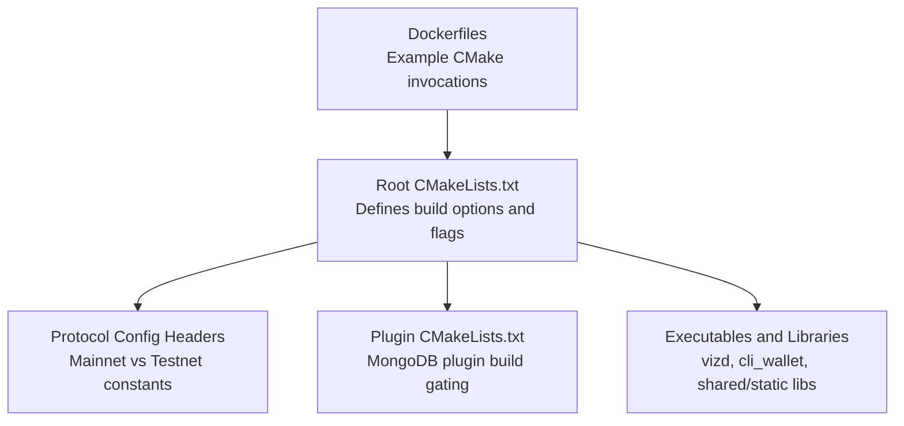
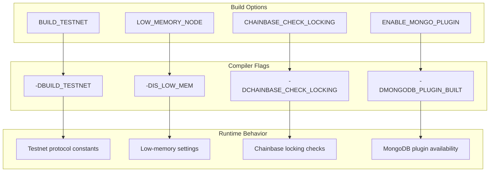
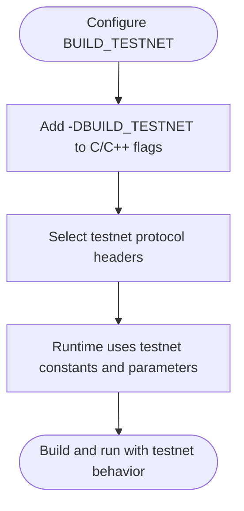
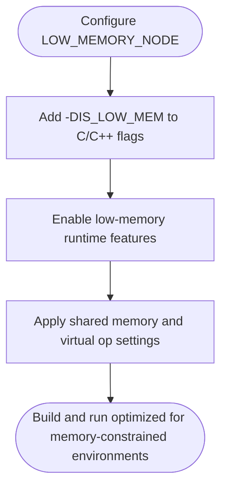
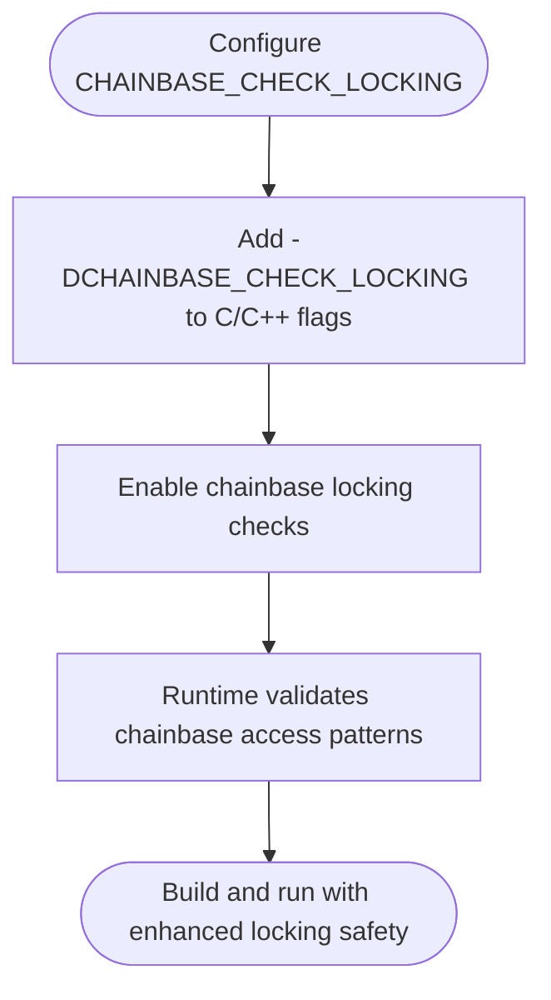
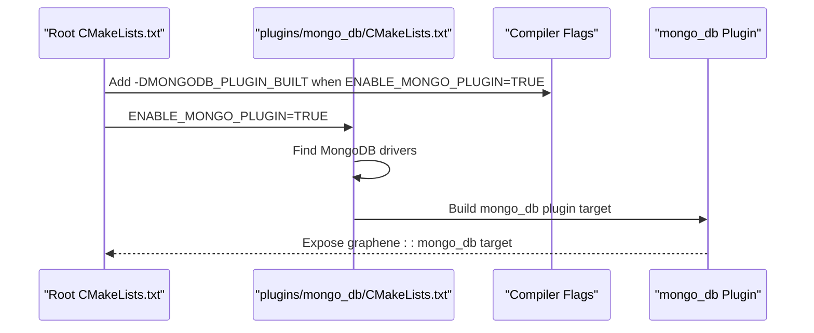
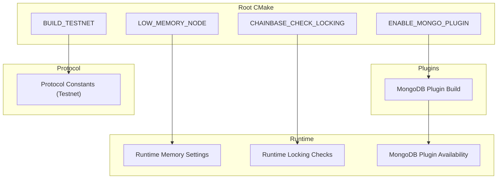

# Core Build Options

<cite>
**Referenced Files in This Document**
- [CMakeLists.txt](file://CMakeLists.txt)
- [config.hpp](file://libraries/protocol/include/graphene/protocol/config.hpp)
- [config_testnet.hpp](file://libraries/protocol/include/graphene/protocol/config_testnet.hpp)
- [config_testnet.ini](file://share/vizd/config/config_testnet.ini)
- [Dockerfile-testnet](file://share/vizd/docker/Dockerfile-testnet)
- [Dockerfile-lowmem](file://share/vizd/docker/Dockerfile-lowmem)
- [Dockerfile-mongo](file://share/vizd/docker/Dockerfile-mongo)
- [CMakeLists.txt (mongo_db)](file://plugins/mongo_db/CMakeLists.txt)
- [mongo_db_plugin.hpp](file://plugins/mongo_db/include/graphene/plugins/mongo_db/mongo_db_plugin.hpp)
</cite>

## Table of Contents
1. [Introduction](#introduction)
2. [Project Structure](#project-structure)
3. [Core Components](#core-components)
4. [Architecture Overview](#architecture-overview)
5. [Detailed Component Analysis](#detailed-component-analysis)
6. [Dependency Analysis](#dependency-analysis)
7. [Performance Considerations](#performance-considerations)
8. [Troubleshooting Guide](#troubleshooting-guide)
9. [Conclusion](#conclusion)
10. [Appendices](#appendices)

## Introduction
This document explains the core build options and flags that control VIZ CPP Node compilation and runtime behavior. It focuses on four primary options:
- BUILD_TESTNET: Enables test network compilation and configuration.
- LOW_MEMORY_NODE: Optimizes the node for reduced memory usage.
- CHAINBASE_CHECK_LOCKING: Enables chainbase locking correctness checks.
- ENABLE_MONGO_PLUGIN: Compiles the MongoDB integration plugin.

For each option, this guide describes how it affects compiler flags, feature availability, and runtime behavior, and provides practical CMake invocation examples for development, testing, and production scenarios. It also documents how these options influence the resulting executables, shared libraries, and plugin availability.

## Project Structure
The build system is orchestrated from the repository’s root CMake configuration. Key areas involved in build option handling and downstream effects include:
- Root CMake configuration that defines and applies the build options.
- Protocol configuration headers that switch constants and behavior for mainnet vs. testnet.
- Plugin build configuration for MongoDB integration.
- Dockerfiles demonstrating typical option combinations for different environments.

**Diagram sources**
- [CMakeLists.txt](file://CMakeLists.txt#L56-L89)
- [config.hpp](file://libraries/protocol/include/graphene/protocol/config.hpp#L1-L169)
- [config_testnet.hpp](file://libraries/protocol/include/graphene/protocol/config_testnet.hpp#L1-L170)
- [CMakeLists.txt (mongo_db)](file://plugins/mongo_db/CMakeLists.txt#L2-L81)
- [Dockerfile-testnet](file://share/vizd/docker/Dockerfile-testnet#L46-L53)
- [Dockerfile-lowmem](file://share/vizd/docker/Dockerfile-lowmem#L45-L51)
- [Dockerfile-mongo](file://share/vizd/docker/Dockerfile-mongo#L74-L81)

**Section sources**
- [CMakeLists.txt](file://CMakeLists.txt#L56-L89)
- [config.hpp](file://libraries/protocol/include/graphene/protocol/config.hpp#L1-L169)
- [config_testnet.hpp](file://libraries/protocol/include/graphene/protocol/config_testnet.hpp#L1-L170)
- [CMakeLists.txt (mongo_db)](file://plugins/mongo_db/CMakeLists.txt#L2-L81)
- [Dockerfile-testnet](file://share/vizd/docker/Dockerfile-testnet#L46-L53)
- [Dockerfile-lowmem](file://share/vizd/docker/Dockerfile-lowmem#L45-L51)
- [Dockerfile-mongo](file://share/vizd/docker/Dockerfile-mongo#L74-L81)

## Core Components
This section documents each build option, its effect on compiler flags, feature availability, and runtime behavior.

- BUILD_TESTNET
  - Purpose: Switches the build to use test network constants and configuration.
  - Compiler flags: Adds preprocessor definitions for test network identifiers and parameters.
  - Feature availability: Selects testnet-specific protocol constants and defaults.
  - Runtime behavior: Changes chain identity, address prefix, block intervals, and governance parameters to align with the test network.
  - Example CMake invocation (from Dockerfile):
    - cmake -DCMAKE_BUILD_TYPE=Release -DBUILD_SHARED_LIBRARIES=FALSE -DBUILD_TESTNET=TRUE -DLOW_MEMORY_NODE=FALSE -DCHAINBASE_CHECK_LOCKING=FALSE -DENABLE_MONGO_PLUGIN=FALSE ..

- LOW_MEMORY_NODE
  - Purpose: Optimizes the node for constrained memory environments.
  - Compiler flags: Adds a preprocessor definition enabling low-memory-aware code paths.
  - Feature availability: Enables memory-conscious settings such as shared memory sizing and virtual operation handling toggles.
  - Runtime behavior: Adjusts shared memory growth thresholds, optional skipping of virtual operations, and related operational modes to reduce memory footprint.
  - Example CMake invocation (from Dockerfile):
    - cmake -DCMAKE_BUILD_TYPE=Release -DBUILD_SHARED_LIBRARIES=FALSE -DLOW_MEMORY_NODE=TRUE -DCHAINBASE_CHECK_LOCKING=FALSE -DENABLE_MONGO_PLUGIN=FALSE ..

- CHAINBASE_CHECK_LOCKING
  - Purpose: Validates chainbase locking correctness during development and testing.
  - Compiler flags: Adds a preprocessor definition enabling locking assertions and checks.
  - Feature availability: Activates additional safety checks around shared memory and chainbase access patterns.
  - Runtime behavior: Introduces extra validation overhead to catch potential deadlocks or misuse of chainbase resources.
  - Example CMake invocation (from Dockerfiles):
    - -DCHAINBASE_CHECK_LOCKING=FALSE for production builds.
    - -DCHAINBASE_CHECK_LOCKING=TRUE for development/testing builds.

- ENABLE_MONGO_PLUGIN
  - Purpose: Builds the MongoDB integration plugin alongside the node.
  - Compiler flags: Adds a preprocessor definition indicating the plugin is built.
  - Feature availability: Links against MongoDB C++ driver libraries and exposes the mongo_db plugin to the node.
  - Runtime behavior: Requires MongoDB drivers to be available at runtime; enables storing blockchain data in MongoDB via the plugin.
  - Example CMake invocation (from Dockerfile):
    - -DENABLE_MONGO_PLUGIN=TRUE (with MongoDB drivers installed in the build environment).

Practical CMake invocation examples by environment:
- Development (testnet, minimal memory checks):
  - cmake -DCMAKE_BUILD_TYPE=Debug -DBUILD_TESTNET=TRUE -DCHAINBASE_CHECK_LOCKING=TRUE -DLOW_MEMORY_NODE=FALSE -DENABLE_MONGO_PLUGIN=FALSE ..
- Testing (testnet with MongoDB):
  - cmake -DCMAKE_BUILD_TYPE=Release -DBUILD_TESTNET=TRUE -DCHAINBASE_CHECK_LOCKING=FALSE -DLOW_MEMORY_NODE=FALSE -DENABLE_MONGO_PLUGIN=TRUE ..
- Production (mainnet, optimized):
  - cmake -DCMAKE_BUILD_TYPE=Release -DBUILD_TESTNET=FALSE -DCHAINBASE_CHECK_LOCKING=FALSE -DLOW_MEMORY_NODE=FALSE -DENABLE_MONGO_PLUGIN=FALSE ..

**Section sources**
- [CMakeLists.txt](file://CMakeLists.txt#L56-L89)
- [config_testnet.hpp](file://libraries/protocol/include/graphene/protocol/config_testnet.hpp#L1-L170)
- [config.hpp](file://libraries/protocol/include/graphene/protocol/config.hpp#L1-L169)
- [Dockerfile-testnet](file://share/vizd/docker/Dockerfile-testnet#L46-L53)
- [Dockerfile-lowmem](file://share/vizd/docker/Dockerfile-lowmem#L45-L51)
- [Dockerfile-mongo](file://share/vizd/docker/Dockerfile-mongo#L74-L81)
- [CMakeLists.txt (mongo_db)](file://plugins/mongo_db/CMakeLists.txt#L2-L81)

## Architecture Overview
The build options are evaluated early in the root CMake configuration and propagate into downstream components:
- Compiler flags are appended conditionally based on the selected options.
- Protocol headers switch between mainnet and testnet constants.
- Plugin builds are gated by the MongoDB plugin option.
- Executables and libraries inherit the configured flags and feature sets.

**Diagram sources**
- [CMakeLists.txt](file://CMakeLists.txt#L56-L89)
- [config_testnet.hpp](file://libraries/protocol/include/graphene/protocol/config_testnet.hpp#L1-L170)
- [CMakeLists.txt (mongo_db)](file://plugins/mongo_db/CMakeLists.txt#L2-L81)

**Section sources**
- [CMakeLists.txt](file://CMakeLists.txt#L56-L89)
- [config_testnet.hpp](file://libraries/protocol/include/graphene/protocol/config_testnet.hpp#L1-L170)
- [CMakeLists.txt (mongo_db)](file://plugins/mongo_db/CMakeLists.txt#L2-L81)

## Detailed Component Analysis

### BUILD_TESTNET Option
- Effect on compiler flags: Adds preprocessor definitions for test network identifiers and parameters.
- Effect on feature availability: Selects testnet-specific protocol constants and defaults.
- Effect on runtime behavior: Changes chain identity, address prefix, block intervals, and governance parameters to align with the test network.
- Relationship to executables and libraries: No change to binary names; behavior is driven by selected protocol constants.

**Diagram sources**
- [CMakeLists.txt](file://CMakeLists.txt#L58-L64)
- [config_testnet.hpp](file://libraries/protocol/include/graphene/protocol/config_testnet.hpp#L1-L170)

**Section sources**
- [CMakeLists.txt](file://CMakeLists.txt#L58-L64)
- [config_testnet.hpp](file://libraries/protocol/include/graphene/protocol/config_testnet.hpp#L1-L170)

### LOW_MEMORY_NODE Option
- Effect on compiler flags: Adds a preprocessor definition enabling low-memory-aware code paths.
- Effect on feature availability: Enables memory-conscious settings such as shared memory sizing and virtual operation handling toggles.
- Effect on runtime behavior: Adjusts shared memory growth thresholds, optional skipping of virtual operations, and related operational modes to reduce memory footprint.
- Relationship to executables and libraries: No change to binary names; behavior is driven by runtime configuration and compiled-in flags.

**Diagram sources**
- [CMakeLists.txt](file://CMakeLists.txt#L68-L74)

**Section sources**
- [CMakeLists.txt](file://CMakeLists.txt#L68-L74)

### CHAINBASE_CHECK_LOCKING Option
- Effect on compiler flags: Adds a preprocessor definition enabling locking assertions and checks.
- Effect on feature availability: Activates additional safety checks around shared memory and chainbase access patterns.
- Effect on runtime behavior: Introduces extra validation overhead to catch potential deadlocks or misuse of chainbase resources.
- Relationship to executables and libraries: No change to binary names; behavior is driven by compiled-in checks.

**Diagram sources**
- [CMakeLists.txt](file://CMakeLists.txt#L78-L81)

**Section sources**
- [CMakeLists.txt](file://CMakeLists.txt#L78-L81)

### ENABLE_MONGO_PLUGIN Option
- Effect on compiler flags: Adds a preprocessor definition indicating the plugin is built.
- Effect on feature availability: Links against MongoDB C++ driver libraries and exposes the mongo_db plugin to the node.
- Effect on runtime behavior: Requires MongoDB drivers to be available at runtime; enables storing blockchain data in MongoDB via the plugin.
- Relationship to executables and libraries: The mongo_db plugin is built as part of the plugins tree when enabled; the node can load it at runtime.

**Diagram sources**
- [CMakeLists.txt](file://CMakeLists.txt#L84-L89)
- [CMakeLists.txt (mongo_db)](file://plugins/mongo_db/CMakeLists.txt#L2-L81)

**Section sources**
- [CMakeLists.txt](file://CMakeLists.txt#L84-L89)
- [CMakeLists.txt (mongo_db)](file://plugins/mongo_db/CMakeLists.txt#L2-L81)
- [mongo_db_plugin.hpp](file://plugins/mongo_db/include/graphene/plugins/mongo_db/mongo_db_plugin.hpp#L1-L51)

## Dependency Analysis
Build options influence downstream components through compiler flags and conditional inclusion. The following diagram shows how options propagate to protocol constants, plugin builds, and runtime behavior.

**Diagram sources**
- [CMakeLists.txt](file://CMakeLists.txt#L56-L89)
- [config_testnet.hpp](file://libraries/protocol/include/graphene/protocol/config_testnet.hpp#L1-L170)
- [CMakeLists.txt (mongo_db)](file://plugins/mongo_db/CMakeLists.txt#L2-L81)

**Section sources**
- [CMakeLists.txt](file://CMakeLists.txt#L56-L89)
- [config_testnet.hpp](file://libraries/protocol/include/graphene/protocol/config_testnet.hpp#L1-L170)
- [CMakeLists.txt (mongo_db)](file://plugins/mongo_db/CMakeLists.txt#L2-L81)

## Performance Considerations
- CHAINBASE_CHECK_LOCKING adds runtime overhead due to additional checks; disable for production builds.
- LOW_MEMORY_NODE can reduce memory usage at the cost of potentially disabling certain features (e.g., skipping virtual operations) depending on configuration.
- BUILD_TESTNET does not alter performance characteristics directly but changes protocol parameters that indirectly affect throughput and resource usage.
- ENABLE_MONGO_PLUGIN introduces external dependencies and runtime overhead; ensure MongoDB drivers are properly installed and configured.

[No sources needed since this section provides general guidance]

## Troubleshooting Guide
- MongoDB plugin fails to build:
  - Ensure MongoDB C++ driver libraries are installed and discoverable by CMake before invoking the build.
  - Verify that ENABLE_MONGO_PLUGIN is set to TRUE and that the plugin’s CMakeLists is executed.
- Unexpected testnet/mainnet behavior:
  - Confirm BUILD_TESTNET is set appropriately; testnet constants are selected when enabled.
- Low memory issues:
  - Review LOW_MEMORY_NODE-related runtime settings and consider enabling virtual operation skipping and adjusting shared memory parameters.
- Chainbase locking failures:
  - Enable CHAINBASE_CHECK_LOCKING during development to catch incorrect locking patterns; disable for production.

**Section sources**
- [CMakeLists.txt (mongo_db)](file://plugins/mongo_db/CMakeLists.txt#L15-L81)
- [CMakeLists.txt](file://CMakeLists.txt#L58-L81)
- [config_testnet.hpp](file://libraries/protocol/include/graphene/protocol/config_testnet.hpp#L1-L170)

## Conclusion
The four core build options—BUILD_TESTNET, LOW_MEMORY_NODE, CHAINBASE_CHECK_LOCKING, and ENABLE_MONGO_PLUGIN—provide precise control over VIZ CPP Node compilation and runtime behavior. By understanding how each option affects compiler flags, feature availability, and runtime characteristics, teams can tailor builds for development, testing, and production environments effectively.

[No sources needed since this section summarizes without analyzing specific files]

## Appendices

### Practical CMake Invocation Examples
- Development (testnet, with locking checks):
  - cmake -DCMAKE_BUILD_TYPE=Debug -DBUILD_TESTNET=TRUE -DCHAINBASE_CHECK_LOCKING=TRUE -DLOW_MEMORY_NODE=FALSE -DENABLE_MONGO_PLUGIN=FALSE ..
- Testing (testnet with MongoDB):
  - cmake -DCMAKE_BUILD_TYPE=Release -DBUILD_TESTNET=TRUE -DCHAINBASE_CHECK_LOCKING=FALSE -DLOW_MEMORY_NODE=FALSE -DENABLE_MONGO_PLUGIN=TRUE ..
- Production (mainnet, optimized):
  - cmake -DCMAKE_BUILD_TYPE=Release -DBUILD_TESTNET=FALSE -DCHAINBASE_CHECK_LOCKING=FALSE -DLOW_MEMORY_NODE=FALSE -DENABLE_MONGO_PLUGIN=FALSE ..

**Section sources**
- [Dockerfile-testnet](file://share/vizd/docker/Dockerfile-testnet#L46-L53)
- [Dockerfile-lowmem](file://share/vizd/docker/Dockerfile-lowmem#L45-L51)
- [Dockerfile-mongo](file://share/vizd/docker/Dockerfile-mongo#L74-L81)