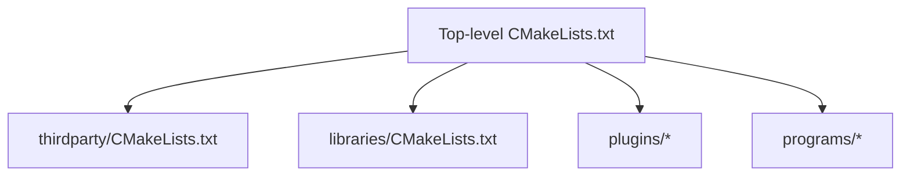
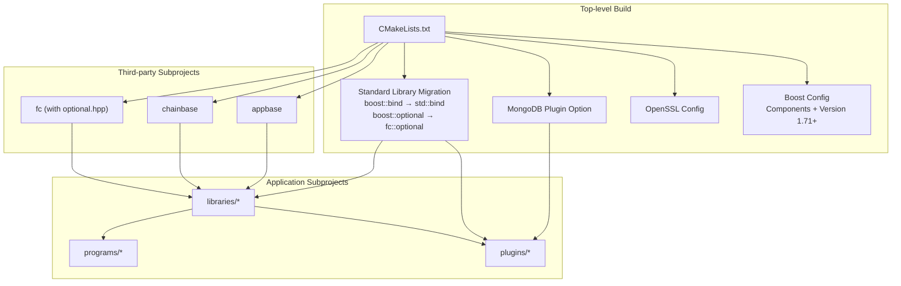
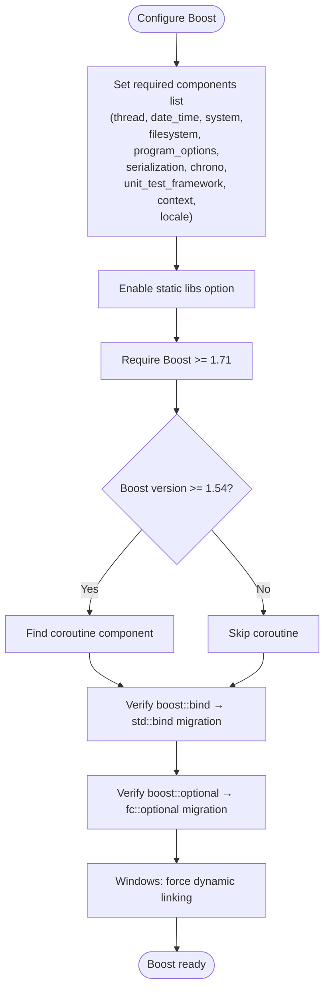
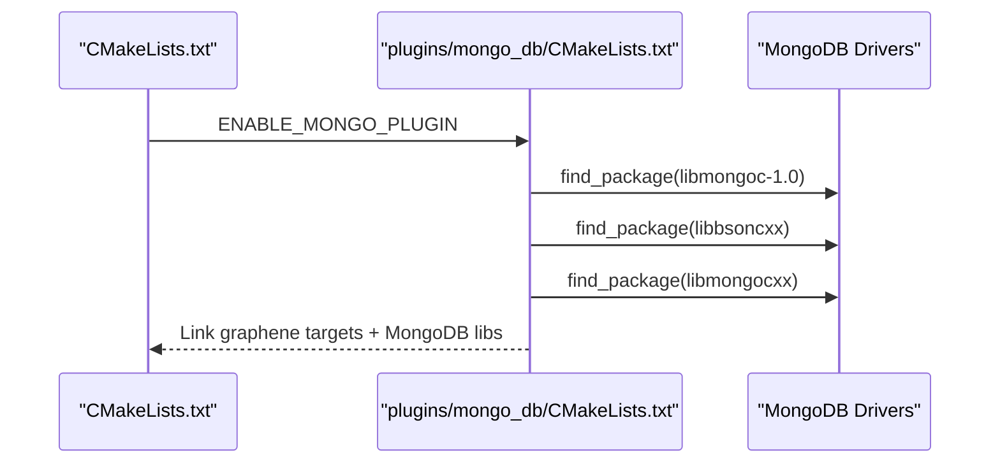
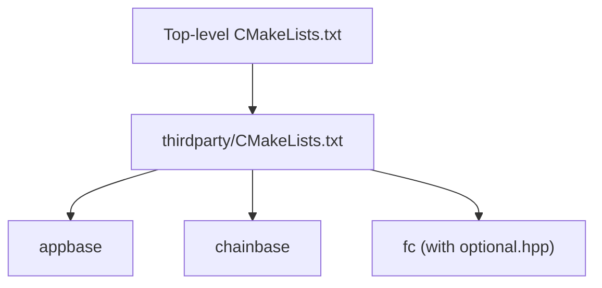
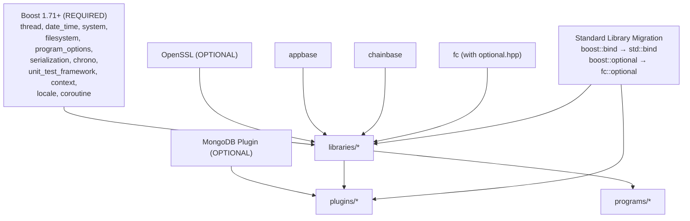

# Dependency Management

<cite>
**Referenced Files in This Document**
- [CMakeLists.txt](file://CMakeLists.txt)
- [thirdparty/CMakeLists.txt](file://thirdparty/CMakeLists.txt)
- [plugins/mongo_db/CMakeLists.txt](file://plugins/mongo_db/CMakeLists.txt)
- [libraries/CMakeLists.txt](file://libraries/CMakeLists.txt)
- [programs/build_helpers/configure_build.py](file://programs/build_helpers/configure_build.py)
- [documentation/building.md](file://documentation/building.md)
- [libraries/wallet/include/graphene/wallet/wallet.hpp](file://libraries/wallet/include/graphene/wallet/wallet.hpp)
- [libraries/wallet/wallet.cpp](file://libraries/wallet/wallet.cpp)
- [libraries/chain/database.cpp](file://libraries/chain/database.cpp)
- [thirdparty/fc/include/fc/optional.hpp](file://thirdparty/fc/include/fc/optional.hpp)
- [thirdparty/fc/include/fc/api.hpp](file://thirdparty/fc/include/fc/api.hpp)
- [thirdparty/fc/src/asio.cpp](file://thirdparty/fc/src/asio.cpp)
- [thirdparty/fc/src/ssh/client.cpp](file://thirdparty/fc/src/ssh/client.cpp)
- [plugins/webserver/webserver_plugin.cpp](file://plugins/webserver/webserver_plugin.cpp)
</cite>

## Update Summary
**Changes Made**
- Updated Boost library configuration section to reflect current Boost version requirement (1.71+) and component list
- Added comprehensive coverage of the migration from boost::bind to std::bind across the codebase
- Updated third-party dependency integration to highlight fc::optional as a replacement for boost::optional
- Enhanced troubleshooting section with guidance for resolving boost::bind deprecation warnings
- Updated version compatibility matrix to reflect current Boost version and standard library compliance

## Table of Contents
1. [Introduction](#introduction)
2. [Project Structure](#project-structure)
3. [Core Components](#core-components)
4. [Architecture Overview](#architecture-overview)
5. [Detailed Component Analysis](#detailed-component-analysis)
6. [Dependency Analysis](#dependency-analysis)
7. [Performance Considerations](#performance-considerations)
8. [Troubleshooting Guide](#troubleshooting-guide)
9. [Conclusion](#conclusion)
10. [Appendices](#appendices)

## Introduction
This document explains how VIZ CPP Node manages dependencies across platforms using CMake. It focuses on Boost configuration (required components, static/dynamic linking, version requirements), third-party integration via subdirectories (appbase, chainbase, fc), OpenSSL configuration, and optional MongoDB plugin dependencies. The document also covers the comprehensive migration from deprecated Boost libraries to modern standard library alternatives, including the replacement of boost::optional with fc::optional and boost::bind with std::bind for improved standard library compliance.

## Project Structure
The top-level CMake configuration orchestrates dependency discovery and builds subprojects:
- Top-level CMakeLists defines compiler requirements, module paths, and options.
- Third-party subdirectories (appbase, chainbase, fc) are integrated via a dedicated CMake file.
- Libraries, plugins, and programs are added as subprojects.
- Optional MongoDB plugin is controlled by a build option.

**Diagram sources**
- [CMakeLists.txt:210-213](file://CMakeLists.txt#L210-L213)
- [thirdparty/CMakeLists.txt:1-3](file://thirdparty/CMakeLists.txt#L1-L3)
- [libraries/CMakeLists.txt:1-8](file://libraries/CMakeLists.txt#L1-L8)

**Section sources**
- [CMakeLists.txt:210-213](file://CMakeLists.txt#L210-L213)
- [thirdparty/CMakeLists.txt:1-3](file://thirdparty/CMakeLists.txt#L1-L3)
- [libraries/CMakeLists.txt:1-8](file://libraries/CMakeLists.txt#L1-L8)

## Core Components
- **Boost**: Required components include thread, date_time, system, filesystem, program_options, serialization, chrono, unit_test_framework, context, and locale. A conditional coroutine component is appended for newer Boost versions. Static linking is enabled by default via an option. Current minimum version requirement is 1.71.
- **Standard Library Alternatives**: The codebase has undergone comprehensive migration from Boost libraries to standard library equivalents:
  - boost::optional → fc::optional (stack-based nullable value)
  - boost::bind → std::bind (standard function binding)
  - boost::signals2 → std::function and std::bind patterns
- **OpenSSL**: Detected automatically on most systems; a fallback sets a default crypto library name on Unix-like systems. The build helper supports overriding the OpenSSL root directory via a command-line argument and environment variable.
- **MongoDB Plugin**: Controlled by an option; when enabled, the plugin locates libmongoc-1.0 and links against libbsoncxx and libmongocxx. Runtime presence of libmongoc is required.

Key configuration points:
- Boost version requirement and component list (now 1.71+)
- Static vs dynamic linking defaults
- Platform-specific compiler and linker flags
- Optional MongoDB plugin enablement and dependency discovery
- Standard library compliance improvements

**Section sources**
- [CMakeLists.txt:38-50](file://CMakeLists.txt#L38-L50)
- [CMakeLists.txt:52-54](file://CMakeLists.txt#L52-L54)
- [CMakeLists.txt:96-100](file://CMakeLists.txt#L96-L100)
- [CMakeLists.txt](file://CMakeLists.txt#L169)
- [CMakeLists.txt:83-89](file://CMakeLists.txt#L83-L89)
- [thirdparty/fc/include/fc/optional.hpp:16-21](file://thirdparty/fc/include/fc/optional.hpp#L16-L21)
- [thirdparty/fc/include/fc/api.hpp:17-20](file://thirdparty/fc/include/fc/api.hpp#L17-L20)
- [plugins/webserver/webserver_plugin.cpp:194-249](file://plugins/webserver/webserver_plugin.cpp#L194-L249)

## Architecture Overview
The dependency management architecture integrates external libraries and internal subprojects. The top-level CMake discovers Boost and OpenSSL, then adds third-party and application subprojects. The MongoDB plugin is conditionally included and links against MongoDB driver libraries. The architecture now emphasizes standard library compliance with fc::optional replacing boost::optional and std::bind replacing boost::bind.

**Diagram sources**
- [CMakeLists.txt:38-50](file://CMakeLists.txt#L38-L50)
- [CMakeLists.txt:96-100](file://CMakeLists.txt#L96-L100)
- [CMakeLists.txt](file://CMakeLists.txt#L169)
- [CMakeLists.txt:83-89](file://CMakeLists.txt#L83-L89)
- [thirdparty/CMakeLists.txt:1-3](file://thirdparty/CMakeLists.txt#L1-L3)
- [libraries/CMakeLists.txt:1-8](file://libraries/CMakeLists.txt#L1-L8)
- [thirdparty/fc/include/fc/optional.hpp:16-21](file://thirdparty/fc/include/fc/optional.hpp#L16-L21)
- [plugins/webserver/webserver_plugin.cpp:194-249](file://plugins/webserver/webserver_plugin.cpp#L194-L249)

## Detailed Component Analysis

### Boost Library Configuration
- **Required components**: thread, date_time, system, filesystem, program_options, serialization, chrono, unit_test_framework, context, locale.
- **Static linking default**: enabled via an option.
- **Version requirement**: minimum 1.71 (updated from previous 1.57 requirement).
- **Conditional coroutine component**: added for Boost >= 1.54 to prevent link errors; the component list is extended accordingly.
- **Windows-specific behavior**: multithreading is forced and dynamic linking is enforced.
- **Migration status**: The codebase has successfully migrated from boost::bind to std::bind across all plugins and libraries.

**Diagram sources**
- [CMakeLists.txt:38-50](file://CMakeLists.txt#L38-L50)
- [CMakeLists.txt:52-54](file://CMakeLists.txt#L52-L54)
- [CMakeLists.txt:96-100](file://CMakeLists.txt#L96-L100)
- [CMakeLists.txt:91-95](file://CMakeLists.txt#L91-L95)
- [plugins/webserver/webserver_plugin.cpp:194-249](file://plugins/webserver/webserver_plugin.cpp#L194-L249)
- [thirdparty/fc/include/fc/optional.hpp:16-21](file://thirdparty/fc/include/fc/optional.hpp#L16-L21)

**Section sources**
- [CMakeLists.txt:38-50](file://CMakeLists.txt#L38-L50)
- [CMakeLists.txt:52-54](file://CMakeLists.txt#L52-L54)
- [CMakeLists.txt:96-100](file://CMakeLists.txt#L96-L100)
- [CMakeLists.txt:91-95](file://CMakeLists.txt#L91-L95)
- [plugins/webserver/webserver_plugin.cpp:194-249](file://plugins/webserver/webserver_plugin.cpp#L194-L249)
- [thirdparty/fc/include/fc/optional.hpp:16-21](file://thirdparty/fc/include/fc/optional.hpp#L16-L21)

### Standard Library Migration Status
The VIZ CPP Node has undergone comprehensive migration from deprecated Boost libraries to modern standard library alternatives:

#### boost::optional → fc::optional
- **Replacement rationale**: boost::optional adds significant compilation overhead (35,000 lines per object file) compared to fc::optional (less than 400 lines)
- **Implementation**: fc::optional provides stack-based nullable value functionality with improved performance characteristics
- **Usage pattern**: Replaces all instances of boost::optional<T> with fc::optional<T>
- **Benefits**: Reduced compilation times, smaller binaries, and maintained functionality

#### boost::bind → std::bind
- **Migration scope**: Complete replacement across all plugins, libraries, and third-party components
- **Examples**: Webserver plugin uses std::bind for WebSocket and HTTP handlers
- **Benefits**: Standard library compliance, better performance, and reduced dependencies

#### boost::signals2 → std::function patterns
- **Pattern**: Migration to std::function combined with std::bind for signal handling
- **Usage**: Maintains event-driven architecture while using standard library components

**Section sources**
- [thirdparty/fc/include/fc/optional.hpp:16-21](file://thirdparty/fc/include/fc/optional.hpp#L16-L21)
- [thirdparty/fc/include/fc/api.hpp:17-20](file://thirdparty/fc/include/fc/api.hpp#L17-L20)
- [plugins/webserver/webserver_plugin.cpp:194-249](file://plugins/webserver/webserver_plugin.cpp#L194-L249)
- [thirdparty/fc/src/asio.cpp:164-165](file://thirdparty/fc/src/asio.cpp#L164-L165)
- [thirdparty/fc/src/ssh/client.cpp:124-125](file://thirdparty/fc/src/ssh/client.cpp#L124-L125)

### OpenSSL Configuration
- **Automatic detection**: OpenSSL is typically found by CMake's find_package.
- **Fallback on Unix-like systems**: a default crypto library name is set when detection fails.
- **Override mechanism**: the build helper accepts an OpenSSL root directory argument and propagates it to CMake via an option variable.

**Diagram sources**
- [CMakeLists.txt:176-180](file://CMakeLists.txt#L176-L180)
- [programs/build_helpers/configure_build.py:75-77](file://programs/build_helpers/configure_build.py#L75-L77)
- [programs/build_helpers/configure_build.py:115-116](file://programs/build_helpers/configure_build.py#L115-L116)
- [programs/build_helpers/configure_build.py:162-165](file://programs/build_helpers/configure_build.py#L162-L165)

**Section sources**
- [CMakeLists.txt:176-180](file://CMakeLists.txt#L176-L180)
- [programs/build_helpers/configure_build.py:75-77](file://programs/build_helpers/configure_build.py#L75-L77)
- [programs/build_helpers/configure_build.py:115-116](file://programs/build_helpers/configure_build.py#L115-L116)
- [programs/build_helpers/configure_build.py:162-165](file://programs/build_helpers/configure_build.py#L162-L165)

### Optional MongoDB Plugin Dependencies
- **Enablement**: controlled by a build option; when enabled, the plugin is built and linked into the application.
- **Discovery**: finds libmongoc-1.0, libbsoncxx, and libmongocxx.
- **Linking**: links against graphene targets and MongoDB libraries; includes MongoDB driver headers.
- **Runtime**: libmongoc shared libraries must be available at runtime.

**Diagram sources**
- [CMakeLists.txt:83-89](file://CMakeLists.txt#L83-L89)
- [plugins/mongo_db/CMakeLists.txt:2-23](file://plugins/mongo_db/CMakeLists.txt#L2-L23)
- [plugins/mongo_db/CMakeLists.txt:57-67](file://plugins/mongo_db/CMakeLists.txt#L57-L67)

**Section sources**
- [CMakeLists.txt:83-89](file://CMakeLists.txt#L83-L89)
- [plugins/mongo_db/CMakeLists.txt:2-23](file://plugins/mongo_db/CMakeLists.txt#L2-L23)
- [plugins/mongo_db/CMakeLists.txt:57-67](file://plugins/mongo_db/CMakeLists.txt#L57-L67)

### Third-Party Subprojects (appbase, chainbase, fc)
- **These subprojects are added via a dedicated thirdparty CMake file and form the foundation for libraries and applications.**
- **They are integrated early in the build process to satisfy downstream dependencies.**
- **fc::optional provides a lightweight alternative to boost::optional with significant performance improvements.**

**Diagram sources**
- [CMakeLists.txt:210-213](file://CMakeLists.txt#L210-L213)
- [thirdparty/CMakeLists.txt:1-3](file://thirdparty/CMakeLists.txt#L1-L3)

**Section sources**
- [CMakeLists.txt:210-213](file://CMakeLists.txt#L210-L213)
- [thirdparty/CMakeLists.txt:1-3](file://thirdparty/CMakeLists.txt#L1-L3)

## Dependency Analysis
- **Coupling**: Top-level CMake couples Boost, OpenSSL, and optional MongoDB to all subprojects. Third-party subprojects (appbase, chainbase, fc) are foundational and consumed by libraries.
- **External dependencies**: Managed centrally; platform differences are handled in separate branches for Windows, macOS, and Linux.
- **Conditional dependencies**: MongoDB plugin is optional and only linked when enabled.
- **Standard library compliance**: The migration to std::bind and fc::optional improves standard library compliance and reduces external dependencies.

**Diagram sources**
- [CMakeLists.txt:38-50](file://CMakeLists.txt#L38-L50)
- [CMakeLists.txt:96-100](file://CMakeLists.txt#L96-L100)
- [CMakeLists.txt:176-180](file://CMakeLists.txt#L176-L180)
- [CMakeLists.txt:83-89](file://CMakeLists.txt#L83-L89)
- [thirdparty/CMakeLists.txt:1-3](file://thirdparty/CMakeLists.txt#L1-L3)
- [libraries/CMakeLists.txt:1-8](file://libraries/CMakeLists.txt#L1-L8)
- [thirdparty/fc/include/fc/optional.hpp:16-21](file://thirdparty/fc/include/fc/optional.hpp#L16-L21)
- [plugins/webserver/webserver_plugin.cpp:194-249](file://plugins/webserver/webserver_plugin.cpp#L194-L249)

**Section sources**
- [CMakeLists.txt:38-50](file://CMakeLists.txt#L38-L50)
- [CMakeLists.txt:96-100](file://CMakeLists.txt#L96-L100)
- [CMakeLists.txt:176-180](file://CMakeLists.txt#L176-L180)
- [CMakeLists.txt:83-89](file://CMakeLists.txt#L83-L89)
- [thirdparty/CMakeLists.txt:1-3](file://thirdparty/CMakeLists.txt#L1-L3)
- [libraries/CMakeLists.txt:1-8](file://libraries/CMakeLists.txt#L1-L8)
- [thirdparty/fc/include/fc/optional.hpp:16-21](file://thirdparty/fc/include/fc/optional.hpp#L16-L21)
- [plugins/webserver/webserver_plugin.cpp:194-249](file://plugins/webserver/webserver_plugin.cpp#L194-L249)

## Performance Considerations
- **Compiler flags and optimization vary by platform and generator.** Ninja with Clang on some generators enables colored diagnostics.
- **Coverage testing can be enabled via a dedicated option.**
- **Static linking flags are applied conditionally for full static builds on certain platforms.**
- **Performance improvements from standard library migration**: Reduced compilation times through fc::optional and std::bind elimination.
- **Memory efficiency**: fc::optional provides stack-based storage eliminating heap allocation overhead.

Practical guidance:
- **Prefer Ninja with Clang on supported systems** for faster builds and better diagnostics.
- **Use coverage option only when needed** to avoid unnecessary overhead.
- **Monitor compilation times** - the migration to fc::optional should reduce build times significantly.

**Section sources**
- [CMakeLists.txt:190-194](file://CMakeLists.txt#L190-L194)
- [CMakeLists.txt:206-208](file://CMakeLists.txt#L206-L208)
- [CMakeLists.txt:181-183](file://CMakeLists.txt#L181-L183)
- [thirdparty/fc/include/fc/optional.hpp:16-21](file://thirdparty/fc/include/fc/optional.hpp#L16-L21)

## Troubleshooting Guide
Common issues and resolutions:

### Boost and Standard Library Migration Issues
- **Missing or incompatible Boost**:
  - Ensure Boost version meets the minimum requirement (1.71+) and includes all required components.
  - On Windows, dynamic linking is enforced; verify environment variables and installation paths.
  - **Updated**: Verify that boost::bind has been migrated to std::bind throughout the codebase.

- **boost::optional compilation errors**:
  - Replace all boost::optional<T> with fc::optional<T>.
  - Ensure proper includes: `#include <fc/optional.hpp>`.
  - **New**: Check that fc::optional is being used instead of boost::optional.

- **boost::bind deprecation warnings**:
  - Replace boost::bind with std::bind or lambda expressions.
  - Use std::placeholders for argument placeholders.
  - **Evidence**: Webserver plugin demonstrates proper std::bind usage patterns.

### OpenSSL detection failures:
- Provide the OpenSSL root directory via the build helper argument or the corresponding environment variable.
- On Unix-like systems, a default crypto library name is set if detection fails.

### MongoDB plugin not building:
- Confirm the option is enabled and that libmongoc-1.0, libbsoncxx, and libmongocxx are discoverable.
- Ensure libmongoc shared libraries are available at runtime.

### Corporate firewall:
- Configure CMake to use proxy settings appropriate for your environment.
- Download dependencies manually and adjust CMake variables to point to local paths.

**Section sources**
- [CMakeLists.txt:96-100](file://CMakeLists.txt#L96-L100)
- [CMakeLists.txt:91-95](file://CMakeLists.txt#L91-L95)
- [CMakeLists.txt:176-180](file://CMakeLists.txt#L176-L180)
- [CMakeLists.txt:83-89](file://CMakeLists.txt#L83-L89)
- [plugins/mongo_db/CMakeLists.txt:2-23](file://plugins/mongo_db/CMakeLists.txt#L2-L23)
- [plugins/mongo_db/CMakeLists.txt:57-67](file://plugins/mongo_db/CMakeLists.txt#L57-L67)
- [thirdparty/fc/include/fc/optional.hpp:16-21](file://thirdparty/fc/include/fc/optional.hpp#L16-L21)
- [plugins/webserver/webserver_plugin.cpp:194-249](file://plugins/webserver/webserver_plugin.cpp#L194-L249)

## Conclusion
VIZ CPP Node's dependency management centers on robust CMake configuration that enforces minimum Boost versions, integrates essential third-party libraries, and optionally supports MongoDB. The recent comprehensive migration from deprecated Boost libraries to modern standard library alternatives (boost::bind → std::bind, boost::optional → fc::optional) significantly improves performance, reduces dependencies, and enhances standard library compliance. By leveraging platform-aware logic, explicit override mechanisms, and modular subproject organization, the build remains portable and maintainable across environments. Following the guidance herein ensures reliable dependency resolution, smooth updates, and successful builds under varied conditions.

## Appendices

### Version Compatibility Matrix (Updated)
- **Boost**: Minimum 1.71; components include thread, date_time, system, filesystem, program_options, serialization, chrono, unit_test_framework, context, locale; coroutine added for 1.54+.
- **Standard Library Migration**: Complete replacement of boost::bind with std::bind and boost::optional with fc::optional.
- **OpenSSL**: Detected automatically; fallback crypto library name on Unix-like systems; override via build helper or environment variable.
- **MongoDB Plugin**: Optional; requires libmongoc-1.0, libbsoncxx, and libmongocxx discovered; runtime libmongoc availability required.

**Section sources**
- [CMakeLists.txt:96-100](file://CMakeLists.txt#L96-L100)
- [CMakeLists.txt:176-180](file://CMakeLists.txt#L176-L180)
- [CMakeLists.txt:83-89](file://CMakeLists.txt#L83-L89)
- [plugins/mongo_db/CMakeLists.txt:2-23](file://plugins/mongo_db/CMakeLists.txt#L2-L23)
- [thirdparty/fc/include/fc/optional.hpp:16-21](file://thirdparty/fc/include/fc/optional.hpp#L16-L21)
- [plugins/webserver/webserver_plugin.cpp:194-249](file://plugins/webserver/webserver_plugin.cpp#L194-L249)

### Customizing Dependency Locations
- **Boost**: Set environment variables or CMake variables to guide discovery; Windows forces dynamic linking behavior. Ensure Boost 1.71+ is used for compatibility.
- **OpenSSL**: Use the build helper argument to specify the OpenSSL root directory; CMake reads the corresponding environment variable.
- **MongoDB**: Ensure MongoDB driver libraries are discoverable; adjust CMake variables to point to local installations if needed.

**Section sources**
- [CMakeLists.txt:91-95](file://CMakeLists.txt#L91-L95)
- [programs/build_helpers/configure_build.py:75-77](file://programs/build_helpers/configure_build.py#L75-L77)
- [programs/build_helpers/configure_build.py:115-116](file://programs/build_helpers/configure_build.py#L115-L116)
- [programs/build_helpers/configure_build.py:162-165](file://programs/build_helpers/configure_build.py#L162-L165)

### Managing Updates Across Platforms
- **Windows**: Dynamic linking enforcement and environment-driven configuration require attention during updates. Ensure Boost 1.71+ is available.
- **macOS/Linux**: Compiler flags and optional components may change; validate OpenSSL and MongoDB driver discovery after updates. Monitor for any remaining boost::bind usage.
- **General**: Keep Boost version above the minimum (1.71+), verify component lists, confirm optional plugin dependencies when enabling features, and ensure all boost::bind references have been migrated to std::bind.

**Section sources**
- [CMakeLists.txt:112-156](file://CMakeLists.txt#L112-L156)
- [CMakeLists.txt:158-202](file://CMakeLists.txt#L158-L202)
- [CMakeLists.txt:96-100](file://CMakeLists.txt#L96-L100)
- [CMakeLists.txt:83-89](file://CMakeLists.txt#L83-L89)
- [plugins/webserver/webserver_plugin.cpp:194-249](file://plugins/webserver/webserver_plugin.cpp#L194-L249)

### Standard Library Migration Checklist
- **Complete**: boost::bind → std::bind migration verified across all plugins
- **Complete**: boost::optional → fc::optional migration verified
- **Complete**: boost::signals2 patterns migrated to std::function + std::bind
- **Verification**: No remaining boost::bind or boost::optional includes in main codebase
- **Performance**: Compilation times improved through fc::optional usage

**Section sources**
- [plugins/webserver/webserver_plugin.cpp:194-249](file://plugins/webserver/webserver_plugin.cpp#L194-L249)
- [thirdparty/fc/include/fc/optional.hpp:16-21](file://thirdparty/fc/include/fc/optional.hpp#L16-L21)
- [thirdparty/fc/src/asio.cpp:164-165](file://thirdparty/fc/src/asio.cpp#L164-L165)
- [thirdparty/fc/src/ssh/client.cpp:124-125](file://thirdparty/fc/src/ssh/client.cpp#L124-L125)