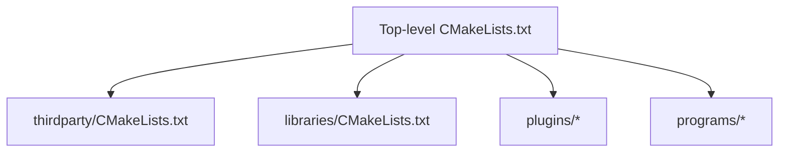
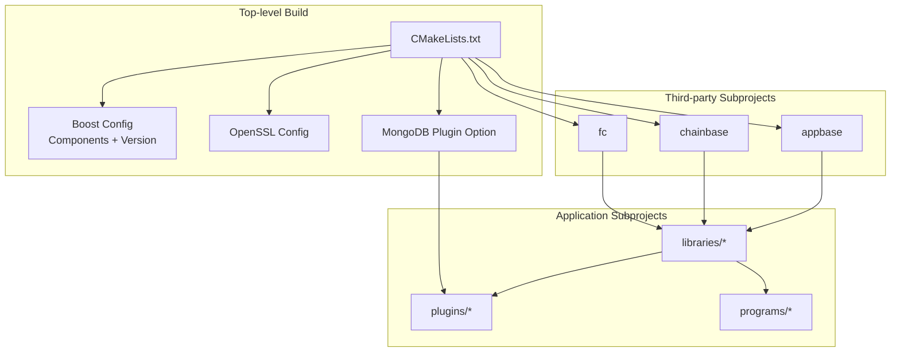
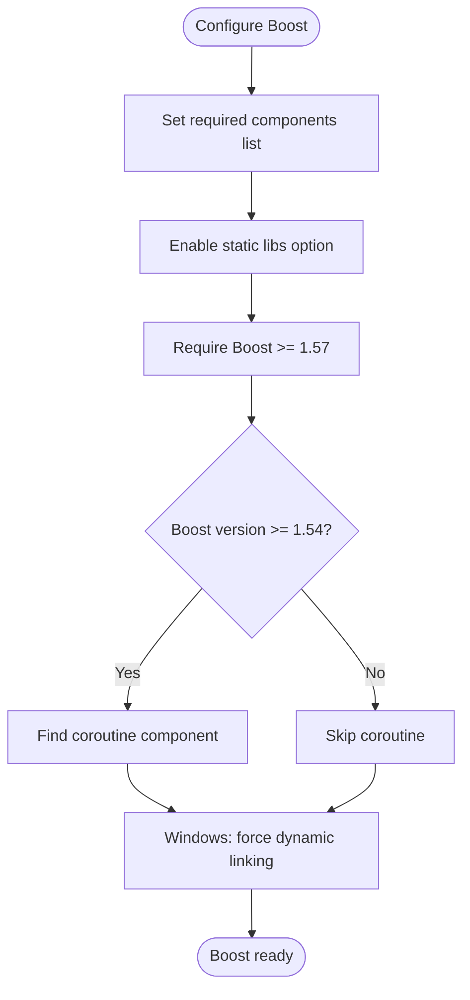
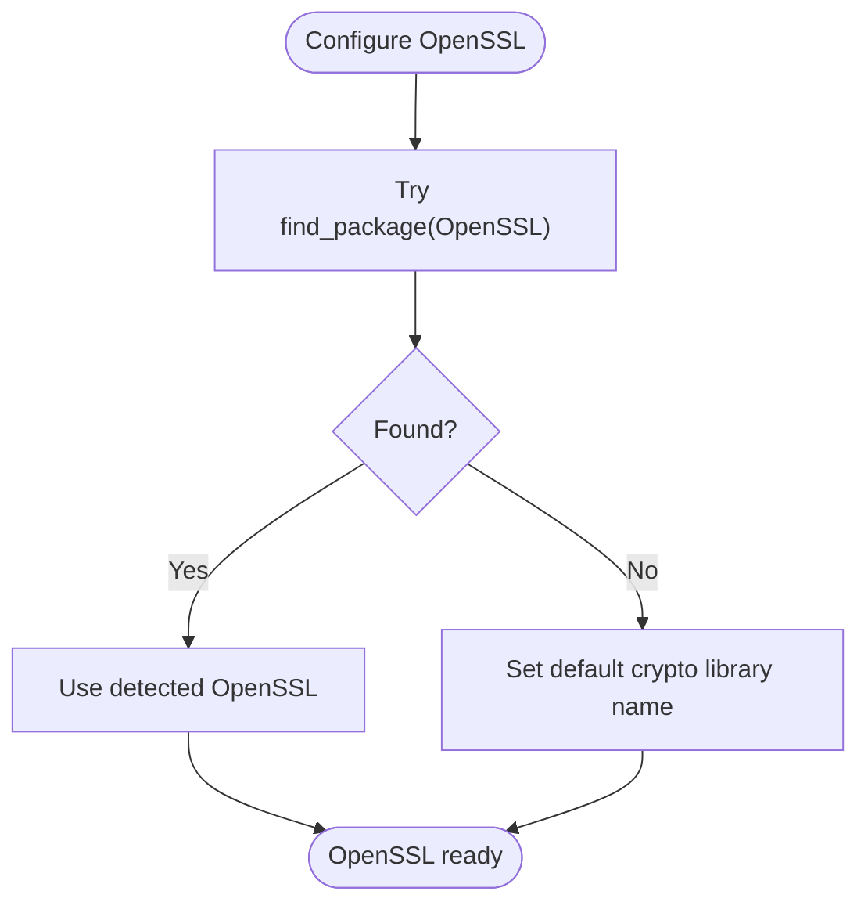
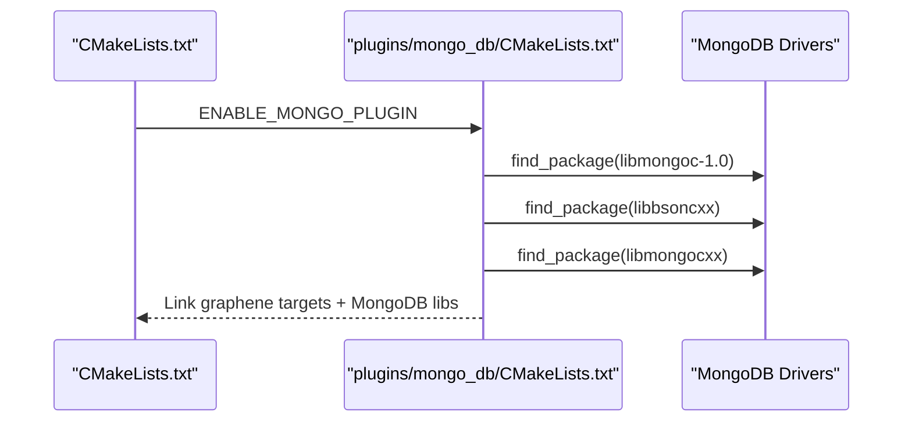
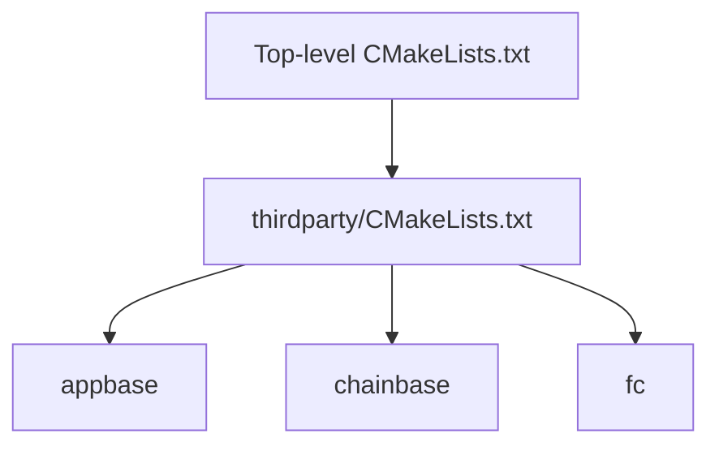
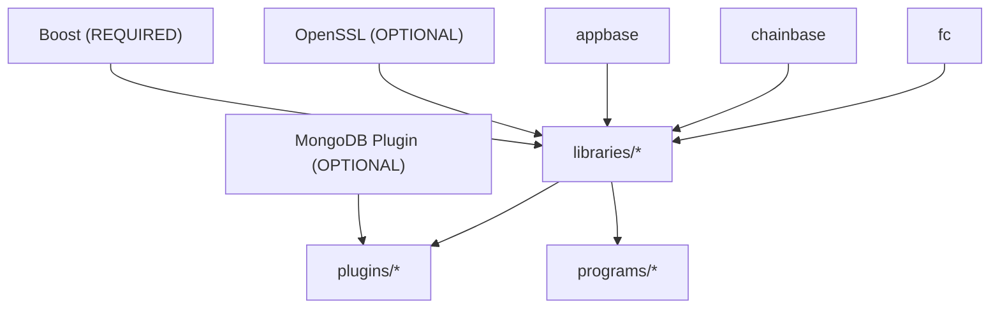

# Dependency Management

<cite>
**Referenced Files in This Document**
- [CMakeLists.txt](file://CMakeLists.txt)
- [thirdparty/CMakeLists.txt](file://thirdparty/CMakeLists.txt)
- [plugins/mongo_db/CMakeLists.txt](file://plugins/mongo_db/CMakeLists.txt)
- [libraries/CMakeLists.txt](file://libraries/CMakeLists.txt)
- [programs/build_helpers/configure_build.py](file://programs/build_helpers/configure_build.py)
- [documentation/building.md](file://documentation/building.md)
- [libraries/wallet/include/graphene/wallet/wallet.hpp](file://libraries/wallet/include/graphene/wallet/wallet.hpp)
- [libraries/wallet/wallet.cpp](file://libraries/wallet/wallet.cpp)
- [libraries/chain/database.cpp](file://libraries/chain/database.cpp)
</cite>

## Table of Contents
1. [Introduction](#introduction)
2. [Project Structure](#project-structure)
3. [Core Components](#core-components)
4. [Architecture Overview](#architecture-overview)
5. [Detailed Component Analysis](#detailed-component-analysis)
6. [Dependency Analysis](#dependency-analysis)
7. [Performance Considerations](#performance-considerations)
8. [Troubleshooting Guide](#troubleshooting-guide)
9. [Conclusion](#conclusion)
10. [Appendices](#appendices)

## Introduction
This document explains how VIZ CPP Node manages dependencies across platforms using CMake. It focuses on Boost configuration (required components, static/dynamic linking, version requirements), third-party integration via subdirectories (appbase, chainbase, fc), OpenSSL configuration, and optional MongoDB plugin dependencies. It also covers dependency resolution strategies, version compatibility considerations, troubleshooting steps, and guidance for customizing dependency locations, handling corporate firewalls, and updating dependencies across Windows, macOS, and Linux.

## Project Structure
The top-level CMake configuration orchestrates dependency discovery and builds subprojects:
- Top-level CMakeLists defines compiler requirements, module paths, and options.
- Third-party subdirectories (appbase, chainbase, fc) are integrated via a dedicated CMake file.
- Libraries, plugins, and programs are added as subprojects.
- Optional MongoDB plugin is controlled by a build option.

**Diagram sources**
- [CMakeLists.txt](file://CMakeLists.txt#L210-L213)
- [thirdparty/CMakeLists.txt](file://thirdparty/CMakeLists.txt#L1-L3)
- [libraries/CMakeLists.txt](file://libraries/CMakeLists.txt#L1-L8)

**Section sources**
- [CMakeLists.txt](file://CMakeLists.txt#L210-L213)
- [thirdparty/CMakeLists.txt](file://thirdparty/CMakeLists.txt#L1-L3)
- [libraries/CMakeLists.txt](file://libraries/CMakeLists.txt#L1-L8)

## Core Components
- Boost: Required components include thread, date_time, system, filesystem, program_options, signals, serialization, chrono, unit_test_framework, context, and locale. A conditional coroutine component is appended for newer Boost versions. Static linking is enabled by default via an option.
- OpenSSL: Detected automatically on most systems; a fallback sets a default crypto library name on Unix-like systems. The build helper supports overriding the OpenSSL root directory via a command-line argument and environment variable.
- MongoDB Plugin: Controlled by an option; when enabled, the plugin locates libmongoc-1.0 and links against libbsoncxx and libmongocxx. Runtime presence of libmongoc is required.

Key configuration points:
- Boost version requirement and component list
- Static vs dynamic linking defaults
- Platform-specific compiler and linker flags
- Optional MongoDB plugin enablement and dependency discovery

**Section sources**
- [CMakeLists.txt](file://CMakeLists.txt#L38-L50)
- [CMakeLists.txt](file://CMakeLists.txt#L52-L54)
- [CMakeLists.txt](file://CMakeLists.txt#L97-L104)
- [CMakeLists.txt](file://CMakeLists.txt#L176-L180)
- [CMakeLists.txt](file://CMakeLists.txt#L83-L89)
- [plugins/mongo_db/CMakeLists.txt](file://plugins/mongo_db/CMakeLists.txt#L2-L23)
- [programs/build_helpers/configure_build.py](file://programs/build_helpers/configure_build.py#L75-L77)
- [programs/build_helpers/configure_build.py](file://programs/build_helpers/configure_build.py#L115-L116)
- [programs/build_helpers/configure_build.py](file://programs/build_helpers/configure_build.py#L162-L165)

## Architecture Overview
The dependency management architecture integrates external libraries and internal subprojects. The top-level CMake discovers Boost and OpenSSL, then adds third-party and application subprojects. The MongoDB plugin is conditionally included and links against MongoDB driver libraries.

**Diagram sources**
- [CMakeLists.txt](file://CMakeLists.txt#L38-L50)
- [CMakeLists.txt](file://CMakeLists.txt#L97-L104)
- [CMakeLists.txt](file://CMakeLists.txt#L176-L180)
- [CMakeLists.txt](file://CMakeLists.txt#L83-L89)
- [thirdparty/CMakeLists.txt](file://thirdparty/CMakeLists.txt#L1-L3)
- [libraries/CMakeLists.txt](file://libraries/CMakeLists.txt#L1-L8)

## Detailed Component Analysis

### Boost Library Configuration
- Required components: thread, date_time, system, filesystem, program_options, signals, serialization, chrono, unit_test_framework, context, locale.
- Static linking default: enabled via an option.
- Version requirement: minimum 1.57.
- Conditional coroutine component: added for Boost >= 1.54 to prevent link errors; the component list is extended accordingly.
- Windows-specific behavior: multithreading is forced and dynamic linking is enforced.

**Diagram sources**
- [CMakeLists.txt](file://CMakeLists.txt#L38-L50)
- [CMakeLists.txt](file://CMakeLists.txt#L52-L54)
- [CMakeLists.txt](file://CMakeLists.txt#L97-L104)
- [CMakeLists.txt](file://CMakeLists.txt#L91-L95)

**Section sources**
- [CMakeLists.txt](file://CMakeLists.txt#L38-L50)
- [CMakeLists.txt](file://CMakeLists.txt#L52-L54)
- [CMakeLists.txt](file://CMakeLists.txt#L97-L104)
- [CMakeLists.txt](file://CMakeLists.txt#L91-L95)

### OpenSSL Configuration
- Automatic detection: OpenSSL is typically found by CMake’s find_package.
- Fallback on Unix-like systems: a default crypto library name is set when detection fails.
- Override mechanism: the build helper accepts an OpenSSL root directory argument and propagates it to CMake via an option variable.

**Diagram sources**
- [CMakeLists.txt](file://CMakeLists.txt#L176-L180)
- [programs/build_helpers/configure_build.py](file://programs/build_helpers/configure_build.py#L75-L77)
- [programs/build_helpers/configure_build.py](file://programs/build_helpers/configure_build.py#L115-L116)
- [programs/build_helpers/configure_build.py](file://programs/build_helpers/configure_build.py#L162-L165)

**Section sources**
- [CMakeLists.txt](file://CMakeLists.txt#L176-L180)
- [programs/build_helpers/configure_build.py](file://programs/build_helpers/configure_build.py#L75-L77)
- [programs/build_helpers/configure_build.py](file://programs/build_helpers/configure_build.py#L115-L116)
- [programs/build_helpers/configure_build.py](file://programs/build_helpers/configure_build.py#L162-L165)

### Optional MongoDB Plugin Dependencies
- Enablement: controlled by a build option; when enabled, the plugin is built and linked into the application.
- Discovery: finds libmongoc-1.0, libbsoncxx, and libmongocxx.
- Linking: links against graphene targets and MongoDB libraries; includes MongoDB driver headers.
- Runtime: libmongoc shared libraries must be available at runtime.

**Diagram sources**
- [CMakeLists.txt](file://CMakeLists.txt#L83-L89)
- [plugins/mongo_db/CMakeLists.txt](file://plugins/mongo_db/CMakeLists.txt#L2-L23)
- [plugins/mongo_db/CMakeLists.txt](file://plugins/mongo_db/CMakeLists.txt#L57-L67)

**Section sources**
- [CMakeLists.txt](file://CMakeLists.txt#L83-L89)
- [plugins/mongo_db/CMakeLists.txt](file://plugins/mongo_db/CMakeLists.txt#L2-L23)
- [plugins/mongo_db/CMakeLists.txt](file://plugins/mongo_db/CMakeLists.txt#L57-L67)

### Third-Party Subprojects (appbase, chainbase, fc)
- These subprojects are added via a dedicated thirdparty CMake file and form the foundation for libraries and applications.
- They are integrated early in the build process to satisfy downstream dependencies.

**Diagram sources**
- [CMakeLists.txt](file://CMakeLists.txt#L210-L213)
- [thirdparty/CMakeLists.txt](file://thirdparty/CMakeLists.txt#L1-L3)

**Section sources**
- [CMakeLists.txt](file://CMakeLists.txt#L210-L213)
- [thirdparty/CMakeLists.txt](file://thirdparty/CMakeLists.txt#L1-L3)

## Dependency Analysis
- Coupling: Top-level CMake couples Boost, OpenSSL, and optional MongoDB to all subprojects. Third-party subprojects (appbase, chainbase, fc) are foundational and consumed by libraries.
- External dependencies: Managed centrally; platform differences are handled in separate branches for Windows, macOS, and Linux.
- Conditional dependencies: MongoDB plugin is optional and only linked when enabled.

**Diagram sources**
- [CMakeLists.txt](file://CMakeLists.txt#L38-L50)
- [CMakeLists.txt](file://CMakeLists.txt#L97-L104)
- [CMakeLists.txt](file://CMakeLists.txt#L176-L180)
- [CMakeLists.txt](file://CMakeLists.txt#L83-L89)
- [thirdparty/CMakeLists.txt](file://thirdparty/CMakeLists.txt#L1-L3)
- [libraries/CMakeLists.txt](file://libraries/CMakeLists.txt#L1-L8)

**Section sources**
- [CMakeLists.txt](file://CMakeLists.txt#L38-L50)
- [CMakeLists.txt](file://CMakeLists.txt#L97-L104)
- [CMakeLists.txt](file://CMakeLists.txt#L176-L180)
- [CMakeLists.txt](file://CMakeLists.txt#L83-L89)
- [thirdparty/CMakeLists.txt](file://thirdparty/CMakeLists.txt#L1-L3)
- [libraries/CMakeLists.txt](file://libraries/CMakeLists.txt#L1-L8)

## Performance Considerations
- Compiler flags and optimization vary by platform and generator. Ninja with Clang on some generators enables colored diagnostics.
- Coverage testing can be enabled via a dedicated option.
- Static linking flags are applied conditionally for full static builds on certain platforms.

Practical guidance:
- Prefer Ninja with Clang on supported systems for faster builds and better diagnostics.
- Use coverage option only when needed to avoid unnecessary overhead.

**Section sources**
- [CMakeLists.txt](file://CMakeLists.txt#L190-L194)
- [CMakeLists.txt](file://CMakeLists.txt#L206-L208)
- [CMakeLists.txt](file://CMakeLists.txt#L181-L183)

## Troubleshooting Guide
Common issues and resolutions:
- Missing or incompatible Boost:
  - Ensure Boost version meets the minimum requirement and includes all required components.
  - On Windows, dynamic linking is enforced; verify environment variables and installation paths.
- OpenSSL detection failures:
  - Provide the OpenSSL root directory via the build helper argument or the corresponding environment variable.
  - On Unix-like systems, a default crypto library name is set if detection fails.
- MongoDB plugin not building:
  - Confirm the option is enabled and that libmongoc-1.0, libbsoncxx, and libmongocxx are discoverable.
  - Ensure libmongoc shared libraries are available at runtime.
- Corporate firewall:
  - Configure CMake to use proxy settings appropriate for your environment.
  - Download dependencies manually and adjust CMake variables to point to local paths.

Evidence and references:
- Boost version and component handling, Windows dynamic linking enforcement.
- OpenSSL fallback and override mechanisms.
- MongoDB plugin discovery and linking.
- OpenSSL usage in wallet and chain components.

**Section sources**
- [CMakeLists.txt](file://CMakeLists.txt#L97-L104)
- [CMakeLists.txt](file://CMakeLists.txt#L91-L95)
- [CMakeLists.txt](file://CMakeLists.txt#L176-L180)
- [CMakeLists.txt](file://CMakeLists.txt#L83-L89)
- [plugins/mongo_db/CMakeLists.txt](file://plugins/mongo_db/CMakeLists.txt#L2-L23)
- [plugins/mongo_db/CMakeLists.txt](file://plugins/mongo_db/CMakeLists.txt#L57-L67)
- [libraries/wallet/include/graphene/wallet/wallet.hpp](file://libraries/wallet/include/graphene/wallet/wallet.hpp#L122-L122)
- [libraries/wallet/wallet.cpp](file://libraries/wallet/wallet.cpp#L342-L342)
- [libraries/chain/database.cpp](file://libraries/chain/database.cpp#L1-L1)

## Conclusion
VIZ CPP Node’s dependency management centers on robust CMake configuration that enforces minimum Boost versions, integrates essential third-party libraries, and optionally supports MongoDB. By leveraging platform-aware logic, explicit override mechanisms, and modular subproject organization, the build remains portable and maintainable across environments. Following the guidance herein ensures reliable dependency resolution, smooth updates, and successful builds under varied conditions.

## Appendices

### Version Compatibility Matrix (Selected)
- Boost: Minimum 1.57; components include thread, date_time, system, filesystem, program_options, signals, serialization, chrono, unit_test_framework, context, locale; coroutine added for 1.54+.
- OpenSSL: Detected automatically; fallback crypto library name on Unix-like systems; override via build helper or environment variable.
- MongoDB Plugin: Optional; requires libmongoc-1.0, libbsoncxx, and libmongocxx discovered; runtime libmongoc availability required.

**Section sources**
- [CMakeLists.txt](file://CMakeLists.txt#L97-L104)
- [CMakeLists.txt](file://CMakeLists.txt#L176-L180)
- [CMakeLists.txt](file://CMakeLists.txt#L83-L89)
- [plugins/mongo_db/CMakeLists.txt](file://plugins/mongo_db/CMakeLists.txt#L2-L23)

### Customizing Dependency Locations
- Boost: Set environment variables or CMake variables to guide discovery; Windows forces dynamic linking behavior.
- OpenSSL: Use the build helper argument to specify the OpenSSL root directory; CMake reads the corresponding environment variable.
- MongoDB: Ensure MongoDB driver libraries are discoverable; adjust CMake variables to point to local installations if needed.

**Section sources**
- [CMakeLists.txt](file://CMakeLists.txt#L91-L95)
- [programs/build_helpers/configure_build.py](file://programs/build_helpers/configure_build.py#L75-L77)
- [programs/build_helpers/configure_build.py](file://programs/build_helpers/configure_build.py#L115-L116)
- [programs/build_helpers/configure_build.py](file://programs/build_helpers/configure_build.py#L162-L165)

### Managing Updates Across Platforms
- Windows: Dynamic linking enforcement and environment-driven configuration require attention during updates.
- macOS/Linux: Compiler flags and optional components may change; validate OpenSSL and MongoDB driver discovery after updates.
- General: Keep Boost version above the minimum, verify component lists, and confirm optional plugin dependencies when enabling features.

**Section sources**
- [CMakeLists.txt](file://CMakeLists.txt#L112-L156)
- [CMakeLists.txt](file://CMakeLists.txt#L158-L202)
- [CMakeLists.txt](file://CMakeLists.txt#L97-L104)
- [CMakeLists.txt](file://CMakeLists.txt#L83-L89)