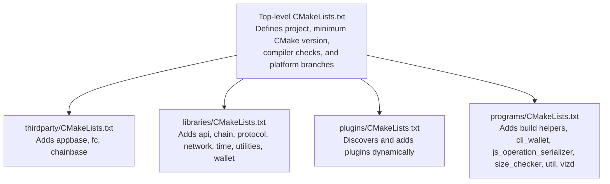
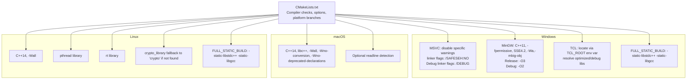
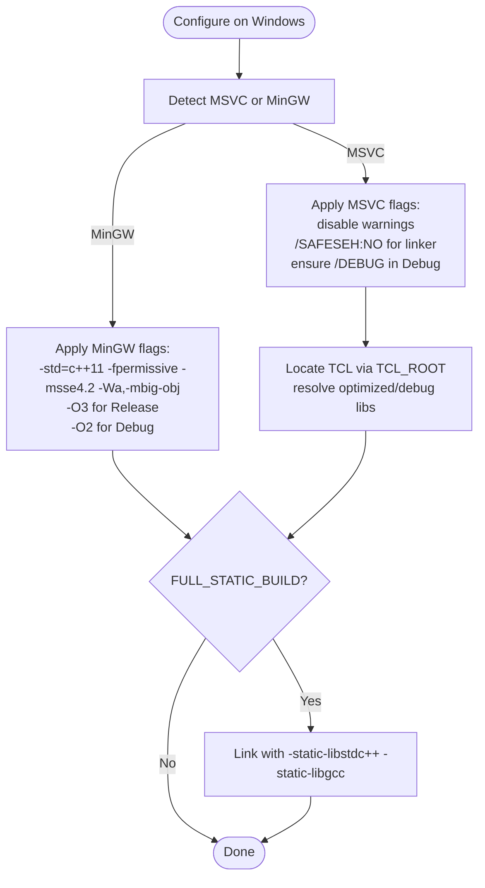
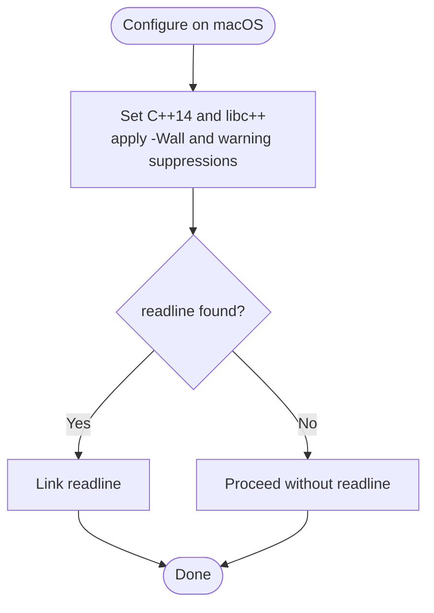
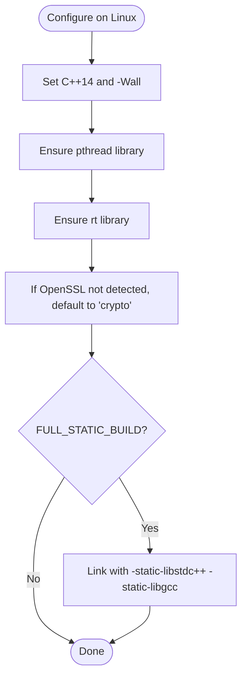
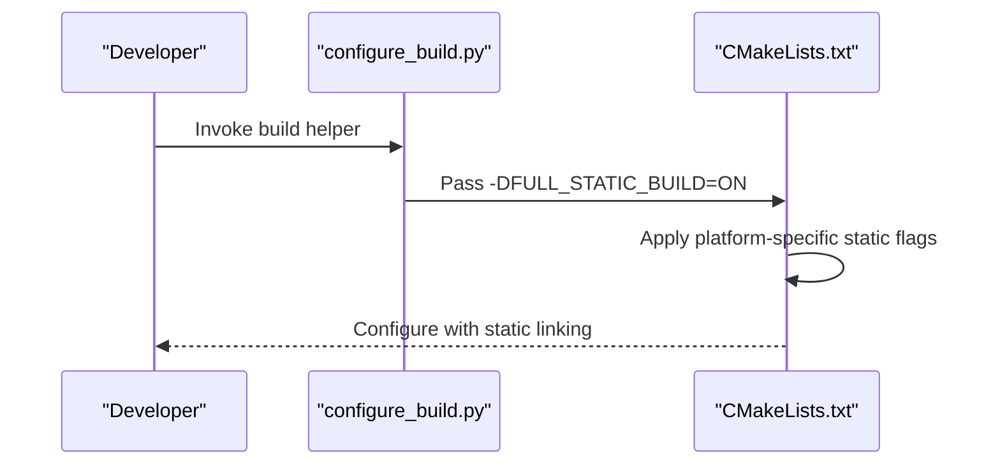
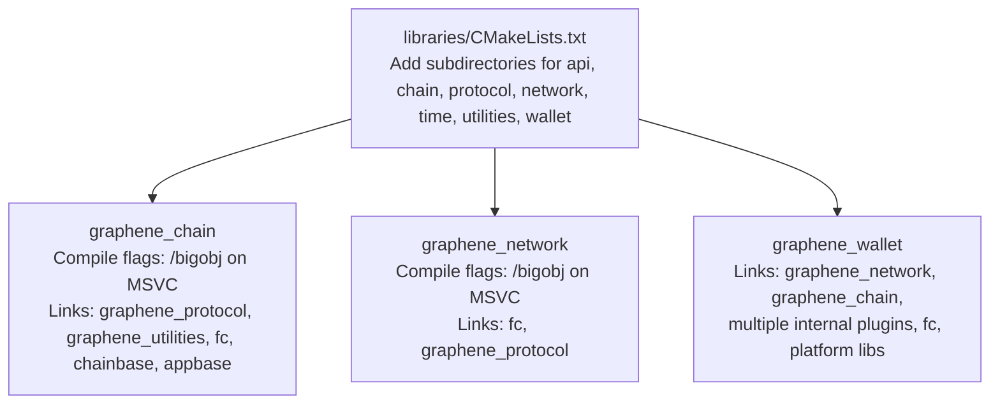
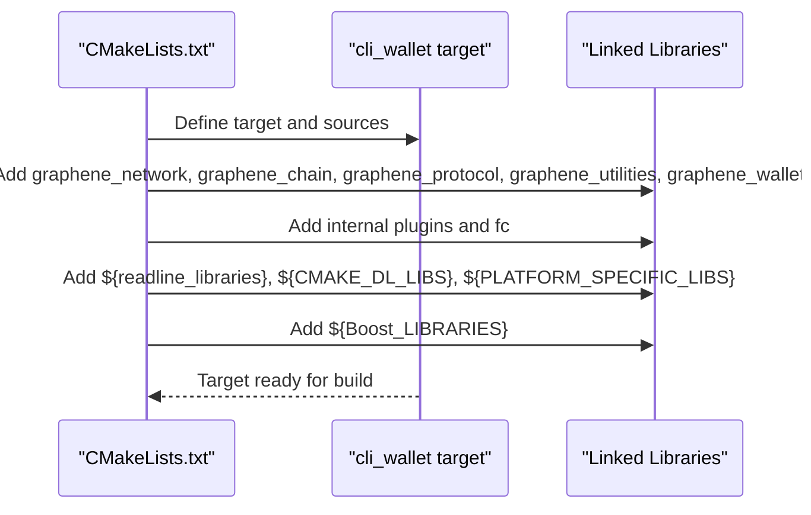
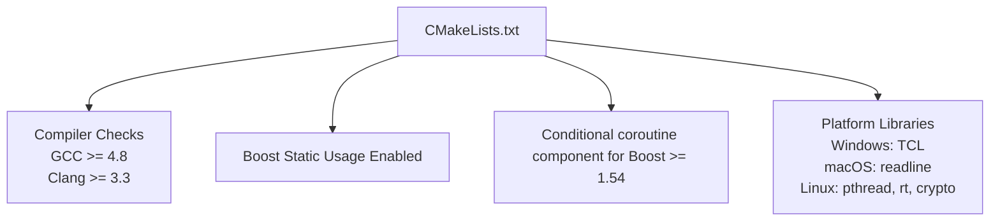

# Platform Configurations

<cite>
**Referenced Files in This Document**
- [CMakeLists.txt](file://CMakeLists.txt)
- [libraries/CMakeLists.txt](file://libraries/CMakeLists.txt)
- [libraries/chain/CMakeLists.txt](file://libraries/chain/CMakeLists.txt)
- [libraries/network/CMakeLists.txt](file://libraries/network/CMakeLists.txt)
- [libraries/wallet/CMakeLists.txt](file://libraries/wallet/CMakeLists.txt)
- [programs/cli_wallet/CMakeLists.txt](file://programs/cli_wallet/CMakeLists.txt)
- [programs/build_helpers/configure_build.py](file://programs/build_helpers/configure_build.py)
</cite>

## Table of Contents
1. [Introduction](#introduction)
2. [Project Structure](#project-structure)
3. [Core Components](#core-components)
4. [Architecture Overview](#architecture-overview)
5. [Detailed Component Analysis](#detailed-component-analysis)
6. [Dependency Analysis](#dependency-analysis)
7. [Performance Considerations](#performance-considerations)
8. [Troubleshooting Guide](#troubleshooting-guide)
9. [Conclusion](#conclusion)

## Introduction
This document provides comprehensive platform-specific CMake configuration guidance for the VIZ CPP Node build system. It covers compiler and linker settings per platform, static linking options, required libraries, and troubleshooting steps for common issues. The focus areas include:
- Windows with MSVC and MinGW toolchains
- macOS with libc++ and C++14
- Linux with GCC, pthread, rt, and OpenSSL detection
- Compiler version requirements and platform-specific dependency resolution

## Project Structure
The top-level CMake configuration orchestrates platform-specific behavior and includes subprojects for third-party libraries, core libraries, plugins, and programs. Platform checks are performed early to set flags, link libraries, and enable features.

**Diagram sources**
- [CMakeLists.txt](file://CMakeLists.txt#L1-L277)
- [libraries/CMakeLists.txt](file://libraries/CMakeLists.txt#L1-L8)

**Section sources**
- [CMakeLists.txt](file://CMakeLists.txt#L1-L277)
- [libraries/CMakeLists.txt](file://libraries/CMakeLists.txt#L1-L8)

## Core Components
- Top-level CMake configuration sets compiler requirements, optional build features, and platform-specific flags.
- Library targets are built with platform-aware compile and link settings.
- Executables link against platform-specific libraries and optional profiling or performance tools.

Key platform-specific behaviors:
- Compiler version checks for GCC and Clang.
- Static linking toggles via a full-static build option.
- Platform-specific include/link flags for Windows, macOS, and Linux.

**Section sources**
- [CMakeLists.txt](file://CMakeLists.txt#L11-L20)
- [CMakeLists.txt](file://CMakeLists.txt#L52-L54)
- [CMakeLists.txt](file://CMakeLists.txt#L158-L202)

## Architecture Overview
The build system applies platform-specific logic early, then composes targets across thirdparty, libraries, plugins, and programs. Windows, macOS, and Linux branches configure flags, libraries, and linkers differently.

**Diagram sources**
- [CMakeLists.txt](file://CMakeLists.txt#L112-L202)

## Detailed Component Analysis

### Windows Configuration (MSVC and MinGW)
- Compiler checks enforce minimum versions for GCC and Clang.
- MSVC-specific flags:
  - Disable specific warnings.
  - Linker flags to bypass Safe Exception Handler (SEH) requirements.
  - Debug linker flags to ensure debug info emission.
- TCL library integration:
  - Locate headers via environment variable pointing to TCL installation.
  - Resolve optimized and debug variants of the TCL library.
- MinGW-specific flags:
  - C++11 standard, permissive mode, SSE4.2, and large object support.
  - Release and Debug optimization levels.
  - Optional static linking of standard C++ and C runtime when enabled.

**Diagram sources**
- [CMakeLists.txt](file://CMakeLists.txt#L123-L156)

**Section sources**
- [CMakeLists.txt](file://CMakeLists.txt#L112-L156)

### macOS Configuration (Apple Platforms)
- Compiler flags:
  - C++14 standard.
  - Use of libc++ standard library.
  - General warning flags and suppression of specific conversion/deprecation warnings.
- Optional readline detection is present but not mandatory.

**Diagram sources**
- [CMakeLists.txt](file://CMakeLists.txt#L166-L170)

**Section sources**
- [CMakeLists.txt](file://CMakeLists.txt#L166-L170)

### Linux Configuration (GNU Toolchain)
- Compiler flags:
  - C++14 standard and general warnings.
- Required libraries:
  - pthread library linkage.
  - rt library linkage.
  - OpenSSL detection fallback to the crypto library if not found by find_package.
- Optional static linking of standard C++ and C runtime when enabled.

**Diagram sources**
- [CMakeLists.txt](file://CMakeLists.txt#L171-L184)

**Section sources**
- [CMakeLists.txt](file://CMakeLists.txt#L171-L184)

### Static Linking Option
- A dedicated build mode enables full static linking of standard C++ and C runtime libraries on both Windows and Linux platforms.
- The option is surfaced in the build helper script and consumed by the top-level configuration.

**Diagram sources**
- [programs/build_helpers/configure_build.py](file://programs/build_helpers/configure_build.py#L170)
- [CMakeLists.txt](file://CMakeLists.txt#L153-L155)
- [CMakeLists.txt](file://CMakeLists.txt#L181-L183)

**Section sources**
- [programs/build_helpers/configure_build.py](file://programs/build_helpers/configure_build.py#L170)
- [CMakeLists.txt](file://CMakeLists.txt#L153-L155)
- [CMakeLists.txt](file://CMakeLists.txt#L181-L183)

### Library Targets and Platform-Aware Settings
- Library targets are built with platform-specific compile flags and link dependencies.
- Examples:
  - Chain library applies MSVC-specific bigobj handling and links to protocol, utilities, fc, chainbase, appbase, and optional patch merge library.
  - Network library applies MSVC bigobj handling and links to fc and protocol.
  - Wallet library links to numerous internal plugins and platform-specific libraries.

**Diagram sources**
- [libraries/chain/CMakeLists.txt](file://libraries/chain/CMakeLists.txt#L130-L132)
- [libraries/chain/CMakeLists.txt](file://libraries/chain/CMakeLists.txt#L127)
- [libraries/network/CMakeLists.txt](file://libraries/network/CMakeLists.txt#L46-L48)
- [libraries/network/CMakeLists.txt](file://libraries/network/CMakeLists.txt#L39)
- [libraries/wallet/CMakeLists.txt](file://libraries/wallet/CMakeLists.txt#L73-L75)
- [libraries/wallet/CMakeLists.txt](file://libraries/wallet/CMakeLists.txt#L50-L70)

**Section sources**
- [libraries/chain/CMakeLists.txt](file://libraries/chain/CMakeLists.txt#L130-L132)
- [libraries/chain/CMakeLists.txt](file://libraries/chain/CMakeLists.txt#L127)
- [libraries/network/CMakeLists.txt](file://libraries/network/CMakeLists.txt#L46-L48)
- [libraries/network/CMakeLists.txt](file://libraries/network/CMakeLists.txt#L39)
- [libraries/wallet/CMakeLists.txt](file://libraries/wallet/CMakeLists.txt#L73-L75)
- [libraries/wallet/CMakeLists.txt](file://libraries/wallet/CMakeLists.txt#L50-L70)

### Executable Targets and Platform-Specific Libraries
- CLI wallet links to network, chain, protocol, utilities, wallet, multiple internal plugins, fc, and platform-specific libraries.
- On Unix (non-macOS), the rt library is added conditionally.
- On macOS, readline is linked if found.
- Optional performance tooling via gperftools detection.

**Diagram sources**
- [programs/cli_wallet/CMakeLists.txt](file://programs/cli_wallet/CMakeLists.txt#L21-L41)
- [programs/cli_wallet/CMakeLists.txt](file://programs/cli_wallet/CMakeLists.txt#L2-L8)

**Section sources**
- [programs/cli_wallet/CMakeLists.txt](file://programs/cli_wallet/CMakeLists.txt#L21-L41)
- [programs/cli_wallet/CMakeLists.txt](file://programs/cli_wallet/CMakeLists.txt#L2-L8)

## Dependency Analysis
- Compiler and toolchain:
  - Minimum versions enforced for GCC and Clang.
  - Ninja generator receives additional diagnostics flags for Clang.
- Boost:
  - Static usage is enabled by default.
  - Coroutine component is conditionally added for newer Boost versions.
- Platform libraries:
  - Windows: TCL integration via environment-driven discovery.
  - macOS: optional readline linkage.
  - Linux: pthread and rt linkage; OpenSSL fallback to crypto.

**Diagram sources**
- [CMakeLists.txt](file://CMakeLists.txt#L12-L20)
- [CMakeLists.txt](file://CMakeLists.txt#L52)
- [CMakeLists.txt](file://CMakeLists.txt#L99-L104)
- [CMakeLists.txt](file://CMakeLists.txt#L160-L180)

**Section sources**
- [CMakeLists.txt](file://CMakeLists.txt#L12-L20)
- [CMakeLists.txt](file://CMakeLists.txt#L52)
- [CMakeLists.txt](file://CMakeLists.txt#L99-L104)
- [CMakeLists.txt](file://CMakeLists.txt#L160-L180)

## Performance Considerations
- Optimization flags:
  - MinGW Debug builds use a moderate optimization level to avoid assembler errors.
  - General Debug builds add a debug macro definition.
- Static linking:
  - Enables full static linking of standard C++ and C runtime libraries when requested.
- Build acceleration:
  - Optional ccache usage if available.

[No sources needed since this section provides general guidance]

## Troubleshooting Guide
Common platform-specific issues and resolutions:
- Windows
  - Missing TCL headers or libraries:
    - Ensure TCL_ROOT environment variable points to a valid TCL installation so headers and libraries can be discovered.
  - SEH-related linker warnings or failures:
    - The configuration disables Safe Exception Handler emission; ensure downstream packaging does not require SEH.
  - Large object compilation:
    - MSVC targets apply bigobj handling; verify that sources triggering large object counts still compile.
- macOS
  - Missing readline:
    - readline is optional; if not found, the build proceeds without it. Install readline if interactive editing is desired.
  - Standard library mismatch:
    - Ensure libc++ is used consistently across dependencies.
- Linux
  - pthread or rt missing:
    - The build expects pthread and rt to be available; ensure the system provides these libraries.
  - OpenSSL detection failure:
    - If find_package cannot locate OpenSSL, the configuration defaults to linking against the crypto library; adjust package configuration or pass explicit hints if necessary.
  - Static linking failures:
    - When enabling full static linking, ensure all transitive dependencies are also statically available.

**Section sources**
- [CMakeLists.txt](file://CMakeLists.txt#L132-L145)
- [CMakeLists.txt](file://CMakeLists.txt#L130-L132)
- [CMakeLists.txt](file://CMakeLists.txt#L160-L164)
- [CMakeLists.txt](file://CMakeLists.txt#L174-L180)
- [CMakeLists.txt](file://CMakeLists.txt#L181-L183)

## Conclusion
The VIZ CPP Node build system applies robust, platform-aware configuration to ensure reliable builds across Windows, macOS, and Linux. By enforcing compiler versions, integrating platform-specific libraries, and supporting a static-linking mode, the system accommodates diverse deployment scenarios. Use the platform-specific guidance and troubleshooting tips herein to resolve typical build issues and tailor configurations to your environment.