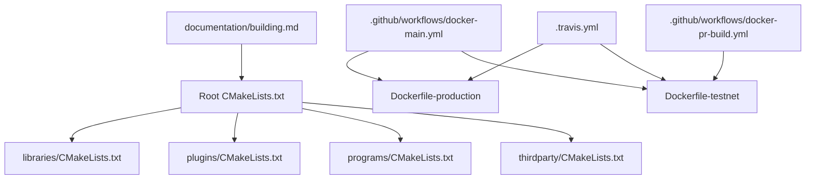
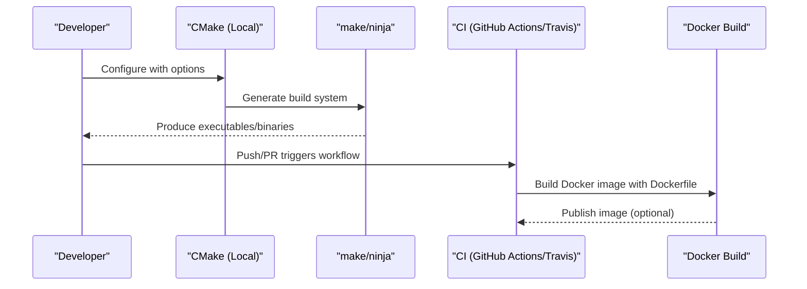
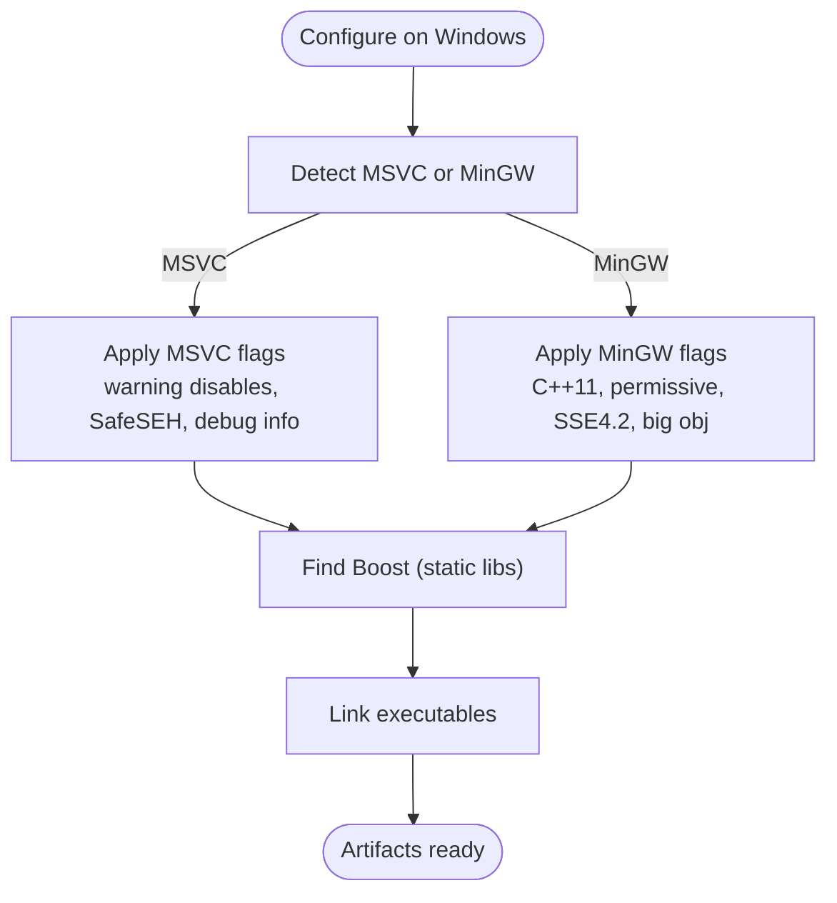
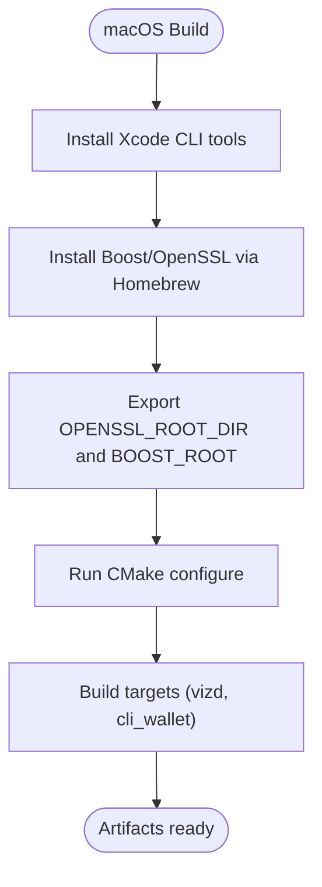
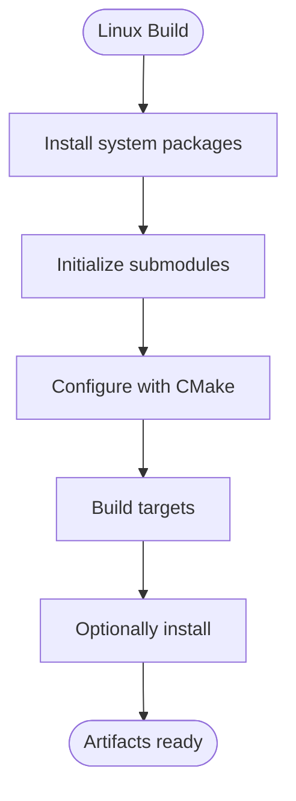
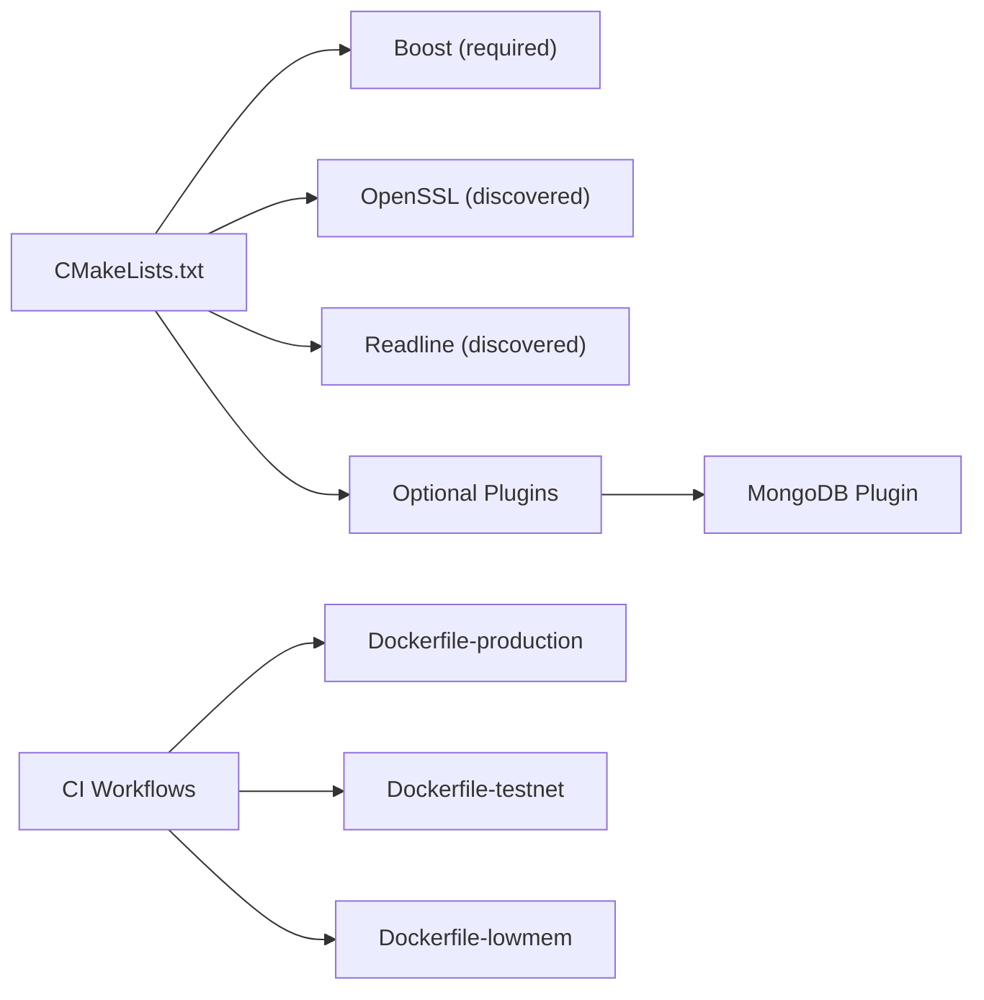

# Cross-Platform Compilation

<cite>
**Referenced Files in This Document**
- [CMakeLists.txt](file://CMakeLists.txt)
- [README.md](file://README.md)
- [documentation/building.md](file://documentation/building.md)
- [.github/workflows/docker-main.yml](file://.github/workflows/docker-main.yml)
- [.github/workflows/docker-pr-build.yml](file://.github/workflows/docker-pr-build.yml)
- [.travis.yml](file://.travis.yml)
- [share/vizd/docker/Dockerfile-production](file://share/vizd/docker/Dockerfile-production)
- [share/vizd/docker/Dockerfile-testnet](file://share/vizd/docker/Dockerfile-testnet)
- [share/vizd/docker/Dockerfile-lowmem](file://share/vizd/docker/Dockerfile-lowmem)
</cite>

## Table of Contents
1. [Introduction](#introduction)
2. [Project Structure](#project-structure)
3. [Core Components](#core-components)
4. [Architecture Overview](#architecture-overview)
5. [Detailed Component Analysis](#detailed-component-analysis)
6. [Dependency Analysis](#dependency-analysis)
7. [Performance Considerations](#performance-considerations)
8. [Troubleshooting Guide](#troubleshooting-guide)
9. [Conclusion](#conclusion)
10. [Appendices](#appendices)

## Introduction
This document provides comprehensive cross-platform build instructions and configuration guidance for VIZ CPP Node. It covers platform-specific compiler requirements, dependency installation, build options, static/dynamic linking behavior, optimization flags, and platform-specific artifacts. It also documents CI/CD automation via GitHub Actions and Travis CI, along with Docker-based reproducible builds. Guidance is derived from the repository’s CMake configuration, platform-specific documentation, and CI workflow definitions.

## Project Structure
The build system is driven by CMake with platform-specific logic and CI workflows that build Docker images. The repository includes:
- Root CMake configuration with compiler checks, options, and platform branches
- Platform-specific build documentation
- CI workflows for Docker image builds
- Dockerfiles for production and testnet variants

**Diagram sources**
- [CMakeLists.txt](file://CMakeLists.txt#L1-L277)
- [documentation/building.md](file://documentation/building.md#L1-L212)
- [.github/workflows/docker-main.yml](file://.github/workflows/docker-main.yml#L1-L41)
- [.github/workflows/docker-pr-build.yml](file://.github/workflows/docker-pr-build.yml#L1-L24)
- [.travis.yml](file://.travis.yml#L1-L46)
- [share/vizd/docker/Dockerfile-production](file://share/vizd/docker/Dockerfile-production#L1-L88)
- [share/vizd/docker/Dockerfile-testnet](file://share/vizd/docker/Dockerfile-testnet#L1-L88)

**Section sources**
- [CMakeLists.txt](file://CMakeLists.txt#L1-L277)
- [documentation/building.md](file://documentation/building.md#L1-L212)
- [.github/workflows/docker-main.yml](file://.github/workflows/docker-main.yml#L1-L41)
- [.github/workflows/docker-pr-build.yml](file://.github/workflows/docker-pr-build.yml#L1-L24)
- [.travis.yml](file://.travis.yml#L1-L46)

## Core Components
- Compiler requirements and flags:
  - GCC minimum version check and Clang minimum version check are enforced at the top level.
  - Platform-specific flags:
    - Windows (MSVC): warning suppressions and linker flags; TCL detection and linkage.
    - Windows (MinGW): C++11 dialect, permissive mode, SSE4.2, big object, separate Release/Debug optimization flags, optional full static linking.
    - macOS: C++14, libc++, warnings adjustments.
    - Linux: C++14, common warnings, pthread/rt/crypto libraries, optional full static linking.
  - Coverage and PCH support toggles.
- Linking and libraries:
  - Static Boost linkage by default on Windows.
  - Optional MongoDB plugin build flag.
  - Optional static executable linking via FULL_STATIC_BUILD.
- Build options:
  - BUILD_TESTNET, LOW_MEMORY_NODE, CHAINBASE_CHECK_LOCKING, ENABLE_MONGO_PLUGIN, BUILD_SHARED_LIBRARIES, ENABLE_INSTALLER, ENABLE_COVERAGE_TESTING.

Key build targets are defined under programs (e.g., vizd, cli_wallet) and assembled by the root CMake configuration.

**Section sources**
- [CMakeLists.txt](file://CMakeLists.txt#L11-L20)
- [CMakeLists.txt](file://CMakeLists.txt#L91-L202)
- [CMakeLists.txt](file://CMakeLists.txt#L52-L89)
- [CMakeLists.txt](file://CMakeLists.txt#L204-L208)
- [CMakeLists.txt](file://CMakeLists.txt#L210-L213)

## Architecture Overview
The build pipeline integrates local CMake builds with CI-driven Docker builds. The CI orchestrates image builds for production and testnet variants, while local documentation describes manual builds on Ubuntu and macOS.

**Diagram sources**
- [CMakeLists.txt](file://CMakeLists.txt#L204-L208)
- [.github/workflows/docker-main.yml](file://.github/workflows/docker-main.yml#L11-L41)
- [.github/workflows/docker-pr-build.yml](file://.github/workflows/docker-pr-build.yml#L9-L24)
- [.travis.yml](file://.travis.yml#L22-L42)
- [share/vizd/docker/Dockerfile-production](file://share/vizd/docker/Dockerfile-production#L40-L55)
- [share/vizd/docker/Dockerfile-testnet](file://share/vizd/docker/Dockerfile-testnet#L40-L55)

## Detailed Component Analysis

### Windows (MSVC and MinGW)
- Compiler requirements:
  - Enforced minimum versions for GCC and Clang apply globally; MSVC is supported via CMake generator selection.
- Dependencies:
  - Boost components are required; Windows forces static Boost usage.
  - TCL is detected and linked on Windows; include path is derived from environment.
- Flags and options:
  - MSVC: warning disables, SafeSEH flags, debug info linkage.
  - MinGW: C++11 dialect, permissive mode, SSE4.2, big object, separate Release/Debug optimization flags, optional full static linking.
- Linking:
  - Static Boost linkage on Windows; optional full static executable linking controlled by FULL_STATIC_BUILD.
- Artifacts:
  - Executables produced under the configured install prefix; Windows packaging controlled by CPack when enabled.

**Diagram sources**
- [CMakeLists.txt](file://CMakeLists.txt#L91-L156)
- [CMakeLists.txt](file://CMakeLists.txt#L52-L54)
- [CMakeLists.txt](file://CMakeLists.txt#L123-L156)

**Section sources**
- [CMakeLists.txt](file://CMakeLists.txt#L91-L156)
- [CMakeLists.txt](file://CMakeLists.txt#L52-L54)

### macOS (Xcode)
- Compiler requirements:
  - Xcode command line tools required; CMake detects compilers automatically.
- Dependencies:
  - Boost via Homebrew; OpenSSL prefix exported for discovery.
- Flags and options:
  - C++14, libc++, common warnings adjustments.
- Artifacts:
  - Executables built with standard CMake generators; install targets available.

**Diagram sources**
- [documentation/building.md](file://documentation/building.md#L138-L201)
- [CMakeLists.txt](file://CMakeLists.txt#L166-L170)

**Section sources**
- [documentation/building.md](file://documentation/building.md#L138-L201)
- [CMakeLists.txt](file://CMakeLists.txt#L166-L170)

### Linux (Ubuntu LTS)
- Compiler requirements:
  - Supported with GCC and Clang; C++14 standard is used.
- Dependencies:
  - System packages include CMake, GCC, Git, OpenSSL dev, Boost dev packages, and optional tools (Doxygen, readline, ncurses).
- Flags and options:
  - C++14, common warnings; pthread/rt/crypto libraries; optional full static linking.
- Artifacts:
  - Executables built via make; install target produces system-wide binaries.

**Diagram sources**
- [documentation/building.md](file://documentation/building.md#L25-L75)
- [CMakeLists.txt](file://CMakeLists.txt#L171-L184)

**Section sources**
- [documentation/building.md](file://documentation/building.md#L25-L75)
- [CMakeLists.txt](file://CMakeLists.txt#L171-L184)

### Static vs Dynamic Linking
- Library linkage:
  - Windows: Boost linkage forced static.
  - Linux/macOS: default is dynamic; static linkage can be enabled via FULL_STATIC_BUILD.
- Executable linkage:
  - FULL_STATIC_BUILD toggles static linking for executables on Linux/macOS; Windows applies static Boost and optional full static executable linkage.

**Section sources**
- [CMakeLists.txt](file://CMakeLists.txt#L52-L54)
- [CMakeLists.txt](file://CMakeLists.txt#L153-L155)
- [CMakeLists.txt](file://CMakeLists.txt#L181-L183)

### Platform-Specific Optimization Flags
- Windows:
  - MSVC: SafeSEH flags and debug info linkage.
  - MinGW: SSE4.2, big object, separate Release/Debug optimization flags.
- macOS/Linux:
  - C++14 standard; Linux adds pthread/rt/crypto libraries; Ninja with Clang enables colored diagnostics.

**Section sources**
- [CMakeLists.txt](file://CMakeLists.txt#L123-L156)
- [CMakeLists.txt](file://CMakeLists.txt#L166-L184)
- [CMakeLists.txt](file://CMakeLists.txt#L190-L194)

### Build Targets and Artifacts
- Executables:
  - vizd, cli_wallet, and additional utilities are built from programs.
- Packaging:
  - CPack is conditionally enabled for installer generation; Windows uses ZIP/NSIS; macOS uses DragNDrop; Linux uses TGZ.

**Section sources**
- [CMakeLists.txt](file://CMakeLists.txt#L210-L213)
- [CMakeLists.txt](file://CMakeLists.txt#L215-L262)

## Dependency Analysis
- External dependencies:
  - Boost components are required; Windows forces static Boost linkage.
  - OpenSSL and readline are discovered via CMake; Linux sets pthread/rt/crypto defaults.
- Optional components:
  - MongoDB plugin can be enabled via a build flag.
- CI-driven builds:
  - Dockerfiles define reproducible environments and build options.

**Diagram sources**
- [CMakeLists.txt](file://CMakeLists.txt#L38-L50)
- [CMakeLists.txt](file://CMakeLists.txt#L97-L104)
- [CMakeLists.txt](file://CMakeLists.txt#L160-L180)
- [CMakeLists.txt](file://CMakeLists.txt#L83-L89)
- [.github/workflows/docker-main.yml](file://.github/workflows/docker-main.yml#L11-L41)
- [.github/workflows/docker-pr-build.yml](file://.github/workflows/docker-pr-build.yml#L9-L24)
- [share/vizd/docker/Dockerfile-production](file://share/vizd/docker/Dockerfile-production#L7-L30)
- [share/vizd/docker/Dockerfile-testnet](file://share/vizd/docker/Dockerfile-testnet#L7-L30)
- [share/vizd/docker/Dockerfile-lowmem](file://share/vizd/docker/Dockerfile-lowmem#L7-L30)

**Section sources**
- [CMakeLists.txt](file://CMakeLists.txt#L38-L50)
- [CMakeLists.txt](file://CMakeLists.txt#L97-L104)
- [CMakeLists.txt](file://CMakeLists.txt#L160-L180)
- [CMakeLists.txt](file://CMakeLists.txt#L83-L89)

## Performance Considerations
- Compiler and flags:
  - Use Release builds for production; Linux/macOS enable C++14; MinGW enables SSE4.2.
  - Full static linking reduces runtime dependencies but may increase binary size and startup time.
- Build system:
  - ccache is enabled when available to speed up rebuilds.
  - Ninja generator with Clang enables colored diagnostics for readability.
- CI and reproducibility:
  - Dockerfiles pin system packages and build options for deterministic builds.

**Section sources**
- [CMakeLists.txt](file://CMakeLists.txt#L106-L110)
- [CMakeLists.txt](file://CMakeLists.txt#L186-L194)
- [share/vizd/docker/Dockerfile-production](file://share/vizd/docker/Dockerfile-production#L46-L54)
- [share/vizd/docker/Dockerfile-testnet](file://share/vizd/docker/Dockerfile-testnet#L46-L54)

## Troubleshooting Guide
- Compiler version errors:
  - GCC and Clang minimum versions are enforced; ensure toolchains meet requirements.
- Boost linkage issues on Windows:
  - Static Boost linkage is forced; ensure environment variables and paths are correct.
- MinGW “File too big” errors:
  - Debug builds use reduced optimization; enabling big object support is handled in flags.
- macOS OpenSSL discovery:
  - Set OPENSSL_ROOT_DIR to Homebrew OpenSSL prefix.
- Linux readline/ncurses:
  - Some distributions require readline development packages; CMake attempts to locate them.
- CI failures:
  - Verify Dockerfile context copying and submodule initialization steps.

**Section sources**
- [CMakeLists.txt](file://CMakeLists.txt#L11-L20)
- [CMakeLists.txt](file://CMakeLists.txt#L91-L156)
- [CMakeLists.txt](file://CMakeLists.txt#L160-L180)
- [documentation/building.md](file://documentation/building.md#L138-L201)
- [share/vizd/docker/Dockerfile-production](file://share/vizd/docker/Dockerfile-production#L32-L43)
- [share/vizd/docker/Dockerfile-testnet](file://share/vizd/docker/Dockerfile-testnet#L32-L43)

## Conclusion
The repository provides robust, cross-platform build support with explicit platform branches, strong compiler requirements, and CI-driven Docker builds. Developers can build locally on Windows, macOS, and Linux using documented steps, while CI ensures reproducible Docker images for production and testnet deployments.

## Appendices

### Step-by-Step Compilation Instructions

- Ubuntu 16.04 LTS
  - Install system packages and Boost development packages.
  - Initialize submodules, configure with CMake, build targets, and optionally install.
  - Reference: [documentation/building.md](file://documentation/building.md#L25-L75)

- Ubuntu 14.04 LTS
  - Install required packages; build and install Boost 1.57 manually if needed.
  - Configure with CMake and build targets.
  - Reference: [documentation/building.md](file://documentation/building.md#L76-L137)

- macOS X
  - Install Xcode CLI tools and Homebrew; install Boost and OpenSSL via Homebrew.
  - Export OpenSSL and Boost prefixes, initialize submodules, configure with CMake, and build.
  - Reference: [documentation/building.md](file://documentation/building.md#L138-L201)

- Windows (MSVC/MinGW)
  - Configure with CMake generator for desired toolchain; MSVC flags and SafeSEH settings are applied automatically; MinGW enables C++11, permissive mode, SSE4.2, and big object support.
  - Reference: [CMakeLists.txt](file://CMakeLists.txt#L91-L156)

### Continuous Integration and Automated Builds
- GitHub Actions
  - Builds Docker images for testnet and production on push to master and PRs.
  - References:
    - [.github/workflows/docker-main.yml](file://.github/workflows/docker-main.yml#L11-L41)
    - [.github/workflows/docker-pr-build.yml](file://.github/workflows/docker-pr-build.yml#L9-L24)

- Travis CI
  - Matrix builds multiple Docker variants; pushes tagged images when applicable.
  - Reference: [.travis.yml](file://.travis.yml#L19-L42)

### Docker-Based Builds
- Production
  - Sets Release build, disables shared libraries, disables extra features, installs dependencies, builds, installs, and prepares runtime image.
  - Reference: [share/vizd/docker/Dockerfile-production](file://share/vizd/docker/Dockerfile-production#L7-L60)

- Testnet
  - Same as production with BUILD_TESTNET enabled.
  - Reference: [share/vizd/docker/Dockerfile-testnet](file://share/vizd/docker/Dockerfile-testnet#L7-L60)

- Low-memory node
  - Same as production with LOW_MEMORY_NODE enabled.
  - Reference: [share/vizd/docker/Dockerfile-lowmem](file://share/vizd/docker/Dockerfile-lowmem#L7-L60)

### Relationship Between Platform Choices and Runtime Performance
- Windows:
  - MSVC SafeSEH and debug info flags impact link-time behavior; static Boost reduces runtime dependencies.
- macOS:
  - C++14 and libc++ align with modern ABI; minimal extra flags optimize for standard compliance.
- Linux:
  - C++14 and pthread/rt/crypto libraries ensure efficient threading and timing; static linking reduces external dependencies at the cost of larger binaries.

**Section sources**
- [CMakeLists.txt](file://CMakeLists.txt#L123-L156)
- [CMakeLists.txt](file://CMakeLists.txt#L166-L184)
- [share/vizd/docker/Dockerfile-production](file://share/vizd/docker/Dockerfile-production#L46-L54)
- [share/vizd/docker/Dockerfile-testnet](file://share/vizd/docker/Dockerfile-testnet#L46-L54)
- [share/vizd/docker/Dockerfile-lowmem](file://share/vizd/docker/Dockerfile-lowmem#L46-L54)