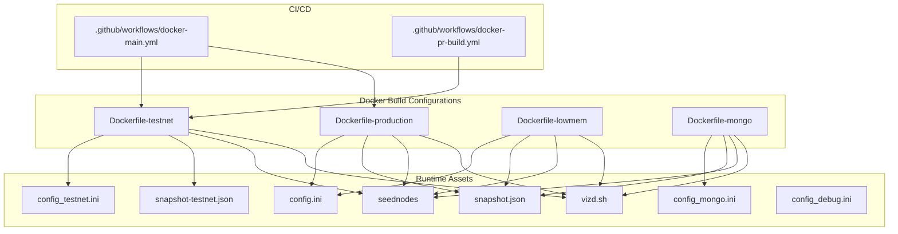
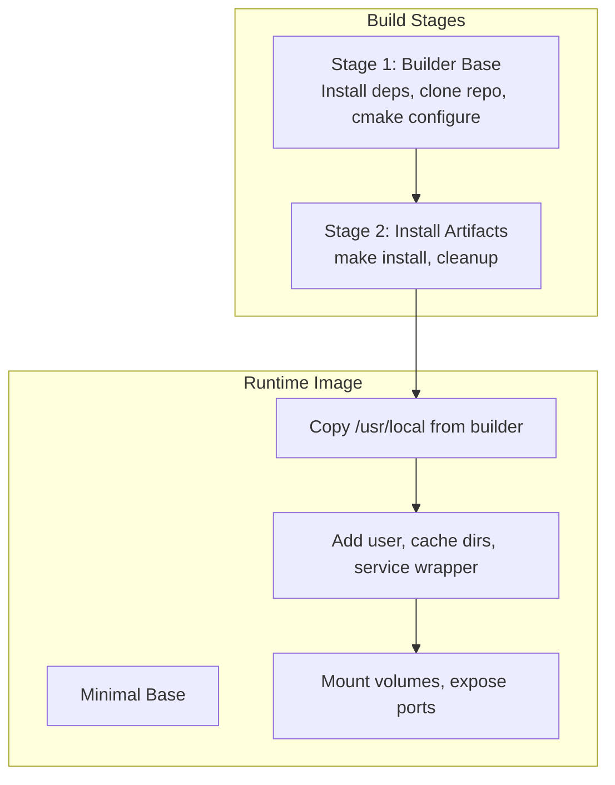
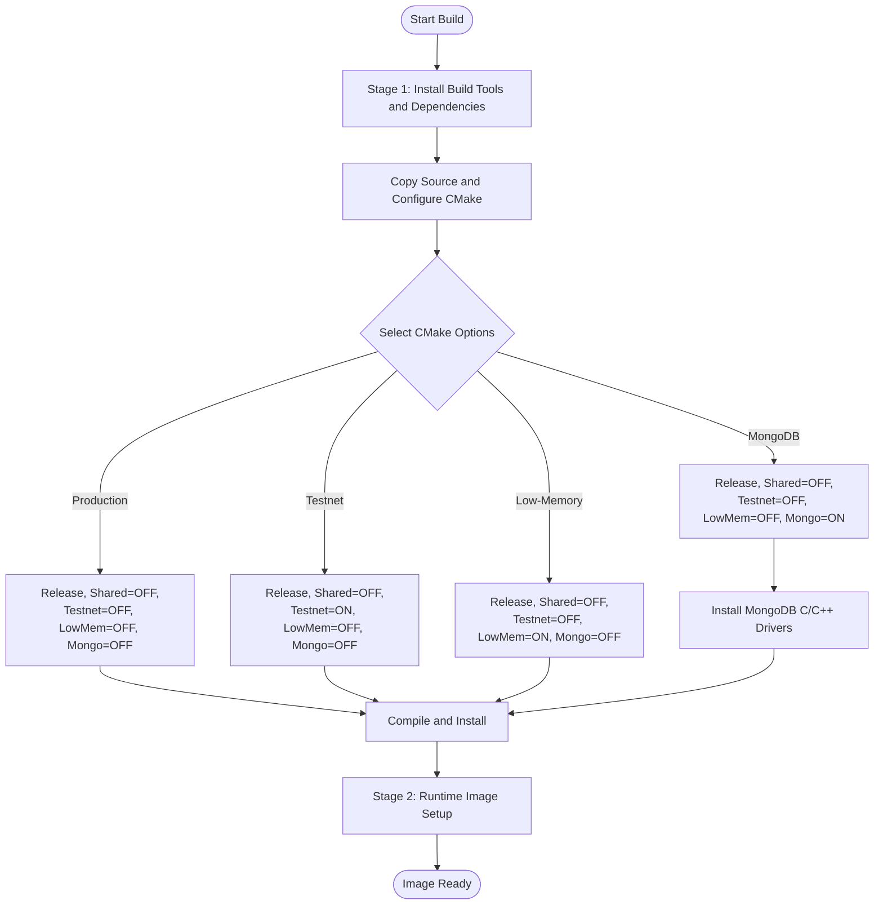
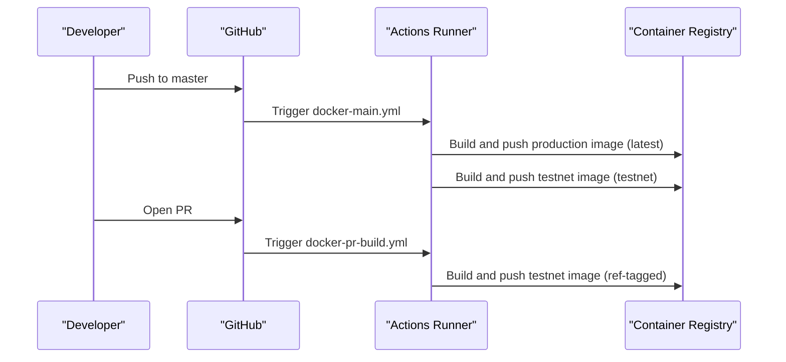
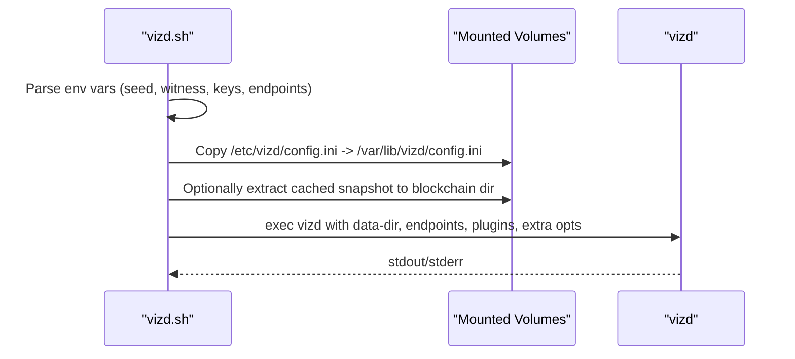
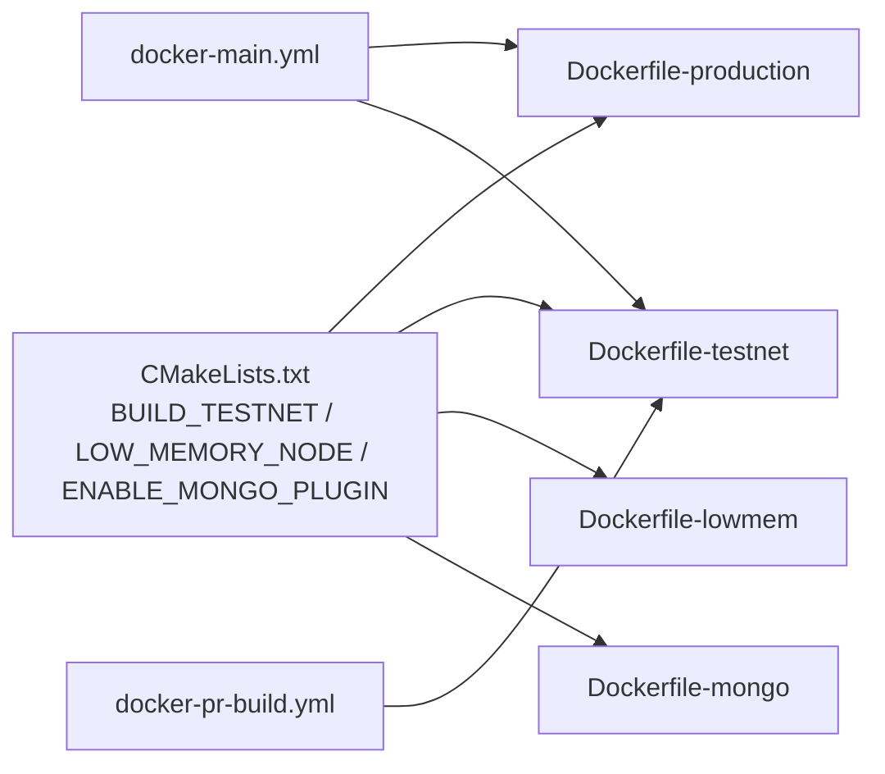

# Docker Integration

<cite>
**Referenced Files in This Document**
- [Dockerfile-production](file://share/vizd/docker/Dockerfile-production)
- [Dockerfile-testnet](file://share/vizd/docker/Dockerfile-testnet)
- [Dockerfile-lowmem](file://share/vizd/docker/Dockerfile-lowmem)
- [Dockerfile-mongo](file://share/vizd/docker/Dockerfile-mongo)
- [docker-main.yml](file://.github/workflows/docker-main.yml)
- [docker-pr-build.yml](file://.github/workflows/docker-pr-build.yml)
- [vizd.sh](file://share/vizd/vizd.sh)
- [config.ini](file://share/vizd/config/config.ini)
- [config_testnet.ini](file://share/vizd/config/config_testnet.ini)
- [config_mongo.ini](file://share/vizd/config/config_mongo.ini)
- [config_debug.ini](file://share/vizd/config/config_debug.ini)
- [snapshot.json](file://share/vizd/snapshot.json)
- [snapshot-testnet.json](file://share/vizd/snapshot-testnet.json)
- [seednodes](file://share/vizd/seednodes)
- [CMakeLists.txt](file://CMakeLists.txt)
</cite>

## Table of Contents
1. [Introduction](#introduction)
2. [Project Structure](#project-structure)
3. [Core Components](#core-components)
4. [Architecture Overview](#architecture-overview)
5. [Detailed Component Analysis](#detailed-component-analysis)
6. [Dependency Analysis](#dependency-analysis)
7. [Performance Considerations](#performance-considerations)
8. [Troubleshooting Guide](#troubleshooting-guide)
9. [Conclusion](#conclusion)
10. [Appendices](#appendices)

## Introduction
This document provides comprehensive Docker integration guidance for the VIZ CPP Node across development and production environments. It covers multi-stage Dockerfiles for production, testnet, low-memory, and MongoDB-enabled builds, the GitHub Actions CI/CD pipeline for automated Docker builds, container orchestration patterns, volume mounting for persistence, network configuration, environment variable usage, and the relationship between Docker configurations and CMake build options. Practical examples are included for running development containers, connecting to test networks, and deploying production nodes. Security considerations and troubleshooting tips are also provided.

## Project Structure
The Docker integration is centered around four primary Dockerfiles under share/vizd/docker, each tailored to a specific deployment profile. Supporting assets include configuration templates, scripts, snapshots, and seednode lists. The CI/CD pipeline is defined via GitHub Actions workflows.

**Diagram sources**
- [Dockerfile-production](file://share/vizd/docker/Dockerfile-production#L1-L88)
- [Dockerfile-testnet](file://share/vizd/docker/Dockerfile-testnet#L1-L88)
- [Dockerfile-lowmem](file://share/vizd/docker/Dockerfile-lowmem#L1-L82)
- [Dockerfile-mongo](file://share/vizd/docker/Dockerfile-mongo#L1-L111)
- [vizd.sh](file://share/vizd/vizd.sh#L1-L82)
- [seednodes](file://share/vizd/seednodes#L1-L6)
- [snapshot.json](file://share/vizd/snapshot.json#L1-L174)
- [snapshot-testnet.json](file://share/vizd/snapshot-testnet.json#L1-L35)
- [config.ini](file://share/vizd/config/config.ini#L1-L130)
- [config_testnet.ini](file://share/vizd/config/config_testnet.ini#L1-L132)
- [config_mongo.ini](file://share/vizd/config/config_mongo.ini#L1-L135)
- [config_debug.ini](file://share/vizd/config/config_debug.ini#L1-L126)
- [docker-main.yml](file://.github/workflows/docker-main.yml#L1-L41)
- [docker-pr-build.yml](file://.github/workflows/docker-pr-build.yml#L1-L24)

**Section sources**
- [Dockerfile-production](file://share/vizd/docker/Dockerfile-production#L1-L88)
- [Dockerfile-testnet](file://share/vizd/docker/Dockerfile-testnet#L1-L88)
- [Dockerfile-lowmem](file://share/vizd/docker/Dockerfile-lowmem#L1-L82)
- [Dockerfile-mongo](file://share/vizd/docker/Dockerfile-mongo#L1-L111)
- [docker-main.yml](file://.github/workflows/docker-main.yml#L1-L41)
- [docker-pr-build.yml](file://.github/workflows/docker-pr-build.yml#L1-L24)

## Core Components
- Multi-stage Dockerfiles:
  - Production: Builds with standard node settings, exposes RPC and P2P ports, mounts data directories for persistence.
  - Testnet: Similar to production but enables testnet-specific configuration and snapshot.
  - Low-memory: Optimized for constrained environments using a low-memory build option.
  - MongoDB-enabled: Installs MongoDB C/C++ drivers and enables the mongo_db plugin.
- CI/CD:
  - Automated Docker builds for master branch (production and testnet).
  - PR builds for testnet images with ref tagging.
- Runtime:
  - A service wrapper script initializes configuration, applies optional seed nodes, and starts the node with environment-driven endpoints and optional witness settings.
  - Configuration templates define RPC endpoints, P2P endpoints, plugin sets, logging, and optional MongoDB connection.
  - Snapshot assets enable fast initialization of blockchain data.

Key runtime environment variables supported by the container entrypoint:
- VIZD_SEED_NODES: Comma-separated list of seed nodes to connect to.
- VIZD_WITNESS_NAME: Optional witness name for block production.
- VIZD_PRIVATE_KEY: Private key for witness signing.
- VIZD_RPC_ENDPOINT: Override RPC endpoint binding.
- VIZD_P2P_ENDPOINT: Override P2P endpoint binding.
- VIZD_EXTRA_OPTS: Additional arguments appended to the node command.

Exposed ports:
- 8090: HTTP RPC
- 8091: WebSocket RPC
- 2001: P2P

Volumes:
- /var/lib/vizd: Blockchain data directory
- /etc/vizd: Configuration directory

**Section sources**
- [Dockerfile-production](file://share/vizd/docker/Dockerfile-production#L66-L88)
- [Dockerfile-testnet](file://share/vizd/docker/Dockerfile-testnet#L67-L88)
- [Dockerfile-lowmem](file://share/vizd/docker/Dockerfile-lowmem#L60-L82)
- [Dockerfile-mongo](file://share/vizd/docker/Dockerfile-mongo#L89-L111)
- [vizd.sh](file://share/vizd/vizd.sh#L1-L82)
- [config.ini](file://share/vizd/config/config.ini#L1-L130)
- [config_testnet.ini](file://share/vizd/config/config_testnet.ini#L1-L132)
- [config_mongo.ini](file://share/vizd/config/config_mongo.ini#L1-L135)
- [docker-main.yml](file://.github/workflows/docker-main.yml#L1-L41)
- [docker-pr-build.yml](file://.github/workflows/docker-pr-build.yml#L1-L24)

## Architecture Overview
The Docker-based deployment architecture separates build-time and runtime concerns:
- Build-time: Multi-stage Dockerfiles compile the node with CMake options selected per variant.
- Runtime: A minimal base image runs the node under a service supervisor, with volumes for persistence and configuration overlays.

**Diagram sources**
- [Dockerfile-production](file://share/vizd/docker/Dockerfile-production#L1-L88)
- [Dockerfile-testnet](file://share/vizd/docker/Dockerfile-testnet#L1-L88)
- [Dockerfile-lowmem](file://share/vizd/docker/Dockerfile-lowmem#L1-L82)
- [Dockerfile-mongo](file://share/vizd/docker/Dockerfile-mongo#L1-L111)

## Detailed Component Analysis

### Dockerfile Variants and CMake Options
Each Dockerfile selects CMake options to tailor the build:
- Production: Standard release build with full plugin set and no special flags.
- Testnet: Enables BUILD_TESTNET and uses testnet configuration and snapshot.
- Low-memory: Enables LOW_MEMORY_NODE to reduce memory footprint.
- MongoDB-enabled: Installs MongoDB C drivers and enables ENABLE_MONGO_PLUGIN.

**Diagram sources**
- [Dockerfile-production](file://share/vizd/docker/Dockerfile-production#L40-L59)
- [Dockerfile-testnet](file://share/vizd/docker/Dockerfile-testnet#L40-L55)
- [Dockerfile-lowmem](file://share/vizd/docker/Dockerfile-lowmem#L39-L53)
- [Dockerfile-mongo](file://share/vizd/docker/Dockerfile-mongo#L31-L58)
- [CMakeLists.txt](file://CMakeLists.txt#L56-L89)

**Section sources**
- [Dockerfile-production](file://share/vizd/docker/Dockerfile-production#L40-L59)
- [Dockerfile-testnet](file://share/vizd/docker/Dockerfile-testnet#L40-L55)
- [Dockerfile-lowmem](file://share/vizd/docker/Dockerfile-lowmem#L39-L53)
- [Dockerfile-mongo](file://share/vizd/docker/Dockerfile-mongo#L31-L58)
- [CMakeLists.txt](file://CMakeLists.txt#L56-L89)

### CI/CD Pipeline (GitHub Actions)
Automated Docker builds are configured for:
- Master branch: Builds production and testnet images and pushes to the registry with appropriate tags.
- Pull requests: Builds a testnet image and tags it with the PR ref for review.

**Diagram sources**
- [docker-main.yml](file://.github/workflows/docker-main.yml#L1-L41)
- [docker-pr-build.yml](file://.github/workflows/docker-pr-build.yml#L1-L24)

**Section sources**
- [docker-main.yml](file://.github/workflows/docker-main.yml#L1-L41)
- [docker-pr-build.yml](file://.github/workflows/docker-pr-build.yml#L1-L24)

### Container Runtime and Environment Variables
The container entrypoint script orchestrates node startup:
- Applies default seed nodes from the seednodes file if none are provided via environment.
- Copies the packaged configuration into the data directory and adjusts ownership.
- Optionally replays from a cached snapshot if present.
- Starts the node with configurable RPC and P2P endpoints and optional witness parameters.

**Diagram sources**
- [vizd.sh](file://share/vizd/vizd.sh#L1-L82)

**Section sources**
- [vizd.sh](file://share/vizd/vizd.sh#L1-L82)

### Configuration Templates and Plugin Sets
Configuration files define RPC endpoints, plugin sets, logging, and optional MongoDB URI. The testnet configuration enables witness production and includes a default witness and private key suitable for automated testing.

- Production: Full plugin set excluding MongoDB.
- Testnet: Includes witness plugin and default witness credentials.
- MongoDB: Adds mongo_db plugin and a MongoDB URI for external connectivity.

**Section sources**
- [config.ini](file://share/vizd/config/config.ini#L1-L130)
- [config_testnet.ini](file://share/vizd/config/config_testnet.ini#L1-L132)
- [config_mongo.ini](file://share/vizd/config/config_mongo.ini#L1-L135)

### Volume Mounting and Persistence
- /var/lib/vizd: Contains blockchain data, logs, and configuration overrides.
- /etc/vizd: Contains initial configuration and seednodes; copied into the data directory at first run.

Practical guidance:
- Bind-mount a host directory to /var/lib/vizd for persistent storage across container restarts.
- Place a custom config.ini into /etc/vizd to override defaults; it will be copied into the data directory on first run.

**Section sources**
- [Dockerfile-production](file://share/vizd/docker/Dockerfile-production#L74-L88)
- [Dockerfile-testnet](file://share/vizd/docker/Dockerfile-testnet#L75-L88)
- [Dockerfile-lowmem](file://share/vizd/docker/Dockerfile-lowmem#L68-L82)
- [Dockerfile-mongo](file://share/vizd/docker/Dockerfile-mongo#L97-L111)
- [vizd.sh](file://share/vizd/vizd.sh#L40-L43)

### Network Configuration and Connectivity
- Exposed ports: 8090 (HTTP RPC), 8091 (WebSocket RPC), 2001 (P2P).
- Seed nodes: Provided via /etc/vizd/seednodes; overridden by VIZD_SEED_NODES environment variable.
- P2P endpoint binding: Defaults to 0.0.0.0:2001; overrideable via VIZD_P2P_ENDPOINT.
- RPC endpoint binding: Defaults to 0.0.0.0:8090; overrideable via VIZD_RPC_ENDPOINT.

For MongoDB-enabled deployments, the configuration template includes a MongoDB URI suitable for connecting to a MongoDB instance reachable from the container’s network namespace.

**Section sources**
- [Dockerfile-production](file://share/vizd/docker/Dockerfile-production#L79-L85)
- [Dockerfile-testnet](file://share/vizd/docker/Dockerfile-testnet#L79-L85)
- [Dockerfile-lowmem](file://share/vizd/docker/Dockerfile-lowmem#L73-L79)
- [Dockerfile-mongo](file://share/vizd/docker/Dockerfile-mongo#L102-L108)
- [vizd.sh](file://share/vizd/vizd.sh#L62-L72)
- [seednodes](file://share/vizd/seednodes#L1-L6)
- [config_mongo.ini](file://share/vizd/config/config_mongo.ini#L71-L72)

### Practical Examples

- Run a production node locally:
  - docker run -d \
    --name viz-prod \
    -p 8090:8090 -p 8091:8091 -p 2001:2001 \
    -v /srv/viz/data:/var/lib/vizd \
    -v /srv/viz/etc:/etc/vizd \
    vizblockchain/vizd:latest

- Connect to the testnet:
  - docker run -d \
    --name viz-testnet \
    -e VIZD_SEED_NODES="seed1.testnet.viz:2001,seed2.testnet.viz:2001" \
    -p 8090:8090 -p 8091:8091 -p 2001:2001 \
    -v /srv/viz/testnet-data:/var/lib/vizd \
    vizblockchain/vizd:testnet

- Deploy a MongoDB-enabled node:
  - docker run -d \
    --name viz-mongo \
    -e VIZD_SEED_NODES="..." \
    -p 8090:8090 -p 8091:8091 -p 2001:2001 \
    -v /srv/viz/mongo-data:/var/lib/vizd \
    -v /srv/viz/mongo-etc:/etc/vizd \
    vizblockchain/vizd:mongo

- Run a witness node:
  - docker run -d \
    --name viz-witness \
    -e VIZD_WITNESS_NAME="your-witness" \
    -e VIZD_PRIVATE_KEY="5...your-private-key" \
    -p 8090:8090 -p 8091:8091 -p 2001:2001 \
    -v /srv/viz/witness-data:/var/lib/vizd \
    vizblockchain/vizd:latest

[No sources needed since this section provides practical examples without analyzing specific files]

## Dependency Analysis
The Docker build depends on CMake options to select features and plugins. The CI/CD pipeline depends on Docker Hub credentials and the presence of the Dockerfiles.

**Diagram sources**
- [CMakeLists.txt](file://CMakeLists.txt#L56-L89)
- [Dockerfile-production](file://share/vizd/docker/Dockerfile-production#L46-L51)
- [Dockerfile-testnet](file://share/vizd/docker/Dockerfile-testnet#L46-L52)
- [Dockerfile-lowmem](file://share/vizd/docker/Dockerfile-lowmem#L45-L50)
- [Dockerfile-mongo](file://share/vizd/docker/Dockerfile-mongo#L74-L79)
- [docker-main.yml](file://.github/workflows/docker-main.yml#L1-L41)
- [docker-pr-build.yml](file://.github/workflows/docker-pr-build.yml#L1-L24)

**Section sources**
- [CMakeLists.txt](file://CMakeLists.txt#L56-L89)
- [docker-main.yml](file://.github/workflows/docker-main.yml#L1-L41)
- [docker-pr-build.yml](file://.github/workflows/docker-pr-build.yml#L1-L24)

## Performance Considerations
- Multi-stage builds minimize final image size by discarding build tools and build artifacts after installation.
- Using Release builds and disabling shared libraries reduces binary size and improves runtime performance characteristics.
- Low-memory builds reduce shared memory sizing and related overhead for constrained environments.
- MongoDB builds include static drivers to avoid runtime dependency resolution overhead.
- Caching: ccache is enabled during CMake configuration to speed up rebuilds when iterating on changes.

[No sources needed since this section provides general guidance]

## Troubleshooting Guide
Common issues and resolutions:
- Ports already in use:
  - Change published ports or stop conflicting services.
- Permission denied on data directory:
  - Ensure the container user owns /var/lib/vizd and mounted volumes are writable.
- No connectivity to peers:
  - Verify VIZD_SEED_NODES or rely on default seednodes; confirm firewall/NAT rules allow inbound P2P traffic on port 2001.
- Slow startup due to replay:
  - Provide a cached snapshot or pre-seeded blockchain data in /var/lib/vizd to accelerate synchronization.
- Witness production not starting:
  - Confirm VIZD_WITNESS_NAME and VIZD_PRIVATE_KEY are set and match the configured witness and private key in the configuration.
- MongoDB plugin errors:
  - Ensure the MongoDB URI is reachable from the container network and matches the configuration template.

Operational checks:
- Inspect container logs for startup errors.
- Verify configuration file presence in /var/lib/vizd after first run.
- Monitor RPC and P2P endpoints availability.

**Section sources**
- [vizd.sh](file://share/vizd/vizd.sh#L1-L82)
- [config_mongo.ini](file://share/vizd/config/config_mongo.ini#L71-L72)

## Conclusion
The Docker integration for VIZ CPP Node provides flexible, reproducible deployments across production, testnet, low-memory, and MongoDB-enabled scenarios. Multi-stage builds, CI/CD automation, and robust runtime configuration enable efficient development and operations. By leveraging volumes, environment variables, and configuration templates, teams can deploy reliable nodes with predictable performance and minimal operational overhead.

[No sources needed since this section summarizes without analyzing specific files]

## Appendices

### Appendix A: Environment Variables Reference
- VIZD_SEED_NODES: Comma-separated P2P endpoints to bootstrap connections.
- VIZD_WITNESS_NAME: Name of the witness to produce blocks.
- VIZD_PRIVATE_KEY: Private key for witness signing.
- VIZD_RPC_ENDPOINT: RPC endpoint binding (host:port).
- VIZD_P2P_ENDPOINT: P2P endpoint binding (host:port).
- VIZD_EXTRA_OPTS: Additional CLI options appended to the node process.

**Section sources**
- [vizd.sh](file://share/vizd/vizd.sh#L17-L37)
- [vizd.sh](file://share/vizd/vizd.sh#L62-L72)

### Appendix B: CMake Options and Docker Variants Mapping
- BUILD_TESTNET: Selects testnet configuration and snapshot.
- LOW_MEMORY_NODE: Reduces memory footprint for constrained environments.
- ENABLE_MONGO_PLUGIN: Enables MongoDB plugin and installs drivers.
- BUILD_SHARED_LIBRARIES=OFF: Produces static binaries for portability.
- CMAKE_BUILD_TYPE=Release: Optimized release build.

**Section sources**
- [CMakeLists.txt](file://CMakeLists.txt#L56-L89)
- [Dockerfile-production](file://share/vizd/docker/Dockerfile-production#L46-L51)
- [Dockerfile-testnet](file://share/vizd/docker/Dockerfile-testnet#L46-L52)
- [Dockerfile-lowmem](file://share/vizd/docker/Dockerfile-lowmem#L45-L50)
- [Dockerfile-mongo](file://share/vizd/docker/Dockerfile-mongo#L74-L79)