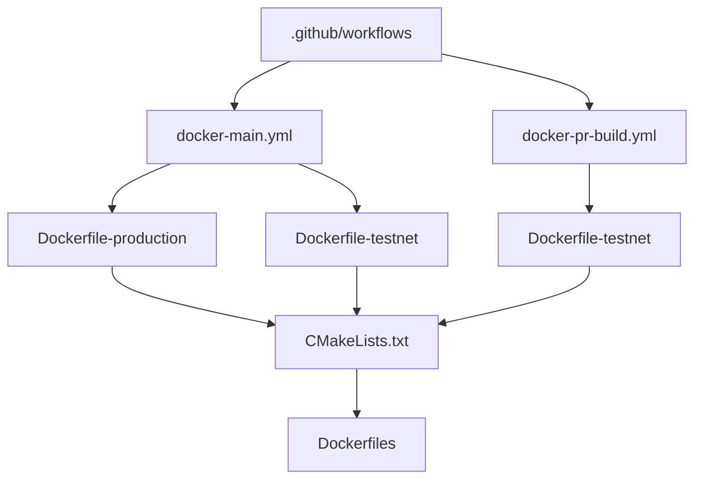
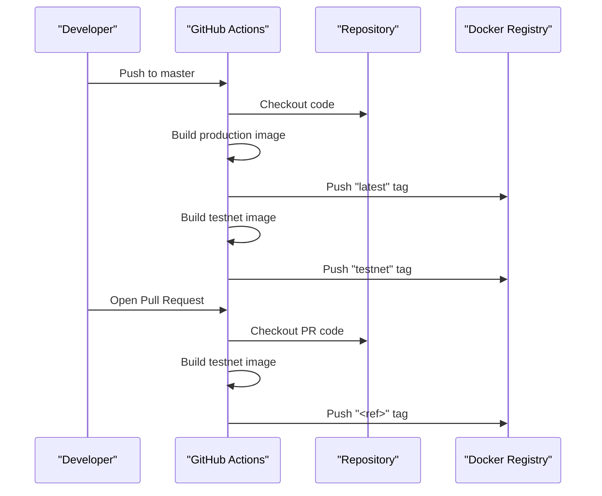
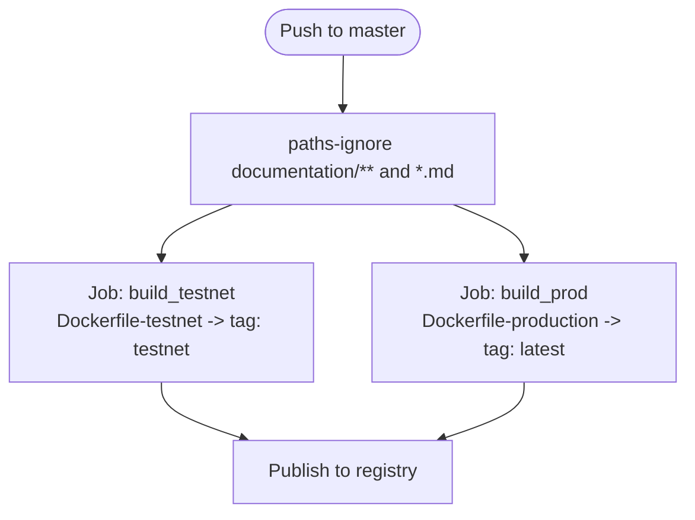
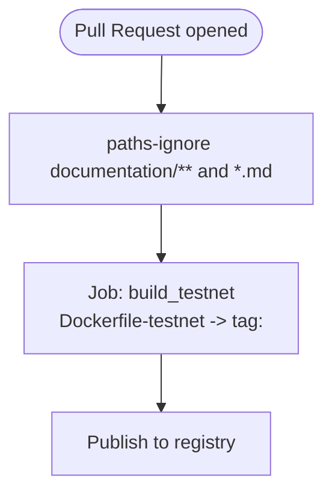
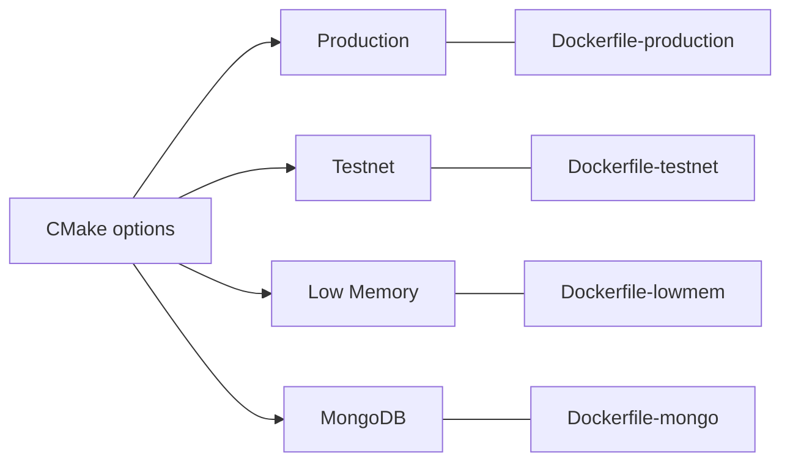
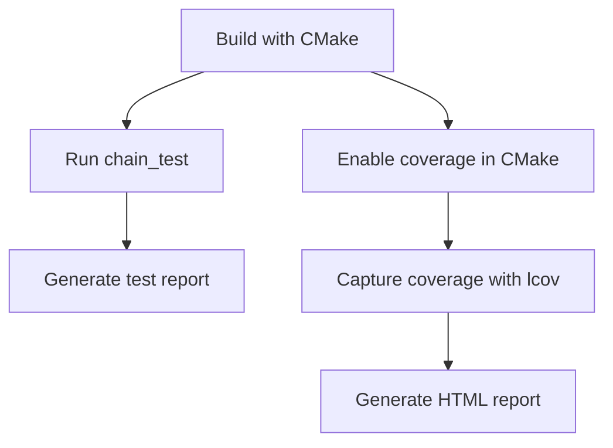
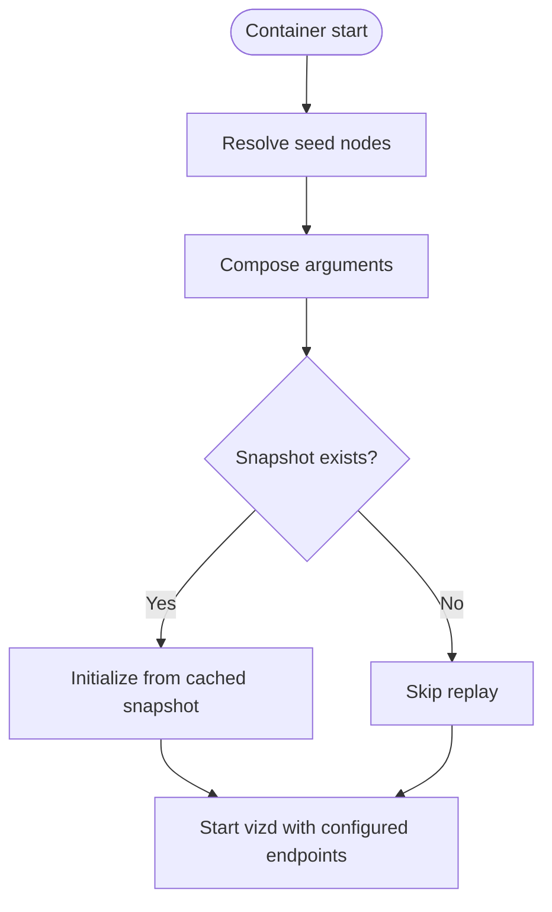
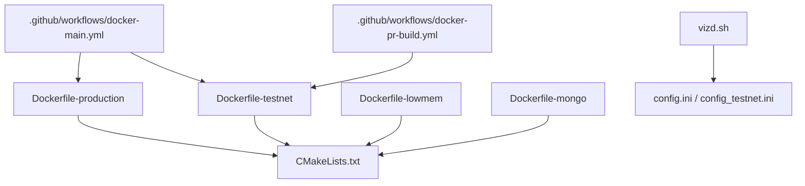

# GitHub Actions CI/CD Pipeline

<cite>
**Referenced Files in This Document**
- [docker-main.yml](file://.github/workflows/docker-main.yml)
- [docker-pr-build.yml](file://.github/workflows/docker-pr-build.yml)
- [Dockerfile-production](file://share/vizd/docker/Dockerfile-production)
- [Dockerfile-lowmem](file://share/vizd/docker/Dockerfile-lowmem)
- [Dockerfile-testnet](file://share/vizd/docker/Dockerfile-testnet)
- [Dockerfile-mongo](file://share/vizd/docker/Dockerfile-mongo)
- [CMakeLists.txt](file://CMakeLists.txt)
- [vizd.sh](file://share/vizd/vizd.sh)
- [config.ini](file://share/vizd/config/config.ini)
- [config_testnet.ini](file://share/vizd/config/config_testnet.ini)
- [testing.md](file://documentation/testing.md)
</cite>

## Table of Contents
1. [Introduction](#introduction)
2. [Project Structure](#project-structure)
3. [Core Components](#core-components)
4. [Architecture Overview](#architecture-overview)
5. [Detailed Component Analysis](#detailed-component-analysis)
6. [Dependency Analysis](#dependency-analysis)
7. [Performance Considerations](#performance-considerations)
8. [Troubleshooting Guide](#troubleshooting-guide)
9. [Conclusion](#conclusion)
10. [Appendices](#appendices)

## Introduction
This document explains the GitHub Actions CI/CD pipeline that automates Docker image builds and testing for the VIZ C++ Node. It covers workflow triggers for main branch pushes and pull requests, Docker build matrix variants, automated testing and code quality checks, artifact management, Docker image publishing, and deployment automation. It also provides practical examples for modifying workflow configurations, adding new build stages, and troubleshooting pipeline failures, with best practices tailored for blockchain development.

## Project Structure
The CI/CD pipeline is defined by two GitHub Actions workflow files:
- A main branch build workflow that produces production and testnet images.
- A pull request build workflow that builds a testnet image and optionally tags it with the ref for traceability.

Docker images are built from multi-stage Dockerfiles located under share/vizd/docker. The build leverages CMake options to toggle features such as testnet mode, low-memory mode, and MongoDB plugin support.

**Diagram sources**
- [.github/workflows/docker-main.yml](file://.github/workflows/docker-main.yml#L1-L41)
- [.github/workflows/docker-pr-build.yml](file://.github/workflows/docker-pr-build.yml#L1-L24)
- [share/vizd/docker/Dockerfile-production](file://share/vizd/docker/Dockerfile-production#L1-L88)
- [share/vizd/docker/Dockerfile-testnet](file://share/vizd/docker/Dockerfile-testnet#L1-L88)
- [CMakeLists.txt](file://CMakeLists.txt#L46-L89)

**Section sources**
- [.github/workflows/docker-main.yml](file://.github/workflows/docker-main.yml#L1-L41)
- [.github/workflows/docker-pr-build.yml](file://.github/workflows/docker-pr-build.yml#L1-L24)

## Core Components
- Workflow triggers:
  - Main branch push: Builds and publishes production and testnet images.
  - Pull request: Builds a testnet image and tags it with the ref for traceability.
- Docker build matrix:
  - Production image: Built from Dockerfile-production.
  - Testnet image: Built from Dockerfile-testnet.
  - Low-memory variant: Dockerfile-lowmem enables LOW_MEMORY_NODE.
  - MongoDB-enabled variant: Dockerfile-mongo enables ENABLE_MONGO_PLUGIN.
- Artifact management and publishing:
  - Images are pushed to a Docker registry using credentials from GitHub secrets.
  - Tagging strategy differs between main and PR workflows.
- Testing and code quality:
  - Unit tests can be executed via a documented target.
  - Code coverage can be enabled via CMake flags and lcov.
- Runtime configuration:
  - Container entrypoint script configures endpoints, seeds, and optional replay from cache.
  - Multiple config templates are provided for mainnet and testnet.

**Section sources**
- [.github/workflows/docker-main.yml](file://.github/workflows/docker-main.yml#L3-L41)
- [.github/workflows/docker-pr-build.yml](file://.github/workflows/docker-pr-build.yml#L3-L24)
- [share/vizd/docker/Dockerfile-production](file://share/vizd/docker/Dockerfile-production#L46-L54)
- [share/vizd/docker/Dockerfile-testnet](file://share/vizd/docker/Dockerfile-testnet#L46-L55)
- [share/vizd/docker/Dockerfile-lowmem](file://share/vizd/docker/Dockerfile-lowmem#L46-L53)
- [share/vizd/docker/Dockerfile-mongo](file://share/vizd/docker/Dockerfile-mongo#L74-L82)
- [CMakeLists.txt](file://CMakeLists.txt#L56-L89)
- [documentation/testing.md](file://documentation/testing.md#L3-L43)
- [share/vizd/vizd.sh](file://share/vizd/vizd.sh#L62-L81)
- [share/vizd/config/config.ini](file://share/vizd/config/config.ini#L1-L130)
- [share/vizd/config/config_testnet.ini](file://share/vizd/config/config_testnet.ini#L1-L132)

## Architecture Overview
The CI/CD pipeline orchestrates Docker builds and publishes images to a registry. The main workflow runs on master pushes and produces two images: production and testnet. The PR workflow runs on pull requests and produces a testnet image tagged with the ref. The Dockerfiles use CMake to configure build-time features and produce minimal runtime images.

**Diagram sources**
- [.github/workflows/docker-main.yml](file://.github/workflows/docker-main.yml#L3-L41)
- [.github/workflows/docker-pr-build.yml](file://.github/workflows/docker-pr-build.yml#L3-L24)

## Detailed Component Analysis

### Main Branch Workflow
- Triggers: Pushes to master branch with documentation and Markdown files excluded from triggering.
- Jobs:
  - Build testnet image using Dockerfile-testnet and tag as testnet.
  - Build production image using Dockerfile-production and tag as latest.
- Secrets: Uses DOCKER_USERNAME and DOCKER_PASSWORD for registry authentication.

**Diagram sources**
- [.github/workflows/docker-main.yml](file://.github/workflows/docker-main.yml#L3-L41)

**Section sources**
- [.github/workflows/docker-main.yml](file://.github/workflows/docker-main.yml#L3-L41)

### Pull Request Workflow
- Triggers: Pull requests with documentation and Markdown files excluded from triggering.
- Job:
  - Build testnet image using Dockerfile-testnet and tag with ref for traceability.
- Secrets: Uses DOCKER_USERNAME and DOCKER_PASSWORD for registry authentication.

**Diagram sources**
- [.github/workflows/docker-pr-build.yml](file://.github/workflows/docker-pr-build.yml#L3-L24)

**Section sources**
- [.github/workflows/docker-pr-build.yml](file://.github/workflows/docker-pr-build.yml#L3-L24)

### Docker Build Matrix and Variants
- Production: Built with release flags and standard plugins.
- Testnet: Built with BUILD_TESTNET enabled and testnet-specific config.
- Low-memory: Built with LOW_MEMORY_NODE enabled to reduce resource usage.
- MongoDB: Built with ENABLE_MONGO_PLUGIN enabled and MongoDB driver installation.

**Diagram sources**
- [CMakeLists.txt](file://CMakeLists.txt#L56-L89)
- [share/vizd/docker/Dockerfile-production](file://share/vizd/docker/Dockerfile-production#L46-L54)
- [share/vizd/docker/Dockerfile-testnet](file://share/vizd/docker/Dockerfile-testnet#L46-L55)
- [share/vizd/docker/Dockerfile-lowmem](file://share/vizd/docker/Dockerfile-lowmem#L46-L53)
- [share/vizd/docker/Dockerfile-mongo](file://share/vizd/docker/Dockerfile-mongo#L74-L82)

**Section sources**
- [CMakeLists.txt](file://CMakeLists.txt#L56-L89)
- [share/vizd/docker/Dockerfile-production](file://share/vizd/docker/Dockerfile-production#L46-L54)
- [share/vizd/docker/Dockerfile-testnet](file://share/vizd/docker/Dockerfile-testnet#L46-L55)
- [share/vizd/docker/Dockerfile-lowmem](file://share/vizd/docker/Dockerfile-lowmem#L46-L53)
- [share/vizd/docker/Dockerfile-mongo](file://share/vizd/docker/Dockerfile-mongo#L74-L82)

### Automated Testing and Code Quality
- Unit tests:
  - Target: chain_test.
  - Execution: ./tests/chain_test.
  - Configuration options include log level, report level, and selective test execution.
- Code coverage:
  - Enable via CMake flag.
  - Capture baseline and test coverage with lcov and generate HTML reports.

**Diagram sources**
- [documentation/testing.md](file://documentation/testing.md#L3-L43)

**Section sources**
- [documentation/testing.md](file://documentation/testing.md#L3-L43)

### Runtime Configuration and Entrypoint
- Entrypoint script configures RPC and P2P endpoints, seed nodes, optional replay from cached snapshot, and passes extra options.
- Config templates:
  - Mainnet: config.ini.
  - Testnet: config_testnet.ini.

**Diagram sources**
- [share/vizd/vizd.sh](file://share/vizd/vizd.sh#L13-L81)
- [share/vizd/config/config.ini](file://share/vizd/config/config.ini#L1-L130)
- [share/vizd/config/config_testnet.ini](file://share/vizd/config/config_testnet.ini#L1-L132)

**Section sources**
- [share/vizd/vizd.sh](file://share/vizd/vizd.sh#L13-L81)
- [share/vizd/config/config.ini](file://share/vizd/config/config.ini#L1-L130)
- [share/vizd/config/config_testnet.ini](file://share/vizd/config/config_testnet.ini#L1-L132)

## Dependency Analysis
- Workflow-to-Dockerfile dependencies:
  - docker-main.yml depends on Dockerfile-production and Dockerfile-testnet.
  - docker-pr-build.yml depends on Dockerfile-testnet.
- Build-time configuration:
  - Dockerfiles depend on CMake options to enable/disable features and select variants.
- Runtime configuration:
  - Entrypoint script depends on config templates and snapshot availability.

**Diagram sources**
- [.github/workflows/docker-main.yml](file://.github/workflows/docker-main.yml#L1-L41)
- [.github/workflows/docker-pr-build.yml](file://.github/workflows/docker-pr-build.yml#L1-L24)
- [share/vizd/docker/Dockerfile-production](file://share/vizd/docker/Dockerfile-production#L1-L88)
- [share/vizd/docker/Dockerfile-testnet](file://share/vizd/docker/Dockerfile-testnet#L1-L88)
- [share/vizd/docker/Dockerfile-lowmem](file://share/vizd/docker/Dockerfile-lowmem#L1-L82)
- [share/vizd/docker/Dockerfile-mongo](file://share/vizd/docker/Dockerfile-mongo#L1-L111)
- [CMakeLists.txt](file://CMakeLists.txt#L46-L89)
- [share/vizd/vizd.sh](file://share/vizd/vizd.sh#L1-L82)
- [share/vizd/config/config.ini](file://share/vizd/config/config.ini#L1-L130)
- [share/vizd/config/config_testnet.ini](file://share/vizd/config/config_testnet.ini#L1-L132)

**Section sources**
- [.github/workflows/docker-main.yml](file://.github/workflows/docker-main.yml#L1-L41)
- [.github/workflows/docker-pr-build.yml](file://.github/workflows/docker-pr-build.yml#L1-L24)
- [CMakeLists.txt](file://CMakeLists.txt#L46-L89)

## Performance Considerations
- Build performance:
  - Use ccache via CMake to speed up rebuilds.
  - Multi-stage builds minimize runtime image size and improve cold start.
- Resource usage:
  - Low-memory variant reduces memory footprint for constrained environments.
- Network and storage:
  - Entrypoint supports replay from cached snapshot to accelerate initial sync.
- Parallelism:
  - Use matrix strategies to run multiple variants concurrently when extending the pipeline.

[No sources needed since this section provides general guidance]

## Troubleshooting Guide
- Authentication failures:
  - Verify DOCKER_USERNAME and DOCKER_PASSWORD secrets are set in repository settings.
- Build failures due to missing dependencies:
  - Ensure Dockerfiles install required packages and CMake options match intended variant.
- Test failures:
  - Confirm chain_test target is available and test runner options are correctly passed.
- Coverage reporting:
  - Ensure lcov is installed and CMake coverage flag is enabled during build.
- Image tagging:
  - For PR builds, confirm tag_with_ref is enabled to attach the ref to the image tag.

**Section sources**
- [.github/workflows/docker-main.yml](file://.github/workflows/docker-main.yml#L19-L25)
- [.github/workflows/docker-pr-build.yml](file://.github/workflows/docker-pr-build.yml#L17-L23)
- [documentation/testing.md](file://documentation/testing.md#L3-L43)

## Conclusion
The CI/CD pipeline automates robust Docker image builds for VIZ C++ Node across multiple variants, integrates testing and code coverage, and publishes images to a registry. By leveraging CMake options and multi-stage Dockerfiles, the pipeline supports production, testnet, low-memory, and MongoDB-enabled deployments. Extending the pipeline involves adding jobs, Dockerfiles, and CMake toggles while maintaining consistent tagging and secret management.

[No sources needed since this section summarizes without analyzing specific files]

## Appendices

### Practical Examples

- Modify workflow configurations:
  - Add a new job to build a variant image by referencing a Dockerfile and setting appropriate tags.
  - Adjust paths-ignore to include/exclude specific directories from triggering builds.
  - Reference: [docker-main.yml](file://.github/workflows/docker-main.yml#L11-L41), [docker-pr-build.yml](file://.github/workflows/docker-pr-build.yml#L9-L24)

- Add a new build stage:
  - Extend an existing Dockerfile or create a new Dockerfile variant.
  - Introduce a corresponding CMake option and update the workflow to consume it.
  - Reference: [Dockerfile-production](file://share/vizd/docker/Dockerfile-production#L46-L54), [Dockerfile-lowmem](file://share/vizd/docker/Dockerfile-lowmem#L46-L53), [CMakeLists.txt](file://CMakeLists.txt#L56-L89)

- Troubleshoot pipeline failures:
  - Check logs for authentication errors and verify secrets.
  - Validate Docker build steps and ensure dependencies are installed.
  - Confirm test targets and coverage tools are available and configured.
  - Reference: [docker-main.yml](file://.github/workflows/docker-main.yml#L19-L25), [docker-pr-build.yml](file://.github/workflows/docker-pr-build.yml#L17-L23), [testing.md](file://documentation/testing.md#L3-L43)

### Best Practices for Blockchain CI/CD
- Reproducible builds:
  - Pin Docker base images and toolchain versions; rely on CMake to enforce consistent flags.
- Security:
  - Store registry credentials as encrypted secrets; limit permissions; scan images post-build.
- Performance:
  - Use caching (ccache, Docker layers); parallelize independent jobs; prune unused artifacts.
- Reliability:
  - Validate images with smoke tests; publish multiple tags for traceability; document rollback procedures.

[No sources needed since this section provides general guidance]