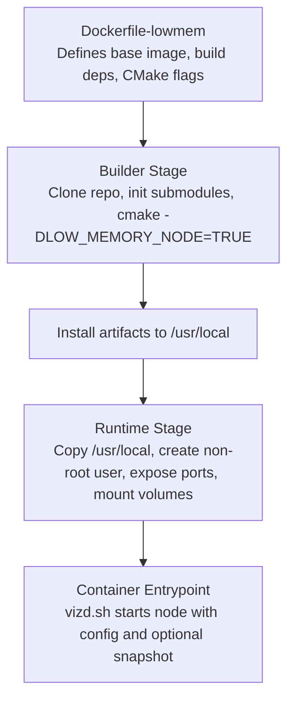
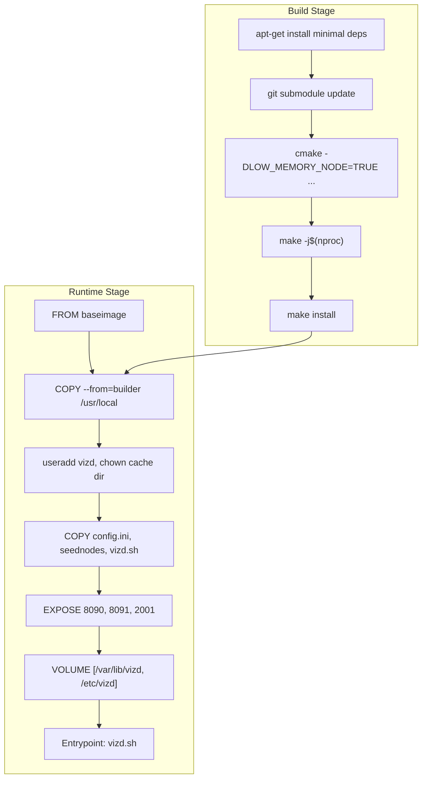
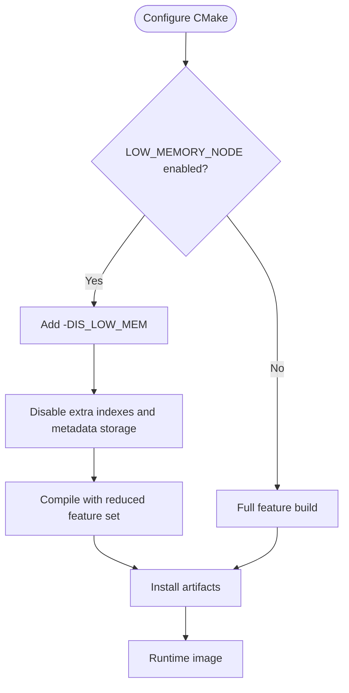
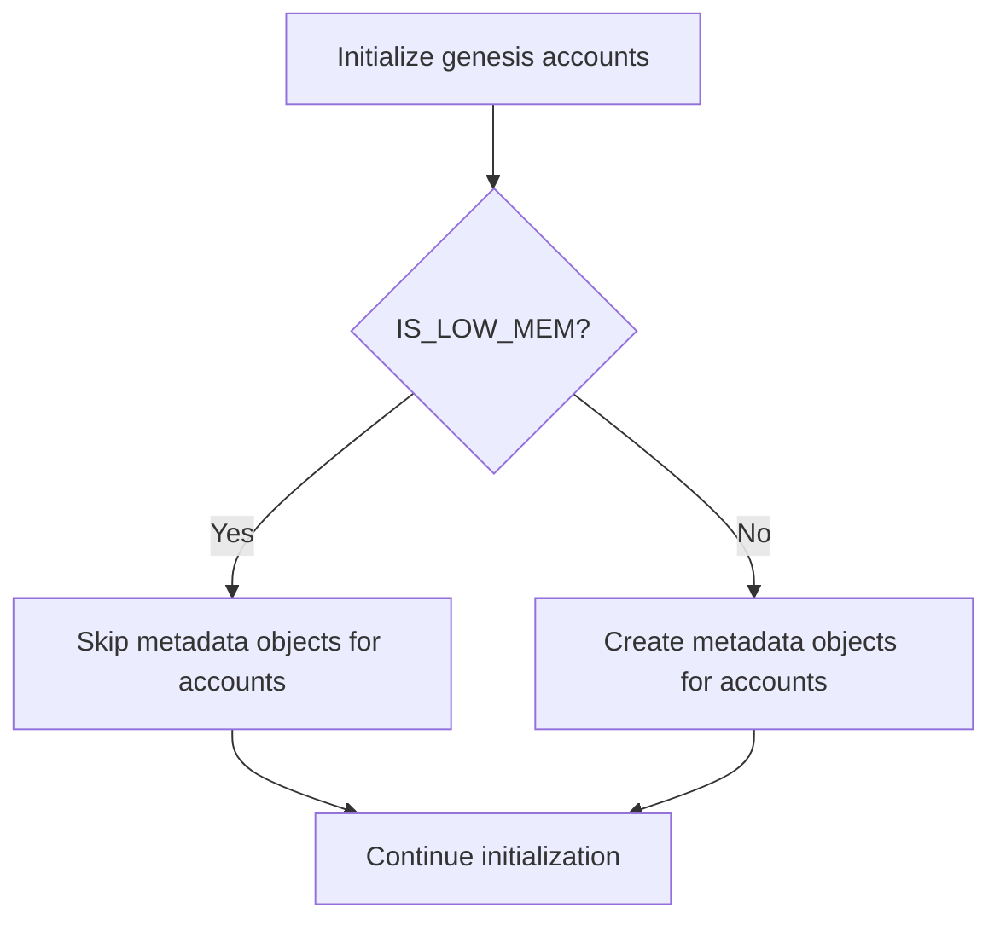
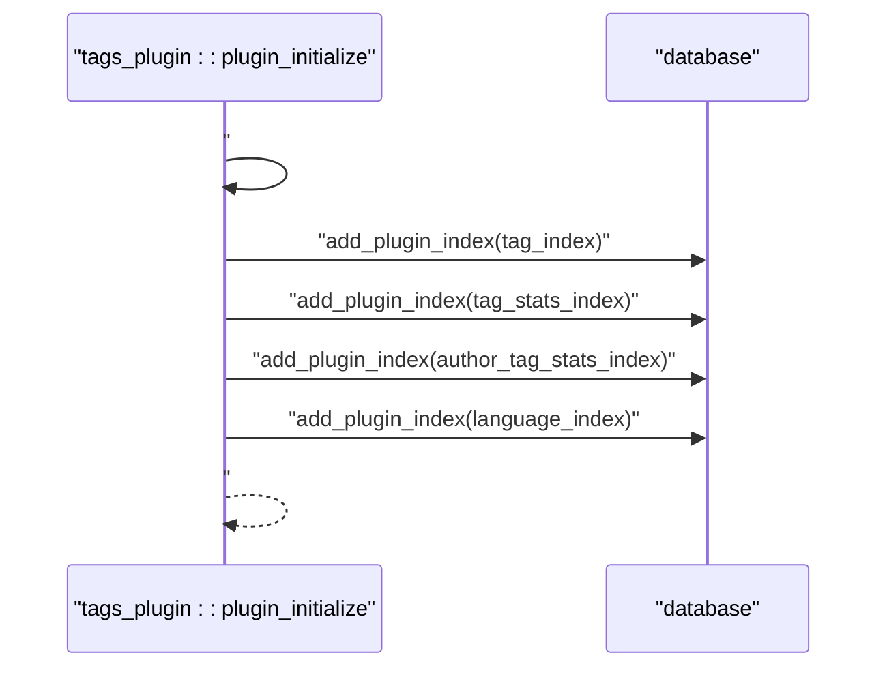
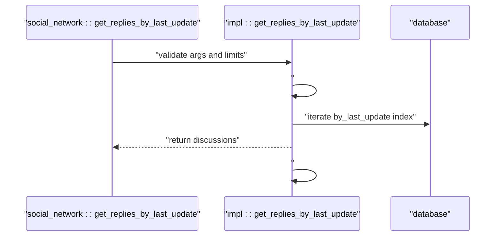
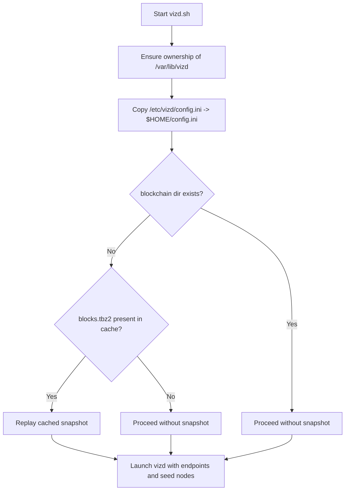
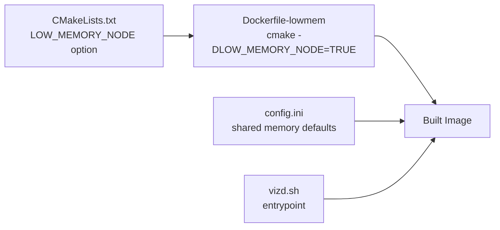

# Low-Memory Dockerfile

<cite>
**Referenced Files in This Document**
- [Dockerfile-lowmem](file://share/vizd/docker/Dockerfile-lowmem)
- [Dockerfile-production](file://share/vizd/docker/Dockerfile-production)
- [Dockerfile-mongo](file://share/vizd/docker/Dockerfile-mongo)
- [Dockerfile-testnet](file://share/vizd/docker/Dockerfile-testnet)
- [CMakeLists.txt](file://CMakeLists.txt)
- [config.ini](file://share/vizd/config/config.ini)
- [config_testnet.ini](file://share/vizd/config/config_testnet.ini)
- [vizd.sh](file://share/vizd/vizd.sh)
- [database.cpp](file://libraries/chain/database.cpp)
- [account_api_object.cpp](file://libraries/api/account_api_object.cpp)
- [plugin.cpp](file://plugins/tags/plugin.cpp)
- [social_network.cpp](file://plugins/social_network/social_network.cpp)
</cite>

## Table of Contents
1. [Introduction](#introduction)
2. [Project Structure](#project-structure)
3. [Core Components](#core-components)
4. [Architecture Overview](#architecture-overview)
5. [Detailed Component Analysis](#detailed-component-analysis)
6. [Dependency Analysis](#dependency-analysis)
7. [Performance Considerations](#performance-considerations)
8. [Troubleshooting Guide](#troubleshooting-guide)
9. [Conclusion](#conclusion)
10. [Appendices](#appendices)

## Introduction
This document explains the low-memory Dockerfile optimized for resource-constrained environments. It details the LOW_MEMORY_NODE build option, its impact on memory usage, reduced functionality, and performance trade-offs. It also documents minimal dependency requirements, the optimized build process, and the reduced feature set compared to production builds. Practical examples for building low-memory containers, resource monitoring, and performance optimization techniques are provided, along with limitations, supported operations, and migration paths to full-featured builds.

## Project Structure
The low-memory container is built from a dedicated Dockerfile that mirrors the production build process but enables the LOW_MEMORY_NODE CMake option. The Dockerfile sets up a minimal build environment, clones the repository, initializes submodules, configures CMake with low-memory flags, compiles, installs, and packages a runtime image with a non-root user and essential volumes.

**Diagram sources**
- [Dockerfile-lowmem](file://share/vizd/docker/Dockerfile-lowmem#L1-L82)

**Section sources**
- [Dockerfile-lowmem](file://share/vizd/docker/Dockerfile-lowmem#L1-L82)

## Core Components
- Low-memory Dockerfile: Builds with LOW_MEMORY_NODE enabled, disabling extra indexes and metadata storage to reduce memory footprint.
- CMake configuration: Adds -DIS_LOW_MEM and toggles related compile-time flags.
- Runtime configuration: Minimal RPC endpoints, reduced thread pools, and conservative shared memory sizing.
- Entrypoint script: Initializes data directory, optionally replays a cached snapshot, and launches the node with configurable endpoints.

Key differences from production:
- LOW_MEMORY_NODE=TRUE vs FALSE
- Reduced plugin surface and indexes
- Smaller shared memory defaults and cautious growth thresholds

**Section sources**
- [Dockerfile-lowmem](file://share/vizd/docker/Dockerfile-lowmem#L45-L53)
- [CMakeLists.txt](file://CMakeLists.txt#L66-L74)
- [config.ini](file://share/vizd/config/config.ini#L49-L67)
- [vizd.sh](file://share/vizd/vizd.sh#L44-L53)

## Architecture Overview
The low-memory container architecture separates build-time and runtime concerns:
- Build stage: Installs minimal toolchain and dependencies, configures CMake with LOW_MEMORY_NODE, compiles, and installs binaries.
- Runtime stage: Copies installed binaries, creates a non-root user, exposes RPC and P2P ports, mounts persistent volumes for blockchain data and config, and runs via an init service wrapper.

**Diagram sources**
- [Dockerfile-lowmem](file://share/vizd/docker/Dockerfile-lowmem#L7-L59)
- [Dockerfile-production](file://share/vizd/docker/Dockerfile-production#L40-L59)
- [vizd.sh](file://share/vizd/vizd.sh#L1-L82)

## Detailed Component Analysis

### Low-Memory Build Option Impact
The LOW_MEMORY_NODE option adds -DIS_LOW_MEM and disables certain indexes and metadata storage to reduce memory usage. Conditional compilation blocks appear across chain logic and plugins.

**Diagram sources**
- [CMakeLists.txt](file://CMakeLists.txt#L66-L74)

**Section sources**
- [CMakeLists.txt](file://CMakeLists.txt#L66-L74)
- [database.cpp](file://libraries/chain/database.cpp#L2221-L2225)
- [database.cpp](file://libraries/chain/database.cpp#L2269-L2278)
- [database.cpp](file://libraries/chain/database.cpp#L3063-L3067)
- [database.cpp](file://libraries/chain/database.cpp#L3078-L3082)
- [database.cpp](file://libraries/chain/database.cpp#L3098-L3103)
- [database.cpp](file://libraries/chain/database.cpp#L3120-L3124)
- [database.cpp](file://libraries/chain/database.cpp#L3144-L3148)
- [database.cpp](file://libraries/chain/database.cpp#L3170-L3174)
- [account_api_object.cpp](file://libraries/api/account_api_object.cpp#L40-L43)
- [plugin.cpp](file://plugins/tags/plugin.cpp#L42-L52)
- [plugin.cpp](file://plugins/tags/plugin.cpp#L211-L220)
- [social_network.cpp](file://plugins/social_network/social_network.cpp#L372-L392)

### Memory-Efficient Chain Initialization
Genesis initialization and account creation are guarded by low-memory conditionals to skip metadata objects when memory is constrained.

**Diagram sources**
- [database.cpp](file://libraries/chain/database.cpp#L3063-L3067)
- [database.cpp](file://libraries/chain/database.cpp#L3078-L3082)
- [database.cpp](file://libraries/chain/database.cpp#L3098-L3103)
- [database.cpp](file://libraries/chain/database.cpp#L3120-L3124)
- [database.cpp](file://libraries/chain/database.cpp#L3144-L3148)
- [database.cpp](file://libraries/chain/database.cpp#L3170-L3174)

**Section sources**
- [database.cpp](file://libraries/chain/database.cpp#L3060-L3182)

### Tags Plugin Index Management
The tags plugin conditionally registers indexes and hooks to reduce memory overhead under low-memory mode.

**Diagram sources**
- [plugin.cpp](file://plugins/tags/plugin.cpp#L211-L220)

**Section sources**
- [plugin.cpp](file://plugins/tags/plugin.cpp#L42-L52)
- [plugin.cpp](file://plugins/tags/plugin.cpp#L211-L220)

### Social Network Discussions Retrieval
Discussion retrieval APIs are guarded by low-memory conditionals to avoid heavy indexing operations.

**Diagram sources**
- [social_network.cpp](file://plugins/social_network/social_network.cpp#L372-L392)

**Section sources**
- [social_network.cpp](file://plugins/social_network/social_network.cpp#L370-L394)

### Runtime Entrypoint and Snapshot Replay
The entrypoint script prepares the data directory, optionally replays a cached snapshot, and launches the node with configurable endpoints.

**Diagram sources**
- [vizd.sh](file://share/vizd/vizd.sh#L44-L81)

**Section sources**
- [vizd.sh](file://share/vizd/vizd.sh#L1-L82)

## Dependency Analysis
The low-memory Dockerfile depends on:
- Base image for build and runtime stages
- Minimal toolchain and libraries for compilation
- CMake configuration toggling LOW_MEMORY_NODE and related flags
- Runtime configuration files and entrypoint script

**Diagram sources**
- [CMakeLists.txt](file://CMakeLists.txt#L66-L74)
- [Dockerfile-lowmem](file://share/vizd/docker/Dockerfile-lowmem#L45-L53)
- [config.ini](file://share/vizd/config/config.ini#L49-L67)
- [vizd.sh](file://share/vizd/vizd.sh#L1-L82)

**Section sources**
- [Dockerfile-lowmem](file://share/vizd/docker/Dockerfile-lowmem#L1-L82)
- [CMakeLists.txt](file://CMakeLists.txt#L66-L74)
- [config.ini](file://share/vizd/config/config.ini#L49-L67)
- [vizd.sh](file://share/vizd/vizd.sh#L1-L82)

## Performance Considerations
- Shared memory sizing: Defaults are tuned to reduce initial allocation and growth frequency.
- Thread pool sizing: Conservative thread counts for RPC clients.
- Lock contention: Single write thread reduces database lock contention.
- Plugin notifications: Disabled on push transactions to reduce overhead.
- MongoDB plugin: Explicitly disabled in low-memory builds.

Practical tips:
- Monitor shared memory free space and adjust growth increments if needed.
- Keep RPC thread pool size minimal for constrained systems.
- Disable non-essential plugins to further reduce memory usage.
- Use snapshot replay to bootstrap quickly without replaying entire chain.

**Section sources**
- [config.ini](file://share/vizd/config/config.ini#L13-L47)
- [config.ini](file://share/vizd/config/config.ini#L49-L67)
- [Dockerfile-lowmem](file://share/vizd/docker/Dockerfile-lowmem#L50-L50)

## Troubleshooting Guide
Common issues and remedies:
- Out-of-memory during startup: Reduce shared memory growth increments or disable non-essential plugins.
- Slow RPC response: Lower thread pool size or disable plugin notifications on push.
- Missing metadata in API responses: Expected in low-memory mode; metadata is intentionally omitted.
- Snapshot replay failures: Verify cached snapshot presence and permissions.

Operational checks:
- Confirm LOW_MEMORY_NODE is enabled in the build.
- Validate runtime configuration overrides via environment variables.
- Inspect logs written to configured appenders.

**Section sources**
- [config.ini](file://share/vizd/config/config.ini#L112-L130)
- [vizd.sh](file://share/vizd/vizd.sh#L62-L81)

## Conclusion
The low-memory Dockerfile provides a compact, resource-efficient node suitable for constrained environments. By enabling LOW_MEMORY_NODE, the build reduces indexes and metadata storage, lowers shared memory defaults, and simplifies operational overhead. While some features are intentionally disabled, it remains capable of serving basic RPC needs and can be migrated to full-featured builds when resources permit.

## Appendices

### Building Low-Memory Containers
- Build command: Use the low-memory Dockerfile to produce a minimal image.
- Environment overrides: Configure endpoints and seed nodes via environment variables injected by the entrypoint script.
- Persistent volumes: Mount data and config directories to preserve state across restarts.

**Section sources**
- [Dockerfile-lowmem](file://share/vizd/docker/Dockerfile-lowmem#L60-L82)
- [vizd.sh](file://share/vizd/vizd.sh#L13-L39)
- [vizd.sh](file://share/vizd/vizd.sh#L62-L81)

### Supported Operations Under Low-Memory Mode
- Basic RPC endpoints remain available.
- Genesis initialization proceeds without metadata objects.
- Some plugin indexes and operations are disabled to conserve memory.

**Section sources**
- [database.cpp](file://libraries/chain/database.cpp#L3063-L3067)
- [database.cpp](file://libraries/chain/database.cpp#L3078-L3082)
- [plugin.cpp](file://plugins/tags/plugin.cpp#L211-L220)
- [social_network.cpp](file://plugins/social_network/social_network.cpp#L372-L392)

### Migration Paths to Full-Featured Builds
- Switch to the production Dockerfile to enable full feature set.
- Re-enable MongoDB plugin if persistence to MongoDB is required.
- Increase shared memory defaults and thread pool sizes for higher throughput.

**Section sources**
- [Dockerfile-production](file://share/vizd/docker/Dockerfile-production#L46-L52)
- [Dockerfile-mongo](file://share/vizd/docker/Dockerfile-mongo#L74-L82)
- [config.ini](file://share/vizd/config/config.ini#L49-L67)