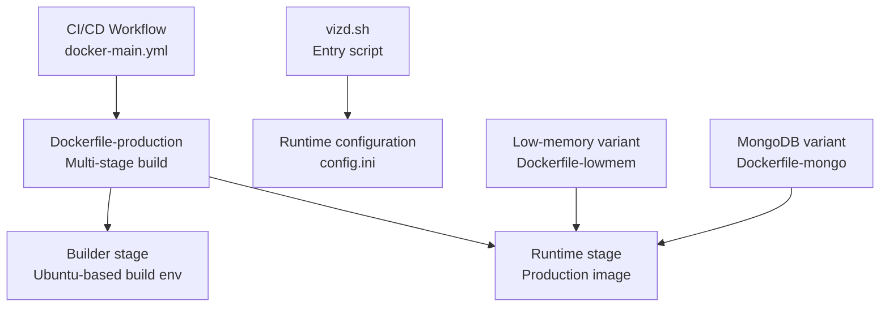
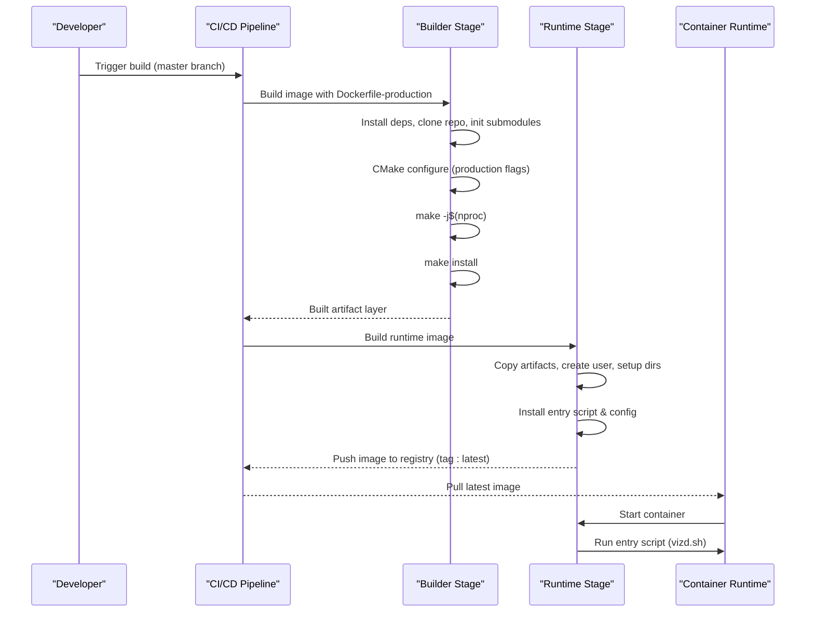
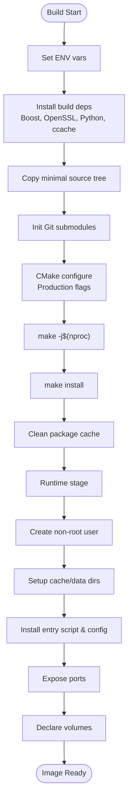
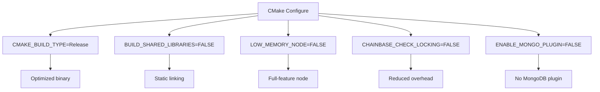
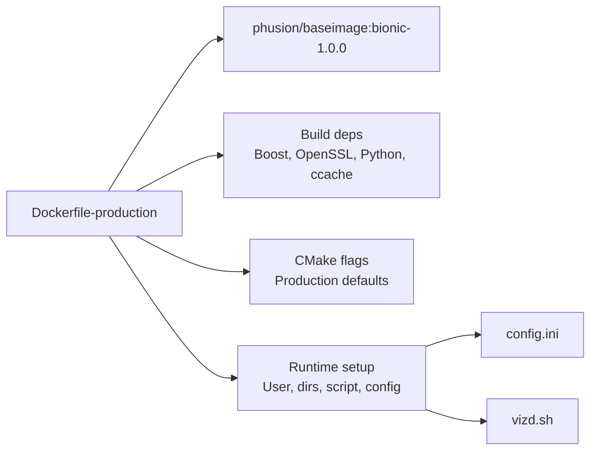

# Production Dockerfile

<cite>
**Referenced Files in This Document**
- [Dockerfile-production](file://share/vizd/docker/Dockerfile-production)
- [Dockerfile-lowmem](file://share/vizd/docker/Dockerfile-lowmem)
- [Dockerfile-mongo](file://share/vizd/docker/Dockerfile-mongo)
- [Dockerfile-testnet](file://share/vizd/docker/Dockerfile-testnet)
- [vizd.sh](file://share/vizd/vizd.sh)
- [config.ini](file://share/vizd/config/config.ini)
- [config_mongo.ini](file://share/vizd/config/config_mongo.ini)
- [README.md](file://README.md)
- [building.md](file://documentation/building.md)
- [docker-main.yml](file://.github/workflows/docker-main.yml)
</cite>

## Table of Contents
1. [Introduction](#introduction)
2. [Project Structure](#project-structure)
3. [Core Components](#core-components)
4. [Architecture Overview](#architecture-overview)
5. [Detailed Component Analysis](#detailed-component-analysis)
6. [Dependency Analysis](#dependency-analysis)
7. [Performance Considerations](#performance-considerations)
8. [Troubleshooting Guide](#troubleshooting-guide)
9. [Conclusion](#conclusion)
10. [Appendices](#appendices)

## Introduction
This document explains the production Dockerfile configuration used to deploy the VIZ C++ node. It covers the multi-stage build process, base image selection, build environment setup, CMake configuration options, dependency installation, build optimization techniques, runtime image construction, user and volumes, and exposed ports. Practical examples for building and running the production container are included, along with guidance for persistent data and network configuration.

## Project Structure
The production Dockerfile resides under the share/vizd/docker directory and is complemented by runtime scripts and configuration files. The CI/CD pipeline automates building and publishing the production image.

**Diagram sources**
- [Dockerfile-production](file://share/vizd/docker/Dockerfile-production#L1-L88)
- [vizd.sh](file://share/vizd/vizd.sh#L1-L82)
- [config.ini](file://share/vizd/config/config.ini#L1-L130)
- [docker-main.yml](file://.github/workflows/docker-main.yml#L1-L41)

**Section sources**
- [Dockerfile-production](file://share/vizd/docker/Dockerfile-production#L1-L88)
- [docker-main.yml](file://.github/workflows/docker-main.yml#L1-L41)

## Core Components
- Multi-stage build: Separates build dependencies from the runtime image for smaller footprint and improved security.
- Base image: Uses phusion/baseimage:bionic-1.0.0 for both stages, ensuring a consistent, minimal Linux environment.
- Build environment: Installs essential build tools, Boost, OpenSSL, Python, and ccache.
- CMake configuration: Sets production defaults for shared libraries, memory profile, locking checks, and plugin enablement.
- Runtime setup: Creates a dedicated user, prepares cache and data directories, installs entry script and configuration, exposes ports, and defines volumes.
- CI/CD automation: Builds and pushes the production image tagged as latest.

**Section sources**
- [Dockerfile-production](file://share/vizd/docker/Dockerfile-production#L1-L88)
- [building.md](file://documentation/building.md#L3-L16)
- [docker-main.yml](file://.github/workflows/docker-main.yml#L27-L41)

## Architecture Overview
The production Dockerfile implements a two-stage build:
- Builder stage: Installs build dependencies, clones the repository, initializes submodules, configures CMake with production flags, compiles with parallel jobs, and installs artifacts.
- Runtime stage: Copies installed artifacts from the builder, creates a non-root user, sets up directories, installs the entry script and configuration, exposes ports, and declares volumes.

**Diagram sources**
- [Dockerfile-production](file://share/vizd/docker/Dockerfile-production#L1-L88)
- [docker-main.yml](file://.github/workflows/docker-main.yml#L27-L41)
- [vizd.sh](file://share/vizd/vizd.sh#L1-L82)

## Detailed Component Analysis

### Multi-Stage Build Process
- Builder stage:
  - Sets environment variables for locale, application directory, and home.
  - Installs build tools, Boost, OpenSSL, Python, ccache, and auxiliary utilities.
  - Copies only necessary source files to minimize rebuild triggers.
  - Initializes Git submodules and configures CMake with production flags.
  - Compiles with parallel jobs and installs artifacts.
  - Cleans package cache to reduce image size.
- Runtime stage:
  - Copies installed artifacts from the builder.
  - Creates a non-root user and prepares cache/data directories.
  - Installs the entry script and copies configuration files.
  - Exposes ports and declares volumes for persistence.

**Diagram sources**
- [Dockerfile-production](file://share/vizd/docker/Dockerfile-production#L1-L88)

**Section sources**
- [Dockerfile-production](file://share/vizd/docker/Dockerfile-production#L1-L88)

### Base Image Selection
- phusion/baseimage:bionic-1.0.0 is used for both stages to ensure a stable, minimal Ubuntu 18.04-based environment with a service supervisor suitable for long-running containers.

**Section sources**
- [Dockerfile-production](file://share/vizd/docker/Dockerfile-production#L1-L88)

### Build Environment Setup
- Essential tools: autoconf, automake, autotools-dev, binutils, bsdmainutils, build-essential, cmake, doxygen, git, libtool, ncurses-dev, pbzip2, pkg-config.
- Libraries: libboost-all-dev, libreadline-dev, libssl-dev.
- Python: python3, python3-dev, python3-pip; gcovr installed via pip.
- ccache enabled for faster incremental builds.

**Section sources**
- [Dockerfile-production](file://share/vizd/docker/Dockerfile-production#L7-L30)

### CMake Configuration Options
The production Dockerfile configures CMake with the following flags:
- CMAKE_BUILD_TYPE=Release
- BUILD_SHARED_LIBRARIES=FALSE
- LOW_MEMORY_NODE=FALSE
- CHAINBASE_CHECK_LOCKING=FALSE
- ENABLE_MONGO_PLUGIN=FALSE

These choices optimize for a production node that:
- Builds optimized binaries.
- Links statically to reduce runtime dependencies.
- Does not enable low-memory mode.
- Disables extra locking checks.
- Disables the MongoDB plugin.

**Diagram sources**
- [Dockerfile-production](file://share/vizd/docker/Dockerfile-production#L46-L52)

**Section sources**
- [Dockerfile-production](file://share/vizd/docker/Dockerfile-production#L46-L52)
- [building.md](file://documentation/building.md#L3-L16)

### Dependency Installation Process
- Boost: Installed via libboost-all-dev to satisfy library requirements.
- OpenSSL: Installed via libssl-dev for cryptographic operations.
- Python: Installed via python3, python3-dev, python3-pip; gcovr installed for coverage reporting.
- Development tools: cmake, git, build-essential, doxygen, autotools, etc.

**Section sources**
- [Dockerfile-production](file://share/vizd/docker/Dockerfile-production#L19-L30)

### Build Optimization Techniques
- ccache: Enabled during build to accelerate incremental builds.
- Parallel compilation: make -j$(nproc) uses all CPU cores for faster builds.
- Static linking: BUILD_SHARED_LIBRARIES=FALSE reduces runtime dependencies.

**Section sources**
- [Dockerfile-production](file://share/vizd/docker/Dockerfile-production#L19-L30)
- [Dockerfile-production](file://share/vizd/docker/Dockerfile-production#L54-L54)

### Runtime Image Construction
- Artifact copy: Copies /usr/local from the builder to the runtime image.
- User creation: Creates a non-root user with a home directory under /var/lib/vizd.
- Cache/data directories: Prepares /var/cache/vizd and sets ownership.
- Entry script: Installs /etc/service/vizd/run to launch the node.
- Configuration: Copies config.ini to /etc/vizd/config.ini and seednodes to /etc/vizd/seednodes.
- Ports: Exposes 8090 (HTTP), 8091 (WebSocket), 2001 (P2P).
- Volumes: Declares persistent volumes for /var/lib/vizd and /etc/vizd.

**Section sources**
- [Dockerfile-production](file://share/vizd/docker/Dockerfile-production#L66-L88)
- [vizd.sh](file://share/vizd/vizd.sh#L1-L82)
- [config.ini](file://share/vizd/config/config.ini#L1-L130)

### Volume Mounting Configuration
- /var/lib/vizd: Contains blockchain data, configuration overrides, and logs.
- /etc/vizd: Contains initial configuration and seednode lists.
- The entry script ensures proper ownership and can initialize from a cached snapshot if present.

**Section sources**
- [Dockerfile-production](file://share/vizd/docker/Dockerfile-production#L87-L87)
- [vizd.sh](file://share/vizd/vizd.sh#L7-L53)

### Exposed Ports
- 8090: HTTP RPC endpoint.
- 8091: WebSocket RPC endpoint.
- 2001: P2P endpoint.

**Section sources**
- [Dockerfile-production](file://share/vizd/docker/Dockerfile-production#L79-L85)
- [config.ini](file://share/vizd/config/config.ini#L16-L20)

### Practical Examples

#### Building the Production Container
- Build locally:
  - docker build -t viz:latest -f share/vizd/docker/Dockerfile-production .
- Build with CI/CD:
  - The workflow builds and pushes the image tagged as latest.

**Section sources**
- [README.md](file://README.md#L40-L52)
- [docker-main.yml](file://.github/workflows/docker-main.yml#L27-L41)

#### Running the Production Container
- Basic run:
  - docker run -d -p 2001:2001 -p 8090:8090 -p 8091:8091 --name vizd vizblockchain/vizd:latest
- Attach logs:
  - docker logs -f vizd
- Override RPC/P2P endpoints:
  - Set VIZD_RPC_ENDPOINT and VIZD_P2P_ENDPOINT environment variables.
- Provide custom seed nodes:
  - Set VIZD_SEED_NODES to a whitespace-delimited list of seed nodes.
- Enable witness mode:
  - Set VIZD_WITNESS_NAME and VIZD_PRIVATE_KEY environment variables.

**Section sources**
- [README.md](file://README.md#L21-L29)
- [vizd.sh](file://share/vizd/vizd.sh#L62-L72)

#### Volume Management for Persistent Blockchain Data
- Mount /var/lib/vizd to persist blockchain data and logs across container restarts.
- Mount /etc/vizd to override configuration and seednodes.
- The entry script initializes from a cached snapshot if present and sets proper ownership.

**Section sources**
- [Dockerfile-production](file://share/vizd/docker/Dockerfile-production#L87-L87)
- [vizd.sh](file://share/vizd/vizd.sh#L44-L53)

#### Network Configuration for Node Connectivity
- Publish host ports 2001 (P2P), 8090 (HTTP), and 8091 (WebSocket) to allow external clients and peers to connect.
- Seed nodes are loaded from /etc/vizd/seednodes by default; override via VIZD_SEED_NODES.
- The entry script allows overriding RPC and P2P endpoints via environment variables.

**Section sources**
- [Dockerfile-production](file://share/vizd/docker/Dockerfile-production#L79-L85)
- [vizd.sh](file://share/vizd/vizd.sh#L11-L29)

## Dependency Analysis
The production Dockerfile depends on:
- phusion/baseimage:bionic-1.0.0 for both stages.
- Build dependencies installed in the builder stage.
- CMake configuration flags controlling node behavior.
- Runtime configuration files and entry script.

**Diagram sources**
- [Dockerfile-production](file://share/vizd/docker/Dockerfile-production#L1-L88)
- [config.ini](file://share/vizd/config/config.ini#L1-L130)
- [vizd.sh](file://share/vizd/vizd.sh#L1-L82)

**Section sources**
- [Dockerfile-production](file://share/vizd/docker/Dockerfile-production#L1-L88)

## Performance Considerations
- Static linking reduces runtime dependencies and improves portability.
- Parallel compilation accelerates builds using all available CPU cores.
- ccache speeds up incremental builds by caching compiled objects.
- Production defaults disable extra locking checks and MongoDB plugin to reduce overhead.

**Section sources**
- [Dockerfile-production](file://share/vizd/docker/Dockerfile-production#L46-L54)
- [building.md](file://documentation/building.md#L3-L16)

## Troubleshooting Guide
- Port conflicts: Ensure host ports 2001, 8090, and 8091 are free when running the container.
- Permission issues: The entry script sets ownership for /var/lib/vizd; ensure mounted volumes have correct permissions.
- Configuration overrides: Place a custom config.ini in /etc/vizd to override defaults.
- Seed nodes: Provide VIZD_SEED_NODES to override the default seednodes list.
- Witness mode: Set VIZD_WITNESS_NAME and VIZD_PRIVATE_KEY to enable witness participation.

**Section sources**
- [vizd.sh](file://share/vizd/vizd.sh#L7-L53)
- [config.ini](file://share/vizd/config/config.ini#L1-L130)

## Conclusion
The production Dockerfile provides a robust, secure, and efficient way to deploy the VIZ C++ node. Its multi-stage build minimizes attack surface and image size, while CMake flags tailor the node for production. The runtime setup ensures non-root execution, persistent storage, and straightforward networking. The CI/CD pipeline automates building and publishing the latest image, and the entry script simplifies customization via environment variables.

## Appendices

### Additional Variants
- Low-memory variant: Enables LOW_MEMORY_NODE=TRUE for resource-constrained environments.
- MongoDB variant: Installs MongoDB drivers and enables ENABLE_MONGO_PLUGIN=TRUE with a dedicated configuration.

**Section sources**
- [Dockerfile-lowmem](file://share/vizd/docker/Dockerfile-lowmem#L47-L50)
- [Dockerfile-mongo](file://share/vizd/docker/Dockerfile-mongo#L78-L79)
- [config_mongo.ini](file://share/vizd/config/config_mongo.ini#L69-L72)