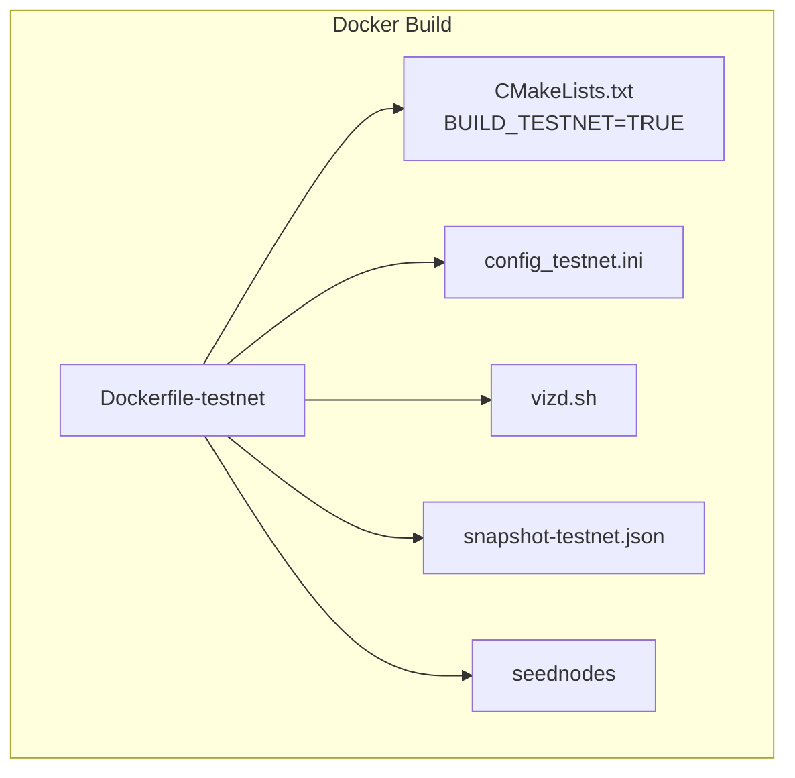
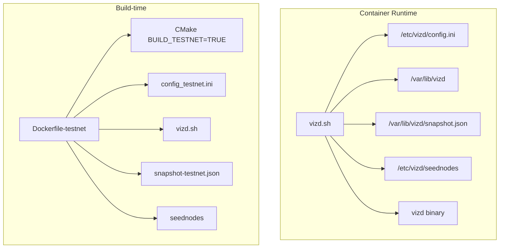
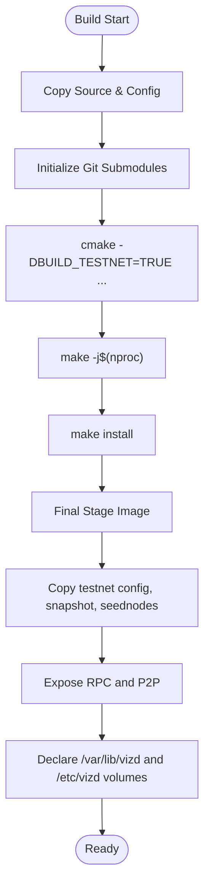
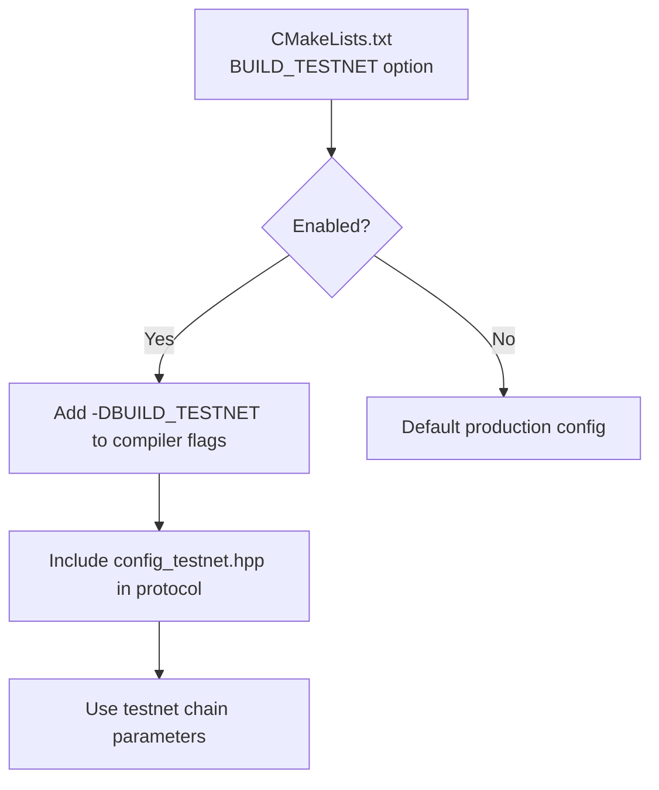
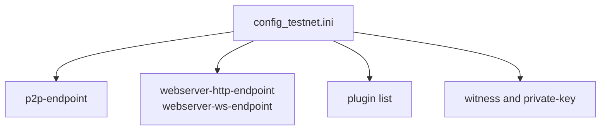
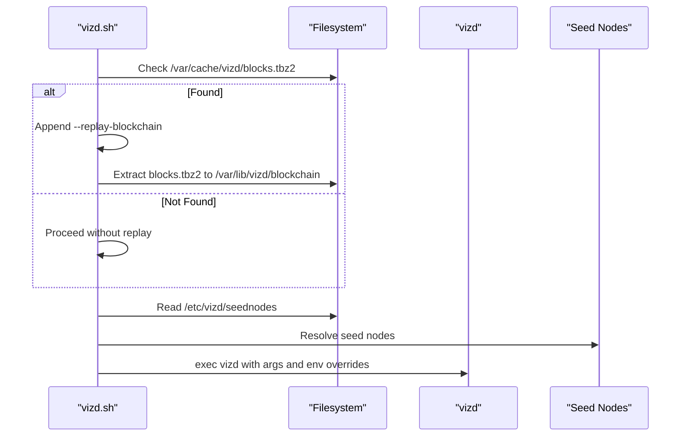
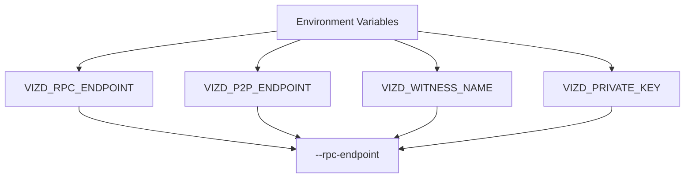
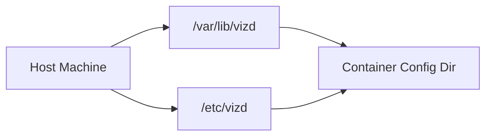
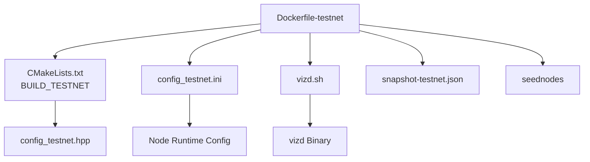

# Testnet Dockerfile

<cite>
**Referenced Files in This Document**
- [Dockerfile-testnet](file://share/vizd/docker/Dockerfile-testnet)
- [Dockerfile-production](file://share/vizd/docker/Dockerfile-production)
- [config_testnet.ini](file://share/vizd/config/config_testnet.ini)
- [config.ini](file://share/vizd/config/config.ini)
- [vizd.sh](file://share/vizd/vizd.sh)
- [seednodes](file://share/vizd/seednodes)
- [snapshot-testnet.json](file://share/vizd/snapshot-testnet.json)
- [CMakeLists.txt](file://CMakeLists.txt)
- [config_testnet.hpp](file://libraries/protocol/include/graphene/protocol/config_testnet.hpp)
- [get_config.cpp](file://libraries/protocol/get_config.cpp)
- [testnet.md](file://documentation/testnet.md)
</cite>

## Table of Contents
1. [Introduction](#introduction)
2. [Project Structure](#project-structure)
3. [Core Components](#core-components)
4. [Architecture Overview](#architecture-overview)
5. [Detailed Component Analysis](#detailed-component-analysis)
6. [Dependency Analysis](#dependency-analysis)
7. [Performance Considerations](#performance-considerations)
8. [Troubleshooting Guide](#troubleshooting-guide)
9. [Conclusion](#conclusion)
10. [Appendices](#appendices)

## Introduction
This document explains the testnet Dockerfile variant designed for deploying VIZ test network nodes. It highlights differences from the production configuration, focusing on testnet-specific CMake options, configuration files, bootstrap behavior, seed node setup, and RPC endpoints. It also covers automated snapshot loading, genesis-like initialization, and practical operational guidance for running and connecting to testnet networks.

## Project Structure
The testnet Dockerfile variant resides under share/vizd/docker and integrates with testnet-specific configuration and scripts:
- Dockerfile-testnet builds the node with BUILD_TESTNET enabled and packages testnet-specific assets.
- config_testnet.ini sets testnet RPC endpoints, P2P ports, logging, and plugin selection.
- vizd.sh orchestrates container startup, seed node resolution, optional replay, and runtime arguments.
- snapshot-testnet.json provides pre-defined test accounts for quick testing.
- seednodes lists known testnet seed nodes for initial connectivity.

**Diagram sources**
- [Dockerfile-testnet](file://share/vizd/docker/Dockerfile-testnet#L1-L88)
- [CMakeLists.txt](file://CMakeLists.txt#L55-L64)
- [config_testnet.ini](file://share/vizd/config/config_testnet.ini#L1-L132)
- [vizd.sh](file://share/vizd/vizd.sh#L1-L82)
- [snapshot-testnet.json](file://share/vizd/snapshot-testnet.json#L1-L35)
- [seednodes](file://share/vizd/seednodes#L1-L6)

**Section sources**
- [Dockerfile-testnet](file://share/vizd/docker/Dockerfile-testnet#L1-L88)
- [config_testnet.ini](file://share/vizd/config/config_testnet.ini#L1-L132)
- [vizd.sh](file://share/vizd/vizd.sh#L1-L82)
- [snapshot-testnet.json](file://share/vizd/snapshot-testnet.json#L1-L35)
- [seednodes](file://share/vizd/seednodes#L1-L6)

## Core Components
- Testnet Dockerfile: Builds with BUILD_TESTNET enabled, installs testnet config, snapshot, and seed nodes, exposes testnet RPC and P2P ports, and declares persistent volumes for data and config.
- Testnet configuration: Defines RPC endpoints, P2P settings, plugin list, and witness production parameters tuned for testnet.
- Startup script: Resolves seed nodes, applies environment overrides, optionally replays from cached blockchain, and launches the node with proper data directory ownership.
- Snapshot: Pre-populates test accounts for immediate testing without manual account creation.
- Seed nodes: Provides initial peers for testnet connectivity.

**Section sources**
- [Dockerfile-testnet](file://share/vizd/docker/Dockerfile-testnet#L46-L55)
- [config_testnet.ini](file://share/vizd/config/config_testnet.ini#L1-L132)
- [vizd.sh](file://share/vizd/vizd.sh#L9-L29)
- [snapshot-testnet.json](file://share/vizd/snapshot-testnet.json#L1-L35)
- [seednodes](file://share/vizd/seednodes#L1-L6)

## Architecture Overview
The testnet container architecture centers on the testnet Dockerfile’s build-time and runtime behavior, testnet configuration, and startup orchestration.

**Diagram sources**
- [Dockerfile-testnet](file://share/vizd/docker/Dockerfile-testnet#L46-L55)
- [config_testnet.ini](file://share/vizd/config/config_testnet.ini#L1-L132)
- [vizd.sh](file://share/vizd/vizd.sh#L1-L82)
- [snapshot-testnet.json](file://share/vizd/snapshot-testnet.json#L1-L35)
- [seednodes](file://share/vizd/seednodes#L1-L6)

## Detailed Component Analysis

### Testnet Dockerfile Differences from Production
- Build option: Enables BUILD_TESTNET during CMake configuration.
- Assets: Copies testnet-specific config, snapshot, and seed nodes.
- Ports: Exposes testnet RPC endpoints (HTTP and WS) and P2P port.
- Volumes: Declares persistent volumes for data and config directories.

**Diagram sources**
- [Dockerfile-testnet](file://share/vizd/docker/Dockerfile-testnet#L32-L65)
- [Dockerfile-testnet](file://share/vizd/docker/Dockerfile-testnet#L75-L87)

**Section sources**
- [Dockerfile-testnet](file://share/vizd/docker/Dockerfile-testnet#L46-L55)
- [Dockerfile-testnet](file://share/vizd/docker/Dockerfile-testnet#L75-L87)
- [Dockerfile-production](file://share/vizd/docker/Dockerfile-production#L46-L54)

### Testnet CMake Configuration and Build Flags
- BUILD_TESTNET: When enabled, adds a preprocessor definition and includes testnet-specific protocol constants and configuration.
- Impact: Selects testnet chain parameters, address prefix, block interval, and other consensus settings.

**Diagram sources**
- [CMakeLists.txt](file://CMakeLists.txt#L55-L64)
- [get_config.cpp](file://libraries/protocol/get_config.cpp#L2-L6)
- [config_testnet.hpp](file://libraries/protocol/include/graphene/protocol/config_testnet.hpp#L1-L170)

**Section sources**
- [CMakeLists.txt](file://CMakeLists.txt#L55-L64)
- [get_config.cpp](file://libraries/protocol/get_config.cpp#L2-L6)
- [config_testnet.hpp](file://libraries/protocol/include/graphene/protocol/config_testnet.hpp#L1-L170)

### Testnet Configuration and RPC Endpoints
- P2P endpoint: Listens on a testnet-specific port.
- RPC endpoints: HTTP and WebSocket endpoints configured for testnet.
- Plugins: Includes chain, p2p, json_rpc, webserver, and other plugins suitable for testnet development and testing.
- Witness production: Enabled with configurable participation thresholds and witness name/key for testnet block production.

**Diagram sources**
- [config_testnet.ini](file://share/vizd/config/config_testnet.ini#L1-L132)

**Section sources**
- [config_testnet.ini](file://share/vizd/config/config_testnet.ini#L1-L132)

### Testnet Bootstrap and Snapshot Loading
- Snapshot availability: The startup script checks for a cached blockchain archive and, if present, replays it to initialize the chain quickly.
- Snapshot content: Testnet snapshot includes predefined accounts with initial balances, enabling immediate testing without manual account creation.
- Seed nodes: The script reads seednodes and passes them to the node as seed peers.

**Diagram sources**
- [vizd.sh](file://share/vizd/vizd.sh#L44-L53)
- [vizd.sh](file://share/vizd/vizd.sh#L17-L29)
- [seednodes](file://share/vizd/seednodes#L1-L6)

**Section sources**
- [vizd.sh](file://share/vizd/vizd.sh#L44-L53)
- [vizd.sh](file://share/vizd/vizd.sh#L17-L29)
- [snapshot-testnet.json](file://share/vizd/snapshot-testnet.json#L1-L35)
- [seednodes](file://share/vizd/seednodes#L1-L6)

### Testnet RPC Endpoint Setup and Environment Overrides
- RPC endpoint override: The script allows overriding the RPC endpoint via an environment variable.
- P2P endpoint override: Similarly supports overriding the P2P endpoint.
- Witness customization: Allows setting the witness name and private key via environment variables.

**Diagram sources**
- [vizd.sh](file://share/vizd/vizd.sh#L62-L72)
- [vizd.sh](file://share/vizd/vizd.sh#L31-L37)

**Section sources**
- [vizd.sh](file://share/vizd/vizd.sh#L62-L72)
- [vizd.sh](file://share/vizd/vizd.sh#L31-L37)

### Testnet Volume Mounts and Persistence
- Data directory: Persistent storage for blockchain data and runtime state.
- Config directory: Persistent storage for configuration overrides and logs.

**Diagram sources**
- [Dockerfile-testnet](file://share/vizd/docker/Dockerfile-testnet#L87-L87)

**Section sources**
- [Dockerfile-testnet](file://share/vizd/docker/Dockerfile-testnet#L87-L87)

### Practical Examples: Running Testnet Containers
- Build the testnet image from the repository.
- Run a container and tail logs to observe bootstrapping and synchronization progress.
- Use the pre-built image from the registry.

Refer to the documentation for exact commands and additional users available in the testnet snapshot.

**Section sources**
- [testnet.md](file://documentation/testnet.md#L21-L37)

## Dependency Analysis
The testnet Dockerfile depends on:
- CMake configuration enabling BUILD_TESTNET to select testnet protocol constants.
- Testnet configuration file for RPC and plugin settings.
- Startup script for seed node resolution and runtime argument assembly.
- Snapshot and seed nodes for bootstrap convenience.

**Diagram sources**
- [Dockerfile-testnet](file://share/vizd/docker/Dockerfile-testnet#L46-L55)
- [CMakeLists.txt](file://CMakeLists.txt#L55-L64)
- [config_testnet.ini](file://share/vizd/config/config_testnet.ini#L1-L132)
- [vizd.sh](file://share/vizd/vizd.sh#L1-L82)
- [snapshot-testnet.json](file://share/vizd/snapshot-testnet.json#L1-L35)
- [seednodes](file://share/vizd/seednodes#L1-L6)
- [config_testnet.hpp](file://libraries/protocol/include/graphene/protocol/config_testnet.hpp#L1-L170)

**Section sources**
- [Dockerfile-testnet](file://share/vizd/docker/Dockerfile-testnet#L46-L55)
- [CMakeLists.txt](file://CMakeLists.txt#L55-L64)
- [config_testnet.ini](file://share/vizd/config/config_testnet.ini#L1-L132)
- [vizd.sh](file://share/vizd/vizd.sh#L1-L82)
- [snapshot-testnet.json](file://share/vizd/snapshot-testnet.json#L1-L35)
- [seednodes](file://share/vizd/seednodes#L1-L6)
- [config_testnet.hpp](file://libraries/protocol/include/graphene/protocol/config_testnet.hpp#L1-L170)

## Performance Considerations
- Testnet block interval is shorter than production, accelerating iteration cycles for developers.
- Shared memory sizing and growth parameters are tuned for testnet throughput and stability.
- Single write thread and reduced plugin notifications on push transactions can improve performance under load.
- Logging levels are set to aid debugging during testnet runs.

[No sources needed since this section provides general guidance]

## Troubleshooting Guide
Common issues and resolutions:
- No seed nodes provided: The startup script automatically loads seed nodes from the built-in seed list if none are supplied via environment variables.
- RPC endpoint conflicts: Override the RPC endpoint using the environment variable to avoid port conflicts.
- P2P endpoint conflicts: Override the P2P endpoint similarly.
- Witness production: Ensure the witness name and private key match the testnet configuration when attempting to produce blocks.
- Snapshot not applied: Verify the presence of the snapshot file and that the node has permission to read it.
- Connectivity delays: Allow time for the node to discover peers and synchronize; monitor logs for peer connection and block sync progress.

**Section sources**
- [vizd.sh](file://share/vizd/vizd.sh#L17-L29)
- [vizd.sh](file://share/vizd/vizd.sh#L62-L72)
- [config_testnet.ini](file://share/vizd/config/config_testnet.ini#L105-L112)
- [snapshot-testnet.json](file://share/vizd/snapshot-testnet.json#L1-L35)

## Conclusion
The testnet Dockerfile variant streamlines deployment of VIZ test network nodes by enabling BUILD_TESTNET, packaging testnet-specific configuration, snapshot, and seed nodes, and exposing appropriate RPC and P2P endpoints. The startup script automates seed node resolution, optional replay, and runtime customization, making it straightforward to run and connect to the testnet for development and testing.

[No sources needed since this section summarizes without analyzing specific files]

## Appendices

### Appendix A: Testnet RPC and P2P Port Exposure
- HTTP RPC: Exposed on the testnet port.
- WebSocket RPC: Exposed on the testnet port.
- P2P: Exposed on the testnet port.

**Section sources**
- [Dockerfile-testnet](file://share/vizd/docker/Dockerfile-testnet#L79-L85)

### Appendix B: Testnet Genesis and Snapshot Accounts
- Snapshot includes predefined accounts with initial balances for immediate testing.
- Additional users are available for testing without manual account creation.

**Section sources**
- [snapshot-testnet.json](file://share/vizd/snapshot-testnet.json#L1-L35)
- [testnet.md](file://documentation/testnet.md#L39-L54)