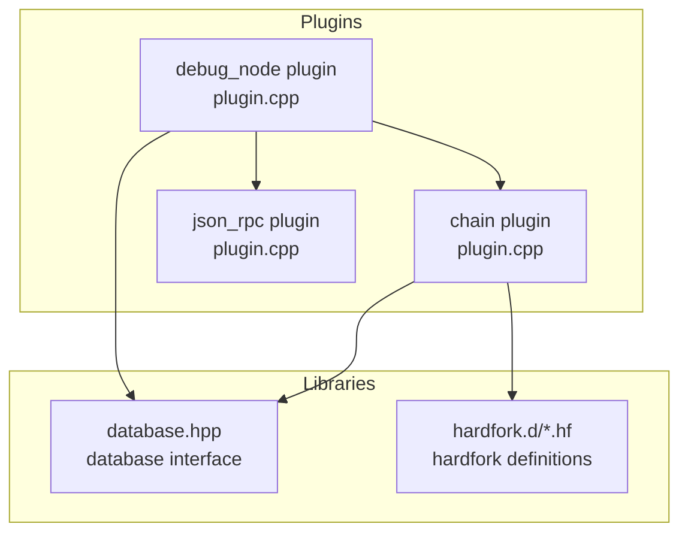
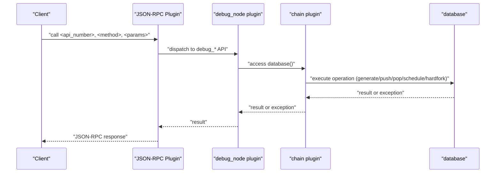
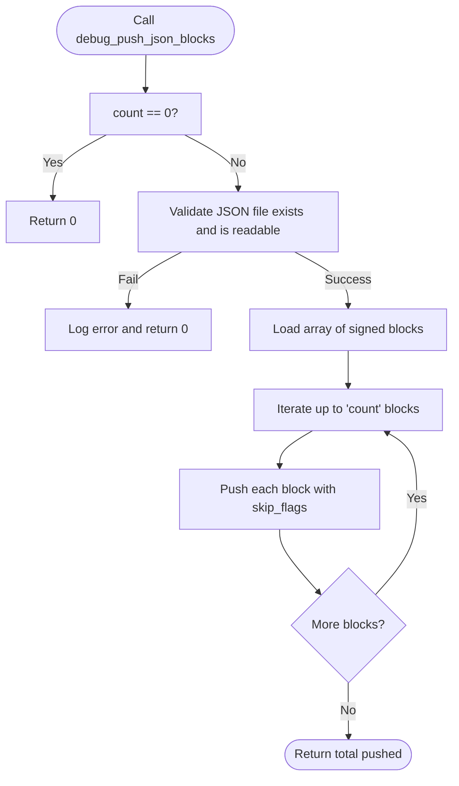
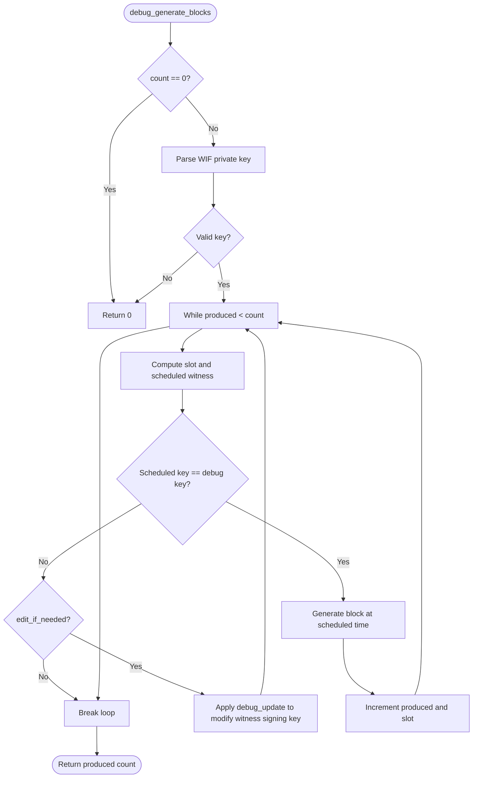
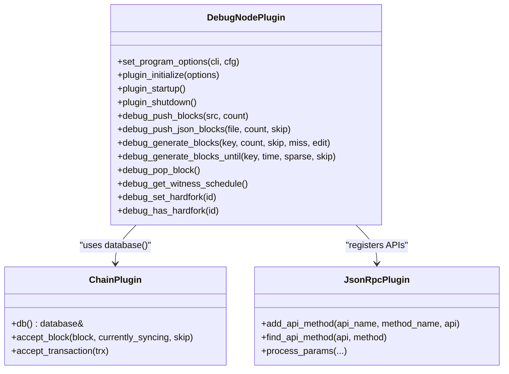
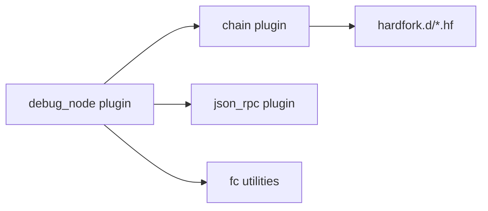

# Debug Node Plugin

<cite>
**Referenced Files in This Document**
- [plugin.cpp](file://plugins/debug_node/plugin.cpp)
- [plugin.hpp](file://plugins/debug_node/include/graphene/plugins/debug_node/plugin.hpp)
- [debug_node_plugin.md](file://documentation/debug_node_plugin.md)
- [plugin.cpp](file://plugins/chain/plugin.cpp)
- [plugin.cpp](file://plugins/json_rpc/plugin.cpp)
- [database.hpp](file://libraries/chain/include/graphene/chain/database.hpp)
- [1.hf](file://libraries/chain/hardfork.d/1.hf)
</cite>

## Table of Contents
1. [Introduction](#introduction)
2. [Project Structure](#project-structure)
3. [Core Components](#core-components)
4. [Architecture Overview](#architecture-overview)
5. [Detailed Component Analysis](#detailed-component-analysis)
6. [Dependency Analysis](#dependency-analysis)
7. [Performance Considerations](#performance-considerations)
8. [Troubleshooting Guide](#troubleshooting-guide)
9. [Conclusion](#conclusion)
10. [Appendices](#appendices)

## Introduction
The debug node plugin is a development and debugging tool designed to manipulate blockchain state locally for testing, reproducibility, and experimentation. It enables:
- Generating blocks programmatically for rapid scenario testing
- Importing existing blockchain data via binary block logs or JSON arrays
- Inspecting and modifying witness scheduling and hardfork state
- Applying targeted database edits during block application

It integrates with the chain plugin for database access and the JSON-RPC plugin for API exposure, allowing controlled manipulation of chain state without affecting consensus on public networks.

## Project Structure
The debug node plugin resides under plugins/debug_node and exposes a set of APIs registered via the JSON-RPC plugin. It depends on the chain plugin for database operations and uses the JSON-RPC plugin to serve API methods.

**Diagram sources**
- [plugin.cpp](file://plugins/debug_node/plugin.cpp#L1-L668)
- [plugin.cpp](file://plugins/chain/plugin.cpp#L1-L200)
- [plugin.cpp](file://plugins/json_rpc/plugin.cpp#L1-L200)
- [database.hpp](file://libraries/chain/include/graphene/chain/database.hpp#L1-L200)
- [1.hf](file://libraries/chain/hardfork.d/1.hf#L1-L7)

**Section sources**
- [plugin.cpp](file://plugins/debug_node/plugin.cpp#L1-L668)
- [plugin.cpp](file://plugins/chain/plugin.cpp#L1-L200)
- [plugin.cpp](file://plugins/json_rpc/plugin.cpp#L1-L200)
- [database.hpp](file://libraries/chain/include/graphene/chain/database.hpp#L1-L200)
- [debug_node_plugin.md](file://documentation/debug_node_plugin.md#L1-L134)

## Core Components
- Plugin lifecycle and registration
  - Initializes program options, connects to chain plugin database signals, and registers JSON-RPC APIs.
- Public APIs exposed
  - Block generation: debug_generate_blocks, debug_generate_blocks_until
  - Block import: debug_push_blocks, debug_push_json_blocks
  - State inspection: debug_pop_block, debug_get_witness_schedule
  - Hardfork control: debug_set_hardfork, debug_has_hardfork
- Internal mechanisms
  - Uses database flags to skip validations for faster import
  - Applies targeted database edits per block head to simulate state changes
  - Logs and conditionally modifies witness signing keys to enable block production

Key API definitions and declarations are declared in the plugin header and implemented in the plugin source.

**Section sources**
- [plugin.hpp](file://plugins/debug_node/include/graphene/plugins/debug_node/plugin.hpp#L25-L108)
- [plugin.cpp](file://plugins/debug_node/plugin.cpp#L31-L60)
- [plugin.cpp](file://plugins/debug_node/plugin.cpp#L475-L556)

## Architecture Overview
The debug node plugin orchestrates block generation and import through the chain plugin’s database interface and serves methods via the JSON-RPC plugin. It listens to applied-block events to apply debug updates against the current head block.

**Diagram sources**
- [plugin.cpp](file://plugins/debug_node/plugin.cpp#L117-L136)
- [plugin.cpp](file://plugins/debug_node/plugin.cpp#L479-L555)
- [plugin.cpp](file://plugins/chain/plugin.cpp#L169-L182)
- [plugin.cpp](file://plugins/json_rpc/plugin.cpp#L180-L200)

## Detailed Component Analysis

### API Surface and Responsibilities
- debug_push_blocks
  - Imports blocks from a binary block log starting after the current head block.
  - Returns the number of blocks successfully imported.
- debug_push_json_blocks
  - Imports blocks from a JSON file containing an array of signed blocks.
  - Supports skip flags to bypass validations for faster import.
- debug_generate_blocks
  - Generates a given number of blocks by scheduling the current head time and modifying witness signing keys if needed.
  - Accepts skip flags and optional key editing to align witness keys with the provided private key.
- debug_generate_blocks_until
  - Generates blocks until the chain head reaches a specified absolute time, optionally skipping intermediate slots.
- debug_pop_block
  - Returns the last block without popping it from the chain (useful for inspection).
- debug_get_witness_schedule
  - Retrieves the current witness schedule object for inspection.
- debug_set_hardfork
  - Sets the active hardfork to a given ID (no-op if beyond supported range).
- debug_has_hardfork
  - Checks whether the chain has reached or exceeded a given hardfork ID.

**Diagram sources**
- [plugin.cpp](file://plugins/debug_node/plugin.cpp#L374-L420)

**Section sources**
- [plugin.cpp](file://plugins/debug_node/plugin.cpp#L31-L60)
- [plugin.cpp](file://plugins/debug_node/plugin.cpp#L321-L420)
- [plugin.cpp](file://plugins/debug_node/plugin.cpp#L479-L555)

### Block Generation Workflow
The block generation process selects the scheduled witness for the next slot, compares its signing key with the provided debug key, optionally edits the witness object to match, and generates a block signed by the debug key.

**Diagram sources**
- [plugin.cpp](file://plugins/debug_node/plugin.cpp#L222-L288)

**Section sources**
- [plugin.cpp](file://plugins/debug_node/plugin.cpp#L222-L288)

### Witness Schedule Inspection
Retrieves the current witness schedule object from the database for inspection and debugging.

**Section sources**
- [plugin.cpp](file://plugins/debug_node/plugin.cpp#L427-L430)

### Hardfork Management
- debug_set_hardfork
  - Sets the active hardfork ID if within supported range.
- debug_has_hardfork
  - Checks if the stored hardfork property indicates the chain has reached or exceeded the given hardfork ID.

These methods rely on the database’s hardfork property object and internal hardfork arrays.

**Section sources**
- [plugin.cpp](file://plugins/debug_node/plugin.cpp#L441-L454)
- [database.hpp](file://libraries/chain/include/graphene/chain/database.hpp#L429-L524)
- [1.hf](file://libraries/chain/hardfork.d/1.hf#L1-L7)

### Integration with Chain and JSON-RPC Plugins
- Chain plugin
  - Provides the database instance and handles block acceptance/validation.
  - Offers skip flags to bypass expensive checks during import.
- JSON-RPC plugin
  - Registers the debug_node API methods and dispatches requests to the plugin.
  - Manages request parsing, argument validation, and response formatting.

**Diagram sources**
- [plugin.cpp](file://plugins/debug_node/plugin.cpp#L104-L136)
- [plugin.cpp](file://plugins/chain/plugin.cpp#L169-L182)
- [plugin.cpp](file://plugins/json_rpc/plugin.cpp#L159-L178)

**Section sources**
- [plugin.cpp](file://plugins/debug_node/plugin.cpp#L104-L136)
- [plugin.cpp](file://plugins/chain/plugin.cpp#L169-L182)
- [plugin.cpp](file://plugins/json_rpc/plugin.cpp#L159-L178)

## Dependency Analysis
- Internal dependencies
  - debug_node plugin requires chain plugin for database access and signals.
  - Uses fc utilities for filesystem, JSON parsing, and logging.
- External dependencies
  - JSON-RPC plugin for API registration and request handling.
  - Hardfork definitions under hardfork.d for version/time constants.

**Diagram sources**
- [plugin.cpp](file://plugins/debug_node/plugin.cpp#L1-L20)
- [plugin.cpp](file://plugins/chain/plugin.cpp#L1-L20)
- [1.hf](file://libraries/chain/hardfork.d/1.hf#L1-L7)

**Section sources**
- [plugin.cpp](file://plugins/debug_node/plugin.cpp#L1-L20)
- [plugin.cpp](file://plugins/chain/plugin.cpp#L1-L20)
- [1.hf](file://libraries/chain/hardfork.d/1.hf#L1-L7)

## Performance Considerations
- Skip flags
  - Use skip flags (e.g., skip_witness_signature, skip_authority_check, skip_witness_schedule_check) when importing blocks to avoid heavy validations.
- Batch operations
  - Prefer debug_push_blocks or debug_push_json_blocks with reasonable counts to minimize repeated I/O.
- Logging overhead
  - Disable logging in performance-sensitive scenarios to reduce I/O and CPU overhead.
- Block generation
  - Limit the number of generated blocks and avoid unnecessary key edits to reduce database modifications.

[No sources needed since this section provides general guidance]

## Troubleshooting Guide
Common issues and resolutions:
- Empty or invalid JSON file
  - Ensure the JSON file contains an array of signed blocks and is readable.
- Block log not found or incomplete
  - Verify the block log path and index exist and contain sufficient blocks.
- Validation failures during import
  - Use appropriate skip flags to bypass checks; confirm compatibility with mainnet/testnet block formats.
- Witness key mismatch
  - Provide a valid WIF private key and allow key editing if needed; otherwise, block generation will halt.
- Hardfork ID out of range
  - Set hardfork ID within supported bounds; exceeding the maximum has no effect.

Operational tips:
- Bind RPC and P2P endpoints to localhost for development.
- Restrict public API exposure when debug_node_api is enabled.
- Use sparse generation for large time jumps to reduce intermediate blocks.

**Section sources**
- [plugin.cpp](file://plugins/debug_node/plugin.cpp#L374-L420)
- [plugin.cpp](file://plugins/debug_node/plugin.cpp#L321-L372)
- [plugin.cpp](file://plugins/debug_node/plugin.cpp#L222-L288)
- [plugin.cpp](file://plugins/debug_node/plugin.cpp#L441-L454)
- [debug_node_plugin.md](file://documentation/debug_node_plugin.md#L50-L134)

## Conclusion
The debug node plugin provides powerful tools for blockchain state manipulation in development environments. It supports rapid block generation, efficient import of existing data, witness schedule inspection, and hardfork control. Proper use of skip flags, careful key management, and restricted API exposure ensures safe and effective debugging without compromising production integrity.

[No sources needed since this section summarizes without analyzing specific files]

## Appendices

### Practical Debugging Workflows
- Creating a test environment from live chain data
  - Export blocks from a live node, start a new node with debug_node enabled, and import blocks via debug_push_blocks or debug_push_json_blocks.
- Reproducing edge cases
  - Generate blocks until a specific time, adjust hardfork state, and simulate witness key changes to reproduce timing-sensitive issues.
- Validating state changes
  - Inspect witness schedules and hardfork properties, then generate blocks to observe behavioral differences.

**Section sources**
- [debug_node_plugin.md](file://documentation/debug_node_plugin.md#L50-L134)

### Security Considerations
- Development vs production
  - Enable debug_node only in isolated development environments; restrict RPC access to localhost and avoid exposing debug_node_api publicly.
- Database edits
  - Treat debug updates as ephemeral and local; they do not affect consensus and are not propagated to other nodes.
- Private key handling
  - Use disposable keys for debugging; never deploy debug keys in production configurations.

**Section sources**
- [debug_node_plugin.md](file://documentation/debug_node_plugin.md#L18-L71)