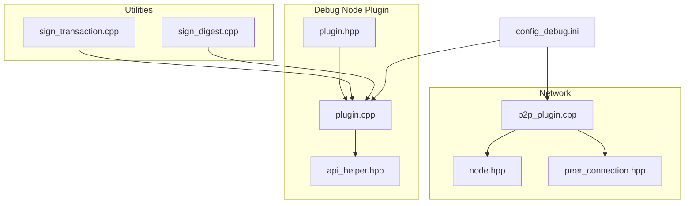
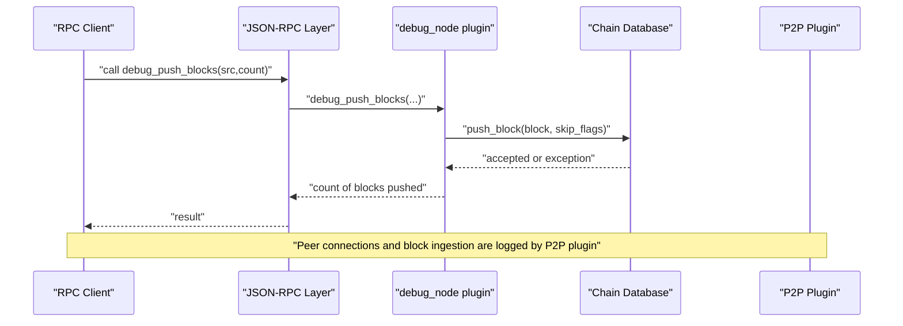
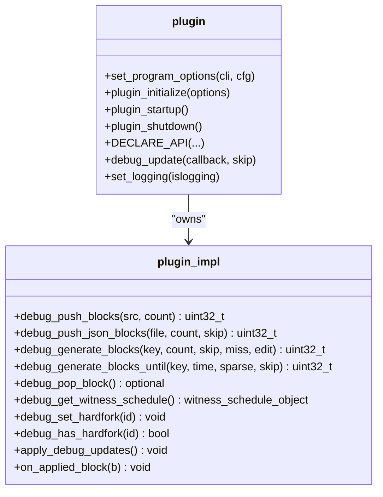
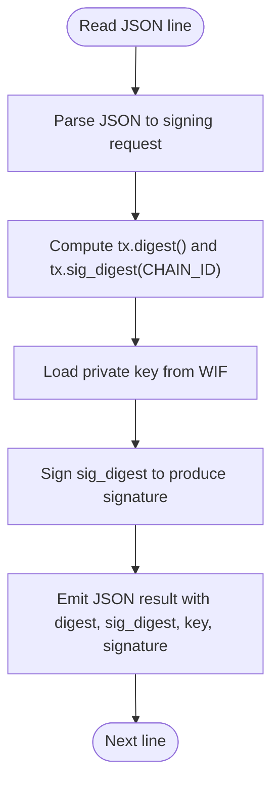
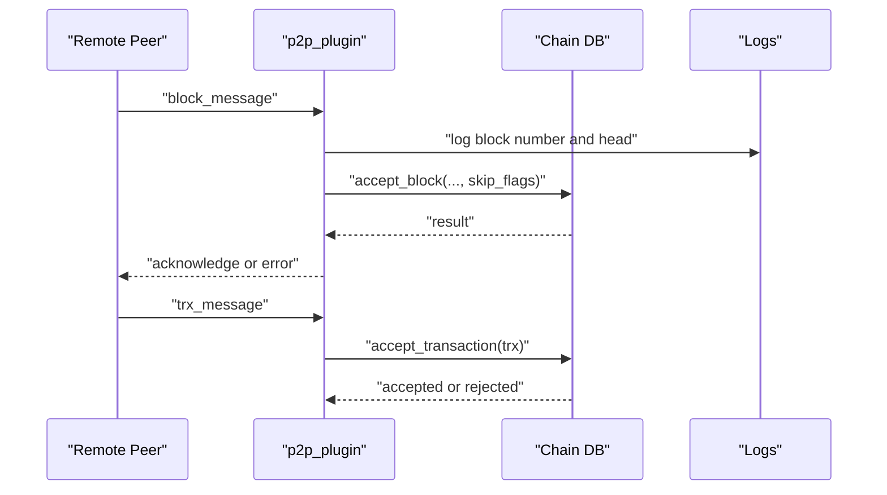
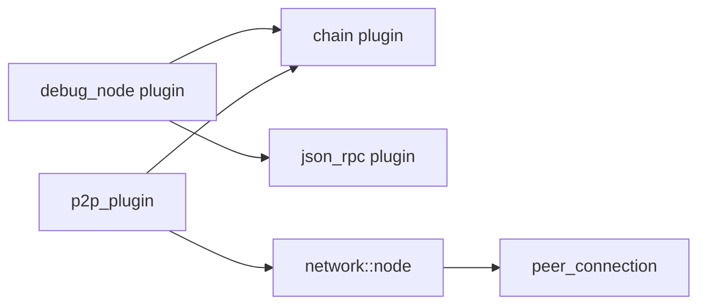
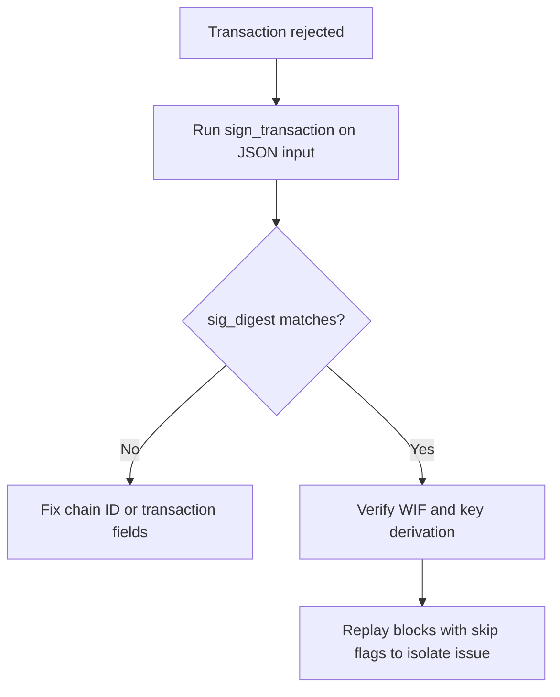
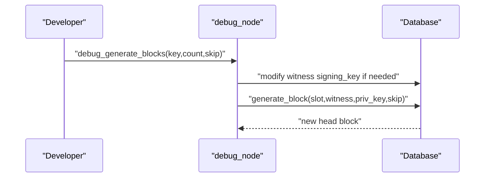

# Debugging Tools

<cite>
**Referenced Files in This Document**
- [debug_node_plugin.md](file://documentation/debug_node_plugin.md)
- [plugin.hpp](file://plugins/debug_node/include/graphene/plugins/debug_node/plugin.hpp)
- [plugin.cpp](file://plugins/debug_node/plugin.cpp)
- [api_helper.hpp](file://plugins/debug_node/include/graphene/plugins/debug_node/api_helper.hpp)
- [config_debug.ini](file://share/vizd/config/config_debug.ini)
- [sign_transaction.cpp](file://programs/util/sign_transaction.cpp)
- [sign_digest.cpp](file://programs/util/sign_digest.cpp)
- [p2p_plugin.cpp](file://plugins/p2p/p2p_plugin.cpp)
- [node.hpp](file://libraries/network/include/graphene/network/node.hpp)
- [peer_connection.hpp](file://libraries/network/include/graphene/network/peer_connection.hpp)
</cite>

## Table of Contents
1. [Introduction](#introduction)
2. [Project Structure](#project-structure)
3. [Core Components](#core-components)
4. [Architecture Overview](#architecture-overview)
5. [Detailed Component Analysis](#detailed-component-analysis)
6. [Dependency Analysis](#dependency-analysis)
7. [Performance Considerations](#performance-considerations)
8. [Troubleshooting Guide](#troubleshooting-guide)
9. [Conclusion](#conclusion)
10. [Appendices](#appendices)

## Introduction
This document explains the debugging tooling available in the VIZ C++ Node, focusing on:
- The debug node plugin for state inspection, transaction tracing, and blockchain state visualization
- Transaction serialization utilities for diagnosing signing issues
- Network debugging and peer connection monitoring
- Performance profiling and memory analysis utilities
- Practical debugging workflows for unit testing to production troubleshooting

The goal is to provide a practical guide for developers and operators to diagnose and resolve issues efficiently, with references to concrete source files and configuration examples.

## Project Structure
The debugging tooling spans several areas:
- The debug node plugin that enables “what-if” experiments and block generation/state manipulation
- Utilities for signing transactions and digests to validate signing logic
- P2P and network components that surface peer connection and message handling details
- Configuration templates optimized for debugging and performance tuning

**Diagram sources**
- [plugin.hpp](file://plugins/debug_node/include/graphene/plugins/debug_node/plugin.hpp#L38-L108)
- [plugin.cpp](file://plugins/debug_node/plugin.cpp#L25-L94)
- [api_helper.hpp](file://plugins/debug_node/include/graphene/plugins/debug_node/api_helper.hpp#L1-L108)
- [sign_transaction.cpp](file://programs/util/sign_transaction.cpp#L12-L26)
- [sign_digest.cpp](file://programs/util/sign_digest.cpp#L12-L24)
- [p2p_plugin.cpp](file://plugins/p2p/p2p_plugin.cpp#L1-L200)
- [node.hpp](file://libraries/network/include/graphene/network/node.hpp#L190-L200)
- [peer_connection.hpp](file://libraries/network/include/graphene/network/peer_connection.hpp#L79-L200)
- [config_debug.ini](file://share/vizd/config/config_debug.ini#L1-L126)

**Section sources**
- [plugin.hpp](file://plugins/debug_node/include/graphene/plugins/debug_node/plugin.hpp#L1-L111)
- [plugin.cpp](file://plugins/debug_node/plugin.cpp#L1-L668)
- [api_helper.hpp](file://plugins/debug_node/include/graphene/plugins/debug_node/api_helper.hpp#L1-L108)
- [sign_transaction.cpp](file://programs/util/sign_transaction.cpp#L1-L54)
- [sign_digest.cpp](file://programs/util/sign_digest.cpp#L1-L49)
- [p2p_plugin.cpp](file://plugins/p2p/p2p_plugin.cpp#L1-L200)
- [node.hpp](file://libraries/network/include/graphene/network/node.hpp#L1-L200)
- [peer_connection.hpp](file://libraries/network/include/graphene/network/peer_connection.hpp#L1-L200)
- [config_debug.ini](file://share/vizd/config/config_debug.ini#L1-L126)

## Core Components
- Debug node plugin
  - Provides APIs to push blocks from disk or JSON, generate blocks locally, pop blocks, inspect witness schedule, and control hardfork state
  - Supports applying database updates at specific block heights and logging decisions
  - Exposes program options for initial database edit scripts
- Transaction signing utilities
  - Standalone CLI tools to compute transaction digests, signature digests, and signatures given WIF keys
- Network debugging
  - P2P plugin logs block acceptance and transaction ingestion
  - Network node and peer connection abstractions expose peer status and message propagation metadata

Key capabilities:
- State inspection via database access and witness schedule retrieval
- Transaction tracing by generating blocks and observing accepted transactions
- Blockchain state visualization by replaying blocks from logs or JSON
- Signing diagnostics using deterministic signing utilities

**Section sources**
- [plugin.hpp](file://plugins/debug_node/include/graphene/plugins/debug_node/plugin.hpp#L38-L108)
- [plugin.cpp](file://plugins/debug_node/plugin.cpp#L25-L94)
- [plugin.cpp](file://plugins/debug_node/plugin.cpp#L222-L288)
- [plugin.cpp](file://plugins/debug_node/plugin.cpp#L321-L420)
- [plugin.cpp](file://plugins/debug_node/plugin.cpp#L489-L555)
- [sign_transaction.cpp](file://programs/util/sign_transaction.cpp#L12-L26)
- [sign_digest.cpp](file://programs/util/sign_digest.cpp#L12-L24)
- [p2p_plugin.cpp](file://plugins/p2p/p2p_plugin.cpp#L118-L170)

## Architecture Overview
The debug node plugin integrates with the chain plugin and JSON-RPC to expose a set of debugging APIs. It manipulates the database to simulate conditions and replay blocks from external sources. Network debugging leverages the P2P plugin’s logging hooks and the network node’s peer management.

**Diagram sources**
- [plugin.cpp](file://plugins/debug_node/plugin.cpp#L489-L511)
- [plugin.cpp](file://plugins/debug_node/plugin.cpp#L321-L372)
- [p2p_plugin.cpp](file://plugins/p2p/p2p_plugin.cpp#L118-L170)

## Detailed Component Analysis

### Debug Node Plugin
The debug node plugin offers:
- Block replay from block log and JSON arrays
- Local block generation with configurable witness key and skipping of validations
- Database update hooks applied at specific block heights
- Hardfork state control and witness schedule inspection

**Diagram sources**
- [plugin.hpp](file://plugins/debug_node/include/graphene/plugins/debug_node/plugin.hpp#L38-L108)
- [plugin.cpp](file://plugins/debug_node/plugin.cpp#L25-L94)
- [plugin.cpp](file://plugins/debug_node/plugin.cpp#L222-L555)

Key behaviors:
- Block replay honors skip flags to bypass expensive validations when needed
- Local block generation modifies witness signing keys to accept self-signed blocks
- Hardfork state can be set programmatically for testing activation logic
- Logging toggles help reduce noise during automated tests

Practical usage patterns:
- Replay historical blocks from a block log to reproduce state
- Generate blocks deterministically for consensus timing tests
- Inspect witness schedule and hardfork state during debugging sessions

**Section sources**
- [plugin.cpp](file://plugins/debug_node/plugin.cpp#L321-L420)
- [plugin.cpp](file://plugins/debug_node/plugin.cpp#L222-L288)
- [plugin.cpp](file://plugins/debug_node/plugin.cpp#L441-L454)
- [plugin.cpp](file://plugins/debug_node/plugin.cpp#L422-L430)
- [plugin.cpp](file://plugins/debug_node/plugin.cpp#L117-L136)

### Transaction Serialization Utilities
Two standalone utilities support signing diagnostics:
- sign_transaction: computes digest and signature digest, signs a transaction, and prints results
- sign_digest: signs a raw digest with a WIF key and prints the signature

**Diagram sources**
- [sign_transaction.cpp](file://programs/util/sign_transaction.cpp#L28-L53)
- [sign_digest.cpp](file://programs/util/sign_digest.cpp#L26-L48)

Common debugging scenarios:
- Verifying transaction signing failures by comparing computed sig_digest against wallet-produced signatures
- Confirming chain ID correctness by ensuring sig_digest matches expected chain ID
- Isolating signature malleability or encoding issues by printing compact signatures

**Section sources**
- [sign_transaction.cpp](file://programs/util/sign_transaction.cpp#L12-L26)
- [sign_transaction.cpp](file://programs/util/sign_transaction.cpp#L28-L53)
- [sign_digest.cpp](file://programs/util/sign_digest.cpp#L12-L24)
- [sign_digest.cpp](file://programs/util/sign_digest.cpp#L26-L48)

### Network Debugging and Peer Monitoring
The P2P plugin logs block acceptance and transaction ingestion, and the network node/peer connection abstractions expose peer status and message propagation metadata.

**Diagram sources**
- [p2p_plugin.cpp](file://plugins/p2p/p2p_plugin.cpp#L118-L170)
- [node.hpp](file://libraries/network/include/graphene/network/node.hpp#L79-L98)
- [peer_connection.hpp](file://libraries/network/include/graphene/network/peer_connection.hpp#L175-L200)

Operational insights:
- Logs indicate block ingestion latency and transaction counts per block
- Sync vs normal mode logs differentiate between catching-up and live operation
- Peer connection states and metrics (round-trip delay, clock offset) aid in diagnosing connectivity issues

**Section sources**
- [p2p_plugin.cpp](file://plugins/p2p/p2p_plugin.cpp#L118-L170)
- [node.hpp](file://libraries/network/include/graphene/network/node.hpp#L173-L200)
- [peer_connection.hpp](file://libraries/network/include/graphene/network/peer_connection.hpp#L79-L200)

## Dependency Analysis
The debug node plugin depends on the chain plugin and JSON-RPC infrastructure. It interacts with the database to push blocks, modify witness keys, and manage hardfork state. The P2P plugin depends on the chain plugin for validation and delegates block/trx handling to it.

**Diagram sources**
- [plugin.hpp](file://plugins/debug_node/include/graphene/plugins/debug_node/plugin.hpp#L40-L41)
- [plugin.cpp](file://plugins/debug_node/plugin.cpp#L117-L136)
- [p2p_plugin.cpp](file://plugins/p2p/p2p_plugin.cpp#L1-L200)
- [node.hpp](file://libraries/network/include/graphene/network/node.hpp#L190-L200)
- [peer_connection.hpp](file://libraries/network/include/graphene/network/peer_connection.hpp#L79-L200)

**Section sources**
- [plugin.hpp](file://plugins/debug_node/include/graphene/plugins/debug_node/plugin.hpp#L40-L41)
- [plugin.cpp](file://plugins/debug_node/plugin.cpp#L117-L136)
- [p2p_plugin.cpp](file://plugins/p2p/p2p_plugin.cpp#L1-L200)

## Performance Considerations
- Shared memory sizing and growth thresholds impact replay performance and stability
- Single write thread and reduced plugin notifications can improve throughput during bulk operations
- Read/write lock contention affects RPC responsiveness under load

Recommendations:
- Increase shared memory size and thresholds for long replays
- Enable single write thread for deterministic block generation
- Tune read/write wait retries to avoid transient lock errors

**Section sources**
- [config_debug.ini](file://share/vizd/config/config_debug.ini#L36-L47)
- [config_debug.ini](file://share/vizd/config/config_debug.ini#L49-L67)

## Troubleshooting Guide

### Transaction Validation Failures
Symptoms:
- Transactions rejected with signature or authority errors
- Mismatch between expected and computed digests

Workflow:
- Use sign_transaction to compute digest and sig_digest for the transaction
- Compare sig_digest with the transaction’s sig_digest(CHAIN_ID)
- Verify WIF corresponds to the claimed signing key
- Reproduce by pushing blocks that include the transaction and observe logs

**Diagram sources**
- [sign_transaction.cpp](file://programs/util/sign_transaction.cpp#L28-L53)
- [plugin.cpp](file://plugins/debug_node/plugin.cpp#L321-L372)

**Section sources**
- [sign_transaction.cpp](file://programs/util/sign_transaction.cpp#L12-L26)
- [sign_transaction.cpp](file://programs/util/sign_transaction.cpp#L28-L53)
- [plugin.cpp](file://plugins/debug_node/plugin.cpp#L321-L372)

### Consensus Issues
Symptoms:
- Blocks not accepted or chain stalls
- Witness participation thresholds not met

Workflow:
- Use debug_generate_blocks to advance the chain deterministically
- Temporarily modify witness signing keys to accept self-signed blocks
- Inspect witness schedule and hardfork state via debug APIs

**Diagram sources**
- [plugin.cpp](file://plugins/debug_node/plugin.cpp#L222-L288)
- [plugin.cpp](file://plugins/debug_node/plugin.cpp#L489-L511)

**Section sources**
- [plugin.cpp](file://plugins/debug_node/plugin.cpp#L222-L288)
- [plugin.cpp](file://plugins/debug_node/plugin.cpp#L489-L511)

### Network Connectivity Problems
Symptoms:
- Peers disconnect frequently
- No blocks received or delayed propagation

Workflow:
- Review P2P logs for block ingestion and transaction acceptance
- Monitor peer connection states and metrics (round-trip delay, clock offset)
- Adjust seed nodes and connection limits in configuration

**Section sources**
- [p2p_plugin.cpp](file://plugins/p2p/p2p_plugin.cpp#L118-L170)
- [peer_connection.hpp](file://libraries/network/include/graphene/network/peer_connection.hpp#L175-L200)
- [config_debug.ini](file://share/vizd/config/config_debug.ini#L1-L126)

### Log Analysis Techniques
- Use the debug node plugin’s logging toggle to reduce noise during scripted runs
- Inspect P2P logs for sync vs live modes and block ingestion latency
- Correlate error backtraces from block push operations with the specific block number and ID

**Section sources**
- [plugin.cpp](file://plugins/debug_node/plugin.cpp#L244-L248)
- [plugin.cpp](file://plugins/debug_node/plugin.cpp#L363-L366)
- [p2p_plugin.cpp](file://plugins/p2p/p2p_plugin.cpp#L124-L133)

### Integration with External Tools and IDEs
- Build and run the signing utilities from the programs/util directory to pipe transaction JSON into them
- Use the debug node plugin’s JSON-RPC API from IDE REST clients or scripts
- Configure logging appenders and endpoints in the debug configuration template

**Section sources**
- [sign_transaction.cpp](file://programs/util/sign_transaction.cpp#L1-L54)
- [sign_digest.cpp](file://programs/util/sign_digest.cpp#L1-L49)
- [config_debug.ini](file://share/vizd/config/config_debug.ini#L107-L126)

### Debugging Workflows Across Development Phases
- Unit testing: Use sign_transaction and sign_digest to validate signing logic in isolation
- Integration testing: Replay blocks from JSON logs with skip flags to accelerate tests
- Staging: Enable debug node plugin with restricted RPC access and targeted edit scripts
- Production troubleshooting: Temporarily enable debug APIs on loopback, replay problematic blocks, and inspect witness schedule and hardfork state

**Section sources**
- [plugin.cpp](file://plugins/debug_node/plugin.cpp#L489-L511)
- [plugin.cpp](file://plugins/debug_node/plugin.cpp#L374-L420)
- [debug_node_plugin.md](file://documentation/debug_node_plugin.md#L50-L134)

## Conclusion
The VIZ C++ Node provides robust debugging tooling centered around the debug node plugin, transaction signing utilities, and network introspection. By combining deterministic block generation, replay capabilities, and structured logging, teams can systematically diagnose transaction validation failures, consensus issues, and network connectivity problems. Proper configuration and disciplined workflows ensure efficient troubleshooting from development to production.

## Appendices

### API Reference Summary
- debug_push_blocks: Load blocks from a block log
- debug_push_json_blocks: Load blocks from a JSON array
- debug_generate_blocks: Produce blocks with a specified key
- debug_generate_blocks_until: Advance time-based to a target head block time
- debug_pop_block: Remove the head block
- debug_get_witness_schedule: Retrieve witness schedule object
- debug_set_hardfork / debug_has_hardfork: Control and query hardfork state

**Section sources**
- [plugin.hpp](file://plugins/debug_node/include/graphene/plugins/debug_node/plugin.hpp#L62-L90)
- [plugin.cpp](file://plugins/debug_node/plugin.cpp#L489-L555)