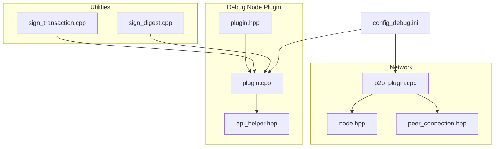
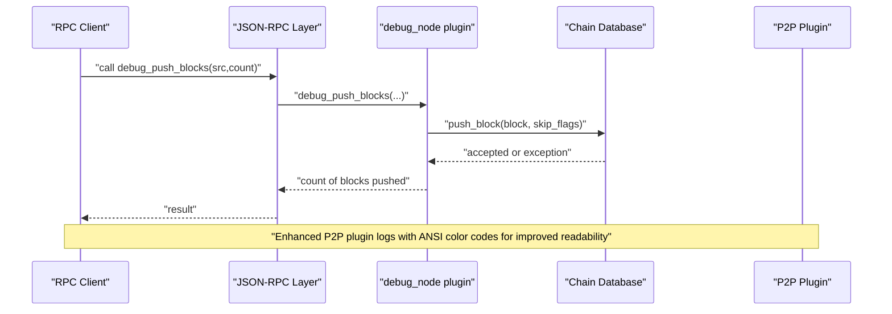
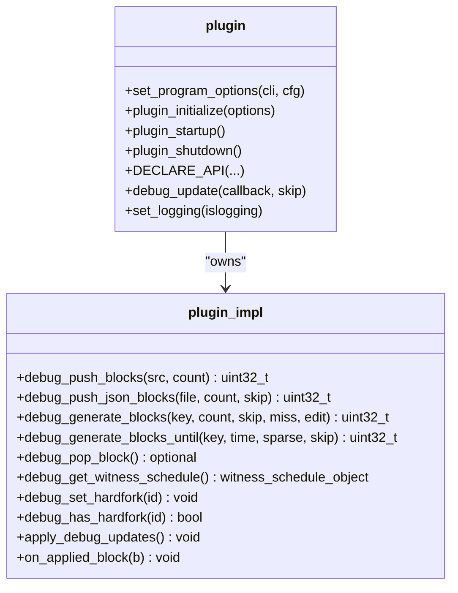
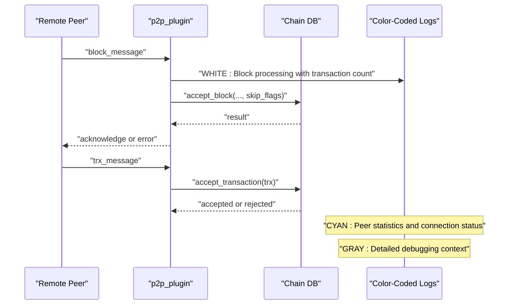
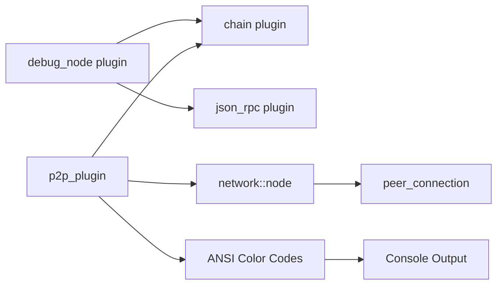
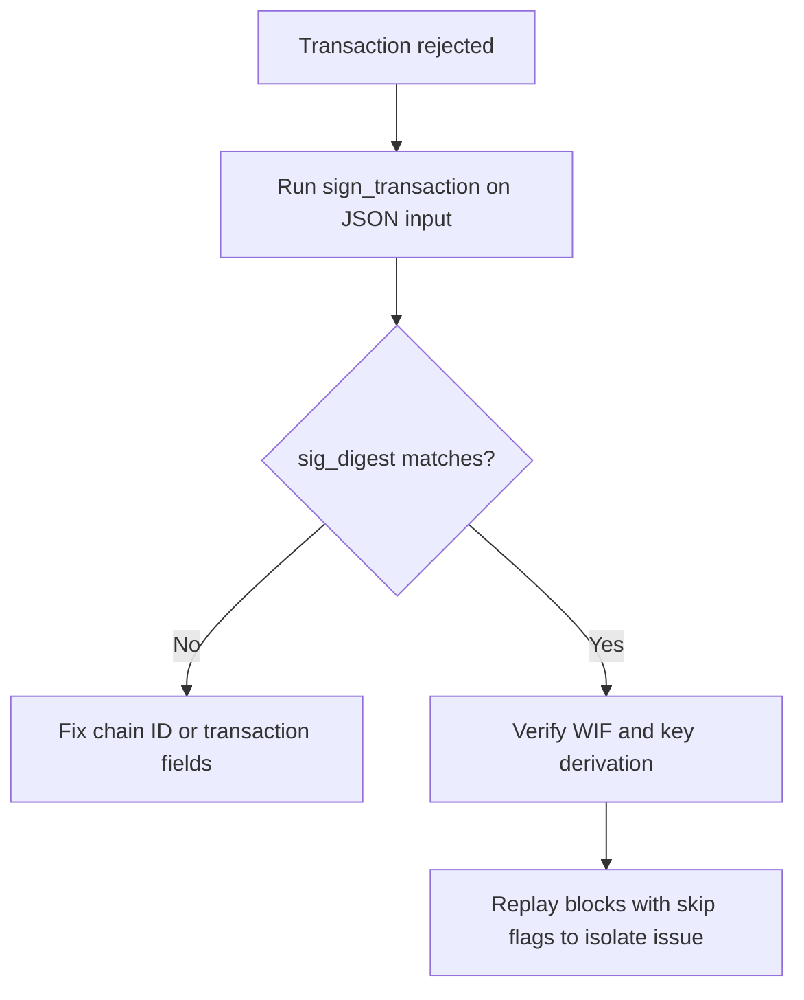
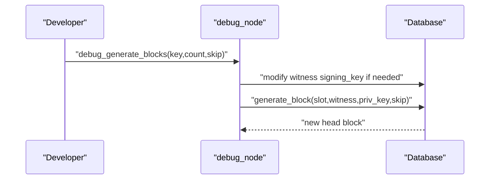

# Debugging Tools

<cite>
**Referenced Files in This Document**
- [debug_node_plugin.md](file://documentation/debug_node_plugin.md)
- [plugin.hpp](file://plugins/debug_node/include/graphene/plugins/debug_node/plugin.hpp)
- [plugin.cpp](file://plugins/debug_node/plugin.cpp)
- [api_helper.hpp](file://plugins/debug_node/include/graphene/plugins/debug_node/api_helper.hpp)
- [config_debug.ini](file://share/vizd/config/config_debug.ini)
- [sign_transaction.cpp](file://programs/util/sign_transaction.cpp)
- [sign_digest.cpp](file://programs/util/sign_digest.cpp)
- [p2p_plugin.cpp](file://plugins/p2p/p2p_plugin.cpp)
- [node.hpp](file://libraries/network/include/graphene/network/node.hpp)
- [peer_connection.hpp](file://libraries/network/include/graphene/network/peer_connection.hpp)
- [node.cpp](file://libraries/network/node.cpp)
</cite>

## Update Summary
**Changes Made**
- Enhanced P2P plugin logging section to document ANSI color code improvements
- Added detailed explanation of color-coded logging for different network event types
- Updated network debugging section with specific color coding examples
- Added console readability and debugging efficiency benefits
- Updated troubleshooting guide with color-based log analysis techniques

## Table of Contents
1. [Introduction](#introduction)
2. [Project Structure](#project-structure)
3. [Core Components](#core-components)
4. [Architecture Overview](#architecture-overview)
5. [Detailed Component Analysis](#detailed-component-analysis)
6. [Dependency Analysis](#dependency-analysis)
7. [Performance Considerations](#performance-considerations)
8. [Troubleshooting Guide](#troubleshooting-guide)
9. [Conclusion](#conclusion)
10. [Appendices](#appendices)

## Introduction
This document explains the debugging tooling available in the VIZ C++ Node, focusing on:
- The debug node plugin for state inspection, transaction tracing, and blockchain state visualization
- Transaction serialization utilities for diagnosing signing issues
- Network debugging and peer connection monitoring with enhanced ANSI color-coded logging
- Performance profiling and memory analysis utilities
- Practical debugging workflows for unit testing to production troubleshooting

The goal is to provide a practical guide for developers and operators to diagnose and resolve issues efficiently, with references to concrete source files and configuration examples.

**Updated** Enhanced P2P plugin logging now provides visual distinction through ANSI color codes for different types of network events, significantly improving console readability and debugging efficiency.

## Project Structure
The debugging tooling spans several areas:
- The debug node plugin that enables "what-if" experiments and block generation/state manipulation
- Utilities for signing transactions and digests to validate signing logic
- P2P and network components that surface peer connection and message handling details with enhanced color-coded logging
- Configuration templates optimized for debugging and performance tuning

**Diagram sources**
- [plugin.hpp:38-108](file://plugins/debug_node/include/graphene/plugins/debug_node/plugin.hpp#L38-L108)
- [plugin.cpp:25-94](file://plugins/debug_node/plugin.cpp#L25-L94)
- [api_helper.hpp:1-108](file://plugins/debug_node/include/graphene/plugins/debug_node/api_helper.hpp#L1-L108)
- [sign_transaction.cpp:12-26](file://programs/util/sign_transaction.cpp#L12-L26)
- [sign_digest.cpp:12-24](file://programs/util/sign_digest.cpp#L12-L24)
- [p2p_plugin.cpp:1-200](file://plugins/p2p/p2p_plugin.cpp#L1-L200)
- [node.hpp:190-200](file://libraries/network/include/graphene/network/node.hpp#L190-L200)
- [peer_connection.hpp:79-200](file://libraries/network/include/graphene/network/peer_connection.hpp#L79-L200)
- [config_debug.ini:1-126](file://share/vizd/config/config_debug.ini#L1-L126)

**Section sources**
- [plugin.hpp:1-111](file://plugins/debug_node/include/graphene/plugins/debug_node/plugin.hpp#L1-L111)
- [plugin.cpp:1-668](file://plugins/debug_node/plugin.cpp#L1-L668)
- [api_helper.hpp:1-108](file://plugins/debug_node/include/graphene/plugins/debug_node/api_helper.hpp#L1-L108)
- [sign_transaction.cpp:1-54](file://programs/util/sign_transaction.cpp#L1-L54)
- [sign_digest.cpp:1-49](file://programs/util/sign_digest.cpp#L1-L49)
- [p2p_plugin.cpp:1-200](file://plugins/p2p/p2p_plugin.cpp#L1-L200)
- [node.hpp:1-200](file://libraries/network/include/graphene/network/node.hpp#L1-L200)
- [peer_connection.hpp:1-200](file://libraries/network/include/graphene/network/peer_connection.hpp#L1-L200)
- [config_debug.ini:1-126](file://share/vizd/config/config_debug.ini#L1-L126)

## Core Components
- Debug node plugin
  - Provides APIs to push blocks from disk or JSON, generate blocks locally, pop blocks, inspect witness schedule, and control hardfork state
  - Supports applying database updates at specific block heights and logging decisions
  - Exposes program options for initial database edit scripts
- Transaction signing utilities
  - Standalone CLI tools to compute transaction digests, signature digests, and signatures given WIF keys
- Network debugging with enhanced visual distinction
  - P2P plugin logs block acceptance and transaction ingestion with ANSI color codes
  - Network node and peer connection abstractions expose peer status and message propagation metadata
  - Color-coded logging improves console readability and debugging efficiency

Key capabilities:
- State inspection via database access and witness schedule retrieval
- Transaction tracing by generating blocks and observing accepted transactions
- Blockchain state visualization by replaying blocks from logs or JSON
- Signing diagnostics using deterministic signing utilities
- Enhanced network debugging through visual color coding

**Updated** Enhanced P2P plugin logging now uses ANSI color codes to provide visual distinction for different types of network events, including block processing messages in white color, peer statistics in cyan color, and detailed debugging information in gray color.

**Section sources**
- [plugin.hpp:38-108](file://plugins/debug_node/include/graphene/plugins/debug_node/plugin.hpp#L38-L108)
- [plugin.cpp:25-94](file://plugins/debug_node/plugin.cpp#L25-L94)
- [plugin.cpp:222-288](file://plugins/debug_node/plugin.cpp#L222-L288)
- [plugin.cpp:321-420](file://plugins/debug_node/plugin.cpp#L321-L420)
- [plugin.cpp:489-555](file://plugins/debug_node/plugin.cpp#L489-L555)
- [sign_transaction.cpp:12-26](file://programs/util/sign_transaction.cpp#L12-L26)
- [sign_digest.cpp:12-24](file://programs/util/sign_digest.cpp#L12-L24)
- [p2p_plugin.cpp:118-170](file://plugins/p2p/p2p_plugin.cpp#L118-L170)
- [p2p_plugin.cpp:16-21](file://plugins/p2p/p2p_plugin.cpp#L16-L21)

## Architecture Overview
The debug node plugin integrates with the chain plugin and JSON-RPC to expose a set of debugging APIs. It manipulates the database to simulate conditions and replay blocks from external sources. Network debugging leverages the P2P plugin's enhanced logging hooks with ANSI color codes and the network node's peer management.

**Diagram sources**
- [plugin.cpp:489-511](file://plugins/debug_node/plugin.cpp#L489-L511)
- [plugin.cpp:321-372](file://plugins/debug_node/plugin.cpp#L321-L372)
- [p2p_plugin.cpp:118-170](file://plugins/p2p/p2p_plugin.cpp#L118-L170)

## Detailed Component Analysis

### Debug Node Plugin
The debug node plugin offers:
- Block replay from block log and JSON arrays
- Local block generation with configurable witness key and skipping of validations
- Database update hooks applied at specific block heights
- Hardfork state control and witness schedule inspection

**Diagram sources**
- [plugin.hpp:38-108](file://plugins/debug_node/include/graphene/plugins/debug_node/plugin.hpp#L38-L108)
- [plugin.cpp:25-94](file://plugins/debug_node/plugin.cpp#L25-L94)
- [plugin.cpp:222-555](file://plugins/debug_node/plugin.cpp#L222-L555)

Key behaviors:
- Block replay honors skip flags to bypass expensive validations when needed
- Local block generation modifies witness signing keys to accept self-signed blocks
- Hardfork state can be set programmatically for testing activation logic
- Logging toggles help reduce noise during automated tests

Practical usage patterns:
- Replay historical blocks from a block log to reproduce state
- Generate blocks deterministically for consensus timing tests
- Inspect witness schedule and hardfork state during debugging sessions

**Section sources**
- [plugin.cpp:321-420](file://plugins/debug_node/plugin.cpp#L321-L420)
- [plugin.cpp:222-288](file://plugins/debug_node/plugin.cpp#L222-L288)
- [plugin.cpp:441-454](file://plugins/debug_node/plugin.cpp#L441-L454)
- [plugin.cpp:422-430](file://plugins/debug_node/plugin.cpp#L422-L430)
- [plugin.cpp:117-136](file://plugins/debug_node/plugin.cpp#L117-L136)

### Transaction Serialization Utilities
Two standalone utilities support signing diagnostics:
- sign_transaction: computes digest and signature digest, signs a transaction, and prints results
- sign_digest: signs a raw digest with a WIF key and prints the signature

**Diagram sources**
- [sign_transaction.cpp:28-53](file://programs/util/sign_transaction.cpp#L28-L53)
- [sign_digest.cpp:26-48](file://programs/util/sign_digest.cpp#L26-L48)

Common debugging scenarios:
- Verifying transaction signing failures by comparing computed sig_digest against wallet-produced signatures
- Confirming chain ID correctness by ensuring sig_digest matches expected chain ID
- Isolating signature malleability or encoding issues by printing compact signatures

**Section sources**
- [sign_transaction.cpp:12-26](file://programs/util/sign_transaction.cpp#L12-L26)
- [sign_transaction.cpp:28-53](file://programs/util/sign_transaction.cpp#L28-L53)
- [sign_digest.cpp:12-24](file://programs/util/sign_digest.cpp#L12-L24)
- [sign_digest.cpp:26-48](file://programs/util/sign_digest.cpp#L26-L48)

### Network Debugging and Peer Monitoring with Enhanced Visual Distinction

**Updated** The P2P plugin now provides enhanced logging with ANSI color codes for improved console readability and debugging efficiency.

The P2P plugin logs block acceptance and transaction ingestion with ANSI color codes, and the network node/peer connection abstractions expose peer status and message propagation metadata. The enhanced logging system uses color codes to visually distinguish different types of network events:

- **White color (CLOG_WHITE)**: Block processing messages including transaction counts and latency information
- **Cyan color (CLOG_CYAN)**: Peer statistics and connection status information  
- **Gray color (CLOG_GRAY)**: Detailed debugging information and operational context
- **Orange color (CLOG_ORANGE)**: Connection-related warnings and termination notices
- **Red color (CLOG_RED)**: Critical connection termination events

**Diagram sources**
- [p2p_plugin.cpp:118-170](file://plugins/p2p/p2p_plugin.cpp#L118-L170)
- [p2p_plugin.cpp:16-21](file://plugins/p2p/p2p_plugin.cpp#L16-L21)
- [p2p_plugin.cpp:169-172](file://plugins/p2p/p2p_plugin.cpp#L169-L172)
- [p2p_plugin.cpp:605-652](file://plugins/p2p/p2p_plugin.cpp#L605-L652)
- [node.cpp:79-83](file://libraries/network/node.cpp#L79-L83)
- [node.cpp:5091-5108](file://libraries/network/node.cpp#L5091-L5108)

Operational insights with enhanced visual distinction:
- **White logs**: Immediately highlight block processing activity with transaction counts and latency measurements
- **Cyan logs**: Provide clear peer statistics including connection counts, latency, and bandwidth metrics
- **Gray logs**: Offer detailed debugging context for DLT mode operations and synchronization status
- **Orange/red logs**: Clearly indicate connection warnings, terminations, and critical network events
- Logs indicate block ingestion latency and transaction counts per block
- Sync vs normal mode logs differentiate between catching-up and live operation
- Peer connection states and metrics (round-trip delay, clock offset) aid in diagnosing connectivity issues

**Section sources**
- [p2p_plugin.cpp:16-21](file://plugins/p2p/p2p_plugin.cpp#L16-L21)
- [p2p_plugin.cpp:169-172](file://plugins/p2p/p2p_plugin.cpp#L169-L172)
- [p2p_plugin.cpp:298-365](file://plugins/p2p/p2p_plugin.cpp#L298-L365)
- [p2p_plugin.cpp:521-530](file://plugins/p2p/p2p_plugin.cpp#L521-L530)
- [p2p_plugin.cpp:605-686](file://plugins/p2p/p2p_plugin.cpp#L605-L686)
- [node.cpp:79-83](file://libraries/network/node.cpp#L79-L83)
- [node.cpp:5091-5108](file://libraries/network/node.cpp#L5091-L5108)

## Dependency Analysis
The debug node plugin depends on the chain plugin and JSON-RPC infrastructure. It interacts with the database to push blocks, modify witness keys, and manage hardfork state. The P2P plugin depends on the chain plugin for validation and delegates block/trx handling to it. The enhanced logging system relies on ANSI color code definitions and the underlying logging framework.

**Diagram sources**
- [plugin.hpp:40-41](file://plugins/debug_node/include/graphene/plugins/debug_node/plugin.hpp#L40-L41)
- [plugin.cpp:117-136](file://plugins/debug_node/plugin.cpp#L117-L136)
- [p2p_plugin.cpp:1-200](file://plugins/p2p/p2p_plugin.cpp#L1-L200)
- [node.hpp:190-200](file://libraries/network/include/graphene/network/node.hpp#L190-L200)
- [peer_connection.hpp:79-200](file://libraries/network/include/graphene/network/peer_connection.hpp#L79-L200)
- [p2p_plugin.cpp:16-21](file://plugins/p2p/p2p_plugin.cpp#L16-L21)

**Section sources**
- [plugin.hpp:40-41](file://plugins/debug_node/include/graphene/plugins/debug_node/plugin.hpp#L40-L41)
- [plugin.cpp:117-136](file://plugins/debug_node/plugin.cpp#L117-L136)
- [p2p_plugin.cpp:1-200](file://plugins/p2p/p2p_plugin.cpp#L1-L200)

## Performance Considerations
- Shared memory sizing and growth thresholds impact replay performance and stability
- Single write thread and reduced plugin notifications can improve throughput during bulk operations
- Read/write lock contention affects RPC responsiveness under load
- **Updated** Enhanced logging with color codes provides better visual scanning efficiency without impacting performance significantly

Recommendations:
- Increase shared memory size and thresholds for long replays
- Enable single write thread for deterministic block generation
- Tune read/write wait retries to avoid transient lock errors
- **Updated** Leverage color-coded logs for faster identification of network events and debugging scenarios

**Section sources**
- [config_debug.ini:36-47](file://share/vizd/config/config_debug.ini#L36-L47)
- [config_debug.ini:49-67](file://share/vizd/config/config_debug.ini#L49-L67)

## Troubleshooting Guide

### Transaction Validation Failures
Symptoms:
- Transactions rejected with signature or authority errors
- Mismatch between expected and computed digests

Workflow:
- Use sign_transaction to compute digest and sig_digest for the transaction
- Compare sig_digest with the transaction's sig_digest(CHAIN_ID)
- Verify WIF corresponds to the claimed signing key
- Reproduce by pushing blocks that include the transaction and observe logs

**Diagram sources**
- [sign_transaction.cpp:28-53](file://programs/util/sign_transaction.cpp#L28-L53)
- [plugin.cpp:321-372](file://plugins/debug_node/plugin.cpp#L321-L372)

**Section sources**
- [sign_transaction.cpp:12-26](file://programs/util/sign_transaction.cpp#L12-L26)
- [sign_transaction.cpp:28-53](file://programs/util/sign_transaction.cpp#L28-L53)
- [plugin.cpp:321-372](file://plugins/debug_node/plugin.cpp#L321-L372)

### Consensus Issues
Symptoms:
- Blocks not accepted or chain stalls
- Witness participation thresholds not met

Workflow:
- Use debug_generate_blocks to advance the chain deterministically
- Temporarily modify witness signing keys to accept self-signed blocks
- Inspect witness schedule and hardfork state via debug APIs

**Diagram sources**
- [plugin.cpp:222-288](file://plugins/debug_node/plugin.cpp#L222-L288)
- [plugin.cpp:489-511](file://plugins/debug_node/plugin.cpp#L489-L511)

**Section sources**
- [plugin.cpp:222-288](file://plugins/debug_node/plugin.cpp#L222-L288)
- [plugin.cpp:489-511](file://plugins/debug_node/plugin.cpp#L489-L511)

### Network Connectivity Problems with Enhanced Visual Analysis

**Updated** Network connectivity problems can now be diagnosed more efficiently using the enhanced color-coded logging system.

Symptoms:
- Peers disconnect frequently
- No blocks received or delayed propagation
- Sudden connection drops or reconnections

Workflow with color-coded analysis:
- **Monitor CYAN logs**: Check peer statistics and connection status for immediate issues
- **Review WHITE logs**: Analyze block processing latency and transaction counts
- **Examine GRAY logs**: Investigate DLT mode operations and synchronization context
- **Watch ORANGE/RED logs**: Identify connection warnings and critical termination events
- Adjust seed nodes and connection limits in configuration

Enhanced diagnostic approach:
- **Cyan peer statistics**: Look for sudden spikes in bytes_in or latency changes
- **White block processing**: Monitor transaction counts per block for network congestion
- **Gray debugging info**: Check DLT mode operations during snapshot sync failures
- **Orange/red warnings**: Identify connection health issues and peer blocking status

**Section sources**
- [p2p_plugin.cpp:16-21](file://plugins/p2p/p2p_plugin.cpp#L16-L21)
- [p2p_plugin.cpp:605-686](file://plugins/p2p/p2p_plugin.cpp#L605-L686)
- [p2p_plugin.cpp:169-172](file://plugins/p2p/p2p_plugin.cpp#L169-L172)
- [p2p_plugin.cpp:298-365](file://plugins/p2p/p2p_plugin.cpp#L298-L365)
- [node.cpp:79-83](file://libraries/network/node.cpp#L79-L83)
- [node.cpp:5091-5108](file://libraries/network/node.cpp#L5091-L5108)

### Log Analysis Techniques with Color-Coded System

**Updated** Enhanced log analysis techniques leveraging ANSI color codes for improved debugging efficiency.

- **White logs**: Quickly identify block processing activity and transaction volume
- **Cyan logs**: Monitor peer statistics and connection health in real-time
- **Gray logs**: Access detailed debugging context for complex operations
- **Orange/red logs**: Immediately spot critical connection issues and warnings
- Use the debug node plugin's logging toggle to reduce noise during scripted runs
- Inspect P2P logs for sync vs live modes and block ingestion latency
- Correlate error backtraces from block push operations with the specific block number and ID

**Section sources**
- [p2p_plugin.cpp:16-21](file://plugins/p2p/p2p_plugin.cpp#L16-L21)
- [p2p_plugin.cpp:605-686](file://plugins/p2p/p2p_plugin.cpp#L605-L686)
- [p2p_plugin.cpp:169-172](file://plugins/p2p/p2p_plugin.cpp#L169-L172)
- [plugin.cpp:244-248](file://plugins/debug_node/plugin.cpp#L244-L248)
- [plugin.cpp:363-366](file://plugins/debug_node/plugin.cpp#L363-L366)
- [p2p_plugin.cpp:124-133](file://plugins/p2p/p2p_plugin.cpp#L124-L133)

### Integration with External Tools and IDEs
- Build and run the signing utilities from the programs/util directory to pipe transaction JSON into them
- Use the debug node plugin's JSON-RPC API from IDE REST clients or scripts
- Configure logging appenders and endpoints in the debug configuration template
- **Updated** Leverage color-coded console output for better integration with terminal-based debugging tools

**Section sources**
- [sign_transaction.cpp:1-54](file://programs/util/sign_transaction.cpp#L1-L54)
- [sign_digest.cpp:1-49](file://programs/util/sign_digest.cpp#L1-L49)
- [config_debug.ini:107-126](file://share/vizd/config/config_debug.ini#L107-L126)

### Debugging Workflows Across Development Phases
- Unit testing: Use sign_transaction and sign_digest to validate signing logic in isolation
- Integration testing: Replay blocks from JSON logs with skip flags to accelerate tests
- Staging: Enable debug node plugin with restricted RPC access and targeted edit scripts
- Production troubleshooting: Temporarily enable debug APIs on loopback, replay problematic blocks, and inspect witness schedule and hardfork state
- **Updated** Utilize enhanced color-coded logging for rapid identification of network issues in production environments

**Section sources**
- [plugin.cpp:489-511](file://plugins/debug_node/plugin.cpp#L489-L511)
- [plugin.cpp:374-420](file://plugins/debug_node/plugin.cpp#L374-L420)
- [debug_node_plugin.md:50-134](file://documentation/debug_node_plugin.md#L50-L134)

## Conclusion
The VIZ C++ Node provides robust debugging tooling centered around the debug node plugin, transaction signing utilities, and network introspection with enhanced ANSI color-coded logging. By combining deterministic block generation, replay capabilities, structured logging with visual distinction, and the enhanced P2P plugin logging system, teams can systematically diagnose transaction validation failures, consensus issues, and network connectivity problems more efficiently. The color-coded console output significantly improves debugging speed and accuracy, especially for complex network debugging scenarios. Proper configuration and disciplined workflows ensure efficient troubleshooting from development to production.

**Updated** The enhanced P2P plugin logging with ANSI color codes provides substantial improvements in console readability and debugging efficiency, allowing developers and operators to quickly identify and resolve network issues through visual distinction of different event types.

## Appendices

### API Reference Summary
- debug_push_blocks: Load blocks from a block log
- debug_push_json_blocks: Load blocks from a JSON array
- debug_generate_blocks: Produce blocks with a specified key
- debug_generate_blocks_until: Advance time-based to a target head block time
- debug_pop_block: Remove the head block
- debug_get_witness_schedule: Retrieve witness schedule object
- debug_set_hardfork / debug_has_hardfork: Control and query hardfork state

**Section sources**
- [plugin.hpp:62-90](file://plugins/debug_node/include/graphene/plugins/debug_node/plugin.hpp#L62-L90)
- [plugin.cpp:489-555](file://plugins/debug_node/plugin.cpp#L489-L555)

### Enhanced P2P Logging Color Codes Reference

**Updated** Color-coded logging system for improved network debugging:

- **CLOG_WHITE** ("\033[97m"): Block processing messages including transaction counts and latency
- **CLOG_CYAN** ("\033[96m"): Peer statistics and connection status information
- **CLOG_GRAY** ("\033[90m"): Detailed debugging information and operational context
- **CLOG_RESET** ("\033[0m"): Reset color formatting to default

Common usage patterns:
- White logs for immediate block processing visibility
- Cyan logs for peer monitoring and connection health
- Gray logs for detailed operational context during complex operations
- Automatic reset ensures proper console formatting

**Section sources**
- [p2p_plugin.cpp:16-21](file://plugins/p2p/p2p_plugin.cpp#L16-L21)
- [p2p_plugin.cpp:169-172](file://plugins/p2p/p2p_plugin.cpp#L169-L172)
- [p2p_plugin.cpp:605-686](file://plugins/p2p/p2p_plugin.cpp#L605-L686)
- [p2p_plugin.cpp:298-365](file://plugins/p2p/p2p_plugin.cpp#L298-L365)
- [node.cpp:79-83](file://libraries/network/node.cpp#L79-L83)
- [node.cpp:5091-5108](file://libraries/network/node.cpp#L5091-L5108)