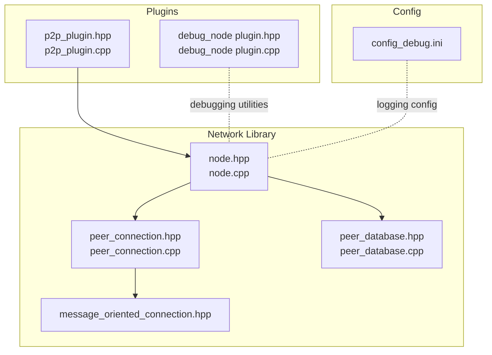
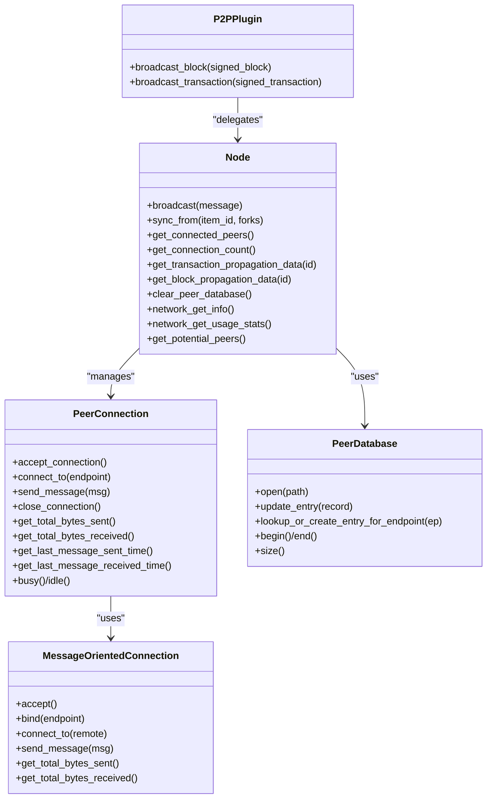
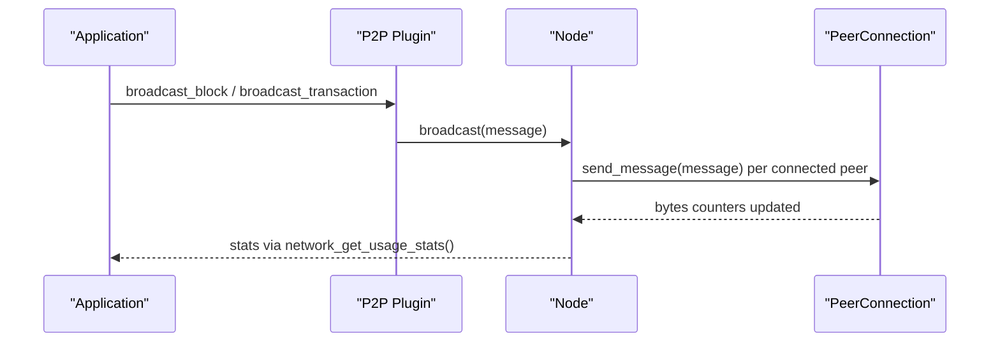
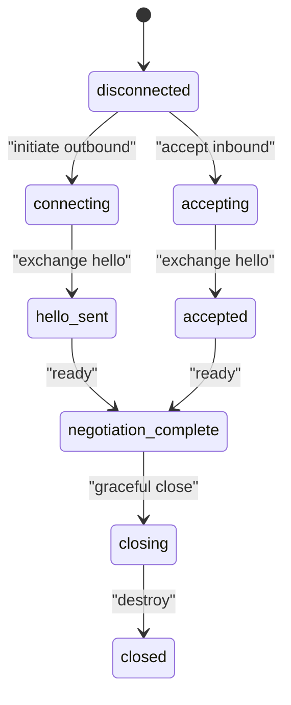
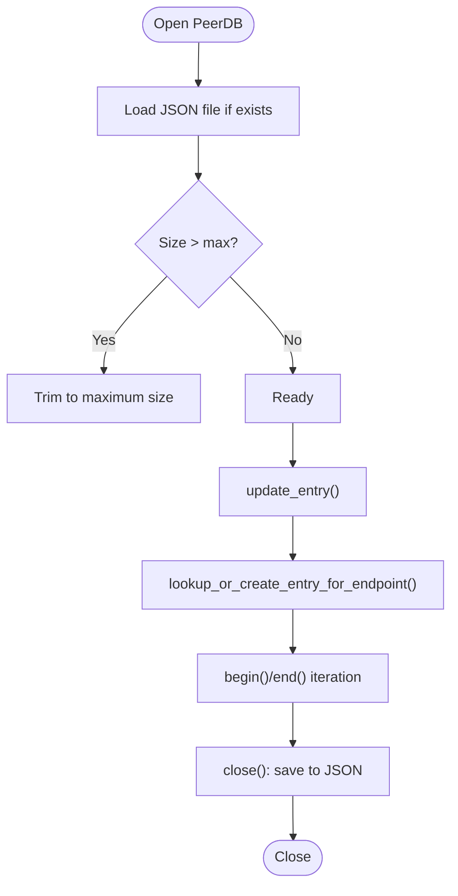
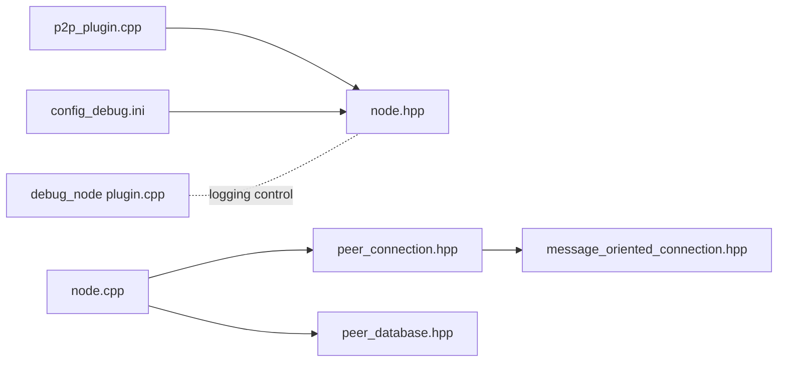

# Network Debugging Capabilities

<cite>
**Referenced Files in This Document**
- [node.hpp](file://libraries/network/include/graphene/network/node.hpp)
- [node.cpp](file://libraries/network/node.cpp)
- [peer_connection.hpp](file://libraries/network/include/graphene/network/peer_connection.hpp)
- [peer_connection.cpp](file://libraries/network/peer_connection.cpp)
- [peer_database.hpp](file://libraries/network/include/graphene/network/peer_database.hpp)
- [peer_database.cpp](file://libraries/network/peer_database.cpp)
- [message_oriented_connection.hpp](file://libraries/network/include/graphene/network/message_oriented_connection.hpp)
- [p2p_plugin.hpp](file://plugins/p2p/include/graphene/plugins/p2p/p2p_plugin.hpp)
- [p2p_plugin.cpp](file://plugins/p2p/p2p_plugin.cpp)
- [plugin.hpp](file://plugins/debug_node/include/graphene/plugins/debug_node/plugin.hpp)
- [plugin.cpp](file://plugins/debug_node/plugin.cpp)
- [config_debug.ini](file://share/vizd/config/config_debug.ini)
- [debug_node_plugin.md](file://documentation/debug_node_plugin.md)
</cite>

## Table of Contents
1. [Introduction](#introduction)
2. [Project Structure](#project-structure)
3. [Core Components](#core-components)
4. [Architecture Overview](#architecture-overview)
5. [Detailed Component Analysis](#detailed-component-analysis)
6. [Dependency Analysis](#dependency-analysis)
7. [Performance Considerations](#performance-considerations)
8. [Troubleshooting Guide](#troubleshooting-guide)
9. [Conclusion](#conclusion)
10. [Appendices](#appendices)

## Introduction
This document explains the network debugging capabilities in VIZ CPP Node with a focus on:
- Peer connection monitoring and debugging (establishment, handshake, and protocol issues)
- Message propagation debugging for blocks and transactions
- Network performance monitoring and latency analysis
- Peer database inspection for topology and connection quality diagnostics
- Practical scenarios: peer discovery failures, block propagation delays, and network partitions
- Logging configuration for network debugging, connection state monitoring, and traffic analysis
- Troubleshooting connectivity and optimizing performance

## Project Structure
The network stack is implemented in the network library and integrated via the P2P plugin. Debugging and logging are configured via the debug configuration file and the debug_node plugin.

**Diagram sources**
- [node.hpp](file://libraries/network/include/graphene/network/node.hpp#L190-L304)
- [node.cpp](file://libraries/network/node.cpp#L106-L176)
- [peer_connection.hpp](file://libraries/network/include/graphene/network/peer_connection.hpp#L79-L351)
- [peer_connection.cpp](file://libraries/network/peer_connection.cpp#L68-L162)
- [peer_database.hpp](file://libraries/network/include/graphene/network/peer_database.hpp#L104-L134)
- [peer_database.cpp](file://libraries/network/peer_database.cpp#L100-L186)
- [message_oriented_connection.hpp](file://libraries/network/include/graphene/network/message_oriented_connection.hpp#L45-L79)
- [p2p_plugin.hpp](file://plugins/p2p/include/graphene/plugins/p2p/p2p_plugin.hpp#L18-L52)
- [p2p_plugin.cpp](file://plugins/p2p/p2p_plugin.cpp#L41-L103)
- [plugin.hpp](file://plugins/debug_node/include/graphene/plugins/debug_node/plugin.hpp#L38-L108)
- [plugin.cpp](file://plugins/debug_node/plugin.cpp#L104-L156)
- [config_debug.ini](file://share/vizd/config/config_debug.ini#L107-L126)

**Section sources**
- [node.hpp](file://libraries/network/include/graphene/network/node.hpp#L190-L304)
- [p2p_plugin.hpp](file://plugins/p2p/include/graphene/plugins/p2p/p2p_plugin.hpp#L18-L52)
- [config_debug.ini](file://share/vizd/config/config_debug.ini#L107-L126)

## Core Components
- Node: Manages P2P connections, broadcasting, syncing, and propagation metrics. Provides APIs to inspect peers, bandwidth limits, and usage statistics.
- PeerConnection: Encapsulates per-peer state, negotiation status, inventory tracking, and timing metrics.
- PeerDatabase: Persistent storage of potential peers, connection attempts, and outcomes.
- MessageOrientedConnection: Low-level transport abstraction for message streams.
- P2P Plugin: Integrates the node with the chain plugin, handles blocks/transactions, and exposes broadcast APIs.
- Debug Node Plugin: Adds debugging hooks and APIs for “what-if” experiments and logging controls.
- Logging Config: Routes logs to console and file appenders, including a dedicated p2p logger.

Key debugging APIs and structures:
- Propagation data tracking for blocks and transactions
- Peer status and connection counts
- Bandwidth limiting and usage stats
- Peer database inspection and clearing
- Firewall and negotiation state visibility

**Section sources**
- [node.hpp](file://libraries/network/include/graphene/network/node.hpp#L48-L54)
- [node.hpp](file://libraries/network/include/graphene/network/node.hpp#L276-L278)
- [node.hpp](file://libraries/network/include/graphene/network/node.hpp#L292-L294)
- [node.hpp](file://libraries/network/include/graphene/network/node.hpp#L296-L296)
- [node.hpp](file://libraries/network/include/graphene/network/node.hpp#L288-L288)
- [peer_connection.hpp](file://libraries/network/include/graphene/network/peer_connection.hpp#L175-L198)
- [peer_connection.hpp](file://libraries/network/include/graphene/network/peer_connection.hpp#L200-L225)
- [peer_connection.hpp](file://libraries/network/include/graphene/network/peer_connection.hpp#L227-L268)
- [peer_database.hpp](file://libraries/network/include/graphene/network/peer_database.hpp#L47-L71)
- [message_oriented_connection.hpp](file://libraries/network/include/graphene/network/message_oriented_connection.hpp#L45-L79)
- [p2p_plugin.hpp](file://plugins/p2p/include/graphene/plugins/p2p/p2p_plugin.hpp#L40-L46)
- [plugin.hpp](file://plugins/debug_node/include/graphene/plugins/debug_node/plugin.hpp#L101-L101)
- [config_debug.ini](file://share/vizd/config/config_debug.ini#L107-L126)

## Architecture Overview
The P2P subsystem is layered:
- Application layer (P2P plugin) delegates to Node for networking.
- Node manages PeerConnections and PeerDatabase.
- PeerConnection composes MessageOrientedConnection for transport.
- Debug Node plugin augments runtime behavior for diagnostics.

**Diagram sources**
- [node.hpp](file://libraries/network/include/graphene/network/node.hpp#L190-L304)
- [peer_connection.hpp](file://libraries/network/include/graphene/network/peer_connection.hpp#L79-L351)
- [peer_database.hpp](file://libraries/network/include/graphene/network/peer_database.hpp#L104-L134)
- [message_oriented_connection.hpp](file://libraries/network/include/graphene/network/message_oriented_connection.hpp#L45-L79)
- [p2p_plugin.hpp](file://plugins/p2p/include/graphene/plugins/p2p/p2p_plugin.hpp#L18-L52)

## Detailed Component Analysis

### Node: Peer Monitoring and Propagation Metrics
- Propagation tracking: message_propagation_data captures received and validated timestamps and originating peer for blocks and transactions.
- Peer inspection: get_connected_peers returns peer_status with version, endpoint, and variant info.
- Stats and limits: network_get_info and network_get_usage_stats expose bandwidth and call statistics; set_total_bandwidth_limit caps throughput.
- Peer DB operations: clear_peer_database resets persistent peer records to aid in diagnosing discovery/connectivity issues.
- Sync and broadcast: sync_from initiates sync; broadcast dispatches messages to peers.

**Diagram sources**
- [p2p_plugin.hpp](file://plugins/p2p/include/graphene/plugins/p2p/p2p_plugin.hpp#L40-L46)
- [node.hpp](file://libraries/network/include/graphene/network/node.hpp#L258-L258)
- [peer_connection.hpp](file://libraries/network/include/graphene/network/peer_connection.hpp#L305-L305)

**Section sources**
- [node.hpp](file://libraries/network/include/graphene/network/node.hpp#L48-L54)
- [node.hpp](file://libraries/network/include/graphene/network/node.hpp#L249-L253)
- [node.hpp](file://libraries/network/include/graphene/network/node.hpp#L276-L278)
- [node.hpp](file://libraries/network/include/graphene/network/node.hpp#L292-L294)
- [node.hpp](file://libraries/network/include/graphene/network/node.hpp#L296-L296)
- [node.hpp](file://libraries/network/include/graphene/network/node.hpp#L288-L288)

### PeerConnection: Negotiation States and Timing
- Negotiation lifecycle: connection_negotiation_status enumerates states from connecting to accepted and hello exchange.
- Per-peer metrics: bytes sent/received, last message times, busy/idle detection, and inhibition flags for fetching.
- Inventory tracking: maintains sets of advertised items, requested items, and sync queues.
- Transport: wraps MessageOrientedConnection for accept/bind/connect and send operations.

**Diagram sources**
- [peer_connection.hpp](file://libraries/network/include/graphene/network/peer_connection.hpp#L94-L106)
- [peer_connection.cpp](file://libraries/network/peer_connection.cpp#L169-L200)

**Section sources**
- [peer_connection.hpp](file://libraries/network/include/graphene/network/peer_connection.hpp#L82-L106)
- [peer_connection.hpp](file://libraries/network/include/graphene/network/peer_connection.hpp#L175-L198)
- [peer_connection.hpp](file://libraries/network/include/graphene/network/peer_connection.hpp#L227-L268)
- [peer_connection.cpp](file://libraries/network/peer_connection.cpp#L169-L200)

### PeerDatabase: Diagnosing Topology and Quality
- Records: endpoint, last seen, disposition of last connection (success/failure/rejected/handshake failed), attempt counts, and last error.
- Iteration: begin/end iterators traverse entries sorted by last_seen_time.
- Persistence: open loads from JSON; close saves to JSON; clear removes all entries.

**Diagram sources**
- [peer_database.cpp](file://libraries/network/peer_database.cpp#L100-L138)
- [peer_database.cpp](file://libraries/network/peer_database.cpp#L151-L174)
- [peer_database.cpp](file://libraries/network/peer_database.cpp#L176-L182)

**Section sources**
- [peer_database.hpp](file://libraries/network/include/graphene/network/peer_database.hpp#L47-L71)
- [peer_database.cpp](file://libraries/network/peer_database.cpp#L100-L138)
- [peer_database.cpp](file://libraries/network/peer_database.cpp#L151-L174)
- [peer_database.cpp](file://libraries/network/peer_database.cpp#L176-L182)

### MessageOrientedConnection: Transport Abstraction
- Accepts inbound connections, binds local endpoints, connects to remotes, sends messages, and tracks bytes and last message times.
- Used by PeerConnection to encapsulate transport concerns.

**Section sources**
- [message_oriented_connection.hpp](file://libraries/network/include/graphene/network/message_oriented_connection.hpp#L45-L79)

### P2P Plugin: Integration and Broadcast
- Implements node_delegate to integrate with the chain plugin.
- Exposes broadcast_block and broadcast_transaction for application-level propagation.
- Handles block and transaction ingestion and logs sync latencies.

**Section sources**
- [p2p_plugin.hpp](file://plugins/p2p/include/graphene/plugins/p2p/p2p_plugin.hpp#L40-L46)
- [p2p_plugin.cpp](file://plugins/p2p/p2p_plugin.cpp#L106-L170)

### Debug Node Plugin: Logging Controls and Debug Utilities
- Provides APIs to generate or push blocks and to control logging behavior.
- Useful for isolating network behavior under controlled conditions.

**Section sources**
- [plugin.hpp](file://plugins/debug_node/include/graphene/plugins/debug_node/plugin.hpp#L101-L101)
- [plugin.cpp](file://plugins/debug_node/plugin.cpp#L104-L156)

## Dependency Analysis
- P2P plugin depends on Node for networking and on Chain plugin for blockchain operations.
- Node depends on PeerConnection and PeerDatabase for peer lifecycle and topology persistence.
- PeerConnection depends on MessageOrientedConnection for transport.
- Logging configuration routes network events to the p2p logger.

**Diagram sources**
- [p2p_plugin.cpp](file://plugins/p2p/p2p_plugin.cpp#L41-L103)
- [node.hpp](file://libraries/network/include/graphene/network/node.hpp#L190-L304)
- [node.cpp](file://libraries/network/node.cpp#L106-L176)
- [peer_connection.hpp](file://libraries/network/include/graphene/network/peer_connection.hpp#L79-L351)
- [peer_database.hpp](file://libraries/network/include/graphene/network/peer_database.hpp#L104-L134)
- [message_oriented_connection.hpp](file://libraries/network/include/graphene/network/message_oriented_connection.hpp#L45-L79)
- [config_debug.ini](file://share/vizd/config/config_debug.ini#L107-L126)
- [plugin.cpp](file://plugins/debug_node/plugin.cpp#L104-L156)

**Section sources**
- [p2p_plugin.cpp](file://plugins/p2p/p2p_plugin.cpp#L41-L103)
- [node.cpp](file://libraries/network/node.cpp#L106-L176)
- [peer_connection.cpp](file://libraries/network/peer_connection.cpp#L68-L162)
- [peer_database.cpp](file://libraries/network/peer_database.cpp#L100-L138)
- [config_debug.ini](file://share/vizd/config/config_debug.ini#L107-L126)

## Performance Considerations
- Bandwidth limiting: set_total_bandwidth_limit can throttle upload/download to stabilize resource-constrained environments.
- Usage stats: network_get_usage_stats provides byte counters and call statistics to identify hotspots.
- Queueing and throttling: PeerConnection busy()/idle() and transaction_fetching_inhibited_until help prevent overload during floods.
- Latency measurement: P2P plugin logs sync latency for blocks, aiding diagnosis of propagation bottlenecks.

Practical tips:
- Monitor bytes sent/received per peer to detect misbehaving nodes.
- Temporarily lower bandwidth limits to stabilize a congested network.
- Use clear_peer_database to remove stale peers and improve discovery.

**Section sources**
- [node.hpp](file://libraries/network/include/graphene/network/node.hpp#L290-L290)
- [node.hpp](file://libraries/network/include/graphene/network/node.hpp#L294-L294)
- [peer_connection.hpp](file://libraries/network/include/graphene/network/peer_connection.hpp#L327-L329)
- [p2p_plugin.cpp](file://plugins/p2p/p2p_plugin.cpp#L144-L148)

## Troubleshooting Guide

### Peer Discovery Failures
Symptoms:
- Low connection count despite configured seeds.
- Repeated failed connection attempts.

Actions:
- Inspect potential peers: use get_potential_peers to enumerate endpoints and last_connection_disposition.
- Clear peer database: call clear_peer_database to reset persistent records and retry discovery.
- Review logs: ensure p2p logger is enabled and review handshake/connection rejection reasons.

Evidence in code:
- Potential peer disposition includes handshaking failure and rejected outcomes.
- Peer DB persists last error and attempt counts.

**Section sources**
- [node.hpp](file://libraries/network/include/graphene/network/node.hpp#L296-L296)
- [node.hpp](file://libraries/network/include/graphene/network/node.hpp#L288-L288)
- [peer_database.hpp](file://libraries/network/include/graphene/network/peer_database.hpp#L39-L45)
- [peer_database.cpp](file://libraries/network/peer_database.cpp#L151-L174)
- [config_debug.ini](file://share/vizd/config/config_debug.ini#L107-L126)

### Handshake and Protocol Issues
Symptoms:
- Peers connect then close quickly.
- Negotiation remains stuck at hello_sent or accepted.

Actions:
- Check negotiation status: monitor connection_negotiation_status transitions.
- Verify chain_id compatibility and user agent/version fields exchanged during hello.
- Inspect firewall and NAT traversal: is_firewalled and endpoint fields capture relevant state.

Evidence in code:
- Negotiation states and connection times are tracked in PeerConnection.
- Hello fields include node identifiers and capabilities.

**Section sources**
- [peer_connection.hpp](file://libraries/network/include/graphene/network/peer_connection.hpp#L94-L106)
- [peer_connection.hpp](file://libraries/network/include/graphene/network/peer_connection.hpp#L175-L198)
- [peer_connection.cpp](file://libraries/network/peer_connection.cpp#L169-L200)

### Block Propagation Delays
Symptoms:
- Blocks arrive late or out of order.
- Sync stalls with peers.

Actions:
- Measure propagation: use get_block_propagation_data to retrieve received/validated timestamps and originating peer.
- Inspect peer inventory: review advertised and requested sets to detect missing items.
- Reduce bandwidth pressure: temporarily lower limits to improve responsiveness.

Evidence in code:
- message_propagation_data stores propagation timestamps and origin.
- Peer inventory tracking and sync queues are maintained in PeerConnection.

**Section sources**
- [node.hpp](file://libraries/network/include/graphene/network/node.hpp#L48-L54)
- [node.hpp](file://libraries/network/include/graphene/network/node.hpp#L278-L278)
- [peer_connection.hpp](file://libraries/network/include/graphene/network/peer_connection.hpp#L227-L268)
- [node.hpp](file://libraries/network/include/graphene/network/node.hpp#L290-L290)

### Network Partition Detection
Symptoms:
- Partial connectivity with isolated subset of peers.
- No progress on sync despite multiple peers.

Actions:
- Compare get_connected_peers and get_potential_peers to identify partitions.
- Clear peer database to force re-discovery and rebuild topology.
- Increase verbosity of p2p logger to capture partition events.

Evidence in code:
- Peer status includes endpoint and variant info for diagnostics.
- Peer DB records last seen and disposition to infer partition health.

**Section sources**
- [node.hpp](file://libraries/network/include/graphene/network/node.hpp#L249-L253)
- [peer_database.hpp](file://libraries/network/include/graphene/network/peer_database.hpp#L47-L71)
- [config_debug.ini](file://share/vizd/config/config_debug.ini#L107-L126)

### Logging Configuration for Network Debugging
- Configure loggers: default and p2p loggers route to console and file appenders.
- File appender writes to logs/p2p/p2p.log.
- Adjust levels to capture detailed P2P events.

Evidence in code:
- Logger and appender configuration in debug config.

**Section sources**
- [config_debug.ini](file://share/vizd/config/config_debug.ini#L107-L126)

### Practical Scenarios and Examples
- Peer discovery failures: Clear peer database and observe reconnection behavior; inspect potential peers for repeated handshaking failures.
- Block propagation delays: Retrieve propagation data for recent blocks and compare timestamps across peers to locate slow links.
- Network partitions: Use get_connected_peers and get_potential_peers to map connectivity; clear peer database to recover.

Evidence in code:
- APIs for propagation data, peer inspection, and peer DB enumeration.

**Section sources**
- [node.hpp](file://libraries/network/include/graphene/network/node.hpp#L276-L278)
- [node.hpp](file://libraries/network/include/graphene/network/node.hpp#L249-L253)
- [node.hpp](file://libraries/network/include/graphene/network/node.hpp#L296-L296)
- [node.hpp](file://libraries/network/include/graphene/network/node.hpp#L288-L288)

## Conclusion
The VIZ CPP Node provides robust primitives for network debugging:
- Node exposes propagation metrics, peer inspection, and usage stats.
- PeerConnection tracks negotiation and per-peer timing.
- PeerDatabase persists topology and outcomes for diagnosis.
- P2P plugin integrates with the chain and broadcasts messages.
- Logging and debug_node plugin support controlled experiments and logging control.

These capabilities enable systematic diagnosis of connection issues, propagation bottlenecks, and topology problems, along with actionable performance tuning.

## Appendices

### Appendix A: Key APIs and Where They Are Defined
- Propagation data retrieval: get_block_propagation_data, get_transaction_propagation_data
- Peer inspection: get_connected_peers, get_potential_peers
- Peer DB operations: clear_peer_database, update_entry, lookup_or_create_entry_for_endpoint
- Bandwidth and stats: set_total_bandwidth_limit, network_get_info, network_get_usage_stats
- Transport: MessageOrientedConnection methods for accept/bind/connect/send
- P2P broadcast: broadcast_block, broadcast_transaction

**Section sources**
- [node.hpp](file://libraries/network/include/graphene/network/node.hpp#L249-L253)
- [node.hpp](file://libraries/network/include/graphene/network/node.hpp#L276-L278)
- [node.hpp](file://libraries/network/include/graphene/network/node.hpp#L288-L288)
- [node.hpp](file://libraries/network/include/graphene/network/node.hpp#L292-L294)
- [node.hpp](file://libraries/network/include/graphene/network/node.hpp#L296-L296)
- [peer_database.hpp](file://libraries/network/include/graphene/network/peer_database.hpp#L104-L134)
- [message_oriented_connection.hpp](file://libraries/network/include/graphene/network/message_oriented_connection.hpp#L45-L79)
- [p2p_plugin.hpp](file://plugins/p2p/include/graphene/plugins/p2p/p2p_plugin.hpp#L40-L46)

### Appendix B: Logging Configuration Reference
- Console and file appenders for default and p2p loggers
- Log file location: logs/p2p/p2p.log

**Section sources**
- [config_debug.ini](file://share/vizd/config/config_debug.ini#L107-L126)