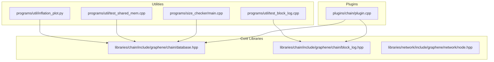
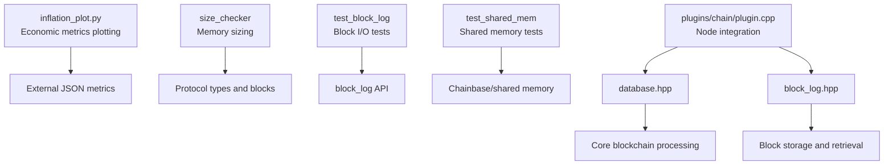
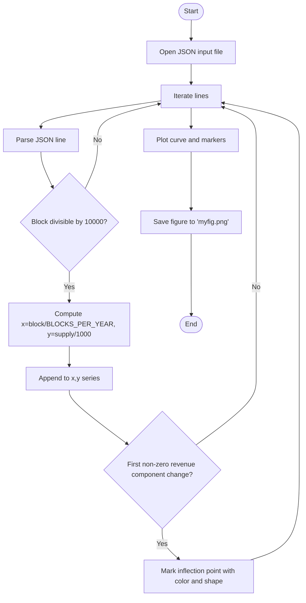
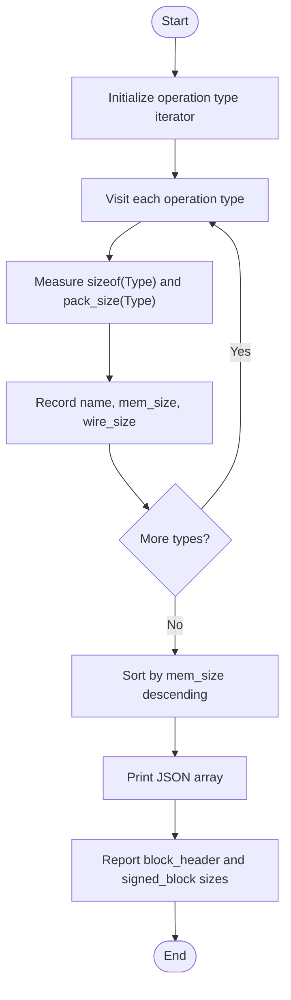
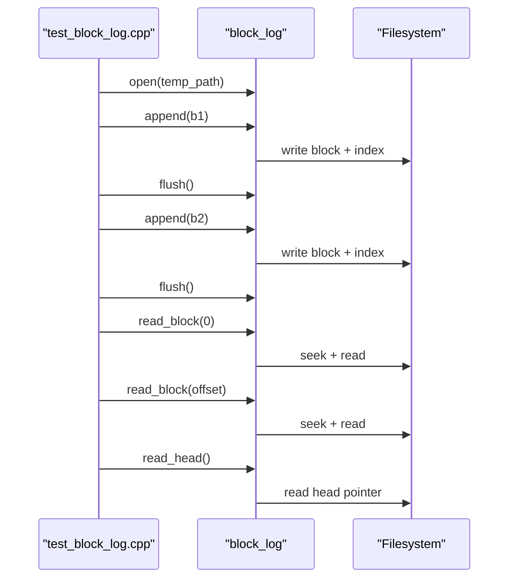
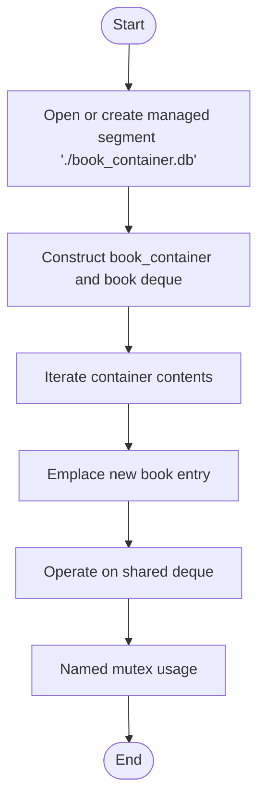
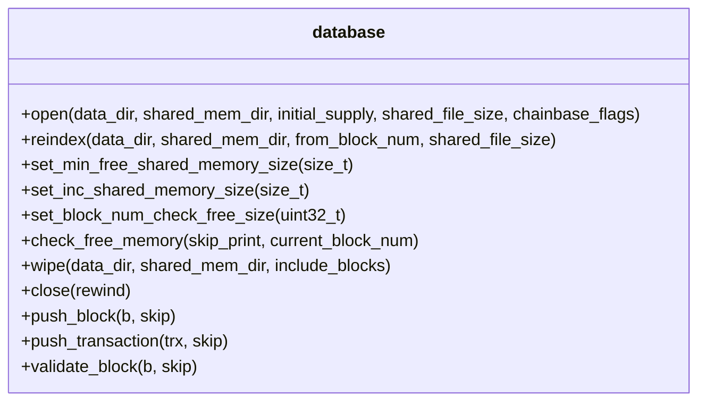
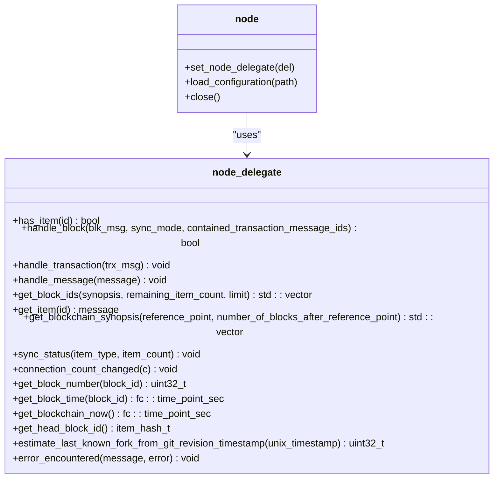
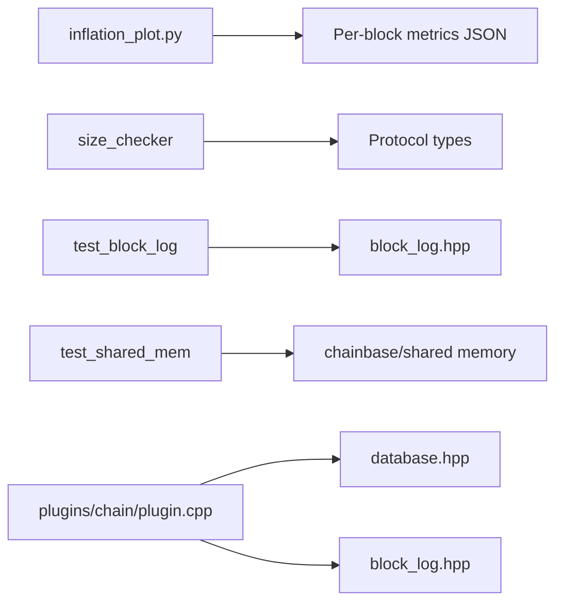

# Performance Profiling Utilities

<cite>
**Referenced Files in This Document**
- [inflation_plot.py](file://programs/util/inflation_plot.py)
- [test_block_log.cpp](file://programs/util/test_block_log.cpp)
- [test_shared_mem.cpp](file://programs/util/test_shared_mem.cpp)
- [main.cpp](file://programs/size_checker/main.cpp)
- [database.hpp](file://libraries/chain/include/graphene/chain/database.hpp)
- [block_log.hpp](file://libraries/chain/include/graphene/chain/block_log.hpp)
- [node.hpp](file://libraries/network/include/graphene/network/node.hpp)
- [database.cpp](file://libraries/chain/database.cpp)
- [plugin.cpp](file://plugins/chain/plugin.cpp)
- [testing.md](file://documentation/testing.md)
- [debug_node_plugin.md](file://documentation/debug_node_plugin.md)
</cite>

## Table of Contents
1. [Introduction](#introduction)
2. [Project Structure](#project-structure)
3. [Core Components](#core-components)
4. [Architecture Overview](#architecture-overview)
5. [Detailed Component Analysis](#detailed-component-analysis)
6. [Dependency Analysis](#dependency-analysis)
7. [Performance Considerations](#performance-considerations)
8. [Troubleshooting Guide](#troubleshooting-guide)
9. [Conclusion](#conclusion)
10. [Appendices](#appendices)

## Introduction
This document describes performance profiling and analysis utilities available in the VIZ CPP Node. It focuses on:
- The inflation_plot.py script for analyzing blockchain economic metrics and inflation patterns
- The size_checker utility for examining memory usage and object sizing within the blockchain database
- Test utilities test_block_log and test_shared_mem for performance benchmarking and memory testing
- Practical performance analysis workflows for identifying memory bottlenecks, measuring transaction processing throughput, and analyzing database performance
- Profiling techniques for blockchain processing, network operations, and database performance
- Guidance on interpreting performance metrics and identifying optimization opportunities
- Integration with external profiling tools and system monitoring approaches

## Project Structure
The performance-related utilities are located under programs/util and programs/size_checker. They complement the core blockchain libraries under libraries/chain and libraries/network, and are integrated into the node via plugins.

**Diagram sources**
- [inflation_plot.py](file://programs/util/inflation_plot.py#L1-L74)
- [test_block_log.cpp](file://programs/util/test_block_log.cpp#L1-L54)
- [test_shared_mem.cpp](file://programs/util/test_shared_mem.cpp#L1-L169)
- [main.cpp](file://programs/size_checker/main.cpp#L1-L85)
- [database.hpp](file://libraries/chain/include/graphene/chain/database.hpp#L1-L200)
- [block_log.hpp](file://libraries/chain/include/graphene/chain/block_log.hpp#L1-L75)
- [node.hpp](file://libraries/network/include/graphene/network/node.hpp#L1-L200)
- [plugin.cpp](file://plugins/chain/plugin.cpp#L23-L322)

**Section sources**
- [inflation_plot.py](file://programs/util/inflation_plot.py#L1-L74)
- [test_block_log.cpp](file://programs/util/test_block_log.cpp#L1-L54)
- [test_shared_mem.cpp](file://programs/util/test_shared_mem.cpp#L1-L169)
- [main.cpp](file://programs/size_checker/main.cpp#L1-L85)
- [database.hpp](file://libraries/chain/include/graphene/chain/database.hpp#L1-L200)
- [block_log.hpp](file://libraries/chain/include/graphene/chain/block_log.hpp#L1-L75)
- [node.hpp](file://libraries/network/include/graphene/network/node.hpp#L1-L200)
- [plugin.cpp](file://plugins/chain/plugin.cpp#L23-L322)

## Core Components
- inflation_plot.py: Reads per-block JSON metrics and plots monetary supply projections with inflection points for economic parameters.
- size_checker: Computes memory and wire sizes for protocol types and blocks, aiding memory footprint analysis.
- test_block_log: Exercises block_log append/read operations for I/O and serialization performance checks.
- test_shared_mem: Validates shared memory container behavior and object sizing for chainbase/shared memory usage.
- Chain database and block_log APIs: Provide the foundational interfaces for performance-sensitive operations.
- Network node interface: Exposes hooks for message propagation timing and peer statistics relevant to network performance.

**Section sources**
- [inflation_plot.py](file://programs/util/inflation_plot.py#L1-L74)
- [main.cpp](file://programs/size_checker/main.cpp#L1-L85)
- [test_block_log.cpp](file://programs/util/test_block_log.cpp#L1-L54)
- [test_shared_mem.cpp](file://programs/util/test_shared_mem.cpp#L1-L169)
- [database.hpp](file://libraries/chain/include/graphene/chain/database.hpp#L1-L200)
- [block_log.hpp](file://libraries/chain/include/graphene/chain/block_log.hpp#L1-L75)
- [node.hpp](file://libraries/network/include/graphene/network/node.hpp#L1-L200)

## Architecture Overview
The performance utilities operate at different layers:
- Economic metrics plotting relies on external JSON input and visualization
- Memory sizing operates on protocol types and block structures
- Block log tests exercise the block storage layer
- Shared memory tests validate chainbase/shared memory behavior
- Plugins integrate these capabilities into the node lifecycle

**Diagram sources**
- [inflation_plot.py](file://programs/util/inflation_plot.py#L1-L74)
- [main.cpp](file://programs/size_checker/main.cpp#L1-L85)
- [test_block_log.cpp](file://programs/util/test_block_log.cpp#L1-L54)
- [test_shared_mem.cpp](file://programs/util/test_shared_mem.cpp#L1-L169)
- [plugin.cpp](file://plugins/chain/plugin.cpp#L23-L322)
- [database.hpp](file://libraries/chain/include/graphene/chain/database.hpp#L1-L200)
- [block_log.hpp](file://libraries/chain/include/graphene/chain/block_log.hpp#L1-L75)

## Detailed Component Analysis

### inflation_plot.py
Purpose:
- Parse per-block JSON records containing block number, supply, and revenue vector
- Plot cumulative supply growth and mark inflection points for economic parameters

Key behaviors:
- Reads a JSON stream line-by-line
- Filters blocks at regular intervals (every 10,000 blocks)
- Converts block numbers to years using a constant blocks-per-year value
- Plots supply on a logarithmic scale with custom tick labels
- Identifies inflection points by detecting changes in revenue vector components

**Diagram sources**
- [inflation_plot.py](file://programs/util/inflation_plot.py#L1-L74)

Interpretation tips:
- Peaks in the supply curve indicate policy changes or hardforks
- Inflection markers highlight shifts in revenue distribution among curators, content creators, producers, liquidity, and proof-of-work
- Logarithmic scale helps visualize long-term trends

Practical usage:
- Generate per-block metrics JSON from node logs or debug outputs
- Run the script to produce a supply projection chart

**Section sources**
- [inflation_plot.py](file://programs/util/inflation_plot.py#L1-L74)

### size_checker
Purpose:
- Measure memory footprint and serialized size of protocol types and blocks
- Aid in optimizing data structures and reducing serialization overhead

Key behaviors:
- Iterates through operation types and computes in-memory and packed sizes
- Sorts types by memory size to highlight heavy-weight structures
- Prints JSON array of type metadata for further analysis
- Reports block header and signed block sizes

**Diagram sources**
- [main.cpp](file://programs/size_checker/main.cpp#L1-L85)

Interpretation tips:
- Types with large memory or wire sizes are candidates for optimization
- Compare mem_size vs wire_size to identify over-allocation or inefficient packing
- Use reported block sizes to estimate transaction and block overhead

Practical usage:
- Build and run the utility to generate a size report
- Review sorted types to prioritize refactoring efforts

**Section sources**
- [main.cpp](file://programs/size_checker/main.cpp#L1-L85)

### test_block_log
Purpose:
- Exercise block_log append and read operations to evaluate I/O and serialization performance
- Validate block storage behavior under controlled conditions

Key behaviors:
- Opens a temporary block log
- Appends two test blocks, flushes, and verifies head updates
- Reads back stored blocks and compares packed sizes
- Demonstrates typical block_log usage patterns

**Diagram sources**
- [test_block_log.cpp](file://programs/util/test_block_log.cpp#L1-L54)
- [block_log.hpp](file://libraries/chain/include/graphene/chain/block_log.hpp#L1-L75)

Interpretation tips:
- Monitor flush frequency and block sizes to tune I/O performance
- Use read timings to estimate storage latency and throughput
- Validate that offsets and indices are correctly maintained

Practical usage:
- Run the test to verify block_log operations
- Extend with timing measurements for performance profiling

**Section sources**
- [test_block_log.cpp](file://programs/util/test_block_log.cpp#L1-L54)
- [block_log.hpp](file://libraries/chain/include/graphene/chain/block_log.hpp#L1-L75)

### test_shared_mem
Purpose:
- Validate shared memory container behavior and object sizing for chainbase/shared memory usage
- Aid in diagnosing memory allocation and fragmentation issues

Key behaviors:
- Creates or opens a managed mapped file segment
- Constructs a multi-index container of shared_string-backed book objects
- Emplaces entries and manipulates a deque within shared memory
- Uses named mutex for synchronization

**Diagram sources**
- [test_shared_mem.cpp](file://programs/util/test_shared_mem.cpp#L1-L169)

Interpretation tips:
- Verify that shared memory limits are respected and allocations succeed
- Monitor container growth and memory usage patterns
- Ensure proper synchronization with named mutexes

Practical usage:
- Run the test to validate shared memory setup
- Extend with memory profiling and allocation tracing

**Section sources**
- [test_shared_mem.cpp](file://programs/util/test_shared_mem.cpp#L1-L169)

### Blockchain Processing and Database Performance Hooks
The chain database exposes several performance-relevant controls and flags:
- Validation step flags for selective validation to reduce overhead during reindex or specialized operations
- Shared memory management functions to monitor and adjust free memory thresholds
- Methods to open/reindex databases with configurable shared memory sizes

**Diagram sources**
- [database.hpp](file://libraries/chain/include/graphene/chain/database.hpp#L1-L200)
- [database.cpp](file://libraries/chain/database.cpp#L351-L413)

Interpretation tips:
- Use validation step flags to disable expensive checks during benchmarking
- Tune shared memory parameters to avoid frequent resizing and improve cache locality
- Monitor free memory checks to detect potential bottlenecks

**Section sources**
- [database.hpp](file://libraries/chain/include/graphene/chain/database.hpp#L56-L108)
- [database.cpp](file://libraries/chain/database.cpp#L351-L413)

### Network Operations Performance Hooks
The network node interface supports message propagation timing and peer statistics:
- Message propagation data structure captures received and validated timestamps
- Peer status provides endpoint and variant information for diagnostics
- Node delegate callbacks for block and transaction handling expose timing-sensitive entry points

**Diagram sources**
- [node.hpp](file://libraries/network/include/graphene/network/node.hpp#L1-L200)

Interpretation tips:
- Track message propagation delays to identify network bottlenecks
- Monitor peer counts and sync status to assess network health
- Use delegate callbacks to instrument timing around block and transaction processing

**Section sources**
- [node.hpp](file://libraries/network/include/graphene/network/node.hpp#L48-L166)

## Dependency Analysis
The performance utilities depend on core library APIs and are integrated via plugins:
- inflation_plot.py depends on external JSON metrics and matplotlib
- size_checker depends on protocol type definitions and fc serialization
- test_block_log depends on block_log API
- test_shared_mem depends on chainbase and boost interprocess
- Plugins initialize and configure database and block log behavior

**Diagram sources**
- [inflation_plot.py](file://programs/util/inflation_plot.py#L1-L74)
- [main.cpp](file://programs/size_checker/main.cpp#L1-L85)
- [test_block_log.cpp](file://programs/util/test_block_log.cpp#L1-L54)
- [test_shared_mem.cpp](file://programs/util/test_shared_mem.cpp#L1-L169)
- [plugin.cpp](file://plugins/chain/plugin.cpp#L23-L322)
- [database.hpp](file://libraries/chain/include/graphene/chain/database.hpp#L1-L200)
- [block_log.hpp](file://libraries/chain/include/graphene/chain/block_log.hpp#L1-L75)

**Section sources**
- [plugin.cpp](file://plugins/chain/plugin.cpp#L23-L322)
- [database.hpp](file://libraries/chain/include/graphene/chain/database.hpp#L1-L200)
- [block_log.hpp](file://libraries/chain/include/graphene/chain/block_log.hpp#L1-L75)

## Performance Considerations
- Memory footprint
  - Use size_checker to identify large protocol types and blocks
  - Optimize data structures and reduce unnecessary fields
  - Monitor shared memory growth and tune increment sizes
- Storage I/O
  - Profile block_log append/read operations with test_block_log
  - Adjust flush policies and block sizes to balance durability and throughput
- Network latency
  - Instrument message propagation timing via node delegate callbacks
  - Monitor peer counts and sync status to detect network congestion
- Validation overhead
  - Apply validation step flags selectively during benchmarks
  - Disable non-essential checks for synthetic workloads

[No sources needed since this section provides general guidance]

## Troubleshooting Guide
Common issues and resolutions:
- Memory pressure during reindex
  - Increase shared memory size and adjust minimum free memory thresholds
  - Use validation step flags to reduce overhead
- Slow block log operations
  - Verify flush policies and filesystem performance
  - Benchmark with test_block_log to isolate bottlenecks
- Shared memory allocation failures
  - Validate segment creation and capacity
  - Use test_shared_mem to confirm container behavior
- Network performance anomalies
  - Inspect message propagation delays and peer status
  - Use node delegate hooks to capture timing data

**Section sources**
- [database.cpp](file://libraries/chain/database.cpp#L351-L413)
- [test_block_log.cpp](file://programs/util/test_block_log.cpp#L1-L54)
- [test_shared_mem.cpp](file://programs/util/test_shared_mem.cpp#L1-L169)
- [node.hpp](file://libraries/network/include/graphene/network/node.hpp#L48-L166)

## Conclusion
The VIZ CPP Node provides focused utilities for performance profiling across economic metrics, memory sizing, block storage, and shared memory behavior. Combined with plugin-driven configuration and core library APIs, these tools enable targeted analysis and optimization of blockchain processing, network operations, and database performance.

[No sources needed since this section summarizes without analyzing specific files]

## Appendices

### Practical Workflows

- Identifying memory bottlenecks
  - Run size_checker to obtain type size reports
  - Focus on top-heavy types and reduce field sizes or packing overhead
  - Monitor shared memory usage and adjust thresholds via database configuration

- Measuring transaction processing throughput
  - Use debug_node plugin to generate synthetic blocks and transactions
  - Instrument node delegate callbacks to capture timing around block and transaction handling
  - Compare metrics across different validation step configurations

- Analyzing database performance
  - Use test_block_log to profile append/read latencies
  - Evaluate block sizes and flush frequencies
  - Monitor free memory checks and shared memory growth during extended runs

**Section sources**
- [debug_node_plugin.md](file://documentation/debug_node_plugin.md#L50-L134)
- [node.hpp](file://libraries/network/include/graphene/network/node.hpp#L48-L166)
- [test_block_log.cpp](file://programs/util/test_block_log.cpp#L1-L54)
- [database.cpp](file://libraries/chain/database.cpp#L351-L413)

### Integration with External Tools and Monitoring
- Code coverage and profiling
  - Use lcov-based workflow for coverage capture and reporting
  - Combine with unit test targets for comprehensive coverage analysis

- System monitoring
  - Track CPU, memory, and I/O metrics during utility runs
  - Correlate metrics with block log and shared memory operations

**Section sources**
- [testing.md](file://documentation/testing.md#L26-L43)