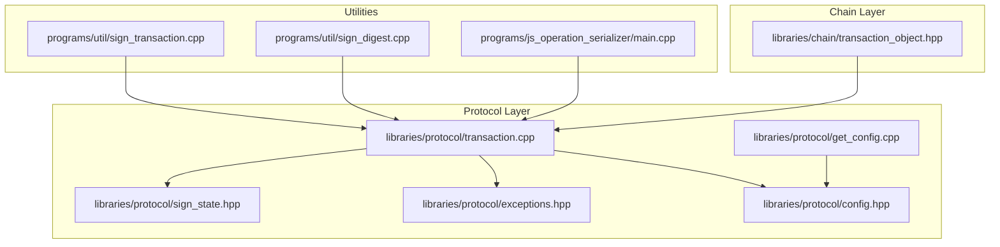
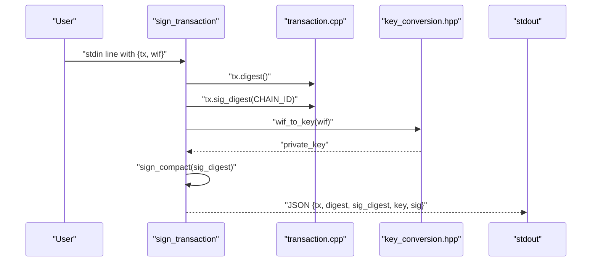
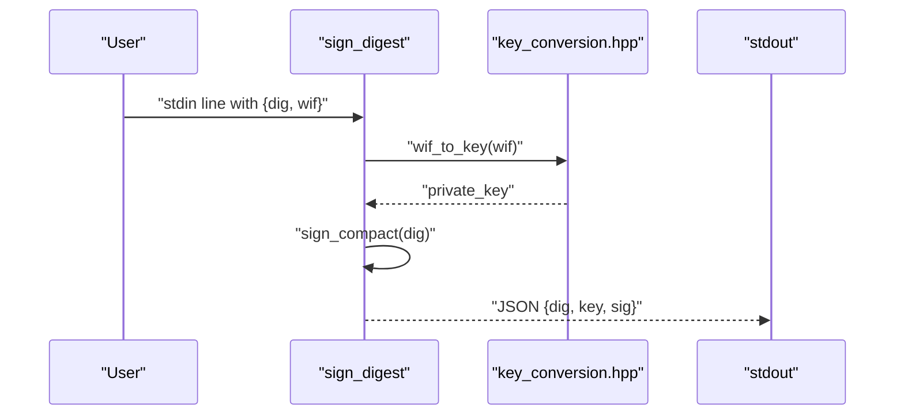
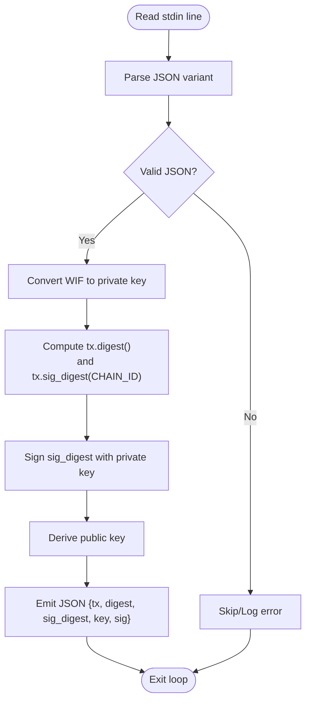
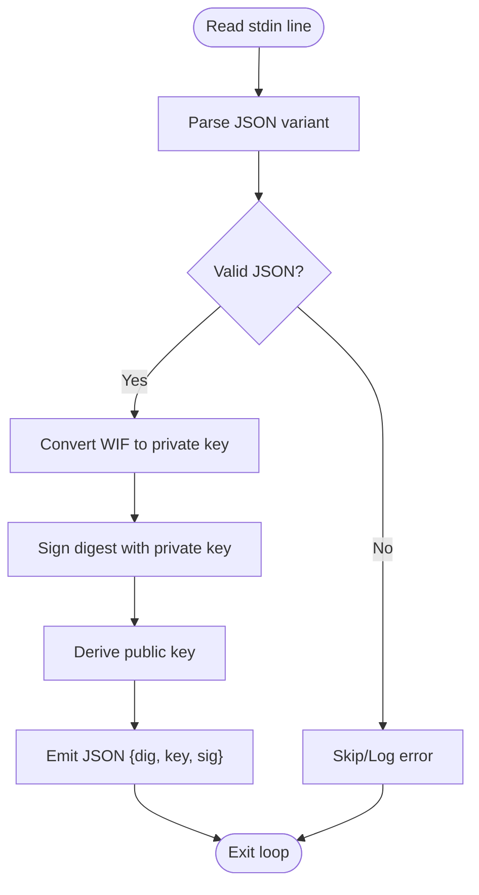
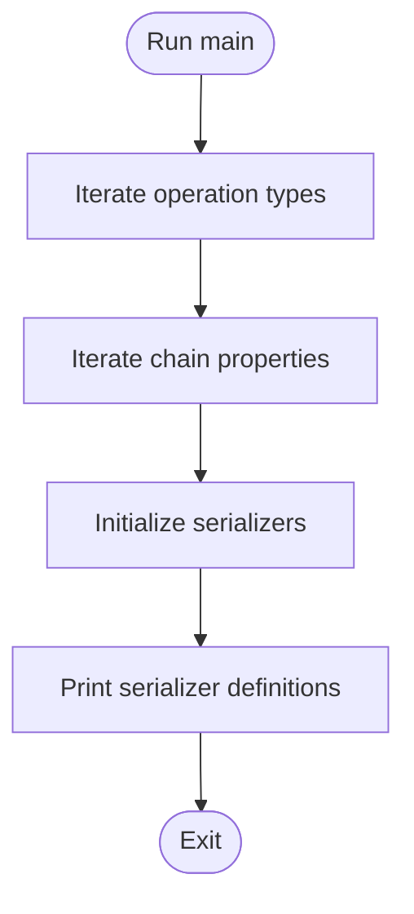
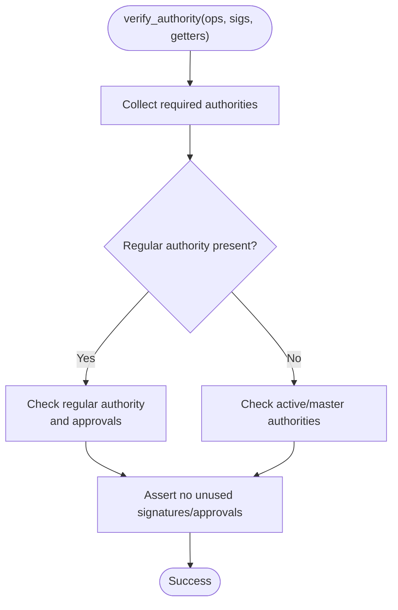
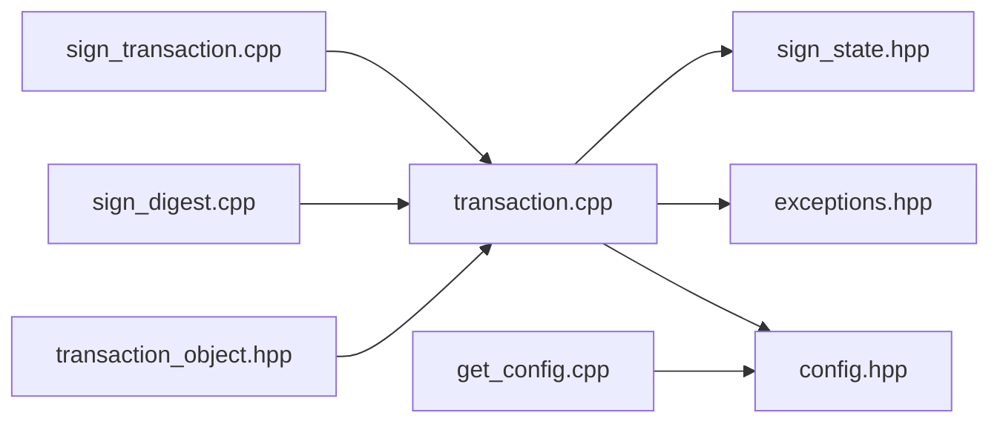

# Transaction Debugging Tools

<cite>
**Referenced Files in This Document**
- [sign_transaction.cpp](file://programs/util/sign_transaction.cpp)
- [sign_digest.cpp](file://programs/util/sign_digest.cpp)
- [main.cpp](file://programs/js_operation_serializer/main.cpp)
- [transaction.cpp](file://libraries/protocol/transaction.cpp)
- [sign_state.hpp](file://libraries/protocol/sign_state.hpp)
- [exceptions.hpp](file://libraries/protocol/exceptions.hpp)
- [config.hpp](file://libraries/protocol/include/graphene/protocol/config.hpp)
- [get_config.cpp](file://libraries/protocol/get_config.cpp)
- [transaction_object.hpp](file://libraries/chain/transaction_object.hpp)
</cite>

## Table of Contents
1. [Introduction](#introduction)
2. [Project Structure](#project-structure)
3. [Core Components](#core-components)
4. [Architecture Overview](#architecture-overview)
5. [Detailed Component Analysis](#detailed-component-analysis)
6. [Dependency Analysis](#dependency-analysis)
7. [Performance Considerations](#performance-considerations)
8. [Troubleshooting Guide](#troubleshooting-guide)
9. [Conclusion](#conclusion)
10. [Appendices](#appendices)

## Introduction
This document provides comprehensive documentation for transaction debugging utilities in the VIZ C++ Node. It focuses on three primary tools:
- sign_transaction: a command-line utility to debug transaction signing issues by computing digests and generating signatures from WIF keys.
- sign_digest: a command-line utility to debug cryptographic operations and signature verification processes by signing arbitrary SHA256 digests.
- JavaScript operation serializer: a utility to convert between JSON and binary operation formats for inspection and debugging.

It also covers transaction validation, authority verification, and common error scenarios encountered during transaction construction, signing, and network transmission.

## Project Structure
The transaction debugging tools reside under the programs/util directory and the programs/js_operation_serializer directory. Supporting protocol and chain logic is located under libraries/protocol and libraries/chain.

**Diagram sources**
- [sign_transaction.cpp](file://programs/util/sign_transaction.cpp#L1-L54)
- [sign_digest.cpp](file://programs/util/sign_digest.cpp#L1-L49)
- [main.cpp](file://programs/js_operation_serializer/main.cpp#L1-L531)
- [transaction.cpp](file://libraries/protocol/transaction.cpp#L1-L361)
- [sign_state.hpp](file://libraries/protocol/sign_state.hpp#L1-L45)
- [exceptions.hpp](file://libraries/protocol/exceptions.hpp#L1-L116)
- [config.hpp](file://libraries/protocol/config.hpp#L1-L169)
- [get_config.cpp](file://libraries/protocol/get_config.cpp#L1-L78)
- [transaction_object.hpp](file://libraries/chain/transaction_object.hpp#L1-L56)

**Section sources**
- [sign_transaction.cpp](file://programs/util/sign_transaction.cpp#L1-L54)
- [sign_digest.cpp](file://programs/util/sign_digest.cpp#L1-L49)
- [main.cpp](file://programs/js_operation_serializer/main.cpp#L1-L531)
- [transaction.cpp](file://libraries/protocol/transaction.cpp#L1-L361)
- [sign_state.hpp](file://libraries/protocol/sign_state.hpp#L1-L45)
- [exceptions.hpp](file://libraries/protocol/exceptions.hpp#L1-L116)
- [config.hpp](file://libraries/protocol/config.hpp#L1-L169)
- [get_config.cpp](file://libraries/protocol/get_config.cpp#L1-L78)
- [transaction_object.hpp](file://libraries/chain/transaction_object.hpp#L1-L56)

## Core Components
- sign_transaction: Reads transaction and WIF key from stdin, computes transaction digest and signature digest bound to the chain ID, signs with the private key, and prints a JSON result containing the original transaction, computed digests, public key, and signature.
- sign_digest: Reads a SHA256 digest and WIF key from stdin, signs the digest with the private key, and prints a JSON result containing the digest, public key, and signature.
- JavaScript operation serializer: Generates JavaScript serializers for operations and chain properties, enabling inspection of binary-to-JSON conversion behavior.

Key input/output formats:
- Both utilities consume one JSON object per line via stdin and emit one JSON object per line to stdout.
- sign_transaction expects an object with a transaction field and a WIF key string; it emits an object with transaction, digest, sig_digest, key, and sig.
- sign_digest expects an object with a hex SHA256 digest string and a WIF key string; it emits an object with the digest, key, and sig.

Common error scenarios:
- Malformed JSON input lines.
- Invalid WIF key or mismatched chain ID.
- Transaction validation failures (e.g., missing operations, invalid authority combinations).
- Duplicate or irrelevant signatures during authority verification.

**Section sources**
- [sign_transaction.cpp](file://programs/util/sign_transaction.cpp#L12-L26)
- [sign_digest.cpp](file://programs/util/sign_digest.cpp#L12-L24)
- [transaction.cpp](file://libraries/protocol/transaction.cpp#L30-L36)
- [exceptions.hpp](file://libraries/protocol/exceptions.hpp#L54-L115)

## Architecture Overview
The signing utilities integrate with the protocol layer to compute digests and signatures, and leverage the chain layer for transaction storage and duplicate detection.

**Diagram sources**
- [sign_transaction.cpp](file://programs/util/sign_transaction.cpp#L28-L51)
- [transaction.cpp](file://libraries/protocol/transaction.cpp#L17-L28)
- [config.hpp](file://libraries/protocol/config.hpp#L9-L9)

**Diagram sources**
- [sign_digest.cpp](file://programs/util/sign_digest.cpp#L26-L46)

## Detailed Component Analysis

### sign_transaction Tool
Purpose:
- Debug transaction signing by computing digests and verifying signatures against a given chain ID.

Command-line usage:
- Standard input: newline-separated JSON objects with fields:
  - tx: a transaction object
  - wif: a WIF-encoded private key string
- Standard output: newline-separated JSON objects with fields:
  - tx: the original transaction
  - digest: transaction digest
  - sig_digest: signature digest bound to chain ID
  - key: public key derived from WIF
  - sig: compact signature

Processing logic:
- Parse each input line as JSON.
- Convert WIF to a private key.
- Compute transaction digest and signature digest bound to the chain ID.
- Sign the signature digest with the private key.
- Emit the result as JSON.

**Diagram sources**
- [sign_transaction.cpp](file://programs/util/sign_transaction.cpp#L28-L51)

**Section sources**
- [sign_transaction.cpp](file://programs/util/sign_transaction.cpp#L12-L26)
- [sign_transaction.cpp](file://programs/util/sign_transaction.cpp#L28-L51)
- [transaction.cpp](file://libraries/protocol/transaction.cpp#L17-L28)
- [config.hpp](file://libraries/protocol/config.hpp#L9-L9)

### sign_digest Tool
Purpose:
- Debug cryptographic operations and signature verification by signing arbitrary SHA256 digests.

Command-line usage:
- Standard input: newline-separated JSON objects with fields:
  - dig: a hex-encoded SHA256 digest string
  - wif: a WIF-encoded private key string
- Standard output: newline-separated JSON objects with fields:
  - dig: the input digest
  - key: public key derived from WIF
  - sig: compact signature

Processing logic:
- Parse each input line as JSON.
- Convert WIF to a private key.
- Sign the digest with the private key.
- Emit the result as JSON.

**Diagram sources**
- [sign_digest.cpp](file://programs/util/sign_digest.cpp#L26-L46)

**Section sources**
- [sign_digest.cpp](file://programs/util/sign_digest.cpp#L12-L24)
- [sign_digest.cpp](file://programs/util/sign_digest.cpp#L26-L46)

### JavaScript Operation Serializer
Purpose:
- Generate JavaScript serializers for operations and chain properties to inspect binary-to-JSON conversion behavior.

Command-line usage:
- No command-line options; runs and prints generated JavaScript serializer definitions to stdout.

Processing logic:
- Iterates through operation types and chain properties.
- Generates serializer definitions for each type, printing them to stdout.

**Diagram sources**
- [main.cpp](file://programs/js_operation_serializer/main.cpp#L495-L531)

**Section sources**
- [main.cpp](file://programs/js_operation_serializer/main.cpp#L495-L531)

### Transaction Validation and Authority Verification
Validation:
- Transactions must contain at least one operation.
- Each operation undergoes validation checks.

Authority verification:
- The verify_authority function computes required authorities and validates provided signatures and approvals.
- It distinguishes between regular, active, and master authorities and enforces mutual exclusivity rules.
- It reports missing authorities and unused signatures/approvals.

**Diagram sources**
- [transaction.cpp](file://libraries/protocol/transaction.cpp#L94-L222)

**Section sources**
- [transaction.cpp](file://libraries/protocol/transaction.cpp#L30-L36)
- [transaction.cpp](file://libraries/protocol/transaction.cpp#L94-L222)
- [sign_state.hpp](file://libraries/protocol/sign_state.hpp#L10-L42)
- [exceptions.hpp](file://libraries/protocol/exceptions.hpp#L58-L115)

## Dependency Analysis
The signing utilities depend on the protocol layer for digest computation and signature generation. The chain layer provides transaction storage and duplicate detection mechanisms.

**Diagram sources**
- [sign_transaction.cpp](file://programs/util/sign_transaction.cpp#L10-L10)
- [sign_digest.cpp](file://programs/util/sign_digest.cpp#L10-L10)
- [transaction.cpp](file://libraries/protocol/transaction.cpp#L1-L3)
- [sign_state.hpp](file://libraries/protocol/sign_state.hpp#L1-L45)
- [exceptions.hpp](file://libraries/protocol/exceptions.hpp#L1-L116)
- [config.hpp](file://libraries/protocol/config.hpp#L1-L169)
- [get_config.cpp](file://libraries/protocol/get_config.cpp#L1-L78)
- [transaction_object.hpp](file://libraries/chain/transaction_object.hpp#L1-L56)

**Section sources**
- [sign_transaction.cpp](file://programs/util/sign_transaction.cpp#L10-L10)
- [sign_digest.cpp](file://programs/util/sign_digest.cpp#L10-L10)
- [transaction.cpp](file://libraries/protocol/transaction.cpp#L1-L3)
- [transaction_object.hpp](file://libraries/chain/transaction_object.hpp#L1-L56)

## Performance Considerations
- Both utilities process input line-by-line, suitable for streaming large sets of transactions or digests.
- Digest computations and ECDSA signatures are CPU-bound; batching multiple inputs per invocation reduces overhead.
- For large-scale debugging, consider precomputing digests and reusing WIF keys to minimize repeated conversions.

## Troubleshooting Guide
Common transaction validation failures:
- Missing operations: Ensure the transaction contains at least one operation.
- Invalid authority combinations: Regular authority cannot be mixed with active/master authority in the same transaction.

Signature verification problems:
- Duplicate signatures: Detected during signature key extraction; remove duplicates.
- Irrelevant signatures: Unused signatures cause verification failure; remove before submission.
- Missing required authorities: Add signatures from required authorities or adjust approvals.

Serialization issues:
- Use the JavaScript operation serializer to inspect operation and chain property serializers and confirm binary-to-JSON mapping.

Network transmission issues:
- Verify the chain ID matches the target network; mismatches prevent successful broadcast.
- Confirm transaction size does not exceed limits and expiration is set appropriately.

Practical examples:
- Transaction construction errors: Validate operations individually and ensure correct field types/values.
- Authority verification failures: Use sign_transaction to generate expected signatures and compare with provided ones.
- Serialization issues: Compare JSON vs. binary representation using the JavaScript operation serializer.

**Section sources**
- [transaction.cpp](file://libraries/protocol/transaction.cpp#L30-L36)
- [transaction.cpp](file://libraries/protocol/transaction.cpp#L225-L237)
- [transaction.cpp](file://libraries/protocol/transaction.cpp#L76-L92)
- [exceptions.hpp](file://libraries/protocol/exceptions.hpp#L58-L115)
- [config.hpp](file://libraries/protocol/config.hpp#L9-L9)
- [get_config.cpp](file://libraries/protocol/get_config.cpp#L28-L28)

## Conclusion
The transaction debugging utilities provide focused capabilities to validate signing, cryptographic operations, and serialization. By leveraging the protocol and chain layers, developers can isolate issues in transaction construction, authority verification, and network compatibility. Use the troubleshooting guide to systematically address common problems and improve reliability in production environments.

## Appendices
- Chain ID: The chain ID is derived from the chain name and is used to bind signatures to the correct network.
- Transaction storage: Duplicate detection relies on storing packed transactions with expiration timestamps.

**Section sources**
- [config.hpp](file://libraries/protocol/config.hpp#L9-L9)
- [transaction_object.hpp](file://libraries/chain/transaction_object.hpp#L19-L35)