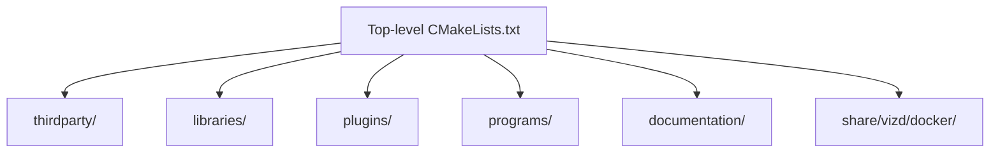
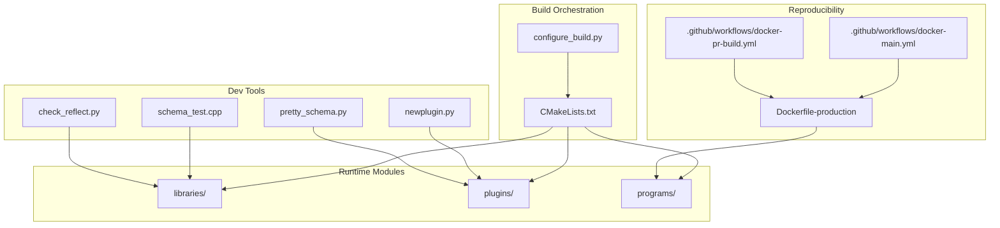
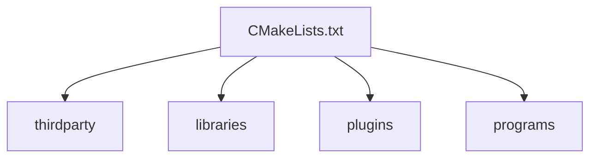

# Development Tools

<cite>
**Referenced Files in This Document**
- [README.md](file://README.md)
- [CMakeLists.txt](file://CMakeLists.txt)
- [documentation/building.md](file://documentation/building.md)
- [documentation/testing.md](file://documentation/testing.md)
- [documentation/git_guildelines.md](file://documentation/git_guildelines.md)
- [documentation/plugin.md](file://documentation/plugin.md)
- [documentation/debug_node_plugin.md](file://documentation/debug_node_plugin.md)
- [share/vizd/docker/Dockerfile-production](file://share/vizd/docker/Dockerfile-production)
- [.github/workflows/docker-main.yml](file://.github/workflows/docker-main.yml)
- [.github/workflows/docker-pr-build.yml](file://.github/workflows/docker-pr-build.yml)
- [programs/build_helpers/configure_build.py](file://programs/build_helpers/configure_build.py)
- [programs/build_helpers/check_reflect.py](file://programs/build_helpers/check_reflect.py)
- [programs/util/newplugin.py](file://programs/util/newplugin.py)
- [programs/util/schema_test.cpp](file://programs/util/schema_test.cpp)
- [programs/util/pretty_schema.py](file://programs/util/pretty_schema.py)
- [programs/js_operation_serializer/main.cpp](file://programs/js_operation_serializer/main.cpp)
</cite>

## Table of Contents
1. [Introduction](#introduction)
2. [Project Structure](#project-structure)
3. [Core Components](#core-components)
4. [Architecture Overview](#architecture-overview)
5. [Detailed Component Analysis](#detailed-component-analysis)
6. [Dependency Analysis](#dependency-analysis)
7. [Performance Considerations](#performance-considerations)
8. [Troubleshooting Guide](#troubleshooting-guide)
9. [Conclusion](#conclusion)
10. [Appendices](#appendices)

## Introduction
This document describes the complete development toolkit for VIZ CPP Node, focusing on the CMake build system, cross-platform compilation, Docker-based development environments, testing frameworks, debugging tools, and development workflow. It also covers code generation utilities, schema validation helpers, and practical examples for common development tasks such as building custom plugins, running tests, and profiling performance. The goal is to make the development toolchain accessible to contributors while providing sufficient technical depth for advanced tasks.

## Project Structure
The repository is organized around a layered structure:
- Top-level CMake configuration orchestrates thirdparty, libraries, plugins, and programs.
- Libraries implement core blockchain logic (chain, protocol, network, utilities, wallet).
- Plugins provide modular features (e.g., chain, debug_node, p2p, webserver).
- Programs include the node daemon, CLI wallet, utilities, and build helpers.
- Documentation provides build, testing, plugin, and debugging guides.
- Dockerfiles and CI workflows support reproducible builds and automated testing.

**Diagram sources**
- [CMakeLists.txt](file://CMakeLists.txt#L210-L214)
- [README.md](file://README.md#L1-L53)

**Section sources**
- [CMakeLists.txt](file://CMakeLists.txt#L1-L277)
- [README.md](file://README.md#L1-L53)

## Core Components
- Build system: CMake with platform-specific flags, coverage, and optional components (e.g., MongoDB plugin).
- Cross-compilation helper: configure_build.py supports Windows cross-compilation and custom Boost/OpenSSL roots.
- Plugin system: automatic discovery of internal plugins and support for external plugins.
- Testing: unit tests via chain_test with configurable runtime options and coverage reporting.
- Debugging: debug_node plugin for state simulation and API experimentation.
- Utilities: schema inspection, pretty-printing JSON schema, JS operation serializer, and plugin scaffolding.

**Section sources**
- [CMakeLists.txt](file://CMakeLists.txt#L52-L89)
- [programs/build_helpers/configure_build.py](file://programs/build_helpers/configure_build.py#L143-L196)
- [documentation/plugin.md](file://documentation/plugin.md#L1-L28)
- [documentation/testing.md](file://documentation/testing.md#L1-L43)
- [documentation/debug_node_plugin.md](file://documentation/debug_node_plugin.md#L1-L134)
- [programs/util/schema_test.cpp](file://programs/util/schema_test.cpp#L1-L57)
- [programs/util/pretty_schema.py](file://programs/util/pretty_schema.py#L1-L28)
- [programs/js_operation_serializer/main.cpp](file://programs/js_operation_serializer/main.cpp#L1-L531)
- [programs/util/newplugin.py](file://programs/util/newplugin.py#L1-L251)

## Architecture Overview
The development architecture integrates build orchestration, modular plugins, and reproducible environments:
- CMake discovers libraries, plugins, and programs, enabling conditional compilation and platform-specific flags.
- Dockerfiles encapsulate build environments for production and testnet scenarios.
- CI workflows automate Docker image builds for main and PR contexts.
- Utilities and scripts streamline plugin creation, reflection checks, and schema validation.

**Diagram sources**
- [CMakeLists.txt](file://CMakeLists.txt#L210-L214)
- [programs/build_helpers/configure_build.py](file://programs/build_helpers/configure_build.py#L143-L196)
- [programs/util/newplugin.py](file://programs/util/newplugin.py#L225-L247)
- [programs/util/schema_test.cpp](file://programs/util/schema_test.cpp#L44-L56)
- [programs/util/pretty_schema.py](file://programs/util/pretty_schema.py#L9-L27)
- [programs/build_helpers/check_reflect.py](file://programs/build_helpers/check_reflect.py#L107-L160)
- [share/vizd/docker/Dockerfile-production](file://share/vizd/docker/Dockerfile-production#L1-L88)
- [.github/workflows/docker-main.yml](file://.github/workflows/docker-main.yml)
- [.github/workflows/docker-pr-build.yml](file://.github/workflows/docker-pr-build.yml)

## Detailed Component Analysis

### CMake Build System
Key characteristics:
- Enforces minimum compiler versions for GCC and Clang.
- Supports compile-time options such as BUILD_TESTNET, LOW_MEMORY_NODE, CHAINBASE_CHECK_LOCKING, and ENABLE_MONGO_PLUGIN.
- Enables ccache globally when available.
- Adds subdirectories for thirdparty, libraries, plugins, and programs.
- Provides coverage flags via ENABLE_COVERAGE_TESTING.

Common build options and flags:
- CMAKE_BUILD_TYPE: Release or Debug.
- LOW_MEMORY_NODE: Build a consensus-only node.
- BUILD_TESTNET: Configure for test network.
- CHAINBASE_CHECK_LOCKING: Enable lock checking in chainbase.
- ENABLE_MONGO_PLUGIN: Include MongoDB plugin.
- ENABLE_COVERAGE_TESTING: Enable coverage instrumentation.

Cross-platform flags:
- Windows (MSVC/Mingw): Compiler and linker flags, static linking options, and MSVC-specific settings.
- macOS/Linux: Standard C++14 flags, platform-specific libraries, and Ninja diagnostics.

**Section sources**
- [CMakeLists.txt](file://CMakeLists.txt#L11-L20)
- [CMakeLists.txt](file://CMakeLists.txt#L56-L89)
- [CMakeLists.txt](file://CMakeLists.txt#L106-L110)
- [CMakeLists.txt](file://CMakeLists.txt#L112-L202)
- [CMakeLists.txt](file://CMakeLists.txt#L204-L208)
- [CMakeLists.txt](file://CMakeLists.txt#L210-L214)

### Cross-Platform Compilation and Docker Environments
- Platform-specific instructions and dependencies are documented for Ubuntu, macOS, and Windows (where applicable).
- Dockerfiles define reproducible builds for production and testnet, including dependency installation, submodule initialization, and staged builds.

Practical steps:
- Use configure_build.py to simplify cross-compilation and environment setup.
- Build Docker images for production or testnet using provided Dockerfiles.

**Section sources**
- [documentation/building.md](file://documentation/building.md#L1-L212)
- [programs/build_helpers/configure_build.py](file://programs/build_helpers/configure_build.py#L143-L196)
- [share/vizd/docker/Dockerfile-production](file://share/vizd/docker/Dockerfile-production#L1-L88)

### Testing Framework
- Unit tests are built via chain_test and executed to validate basic, block, operation, serialization, and time-dependent functionality.
- Runtime configuration supports log levels, report levels, and selective test execution.
- Coverage testing is supported with lcov integration.

Recommended workflow:
- Build chain_test with CMake.
- Run tests with desired runtime options.
- Capture coverage data and generate HTML reports.

**Section sources**
- [documentation/testing.md](file://documentation/testing.md#L1-L43)

### Debugging Tools
- debug_node plugin enables “what-if” simulations by editing chain state locally, generating blocks, and manipulating accounts for testing.
- Provides RPC methods for loading blocks, generating blocks, and updating objects.
- Use with caution: changes are local and do not affect the live network.

Typical usage:
- Configure RPC and plugin exposure carefully.
- Load historical blocks and simulate conditions.
- Experiment with account keys and transactions.

**Section sources**
- [documentation/debug_node_plugin.md](file://documentation/debug_node_plugin.md#L1-L134)

### Plugin Development Toolkit
- Internal plugins are discovered automatically; external plugins can be added to a dedicated directory and built seamlessly.
- newplugin.py generates boilerplate for custom plugins with API registration and factory registration.

Workflow:
- Run newplugin.py to scaffold a plugin.
- Implement plugin lifecycle hooks and API methods.
- Register APIs and connect to chain events.

**Section sources**
- [documentation/plugin.md](file://documentation/plugin.md#L1-L28)
- [programs/util/newplugin.py](file://programs/util/newplugin.py#L225-L247)

### Transaction Serialization Utilities
- js_operation_serializer produces JavaScript-friendly serializers for operations and chain objects.
- Useful for front-end tooling and schema validation.

Usage:
- Build and run the utility to emit serializers for operations and chain properties.

**Section sources**
- [programs/js_operation_serializer/main.cpp](file://programs/js_operation_serializer/main.cpp#L495-L531)

### Schema Validation and Reflection Checks
- schema_test.cpp inspects and prints schema metadata for chain objects.
- pretty_schema.py fetches and prettifies JSON schema from a running node’s debug_node API.
- check_reflect.py validates FC_REFLECT declarations against Doxygen class member lists.

Integration:
- Use schema_test.cpp to inspect object schemas during development.
- Use pretty_schema.py to obtain human-readable schema definitions.
- Use check_reflect.py to ensure reflection and documentation remain synchronized.

**Section sources**
- [programs/util/schema_test.cpp](file://programs/util/schema_test.cpp#L44-L56)
- [programs/util/pretty_schema.py](file://programs/util/pretty_schema.py#L9-L27)
- [programs/build_helpers/check_reflect.py](file://programs/build_helpers/check_reflect.py#L107-L160)

### Development Workflow and CI
- Git branching follows a model with master and develop, with strict policies for pull requests, reviews, and tagging.
- CI workflows build Docker images for main and PR contexts to ensure reproducibility.

Best practices:
- Branch from develop, keep commits focused, and ensure tests pass.
- Use PRs for code review and automated checks.
- Leverage Docker images for consistent environments.

**Section sources**
- [documentation/git_guildelines.md](file://documentation/git_guildelines.md#L1-L111)
- [.github/workflows/docker-main.yml](file://.github/workflows/docker-main.yml)
- [.github/workflows/docker-pr-build.yml](file://.github/workflows/docker-pr-build.yml)

## Dependency Analysis
The build system composes the project from multiple subprojects. The top-level CMake adds subdirectories for thirdparty, libraries, plugins, and programs. Conditional options influence which components are compiled and linked.

**Diagram sources**
- [CMakeLists.txt](file://CMakeLists.txt#L210-L214)

**Section sources**
- [CMakeLists.txt](file://CMakeLists.txt#L210-L214)

## Performance Considerations
- Use Release builds for performance-sensitive tasks.
- Enable coverage only when profiling or auditing code coverage.
- Consider LOW_MEMORY_NODE for resource-constrained environments (e.g., witnesses).
- Use Docker images to standardize environments and avoid performance regressions caused by local toolchain differences.

[No sources needed since this section provides general guidance]

## Troubleshooting Guide
Common issues and resolutions:
- Compiler version mismatch: Ensure GCC >= 4.8 or Clang >= 3.3 as enforced by CMake.
- Boost version: Use compatible Boost versions; configure_build.py helps locate custom Boost roots.
- Missing dependencies: Follow platform-specific installation steps in the building guide.
- Reflection mismatches: Run check_reflect.py to compare Doxygen-derived members with FC_REFLECT declarations.
- Docker build failures: Verify submodule initialization and environment variables; use provided Dockerfiles for reproducibility.

**Section sources**
- [CMakeLists.txt](file://CMakeLists.txt#L11-L20)
- [programs/build_helpers/configure_build.py](file://programs/build_helpers/configure_build.py#L122-L140)
- [documentation/building.md](file://documentation/building.md#L25-L137)
- [programs/build_helpers/check_reflect.py](file://programs/build_helpers/check_reflect.py#L107-L160)
- [share/vizd/docker/Dockerfile-production](file://share/vizd/docker/Dockerfile-production#L32-L54)

## Conclusion
The VIZ CPP Node development toolkit combines a robust CMake build system, cross-platform support, Docker-based reproducibility, comprehensive testing, and powerful debugging utilities. Together with plugin scaffolding and schema validation tools, it enables efficient and reliable development across platforms. Following the documented workflow and leveraging the provided utilities ensures consistent progress and high-quality contributions.

[No sources needed since this section summarizes without analyzing specific files]

## Appendices

### Practical Examples

- Build a Release binary on Linux/macOS:
  - Configure with CMake and build targets as described in the building guide.
  - Example targets include the node daemon and CLI wallet.

- Build a Windows cross-compiled binary:
  - Use configure_build.py with the Windows cross-compilation option and appropriate toolchain.

- Run unit tests:
  - Build chain_test and execute with desired runtime options.

- Generate a custom plugin:
  - Run newplugin.py to scaffold a plugin under libraries/plugins/<name>.
  - Implement plugin lifecycle and API methods, then rebuild.

- Inspect chain object schemas:
  - Build and run schema_test.cpp to print schema metadata.
  - Use pretty_schema.py to fetch and format JSON schema from a node.

- Profile performance:
  - Build with coverage enabled and capture lcov data as described in the testing guide.

**Section sources**
- [documentation/building.md](file://documentation/building.md#L190-L201)
- [programs/build_helpers/configure_build.py](file://programs/build_helpers/configure_build.py#L168-L179)
- [documentation/testing.md](file://documentation/testing.md#L30-L42)
- [programs/util/newplugin.py](file://programs/util/newplugin.py#L225-L247)
- [programs/util/schema_test.cpp](file://programs/util/schema_test.cpp#L44-L56)
- [programs/util/pretty_schema.py](file://programs/util/pretty_schema.py#L9-L27)