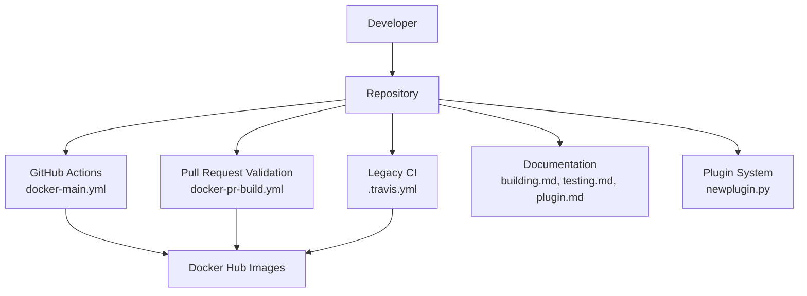
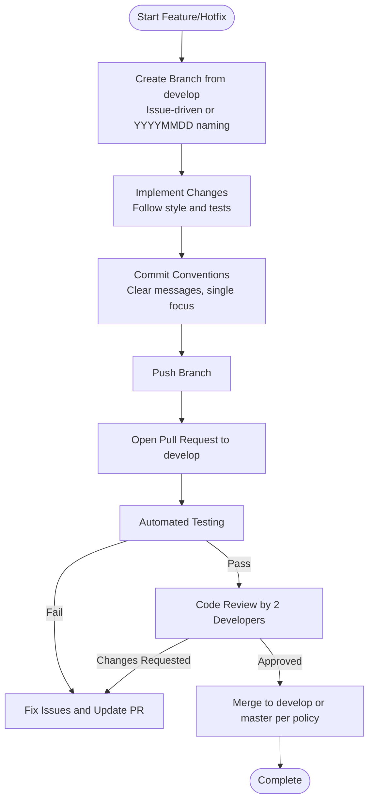
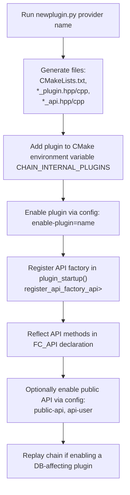
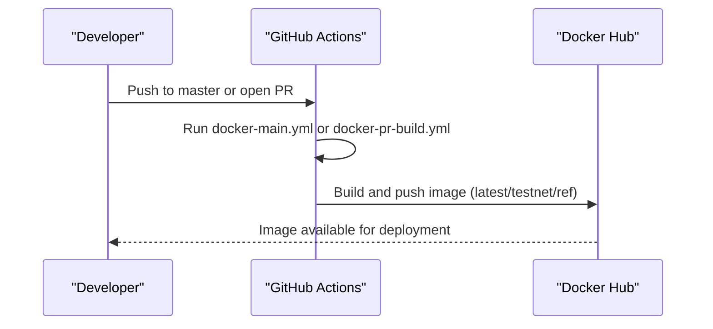
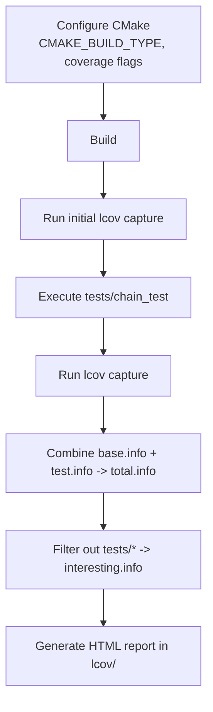
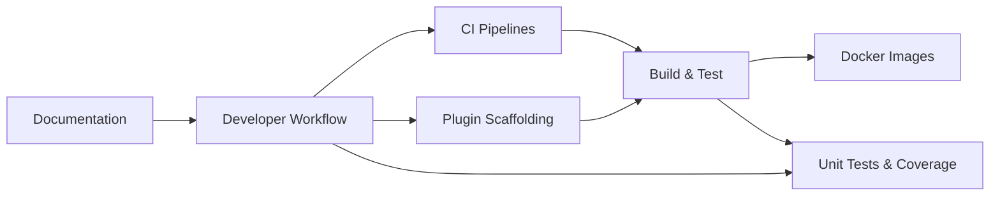

# Development Workflow

<cite>
**Referenced Files in This Document**
- [README.md](file://README.md)
- [documentation/git_guildelines.md](file://documentation/git_guildelines.md)
- [documentation/plugin.md](file://documentation/plugin.md)
- [programs/util/newplugin.py](file://programs/util/newplugin.py)
- [.github/workflows/docker-main.yml](file://.github/workflows/docker-main.yml)
- [.github/workflows/docker-pr-build.yml](file://.github/workflows/docker-pr-build.yml)
- [documentation/building.md](file://documentation/building.md)
- [documentation/testing.md](file://documentation/testing.md)
- [.travis.yml](file://.travis.yml)
- [programs/build_helpers/check_reflect.py](file://programs/build_helpers/check_reflect.py)
</cite>

## Table of Contents
1. [Introduction](#introduction)
2. [Project Structure](#project-structure)
3. [Core Components](#core-components)
4. [Architecture Overview](#architecture-overview)
5. [Detailed Component Analysis](#detailed-component-analysis)
6. [Dependency Analysis](#dependency-analysis)
7. [Performance Considerations](#performance-considerations)
8. [Troubleshooting Guide](#troubleshooting-guide)
9. [Conclusion](#conclusion)
10. [Appendices](#appendices)

## Introduction
This document describes the complete development lifecycle for VIZ CPP Node contributors. It covers code style expectations, commit and branch conventions, pull request processes, plugin development workflow using the newplugin.py template, continuous integration pipelines (GitHub Actions and legacy CI), testing requirements, code review and merge criteria, collaboration and issue tracking, and how development practices tie into quality assurance.

## Project Structure
The repository is organized around a CMake-based build system, with libraries, plugins, programs, and documentation. Key areas for contributors:
- Libraries: core blockchain logic and APIs
- Plugins: modular features enabling APIs and services
- Programs: utilities and executables (vizd, cli_wallet, helpers)
- Documentation: build, plugin, testing, and Git guidelines
- CI: GitHub Actions for Docker builds and PR validation

```mermaid
graph TB
A["Root"] --> B["libraries"]
A --> C["plugins"]
A --> D["programs"]
A --> E["documentation"]
A --> F[".github/workflows"]
A --> G[".travis.yml"]
B --> B1["chain"]
B --> B2["api"]
B --> B3["network"]
B --> B4["protocol"]
B --> B5["utilities"]
B --> B6["wallet"]
C --> C1["chain"]
C --> C2["account_history"]
C --> C3["debug_node"]
C --> C4["json_rpc"]
C --> C5["mongo_db"]
C --> C6["tags"]
C --> C7["webserver"]
C --> C8["witness_api"]
C --> C9["... others"]
D --> D1["util"]
D --> D2["build_helpers"]
D --> D3["cli_wallet"]
D --> D4["vizd"]
D --> D5["js_operation_serializer"]
D --> D6["size_checker"]
D --> D7["util/*"]
E --> E1["building.md"]
E --> E2["plugin.md"]
E --> E3["testing.md"]
E --> E4["git_guildelines.md"]
E --> E5["testnet.md"]
E --> E6["debug_node_plugin.md"]
E --> E7["api_notes.md"]
E --> E8["doxygen/*"]
F --> F1["docker-main.yml"]
F --> F2["docker-pr-build.yml"]
```

**Section sources**
- [README.md](file://README.md#L1-L53)
- [documentation/building.md](file://documentation/building.md#L1-L212)

## Core Components
- Git and branching model: defines branches, PR process, and policies for master and develop.
- Plugin system: how plugins are registered, configured, and enabled.
- CI pipelines: automated Docker builds for PRs and releases.
- Testing: unit tests, coverage, and configuration options.
- Build system: CMake options and platform-specific instructions.

**Section sources**
- [documentation/git_guildelines.md](file://documentation/git_guildelines.md#L1-L111)
- [documentation/plugin.md](file://documentation/plugin.md#L1-L28)
- [.github/workflows/docker-main.yml](file://.github/workflows/docker-main.yml#L1-L41)
- [.github/workflows/docker-pr-build.yml](file://.github/workflows/docker-pr-build.yml#L1-L24)
- [documentation/testing.md](file://documentation/testing.md#L1-L43)
- [documentation/building.md](file://documentation/building.md#L1-L212)

## Architecture Overview
The development workflow integrates local development, automated CI, and release automation. The diagram below maps the primary components and their interactions during development and release.

**Diagram sources**
- [.github/workflows/docker-main.yml](file://.github/workflows/docker-main.yml#L1-L41)
- [.github/workflows/docker-pr-build.yml](file://.github/workflows/docker-pr-build.yml#L1-L24)
- [.travis.yml](file://.travis.yml#L1-L46)
- [documentation/building.md](file://documentation/building.md#L1-L212)
- [documentation/testing.md](file://documentation/testing.md#L1-L43)
- [documentation/plugin.md](file://documentation/plugin.md#L1-L28)
- [programs/util/newplugin.py](file://programs/util/newplugin.py#L1-L251)

## Detailed Component Analysis

### Git and Pull Request Workflow
- Branches:
  - master: release branch; PRs validated by CI before merge.
  - develop: active development branch; PRs validated by CI.
- Branch naming:
  - Issue-driven patches: issue-number-short-description.
  - Non-issue patches: YYYYMMDD-shortname.
- Pull Requests:
  - All changes to develop and master are submitted via PRs.
  - Automated testing is mandatory; manual code review required.
  - Merge conflicts must be resolved by rebasing against origin/develop.
- Policies:
  - Force-push policy: master and develop are protected; patch branches may be force-pushed at discretion.
  - Tagging policy: releases tagged as vMajor.Hardfork.Release on master.

**Section sources**
- [documentation/git_guildelines.md](file://documentation/git_guildelines.md#L8-L111)

### Plugin Development Workflow Using newplugin.py
The newplugin.py script generates a complete plugin skeleton with boilerplate for headers, implementation files, and CMake configuration. After generation, contributors register signals, add API methods, and integrate with the application’s API factory.

**Diagram sources**
- [programs/util/newplugin.py](file://programs/util/newplugin.py#L1-L251)
- [documentation/plugin.md](file://documentation/plugin.md#L21-L28)

**Section sources**
- [documentation/plugin.md](file://documentation/plugin.md#L1-L28)
- [programs/util/newplugin.py](file://programs/util/newplugin.py#L1-L251)

### Continuous Integration Pipelines
- GitHub Actions:
  - docker-main.yml: builds and pushes Docker images for master (testnet/latest).
  - docker-pr-build.yml: builds a testnet image for PRs with ref tagging.
- Legacy CI (.travis.yml):
  - Matrix builds multiple Dockerfiles (standard, test, testnet, lowmem, mongo).
  - On master or tag, pushes images to Docker Hub.

**Diagram sources**
- [.github/workflows/docker-main.yml](file://.github/workflows/docker-main.yml#L1-L41)
- [.github/workflows/docker-pr-build.yml](file://.github/workflows/docker-pr-build.yml#L1-L24)
- [.travis.yml](file://.travis.yml#L1-L46)

**Section sources**
- [.github/workflows/docker-main.yml](file://.github/workflows/docker-main.yml#L1-L41)
- [.github/workflows/docker-pr-build.yml](file://.github/workflows/docker-pr-build.yml#L1-L24)
- [.travis.yml](file://.travis.yml#L1-L46)

### Testing Requirements and Coverage
- Unit tests:
  - Target: make chain_test
  - Categories include basic_tests, block_tests, operation_tests, serialization_tests, etc.
- Runtime configuration:
  - log_level, report_level, run_test flags for controlling verbosity and selection.
- Code coverage:
  - Enable coverage in CMake, run initial capture, run tests, combine lcov traces, and generate HTML report.

**Diagram sources**
- [documentation/testing.md](file://documentation/testing.md#L26-L43)

**Section sources**
- [documentation/testing.md](file://documentation/testing.md#L1-L43)

### Build System and Platform Notes
- CMake options:
  - CMAKE_BUILD_TYPE=[Release/Debug]
  - LOW_MEMORY_NODE=[FALSE/TRUE] for consensus-only nodes
- Platform-specific instructions:
  - Ubuntu 16.04, 14.04, macOS X with specific package lists and caveats.
- Docker builds:
  - Prebuilt images available; manual builds supported via Dockerfiles in share/vizd/docker.

**Section sources**
- [documentation/building.md](file://documentation/building.md#L1-L212)
- [README.md](file://README.md#L1-L53)

### Code Review and Merge Criteria
- Review policy:
  - Two developers must review every release before merging into master.
  - Two developers must review consensus-breaking changes before merging into develop.
  - Patches should be reviewed by at least one developer other than the author.
- Quality checks:
  - Automated tests must pass.
  - Style and correctness must be verified (no trailing whitespace, single focus per patch, no mixing unrelated changes).
- Collaboration:
  - External contributions should be reviewed by two internal developers.
  - PRs should reference related issues to maintain traceability.

**Section sources**
- [documentation/git_guildelines.md](file://documentation/git_guildelines.md#L93-L111)

### Issue Tracking and Collaboration
- Branches:
  - master and develop define the cadence for releases and development.
- Branch creation:
  - From develop; name according to issue number or date-based naming.
- PRs:
  - Always reference related issues.
  - Resolve merge conflicts by rebasing against origin/develop.

**Section sources**
- [documentation/git_guildelines.md](file://documentation/git_guildelines.md#L8-L76)

### Relationship Between Development Workflow and QA
- CI ensures builds and Docker images are produced consistently for PRs and releases.
- Automated tests validate core functionality; coverage analysis helps identify gaps.
- Plugin scaffolding and reflection checks support API completeness and correctness.
- Release tagging and protected branches enforce stability gates for merges.

**Section sources**
- [.github/workflows/docker-main.yml](file://.github/workflows/docker-main.yml#L1-L41)
- [.github/workflows/docker-pr-build.yml](file://.github/workflows/docker-pr-build.yml#L1-L24)
- [documentation/testing.md](file://documentation/testing.md#L1-L43)
- [programs/build_helpers/check_reflect.py](file://programs/build_helpers/check_reflect.py#L1-L160)

## Dependency Analysis
The development workflow depends on:
- CI systems for automated validation and image publishing
- CMake and platform toolchains for building
- Plugin scaffolding for consistent API development
- Test suites for regression prevention

**Diagram sources**
- [.github/workflows/docker-main.yml](file://.github/workflows/docker-main.yml#L1-L41)
- [.github/workflows/docker-pr-build.yml](file://.github/workflows/docker-pr-build.yml#L1-L24)
- [documentation/building.md](file://documentation/building.md#L1-L212)
- [documentation/testing.md](file://documentation/testing.md#L1-L43)
- [documentation/plugin.md](file://documentation/plugin.md#L1-L28)

**Section sources**
- [.github/workflows/docker-main.yml](file://.github/workflows/docker-main.yml#L1-L41)
- [.github/workflows/docker-pr-build.yml](file://.github/workflows/docker-pr-build.yml#L1-L24)
- [documentation/building.md](file://documentation/building.md#L1-L212)
- [documentation/testing.md](file://documentation/testing.md#L1-L43)
- [documentation/plugin.md](file://documentation/plugin.md#L1-L28)

## Performance Considerations
- Build type: prefer Release for production; Debug with coverage for development and analysis.
- Low-memory nodes: use LOW_MEMORY_NODE for witness and seed-node deployments to reduce resource usage.
- Docker builds: leverage prebuilt images for faster iteration; build locally when debugging CI issues.

[No sources needed since this section provides general guidance]

## Troubleshooting Guide
- CI failures:
  - Verify Dockerfile selection and credentials for GitHub Actions.
  - For Travis, confirm matrix variables and Docker Hub credentials.
- Build issues:
  - Follow platform-specific dependency lists and version requirements.
  - Use CMAKE_BUILD_TYPE=Release for production builds.
- Test failures:
  - Use run_test and report_level to narrow down failing categories.
  - Re-run with increased verbosity to locate failing test cases.
- Reflection mismatches:
  - Use check_reflect.py to compare Doxygen XML and FC_REFLECT declarations.

**Section sources**
- [.github/workflows/docker-main.yml](file://.github/workflows/docker-main.yml#L1-L41)
- [.github/workflows/docker-pr-build.yml](file://.github/workflows/docker-pr-build.yml#L1-L24)
- [.travis.yml](file://.travis.yml#L1-L46)
- [documentation/building.md](file://documentation/building.md#L1-L212)
- [documentation/testing.md](file://documentation/testing.md#L1-L43)
- [programs/build_helpers/check_reflect.py](file://programs/build_helpers/check_reflect.py#L1-L160)

## Conclusion
This workflow ensures reliable development, robust CI validation, and consistent releases. Contributors should follow branch naming, PR procedures, and review criteria; use the plugin scaffolding for API development; adhere to testing and coverage practices; and rely on CI pipelines for automated Docker builds and validations.

[No sources needed since this section summarizes without analyzing specific files]

## Appendices

### Practical Examples

- Implementing a new plugin
  - Use newplugin.py to generate boilerplate.
  - Register API factory in plugin_startup().
  - Reflect API methods in FC_API declaration.
  - Enable via config and optionally expose via public-api.

  **Section sources**
  - [programs/util/newplugin.py](file://programs/util/newplugin.py#L1-L251)
  - [documentation/plugin.md](file://documentation/plugin.md#L21-L28)

- Fixing a bug
  - Create a branch from develop with a descriptive name.
  - Write targeted tests; run make chain_test and adjust flags as needed.
  - Open a PR; address reviewer feedback; re-run CI.

  **Section sources**
  - [documentation/git_guildelines.md](file://documentation/git_guildelines.md#L25-L76)
  - [documentation/testing.md](file://documentation/testing.md#L1-L43)

- Contributing to an existing plugin
  - Identify the plugin directory under plugins/.
  - Follow the same scaffolding and reflection rules if adding new API methods.
  - Ensure compatibility with DB state if applicable and document replay requirements.

  **Section sources**
  - [documentation/plugin.md](file://documentation/plugin.md#L11-L20)

### Code Style and Commit Conventions
- Keep commits focused and atomic.
- Use clear, descriptive commit messages.
- Avoid mixing unrelated changes in a single commit.
- Reference related issues in PR descriptions.

**Section sources**
- [documentation/git_guildelines.md](file://documentation/git_guildelines.md#L62-L76)