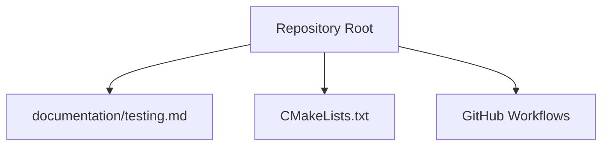
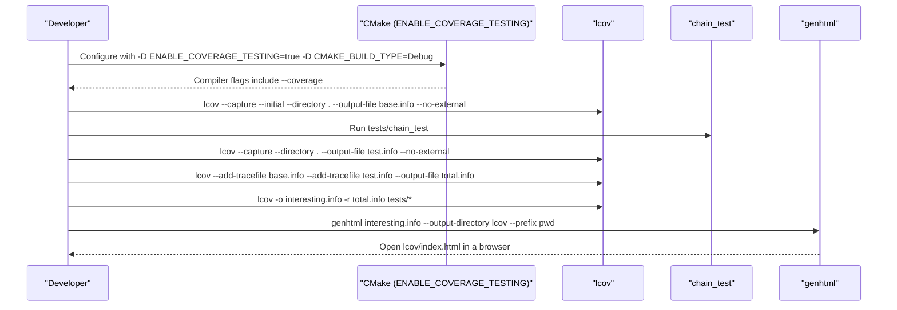
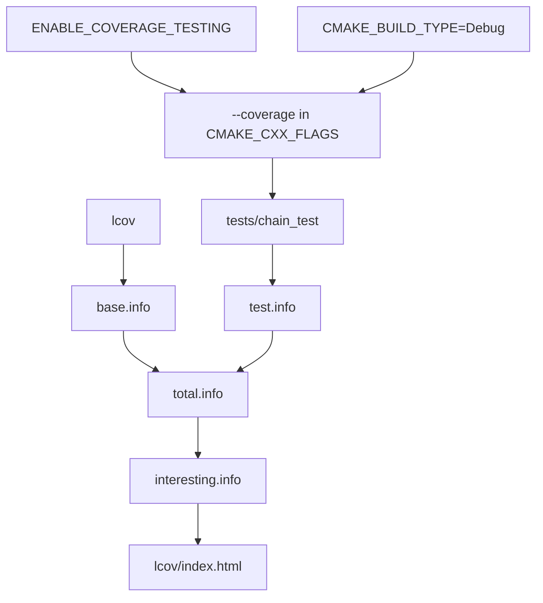

# Code Coverage Analysis

<cite>
**Referenced Files in This Document**
- [CMakeLists.txt](file://CMakeLists.txt)
- [testing.md](file://documentation/testing.md)
- [docker-main.yml](file://.github/workflows/docker-main.yml)
- [docker-pr-build.yml](file://.github/workflows/docker-pr-build.yml)
</cite>

## Table of Contents
1. [Introduction](#introduction)
2. [Project Structure](#project-structure)
3. [Core Components](#core-components)
4. [Architecture Overview](#architecture-overview)
5. [Detailed Component Analysis](#detailed-component-analysis)
6. [Dependency Analysis](#dependency-analysis)
7. [Performance Considerations](#performance-considerations)
8. [Troubleshooting Guide](#troubleshooting-guide)
9. [Conclusion](#conclusion)
10. [Appendices](#appendices)

## Introduction
This document provides a comprehensive guide to code coverage analysis for the VIZ CPP Node testing framework. It documents the complete lcov integration workflow, including prerequisites, debug build configuration, and the multi-step coverage capture process. It also explains cmake configuration options for enabling coverage testing in Debug builds, details lcov command-line options, and offers practical examples for generating coverage reports, interpreting metrics, and integrating coverage analysis into CI/CD pipelines.

## Project Structure
The repository organizes the build and testing infrastructure around a top-level cmake configuration and documentation that describes the coverage workflow. The testing documentation outlines the lcov commands and the chain_test target used to exercise the test suite. The main cmake file defines the option to enable coverage testing and injects compiler flags accordingly.

**Section sources**
- [CMakeLists.txt](file://CMakeLists.txt#L204-L208)
- [testing.md](file://documentation/testing.md#L26-L42)

## Core Components
- Coverage build configuration via cmake option ENABLE_COVERAGE_TESTING
- Debug build requirement for coverage instrumentation
- lcov capture workflow with base.info, test execution, test.info, total.info, and filtered interesting.info
- HTML report generation with genhtml

Key implementation points:
- The cmake option ENABLE_COVERAGE_TESTING controls whether coverage instrumentation flags are added to the build.
- The lcov workflow documented in testing.md shows the step-by-step process for capturing and combining tracefiles and generating HTML reports.
- The chain_test target is used to execute the test suite during coverage capture.

**Section sources**
- [CMakeLists.txt](file://CMakeLists.txt#L204-L208)
- [testing.md](file://documentation/testing.md#L26-L42)

## Architecture Overview
The coverage workflow integrates cmake, lcov, and the test runner to produce an HTML coverage report. The diagram below maps the documented steps to actual files and targets.

**Diagram sources**
- [testing.md](file://documentation/testing.md#L26-L42)
- [CMakeLists.txt](file://CMakeLists.txt#L204-L208)

## Detailed Component Analysis

### cmake Coverage Configuration
- Option definition: ENABLE_COVERAGE_TESTING is defined as a cmake option with a cache type of BOOL.
- Conditional instrumentation: When enabled, the --coverage flag is prepended to CMAKE_CXX_FLAGS.
- Build type requirement: The documented workflow requires CMAKE_BUILD_TYPE=Debug.

Practical implications:
- Enabling coverage adds instrumentation to all targets built under the project.
- The Debug build type ensures debug symbols are present for accurate line-level coverage.

**Section sources**
- [CMakeLists.txt](file://CMakeLists.txt#L204-L208)

### lcov Workflow Steps
The documented workflow consists of the following stages:

1. Initial capture with base.info
   - Purpose: Initialize the coverage recorder with baseline counts.
   - Command: lcov --capture --initial --directory . --output-file base.info --no-external

2. Test execution with chain_test
   - Purpose: Run the test suite to collect coverage data.
   - Target: tests/chain_test

3. Secondary capture with test.info
   - Purpose: Capture coverage after running tests.
   - Command: lcov --capture --directory . --output-file test.info --no-external

4. Tracefile combination with total.info
   - Purpose: Merge base and test tracefiles into a single total.info.
   - Command: lcov --add-tracefile base.info --add-tracefile test.info --output-file total.info

5. Filtering of test directories with interesting.info
   - Purpose: Remove entries from tests/* to focus on library and plugin code.
   - Command: lcov -o interesting.info -r total.info tests/*

6. HTML report generation with genhtml
   - Purpose: Produce an HTML report from the filtered tracefile.
   - Command: genhtml interesting.info --output-directory lcov --prefix `pwd`

7. Viewing the report
   - Purpose: Inspect coverage metrics in a browser.
   - Path: lcov/index.html

**Section sources**
- [testing.md](file://documentation/testing.md#L26-L42)

### lcov Command-Line Options
The workflow uses the following lcov options:
- --capture: Collects execution counts from the current working directory.
- --initial: Initializes the recorder for a clean baseline.
- --directory: Specifies the root directory for coverage data collection.
- --output-file: Sets the output filename for tracefiles.
- --no-external: Filters out coverage contributions from external sources.
- --add-tracefile: Combines multiple tracefiles into one.
- -r (remove): Removes matched patterns from the tracefile (used to exclude tests/*).

These options are applied as documented in the testing guide.

**Section sources**
- [testing.md](file://documentation/testing.md#L30-L42)

### CI/CD Integration
While the repository does not include a dedicated coverage job in the GitHub Actions workflows, the existing Docker build workflows demonstrate how to integrate build and packaging steps in CI. To add coverage reporting to CI:

- Add a job that configures the project with ENABLE_COVERAGE_TESTING and CMAKE_BUILD_TYPE=Debug.
- Run the lcov capture and report generation steps as documented.
- Publish artifacts (lcov/) for review.

The Docker workflows show the general pattern of building images on pushes and pull requests, which can be extended to include coverage jobs.

**Section sources**
- [docker-main.yml](file://.github/workflows/docker-main.yml#L1-L41)
- [docker-pr-build.yml](file://.github/workflows/docker-pr-build.yml#L1-L24)

## Dependency Analysis
Coverage depends on:
- Cmake option ENABLE_COVERAGE_TESTING to inject --coverage flags.
- Debug build type for debug symbols.
- lcov tool availability (installed via brew on macOS as documented).
- The chain_test target to exercise the test suite.

**Diagram sources**
- [CMakeLists.txt](file://CMakeLists.txt#L204-L208)
- [testing.md](file://documentation/testing.md#L26-L42)

**Section sources**
- [CMakeLists.txt](file://CMakeLists.txt#L204-L208)
- [testing.md](file://documentation/testing.md#L26-L42)

## Performance Considerations
- Coverage instrumentation adds overhead; expect slower test execution and larger binary sizes.
- Using --no-external reduces noise from external dependencies, focusing on project code.
- Filtering tests/* with -r improves report readability by excluding test harness code.
- Keep the build in Debug to ensure accurate line-level coverage.

## Troubleshooting Guide
Common issues and resolutions:
- Missing lcov tool
  - Symptom: Commands fail with "command not found".
  - Resolution: Install lcov using the documented package manager command.

- No coverage data captured
  - Symptom: Empty or minimal coverage in HTML report.
  - Causes:
    - ENABLE_COVERAGE_TESTING not enabled during configuration.
    - CMAKE_BUILD_TYPE not set to Debug.
    - Tests not executed or failing before coverage capture.
  - Resolutions:
    - Reconfigure with -D ENABLE_COVERAGE_TESTING=true -D CMAKE_BUILD_TYPE=Debug.
    - Ensure tests/chain_test runs successfully.
    - Verify --directory points to the build root and includes compiled sources.

- Incorrect or missing debug symbols
  - Symptom: Lines not attributed to source files.
  - Resolution: Confirm Debug build and that --coverage flags are applied.

- HTML report shows external paths
  - Symptom: Coverage includes third-party or system libraries.
  - Resolution: Use --no-external during capture and -r to remove unwanted patterns.

- Tracefile combination errors
  - Symptom: lcov fails to merge tracefiles.
  - Resolution: Ensure base.info and test.info exist and are valid; confirm correct filenames and paths.

- genhtml output location
  - Symptom: Report not found or paths incorrect.
  - Resolution: Use --output-directory lcov and --prefix `pwd` as documented.

**Section sources**
- [testing.md](file://documentation/testing.md#L26-L42)
- [CMakeLists.txt](file://CMakeLists.txt#L204-L208)

## Conclusion
The VIZ CPP Node testing framework supports code coverage analysis through a straightforward cmake option and a well-defined lcov workflow. By enabling coverage instrumentation in Debug builds, capturing baseline and test tracefiles, combining and filtering them, and generating an HTML report, teams can gain actionable insights into test coverage. Integrating these steps into CI/CD pipelines enables continuous monitoring of coverage trends and helps maintain high-quality test suites.

## Appendices

### Practical Examples
- Enabling coverage and building:
  - Configure with cmake -D ENABLE_COVERAGE_TESTING=true -D CMAKE_BUILD_TYPE=Debug .
- Capturing baseline coverage:
  - Run lcov --capture --initial --directory . --output-file base.info --no-external
- Executing tests:
  - Run tests/chain_test
- Capturing test coverage:
  - Run lcov --capture --directory . --output-file test.info --no-external
- Combining tracefiles:
  - Run lcov --add-tracefile base.info --add-tracefile test.info --output-file total.info
- Filtering test directories:
  - Run lcov -o interesting.info -r total.info tests/*
- Generating HTML report:
  - Run genhtml interesting.info --output-directory lcov --prefix `pwd`
- Viewing results:
  - Open lcov/index.html in a browser

**Section sources**
- [testing.md](file://documentation/testing.md#L26-L42)