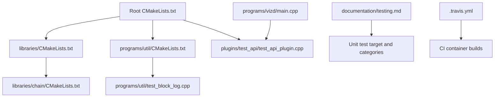
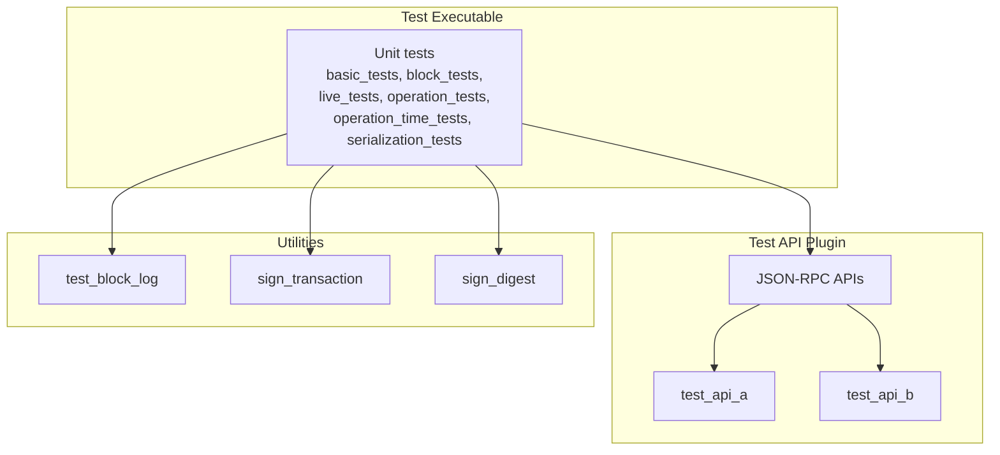
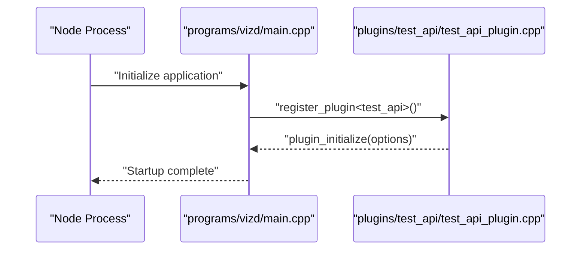
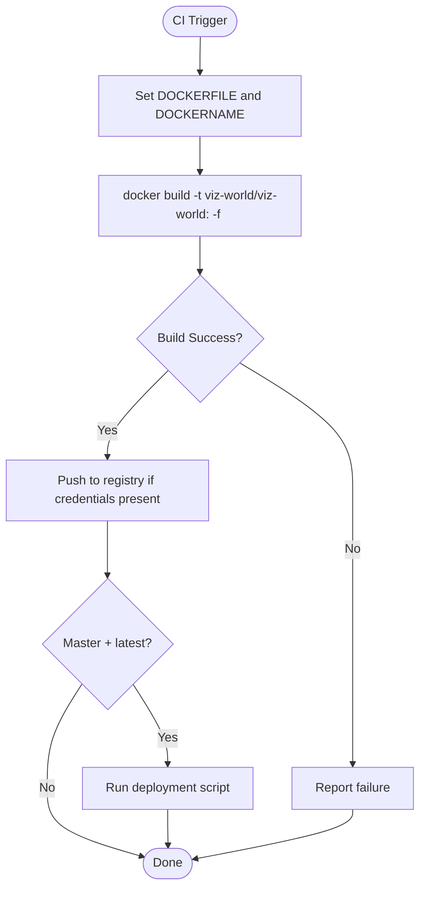
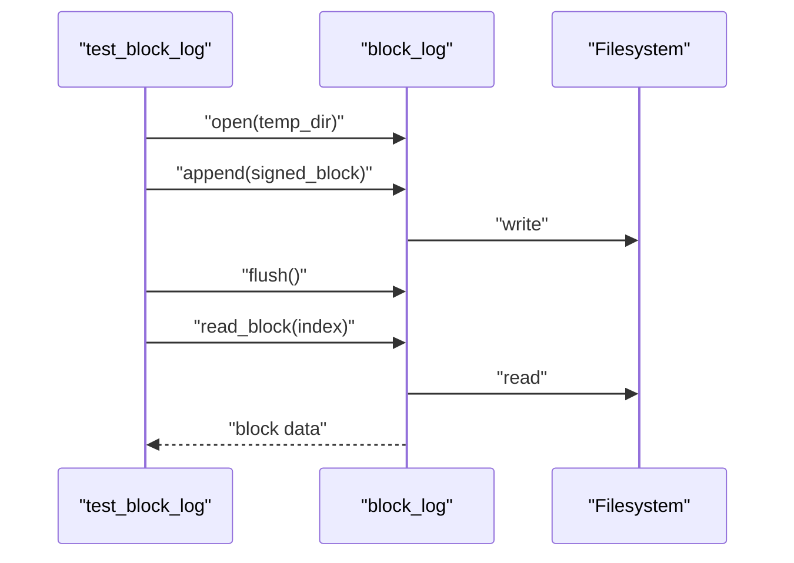
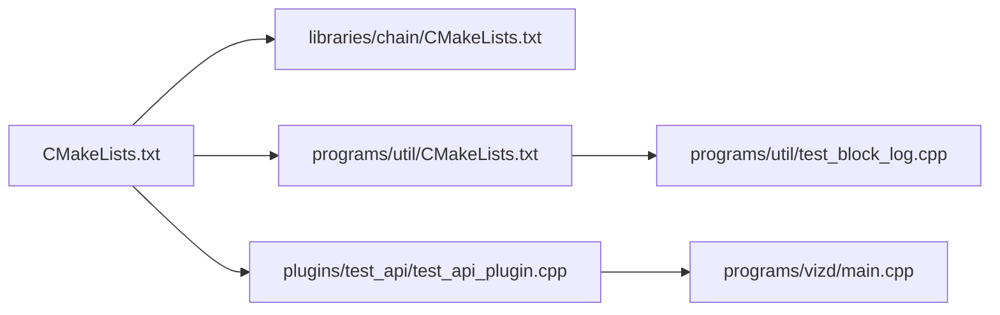

# Testing Framework

<cite>
**Referenced Files in This Document**
- [testing.md](file://documentation/testing.md)
- [.travis.yml](file://.travis.yml)
- [CMakeLists.txt](file://CMakeLists.txt)
- [libraries/CMakeLists.txt](file://libraries/CMakeLists.txt)
- [libraries/chain/CMakeLists.txt](file://libraries/chain/CMakeLists.txt)
- [programs/util/CMakeLists.txt](file://programs/util/CMakeLists.txt)
- [programs/util/test_block_log.cpp](file://programs/util/test_block_log.cpp)
- [plugins/test_api/test_api_plugin.cpp](file://plugins/test_api/test_api_plugin.cpp)
- [programs/vizd/main.cpp](file://programs/vizd/main.cpp)
- [share/vizd/config/config_testnet.ini](file://share/vizd/config/config_testnet.ini)
- [share/vizd/docker/Dockerfile-testnet](file://share/vizd/docker/Dockerfile-testnet)
- [share/vizd/snapshot-testnet.json](file://share/vizd/snapshot-testnet.json)
</cite>

## Table of Contents
1. [Introduction](#introduction)
2. [Project Structure](#project-structure)
3. [Core Components](#core-components)
4. [Architecture Overview](#architecture-overview)
5. [Detailed Component Analysis](#detailed-component-analysis)
6. [Dependency Analysis](#dependency-analysis)
7. [Performance Considerations](#performance-considerations)
8. [Troubleshooting Guide](#troubleshooting-guide)
9. [Conclusion](#conclusion)
10. [Appendices](#appendices)

## Introduction
This document describes the testing framework for VIZ CPP Node, focusing on unit tests, integration tests, and performance benchmarks. It explains the test categories, Boost.Test configuration, execution commands, reporting options, code coverage with lcov, and CI workflows. It also covers test data management, mock objects, environment setup, and practical examples for writing and running tests.

## Project Structure
The testing infrastructure spans documentation, CMake build configuration, utility executables, and a dedicated test API plugin. The primary unit test target is generated via CMake and executed as an executable that runs all unit tests. Test categories are organized under a single test binary and filtered at runtime.

**Diagram sources**
- [CMakeLists.txt](file://CMakeLists.txt#L1-L200)
- [libraries/CMakeLists.txt](file://libraries/CMakeLists.txt#L1-L8)
- [libraries/chain/CMakeLists.txt](file://libraries/chain/CMakeLists.txt#L1-L142)
- [programs/util/CMakeLists.txt](file://programs/util/CMakeLists.txt#L1-L69)
- [programs/util/test_block_log.cpp](file://programs/util/test_block_log.cpp#L1-L54)
- [plugins/test_api/test_api_plugin.cpp](file://plugins/test_api/test_api_plugin.cpp#L1-L40)
- [programs/vizd/main.cpp](file://programs/vizd/main.cpp#L1-L120)
- [documentation/testing.md](file://documentation/testing.md#L1-L43)
- [.travis.yml](file://.travis.yml#L1-L46)

**Section sources**
- [documentation/testing.md](file://documentation/testing.md#L1-L43)
- [CMakeLists.txt](file://CMakeLists.txt#L1-L200)
- [libraries/CMakeLists.txt](file://libraries/CMakeLists.txt#L1-L8)
- [libraries/chain/CMakeLists.txt](file://libraries/chain/CMakeLists.txt#L1-L142)
- [programs/util/CMakeLists.txt](file://programs/util/CMakeLists.txt#L1-L69)
- [programs/util/test_block_log.cpp](file://programs/util/test_block_log.cpp#L1-L54)
- [plugins/test_api/test_api_plugin.cpp](file://plugins/test_api/test_api_plugin.cpp#L1-L40)
- [programs/vizd/main.cpp](file://programs/vizd/main.cpp#L1-L120)
- [.travis.yml](file://.travis.yml#L1-L46)

## Core Components
- Unit test target and categories:
  - The unit test target is built via CMake and produces an executable that runs all unit tests.
  - Test categories include basic_tests, block_tests, live_tests, operation_tests, operation_time_tests, and serialization_tests.
- Boost.Test configuration:
  - Runtime configuration supports log_level, report_level, and run_test filters.
  - Refer to Boost.Test documentation for advanced options.
- Code coverage:
  - lcov integration is supported with a dedicated CMake option to enable coverage in Debug builds.
  - The documented workflow captures baseline and test tracefiles, merges them, removes test artifacts, and generates HTML reports.

Practical usage examples:
- Run all unit tests: execute the built test binary.
- Filter by category or test case: use the run_test runtime option.
- Enable coverage: configure with the coverage flag and follow the lcov capture and HTML generation steps.

**Section sources**
- [documentation/testing.md](file://documentation/testing.md#L1-L43)

## Architecture Overview
The test architecture centers on a single test executable that aggregates multiple test suites. The test API plugin exposes JSON-RPC endpoints useful for integration-style tests. Utility programs exercise subsystems like block logging and signing.

**Diagram sources**
- [documentation/testing.md](file://documentation/testing.md#L6-L14)
- [plugins/test_api/test_api_plugin.cpp](file://plugins/test_api/test_api_plugin.cpp#L1-L40)
- [programs/util/test_block_log.cpp](file://programs/util/test_block_log.cpp#L1-L54)
- [programs/util/CMakeLists.txt](file://programs/util/CMakeLists.txt#L1-L69)

**Section sources**
- [documentation/testing.md](file://documentation/testing.md#L6-L14)
- [plugins/test_api/test_api_plugin.cpp](file://plugins/test_api/test_api_plugin.cpp#L1-L40)
- [programs/util/test_block_log.cpp](file://programs/util/test_block_log.cpp#L1-L54)
- [programs/util/CMakeLists.txt](file://programs/util/CMakeLists.txt#L1-L69)

## Detailed Component Analysis

### Test Categories
- basic_tests: Validates “basic” functionality.
- block_tests: Validates blockchain-specific logic.
- live_tests: Validates against live chain data (e.g., past hardfork scenarios).
- operation_tests: Validates operations.
- operation_time_tests: Validates time-dependent operations (e.g., vesting withdrawals).
- serialization_tests: Validates serialization logic.

Filtering and execution:
- Use the run_test runtime option to select specific suites or test cases.
- Configure log_level and report_level for verbosity and detail.

**Section sources**
- [documentation/testing.md](file://documentation/testing.md#L6-L23)

### Boost.Test Configuration and Execution
- Log level options include all, success, test_suite, message, warning, error, cpp_exception, system_error, fatal_error, nothing.
- Report level options include no, confirm, short, detailed.
- run_test supports selecting specific suites or test cases.

Execution command:
- Build the test target and run the resulting executable to execute all tests.
- Use runtime options to filter and tune output.

**Section sources**
- [documentation/testing.md](file://documentation/testing.md#L16-L23)

### Code Coverage with lcov
- Enable coverage in Debug builds via a CMake option.
- Workflow:
  - Capture initial tracefile.
  - Run the test executable.
  - Capture test tracefile.
  - Merge and post-process tracefiles.
  - Generate HTML report and open it in a browser.

**Section sources**
- [documentation/testing.md](file://documentation/testing.md#L26-L43)

### Test Data Management and Environment Setup
- Testnet configuration:
  - A dedicated testnet configuration file exists for isolated testing environments.
  - A Dockerfile is provided for building a testnet image.
  - A snapshot file is available for quick testnet initialization.
- Test API plugin:
  - The plugin registers JSON-RPC APIs and is loaded by the node process.

**Diagram sources**
- [programs/vizd/main.cpp](file://programs/vizd/main.cpp#L1-L120)
- [plugins/test_api/test_api_plugin.cpp](file://plugins/test_api/test_api_plugin.cpp#L1-L40)

**Section sources**
- [share/vizd/config/config_testnet.ini](file://share/vizd/config/config_testnet.ini#L1-L200)
- [share/vizd/docker/Dockerfile-testnet](file://share/vizd/docker/Dockerfile-testnet#L1-L200)
- [share/vizd/snapshot-testnet.json](file://share/vizd/snapshot-testnet.json#L1-L200)
- [programs/vizd/main.cpp](file://programs/vizd/main.cpp#L1-L120)
- [plugins/test_api/test_api_plugin.cpp](file://plugins/test_api/test_api_plugin.cpp#L1-L40)

### Continuous Integration Testing Workflows
- CI builds Docker images for multiple variants (standard, test, testnet, low memory, mongo).
- The matrix defines environment variables and Dockerfile selection.
- Builds are triggered per branch and tag, enabling automated artifact publishing.

**Diagram sources**
- [.travis.yml](file://.travis.yml#L1-L46)

**Section sources**
- [.travis.yml](file://.travis.yml#L1-L46)

### Practical Examples
- Writing a new test suite:
  - Add tests to the existing test target using Boost.Test macros.
  - Group tests into categories (basic_tests, block_tests, etc.) as appropriate.
- Running a specific suite:
  - Use the run_test runtime option to execute a named suite or specific test case.
- Interpreting results:
  - Adjust report_level to control output detail.
  - Use log_level to focus on successes, warnings, errors, or disable logs.

**Section sources**
- [documentation/testing.md](file://documentation/testing.md#L16-L23)

### Integration Test Utilities
- Block log utility:
  - Demonstrates opening a block log, appending signed blocks, flushing, and reading blocks.
  - Useful for validating block storage and retrieval logic.
- Signing utilities:
  - Provide helpers for signing digests and transactions, useful for integration tests requiring cryptographic operations.

**Diagram sources**
- [programs/util/test_block_log.cpp](file://programs/util/test_block_log.cpp#L1-L54)

**Section sources**
- [programs/util/test_block_log.cpp](file://programs/util/test_block_log.cpp#L1-L54)
- [programs/util/CMakeLists.txt](file://programs/util/CMakeLists.txt#L58-L69)

## Dependency Analysis
The test framework relies on:
- CMake configuration to build the test target and link required libraries.
- The test API plugin for JSON-RPC-based integration tests.
- Utility programs for exercising subsystems like block logging and signing.

**Diagram sources**
- [CMakeLists.txt](file://CMakeLists.txt#L1-L200)
- [libraries/chain/CMakeLists.txt](file://libraries/chain/CMakeLists.txt#L1-L142)
- [programs/util/CMakeLists.txt](file://programs/util/CMakeLists.txt#L1-L69)
- [programs/util/test_block_log.cpp](file://programs/util/test_block_log.cpp#L1-L54)
- [plugins/test_api/test_api_plugin.cpp](file://plugins/test_api/test_api_plugin.cpp#L1-L40)
- [programs/vizd/main.cpp](file://programs/vizd/main.cpp#L1-L120)

**Section sources**
- [CMakeLists.txt](file://CMakeLists.txt#L1-L200)
- [libraries/chain/CMakeLists.txt](file://libraries/chain/CMakeLists.txt#L1-L142)
- [programs/util/CMakeLists.txt](file://programs/util/CMakeLists.txt#L1-L69)
- [programs/util/test_block_log.cpp](file://programs/util/test_block_log.cpp#L1-L54)
- [plugins/test_api/test_api_plugin.cpp](file://plugins/test_api/test_api_plugin.cpp#L1-L40)
- [programs/vizd/main.cpp](file://programs/vizd/main.cpp#L1-L120)

## Performance Considerations
- Performance benchmarks are not explicitly defined in the repository’s testing documentation.
- Recommended approach:
  - Use the existing test categories to isolate performance-sensitive areas (e.g., operation_time_tests).
  - Integrate timing measurements around critical operations within unit tests.
  - Use external benchmarking tools if needed, ensuring they integrate with the test runner and produce machine-readable results for CI.

[No sources needed since this section provides general guidance]

## Troubleshooting Guide
- Coverage report generation fails:
  - Ensure lcov is installed and the CMake coverage option is enabled in Debug builds.
  - Verify tracefile capture steps and that the test executable path is correct.
- Test filtering does not work:
  - Confirm the run_test runtime option syntax and that the selected suite or test case names match the registered tests.
- CI build failures:
  - Review Docker build logs and environment variable assignments in the CI configuration.
  - Validate that required credentials are configured for pushing images.

**Section sources**
- [documentation/testing.md](file://documentation/testing.md#L26-L43)
- [.travis.yml](file://.travis.yml#L1-L46)

## Conclusion
The VIZ CPP Node testing framework leverages a unified test executable with categorized suites, Boost.Test runtime configuration, and lcov-based coverage reporting. Integration tests benefit from the test API plugin and utility programs. CI automation builds multiple Docker variants to support diverse testing scenarios. Extending the framework involves adding tests to existing suites, configuring runtime options, and integrating coverage and CI pipelines.

[No sources needed since this section summarizes without analyzing specific files]

## Appendices
- Example runtime options:
  - log_level: set to desired verbosity level.
  - report_level: set to control detail.
  - run_test: filter suites or specific test cases.
- Coverage workflow summary:
  - Enable coverage in Debug builds.
  - Capture baseline and test tracefiles.
  - Merge and post-process tracefiles.
  - Generate and open HTML report.

**Section sources**
- [documentation/testing.md](file://documentation/testing.md#L16-L43)