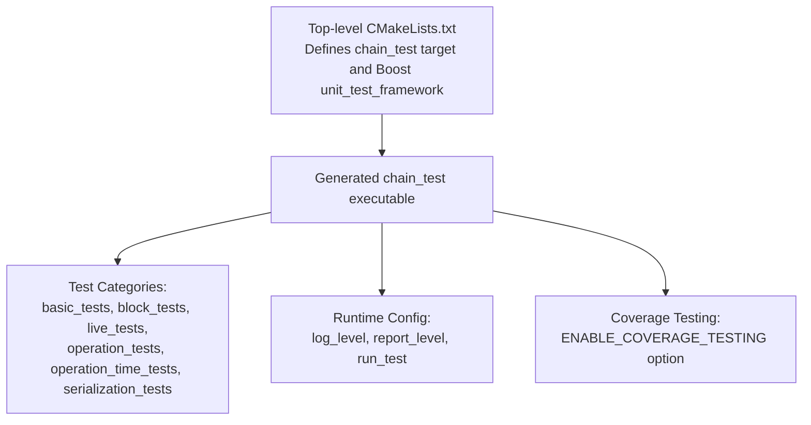
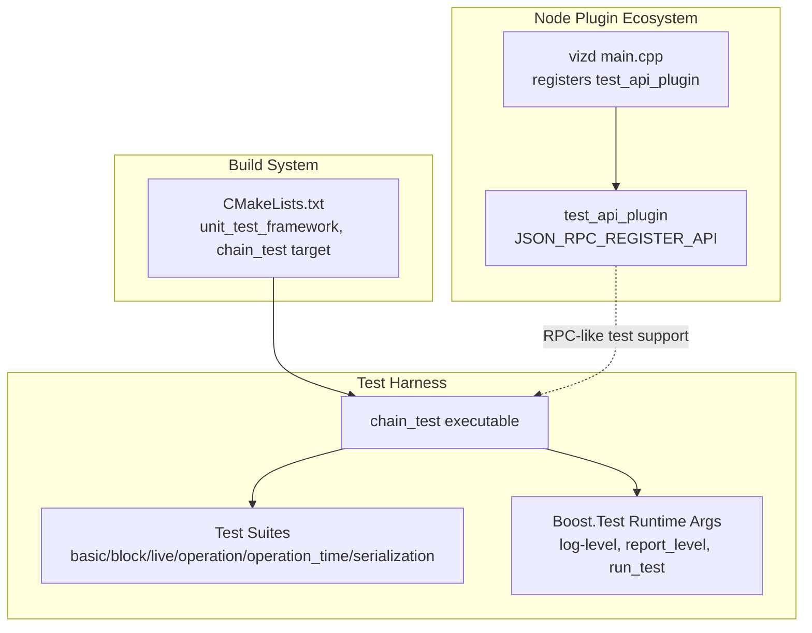
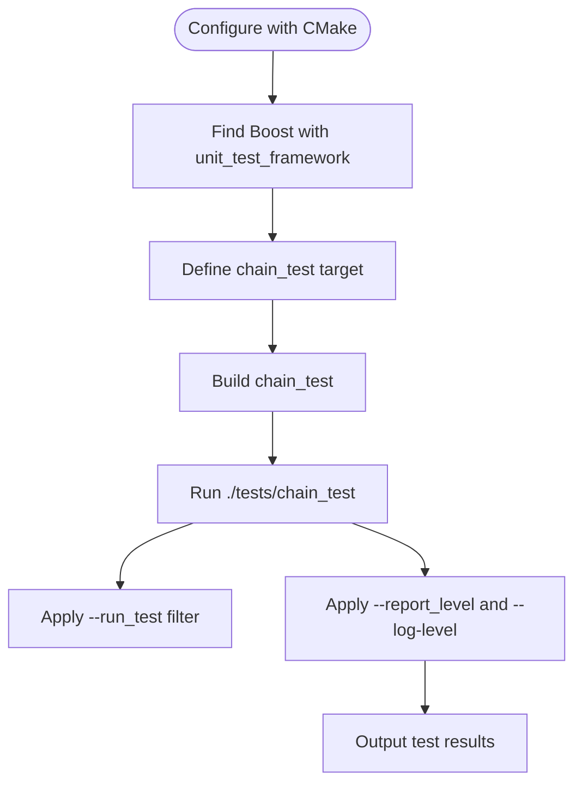
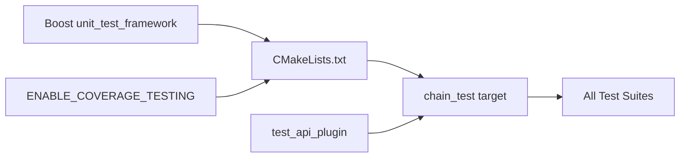
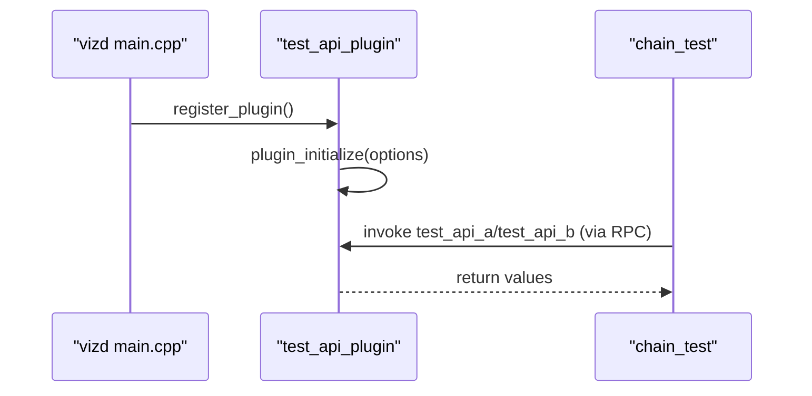

# Unit Testing Infrastructure

<cite>
**Referenced Files in This Document**
- [CMakeLists.txt](file://CMakeLists.txt)
- [testing.md](file://documentation/testing.md)
- [test_api_plugin.hpp](file://plugins/test_api/include/graphene/plugins/test_api/test_api_plugin.hpp)
- [test_api_plugin.cpp](file://plugins/test_api/test_api_plugin.cpp)
- [main.cpp](file://programs/vizd/main.cpp)
</cite>

## Table of Contents
1. [Introduction](#introduction)
2. [Project Structure](#project-structure)
3. [Core Components](#core-components)
4. [Architecture Overview](#architecture-overview)
5. [Detailed Component Analysis](#detailed-component-analysis)
6. [Dependency Analysis](#dependency-analysis)
7. [Performance Considerations](#performance-considerations)
8. [Troubleshooting Guide](#troubleshooting-guide)
9. [Conclusion](#conclusion)
10. [Appendices](#appendices)

## Introduction
This document describes the unit testing infrastructure for VIZ CPP Node with a focus on the Boost.Test framework setup and configuration used across the testing suite. It explains the test categories, execution mechanisms via the chain_test target, runtime configuration options, and best practices for test development, data management, mocking, and environment isolation.

## Project Structure
The testing infrastructure is primarily driven by the top-level build configuration and a dedicated test API plugin that supports test harnesses. The key elements are:
- Top-level CMake configuration enabling Boost unit_test_framework and defining the chain_test target
- Test category documentation and runtime configuration options
- A minimal test API plugin used by the node to support test scenarios

**Diagram sources**
- [CMakeLists.txt](file://CMakeLists.txt#L38-L50)
- [CMakeLists.txt](file://CMakeLists.txt#L204-L208)
- [testing.md](file://documentation/testing.md#L3-L23)

**Section sources**
- [CMakeLists.txt](file://CMakeLists.txt#L38-L50)
- [CMakeLists.txt](file://CMakeLists.txt#L204-L208)
- [testing.md](file://documentation/testing.md#L3-L23)

## Core Components
- Boost.Test framework integration:
  - Boost unit_test_framework is included as a required component for building the test target.
  - The chain_test target is produced by the build system and runs all unit tests.
- Test categories:
  - basic_tests: Fundamental functionality tests
  - block_tests: Blockchain operation tests
  - live_tests: Live chain data validation (historical/past hardfork testing)
  - operation_tests: Individual operation validation
  - operation_time_tests: Time-dependent operations (e.g., vesting withdrawals)
  - serialization_tests: Data encoding/decoding tests
- Runtime configuration:
  - log_level: Controls logging verbosity (all, success, test_suite, message, warning, error, cpp_exception, system_error, fatal_error, nothing)
  - report_level: Controls reporting detail (no, confirm, short, detailed)
  - run_test: Filters which test units to execute (supports selecting suites and individual test cases)
- Code coverage:
  - ENABLE_COVERAGE_TESTING option enables coverage flags during Debug builds

Practical execution:
- Build and run: make chain_test followed by ./tests/chain_test
- Selective execution: pass --run_test=<suite_or_case> to filter tests
- Reporting customization: pass --report_level=<level> and --log-level=<level>

**Section sources**
- [CMakeLists.txt](file://CMakeLists.txt#L38-L50)
- [testing.md](file://documentation/testing.md#L3-L23)
- [CMakeLists.txt](file://CMakeLists.txt#L204-L208)

## Architecture Overview
The testing architecture centers on the Boost.Test framework integrated through CMake. The chain_test executable aggregates all registered tests across categories and executes them according to runtime configuration. The test API plugin is part of the node’s plugin ecosystem and can be leveraged by tests requiring RPC-like interactions.

**Diagram sources**
- [CMakeLists.txt](file://CMakeLists.txt#L38-L50)
- [testing.md](file://documentation/testing.md#L3-L23)
- [test_api_plugin.cpp](file://plugins/test_api/test_api_plugin.cpp#L15-L16)
- [test_api_plugin.hpp](file://plugins/test_api/include/graphene/plugins/test_api/test_api_plugin.hpp#L35-L52)
- [main.cpp](file://programs/vizd/main.cpp#L11-L71)

## Detailed Component Analysis

### Boost.Test Integration and chain_test Target
- The build configuration includes Boost unit_test_framework as a required component, ensuring the test framework is available.
- The chain_test target produces an executable that runs all unit tests.
- Optional coverage instrumentation is enabled via ENABLE_COVERAGE_TESTING, which injects coverage flags in Debug builds.

**Diagram sources**
- [CMakeLists.txt](file://CMakeLists.txt#L38-L50)
- [CMakeLists.txt](file://CMakeLists.txt#L204-L208)
- [testing.md](file://documentation/testing.md#L3-L23)

**Section sources**
- [CMakeLists.txt](file://CMakeLists.txt#L38-L50)
- [CMakeLists.txt](file://CMakeLists.txt#L204-L208)
- [testing.md](file://documentation/testing.md#L3-L23)

### Test Categories
The testing suite organizes tests into six categories:
- basic_tests: Validates basic functionality
- block_tests: Validates blockchain operations
- live_tests: Validates against live chain data (historical hardfork checks)
- operation_tests: Validates individual operations
- operation_time_tests: Validates time-dependent operations
- serialization_tests: Validates data encoding/decoding

These categories are executed by the chain_test target and can be filtered using the run_test runtime argument.

**Section sources**
- [testing.md](file://documentation/testing.md#L6-L14)

### Runtime Configuration Options
- log_level: Controls logging verbosity. Values include all, success, test_suite, message, warning, error, cpp_exception, system_error, fatal_error, nothing.
- report_level: Controls reporting detail. Values include no, confirm, short, detailed.
- run_test: Selectively executes test suites or individual test cases. Examples:
  - Run a whole suite: --run_test=operation_tests
  - Run a specific case: --run_test=operation_tests/delegation

These options are passed to the chain_test executable and align with Boost.Test’s documented runtime configuration.

**Section sources**
- [testing.md](file://documentation/testing.md#L16-L23)

### Test Data Management, Mock Objects, and Environment Isolation
- Test data management:
  - Use temporary directories and isolated databases per test case to prevent cross-contamination.
  - For blockchain-related tests, initialize a clean database state and reset forks as needed.
- Mock objects:
  - Utilize lightweight mocks for external dependencies (e.g., network, storage) to isolate unit under test.
  - Prefer dependency injection to swap real implementations with test doubles.
- Environment isolation:
  - Run tests in separate processes or containers when necessary.
  - Avoid global mutable state; prefer per-test fixtures and deterministic initialization.

[No sources needed since this section provides general guidance]

### Adding New Test Cases
- Create a new test suite or add to existing ones (e.g., operation_tests) using Boost.Test macros.
- Register test cases with meaningful names and organize them by category.
- Use run_test to selectively execute new cases during development.
- Keep tests deterministic and fast; avoid heavy I/O or external dependencies.

[No sources needed since this section provides general guidance]

## Dependency Analysis
The testing infrastructure depends on:
- Boost.Test framework (unit_test_framework) for test discovery and execution
- CMake configuration to produce the chain_test target
- Optional coverage flags controlled by ENABLE_COVERAGE_TESTING
- The test API plugin for RPC-like interactions within tests

**Diagram sources**
- [CMakeLists.txt](file://CMakeLists.txt#L38-L50)
- [CMakeLists.txt](file://CMakeLists.txt#L204-L208)
- [test_api_plugin.cpp](file://plugins/test_api/test_api_plugin.cpp#L15-L16)
- [test_api_plugin.hpp](file://plugins/test_api/include/graphene/plugins/test_api/test_api_plugin.hpp#L35-L52)

**Section sources**
- [CMakeLists.txt](file://CMakeLists.txt#L38-L50)
- [CMakeLists.txt](file://CMakeLists.txt#L204-L208)
- [test_api_plugin.cpp](file://plugins/test_api/test_api_plugin.cpp#L15-L16)
- [test_api_plugin.hpp](file://plugins/test_api/include/graphene/plugins/test_api/test_api_plugin.hpp#L35-L52)

## Performance Considerations
- Keep tests fast and deterministic; avoid unnecessary I/O or network calls.
- Use small, focused test cases and minimize fixture setup/teardown overhead.
- Leverage run_test to execute only relevant suites during development.
- Enable coverage only when needed to reduce build and runtime overhead.

[No sources needed since this section provides general guidance]

## Troubleshooting Guide
- If chain_test does not appear after building, verify the chain_test target exists and that Boost unit_test_framework is properly linked.
- If tests fail due to missing runtime configuration, ensure you pass --log-level, --report_level, and/or --run_test as needed.
- For coverage issues, confirm ENABLE_COVERAGE_TESTING is enabled and that lcov steps are executed correctly.

**Section sources**
- [CMakeLists.txt](file://CMakeLists.txt#L38-L50)
- [testing.md](file://documentation/testing.md#L26-L42)

## Conclusion
The VIZ CPP Node testing infrastructure leverages Boost.Test through a well-defined CMake configuration that produces the chain_test executable. Tests are categorized for clarity and can be selectively executed using runtime arguments. The test API plugin integrates with the node to support RPC-like interactions in tests. By following best practices for test data management, mocking, and environment isolation, developers can maintain a robust and reliable testing suite.

[No sources needed since this section summarizes without analyzing specific files]

## Appendices

### Appendix A: Test API Plugin Integration
The test_api_plugin registers a JSON-RPC API surface and is initialized by the node. While primarily intended for runtime node operations, it can also serve as a controlled interface for tests that require deterministic RPC-like behavior.

**Diagram sources**
- [test_api_plugin.cpp](file://plugins/test_api/test_api_plugin.cpp#L15-L16)
- [test_api_plugin.cpp](file://plugins/test_api/test_api_plugin.cpp#L25-L35)
- [test_api_plugin.hpp](file://plugins/test_api/include/graphene/plugins/test_api/test_api_plugin.hpp#L35-L52)
- [main.cpp](file://programs/vizd/main.cpp#L11-L71)

**Section sources**
- [test_api_plugin.cpp](file://plugins/test_api/test_api_plugin.cpp#L15-L16)
- [test_api_plugin.cpp](file://plugins/test_api/test_api_plugin.cpp#L25-L35)
- [test_api_plugin.hpp](file://plugins/test_api/include/graphene/plugins/test_api/test_api_plugin.hpp#L35-L52)
- [main.cpp](file://programs/vizd/main.cpp#L11-L71)