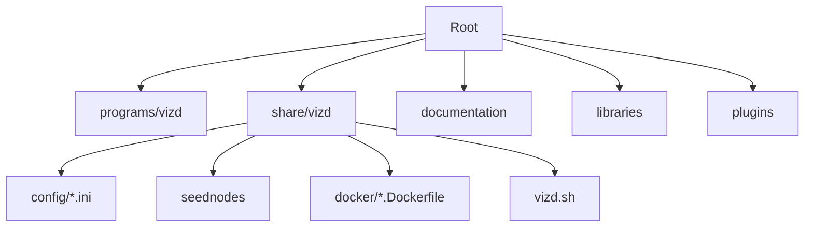
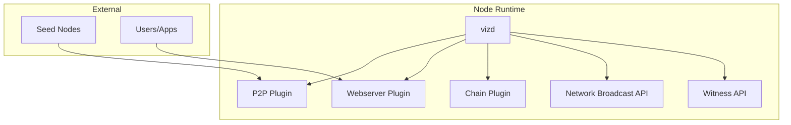
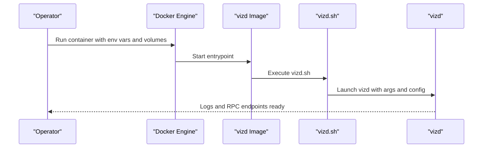
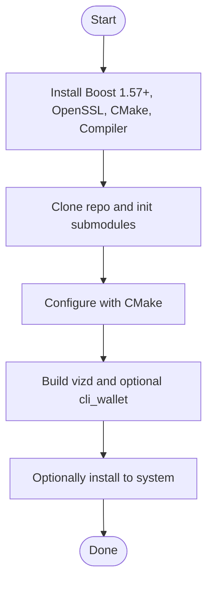
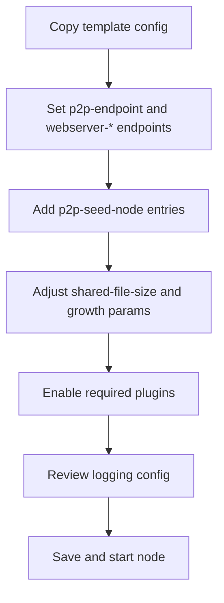
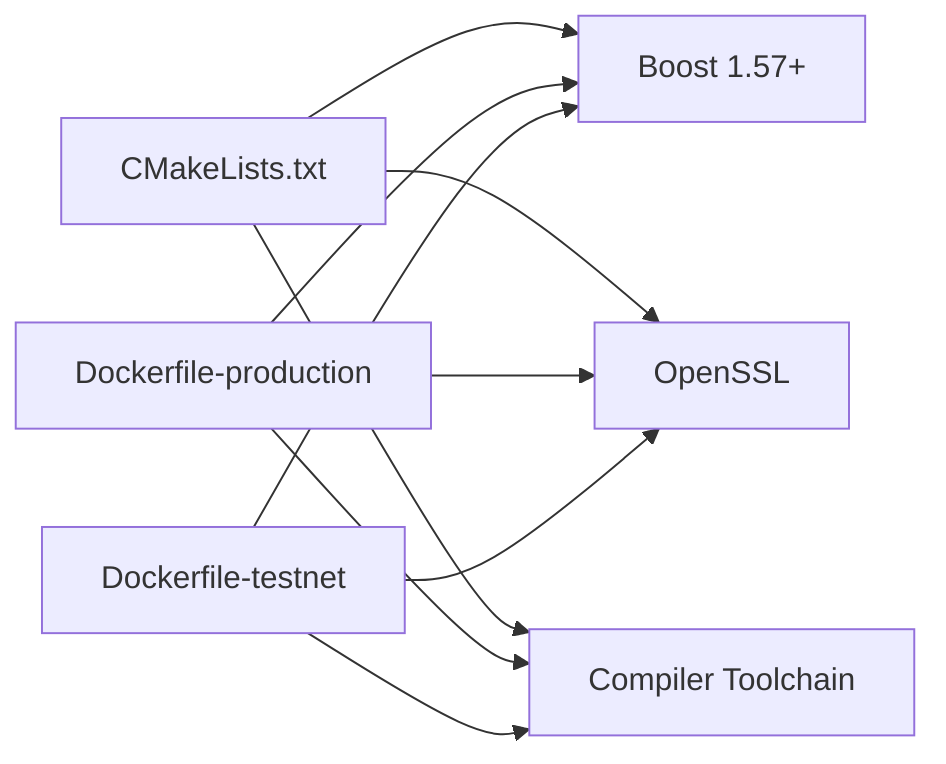

# Getting Started

<cite>
**Referenced Files in This Document**
- [README.md](file://README.md)
- [CMakeLists.txt](file://CMakeLists.txt)
- [documentation/building.md](file://documentation/building.md)
- [documentation/testnet.md](file://documentation/testnet.md)
- [programs/vizd/main.cpp](file://programs/vizd/main.cpp)
- [share/vizd/config/config.ini](file://share/vizd/config/config.ini)
- [share/vizd/config/config_testnet.ini](file://share/vizd/config/config_testnet.ini)
- [share/vizd/config/config_witness.ini](file://share/vizd/config/config_witness.ini)
- [share/vizd/seednodes](file://share/vizd/seednodes)
- [share/vizd/vizd.sh](file://share/vizd/vizd.sh)
- [share/vizd/docker/Dockerfile-production](file://share/vizd/docker/Dockerfile-production)
- [share/vizd/docker/Dockerfile-testnet](file://share/vizd/docker/Dockerfile-testnet)
</cite>

## Table of Contents
1. [Introduction](#introduction)
2. [Project Structure](#project-structure)
3. [Core Components](#core-components)
4. [Architecture Overview](#architecture-overview)
5. [Detailed Component Analysis](#detailed-component-analysis)
6. [Dependency Analysis](#dependency-analysis)
7. [Performance Considerations](#performance-considerations)
8. [Troubleshooting Guide](#troubleshooting-guide)
9. [Conclusion](#conclusion)
10. [Appendices](#appendices)

## Introduction
This guide helps you install, configure, and run a VIZ node quickly. It covers:
- Prerequisites and environment setup
- Multiple installation approaches: Docker, manual compilation, and package installation
- First-time setup, configuration, and initial synchronization
- Practical scenarios: full node, testnet node, and witness node
- Security considerations, monitoring, and troubleshooting

## Project Structure
At a high level, the repository provides:
- A production-ready node binary (vizd)
- Configuration templates for mainnet and testnet
- Dockerfiles for containerized deployment
- Build scripts and documentation for manual compilation

**Diagram sources**
- [programs/vizd/main.cpp](file://programs/vizd/main.cpp#L106-L158)
- [share/vizd/config/config.ini](file://share/vizd/config/config.ini#L1-L130)
- [share/vizd/docker/Dockerfile-production](file://share/vizd/docker/Dockerfile-production#L1-L88)
- [share/vizd/vizd.sh](file://share/vizd/vizd.sh#L1-L82)

**Section sources**
- [README.md](file://README.md#L1-L53)
- [programs/vizd/main.cpp](file://programs/vizd/main.cpp#L106-L158)

## Core Components
- Node binary: vizd, the core blockchain node
- Configuration: config.ini for mainnet, config_testnet.ini for testnet, config_witness.ini for witness-only setups
- Seed nodes: curated list to bootstrap P2P connectivity
- Docker images: prebuilt or self-built images for quick deployment

Key runtime entry point and plugin registration are defined in the node’s main program.

**Section sources**
- [programs/vizd/main.cpp](file://programs/vizd/main.cpp#L62-L90)
- [share/vizd/config/config.ini](file://share/vizd/config/config.ini#L69-L73)
- [share/vizd/config/config_testnet.ini](file://share/vizd/config/config_testnet.ini#L69-L73)
- [share/vizd/config/config_witness.ini](file://share/vizd/config/config_witness.ini#L68-L86)
- [share/vizd/seednodes](file://share/vizd/seednodes#L1-L6)

## Architecture Overview
The node exposes:
- P2P endpoint for peer-to-peer communication
- JSON-RPC HTTP and WebSocket endpoints for API access
- Optional witness production controls

**Diagram sources**
- [programs/vizd/main.cpp](file://programs/vizd/main.cpp#L62-L90)
- [share/vizd/config/config.ini](file://share/vizd/config/config.ini#L1-L20)
- [share/vizd/config/config_testnet.ini](file://share/vizd/config/config_testnet.ini#L1-L20)
- [share/vizd/config/config_witness.ini](file://share/vizd/config/config_witness.ini#L1-L20)

## Detailed Component Analysis

### Prerequisites and Environment Setup
Supported platforms:
- Linux Ubuntu LTS
- macOS
- Windows (compilation notes are provided; official CI focuses on Linux/macOS)

Dependencies:
- Boost 1.57+
- OpenSSL
- CMake
- Compiler toolchains (GCC/Clang)

Build-time options:
- Release vs Debug
- Low-memory node mode
- Testnet vs mainnet builds
- MongoDB plugin toggle

**Section sources**
- [CMakeLists.txt](file://CMakeLists.txt#L97-L104)
- [CMakeLists.txt](file://CMakeLists.txt#L56-L64)
- [CMakeLists.txt](file://CMakeLists.txt#L66-L74)
- [CMakeLists.txt](file://CMakeLists.txt#L83-L89)
- [documentation/building.md](file://documentation/building.md#L3-L16)
- [documentation/building.md](file://documentation/building.md#L25-L75)
- [documentation/building.md](file://documentation/building.md#L138-L189)

### Installation Approaches

#### Option A: Docker Deployment (Recommended for beginners)
- Use prebuilt images or build locally
- Exposed ports: P2P (2001), HTTP RPC (8090), WebSocket RPC (8091)
- Volume mounts for persistent data and config

**Diagram sources**
- [README.md](file://README.md#L12-L29)
- [share/vizd/docker/Dockerfile-production](file://share/vizd/docker/Dockerfile-production#L66-L88)
- [share/vizd/vizd.sh](file://share/vizd/vizd.sh#L74-L81)

Practical steps:
- Pull or build the production image
- Run with mapped ports and volumes
- Optionally set seed nodes via environment variables
- Inspect logs and verify RPC availability

**Section sources**
- [README.md](file://README.md#L12-L29)
- [share/vizd/docker/Dockerfile-production](file://share/vizd/docker/Dockerfile-production#L1-L88)
- [share/vizd/vizd.sh](file://share/vizd/vizd.sh#L1-L82)

#### Option B: Manual Compilation from Source
- Ubuntu LTS: install required packages, then build with CMake and make
- macOS: install dependencies via Homebrew, set environment variables for OpenSSL and Boost, then build
- Build targets include vizd and cli_wallet

**Diagram sources**
- [documentation/building.md](file://documentation/building.md#L25-L75)
- [documentation/building.md](file://documentation/building.md#L138-L189)

**Section sources**
- [documentation/building.md](file://documentation/building.md#L25-L75)
- [documentation/building.md](file://documentation/building.md#L138-L189)

#### Option C: Package Installation
- Not documented in this repository; Docker and manual builds are the supported paths
- If packaging is desired, use the build artifacts produced by the CMake pipeline

**Section sources**
- [CMakeLists.txt](file://CMakeLists.txt#L210-L213)

### First-Time Setup and Configuration

#### Initial Configuration Files
- Mainnet: config.ini
- Testnet: config_testnet.ini
- Witness-only: config_witness.ini

Key areas to review:
- P2P endpoint and seed nodes
- RPC endpoints (HTTP and WebSocket)
- Shared memory sizing and growth thresholds
- Plugin selection and enablement
- Logging configuration

**Diagram sources**
- [share/vizd/config/config.ini](file://share/vizd/config/config.ini#L1-L20)
- [share/vizd/config/config.ini](file://share/vizd/config/config.ini#L69-L73)
- [share/vizd/config/config.ini](file://share/vizd/config/config.ini#L111-L130)

**Section sources**
- [share/vizd/config/config.ini](file://share/vizd/config/config.ini#L1-L130)
- [share/vizd/config/config_testnet.ini](file://share/vizd/config/config_testnet.ini#L1-L132)
- [share/vizd/config/config_witness.ini](file://share/vizd/config/config_witness.ini#L1-L107)
- [share/vizd/seednodes](file://share/vizd/seednodes#L1-L6)

#### Initial Synchronization
- The node connects to seed nodes and downloads blocks
- Docker images may preload a snapshot to accelerate first sync
- Monitor logs to confirm peers and block progress

**Section sources**
- [README.md](file://README.md#L31-L38)
- [share/vizd/vizd.sh](file://share/vizd/vizd.sh#L44-L53)

### Practical Scenarios

#### Full Node (Mainnet)
- Use config.ini
- Expose P2P and RPC ports
- Optionally set custom seed nodes via environment variables

**Section sources**
- [share/vizd/config/config.ini](file://share/vizd/config/config.ini#L1-L20)
- [share/vizd/vizd.sh](file://share/vizd/vizd.sh#L17-L29)

#### Testnet Node
- Use config_testnet.ini or the testnet Docker image
- Preloaded snapshot accelerates sync
- Additional test users and keys are documented

**Section sources**
- [share/vizd/config/config_testnet.ini](file://share/vizd/config/config_testnet.ini#L1-L132)
- [share/vizd/docker/Dockerfile-testnet](file://share/vizd/docker/Dockerfile-testnet#L75-L77)
- [documentation/testnet.md](file://documentation/testnet.md#L21-L37)

#### Witness Node
- Use config_witness.ini
- Enable witness and witness_api plugins
- Configure witness name and private key

**Section sources**
- [share/vizd/config/config_witness.ini](file://share/vizd/config/config_witness.ini#L68-L86)
- [share/vizd/config/config_witness.ini](file://share/vizd/config/config_witness.ini#L106-L111)

## Dependency Analysis
- Build-time dependencies: Boost, OpenSSL, CMake, compiler toolchain
- Runtime dependencies: shared libraries linked at build time
- Docker images encapsulate dependencies and expose ports

**Diagram sources**
- [CMakeLists.txt](file://CMakeLists.txt#L97-L104)
- [share/vizd/docker/Dockerfile-production](file://share/vizd/docker/Dockerfile-production#L9-L30)
- [share/vizd/docker/Dockerfile-testnet](file://share/vizd/docker/Dockerfile-testnet#L9-L30)

**Section sources**
- [CMakeLists.txt](file://CMakeLists.txt#L97-L104)
- [share/vizd/docker/Dockerfile-production](file://share/vizd/docker/Dockerfile-production#L9-L30)
- [share/vizd/docker/Dockerfile-testnet](file://share/vizd/docker/Dockerfile-testnet#L9-L30)

## Performance Considerations
- Shared memory sizing and growth thresholds impact stability during high load
- Single write thread reduces lock contention for write-heavy workloads
- Plugin notification toggles can reduce overhead on push_transaction
- Thread pool sizing for RPC clients should match CPU cores

**Section sources**
- [share/vizd/config/config.ini](file://share/vizd/config/config.ini#L49-L67)
- [share/vizd/config/config.ini](file://share/vizd/config/config.ini#L36-L47)

## Troubleshooting Guide

Common issues and resolutions:
- Network connectivity
  - Verify P2P endpoint and firewall rules
  - Confirm seed nodes are reachable
  - Override seed nodes via environment variables in Docker

- Configuration errors
  - Validate config.ini sections and plugin lists
  - Ensure endpoints are not conflicting with other services

- Docker-specific
  - Check container logs for initialization errors
  - Confirm volume mounts for persistent data and config
  - Rebuild images if dependencies change

- Witness setup
  - Ensure witness name and private key are configured
  - Adjust participation thresholds for testnet if needed

**Section sources**
- [share/vizd/vizd.sh](file://share/vizd/vizd.sh#L17-L29)
- [share/vizd/config/config.ini](file://share/vizd/config/config.ini#L1-L20)
- [share/vizd/config/config_witness.ini](file://share/vizd/config/config_witness.ini#L82-L86)
- [documentation/testnet.md](file://documentation/testnet.md#L21-L37)

## Conclusion
You now have multiple paths to run a VIZ node:
- Docker for quick start
- Manual build for customization
- Witness configuration for block production

Follow the configuration and troubleshooting sections to ensure a smooth setup and ongoing operation.

## Appendices

### Security Considerations
- Limit RPC exposure to trusted networks or use reverse proxies
- Use strong private keys for witness nodes
- Regularly update the node and monitor logs for anomalies

### Monitoring Node Health
- Observe logs for peer connections and block progress
- Verify RPC endpoints are reachable
- Track shared memory usage and growth thresholds

**Section sources**
- [share/vizd/config/config.ini](file://share/vizd/config/config.ini#L111-L130)
- [share/vizd/vizd.sh](file://share/vizd/vizd.sh#L74-L81)