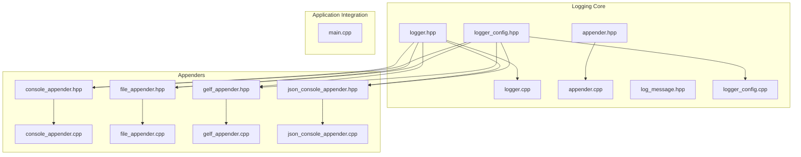
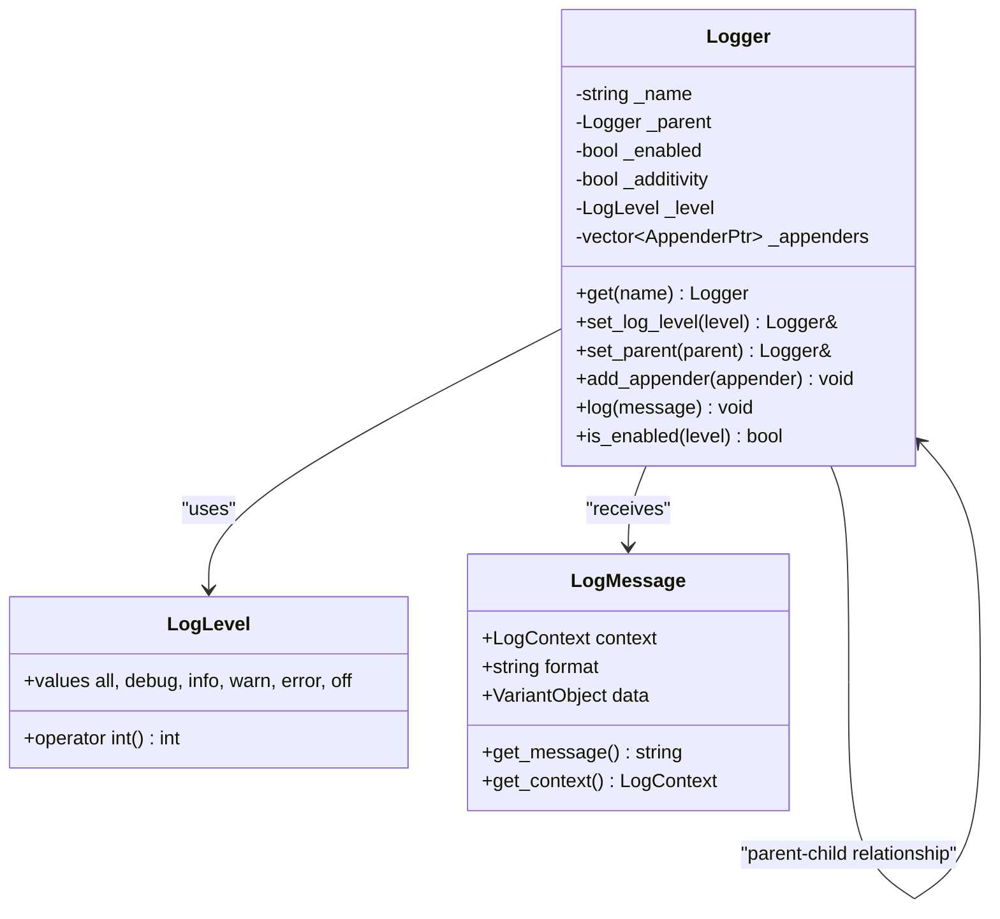
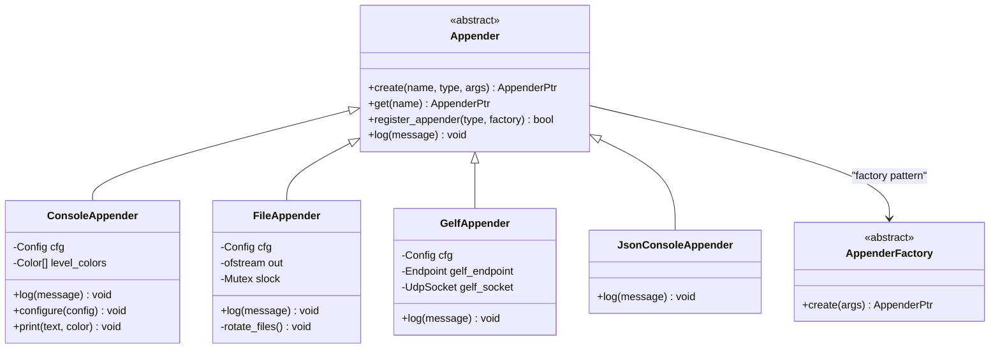
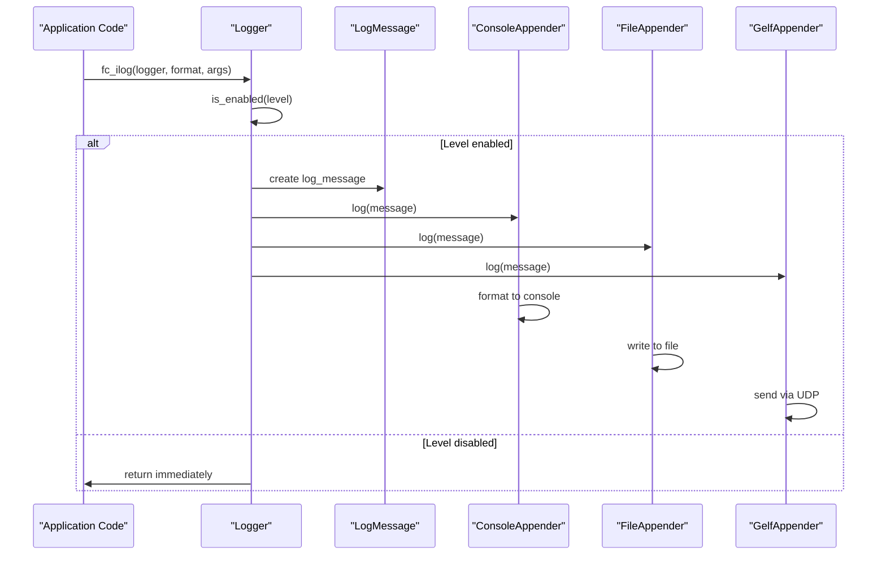
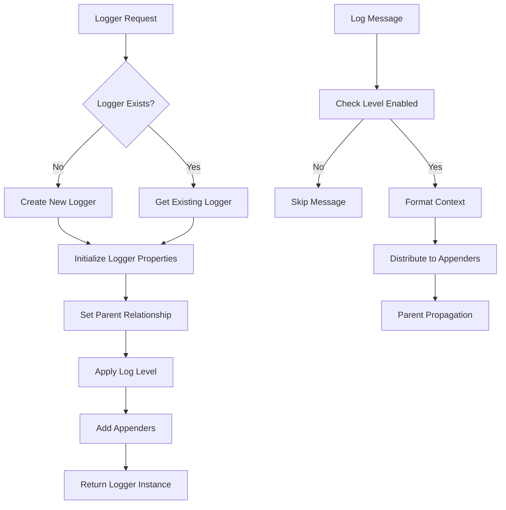
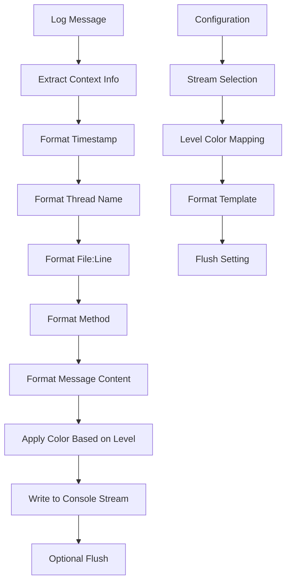
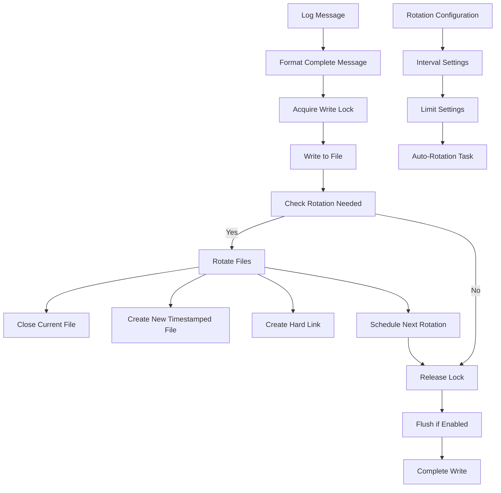
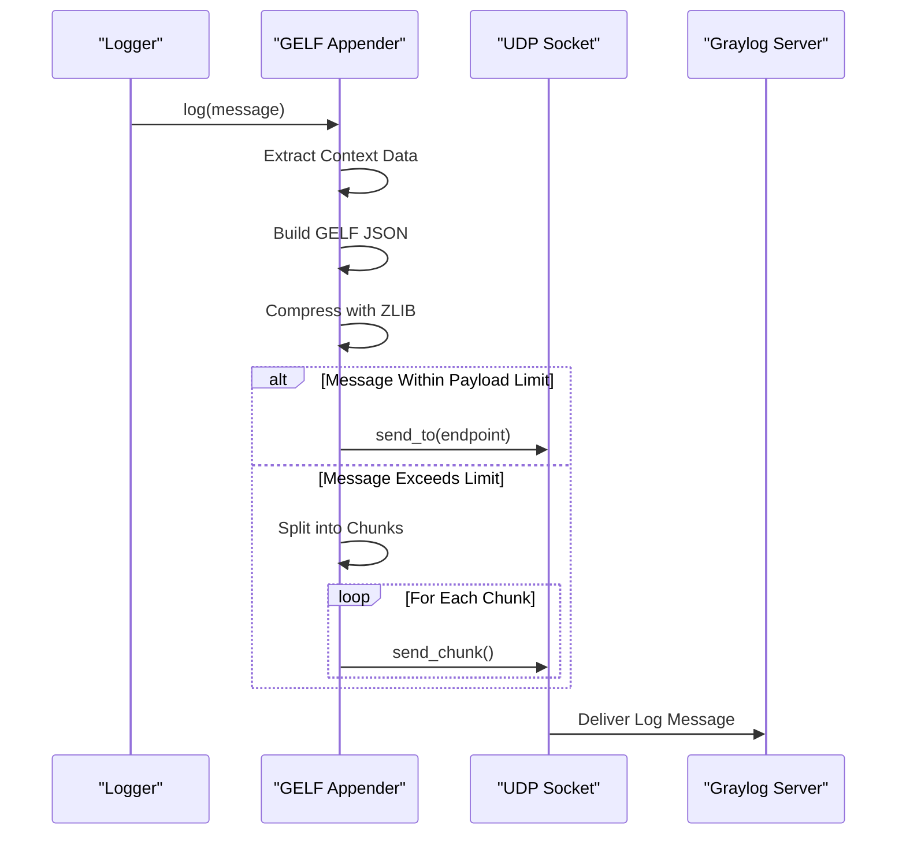
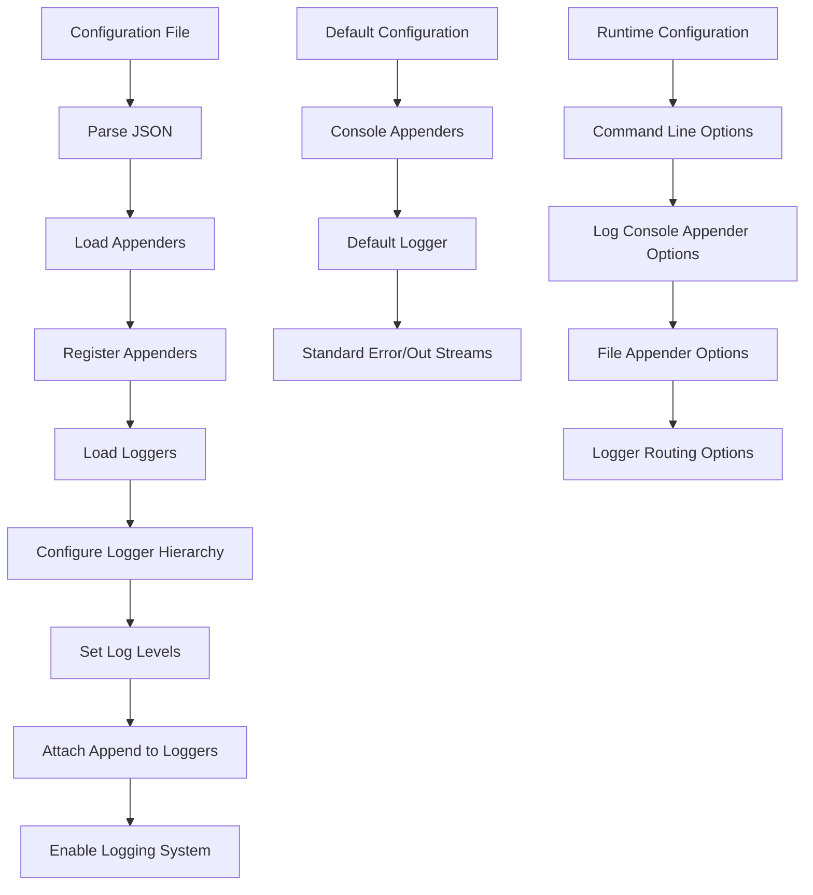
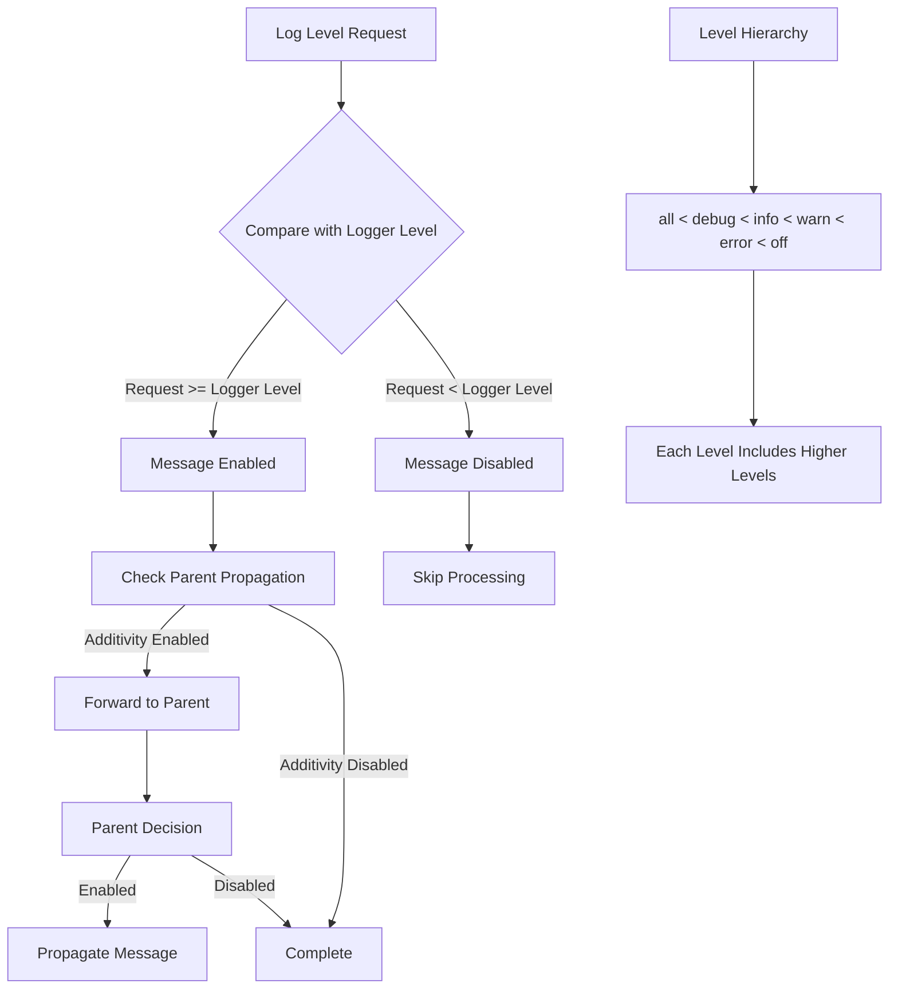

# Logging System

<cite>
**Referenced Files in This Document**
- [logger.hpp](file://thirdparty/fc/include/fc/log/logger.hpp)
- [logger.cpp](file://thirdparty/fc/src/log/logger.cpp)
- [appender.hpp](file://thirdparty/fc/include/fc/log/appender.hpp)
- [appender.cpp](file://thirdparty/fc/src/log/appender.cpp)
- [logger_config.hpp](file://thirdparty/fc/include/fc/log/logger_config.hpp)
- [logger_config.cpp](file://thirdparty/fc/src/log/logger_config.cpp)
- [log_message.hpp](file://thirdparty/fc/include/fc/log/log_message.hpp)
- [console_appender.hpp](file://thirdparty/fc/include/fc/log/console_appender.hpp)
- [console_appender.cpp](file://thirdparty/fc/src/log/console_appender.cpp)
- [file_appender.hpp](file://thirdparty/fc/include/fc/log/file_appender.hpp)
- [file_appender.cpp](file://thirdparty/fc/src/log/file_appender.cpp)
- [gelf_appender.hpp](file://thirdparty/fc/include/fc/log/gelf_appender.hpp)
- [gelf_appender.cpp](file://thirdparty/fc/src/log/gelf_appender.cpp)
- [json_console_appender.hpp](file://thirdparty/fc/include/fc/log/json_console_appender.hpp)
- [json_console_appender.cpp](file://thirdparty/fc/src/log/json_console_appender.cpp)
- [main.cpp](file://programs/vizd/main.cpp)
</cite>

## Table of Contents
1. [Introduction](#introduction)
2. [Project Structure](#project-structure)
3. [Core Components](#core-components)
4. [Architecture Overview](#architecture-overview)
5. [Detailed Component Analysis](#detailed-component-analysis)
6. [Configuration System](#configuration-system)
7. [Log Levels and Filtering](#log-levels-and-filtering)
8. [Performance Considerations](#performance-considerations)
9. [Troubleshooting Guide](#troubleshooting-guide)
10. [Conclusion](#conclusion)

## Introduction

The VIZ logging system is built on the fc (Fast Crypto) library's logging framework, providing a flexible and extensible architecture for capturing application events, errors, and informational messages. This system supports multiple output destinations through appenders, hierarchical logger organization, and configurable log levels with filtering capabilities.

The logging system follows a layered architecture where loggers represent named logging channels, appenders handle the actual output formatting and destination, and log messages carry contextual information about the source and content of each log event.

## Project Structure

The logging system is organized across several key directories and files:

**Diagram sources**
- [logger.hpp:1-195](file://thirdparty/fc/include/fc/log/logger.hpp#L1-L195)
- [appender.hpp:1-51](file://thirdparty/fc/include/fc/log/appender.hpp#L1-L51)
- [logger_config.hpp:1-53](file://thirdparty/fc/include/fc/log/logger_config.hpp#L1-L53)

**Section sources**
- [logger.hpp:1-195](file://thirdparty/fc/include/fc/log/logger.hpp#L1-L195)
- [appender.hpp:1-51](file://thirdparty/fc/include/fc/log/appender.hpp#L1-L51)
- [logger_config.hpp:1-53](file://thirdparty/fc/include/fc/log/logger_config.hpp#L1-L53)

## Core Components

### Logger Hierarchy

The logging system centers around the `logger` class, which provides named logging channels with hierarchical inheritance:

**Diagram sources**
- [logger.hpp:22-72](file://thirdparty/fc/include/fc/log/logger.hpp#L22-L72)
- [log_message.hpp:116-141](file://thirdparty/fc/include/fc/log/log_message.hpp#L116-L141)

### Appender Architecture

The appender system provides pluggable output mechanisms through a factory pattern:

**Diagram sources**
- [appender.hpp:33-49](file://thirdparty/fc/include/fc/log/appender.hpp#L33-L49)
- [console_appender.hpp:8-65](file://thirdparty/fc/include/fc/log/console_appender.hpp#L8-L65)
- [file_appender.hpp:10-33](file://thirdparty/fc/include/fc/log/file_appender.hpp#L10-L33)
- [gelf_appender.hpp:10-27](file://thirdparty/fc/include/fc/log/gelf_appender.hpp#L10-L27)

**Section sources**
- [logger.hpp:22-72](file://thirdparty/fc/include/fc/log/logger.hpp#L22-L72)
- [appender.hpp:33-49](file://thirdparty/fc/include/fc/log/appender.hpp#L33-L49)
- [log_message.hpp:116-141](file://thirdparty/fc/include/fc/log/log_message.hpp#L116-L141)

## Architecture Overview

The logging system implements a publish-subscribe pattern where loggers act as publishers and appenders as subscribers to log events:

**Diagram sources**
- [logger.cpp:72-82](file://thirdparty/fc/src/log/logger.cpp#L72-L82)
- [console_appender.cpp:90-130](file://thirdparty/fc/src/log/console_appender.cpp#L90-L130)
- [file_appender.cpp:161-197](file://thirdparty/fc/src/log/file_appender.cpp#L161-L197)
- [gelf_appender.cpp:73-182](file://thirdparty/fc/src/log/gelf_appender.cpp#L73-L182)

The architecture supports multiple output destinations simultaneously, with each appender handling its own formatting and output mechanism independently.

## Detailed Component Analysis

### Logger Implementation

The logger implementation provides thread-safe access to named logging channels with hierarchical inheritance:

**Diagram sources**
- [logger.cpp:102-106](file://thirdparty/fc/src/log/logger.cpp#L102-L106)
- [logger.cpp:126-135](file://thirdparty/fc/src/log/logger.cpp#L126-L135)

Key features include:
- Thread-safe logger registry using spin locks
- Hierarchical parent-child relationships for log level inheritance
- Additivity property for propagating messages to parent loggers
- Configurable log levels with filtering

**Section sources**
- [logger.cpp:14-26](file://thirdparty/fc/src/log/logger.cpp#L14-L26)
- [logger.cpp:102-141](file://thirdparty/fc/src/log/logger.cpp#L102-L141)

### Console Appender

The console appender provides formatted output to standard error and standard out with color support:

**Diagram sources**
- [console_appender.cpp:90-130](file://thirdparty/fc/src/log/console_appender.cpp#L90-L130)
- [console_appender.hpp:30-39](file://thirdparty/fc/include/fc/log/console_appender.hpp#L30-L39)

**Section sources**
- [console_appender.cpp:21-64](file://thirdparty/fc/src/log/console_appender.cpp#L21-L64)
- [console_appender.cpp:90-162](file://thirdparty/fc/src/log/console_appender.cpp#L90-L162)

### File Appender

The file appender handles persistent log storage with rotation capabilities:

**Diagram sources**
- [file_appender.cpp:60-131](file://thirdparty/fc/src/log/file_appender.cpp#L60-L131)
- [file_appender.cpp:161-197](file://thirdparty/fc/src/log/file_appender.cpp#L161-L197)

**Section sources**
- [file_appender.cpp:16-58](file://thirdparty/fc/src/log/file_appender.cpp#L16-L58)
- [file_appender.cpp:161-197](file://thirdparty/fc/src/log/file_appender.cpp#L161-L197)

### GELF Appender

The Graylog Extended Log Format (GELF) appender enables integration with centralized logging systems:

**Diagram sources**
- [gelf_appender.cpp:73-182](file://thirdparty/fc/src/log/gelf_appender.cpp#L73-L182)

**Section sources**
- [gelf_appender.cpp:22-33](file://thirdparty/fc/src/log/gelf_appender.cpp#L22-L33)
- [gelf_appender.cpp:73-182](file://thirdparty/fc/src/log/gelf_appender.cpp#L73-L182)

## Configuration System

The logging system supports dynamic configuration through structured configuration files:

**Diagram sources**
- [logger_config.cpp:29-67](file://thirdparty/fc/src/log/logger_config.cpp#L29-L67)
- [logger_config.cpp:69-89](file://thirdparty/fc/src/log/logger_config.cpp#L69-L89)

The configuration system supports:
- JSON-based configuration files
- Runtime configuration updates
- Hierarchical logger relationships
- Multiple appender types with custom parameters

**Section sources**
- [logger_config.hpp:35-46](file://thirdparty/fc/include/fc/log/logger_config.hpp#L35-L46)
- [logger_config.cpp:25-67](file://thirdparty/fc/src/log/logger_config.cpp#L25-L67)

## Log Levels and Filtering

The logging system implements a hierarchical level-based filtering mechanism:

**Diagram sources**
- [logger.cpp:68-70](file://thirdparty/fc/src/log/logger.cpp#L68-L70)
- [log_message.hpp:29-31](file://thirdparty/fc/include/fc/log/log_message.hpp#L29-L31)

Supported log levels include:
- `all`: Capture all messages (lowest level)
- `debug`: Debug information and development messages
- `info`: General operational information
- `warn`: Warning conditions requiring attention
- `error`: Error conditions affecting functionality
- `off`: Disable all logging (highest level)

**Section sources**
- [log_message.hpp:21-44](file://thirdparty/fc/include/fc/log/log_message.hpp#L21-L44)
- [logger.cpp:68-70](file://thirdparty/fc/src/log/logger.cpp#L68-L70)

## Performance Considerations

The logging system incorporates several performance optimization strategies:

### Thread Safety and Concurrency
- Spin locks for logger registry access
- Mutex protection for console output streams
- Separate mutexes for different appenders to minimize contention
- Asynchronous file rotation tasks

### Memory Management
- Smart pointer usage for automatic resource cleanup
- RAII-based file handle management
- Efficient string formatting with pre-allocated buffers

### I/O Optimization
- Optional flushing to reduce disk writes
- Buffered file operations
- Asynchronous rotation to avoid blocking log operations

### Network Efficiency
- UDP-based transmission for GELF appender
- Message compression to reduce bandwidth
- Chunked transmission for large messages

**Section sources**
- [logger.cpp:102-106](file://thirdparty/fc/src/log/logger.cpp#L102-L106)
- [console_appender.cpp:123-125](file://thirdparty/fc/src/log/console_appender.cpp#L123-L125)
- [file_appender.cpp:191-196](file://thirdparty/fc/src/log/file_appender.cpp#L191-L196)

## Troubleshooting Guide

### Common Issues and Solutions

**Log Messages Not Appearing**
- Verify log level configuration matches intended verbosity
- Check logger hierarchy for proper parent-child relationships
- Ensure appenders are properly attached to target loggers

**File Appender Issues**
- Confirm file path permissions and directory existence
- Verify rotation configuration parameters are valid
- Check for file locking issues on Windows systems

**Network Appender Problems**
- Validate GELF endpoint connectivity and port accessibility
- Verify DNS resolution for hostname-based endpoints
- Check firewall settings for UDP traffic

**Performance Degradation**
- Review log level settings to reduce message volume
- Consider disabling unnecessary appenders
- Evaluate flush frequency settings for file appenders

**Section sources**
- [file_appender.cpp:144-155](file://thirdparty/fc/src/log/file_appender.cpp#L144-L155)
- [gelf_appender.cpp:65-67](file://thirdparty/fc/src/log/gelf_appender.cpp#L65-L67)

## Conclusion

The VIZ logging system provides a robust, extensible foundation for application monitoring and debugging. Its modular architecture supports multiple output destinations, hierarchical organization, and flexible configuration options. The system balances performance with functionality through careful concurrency management and efficient I/O operations.

Key strengths include:
- Pluggable appender architecture supporting diverse output formats
- Hierarchical logger organization with intelligent level propagation
- Comprehensive configuration system supporting runtime modifications
- Performance optimizations for production environments
- Integration capabilities with external logging systems

The system serves as a solid foundation for both development debugging and production monitoring, with clear extension points for custom logging requirements.