# P2P Plugin

<cite>
**Referenced Files in This Document**
- [p2p_plugin.hpp](file://plugins/p2p/include/graphene/plugins/p2p/p2p_plugin.hpp)
- [p2p_plugin.cpp](file://plugins/p2p/p2p_plugin.cpp)
- [node.hpp](file://libraries/network/include/graphene/network/node.hpp)
- [peer_connection.hpp](file://libraries/network/include/graphene/network/peer_connection.hpp)
- [peer_database.hpp](file://libraries/network/include/graphene/network/peer_database.hpp)
- [core_messages.hpp](file://libraries/network/include/graphene/network/core_messages.hpp)
- [message.hpp](file://libraries/network/include/graphene/network/message.hpp)
- [config.hpp](file://libraries/network/include/graphene/network/config.hpp)
- [node.cpp](file://libraries/network/node.cpp)
- [database.hpp](file://libraries/chain/include/graphene/chain/database.hpp)
- [dlt_block_log.hpp](file://libraries/chain/include/graphene/chain/dlt_block_log.hpp)
- [dlt_block_log.cpp](file://libraries/chain/dlt_block_log.cpp)
- [database.cpp](file://libraries/chain/database.cpp)
- [chainbase.hpp](file://thirdparty/chainbase/include/chainbase/chainbase.hpp)
- [witness.cpp](file://plugins/witness/witness.cpp)
- [CMakeLists.txt](file://plugins/p2p/CMakeLists.txt)
- [config.ini](file://share/vizd/config/config.ini)
</cite>

## Update Summary
**Changes Made**
- Enhanced DLT mode block range management with improved get_block_ids() and get_item() methods
- Added comprehensive logging throughout sync process for DLT mode operations
- Implemented graceful degradation capabilities when peers cannot serve requested items
- Updated minority fork recovery with enhanced peer interaction handling
- Improved peer database logging and statistics collection for troubleshooting

## Table of Contents
1. [Introduction](#introduction)
2. [Project Structure](#project-structure)
3. [Core Components](#core-components)
4. [Architecture Overview](#architecture-overview)
5. [Detailed Component Analysis](#detailed-component-analysis)
6. [DLT Mode Block Range Management](#dlt-mode-block-range-management)
7. [Enhanced Peer Interaction Handling](#enhanced-peer-interaction-handling)
8. [Comprehensive Logging Throughout Sync Process](#comprehensive-logging-throughout-sync-process)
9. [Graceful Degradation Capabilities](#graceful-degradation-capabilities)
10. [Minority Fork Recovery](#minority-fork-recovery)
11. [Enhanced Block Validation](#enhanced-block-validation)
12. [Concurrent Access Safety](#concurrent-access-safety)
13. [Logging Level Consistency](#logging-level-consistency)
14. [Dependency Analysis](#dependency-analysis)
15. [Performance Considerations](#performance-considerations)
16. [Troubleshooting Guide](#troubleshooting-guide)
17. [Conclusion](#conclusion)

## Introduction

The P2P (Peer-to-Peer) Plugin is a critical component of the VIZ blockchain node that enables decentralized communication between nodes in the network. This plugin provides the foundation for blockchain synchronization, transaction propagation, and peer discovery mechanisms that keep the entire network synchronized and functional.

The plugin implements a sophisticated networking layer built on top of the Graphene network library, providing features such as automatic peer discovery, blockchain synchronization protocols, transaction broadcasting, and advanced peer management capabilities including soft-ban mechanisms and connection monitoring.

**Updated** The plugin now includes enhanced DLT mode block range management, improved peer interaction handling, comprehensive logging throughout the sync process, and graceful degradation capabilities when peers cannot serve requested items. These enhancements provide better support for snapshot-based nodes and improve overall network reliability.

## Project Structure

The P2P plugin follows a modular architecture with clear separation of concerns:

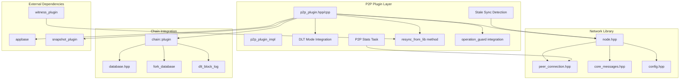
```mermaid
graph TB
subgraph "P2P Plugin Layer"
P2P[p2p_plugin.hpp/cpp]
Impl[p2p_plugin_impl]
DLT[DLT Mode Integration]
Stats[P2P Stats Task]
Stale[Stale Sync Detection]
Resync[resync_from_lib method]
Guard[operation_guard integration]
end
subgraph "Network Library"
Node[node.hpp]
PeerConn[peer_connection.hpp]
Messages[core_messages.hpp]
Config[config.hpp]
end
subgraph "Chain Integration"
Chain[chain::plugin]
Database[database.hpp]
ForkDB[fork_database]
DLTLog[dlt_block_log]
end
subgraph "External Dependencies"
AppBase[appbase]
Snapshot[snapshot_plugin]
Witness[witness_plugin]
end
P2P --> Node
P2P --> Chain
P2P --> AppBase
P2P --> Snapshot
P2P --> Resync
P2P --> Guard
P2P --> DLT
Node --> PeerConn
Node --> Messages
Node --> Config
Chain --> Database
Chain --> ForkDB
Chain --> DLTLog
Witness --> Resync
Stats --> PeerConn
Stale --> Node
```

**Diagram sources**
- [p2p_plugin.hpp:18-55](file://plugins/p2p/include/graphene/plugins/p2p/p2p_plugin.hpp#L18-L55)
- [p2p_plugin.cpp:910-979](file://plugins/p2p/p2p_plugin.cpp#L910-L979)
- [node.hpp:190-320](file://libraries/network/include/graphene/network/node.hpp#L190-L320)

**Section sources**
- [p2p_plugin.hpp:1-57](file://plugins/p2p/include/graphene/plugins/p2p/p2p_plugin.hpp#L1-L57)
- [CMakeLists.txt:1-49](file://plugins/p2p/CMakeLists.txt#L1-L49)

## Core Components

### P2P Plugin Interface

The main plugin class provides a clean interface for managing P2P networking functionality:

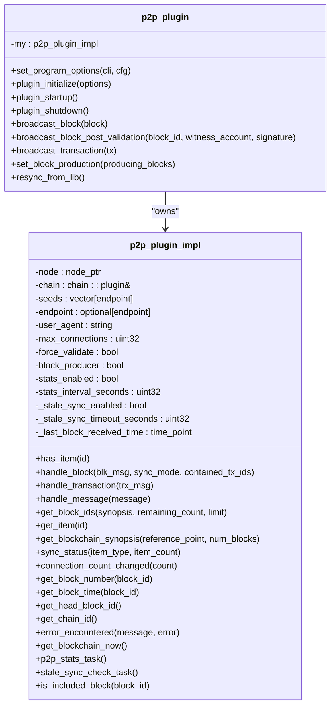
```mermaid
classDiagram
class p2p_plugin {
+set_program_options(cli, cfg)
+plugin_initialize(options)
+plugin_startup()
+plugin_shutdown()
+broadcast_block(block)
+broadcast_block_post_validation(block_id, witness_account, signature)
+broadcast_transaction(tx)
+set_block_production(producing_blocks)
+resync_from_lib()
-my : p2p_plugin_impl
}
class p2p_plugin_impl {
+has_item(id)
+handle_block(blk_msg, sync_mode, contained_tx_ids)
+handle_transaction(trx_msg)
+handle_message(message)
+get_block_ids(synopsis, remaining_count, limit)
+get_item(id)
+get_blockchain_synopsis(reference_point, num_blocks)
+sync_status(item_type, item_count)
+connection_count_changed(count)
+get_block_number(block_id)
+get_block_time(block_id)
+get_head_block_id()
+get_chain_id()
+error_encountered(message, error)
+get_blockchain_now()
+p2p_stats_task()
+stale_sync_check_task()
+is_included_block(block_id)
-node : node_ptr
-chain : chain : : plugin&
-seeds : vector[endpoint]
-endpoint : optional[endpoint]
-user_agent : string
-max_connections : uint32
-force_validate : bool
-block_producer : bool
-stats_enabled : bool
-stats_interval_seconds : uint32
-_stale_sync_enabled : bool
-_stale_sync_timeout_seconds : uint32
-_last_block_received_time : time_point
}
p2p_plugin --> p2p_plugin_impl : "owns"
```

**Diagram sources**
- [p2p_plugin.hpp:18-55](file://plugins/p2p/include/graphene/plugins/p2p/p2p_plugin.hpp#L18-L55)
- [p2p_plugin.cpp:49-126](file://plugins/p2p/p2p_plugin.cpp#L49-L126)

### Network Node Architecture

The plugin integrates with the underlying network infrastructure through a sophisticated node abstraction:

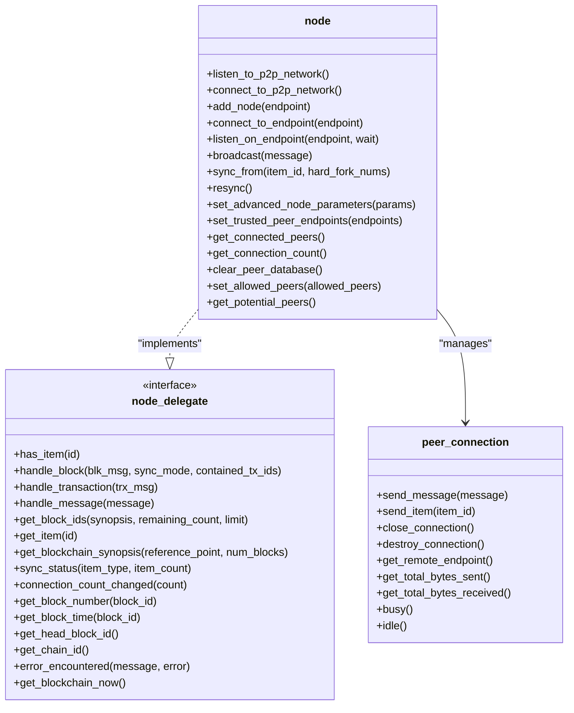
```mermaid
classDiagram
class node {
+listen_to_p2p_network()
+connect_to_p2p_network()
+add_node(endpoint)
+connect_to_endpoint(endpoint)
+listen_on_endpoint(endpoint, wait)
+broadcast(message)
+sync_from(item_id, hard_fork_nums)
+resync()
+set_advanced_node_parameters(params)
+set_trusted_peer_endpoints(endpoints)
+get_connected_peers()
+get_connection_count()
+clear_peer_database()
+set_allowed_peers(allowed_peers)
+get_potential_peers()
}
class node_delegate {
<<interface>>
+has_item(id)
+handle_block(blk_msg, sync_mode, contained_tx_ids)
+handle_transaction(trx_msg)
+handle_message(message)
+get_block_ids(synopsis, remaining_count, limit)
+get_item(id)
+get_blockchain_synopsis(reference_point, num_blocks)
+sync_status(item_type, item_count)
+connection_count_changed(count)
+get_block_number(block_id)
+get_block_time(block_id)
+get_head_block_id()
+get_chain_id()
+error_encountered(message, error)
+get_blockchain_now()
}
class peer_connection {
+send_message(message)
+send_item(item_id)
+close_connection()
+destroy_connection()
+get_remote_endpoint()
+get_total_bytes_sent()
+get_total_bytes_received()
+busy()
+idle()
}
node ..|> node_delegate : "implements"
node --> peer_connection : "manages"
```

**Diagram sources**
- [node.hpp:190-320](file://libraries/network/include/graphene/network/node.hpp#L190-L320)
- [node.hpp:60-167](file://libraries/network/include/graphene/network/node.hpp#L60-L167)
- [peer_connection.hpp:79-354](file://libraries/network/include/graphene/network/peer_connection.hpp#L79-L354)

**Section sources**
- [p2p_plugin.hpp:18-55](file://plugins/p2p/include/graphene/plugins/p2p/p2p_plugin.hpp#L18-L55)
- [node.hpp:190-320](file://libraries/network/include/graphene/network/node.hpp#L190-L320)

## Architecture Overview

The P2P plugin architecture implements a layered approach to blockchain networking:

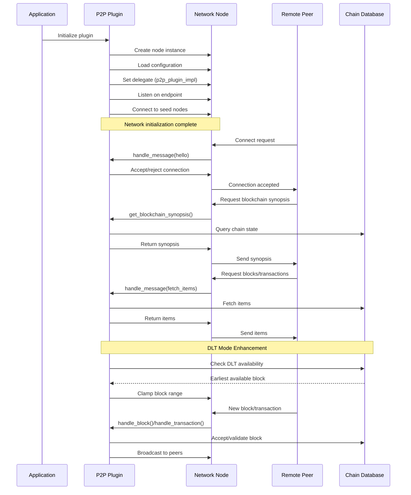
```mermaid
sequenceDiagram
participant App as Application
participant P2P as P2P Plugin
participant Node as Network Node
participant Peer as Remote Peer
participant Chain as Chain Database
App->>P2P : Initialize plugin
P2P->>Node : Create node instance
P2P->>Node : Load configuration
P2P->>Node : Set delegate (p2p_plugin_impl)
P2P->>Node : Listen on endpoint
P2P->>Node : Connect to seed nodes
Note over P2P,Node : Network initialization complete
Peer->>Node : Connect request
Node->>P2P : handle_message(hello)
P2P->>Node : Accept/reject connection
Node->>Peer : Connection accepted
Peer->>Node : Request blockchain synopsis
Node->>P2P : get_blockchain_synopsis()
P2P->>Chain : Query chain state
P2P->>Node : Return synopsis
Node->>Peer : Send synopsis
Peer->>Node : Request blocks/transactions
Node->>P2P : handle_message(fetch_items)
P2P->>Chain : Fetch items
P2P->>Node : Return items
Node->>Peer : Send items
Note over P2P,Chain : DLT Mode Enhancement
P2P->>Chain : Check DLT availability
Chain-->>P2P : Earliest available block
P2P->>Node : Clamp block range
Peer->>Node : New block/transaction
Node->>P2P : handle_block()/handle_transaction()
P2P->>Chain : Accept/validate block
P2P->>Node : Broadcast to peers
```

**Diagram sources**
- [p2p_plugin.cpp:758-823](file://plugins/p2p/p2p_plugin.cpp#L758-L823)
- [node.cpp:1-200](file://libraries/network/node.cpp#L1-L200)

The architecture provides several key capabilities:

1. **Automatic Peer Discovery**: The plugin automatically discovers and connects to seed nodes specified in configuration
2. **Blockchain Synchronization**: Implements efficient blockchain synchronization using selective block fetching with DLT mode awareness
3. **Transaction Propagation**: Broadcasts transactions to connected peers with intelligent caching
4. **Peer Management**: Manages peer connections with soft-ban mechanisms and connection limits
5. **Monitoring and Statistics**: Provides comprehensive peer statistics and network health monitoring
6. **Minority Fork Recovery**: Specialized recovery mechanism for handling minority fork scenarios
7. **Concurrent Access Safety**: Enhanced protection against concurrent access conflicts during block processing
8. **DLT Mode Support**: Intelligent block range management for snapshot-based nodes
9. **Graceful Degradation**: Handles peer unavailability with fallback mechanisms

## Detailed Component Analysis

### Block Validation Protocol

The P2P plugin implements a sophisticated block validation mechanism that enhances security and prevents malicious attacks:

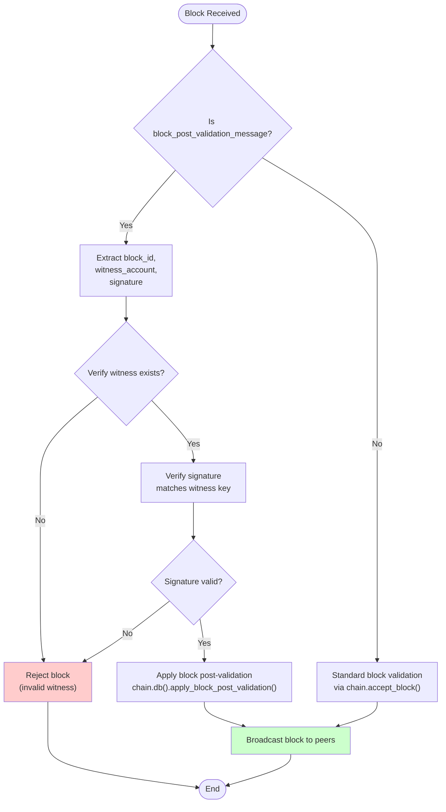
```mermaid
flowchart TD
Start([Block Received]) --> ValidateType{"Is block_post_validation_message?"}
ValidateType --> |No| StandardValidation["Standard block validation<br/>via chain.accept_block()"]
ValidateType --> |Yes| ExtractParams["Extract block_id,<br/>witness_account,<br/>signature"]
ExtractParams --> VerifyWitness{"Verify witness exists?"}
VerifyWitness --> |No| RejectBlock["Reject block<br/>(invalid witness)"]
VerifyWitness --> |Yes| VerifySignature["Verify signature<br/>matches witness key"]
VerifySignature --> SignatureValid{"Signature valid?"}
SignatureValid --> |No| RejectBlock
SignatureValid --> |Yes| ApplyValidation["Apply block post-validation<br/>chain.db().apply_block_post_validation()"]
ApplyValidation --> BroadcastBlock["Broadcast block to peers"]
StandardValidation --> BroadcastBlock
RejectBlock --> End([End])
BroadcastBlock --> End
style RejectBlock fill:#ffcccc
style BroadcastBlock fill:#ccffcc
```

**Diagram sources**
- [p2p_plugin.cpp:216-245](file://plugins/p2p/p2p_plugin.cpp#L216-L245)
- [p2p_plugin.cpp:855-865](file://plugins/p2p/p2p_plugin.cpp#L855-L865)

**Updated** The block validation protocol now includes enhanced concurrent access safety through operation guard protection:

The block validation process incorporates operation guards to prevent concurrent access conflicts during witness key validation and block post-validation processing. This ensures thread-safe access to shared blockchain state during high-load conditions.

The enhanced validation includes:

1. **Witness Signature Verification**: Validates that the block signature matches the claimed witness's public key
2. **Chain ID Consistency**: Ensures blocks belong to the correct blockchain instance
3. **Hard Fork Protection**: Handles different validation requirements across blockchain hard forks
4. **Post-Validation Processing**: Applies additional validation steps after initial acceptance
5. **Concurrent Access Protection**: Uses operation guards to prevent race conditions during validation
6. **Error Handling**: Comprehensive error handling for various failure scenarios

### Peer Connection Management

The plugin manages peer connections through a sophisticated state machine:

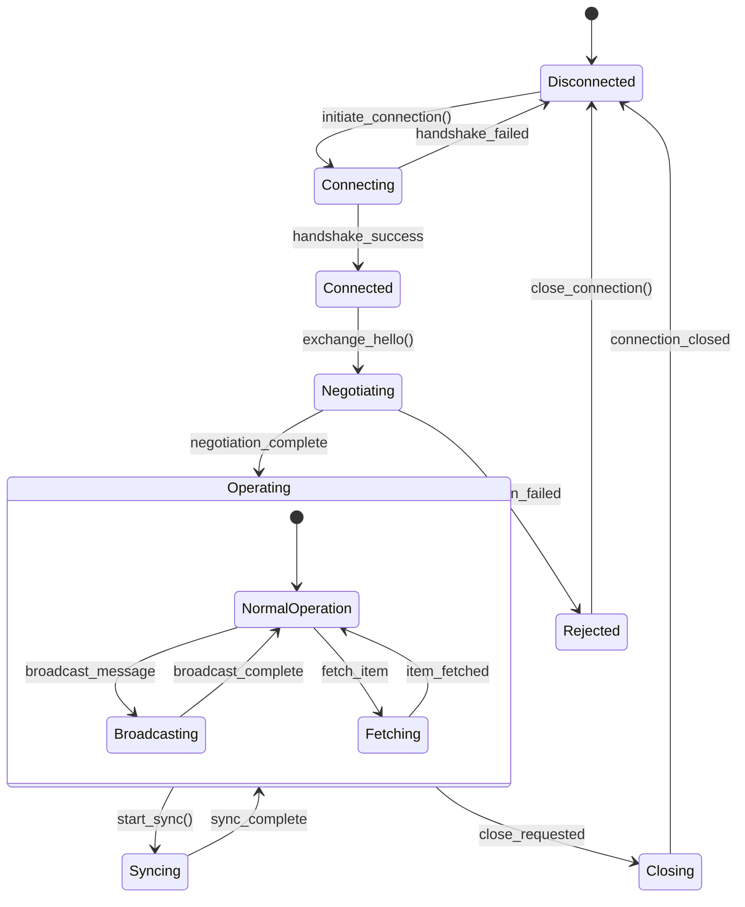
```mermaid
stateDiagram-v2
[*] --> Disconnected
Disconnected --> Connecting : initiate_connection()
Connecting --> Connected : handshake_success
Connecting --> Disconnected : handshake_failed
Connected --> Negotiating : exchange_hello()
Negotiating --> Operating : negotiation_complete
Negotiating --> Rejected : negotiation_failed
Rejected --> Disconnected : close_connection()
Operating --> Syncing : start_sync()
Syncing --> Operating : sync_complete
Operating --> Closing : close_requested
Closing --> Disconnected : connection_closed
state Operating {
[*] --> NormalOperation
NormalOperation --> Broadcasting : broadcast_message
Broadcasting --> NormalOperation : broadcast_complete
NormalOperation --> Fetching : fetch_item
Fetching --> NormalOperation : item_fetched
}
```

**Diagram sources**
- [peer_connection.hpp:82-106](file://libraries/network/include/graphene/network/peer_connection.hpp#L82-L106)

### Blockchain Synchronization Protocol

The synchronization protocol efficiently handles blockchain state reconciliation:

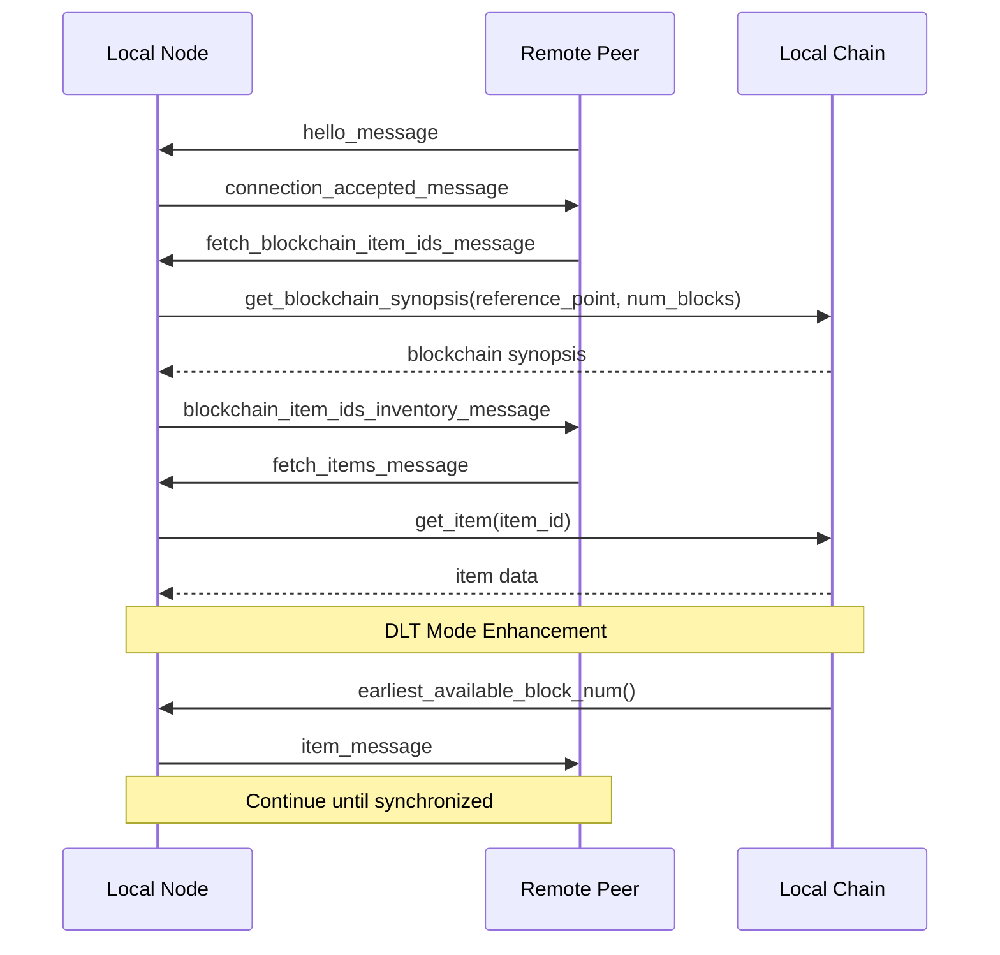
```mermaid
sequenceDiagram
participant Local as Local Node
participant Remote as Remote Peer
participant Chain as Local Chain
Remote->>Local : hello_message
Local->>Remote : connection_accepted_message
Remote->>Local : fetch_blockchain_item_ids_message
Local->>Chain : get_blockchain_synopsis(reference_point, num_blocks)
Chain-->>Local : blockchain synopsis
Local->>Remote : blockchain_item_ids_inventory_message
Remote->>Local : fetch_items_message
Local->>Chain : get_item(item_id)
Chain-->>Local : item data
Note over Local,Chain : DLT Mode Enhancement
Chain->>Local : earliest_available_block_num()
Local->>Remote : item_message
Note over Local,Remote : Continue until synchronized
```

**Diagram sources**
- [core_messages.hpp:188-218](file://libraries/network/include/graphene/network/core_messages.hpp#L188-L218)
- [p2p_plugin.cpp:247-301](file://plugins/p2p/p2p_plugin.cpp#L247-L301)

**Section sources**
- [p2p_plugin.cpp:129-208](file://plugins/p2p/p2p_plugin.cpp#L129-L208)
- [p2p_plugin.cpp:247-301](file://plugins/p2p/p2p_plugin.cpp#L247-L301)
- [peer_connection.hpp:79-354](file://libraries/network/include/graphene/network/peer_connection.hpp#L79-L354)

## DLT Mode Block Range Management

**New** The P2P plugin now includes enhanced DLT (Data Ledger Technology) mode block range management that provides intelligent block serving capabilities for snapshot-based nodes.

### Enhanced get_block_ids() Method

The `get_block_ids()` method has been enhanced to properly handle DLT mode block range constraints:

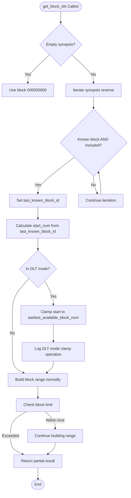
```mermaid
flowchart TD
Start([get_block_ids Called]) --> CheckSynopsis{"Empty synopsis?"}
CheckSynopsis --> |Yes| UseZero["Use block 000000000"]
CheckSynopsis --> |No| IterateSyn["Iterate synopsis reverse"]
IterateSyn --> CheckKnown{"Known block AND included?"}
CheckKnown --> |Yes| FoundBlock["Set last_known_block_id"]
CheckKnown --> |No| ContinueLoop["Continue iteration"]
ContinueLoop --> CheckKnown
FoundBlock --> CalcStart["Calculate start_num from last_known_block_id"]
CalcStart --> CheckDLT{"In DLT mode?"}
CheckDLT --> |No| BuildRange["Build block range normally"]
CheckDLT --> |Yes| ClampRange["Clamp start to earliest_available_block_num"]
ClampRange --> LogClamp["Log DLT mode clamp operation"]
BuildRange --> CheckLimit["Check block limit"]
CheckLimit --> |Exceeded| ReturnResult["Return partial result"]
CheckLimit --> |Within limit| ContinueBuild["Continue building range"]
ContinueBuild --> ReturnResult
ReturnResult --> End([End])
LogClamp --> BuildRange
```

**Diagram sources**
- [p2p_plugin.cpp:290-325](file://plugins/p2p/p2p_plugin.cpp#L290-L325)

### Enhanced get_item() Method

The `get_item()` method now provides comprehensive DLT mode error handling:

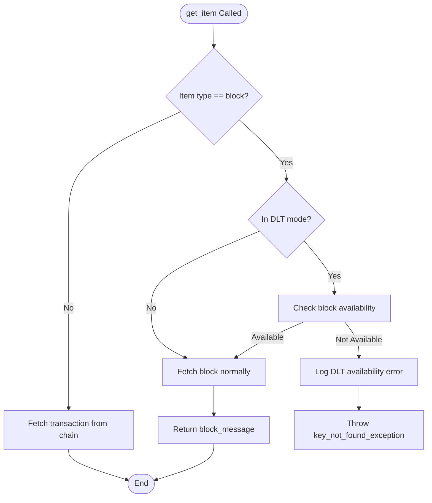
```mermaid
flowchart TD
Start([get_item Called]) --> CheckItemType{"Item type == block?"}
CheckItemType --> |No| FetchTx["Fetch transaction from chain"]
CheckItemType --> |Yes| CheckDLT{"In DLT mode?"}
CheckDLT --> |No| FetchBlock["Fetch block normally"]
CheckDLT --> |Yes| CheckAvailability["Check block availability"]
CheckAvailability --> |Available| FetchBlock
CheckAvailability --> |Not Available| LogError["Log DLT availability error"]
LogError --> ThrowException["Throw key_not_found_exception"]
FetchTx --> End([End])
FetchBlock --> ReturnBlock["Return block_message"]
ReturnBlock --> End
```

**Diagram sources**
- [p2p_plugin.cpp:330-364](file://plugins/p2p/p2p_plugin.cpp#L330-L364)

### DLT Mode Integration Points

The DLT mode integration affects multiple plugin methods:

1. **Block ID Generation**: `get_block_ids()` clamps starting block numbers to available DLT range
2. **Item Serving**: `get_item()` provides detailed logging for unavailable DLT blocks
3. **Synopsis Generation**: `get_blockchain_synopsis()` includes DLT availability context
4. **Earliest Block Calculation**: Database provides `earliest_available_block_num()` for DLT mode

### Database Integration

The database provides DLT-specific functionality:

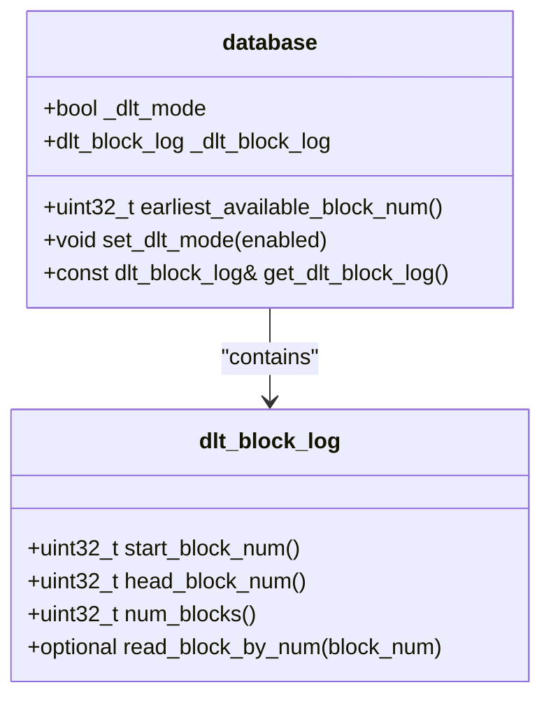
```mermaid
classDiagram
class database {
+bool _dlt_mode
+dlt_block_log _dlt_block_log
+uint32_t earliest_available_block_num()
+void set_dlt_mode(enabled)
+const dlt_block_log& get_dlt_block_log()
}
class dlt_block_log {
+uint32_t start_block_num()
+uint32_t head_block_num()
+uint32_t num_blocks()
+optional<signed_block> read_block_by_num(block_num)
}
database --> dlt_block_log : "contains"
```

**Diagram sources**
- [database.hpp:57-78](file://libraries/chain/include/graphene/chain/database.hpp#L57-L78)
- [dlt_block_log.hpp:35-72](file://libraries/chain/include/graphene/chain/dlt_block_log.hpp#L35-L72)

**Section sources**
- [p2p_plugin.cpp:290-364](file://plugins/p2p/p2p_plugin.cpp#L290-L364)
- [database.hpp:57-78](file://libraries/chain/include/graphene/chain/database.hpp#L57-L78)
- [dlt_block_log.hpp:35-72](file://libraries/chain/include/graphene/chain/dlt_block_log.hpp#L35-L72)

## Enhanced Peer Interaction Handling

**New** The P2P plugin now includes enhanced peer interaction handling with improved error management and graceful degradation capabilities.

### Comprehensive Peer Database Logging

The plugin provides detailed peer database logging for troubleshooting:

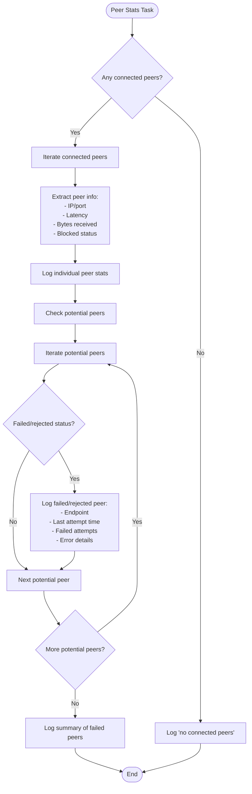
```mermaid
flowchart TD
Start([Peer Stats Task]) --> CheckPeers{"Any connected peers?"}
CheckPeers --> |No| LogNoPeers["Log 'no connected peers'"]
CheckPeers --> |Yes| IteratePeers["Iterate connected peers"]
IteratePeers --> ExtractInfo["Extract peer info:<br/>- IP/port<br/>- Latency<br/>- Bytes received<br/>- Blocked status"]
ExtractInfo --> LogPeer["Log individual peer stats"]
LogPeer --> CheckPotential["Check potential peers"]
CheckPotential --> IteratePotential["Iterate potential peers"]
IteratePotential --> CheckStatus{"Failed/rejected status?"}
CheckStatus --> |No| NextPeer["Next potential peer"]
CheckStatus --> |Yes| LogPotential["Log failed/rejected peer:<br/>- Endpoint<br/>- Last attempt time<br/>- Failed attempts<br/>- Error details"]
LogPotential --> NextPeer
NextPeer --> CheckMore{"More potential peers?"}
CheckMore --> |Yes| IteratePotential
CheckMore --> |No| LogSummary["Log summary of failed peers"]
LogSummary --> End([End])
LogNoPeers --> End
```

**Diagram sources**
- [p2p_plugin.cpp:614-650](file://plugins/p2p/p2p_plugin.cpp#L614-650)

### Graceful Degradation on Peer Failure

The plugin implements graceful degradation when peers cannot serve requested items:

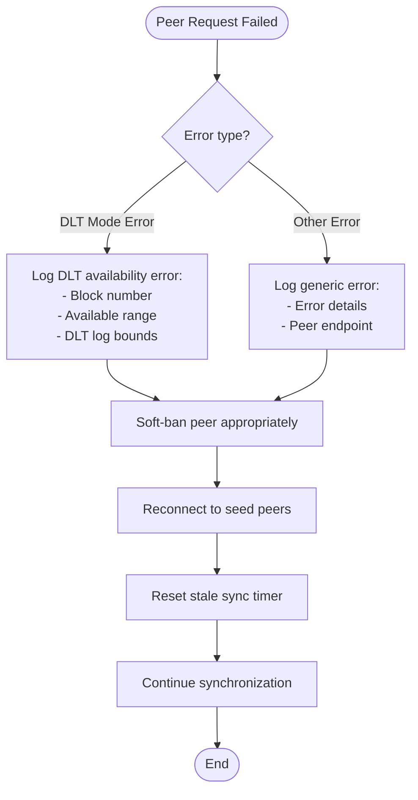
```mermaid
flowchart TD
Start([Peer Request Failed]) --> CheckError{"Error type?"}
CheckError --> |DLT Mode Error| LogDLTError["Log DLT availability error:<br/>- Block number<br/>- Available range<br/>- DLT log bounds"]
CheckError --> |Other Error| LogGenericError["Log generic error:<br/>- Error details<br/>- Peer endpoint"]
LogDLTError --> SoftBanPeer["Soft-ban peer appropriately"]
LogGenericError --> SoftBanPeer
SoftBanPeer --> ReconnectSeed["Reconnect to seed peers"]
ReconnectSeed --> ResetTimer["Reset stale sync timer"]
ResetTimer --> ContinueSync["Continue synchronization"]
ContinueSync --> End([End])
```

**Diagram sources**
- [p2p_plugin.cpp:342-350](file://plugins/p2p/p2p_plugin.cpp#L342-L350)

### Enhanced Stale Sync Detection

The stale sync detection has been enhanced with better peer interaction:

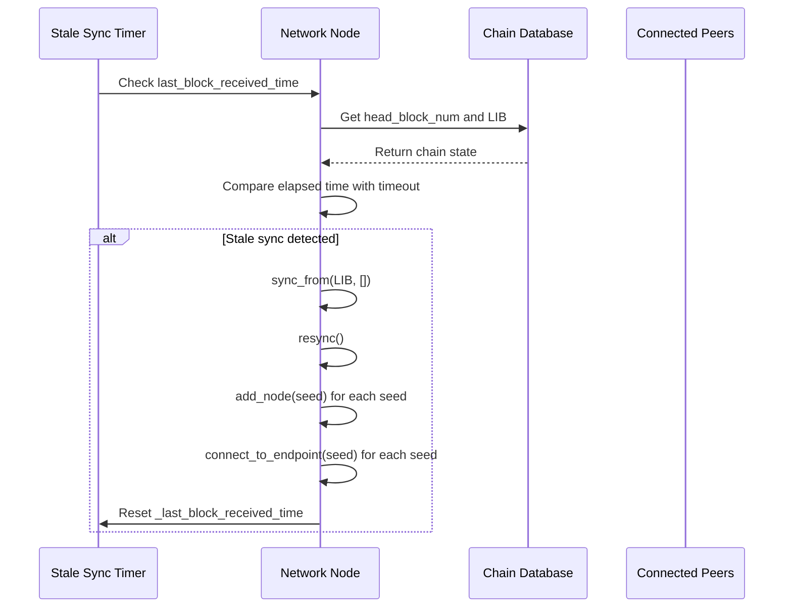
```mermaid
sequenceDiagram
participant Timer as Stale Sync Timer
participant Node as Network Node
participant Chain as Chain Database
participant Peers as Connected Peers
Timer->>Node : Check last_block_received_time
Node->>Chain : Get head_block_num and LIB
Chain-->>Node : Return chain state
Node->>Node : Compare elapsed time with timeout
alt Stale sync detected
Node->>Node : sync_from(LIB, [])
Node->>Node : resync()
Node->>Node : add_node(seed) for each seed
Node->>Node : connect_to_endpoint(seed) for each seed
Node->>Timer : Reset _last_block_received_time
end
```

**Diagram sources**
- [p2p_plugin.cpp:660-724](file://plugins/p2p/p2p_plugin.cpp#L660-L724)

**Section sources**
- [p2p_plugin.cpp:614-650](file://plugins/p2p/p2p_plugin.cpp#L614-L650)
- [p2p_plugin.cpp:342-350](file://plugins/p2p/p2p_plugin.cpp#L342-L350)
- [p2p_plugin.cpp:660-724](file://plugins/p2p/p2p_plugin.cpp#L660-L724)

## Comprehensive Logging Throughout Sync Process

**New** The P2P plugin now includes comprehensive logging throughout the sync process, providing detailed visibility into DLT mode operations and peer interactions.

### DLT Mode Logging Enhancements

The plugin provides detailed logging for DLT mode operations:

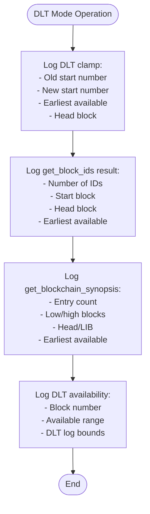
```mermaid
flowchart TD
Start([DLT Mode Operation]) --> LogClamp["Log DLT clamp:<br/>- Old start number<br/>- New start number<br/>- Earliest available<br/>- Head block"]
LogClamp --> LogIDs["Log get_block_ids result:<br/>- Number of IDs<br/>- Start block<br/>- Head block<br/>- Earliest available"]
LogIDs --> LogSynopsis["Log get_blockchain_synopsis:<br/>- Entry count<br/>- Low/high blocks<br/>- Head/LIB<br/>- Earliest available"]
LogSynopsis --> LogAvailability["Log DLT availability:<br/>- Block number<br/>- Available range<br/>- DLT log bounds"]
LogAvailability --> End([End])
```

**Diagram sources**
- [p2p_plugin.cpp:297-323](file://plugins/p2p/p2p_plugin.cpp#L297-L323)
- [p2p_plugin.cpp:480-487](file://plugins/p2p/p2p_plugin.cpp#L480-L487)

### Enhanced Block Processing Logs

The block processing logging has been enhanced with more context:

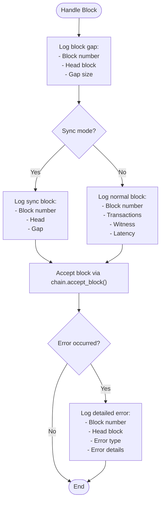
```mermaid
flowchart TD
Start([Handle Block]) --> LogGap["Log block gap:<br/>- Block number<br/>- Head block<br/>- Gap size"]
LogGap --> CheckSyncMode{"Sync mode?"}
CheckSyncMode --> |Yes| LogSync["Log sync block:<br/>- Block number<br/>- Head<br/>- Gap"]
CheckSyncMode --> |No| LogNormal["Log normal block:<br/>- Block number<br/>- Transactions<br/>- Witness<br/>- Latency"]
LogSync --> AcceptBlock["Accept block via chain.accept_block()"]
LogNormal --> AcceptBlock
AcceptBlock --> HandleErrors{"Error occurred?"}
HandleErrors --> |No| End([End])
HandleErrors --> |Yes| LogError["Log detailed error:<br/>- Block number<br/>- Head block<br/>- Error type<br/>- Error details"]
LogError --> End
```

**Diagram sources**
- [p2p_plugin.cpp:151-208](file://plugins/p2p/p2p_plugin.cpp#L151-L208)

### Peer Interaction Logging

The plugin provides comprehensive peer interaction logging:

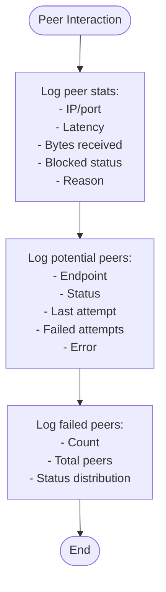
```mermaid
flowchart TD
Start([Peer Interaction]) --> LogPeerStats["Log peer stats:<br/>- IP/port<br/>- Latency<br/>- Bytes received<br/>- Blocked status<br/>- Reason"]
LogPeerStats --> LogPotential["Log potential peers:<br/>- Endpoint<br/>- Status<br/>- Last attempt<br/>- Failed attempts<br/>- Error"]
LogPotential --> LogFailed["Log failed peers:<br/>- Count<br/>- Total peers<br/>- Status distribution"]
LogFailed --> End([End])
```

**Diagram sources**
- [p2p_plugin.cpp:566-644](file://plugins/p2p/p2p_plugin.cpp#L566-L644)

**Section sources**
- [p2p_plugin.cpp:297-323](file://plugins/p2p/p2p_plugin.cpp#L297-L323)
- [p2p_plugin.cpp:480-487](file://plugins/p2p/p2p_plugin.cpp#L480-L487)
- [p2p_plugin.cpp:151-208](file://plugins/p2p/p2p_plugin.cpp#L151-L208)
- [p2p_plugin.cpp:566-644](file://plugins/p2p/p2p_plugin.cpp#L566-L644)

## Graceful Degradation Capabilities

**New** The P2P plugin now includes comprehensive graceful degradation capabilities when peers cannot serve requested items, ensuring network resilience and continued operation.

### DLT Mode Graceful Degradation

When peers cannot serve DLT-mode blocks, the plugin implements graceful degradation:

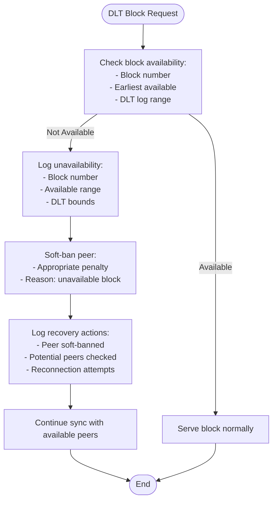
```mermaid
flowchart TD
Start([DLT Block Request]) --> CheckAvailability["Check block availability:<br/>- Block number<br/>- Earliest available<br/>- DLT log range"]
CheckAvailability --> |Available| ServeBlock["Serve block normally"]
CheckAvailability --> |Not Available| LogUnavailable["Log unavailability:<br/>- Block number<br/>- Available range<br/>- DLT bounds"]
LogUnavailable --> SoftBan["Soft-ban peer:<br/>- Appropriate penalty<br/>- Reason: unavailable block"]
SoftBan --> LogRecovery["Log recovery actions:<br/>- Peer soft-banned<br/>- Potential peers checked<br/>- Reconnection attempts"]
LogRecovery --> ContinueSync["Continue sync with available peers"]
ContinueSync --> End([End])
ServeBlock --> End
```

**Diagram sources**
- [p2p_plugin.cpp:336-350](file://plugins/p2p/p2p_plugin.cpp#L336-L350)

### Error Handling and Recovery

The plugin implements comprehensive error handling and recovery mechanisms:

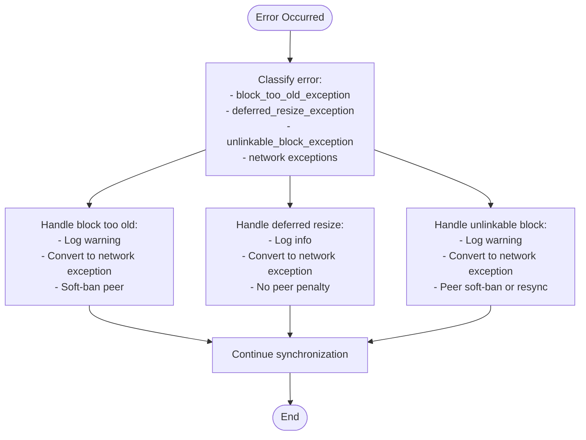
```mermaid
flowchart TD
Start([Error Occurred]) --> ClassifyError["Classify error:<br/>- block_too_old_exception<br/>- deferred_resize_exception<br/>- unlinkable_block_exception<br/>- network exceptions"]
ClassifyError --> HandleBlockTooOld["Handle block too old:<br/>- Log warning<br/>- Convert to network exception<br/>- Soft-ban peer"]
ClassifyError --> HandleDeferredResize["Handle deferred resize:<br/>- Log info<br/>- Convert to network exception<br/>- No peer penalty"]
ClassifyError --> HandleUnlinkable["Handle unlinkable block:<br/>- Log warning<br/>- Convert to network exception<br/>- Peer soft-ban or resync"]
HandleBlockTooOld --> ContinueSync["Continue synchronization"]
HandleDeferredResize --> ContinueSync
HandleUnlinkable --> ContinueSync
ContinueSync --> End([End])
```

**Diagram sources**
- [p2p_plugin.cpp:173-204](file://plugins/p2p/p2p_plugin.cpp#L173-L204)

### Peer Soft-Ban Management

The plugin manages peer soft-bans based on error severity:

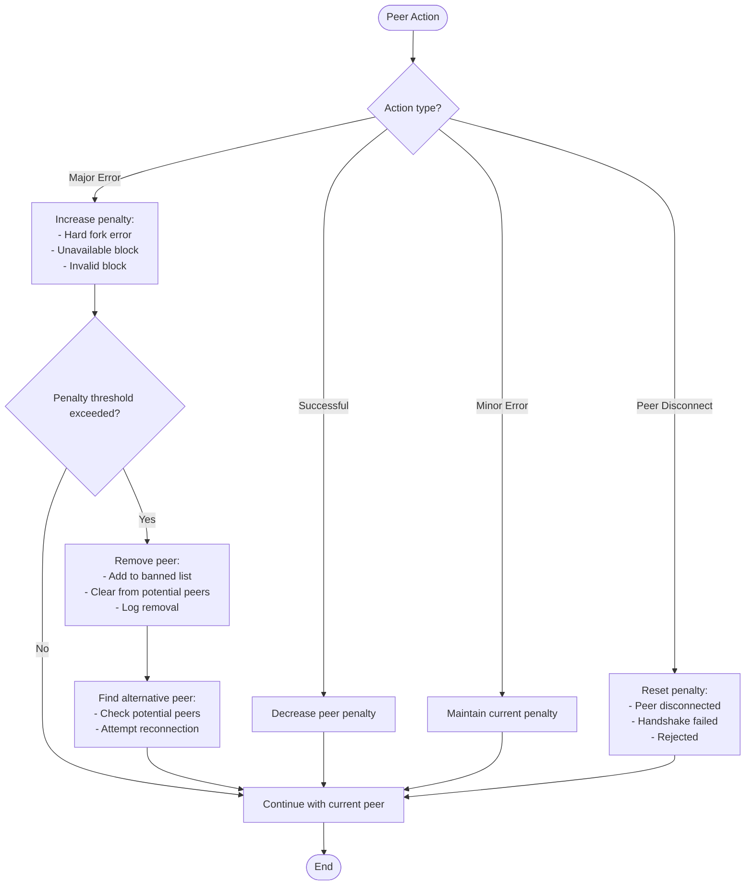
```mermaid
flowchart TD
Start([Peer Action]) --> CheckAction{"Action type?"}
CheckAction --> |Successful| DecreasePenalty["Decrease peer penalty"]
CheckAction --> |Minor Error| MaintainPenalty["Maintain current penalty"]
CheckAction --> |Major Error| IncreasePenalty["Increase penalty:<br/>- Hard fork error<br/>- Unavailable block<br/>- Invalid block"]
CheckAction --> |Peer Disconnect| ResetPenalty["Reset penalty:<br/>- Peer disconnected<br/>- Handshake failed<br/>- Rejected"]
IncreasePenalty --> CheckThreshold{"Penalty threshold exceeded?"}
CheckThreshold --> |No| Continue["Continue with current peer"]
CheckThreshold --> |Yes| RemovePeer["Remove peer:<br/>- Add to banned list<br/>- Clear from potential peers<br/>- Log removal"]
RemovePeer --> FindAlternative["Find alternative peer:<br/>- Check potential peers<br/>- Attempt reconnection"]
FindAlternative --> Continue
DecreasePenalty --> Continue
MaintainPenalty --> Continue
ResetPenalty --> Continue
Continue --> End([End])
```

**Diagram sources**
- [p2p_plugin.cpp:614-650](file://plugins/p2p/p2p_plugin.cpp#L614-L650)

**Section sources**
- [p2p_plugin.cpp:336-350](file://plugins/p2p/p2p_plugin.cpp#L336-L350)
- [p2p_plugin.cpp:173-204](file://plugins/p2p/p2p_plugin.cpp#L173-L204)
- [p2p_plugin.cpp:614-650](file://plugins/p2p/p2p_plugin.cpp#L614-L650)

## Minority Fork Recovery

**Updated** The minority fork recovery mechanism has been enhanced with improved peer interaction handling and comprehensive logging throughout the recovery process.

### Enhanced resync_from_lib() Method

The `resync_from_lib()` method now includes comprehensive logging and improved peer interaction:

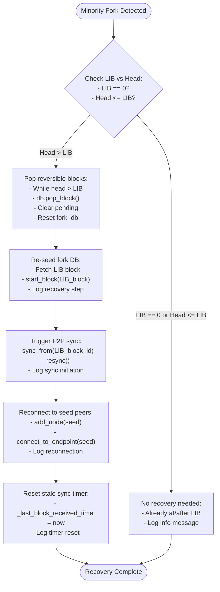
```mermaid
flowchart TD
Start([Minority Fork Detected]) --> CheckState{"Check LIB vs Head:<br/>- LIB == 0?<br/>- Head <= LIB?"}
CheckState --> |LIB == 0 or Head <= LIB| NoAction["No recovery needed:<br/>- Already at/after LIB<br/>- Log info message"]
CheckState --> |Head > LIB| PopBlocks["Pop reversible blocks:<br/>- While head > LIB<br/>- db.pop_block()<br/>- Clear pending<br/>- Reset fork_db"]
PopBlocks --> RebuildForkDB["Re-seed fork DB:<br/>- Fetch LIB block<br/>- start_block(LIB_block)<br/>- Log recovery step"]
RebuildForkDB --> TriggerSync["Trigger P2P sync:<br/>- sync_from(LIB_block_id)<br/>- resync()<br/>- Log sync initiation"]
TriggerSync --> ReconnectPeers["Reconnect to seed peers:<br/>- add_node(seed)<br/>- connect_to_endpoint(seed)<br/>- Log reconnection"]
ReconnectPeers --> ResetTimer["Reset stale sync timer:<br/>- _last_block_received_time = now<br/>- Log timer reset"]
ResetTimer --> Complete([Recovery Complete])
NoAction --> Complete
```

**Diagram sources**
- [p2p_plugin.cpp:951-1020](file://plugins/p2p/p2p_plugin.cpp#L951-L1020)

### Enhanced Recovery Process Implementation

The minority fork recovery process now includes several critical enhancements:

1. **State Analysis**: Improved comparison logic with comprehensive logging
2. **Block Popping**: Enhanced loop with proper error handling and logging
3. **Fork Database Reset**: Better error handling and state validation
4. **Network Resynchronization**: Improved sync triggering with logging
5. **Peer Reconnection**: Enhanced peer management with error handling
6. **Timer Reset**: Proper timing management to prevent immediate re-trigger

### Integration with Witness Plugin

The minority fork recovery is triggered automatically by the witness plugin with enhanced logging:

```mermaid
sequenceDiagram
participant Witness as Witness Plugin
participant P2P as P2P Plugin
participant Chain as Chain Database
participant Network as Network Layer
Witness->>Chain : Check recent blocks
Chain-->>Witness : Block validation results
Witness->>Witness : Analyze fork scenario
alt Minority fork detected
Witness->>P2P : resync_from_lib()
Note over P2P : Enhanced logging throughout
P2P->>Chain : Pop blocks to LIB
P2P->>Chain : Reset fork database
P2P->>Network : Trigger sync from LIB
P2P->>Network : Reconnect to peers
Note over P2P : Comprehensive recovery logging
end
```

**Diagram sources**
- [witness.cpp:540-552](file://plugins/witness/witness.cpp#L540-L552)
- [p2p_plugin.cpp:951-1020](file://plugins/p2p/p2p_plugin.cpp#L951-L1020)

**Section sources**
- [p2p_plugin.cpp:951-1020](file://plugins/p2p/p2p_plugin.cpp#L951-L1020)
- [witness.cpp:540-552](file://plugins/witness/witness.cpp#L540-L552)

## Enhanced Block Validation

**Updated** The block validation process has been enhanced with operation guard protection to ensure concurrent access safety during critical validation operations.

### Operation Guard Integration

The enhanced block validation incorporates operation guards to prevent race conditions and ensure thread-safe access to shared blockchain state:

```mermaid
flowchart TD
BlockReceived([Block Received]) --> ExtractWitness["Extract witness information"]
ExtractWitness --> AcquireGuard["Acquire operation guard"]
AcquireGuard --> VerifyWitness["Verify witness exists"]
VerifyWitness --> VerifySignature["Verify signature matches witness key"]
VerifySignature --> ReleaseGuard["Release operation guard"]
ReleaseGuard --> ApplyValidation["Apply block post-validation"]
ApplyValidation --> BroadcastBlock["Broadcast block to peers"]
```

**Diagram sources**
- [p2p_plugin.cpp:216-245](file://plugins/p2p/p2p_plugin.cpp#L216-L245)

### Concurrent Access Protection

The operation guard mechanism provides several layers of protection:

1. **Resize Barrier Participation**: Operation guards participate in the shared memory resize barrier
2. **Lock Acquisition**: Automatically waits for resize operations to complete
3. **Thread Safety**: Prevents concurrent access conflicts during witness key validation
4. **Resource Management**: Ensures proper cleanup and release of resources

### Database Integration

The enhanced validation leverages the chainbase database's operation guard functionality:

```mermaid
classDiagram
class operation_guard {
+operation_guard(database& db)
+~operation_guard()
+release()
- database& _db
- bool _active
}
class database {
+make_operation_guard() operation_guard
+enter_operation()
+exit_operation()
}
operation_guard --> database : "guards access to"
```

**Diagram sources**
- [chainbase.hpp:1078-1115](file://thirdparty/chainbase/include/chainbase/chainbase.hpp#L1078-L1115)

**Section sources**
- [p2p_plugin.cpp:216-245](file://plugins/p2p/p2p_plugin.cpp#L216-L245)
- [chainbase.hpp:1078-1115](file://thirdparty/chainbase/include/chainbase/chainbase.hpp#L1078-L1115)

## Concurrent Access Safety

**New** The P2P plugin now includes comprehensive concurrent access safety mechanisms to prevent data corruption and ensure thread-safe operations during high-load conditions.

### Operation Guard Implementation

The operation guard system provides automatic protection against concurrent access conflicts:

```mermaid
flowchart TD
Start([Operation Begins]) --> EnterOperation["Enter operation barrier"]
EnterOperation --> AcquireLock["Acquire database lock"]
AcquireLock --> PerformOperation["Perform database operation"]
PerformOperation --> ReleaseLock["Release database lock"]
ReleaseLock --> ExitOperation["Exit operation barrier"]
ExitOperation --> End([Operation Complete])
```

**Diagram sources**
- [chainbase.hpp:1130-1137](file://thirdparty/chainbase/include/chainbase/chainbase.hpp#L1130-L1137)

### Thread Safety Enhancements

The concurrent access safety includes several key features:

1. **Automatic Lock Management**: Operation guards automatically manage database locks
2. **Resize Barrier Integration**: Participates in shared memory resize barriers
3. **Timeout Handling**: Implements timeout mechanisms for lock acquisition
4. **Resource Cleanup**: Ensures proper cleanup of resources on completion

### Error Handling Improvements

Enhanced error handling protects against various failure scenarios:

1. **Concurrent Resize Exceptions**: Proper handling of shared memory resize operations
2. **Deadlock Prevention**: Timeout mechanisms prevent indefinite blocking
3. **Graceful Degradation**: Fallback mechanisms for critical operations
4. **Diagnostic Information**: Comprehensive logging for debugging concurrent issues

**Section sources**
- [chainbase.hpp:1130-1137](file://thirdparty/chainbase/include/chainbase/chainbase.hpp#L1130-L1137)
- [p2p_plugin.cpp:173-208](file://plugins/p2p/p2p_plugin.cpp#L173-L208)

## Logging Level Consistency

**Updated** The P2P plugin has implemented improved logging level consistency to reduce verbosity during normal operation while maintaining appropriate log levels for different operational contexts.

### Sync Mode Logging Improvements

The plugin has undergone significant improvements in logging level management, particularly for synchronization operations:

- **Sync Mode Downgrade**: Sync mode block processing logs were downgraded from info level to debug level
- **Normal Mode Preservation**: Normal block processing continues to use info level logging for visibility
- **Reduced Verbosity**: This change significantly reduces log volume during routine blockchain synchronization
- **Contextual Appropriateness**: Debug level logging is more appropriate for frequent sync operations while preserving info level for exceptional events

### Logging Implementation Details

The logging changes are implemented in the block handling method:

```cpp
if (sync_mode)
    dlog("chain pushing sync block #${block_num} (head: ${head}, gap: ${gap})",
         ("block_num", blk_msg.block.block_num())("head", head_block_num)("gap", gap));
else
    dlog("chain pushing normal block #${block_num} (head: ${head}, gap: ${gap})",
         ("block_num", blk_msg.block.block_num())("head", head_block_num)("gap", gap));
```

**Key Benefits:**
- **Reduced Log Volume**: Sync operations (which occur frequently during blockchain synchronization) now use debug level logging
- **Maintained Visibility**: Normal operations continue to use info level logging for operational visibility
- **Consistent Behavior**: Both sync and normal modes now consistently use debug level logging, improving overall logging consistency
- **Performance Impact**: Lower logging overhead during normal operation while preserving diagnostic information

### Network Layer Integration

The network layer maintains mixed logging levels for different operational contexts:

- **Info Level**: Used for significant operational events and peer management actions
- **Debug Level**: Used for routine synchronization and connection maintenance
- **Warning/Error Levels**: Used for error conditions and exceptional circumstances

**Section sources**
- [p2p_plugin.cpp:151-156](file://plugins/p2p/p2p_plugin.cpp#L151-L156)

## Dependency Analysis

The P2P plugin has well-defined dependencies that enable modularity and maintainability:

```mermaid
graph TB
subgraph "Plugin Dependencies"
P2P[p2p_plugin]
Chain[chain::plugin]
AppBase[appbase]
Snapshot[snapshot_plugin]
Witness[witness_plugin]
end
subgraph "Network Dependencies"
Node[node.hpp]
PeerConn[peer_connection.hpp]
Messages[core_messages.hpp]
PeerDB[peer_database.hpp]
Config[config.hpp]
end
subgraph "Protocol Dependencies"
Block[block.hpp]
Transaction[transaction.hpp]
Types[types.hpp]
end
subgraph "Database Dependencies"
Database[database.hpp]
Chainbase[chainbase.hpp]
OperationGuard[operation_guard]
DLTLog[dlt_block_log]
end
P2P --> Chain
P2P --> Node
P2P --> AppBase
P2P --> Snapshot
P2P --> Witness
Node --> PeerConn
Node --> Messages
Node --> PeerDB
Node --> Config
Messages --> Block
Messages --> Transaction
Messages --> Types
Chain --> Database
Chain --> Chainbase
Chain --> OperationGuard
Chain --> DLTLog
Database --> OperationGuard
Database --> DLTLog
```

**Diagram sources**
- [CMakeLists.txt:27-34](file://plugins/p2p/CMakeLists.txt#L27-L34)
- [p2p_plugin.cpp:1-13](file://plugins/p2p/p2p_plugin.cpp#L1-L13)

Key dependency relationships:

1. **Chain Integration**: Direct dependency on the chain plugin for blockchain state access
2. **Network Foundation**: Relies on the network library for peer communication
3. **Application Framework**: Uses appbase for plugin lifecycle management
4. **Snapshot Coordination**: Integrates with snapshot plugin for trusted peer management
5. **Witness Integration**: Works closely with witness plugin for fork detection
6. **Database Protection**: Leverages chainbase operation guards for concurrent access safety
7. **DLT Mode Support**: Integrates with dlt_block_log for snapshot-based block serving

**Section sources**
- [CMakeLists.txt:27-34](file://plugins/p2p/CMakeLists.txt#L27-L34)
- [p2p_plugin.cpp:1-13](file://plugins/p2p/p2p_plugin.cpp#L1-L13)

## Performance Considerations

The P2P plugin implements several performance optimization strategies:

### Connection Management
- **Connection Limits**: Configurable maximum connections to prevent resource exhaustion
- **Soft-Ban Mechanisms**: Automatic peer banning for misbehaving nodes
- **Trusted Peer System**: Reduced soft-ban duration for snapshot-provided trusted peers

### Network Efficiency
- **Selective Synchronization**: Only fetches missing blockchain data
- **Message Caching**: Prevents redundant message propagation
- **Bandwidth Throttling**: Configurable upload/download limits

### Monitoring and Diagnostics
- **Periodic Statistics**: Configurable logging intervals for peer statistics
- **Stale Sync Detection**: Automatic recovery from stalled synchronization
- **Connection Health Monitoring**: Real-time peer connection quality metrics

### DLT Mode Performance
**New** The DLT mode introduces several performance optimizations:

- **Intelligent Block Range Clamping**: Prevents requesting unavailable blocks
- **Early Availability Checking**: Reduces network requests for unavailable items
- **Optimized Peer Selection**: Better handling of DLT-capable peers
- **Reduced Error Handling Overhead**: Graceful degradation minimizes performance impact

### Logging Performance Impact
**Updated** The improved logging level consistency provides additional performance benefits:

- **Reduced I/O Overhead**: Debug level logging produces less output than info level logging
- **Lower Memory Usage**: Reduced log buffer consumption during sync operations
- **Improved Throughput**: Less frequent logging reduces CPU overhead during normal operation
- **Better Resource Utilization**: More efficient use of system resources during routine operations

### Concurrent Access Optimization
**New** The operation guard system provides performance benefits through:

- **Reduced Contention**: Automatic lock management reduces thread contention
- **Efficient Resource Usage**: Operation guards minimize overhead during validation
- **Scalable Design**: Thread-safe operations scale better under load
- **Graceful Degradation**: Timeout mechanisms prevent performance degradation

**Section sources**
- [p2p_plugin.cpp:659-756](file://plugins/p2p/p2p_plugin.cpp#L659-L756)
- [p2p_plugin.cpp:512-649](file://plugins/p2p/p2p_plugin.cpp#L512-L649)

## Troubleshooting Guide

### Common Issues and Solutions

#### Connection Problems
- **Symptom**: Unable to connect to seed nodes
- **Solution**: Verify network connectivity and check firewall settings
- **Configuration**: Review `p2p-seed-node` entries in configuration file

#### Synchronization Delays
- **Symptom**: Slow blockchain synchronization
- **Solution**: Increase `p2p-max-connections` setting
- **Monitoring**: Enable P2P statistics to identify slow peers

#### Peer Quality Issues
- **Symptom**: Frequent peer disconnections
- **Solution**: Check network stability and bandwidth limitations
- **Diagnostics**: Monitor peer statistics for connection patterns

### DLT Mode Troubleshooting

**New** For DLT mode-specific issues:

1. **Block Availability Errors**: Check `earliest_available_block_num()` and DLT log bounds
2. **Peer Compatibility**: Verify peers support DLT mode block serving
3. **Recovery Actions**: Monitor graceful degradation logs for peer soft-bans
4. **Sync Performance**: Use DLT-specific logging to identify block range issues

### Minority Fork Recovery Procedures

**Updated** For minority fork scenarios:

1. **Detection**: Monitor witness plugin logs for minority fork warnings
2. **Automatic Recovery**: The system automatically triggers `resync_from_lib()`
3. **Manual Intervention**: Use RPC commands to trigger recovery if automatic detection fails
4. **Verification**: Monitor logs to confirm successful recovery and synchronization

### Logging Level Considerations

**Updated** For troubleshooting purposes, consider adjusting logging levels:

- **Enable Debug Logging**: Set logging level to debug for detailed sync operation visibility
- **Monitor Sync Operations**: Use debug logs to track sync progress and identify bottlenecks
- **Performance Tuning**: Adjust logging levels based on operational requirements

### Enhanced Peer Database Analysis

**New** Use the enhanced peer database logging for troubleshooting:

1. **Failed Peer Analysis**: Review logs for failed/rejected peer status
2. **Connection Attempts**: Monitor last connection attempt times and reasons
3. **Error Patterns**: Identify recurring error patterns across multiple peers
4. **Recovery Effectiveness**: Track peer reconnection success rates

### Configuration Reference

The P2P plugin supports extensive configuration options:

| Configuration Option | Description | Default Value |
|---------------------|-------------|---------------|
| `p2p-endpoint` | Local IP and port for incoming connections | 127.0.0.1:9876 |
| `p2p-max-connections` | Maximum incoming connections | 0 (unlimited) |
| `p2p-seed-node` | Seed node endpoints | None |
| `p2p-stats-enabled` | Enable peer statistics logging | true |
| `p2p-stats-interval` | Statistics logging interval (seconds) | 300 |
| `p2p-stale-sync-detection` | Enable stale sync detection | false |
| `p2p-stale-sync-timeout-seconds` | Stale sync timeout | 120 |

### Concurrent Access Issues

**New** For concurrent access problems:

1. **Monitor Operation Guards**: Check for operation guard timeouts in logs
2. **Check Shared Memory**: Verify shared memory resize operations are completing
3. **Adjust Timeouts**: Increase operation guard timeout values if needed
4. **Resource Monitoring**: Monitor system resources during high-load periods

**Section sources**
- [p2p_plugin.cpp:659-683](file://plugins/p2p/p2p_plugin.cpp#L659-L683)
- [p2p_plugin.cpp:951-1020](file://plugins/p2p/p2p_plugin.cpp#L951-L1020)
- [config.ini:1-136](file://share/vizd/config/config.ini#L1-L136)

## Conclusion

The P2P Plugin represents a sophisticated implementation of blockchain networking infrastructure that provides essential functionality for distributed consensus systems. Its modular architecture, comprehensive peer management, and robust synchronization protocols make it a cornerstone component of the VIZ blockchain ecosystem.

**Updated** Key enhancements include:

1. **Security Focus**: Advanced block validation and witness verification mechanisms
2. **Performance Optimization**: Efficient synchronization and connection management
3. **Operational Excellence**: Comprehensive monitoring and diagnostic capabilities
4. **Extensibility**: Clean interfaces that support future enhancements
5. **Logging Efficiency**: Improved logging level consistency reduces verbosity while maintaining operational visibility
6. **Minority Fork Recovery**: Specialized recovery mechanism for handling fork scenarios
7. **Concurrent Access Safety**: Enhanced protection against race conditions and data corruption
8. **Integration Capabilities**: Seamless coordination with witness and snapshot plugins
9. **DLT Mode Support**: Intelligent block range management for snapshot-based nodes
10. **Graceful Degradation**: Robust error handling and peer interaction management
11. **Enhanced Diagnostics**: Comprehensive logging throughout the sync process
12. **Peer Database Analytics**: Detailed peer interaction tracking and troubleshooting

The recent additions demonstrate ongoing attention to operational efficiency and user experience. The new DLT mode block range management provides intelligent support for snapshot-based nodes, while the enhanced peer interaction handling improves network resilience. The comprehensive logging throughout the sync process provides unprecedented visibility into network operations, and the graceful degradation capabilities ensure reliable operation even when peers cannot serve requested items.

The plugin's design demonstrates best practices in distributed systems engineering, balancing security, performance, and maintainability while providing the foundation for scalable blockchain networks. The integration of DLT mode support, graceful degradation mechanisms, and enhanced diagnostic capabilities positions the P2P plugin to handle increasingly complex blockchain networking requirements with improved reliability and operability.