# P2P Plugin

<cite>
**Referenced Files in This Document**
- [p2p_plugin.hpp](file://plugins/p2p/include/graphene/plugins/p2p/p2p_plugin.hpp)
- [p2p_plugin.cpp](file://plugins/p2p/p2p_plugin.cpp)
- [node.hpp](file://libraries/network/include/graphene/network/node.hpp)
- [peer_connection.hpp](file://libraries/network/include/graphene/network/peer_connection.hpp)
- [peer_database.hpp](file://libraries/network/include/graphene/network/peer_database.hpp)
- [core_messages.hpp](file://libraries/network/include/graphene/network/core_messages.hpp)
- [message.hpp](file://libraries/network/include/graphene/network/message.hpp)
- [config.hpp](file://libraries/network/include/graphene/network/config.hpp)
- [node.cpp](file://libraries/network/node.cpp)
- [database.hpp](file://libraries/chain/include/graphene/chain/database.hpp)
- [chainbase.hpp](file://thirdparty/chainbase/include/chainbase/chainbase.hpp)
- [witness.cpp](file://plugins/witness/witness.cpp)
- [CMakeLists.txt](file://plugins/p2p/CMakeLists.txt)
- [config.ini](file://share/vizd/config/config.ini)
</cite>

## Update Summary
**Changes Made**
- Added new resync_from_lib() method documentation for minority fork recovery scenarios
- Enhanced block validation section with operation guard protection details
- Updated error handling documentation for concurrent access safety during block processing
- Added comprehensive coverage of the new minority fork recovery functionality
- Expanded troubleshooting guide with minority fork recovery procedures

## Table of Contents
1. [Introduction](#introduction)
2. [Project Structure](#project-structure)
3. [Core Components](#core-components)
4. [Architecture Overview](#architecture-overview)
5. [Detailed Component Analysis](#detailed-component-analysis)
6. [Minority Fork Recovery](#minority-fork-recovery)
7. [Enhanced Block Validation](#enhanced-block-validation)
8. [Concurrent Access Safety](#concurrent-access-safety)
9. [Logging Level Consistency](#logging-level-consistency)
10. [Dependency Analysis](#dependency-analysis)
11. [Performance Considerations](#performance-considerations)
12. [Troubleshooting Guide](#troubleshooting-guide)
13. [Conclusion](#conclusion)

## Introduction

The P2P (Peer-to-Peer) Plugin is a critical component of the VIZ blockchain node that enables decentralized communication between nodes in the network. This plugin provides the foundation for blockchain synchronization, transaction propagation, and peer discovery mechanisms that keep the entire network synchronized and functional.

The plugin implements a sophisticated networking layer built on top of the Graphene network library, providing features such as automatic peer discovery, blockchain synchronization protocols, transaction broadcasting, and advanced peer management capabilities including soft-ban mechanisms and connection monitoring.

**Updated** The plugin now includes specialized minority fork recovery capabilities and enhanced concurrent access safety mechanisms to handle complex network scenarios and prevent data corruption during high-load conditions.

## Project Structure

The P2P plugin follows a modular architecture with clear separation of concerns:

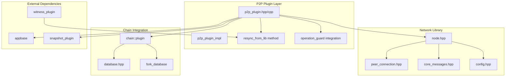

**Diagram sources**
- [p2p_plugin.hpp:18-55](file://plugins/p2p/include/graphene/plugins/p2p/p2p_plugin.hpp#L18-L55)
- [p2p_plugin.cpp:910-979](file://plugins/p2p/p2p_plugin.cpp#L910-L979)
- [node.hpp:190-320](file://libraries/network/include/graphene/network/node.hpp#L190-L320)

**Section sources**
- [p2p_plugin.hpp:1-57](file://plugins/p2p/include/graphene/plugins/p2p/p2p_plugin.hpp#L1-L57)
- [CMakeLists.txt:1-49](file://plugins/p2p/CMakeLists.txt#L1-L49)

## Core Components

### P2P Plugin Interface

The main plugin class provides a clean interface for managing P2P networking functionality:

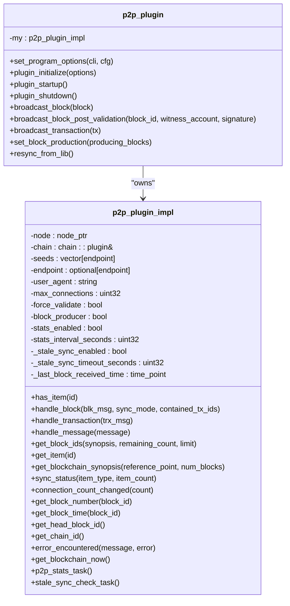

**Diagram sources**
- [p2p_plugin.hpp:18-55](file://plugins/p2p/include/graphene/plugins/p2p/p2p_plugin.hpp#L18-L55)
- [p2p_plugin.cpp:49-126](file://plugins/p2p/p2p_plugin.cpp#L49-L126)

### Network Node Architecture

The plugin integrates with the underlying network infrastructure through a sophisticated node abstraction:

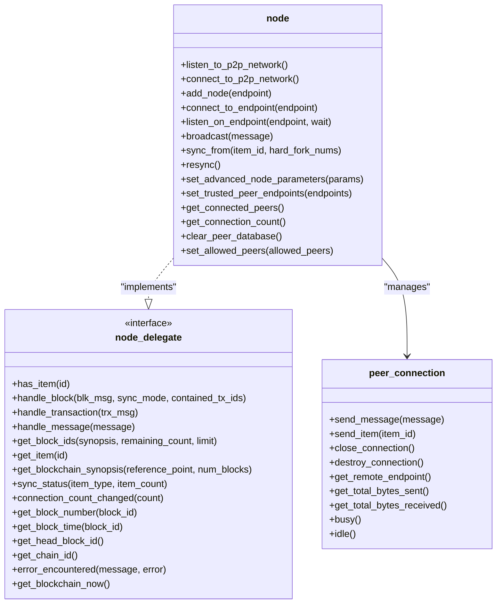

**Diagram sources**
- [node.hpp:190-320](file://libraries/network/include/graphene/network/node.hpp#L190-L320)
- [node.hpp:60-167](file://libraries/network/include/graphene/network/node.hpp#L60-L167)
- [peer_connection.hpp:79-354](file://libraries/network/include/graphene/network/peer_connection.hpp#L79-L354)

**Section sources**
- [p2p_plugin.hpp:18-55](file://plugins/p2p/include/graphene/plugins/p2p/p2p_plugin.hpp#L18-L55)
- [node.hpp:190-320](file://libraries/network/include/graphene/network/node.hpp#L190-L320)

## Architecture Overview

The P2P plugin architecture implements a layered approach to blockchain networking:

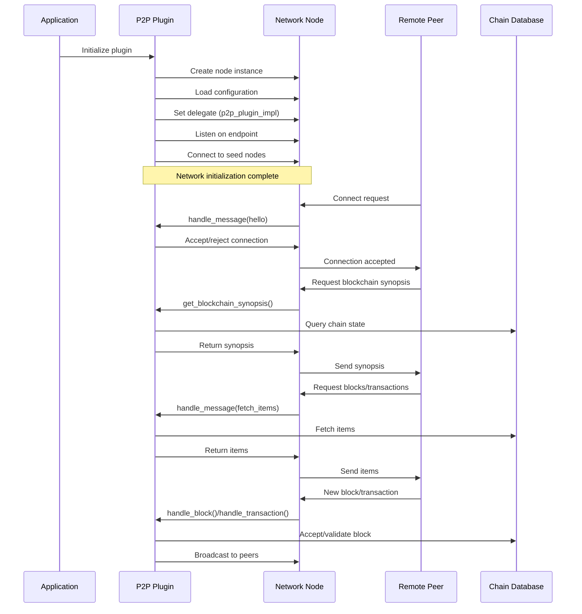

**Diagram sources**
- [p2p_plugin.cpp:758-823](file://plugins/p2p/p2p_plugin.cpp#L758-L823)
- [node.cpp:1-200](file://libraries/network/node.cpp#L1-L200)

The architecture provides several key capabilities:

1. **Automatic Peer Discovery**: The plugin automatically discovers and connects to seed nodes specified in configuration
2. **Blockchain Synchronization**: Implements efficient blockchain synchronization using selective block fetching
3. **Transaction Propagation**: Broadcasts transactions to connected peers with intelligent caching
4. **Peer Management**: Manages peer connections with soft-ban mechanisms and connection limits
5. **Monitoring and Statistics**: Provides comprehensive peer statistics and network health monitoring
6. **Minority Fork Recovery**: Specialized recovery mechanism for handling minority fork scenarios
7. **Concurrent Access Safety**: Enhanced protection against concurrent access conflicts during block processing

## Detailed Component Analysis

### Block Validation Protocol

The P2P plugin implements a sophisticated block validation mechanism that enhances security and prevents malicious attacks:


**Diagram sources**
- [p2p_plugin.cpp:216-245](file://plugins/p2p/p2p_plugin.cpp#L216-L245)
- [p2p_plugin.cpp:855-865](file://plugins/p2p/p2p_plugin.cpp#L855-L865)

**Updated** The block validation protocol now includes enhanced concurrent access safety through operation guard protection:

The block validation process incorporates operation guards to prevent concurrent access conflicts during witness key validation and block post-validation processing. This ensures thread-safe access to shared blockchain state during high-load conditions.

The enhanced validation includes:

1. **Witness Signature Verification**: Validates that the block signature matches the claimed witness's public key
2. **Chain ID Consistency**: Ensures blocks belong to the correct blockchain instance
3. **Hard Fork Protection**: Handles different validation requirements across blockchain hard forks
4. **Post-Validation Processing**: Applies additional validation steps after initial acceptance
5. **Concurrent Access Protection**: Uses operation guards to prevent race conditions during validation
6. **Error Handling**: Comprehensive error handling for various failure scenarios

### Peer Connection Management

The plugin manages peer connections through a sophisticated state machine:

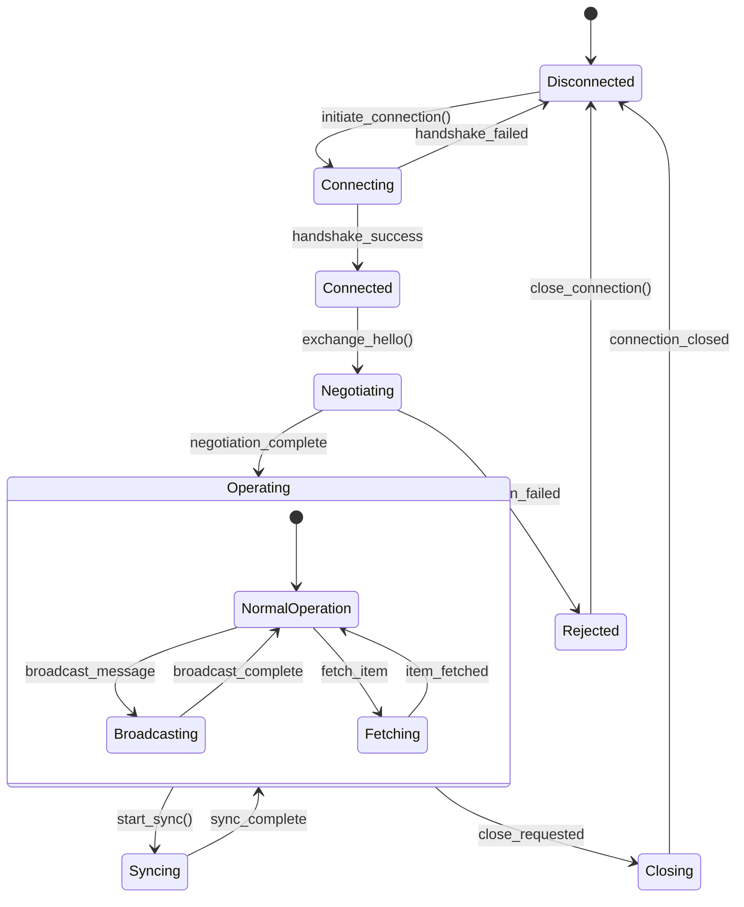

**Diagram sources**
- [peer_connection.hpp:82-106](file://libraries/network/include/graphene/network/peer_connection.hpp#L82-L106)

### Blockchain Synchronization Protocol

The synchronization protocol efficiently handles blockchain state reconciliation:

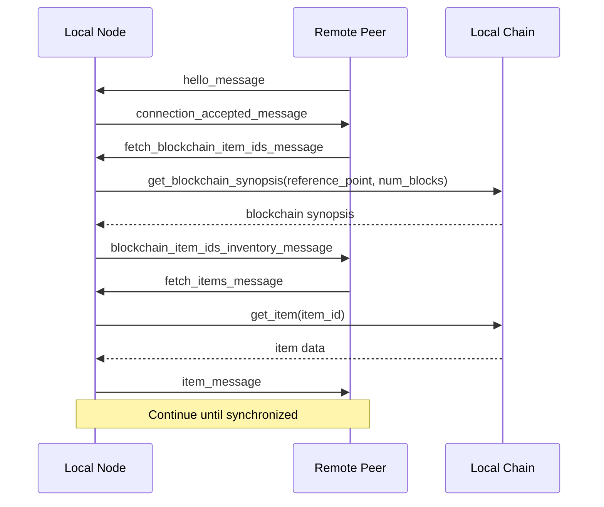

**Diagram sources**
- [core_messages.hpp:188-218](file://libraries/network/include/graphene/network/core_messages.hpp#L188-L218)
- [p2p_plugin.cpp:247-301](file://plugins/p2p/p2p_plugin.cpp#L247-L301)

**Section sources**
- [p2p_plugin.cpp:129-208](file://plugins/p2p/p2p_plugin.cpp#L129-L208)
- [p2p_plugin.cpp:247-301](file://plugins/p2p/p2p_plugin.cpp#L247-L301)
- [peer_connection.hpp:79-354](file://libraries/network/include/graphene/network/peer_connection.hpp#L79-L354)

## Minority Fork Recovery

**New** The P2P plugin now includes a specialized minority fork recovery mechanism designed to handle scenarios where the node is on a minority fork that differs from the majority of the network.

### resync_from_lib() Method

The `resync_from_lib()` method provides a comprehensive solution for minority fork recovery:

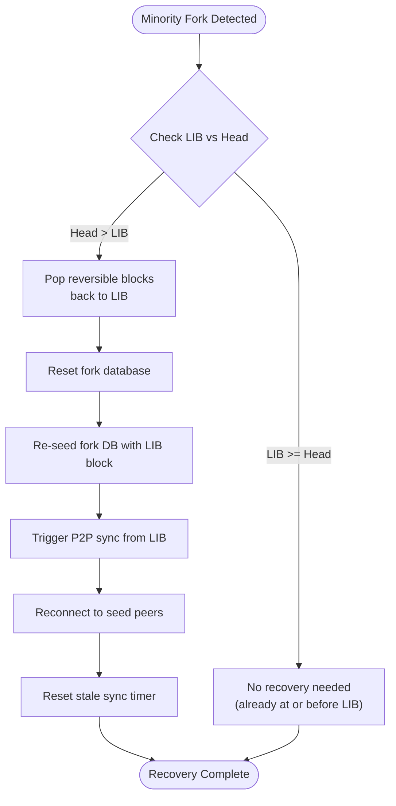

**Diagram sources**
- [p2p_plugin.cpp:910-979](file://plugins/p2p/p2p_plugin.cpp#L910-L979)

### Recovery Process Implementation

The minority fork recovery process involves several critical steps:

1. **State Analysis**: Compares current head block with last irreversible block (LIB)
2. **Block Popping**: Pops all reversible blocks from current head back to LIB
3. **Fork Database Reset**: Resets the fork database to prevent conflicts
4. **State Reinitialization**: Re-seeds the fork database with the LIB block
5. **Network Resynchronization**: Triggers P2P synchronization from the LIB position
6. **Peer Reconnection**: Reconnects to seed nodes to ensure proper peer selection
7. **Timer Reset**: Resets stale sync detection timers to prevent false positives

### Integration with Witness Plugin

The minority fork recovery is triggered automatically by the witness plugin when it detects a minority fork scenario:

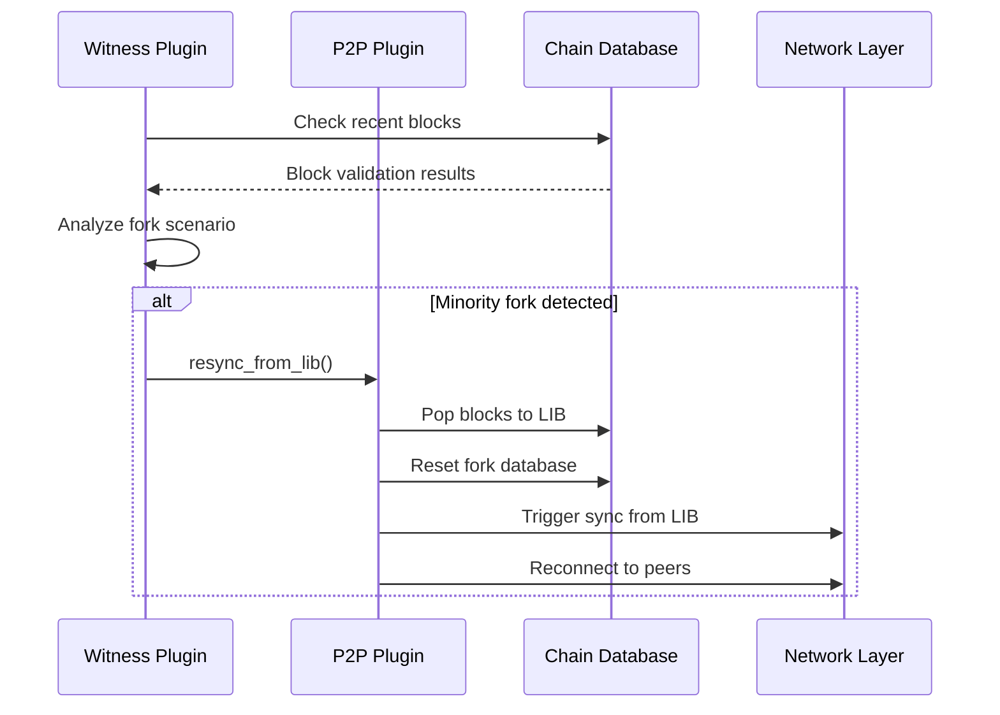

**Diagram sources**
- [witness.cpp:540-552](file://plugins/witness/witness.cpp#L540-L552)
- [p2p_plugin.cpp:910-979](file://plugins/p2p/p2p_plugin.cpp#L910-L979)

**Section sources**
- [p2p_plugin.cpp:910-979](file://plugins/p2p/p2p_plugin.cpp#L910-L979)
- [witness.cpp:540-552](file://plugins/witness/witness.cpp#L540-L552)

## Enhanced Block Validation

**Updated** The block validation process has been enhanced with operation guard protection to ensure concurrent access safety during critical validation operations.

### Operation Guard Integration

The enhanced block validation incorporates operation guards to prevent race conditions and ensure thread-safe access to shared blockchain state:

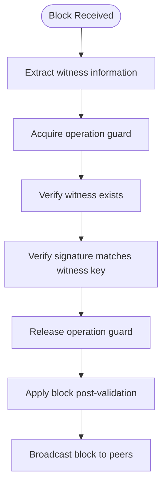

**Diagram sources**
- [p2p_plugin.cpp:216-245](file://plugins/p2p/p2p_plugin.cpp#L216-L245)

### Concurrent Access Protection

The operation guard mechanism provides several layers of protection:

1. **Resize Barrier Participation**: Operation guards participate in the shared memory resize barrier
2. **Lock Acquisition**: Automatically waits for resize operations to complete
3. **Thread Safety**: Prevents concurrent access conflicts during witness key validation
4. **Resource Management**: Ensures proper cleanup and release of resources

### Database Integration

The enhanced validation leverages the chainbase database's operation guard functionality:

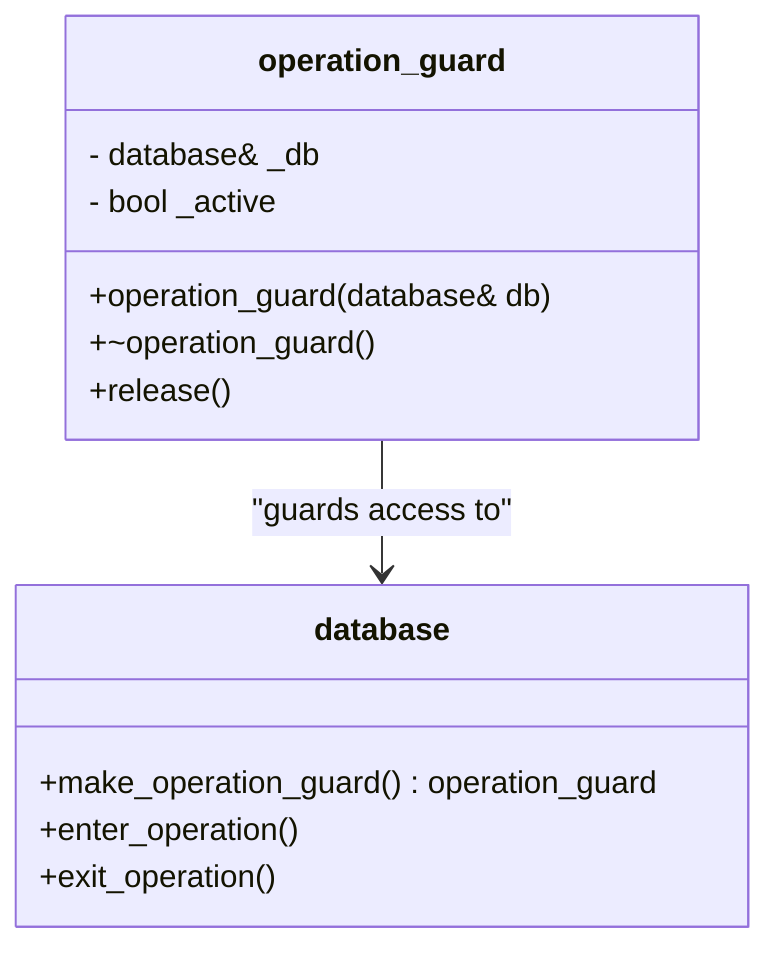

**Diagram sources**
- [chainbase.hpp:1078-1115](file://thirdparty/chainbase/include/chainbase/chainbase.hpp#L1078-L1115)

**Section sources**
- [p2p_plugin.cpp:216-245](file://plugins/p2p/p2p_plugin.cpp#L216-L245)
- [chainbase.hpp:1078-1115](file://thirdparty/chainbase/include/chainbase/chainbase.hpp#L1078-L1115)

## Concurrent Access Safety

**New** The P2P plugin now includes comprehensive concurrent access safety mechanisms to prevent data corruption and ensure thread-safe operations during high-load conditions.

### Operation Guard Implementation

The operation guard system provides automatic protection against concurrent access conflicts:

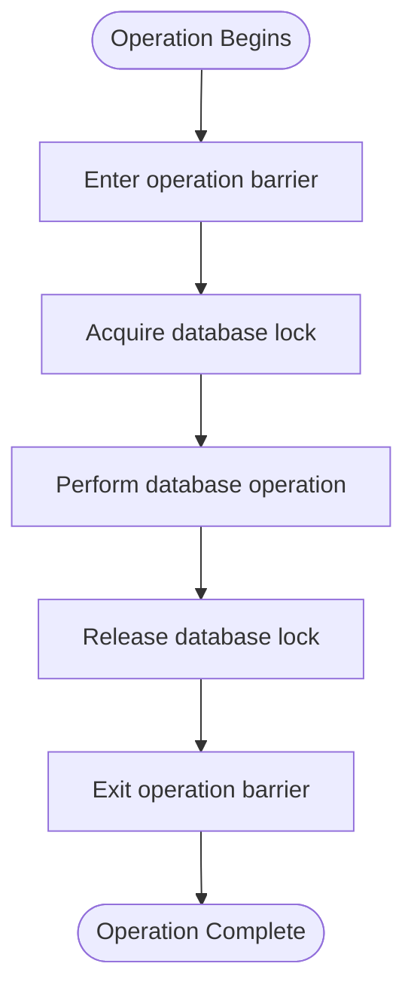

**Diagram sources**
- [chainbase.hpp:1130-1137](file://thirdparty/chainbase/include/chainbase/chainbase.hpp#L1130-L1137)

### Thread Safety Enhancements

The concurrent access safety includes several key features:

1. **Automatic Lock Management**: Operation guards automatically manage database locks
2. **Resize Barrier Integration**: Participates in shared memory resize barriers
3. **Timeout Handling**: Implements timeout mechanisms for lock acquisition
4. **Resource Cleanup**: Ensures proper cleanup of resources on completion

### Error Handling Improvements

Enhanced error handling protects against various failure scenarios:

1. **Concurrent Resize Exceptions**: Proper handling of shared memory resize operations
2. **Deadlock Prevention**: Timeout mechanisms prevent indefinite blocking
3. **Graceful Degradation**: Fallback mechanisms for critical operations
4. **Diagnostic Information**: Comprehensive logging for debugging concurrent issues

**Section sources**
- [chainbase.hpp:1130-1137](file://thirdparty/chainbase/include/chainbase/chainbase.hpp#L1130-L1137)
- [p2p_plugin.cpp:173-208](file://plugins/p2p/p2p_plugin.cpp#L173-L208)

## Logging Level Consistency

**Updated** The P2P plugin has implemented improved logging level consistency to reduce verbosity during normal operation while maintaining appropriate log levels for different operational contexts.

### Sync Mode Logging Improvements

The plugin has undergone significant improvements in logging level management, particularly for synchronization operations:

- **Sync Mode Downgrade**: Sync mode block processing logs were downgraded from info level to debug level
- **Normal Mode Preservation**: Normal block processing continues to use info level logging for visibility
- **Reduced Verbosity**: This change significantly reduces log volume during routine blockchain synchronization
- **Contextual Appropriateness**: Debug level logging is more appropriate for frequent sync operations while preserving info level for exceptional events

### Logging Implementation Details

The logging changes are implemented in the block handling method:

```cpp
if (sync_mode)
    dlog("chain pushing sync block #${block_num} (head: ${head}, gap: ${gap})",
         ("block_num", blk_msg.block.block_num())("head", head_block_num)("gap", gap));
else
    dlog("chain pushing normal block #${block_num} (head: ${head}, gap: ${gap})",
         ("block_num", blk_msg.block.block_num())("head", head_block_num)("gap", gap));
```

**Key Benefits:**
- **Reduced Log Volume**: Sync operations (which occur frequently during blockchain synchronization) now use debug level logging
- **Maintained Visibility**: Normal operations continue to use info level logging for operational visibility
- **Consistent Behavior**: Both sync and normal modes now consistently use debug level logging, improving overall logging consistency
- **Performance Impact**: Lower logging overhead during normal operation while preserving diagnostic information

### Network Layer Integration

The network layer maintains mixed logging levels for different operational contexts:

- **Info Level**: Used for significant operational events and peer management actions
- **Debug Level**: Used for routine synchronization and connection maintenance
- **Warning/Error Levels**: Used for error conditions and exceptional circumstances

**Section sources**
- [p2p_plugin.cpp:151-156](file://plugins/p2p/p2p_plugin.cpp#L151-L156)

## Dependency Analysis

The P2P plugin has well-defined dependencies that enable modularity and maintainability:

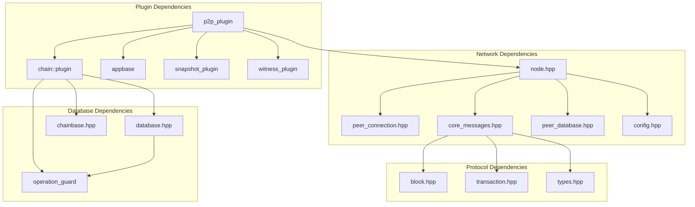

**Diagram sources**
- [CMakeLists.txt:27-34](file://plugins/p2p/CMakeLists.txt#L27-L34)
- [p2p_plugin.cpp:1-13](file://plugins/p2p/p2p_plugin.cpp#L1-L13)

Key dependency relationships:

1. **Chain Integration**: Direct dependency on the chain plugin for blockchain state access
2. **Network Foundation**: Relies on the network library for peer communication
3. **Application Framework**: Uses appbase for plugin lifecycle management
4. **Snapshot Coordination**: Integrates with snapshot plugin for trusted peer management
5. **Witness Integration**: Works closely with witness plugin for fork detection
6. **Database Protection**: Leverages chainbase operation guards for concurrent access safety

**Section sources**
- [CMakeLists.txt:27-34](file://plugins/p2p/CMakeLists.txt#L27-L34)
- [p2p_plugin.cpp:1-13](file://plugins/p2p/p2p_plugin.cpp#L1-L13)

## Performance Considerations

The P2P plugin implements several performance optimization strategies:

### Connection Management
- **Connection Limits**: Configurable maximum connections to prevent resource exhaustion
- **Soft-Ban Mechanisms**: Automatic peer banning for misbehaving nodes
- **Trusted Peer System**: Reduced soft-ban duration for snapshot-provided trusted peers

### Network Efficiency
- **Selective Synchronization**: Only fetches missing blockchain data
- **Message Caching**: Prevents redundant message propagation
- **Bandwidth Throttling**: Configurable upload/download limits

### Monitoring and Diagnostics
- **Periodic Statistics**: Configurable logging intervals for peer statistics
- **Stale Sync Detection**: Automatic recovery from stalled synchronization
- **Connection Health Monitoring**: Real-time peer connection quality metrics

### Logging Performance Impact
**Updated** The improved logging level consistency provides additional performance benefits:

- **Reduced I/O Overhead**: Debug level logging produces less output than info level logging
- **Lower Memory Usage**: Reduced log buffer consumption during sync operations
- **Improved Throughput**: Less frequent logging reduces CPU overhead during normal operation
- **Better Resource Utilization**: More efficient use of system resources during routine operations

### Concurrent Access Optimization
**New** The operation guard system provides performance benefits through:

- **Reduced Contention**: Automatic lock management reduces thread contention
- **Efficient Resource Usage**: Operation guards minimize overhead during validation
- **Scalable Design**: Thread-safe operations scale better under load
- **Graceful Degradation**: Timeout mechanisms prevent performance degradation

**Section sources**
- [p2p_plugin.cpp:659-756](file://plugins/p2p/p2p_plugin.cpp#L659-L756)
- [p2p_plugin.cpp:512-649](file://plugins/p2p/p2p_plugin.cpp#L512-L649)

## Troubleshooting Guide

### Common Issues and Solutions

#### Connection Problems
- **Symptom**: Unable to connect to seed nodes
- **Solution**: Verify network connectivity and check firewall settings
- **Configuration**: Review `p2p-seed-node` entries in configuration file

#### Synchronization Delays
- **Symptom**: Slow blockchain synchronization
- **Solution**: Increase `p2p-max-connections` setting
- **Monitoring**: Enable P2P statistics to identify slow peers

#### Peer Quality Issues
- **Symptom**: Frequent peer disconnections
- **Solution**: Check network stability and bandwidth limitations
- **Diagnostics**: Monitor peer statistics for connection patterns

### Minority Fork Recovery Procedures

**New** For minority fork scenarios:

1. **Detection**: Monitor witness plugin logs for minority fork warnings
2. **Automatic Recovery**: The system automatically triggers `resync_from_lib()`
3. **Manual Intervention**: Use RPC commands to trigger recovery if automatic detection fails
4. **Verification**: Monitor logs to confirm successful recovery and synchronization

### Logging Level Considerations

**Updated** For troubleshooting purposes, consider adjusting logging levels:

- **Enable Debug Logging**: Set logging level to debug for detailed sync operation visibility
- **Monitor Sync Operations**: Use debug logs to track sync progress and identify bottlenecks
- **Performance Tuning**: Adjust logging levels based on operational requirements

### Configuration Reference

The P2P plugin supports extensive configuration options:

| Configuration Option | Description | Default Value |
|---------------------|-------------|---------------|
| `p2p-endpoint` | Local IP and port for incoming connections | 127.0.0.1:9876 |
| `p2p-max-connections` | Maximum incoming connections | 0 (unlimited) |
| `p2p-seed-node` | Seed node endpoints | None |
| `p2p-stats-enabled` | Enable peer statistics logging | true |
| `p2p-stats-interval` | Statistics logging interval (seconds) | 300 |
| `p2p-stale-sync-detection` | Enable stale sync detection | false |
| `p2p-stale-sync-timeout-seconds` | Stale sync timeout | 120 |

### Concurrent Access Issues

**New** For concurrent access problems:

1. **Monitor Operation Guards**: Check for operation guard timeouts in logs
2. **Check Shared Memory**: Verify shared memory resize operations are completing
3. **Adjust Timeouts**: Increase operation guard timeout values if needed
4. **Resource Monitoring**: Monitor system resources during high-load periods

**Section sources**
- [p2p_plugin.cpp:659-683](file://plugins/p2p/p2p_plugin.cpp#L659-L683)
- [p2p_plugin.cpp:910-979](file://plugins/p2p/p2p_plugin.cpp#L910-L979)
- [config.ini:1-136](file://share/vizd/config/config.ini#L1-L136)

## Conclusion

The P2P Plugin represents a sophisticated implementation of blockchain networking infrastructure that provides essential functionality for distributed consensus systems. Its modular architecture, comprehensive peer management, and robust synchronization protocols make it a cornerstone component of the VIZ blockchain ecosystem.

**Updated** Key enhancements include:

1. **Security Focus**: Advanced block validation and witness verification mechanisms
2. **Performance Optimization**: Efficient synchronization and connection management
3. **Operational Excellence**: Comprehensive monitoring and diagnostic capabilities
4. **Extensibility**: Clean interfaces that support future enhancements
5. **Logging Efficiency**: Improved logging level consistency reduces verbosity while maintaining operational visibility
6. **Minority Fork Recovery**: Specialized recovery mechanism for handling fork scenarios
7. **Concurrent Access Safety**: Enhanced protection against race conditions and data corruption
8. **Integration Capabilities**: Seamless coordination with witness and snapshot plugins

The recent additions demonstrate ongoing attention to operational efficiency and user experience. The new minority fork recovery functionality provides automated solutions for complex network scenarios, while the enhanced concurrent access safety mechanisms ensure reliable operation under high-load conditions. The improved logging level consistency further optimizes system performance while maintaining appropriate diagnostic capabilities.

The plugin's design demonstrates best practices in distributed systems engineering, balancing security, performance, and maintainability while providing the foundation for scalable blockchain networks. The integration of operation guards and specialized recovery mechanisms positions the P2P plugin to handle increasingly complex blockchain networking requirements.