# P2P Plugin

<cite>
**Referenced Files in This Document**
- [p2p_plugin.hpp](file://plugins/p2p/include/graphene/plugins/p2p/p2p_plugin.hpp)
- [p2p_plugin.cpp](file://plugins/p2p/p2p_plugin.cpp)
- [node.hpp](file://libraries/network/include/graphene/network/node.hpp)
- [peer_connection.hpp](file://libraries/network/include/graphene/network/peer_connection.hpp)
- [peer_database.hpp](file://libraries/network/include/graphene/network/peer_database.hpp)
- [core_messages.hpp](file://libraries/network/include/graphene/network/core_messages.hpp)
- [message.hpp](file://libraries/network/include/graphene/network/message.hpp)
- [config.hpp](file://libraries/network/include/graphene/network/config.hpp)
- [node.cpp](file://libraries/network/node.cpp)
- [database.hpp](file://libraries/chain/include/graphene/chain/database.hpp)
- [dlt_block_log.hpp](file://libraries/chain/include/graphene/chain/dlt_block_log.hpp)
- [dlt_block_log.cpp](file://libraries/chain/dlt_block_log.cpp)
- [database.cpp](file://libraries/chain/database.cpp)
- [chainbase.hpp](file://thirdparty/chainbase/include/chainbase/chainbase.hpp)
- [witness.cpp](file://plugins/witness/witness.cpp)
- [CMakeLists.txt](file://plugins/p2p/CMakeLists.txt)
- [config.ini](file://share/vizd/config/config.ini)
</cite>

## Update Summary
**Changes Made**
- Enhanced monitoring capabilities with comprehensive ANSI color-coded logging (orange for warnings, red for critical alerts)
- Comprehensive gap detection reporting with detailed DLT coverage gap monitoring
- Periodic DLT block log integrity scans with continuity verification
- Enhanced peer statistics logging with improved visibility into failed/rejected connections
- Strategic ANSI color coding (white, cyan, gray, orange, red) for improved console readability
- Conditional block processing latency logging only for successful non-sync operations
- Enhanced DLT mode debug logging with gap detection awareness
- Improved console readability with visual distinction between different log message types
- Automatic peer soft-banning for sync spam with gap-aware recovery mechanisms
- Enhanced minority fork recovery with improved peer interaction handling and gap detection

## Table of Contents
1. [Introduction](#introduction)
2. [Project Structure](#project-structure)
3. [Core Components](#core-components)
4. [Architecture Overview](#architecture-overview)
5. [Detailed Component Analysis](#detailed-component-analysis)
6. [Enhanced DLT Mode Block Range Management](#enhanced-dlt-mode-block-range-management)
7. [Improved Gap Detection and Recovery](#improved-gap-detection-and-recovery)
8. [Sophisticated Clamping Logic](#sophisticated-clamping-logic)
9. [Enhanced Peer Interaction Handling](#enhanced-peer-interaction-handling)
10. [Comprehensive Logging Throughout Sync Process](#comprehensive-logging-throughout-sync-process)
11. [ANSI Color Code Implementation](#ansi-color-code-implementation)
12. [Enhanced DLT Mode Debug Logging](#enhanced-dlt-mode-debug-logging)
13. [Improved Console Readability](#improved-console-readability)
14. [Conditional Block Processing Latency Logging](#conditional-block-processing-latency-logging)
15. [Graceful Degradation Capabilities](#graceful-degradation-capabilities)
16. [Minority Fork Recovery](#minority-fork-recovery)
17. [Enhanced Block Validation](#enhanced-block-validation)
18. [Concurrent Access Safety](#concurrent-access-safety)
19. [Logging Level Consistency](#logging-level-consistency)
20. [Dependency Analysis](#dependency-analysis)
21. [Performance Considerations](#performance-considerations)
22. [Troubleshooting Guide](#troubleshooting-guide)
23. [Conclusion](#conclusion)

## Introduction

The P2P (Peer-to-Peer) Plugin is a critical component of the VIZ blockchain node that enables decentralized communication between nodes in the network. This plugin provides the foundation for blockchain synchronization, transaction propagation, and peer discovery mechanisms that keep the entire network synchronized and functional.

The plugin implements a sophisticated networking layer built on top of the Graphene network library, providing features such as automatic peer discovery, blockchain synchronization protocols, transaction broadcasting, and advanced peer management capabilities including soft-ban mechanisms and connection monitoring.

**Updated** The plugin now includes enhanced monitoring capabilities with comprehensive ANSI color codes for improved console readability. DLT mode debug messages are displayed in gray color, while peer statistics and other informational messages use cyan and white color codes. The conditional block processing latency logging ensures that latency information is only displayed for successful block processing in non-sync mode, reducing log volume while maintaining operational visibility. These enhancements provide better visual distinction between different types of log messages and improve troubleshooting capabilities during network operations.

## Project Structure

The P2P plugin follows a modular architecture with clear separation of concerns:

```mermaid
graph TB
subgraph "P2P Plugin Layer"
P2P[p2p_plugin.hpp/cpp]
Impl[p2p_plugin_impl]
DLT[DLT Mode Integration]
Stats[P2P Stats Task]
Stale[Stale Sync Detection]
Resync[resync_from_lib method]
Guard[operation_guard integration]
Colors[ANSI Color Codes]
Latency[Conditional Latency Logging]
Visibility[Enhanced Block Processing Visibility]
PeerDB[Enhanced Peer Database Logging]
StorageDiag[Block Storage Diagnostics]
DLTIntegrity[DLT Integrity Verification]
GapDetection[Comprehensive Gap Detection]
```

**Diagram sources**
- [p2p_plugin.hpp:18-55](file://plugins/p2p/include/graphene/plugins/p2p/p2p_plugin.hpp#L18-L55)
- [p2p_plugin.cpp:910-979](file://plugins/p2p/p2p_plugin.cpp#L910-L979)
- [node.hpp:190-320](file://libraries/network/include/graphene/network/node.hpp#L190-L320)

**Section sources**
- [p2p_plugin.hpp:1-57](file://plugins/p2p/include/graphene/plugins/p2p/p2p_plugin.hpp#L1-L57)
- [CMakeLists.txt:1-49](file://plugins/p2p/CMakeLists.txt#L1-L49)

## Core Components

### P2P Plugin Interface

The main plugin class provides a clean interface for managing P2P networking functionality:

```mermaid
classDiagram
class p2p_plugin {
+set_program_options(cli, cfg)
+plugin_initialize(options)
+plugin_startup()
+plugin_shutdown()
+broadcast_block(block)
+broadcast_block_post_validation(block_id, witness_account, signature)
+broadcast_transaction(tx)
+set_block_production(producing_blocks)
+resync_from_lib()
-my : p2p_plugin_impl
}
class p2p_plugin_impl {
+has_item(id)
+handle_block(blk_msg, sync_mode, contained_tx_ids)
+handle_transaction(trx_msg)
+handle_message(message)
+get_block_ids(synopsis, remaining_count, limit)
+get_item(id)
+get_blockchain_synopsis(reference_point, num_blocks)
+sync_status(item_type, item_count)
+connection_count_changed(count)
+get_block_number(block_id)
+get_block_time(block_id)
+get_head_block_id()
+get_chain_id()
+error_encountered(message, error)
+get_blockchain_now()
+p2p_stats_task()
+stale_sync_check_task()
+is_included_block(block_id)
+ANSI Color Codes
+Conditional Latency Logging
+Enhanced Block Processing Visibility
+DLT Mode Debug Logging
+Enhanced Peer Stats
+Enhanced Peer Database Logging
+Block Storage Diagnostics
+DLT Integrity Verification
+Automatic Peer Soft-Banning
+Enhanced Gap Detection
+Comprehensive Gap Reporting
+Periodic DLT Integrity Scans
+Gap-Aware Recovery Mechanisms
+DLT Coverage Gap Monitoring
+Orange Color Coding for Warnings
+Red Color Coding for Critical Alerts
```

**Diagram sources**
- [p2p_plugin.hpp:18-55](file://plugins/p2p/include/graphene/plugins/p2p/p2p_plugin.hpp#L18-L55)
- [p2p_plugin.cpp:49-126](file://plugins/p2p/p2p_plugin.cpp#L49-L126)

### Network Node Architecture

The plugin integrates with the underlying network infrastructure through a sophisticated node abstraction:

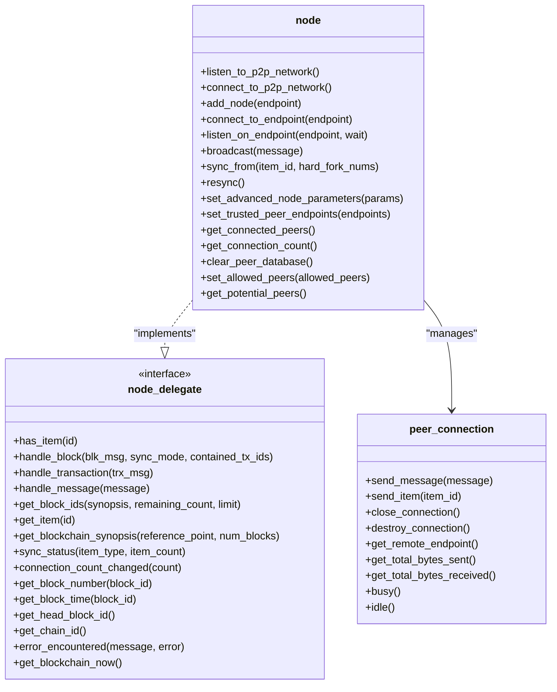
```mermaid
classDiagram
class node {
+listen_to_p2p_network()
+connect_to_p2p_network()
+add_node(endpoint)
+connect_to_endpoint(endpoint)
+listen_on_endpoint(endpoint, wait)
+broadcast(message)
+sync_from(item_id, hard_fork_nums)
+resync()
+set_advanced_node_parameters(params)
+set_trusted_peer_endpoints(endpoints)
+get_connected_peers()
+get_connection_count()
+clear_peer_database()
+set_allowed_peers(allowed_peers)
+get_potential_peers()
}
class node_delegate {
<<interface>>
+has_item(id)
+handle_block(blk_msg, sync_mode, contained_tx_ids)
+handle_transaction(trx_msg)
+handle_message(message)
+get_block_ids(synopsis, remaining_count, limit)
+get_item(id)
+get_blockchain_synopsis(reference_point, num_blocks)
+sync_status(item_type, item_count)
+connection_count_changed(count)
+get_block_number(block_id)
+get_block_time(block_id)
+get_head_block_id()
+get_chain_id()
+error_encountered(message, error)
+get_blockchain_now()
}
class peer_connection {
+send_message(message)
+send_item(item_id)
+close_connection()
+destroy_connection()
+get_remote_endpoint()
+get_total_bytes_sent()
+get_total_bytes_received()
+busy()
+idle()
}
node ..|> node_delegate : "implements"
node --> peer_connection : "manages"
```

**Diagram sources**
- [node.hpp:190-320](file://libraries/network/include/graphene/network/node.hpp#L190-L320)
- [node.hpp:60-167](file://libraries/network/include/graphene/network/node.hpp#L60-L167)
- [peer_connection.hpp:79-354](file://libraries/network/include/graphene/network/peer_connection.hpp#L79-L354)

**Section sources**
- [p2p_plugin.hpp:18-55](file://plugins/p2p/include/graphene/plugins/p2p/p2p_plugin.hpp#L18-L55)
- [node.hpp:190-320](file://libraries/network/include/graphene/network/node.hpp#L190-L320)

## Architecture Overview

The P2P plugin architecture implements a layered approach to blockchain networking:

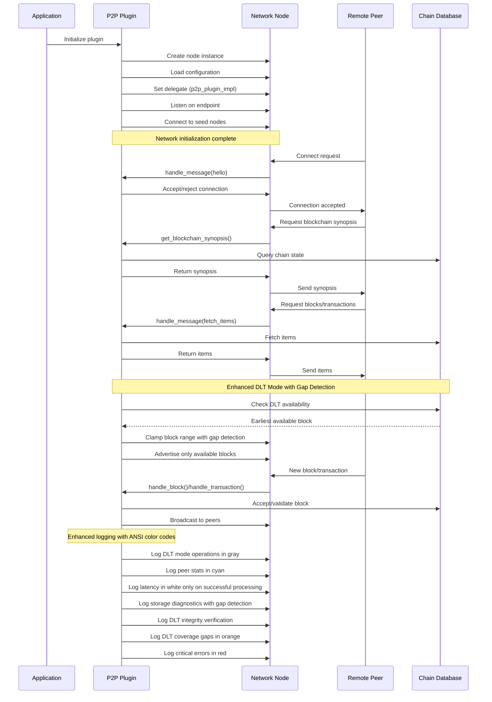
```mermaid
sequenceDiagram
participant App as Application
participant P2P as P2P Plugin
participant Node as Network Node
participant Peer as Remote Peer
participant Chain as Chain Database
App->>P2P : Initialize plugin
P2P->>Node : Create node instance
P2P->>Node : Load configuration
P2P->>Node : Set delegate (p2p_plugin_impl)
P2P->>Node : Listen on endpoint
P2P->>Node : Connect to seed nodes
Note over P2P,Node : Network initialization complete
Peer->>Node : Connect request
Node->>P2P : handle_message(hello)
P2P->>Node : Accept/reject connection
Node->>Peer : Connection accepted
Peer->>Node : Request blockchain synopsis
Node->>P2P : get_blockchain_synopsis()
P2P->>Chain : Query chain state
P2P->>Node : Return synopsis
Node->>Peer : Send synopsis
Peer->>Node : Request blocks/transactions
Node->>P2P : handle_message(fetch_items)
P2P->>Chain : Fetch items
P2P->>Node : Return items
Node->>Peer : Send items
Note over P2P,Chain : Enhanced DLT Mode with Gap Detection
P2P->>Chain : Check DLT availability
Chain-->>P2P : Earliest available block
P2P->>Node : Clamp block range with gap detection
P2P->>Node : Advertise only available blocks
Peer->>Node : New block/transaction
Node->>P2P : handle_block()/handle_transaction()
P2P->>Chain : Accept/validate block
P2P->>Node : Broadcast to peers
Note over P2P : Enhanced logging with ANSI color codes
P2P->>Node : Log DLT mode operations in gray
P2P->>Node : Log peer stats in cyan
P2P->>Node : Log latency in white only on successful processing
P2P->>Node : Log storage diagnostics with gap detection
P2P->>Node : Log DLT integrity verification
P2P->>Node : Log DLT coverage gaps in orange
P2P->>Node : Log critical errors in red
```

**Diagram sources**
- [p2p_plugin.cpp:758-823](file://plugins/p2p/p2p_plugin.cpp#L758-L823)
- [node.cpp:1-200](file://libraries/network/node.cpp#L1-L200)

The architecture provides several key capabilities:

1. **Automatic Peer Discovery**: The plugin automatically discovers and connects to seed nodes specified in configuration
2. **Blockchain Synchronization**: Implements efficient blockchain synchronization using selective block fetching with DLT mode awareness and gap detection
3. **Transaction Propagation**: Broadcasts transactions to connected peers with intelligent caching
4. **Peer Management**: Manages peer connections with soft-ban mechanisms and connection limits
5. **Monitoring and Statistics**: Provides comprehensive peer statistics and network health monitoring with colored console output
6. **Minority Fork Recovery**: Specialized recovery mechanism for handling minority fork scenarios
7. **Concurrent Access Safety**: Enhanced protection against concurrent access conflicts during block processing
8. **DLT Mode Support**: Intelligent block range management for snapshot-based nodes with sophisticated gap detection
9. **Graceful Degradation**: Handles peer unavailability with fallback mechanisms and automatic recovery
10. **Enhanced Logging**: Comprehensive logging system with ANSI color codes for improved console readability and conditional latency reporting
11. **DLT Storage Diagnostics**: Comprehensive block storage monitoring with gap detection and coverage analysis
12. **Peer Database Analytics**: Detailed peer interaction tracking with enhanced visibility into connection failures
13. **Automatic Peer Soft-Banning**: Intelligent peer management with automatic soft-banning for sync spam
14. **DLT Integrity Verification**: Periodic verification of DLT block log integrity with gap detection and continuity scanning
15. **Comprehensive Gap Detection**: Advanced gap detection reporting with detailed coverage gap monitoring
16. **Orange Color Coding**: Strategic use of orange color for network warnings and peer status changes
17. **Red Color Coding**: Critical error reporting with red color coding for severe issues
18. **Periodic DLT Integrity Scans**: Automated DLT block log integrity verification with continuity checks

## Detailed Component Analysis

### Block Validation Protocol

The P2P plugin implements a sophisticated block validation mechanism that enhances security and prevents malicious attacks:


```mermaid
flowchart TD
Start([Block Received]) --> ValidateType{"Is block_post_validation_message?"}
ValidateType --> |No| StandardValidation["Standard block validation<br/>via chain.accept_block()"]
ValidateType --> |Yes| ExtractParams["Extract block_id,<br/>witness_account,<br/>signature"]
ExtractParams --> VerifyWitness{"Verify witness exists?"}
VerifyWitness --> |No| RejectBlock["Reject block<br/>(invalid witness)"]
VerifyWitness --> |Yes| VerifySignature["Verify signature<br/>matches witness key"]
VerifySignature --> SignatureValid{"Signature valid?"}
SignatureValid --> |No| RejectBlock
SignatureValid --> |Yes| ApplyValidation["Apply block post-validation<br/>chain.db().apply_block_post_validation()"]
ApplyValidation --> BroadcastBlock["Broadcast block to peers"]
StandardValidation --> BroadcastBlock
RejectBlock --> End([End])
BroadcastBlock --> End
style RejectBlock fill:#ffcccc
style BroadcastBlock fill:#ccffcc
```

**Diagram sources**
- [p2p_plugin.cpp:216-245](file://plugins/p2p/p2p_plugin.cpp#L216-L245)
- [p2p_plugin.cpp:855-865](file://plugins/p2p/p2p_plugin.cpp#L855-L865)

**Updated** The block validation protocol now includes enhanced concurrent access safety through operation guard protection and conditional latency logging:

The block validation process incorporates operation guards to prevent concurrent access conflicts during witness key validation and block post-validation processing. This ensures thread-safe access to shared blockchain state during high-load conditions.

The enhanced validation includes:

1. **Witness Signature Verification**: Validates that the block signature matches the claimed witness's public key
2. **Chain ID Consistency**: Ensures blocks belong to the correct blockchain instance
3. **Hard Fork Protection**: Handles different validation requirements across blockchain hard forks
4. **Post-Validation Processing**: Applies additional validation steps after initial acceptance
5. **Concurrent Access Protection**: Uses operation guards to prevent race conditions during validation
6. **Error Handling**: Comprehensive error handling for various failure scenarios
7. **Conditional Latency Reporting**: Only displays latency information for successful block processing in non-sync mode

### Peer Connection Management

The plugin manages peer connections through a sophisticated state machine:

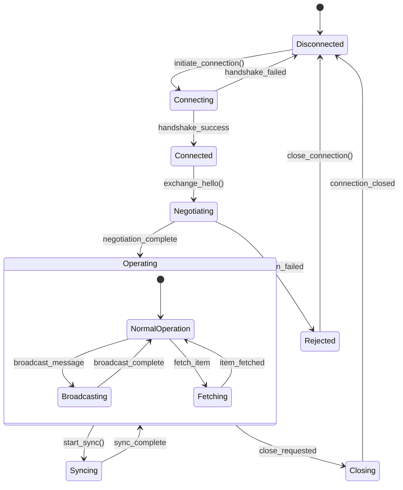
```mermaid
stateDiagram-v2
[*] --> Disconnected
Disconnected --> Connecting : initiate_connection()
Connecting --> Connected : handshake_success
Connecting --> Disconnected : handshake_failed
Connected --> Negotiating : exchange_hello()
Negotiating --> Operating : negotiation_complete
Negotiating --> Rejected : negotiation_failed
Rejected --> Disconnected : close_connection()
Operating --> Syncing : start_sync()
Syncing --> Operating : sync_complete
Operating --> Closing : close_requested
Closing --> Disconnected : connection_closed
state Operating {
[*] --> NormalOperation
NormalOperation --> Broadcasting : broadcast_message
Broadcasting --> NormalOperation : broadcast_complete
NormalOperation --> Fetching : fetch_item
Fetching --> NormalOperation : item_fetched
}
```

**Diagram sources**
- [peer_connection.hpp:82-106](file://libraries/network/include/graphene/network/peer_connection.hpp#L82-L106)

### Blockchain Synchronization Protocol

The synchronization protocol efficiently handles blockchain state reconciliation with enhanced gap detection:

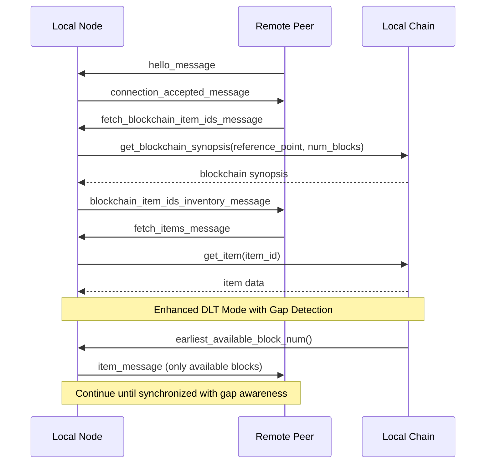
```mermaid
sequenceDiagram
participant Local as Local Node
participant Remote as Remote Peer
participant Chain as Local Chain
Remote->>Local : hello_message
Local->>Remote : connection_accepted_message
Remote->>Local : fetch_blockchain_item_ids_message
Local->>Chain : get_blockchain_synopsis(reference_point, num_blocks)
Chain-->>Local : blockchain synopsis
Local->>Remote : blockchain_item_ids_inventory_message
Remote->>Local : fetch_items_message
Local->>Chain : get_item(item_id)
Chain-->>Local : item data
Note over Local,Chain : Enhanced DLT Mode with Gap Detection
Chain->>Local : earliest_available_block_num()
Local->>Remote : item_message (only available blocks)
Note over Local,Remote : Continue until synchronized with gap awareness
```

**Diagram sources**
- [core_messages.hpp:188-218](file://libraries/network/include/graphene/network/core_messages.hpp#L188-L218)
- [p2p_plugin.cpp:247-301](file://plugins/p2p/p2p_plugin.cpp#L247-L301)

**Section sources**
- [p2p_plugin.cpp:129-208](file://plugins/p2p/p2p_plugin.cpp#L129-L208)
- [p2p_plugin.cpp:247-301](file://plugins/p2p/p2p_plugin.cpp#L247-L301)
- [peer_connection.hpp:79-354](file://libraries/network/include/graphene/network/peer_connection.hpp#L79-L354)

## Enhanced DLT Mode Block Range Management

**New** The P2P plugin now includes enhanced DLT (Data Ledger Technology) mode block range management that provides intelligent block serving capabilities for snapshot-based nodes with sophisticated gap detection and automatic recovery mechanisms.

### Sophisticated Clamping Logic in get_block_ids()

The `get_block_ids()` method has been enhanced with sophisticated clamping logic to prevent advertising blocks not available in node storage:

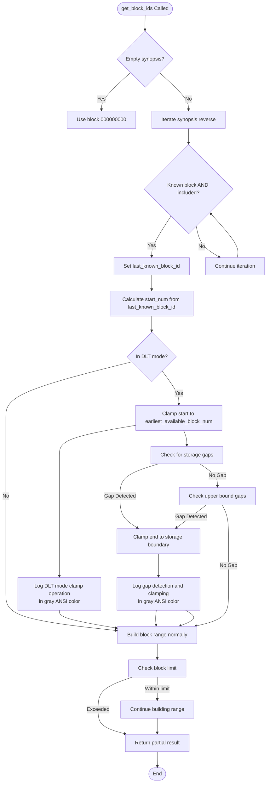
```mermaid
flowchart TD
Start([get_block_ids Called]) --> CheckSynopsis{"Empty synopsis?"}
CheckSynopsis --> |Yes| UseZero["Use block 000000000"]
CheckSynopsis --> |No| IterateSyn["Iterate synopsis reverse"]
IterateSyn --> CheckKnown{"Known block AND included?"}
CheckKnown --> |Yes| FoundBlock["Set last_known_block_id"]
CheckKnown --> |No| ContinueLoop["Continue iteration"]
ContinueLoop --> CheckKnown
FoundBlock --> CalcStart["Calculate start_num from last_known_block_id"]
CalcStart --> CheckDLT{"In DLT mode?"}
CheckDLT --> |No| BuildRange["Build block range normally"]
CheckDLT --> |Yes| ClampStart["Clamp start to earliest_available_block_num"]
ClampStart --> LogClamp["Log DLT mode clamp operation<br/>in gray ANSI color"]
ClampStart --> CheckStorageGaps["Check for storage gaps"]
CheckStorageGaps --> |Gap Detected| ClampEnd["Clamp end to storage boundary"]
CheckStorageGaps --> |No Gap| CheckUpperBound["Check upper bound gaps"]
CheckUpperBound --> |Gap Detected| ClampEnd
CheckUpperBound --> |No Gap| BuildRange
ClampEnd --> LogGap["Log gap detection and clamping<br/>in gray ANSI color"]
LogGap --> BuildRange
BuildRange --> CheckLimit["Check block limit"]
CheckLimit --> |Exceeded| ReturnResult["Return partial result"]
CheckLimit --> |Within limit| ContinueBuild["Continue building range"]
ContinueBuild --> ReturnResult
ReturnResult --> End([End])
LogClamp --> BuildRange
LogGap --> BuildRange
```

**Diagram sources**
- [p2p_plugin.cpp:290-364](file://plugins/p2p/p2p_plugin.cpp#L290-L364)

### Enhanced Gap Detection and Recovery

The plugin now includes comprehensive gap detection and automatic recovery mechanisms:

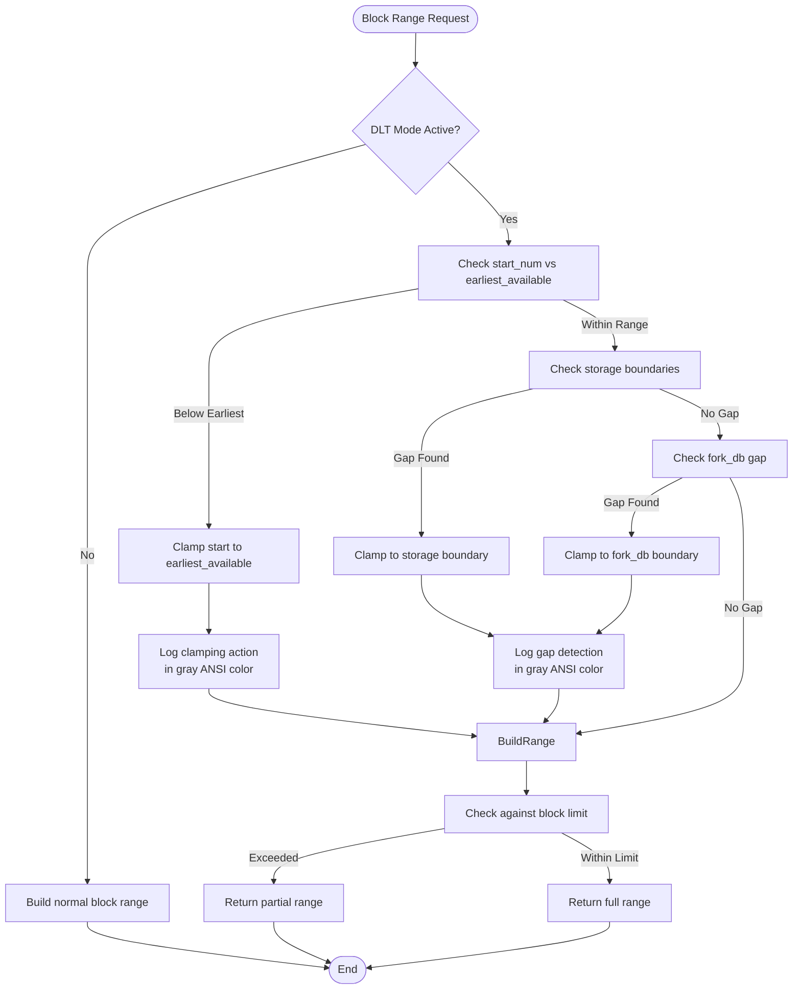
```mermaid
flowchart TD
Start([Block Range Request]) --> CheckDLT{"DLT Mode Active?"}
CheckDLT --> |No| NormalRange["Build normal block range"]
CheckDLT --> |Yes| CheckStartGap["Check start_num vs earliest_available"]
CheckStartGap --> |Below Earliest| ClampToEarliest["Clamp start to earliest_available"]
CheckStartGap --> |Within Range| CheckStorageBoundary["Check storage boundaries"]
CheckStorageBoundary --> |Gap Found| ClampToBoundary["Clamp to storage boundary"]
CheckStorageBoundary --> |No Gap| CheckForkDBGap["Check fork_db gap"]
CheckForkDBGap --> |Gap Found| ClampToForkDB["Clamp to fork_db boundary"]
CheckForkDBGap --> |No Gap| BuildRange
ClampToEarliest --> LogClamp["Log clamping action<br/>in gray ANSI color"]
ClampToBoundary --> LogGap["Log gap detection<br/>in gray ANSI color"]
ClampToForkDB --> LogGap
LogClamp --> BuildRange
LogGap --> BuildRange
BuildRange --> CheckLimit["Check against block limit"]
CheckLimit --> |Exceeded| ReturnPartial["Return partial range"]
CheckLimit --> |Within Limit| ReturnFull["Return full range"]
ReturnPartial --> End([End])
ReturnFull --> End
NormalRange --> End
```

**Diagram sources**
- [p2p_plugin.cpp:295-340](file://plugins/p2p/p2p_plugin.cpp#L295-L340)

### Enhanced get_item() Method with Gap Awareness

The `get_item()` method now provides comprehensive DLT mode error handling with gap detection:

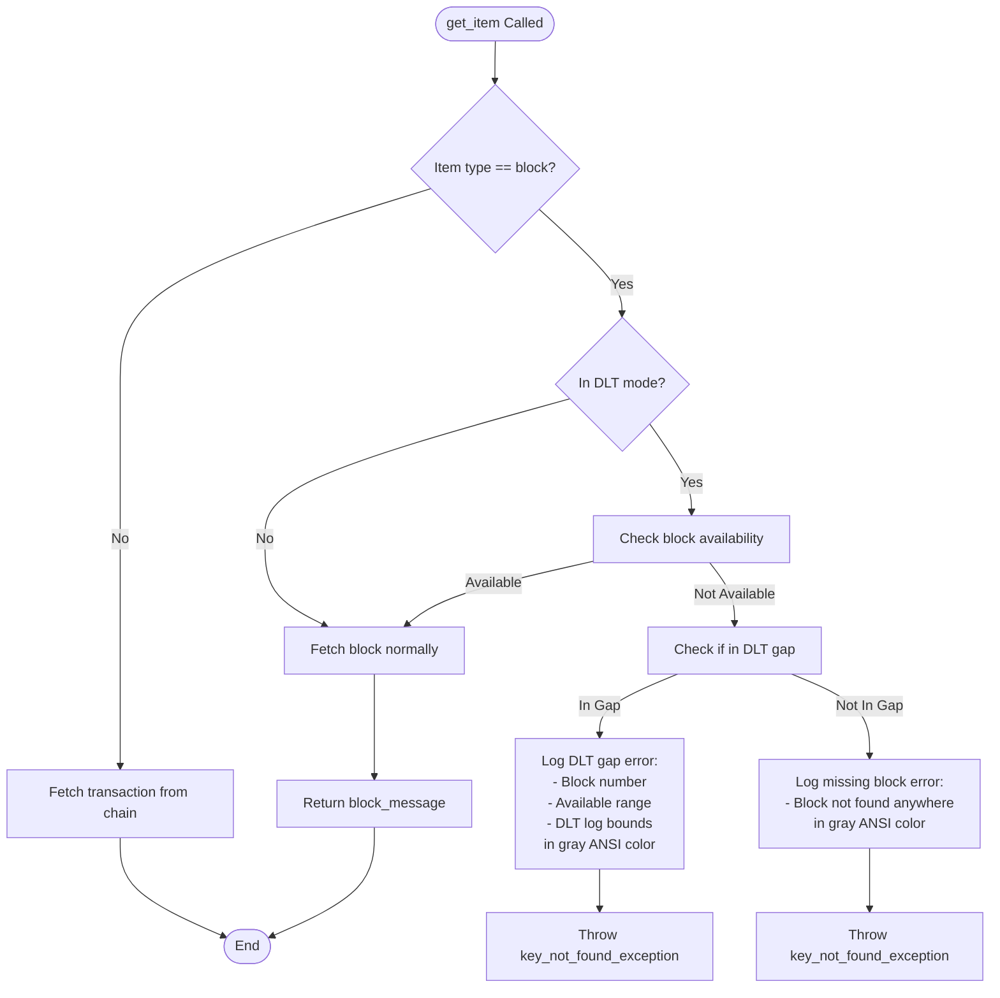
```mermaid
flowchart TD
Start([get_item Called]) --> CheckItemType{"Item type == block?"}
CheckItemType --> |No| FetchTx["Fetch transaction from chain"]
CheckItemType --> |Yes| CheckDLT{"In DLT mode?"}
CheckDLT --> |No| FetchBlock["Fetch block normally"]
CheckDLT --> |Yes| CheckAvailability["Check block availability"]
CheckAvailability --> |Available| FetchBlock
CheckAvailability --> |Not Available| CheckGap["Check if in DLT gap"]
CheckGap --> |In Gap| LogGapError["Log DLT gap error:<br/>- Block number<br/>- Available range<br/>- DLT log bounds<br/>in gray ANSI color"]
CheckGap --> |Not In Gap| LogMissingError["Log missing block error:<br/>- Block not found anywhere<br/>in gray ANSI color"]
LogGapError --> ThrowGapException["Throw key_not_found_exception"]
LogMissingError --> ThrowMissingException["Throw key_not_found_exception"]
FetchTx --> End([End])
FetchBlock --> ReturnBlock["Return block_message"]
ReturnBlock --> End
```

**Diagram sources**
- [p2p_plugin.cpp:371-405](file://plugins/p2p/p2p_plugin.cpp#L371-L405)

### DLT Mode Integration Points

The enhanced DLT mode integration affects multiple plugin methods with sophisticated gap detection:

1. **Block ID Generation**: `get_block_ids()` clamps starting block numbers to available DLT range and detects storage gaps
2. **Item Serving**: `get_item()` provides detailed logging for unavailable DLT blocks and gap detection
3. **Synopsis Generation**: `get_blockchain_synopsis()` includes DLT availability context with gap awareness
4. **Earliest Block Calculation**: Database provides `earliest_available_block_num()` for DLT mode with gap detection
5. **Storage Boundary Detection**: Enhanced logic to detect gaps between dlt_block_log and fork_db

### Database Integration

The database provides DLT-specific functionality with gap detection:

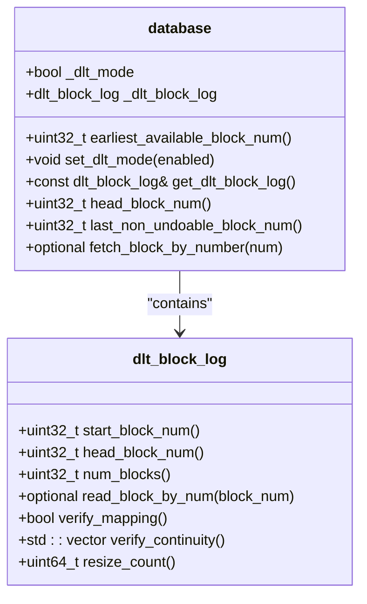
```mermaid
classDiagram
class database {
+bool _dlt_mode
+dlt_block_log _dlt_block_log
+uint32_t earliest_available_block_num()
+void set_dlt_mode(enabled)
+const dlt_block_log& get_dlt_block_log()
+uint32_t head_block_num()
+uint32_t last_non_undoable_block_num()
+optional<signed_block> fetch_block_by_number(num)
}
class dlt_block_log {
+uint32_t start_block_num()
+uint32_t head_block_num()
+uint32_t num_blocks()
+optional<signed_block> read_block_by_num(block_num)
+bool verify_mapping()
+std : : vector<uint32_t> verify_continuity()
+uint64_t resize_count()
}
database --> dlt_block_log : "contains"
```

**Diagram sources**
- [database.hpp:57-78](file://libraries/chain/include/graphene/chain/database.hpp#L57-L78)
- [dlt_block_log.hpp:35-72](file://libraries/chain/include/graphene/chain/dlt_block_log.hpp#L35-L72)

**Section sources**
- [p2p_plugin.cpp:290-405](file://plugins/p2p/p2p_plugin.cpp#L290-L405)
- [database.hpp:57-78](file://libraries/chain/include/graphene/chain/database.hpp#L57-L78)
- [dlt_block_log.hpp:35-72](file://libraries/chain/include/graphene/chain/dlt_block_log.hpp#L35-L72)

## Improved Gap Detection and Recovery

**New** The P2P plugin now includes sophisticated gap detection and automatic recovery mechanisms that prevent peer disconnections due to item_not_available responses.

### Comprehensive Gap Detection Logic

The enhanced gap detection system monitors multiple storage boundaries:

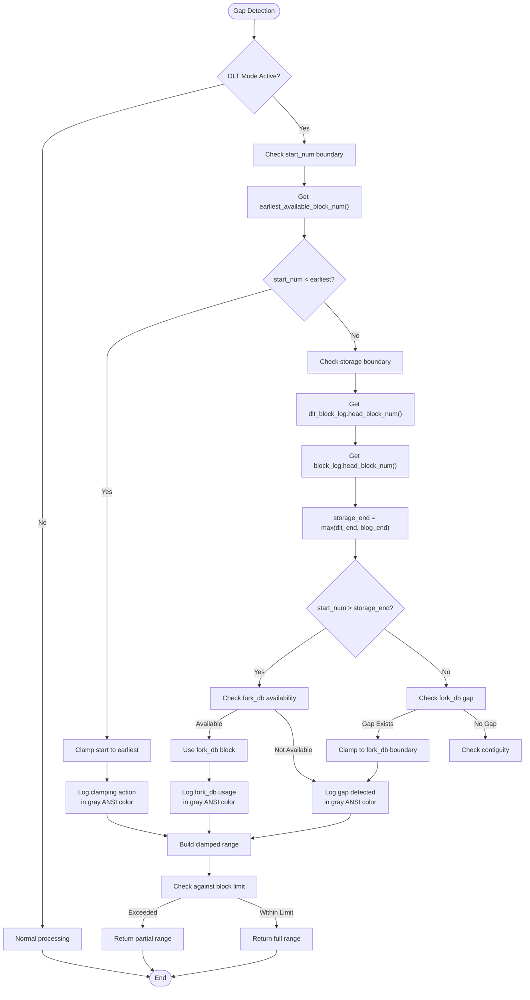
```mermaid
flowchart TD
Start([Gap Detection]) --> CheckDLTMode{"DLT Mode Active?"}
CheckDLTMode --> |No| NormalProcessing["Normal processing"]
CheckDLTMode --> |Yes| CheckStartBoundary["Check start_num boundary"]
CheckStartBoundary --> GetEarliest["Get earliest_available_block_num()"]
GetEarliest --> CheckBelowEarliest{"start_num < earliest?"}
CheckBelowEarliest --> |Yes| ClampToEarliest["Clamp start to earliest"]
CheckBelowEarliest --> |No| CheckStorageBoundary["Check storage boundary"]
CheckStorageBoundary --> GetDLTEnd["Get dlt_block_log.head_block_num()"]
GetDLTEnd --> GetBlogEnd["Get block_log.head_block_num()"]
GetBlogEnd --> GetStorageEnd["storage_end = max(dlt_end, blog_end)"]
GetStorageEnd --> CheckBeyondStorage{"start_num > storage_end?"}
CheckBeyondStorage --> |Yes| CheckForkDB["Check fork_db availability"]
CheckBeyondStorage --> |No| CheckForkDBGap["Check fork_db gap"]
CheckForkDB --> |Available| UseForkDB["Use fork_db block"]
CheckForkDB --> |Not Available| LogGap["Log gap detected<br/>in gray ANSI color"]
CheckForkDBGap --> |Gap Exists| ClampToForkDB["Clamp to fork_db boundary"]
CheckForkDBGap --> |No Gap| CheckContiguous["Check contiguity"]
ClampToEarliest --> LogClamp["Log clamping action<br/>in gray ANSI color"]
ClampToForkDB --> LogGap
UseForkDB --> LogForkDB["Log fork_db usage<br/>in gray ANSI color"]
LogClamp --> BuildRange["Build clamped range"]
LogGap --> BuildRange
LogForkDB --> BuildRange
BuildRange --> CheckLimit["Check against block limit"]
CheckLimit --> |Exceeded| ReturnPartial["Return partial range"]
CheckLimit --> |Within Limit| ReturnFull["Return full range"]
ReturnPartial --> End([End])
ReturnFull --> End
NormalProcessing --> End
```

**Diagram sources**
- [p2p_plugin.cpp:295-340](file://plugins/p2p/p2p_plugin.cpp#L295-L340)

### Automatic Recovery Mechanisms

The plugin implements automatic recovery from gap-related synchronization issues:

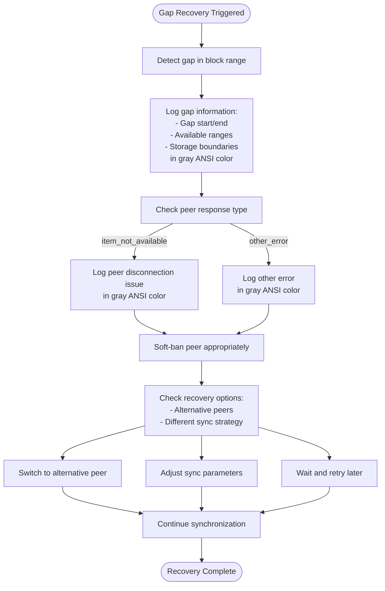
```mermaid
flowchart TD
Start([Gap Recovery Triggered]) --> DetectGap["Detect gap in block range"]
DetectGap --> LogGapInfo["Log gap information:<br/>- Gap start/end<br/>- Available ranges<br/>- Storage boundaries<br/>in gray ANSI color"]
LogGapInfo --> CheckPeerResponse["Check peer response type"]
CheckPeerResponse --> |item_not_available| LogPeerIssue["Log peer disconnection issue<br/>in gray ANSI color"]
CheckPeerResponse --> |other_error| LogOtherError["Log other error<br/>in gray ANSI color"]
LogPeerIssue --> SoftBanPeer["Soft-ban peer appropriately"]
LogOtherError --> SoftBanPeer
SoftBanPeer --> CheckRecoveryOptions["Check recovery options:<br/>- Alternative peers<br/>- Different sync strategy"]
CheckRecoveryOptions --> SwitchPeer["Switch to alternative peer"]
CheckRecoveryOptions --> AdjustSync["Adjust sync parameters"]
CheckRecoveryOptions --> WaitAndRetry["Wait and retry later"]
SwitchPeer --> ContinueSync["Continue synchronization"]
AdjustSync --> ContinueSync
WaitAndRetry --> ContinueSync
ContinueSync --> End([Recovery Complete])
```

**Diagram sources**
- [p2p_plugin.cpp:371-405](file://plugins/p2p/p2p_plugin.cpp#L371-L405)

### Enhanced Error Handling and Logging

The gap detection system provides comprehensive logging for troubleshooting:

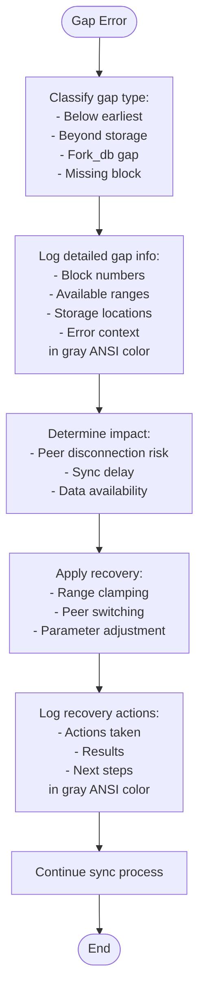
```mermaid
flowchart TD
Start([Gap Error]) --> ClassifyError["Classify gap type:<br/>- Below earliest<br/>- Beyond storage<br/>- Fork_db gap<br/>- Missing block"]
ClassifyError --> LogDetailedInfo["Log detailed gap info:<br/>- Block numbers<br/>- Available ranges<br/>- Storage locations<br/>- Error context<br/>in gray ANSI color"]
LogDetailedInfo --> DetermineImpact["Determine impact:<br/>- Peer disconnection risk<br/>- Sync delay<br/>- Data availability"]
DetermineImpact --> ApplyRecovery["Apply recovery:<br/>- Range clamping<br/>- Peer switching<br/>- Parameter adjustment"]
ApplyRecovery --> LogRecovery["Log recovery actions:<br/>- Actions taken<br/>- Results<br/>- Next steps<br/>in gray ANSI color"]
LogRecovery --> ContinueSync["Continue sync process"]
ContinueSync --> End([End])
```

**Diagram sources**
- [p2p_plugin.cpp:295-340](file://plugins/p2p/p2p_plugin.cpp#L295-L340)

**Section sources**
- [p2p_plugin.cpp:295-405](file://plugins/p2p/p2p_plugin.cpp#L295-L405)

## Sophisticated Clamping Logic

**New** The P2P plugin now includes sophisticated clamping logic in the get_block_ids() method to prevent advertising blocks that aren't available in node storage, avoiding peer disconnections due to item_not_available responses.

### Advanced Clamping Algorithm

The enhanced clamping logic implements multiple layers of block availability validation:

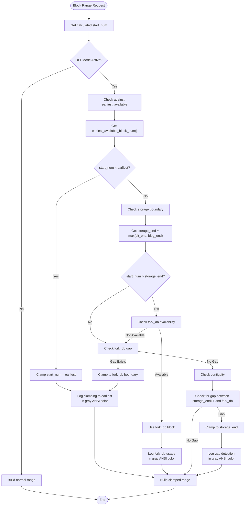
```mermaid
flowchart TD
Start([Block Range Request]) --> GetStartNum["Get calculated start_num"]
GetStartNum --> CheckDLTMode{"DLT Mode Active?"}
CheckDLTMode --> |No| BuildNormalRange["Build normal range"]
CheckDLTMode --> |Yes| CheckEarliest["Check against earliest_available"]
CheckEarliest --> GetEarliest["Get earliest_available_block_num()"]
GetEarliest --> CompareEarliest{"start_num < earliest?"}
CompareEarliest --> |Yes| ClampToEarliest["Clamp start_num = earliest"]
CompareEarliest --> |No| CheckStorageBoundary["Check storage boundary"]
CheckStorageBoundary --> GetStorageEnd["Get storage_end = max(dlt_end, blog_end)"]
GetStorageEnd --> CompareStorage{"start_num > storage_end?"}
CompareStorage --> |Yes| CheckForkDB["Check fork_db availability"]
CompareStorage --> |No| CheckForkDBGap["Check fork_db gap"]
CheckForkDB --> |Available| UseForkDB["Use fork_db block"]
CheckForkDB --> |Not Available| CheckForkDBGap
CheckForkDBGap --> |Gap Exists| ClampToForkDB["Clamp to fork_db boundary"]
CheckForkDBGap --> |No Gap| CheckContiguous["Check contiguity"]
ClampToEarliest --> LogClamp["Log clamping to earliest<br/>in gray ANSI color"]
ClampToForkDB --> LogClamp
UseForkDB --> LogForkDB["Log fork_db usage<br/>in gray ANSI color"]
LogClamp --> BuildClampedRange["Build clamped range"]
LogForkDB --> BuildClampedRange
CheckContiguous --> CheckGap["Check for gap between storage_end+1 and fork_db"]
CheckGap --> |Gap| ClampToStorageEnd["Clamp to storage_end"]
CheckGap --> |No Gap| BuildClampedRange
ClampToStorageEnd --> LogGap["Log gap detection<br/>in gray ANSI color"]
LogGap --> BuildClampedRange
BuildNormalRange --> End([End])
BuildClampedRange --> End
```

**Diagram sources**
- [p2p_plugin.cpp:295-340](file://plugins/p2p/p2p_plugin.cpp#L295-L340)

### Storage Boundary Detection

The clamping logic includes sophisticated storage boundary detection:

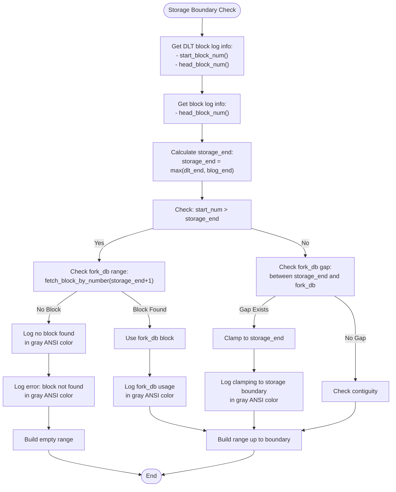
```mermaid
flowchart TD
Start([Storage Boundary Check]) --> GetDLTInfo["Get DLT block log info:<br/>- start_block_num()<br/>- head_block_num()"]
GetDLTInfo --> GetBlogInfo["Get block log info:<br/>- head_block_num()"]
GetBlogInfo --> CalcStorageEnd["Calculate storage_end:<br/>storage_end = max(dlt_end, blog_end)"]
CalcStorageEnd --> CheckStartBeyond["Check: start_num > storage_end"]
CheckStartBeyond --> |Yes| CheckForkDBRange["Check fork_db range:<br/>fetch_block_by_number(storage_end+1)"]
CheckStartBeyond --> |No| CheckForkDBGap["Check fork_db gap:<br/>between storage_end and fork_db"]
CheckForkDBRange --> |Block Found| UseForkDB["Use fork_db block"]
CheckForkDBRange --> |No Block| LogNoBlock["Log no block found<br/>in gray ANSI color"]
CheckForkDBGap --> |Gap Exists| ClampToStorage["Clamp to storage_end"]
CheckForkDBGap --> |No Gap| CheckContiguity["Check contiguity"]
UseForkDB --> LogForkDB["Log fork_db usage<br/>in gray ANSI color"]
LogNoBlock --> LogError["Log error: block not found<br/>in gray ANSI color"]
ClampToStorage --> LogClamp["Log clamping to storage boundary<br/>in gray ANSI color"]
LogForkDB --> BuildRange["Build range up to boundary"]
LogError --> BuildEmpty["Build empty range"]
LogClamp --> BuildRange
CheckContiguity --> BuildRange
BuildEmpty --> End([End])
BuildRange --> End
```

**Diagram sources**
- [p2p_plugin.cpp:308-340](file://plugins/p2p/p2p_plugin.cpp#L308-L340)

### Enhanced Logging for Clamping Operations

The clamping logic provides comprehensive logging for troubleshooting and monitoring:

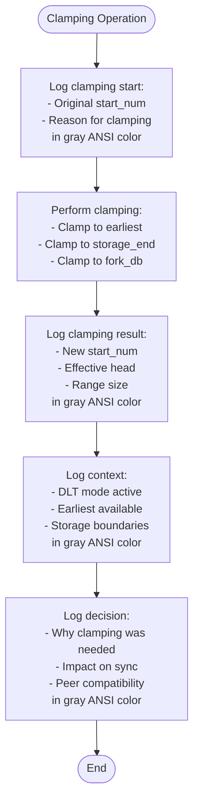
```mermaid
flowchart TD
Start([Clamping Operation]) --> LogClampStart["Log clamping start:<br/>- Original start_num<br/>- Reason for clamping<br/>in gray ANSI color"]
LogClampStart --> PerformClamp["Perform clamping:<br/>- Clamp to earliest<br/>- Clamp to storage_end<br/>- Clamp to fork_db"]
PerformClamp --> LogClampResult["Log clamping result:<br/>- New start_num<br/>- Effective head<br/>- Range size<br/>in gray ANSI color"]
LogClampResult --> LogContext["Log context:<br/>- DLT mode active<br/>- Earliest available<br/>- Storage boundaries<br/>in gray ANSI color"]
LogContext --> LogDecision["Log decision:<br/>- Why clamping was needed<br/>- Impact on sync<br/>- Peer compatibility<br/>in gray ANSI color"]
LogDecision --> End([End])
```

**Diagram sources**
- [p2p_plugin.cpp:298-302](file://plugins/p2p/p2p_plugin.cpp#L298-L302)
- [p2p_plugin.cpp:335-338](file://plugins/p2p/p2p_plugin.cpp#L335-L338)

**Section sources**
- [p2p_plugin.cpp:295-340](file://plugins/p2p/p2p_plugin.cpp#L295-L340)

## Enhanced Peer Interaction Handling

**New** The P2P plugin now includes enhanced peer interaction handling with improved error management, graceful degradation capabilities, and sophisticated gap-aware block serving to avoid item_not_available responses.

### Comprehensive Peer Database Logging

The plugin provides detailed peer database logging for troubleshooting with gap detection awareness:

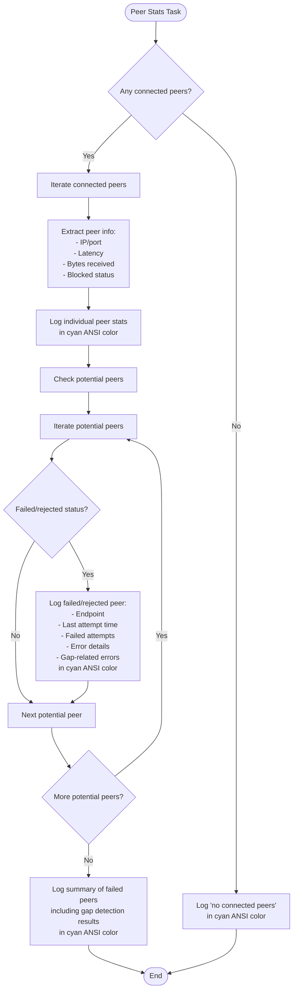
```mermaid
flowchart TD
Start([Peer Stats Task]) --> CheckPeers{"Any connected peers?"}
CheckPeers --> |No| LogNoPeers["Log 'no connected peers'<br/>in cyan ANSI color"]
CheckPeers --> |Yes| IteratePeers["Iterate connected peers"]
IteratePeers --> ExtractInfo["Extract peer info:<br/>- IP/port<br/>- Latency<br/>- Bytes received<br/>- Blocked status"]
ExtractInfo --> LogPeer["Log individual peer stats<br/>in cyan ANSI color"]
LogPeer --> CheckPotential["Check potential peers"]
CheckPotential --> IteratePotential["Iterate potential peers"]
IteratePotential --> CheckStatus{"Failed/rejected status?"}
CheckStatus --> |No| NextPeer["Next potential peer"]
CheckStatus --> |Yes| LogPotential["Log failed/rejected peer:<br/>- Endpoint<br/>- Last attempt time<br/>- Failed attempts<br/>- Error details<br/>- Gap-related errors<br/>in cyan ANSI color"]
LogPotential --> NextPeer
NextPeer --> CheckMore{"More potential peers?"}
CheckMore --> |Yes| IteratePotential
CheckMore --> |No| LogSummary["Log summary of failed peers<br/>including gap detection results<br/>in cyan ANSI color"]
LogSummary --> End([End])
LogNoPeers --> End
```

**Diagram sources**
- [p2p_plugin.cpp:614-650](file://plugins/p2p/p2p_plugin.cpp#L614-L650)

### Graceful Degradation on Peer Failure with Gap Awareness

The plugin implements graceful degradation when peers cannot serve requested items with sophisticated gap detection:

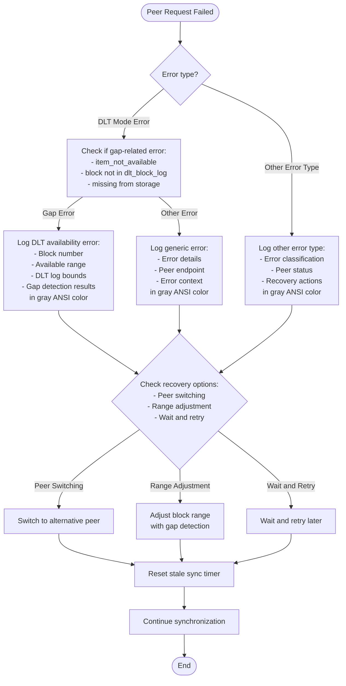
```mermaid
flowchart TD
Start([Peer Request Failed]) --> CheckError{"Error type?"}
CheckError --> |DLT Mode Error| CheckGapError["Check if gap-related error:<br/>- item_not_available<br/>- block not in dlt_block_log<br/>- missing from storage"]
CheckGapError --> |Gap Error| LogDLTError["Log DLT availability error:<br/>- Block number<br/>- Available range<br/>- DLT log bounds<br/>- Gap detection results<br/>in gray ANSI color"]
CheckGapError --> |Other Error| LogGenericError["Log generic error:<br/>- Error details<br/>- Peer endpoint<br/>- Error context<br/>in gray ANSI color"]
CheckError --> |Other Error Type| LogOtherError["Log other error type:<br/>- Error classification<br/>- Peer status<br/>- Recovery actions<br/>in gray ANSI color"]
LogDLTError --> CheckRecovery{"Check recovery options:<br/>- Peer switching<br/>- Range adjustment<br/>- Wait and retry"}
LogGenericError --> CheckRecovery
LogOtherError --> CheckRecovery
CheckRecovery --> |Peer Switching| SwitchPeer["Switch to alternative peer"]
CheckRecovery --> |Range Adjustment| AdjustRange["Adjust block range<br/>with gap detection"]
CheckRecovery --> |Wait and Retry| WaitRetry["Wait and retry later"]
SwitchPeer --> ResetTimer["Reset stale sync timer"]
AdjustRange --> ResetTimer
WaitRetry --> ResetTimer
ResetTimer --> ContinueSync["Continue synchronization"]
ContinueSync --> End([End])
```

**Diagram sources**
- [p2p_plugin.cpp:371-405](file://plugins/p2p/p2p_plugin.cpp#L371-L405)

### Enhanced Stale Sync Detection with Gap Awareness

The stale sync detection has been enhanced with better peer interaction and gap detection:

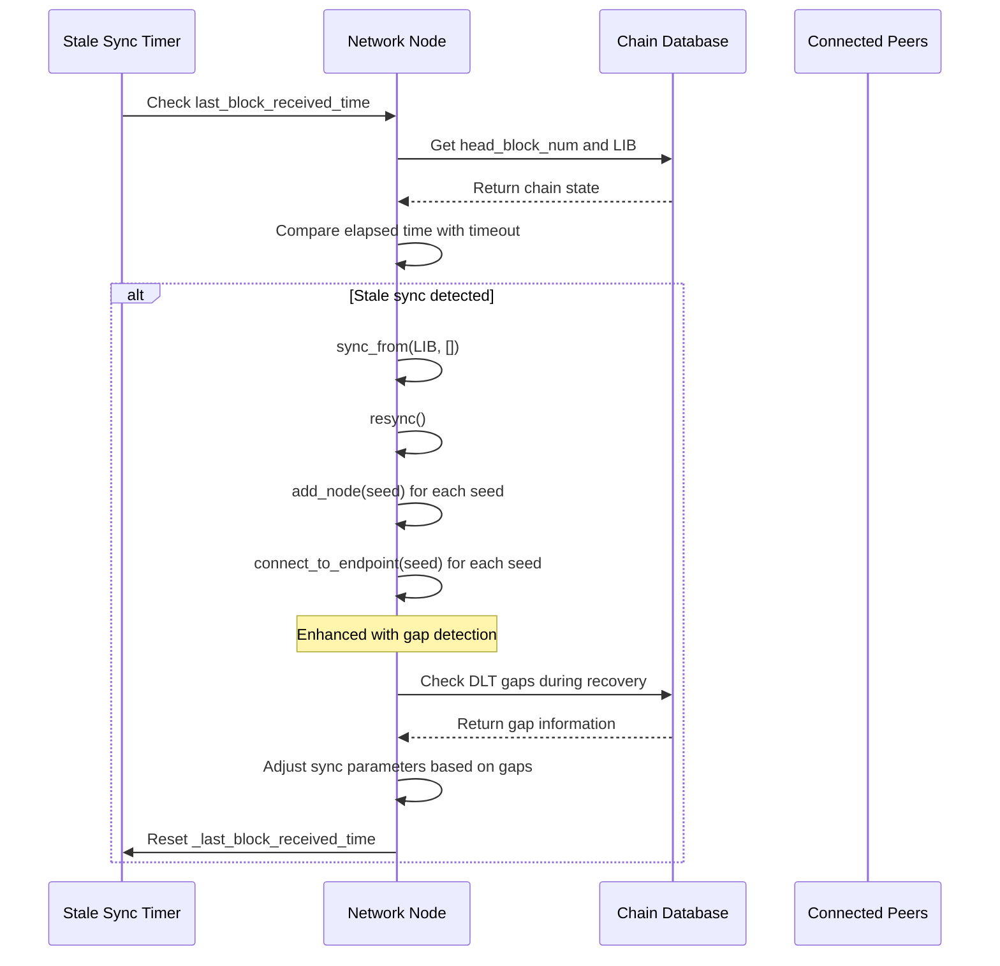
```mermaid
sequenceDiagram
participant Timer as Stale Sync Timer
participant Node as Network Node
participant Chain as Chain Database
participant Peers as Connected Peers
Timer->>Node : Check last_block_received_time
Node->>Chain : Get head_block_num and LIB
Chain-->>Node : Return chain state
Node->>Node : Compare elapsed time with timeout
alt Stale sync detected
Node->>Node : sync_from(LIB, [])
Node->>Node : resync()
Node->>Node : add_node(seed) for each seed
Node->>Node : connect_to_endpoint(seed) for each seed
Note over Node : Enhanced with gap detection
Node->>Chain : Check DLT gaps during recovery
Chain-->>Node : Return gap information
Node->>Node : Adjust sync parameters based on gaps
Node->>Timer : Reset _last_block_received_time
end
```

**Diagram sources**
- [p2p_plugin.cpp:701-765](file://plugins/p2p/p2p_plugin.cpp#L701-L765)

**Section sources**
- [p2p_plugin.cpp:614-650](file://plugins/p2p/p2p_plugin.cpp#L614-L650)
- [p2p_plugin.cpp:371-405](file://plugins/p2p/p2p_plugin.cpp#L371-L405)
- [p2p_plugin.cpp:701-765](file://plugins/p2p/p2p_plugin.cpp#L701-L765)

## Comprehensive Logging Throughout Sync Process

**New** The P2P plugin now includes comprehensive logging throughout the sync process, providing detailed visibility into DLT mode operations, gap detection, and peer interactions with sophisticated gap-aware logging.

### DLT Mode Logging Enhancements with Gap Detection

The plugin provides detailed logging for DLT mode operations with gap detection awareness:

```mermaid
flowchart TD
Start([DLT Mode Operation]) --> LogClamp["Log DLT clamp:<br/>- Old start number<br/>- New start number<br/>- Earliest available<br/>- Head block<br/>- Gap detection results<br/>in gray ANSI color"]
LogClamp --> LogIDs["Log get_block_ids result:<br/>- Number of IDs<br/>- Start block<br/>- Head block<br/>- Earliest available<br/>- Gap information<br/>in gray ANSI color"]
LogIDs --> LogSynopsis["Log get_blockchain_synopsis:<br/>- Entry count<br/>- Low/high blocks<br/>- Head/LIB<br/>- Earliest available<br/>- Gap boundaries<br/>in gray ANSI color"]
LogSynopsis --> LogAvailability["Log DLT availability:<br/>- Block number<br/>- Available range<br/>- DLT log bounds<br/>- Storage boundaries<br/>in gray ANSI color"]
LogAvailability --> LogGap["Log gap detection:<br/>- Gap location<br/>- Gap size<br/>- Available alternatives<br/>- Recovery actions<br/>in gray ANSI color"]
LogGap --> End([End])
```

**Diagram sources**
- [p2p_plugin.cpp:298-302](file://plugins/p2p/p2p_plugin.cpp#L298-L302)
- [p2p_plugin.cpp:355-364](file://plugins/p2p/p2p_plugin.cpp#L355-L364)
- [p2p_plugin.cpp:520-528](file://plugins/p2p/p2p_plugin.cpp#L520-L528)

### Enhanced Block Processing Logs with Gap Awareness

**Updated** The block processing logging has been enhanced with conditional latency reporting and improved visibility:

```mermaid
flowchart TD
Start([Handle Block]) --> LogGap["Log block gap:<br/>- Block number<br/>- Head block<br/>- Gap size<br/>- Gap detection context<br/>in gray ANSI color"]
LogGap --> CheckSyncMode{"Sync mode?"}
CheckSyncMode --> |Yes| LogSync["Log sync block:<br/>- Block number<br/>- Head<br/>- Gap<br/>- Clamping info<br/>in gray ANSI color"]
CheckSyncMode --> |No| LogNormal["Log normal block:<br/>- Block number<br/>- Transactions<br/>- Witness<br/>- Gap context<br/>in gray ANSI color"]
LogSync --> AcceptBlock["Accept block via chain.accept_block()"]
LogNormal --> AcceptBlock
AcceptBlock --> CheckResult{"Result successful?"}
CheckResult --> |No| End([End])
CheckResult --> |Yes| CheckSyncMode2{"Sync mode?"}
CheckSyncMode2 --> |Yes| End
CheckSyncMode2 --> |No| LogLatency["Log latency:<br/>- Transaction count<br/>- Block number<br/>- Witness<br/>- Latency in milliseconds<br/>in white ANSI color"]
LogLatency --> End([End])
```

**Diagram sources**
- [p2p_plugin.cpp:151-208](file://plugins/p2p/p2p_plugin.cpp#L151-L208)

### Peer Interaction Logging with Gap Detection

The plugin provides comprehensive peer interaction logging with gap detection awareness:

```mermaid
flowchart TD
Start([Peer Interaction]) --> LogPeerStats["Log peer stats:<br/>- IP/port<br/>- Latency<br/>- Bytes received<br/>- Blocked status<br/>- Reason<br/>- Gap-related interactions<br/>in cyan ANSI color"]
LogPeerStats --> LogPotential["Log potential peers:<br/>- Endpoint<br/>- Status<br/>- Last attempt<br/>- Failed attempts<br/>- Error<br/>- Gap detection results<br/>in cyan ANSI color"]
LogPotential --> LogFailed["Log failed peers:<br/>- Count<br/>- Total peers<br/>- Status distribution<br/>- Gap-related failures<br/>in cyan ANSI color"]
LogFailed --> LogRecovery["Log recovery actions:<br/>- Peer switching<br/>- Range adjustments<br/>- Gap handling<br/>- Success rates<br/>in gray ANSI color"]
LogRecovery --> End([End])
```

**Diagram sources**
- [p2p_plugin.cpp:614-650](file://plugins/p2p/p2p_plugin.cpp#L614-L650)

### Block Storage Diagnostics with Gap Detection

**New** The plugin provides comprehensive block storage diagnostics with gap detection and coverage monitoring:

```mermaid
flowchart TD
Start([Storage Diagnostics]) --> LogStorage["Log block storage:<br/>- Head block<br/>- LIB<br/>- Earliest available<br/>- DLT log range<br/>- Block log end<br/>- Fork DB stats<br/>- DLT mode status<br/>- DLT resize count<br/>in cyan ANSI color"]
LogStorage --> CheckGap["Check for DLT coverage gap:<br/>- DLT end vs Fork DB start<br/>- Gap detection<br/>- Availability impact<br/>in orange ANSI color"]
CheckGap --> LogGapWarning["Log DLT coverage gap:<br/>- Gap start/end<br/>- Blocks unavailable<br/>- Impact on serving<br/>in orange ANSI color"]
LogGapWarning --> End([End])
```

**Diagram sources**
- [p2p_plugin.cpp:722-771](file://plugins/p2p/p2p_plugin.cpp#L722-L771)

### DLT Integrity Verification with Continuity Scanning

**New** The plugin implements comprehensive DLT integrity verification with periodic continuity scanning:

```mermaid
flowchart TD
Start([DLT Integrity Scan]) --> CheckDLTMode{"DLT Mode Active?"}
CheckDLTMode --> |No| End([End])
CheckDLTMode --> |Yes| VerifyMapping["Call verify_mapping()<br/>- Detect stale mapping<br/>- Heal if needed<br/>in gray ANSI color"]
VerifyMapping --> CheckContinuity["Call verify_continuity()<br/>- Walk all blocks<br/>- Report gaps<br/>- Log missing blocks<br/>in gray ANSI color"]
CheckContinuity --> CheckGaps{"Any gaps found?"}
CheckGaps --> |No| End
CheckGaps --> |Yes| LogGaps["Log DLT integrity warning:<br/>- Gap count<br/>- Missing blocks<br/>- Gap locations<br/>in orange ANSI color"]
LogGaps --> End
```

**Diagram sources**
- [p2p_plugin.cpp:773-795](file://plugins/p2p/p2p_plugin.cpp#L773-L795)

**Section sources**
- [p2p_plugin.cpp:298-302](file://plugins/p2p/p2p_plugin.cpp#L298-L302)
- [p2p_plugin.cpp:355-364](file://plugins/p2p/p2p_plugin.cpp#L355-L364)
- [p2p_plugin.cpp:520-528](file://plugins/p2p/p2p_plugin.cpp#L520-L528)
- [p2p_plugin.cpp:151-208](file://plugins/p2p/p2p_plugin.cpp#L151-L208)
- [p2p_plugin.cpp:614-650](file://plugins/p2p/p2p_plugin.cpp#L614-L650)
- [p2p_plugin.cpp:722-771](file://plugins/p2p/p2p_plugin.cpp#L722-L771)
- [p2p_plugin.cpp:773-795](file://plugins/p2p/p2p_plugin.cpp#L773-L795)

## ANSI Color Code Implementation

**New** The P2P plugin now includes comprehensive ANSI color code implementation for enhanced console readability and visual distinction between different types of log messages.

### ANSI Color Code Definitions

The plugin defines ANSI color codes for consistent color usage throughout the logging system:

```mermaid
flowchart TD
ColorCodes["ANSI Color Code Definitions"] --> Gray["CLOG_GRAY<br/>\\033[90m<br/>Gray color for DLT mode debug messages"]
ColorCodes --> Cyan["CLOG_CYAN<br/>\\033[96m<br/>Cyan color for peer statistics and informational messages"]
ColorCodes --> White["CLOG_WHITE<br/>\\033[97m<br/>White color for important transaction notifications and latency information"]
ColorCodes --> Reset["CLOG_RESET<br/>\\033[0m<br/>Reset color to default"]
ColorCodes --> Orange["CLOG_ORANGE<br/>\\033[33m<br/>Orange color for network-related warnings and peer connection status"]
ColorCodes --> Red["CLOG_RED<br/>\\033[91m<br/>Red color for critical errors and severe warnings"]
Gray --> DLTLogging["DLT Mode Debug Logging<br/>in gray color"]
Cyan --> PeerStats["Peer Statistics Logging<br/>in cyan color"]
White --> TransactionLogs["Transaction Notifications and Latency<br/>in white color"]
Orange --> NetworkWarnings["Network Warnings and Peer Status<br/>in orange color"]
Red --> CriticalErrors["Critical Errors<br/>in red color"]
```

**Diagram sources**
- [p2p_plugin.cpp:16-21](file://plugins/p2p/p2p_plugin.cpp#L16-L21)
- [node.cpp:79-83](file://libraries/network/node.cpp#L79-L83)

### Color Code Usage Patterns

The ANSI color codes are applied consistently across different logging scenarios:

1. **DLT Mode Debug Messages**: Gray color for detailed DLT mode operations, gap detection, and block range management
2. **Peer Statistics**: Cyan color for peer connection statistics, connection status, and peer database information
3. **Transaction Notifications**: White color for important transaction-related information and block processing notifications
4. **Network Warnings**: Orange color for peer connection warnings, network issues, and peer status changes
5. **Critical Errors**: Red color for severe errors, critical failures, and system emergencies
6. **Error and Warning Messages**: Default color scheme for error conditions and warnings (unchanged)

### Implementation Examples

The color codes are integrated throughout the plugin implementation:

```mermaid
sequenceDiagram
participant Logger as Logger
participant P2P as P2P Plugin
participant Console as Console Output
Logger->>P2P : Log message with color code
P2P->>Console : Output colored text<br/>CLOG_GRAY + message + CLOG_RESET
Console-->>P2P : Colored output displayed
Note over P2P,Console : Consistent color coding<br/>throughout all logging operations
```

**Diagram sources**
- [p2p_plugin.cpp:169-171](file://plugins/p2p/p2p_plugin.cpp#L169-L171)
- [p2p_plugin.cpp:299-301](file://plugins/p2p/p2p_plugin.cpp#L299-L301)
- [p2p_plugin.cpp:522-528](file://plugins/p2p/p2p_plugin.cpp#L522-L528)

**Section sources**
- [p2p_plugin.cpp:16-21](file://plugins/p2p/p2p_plugin.cpp#L16-L21)
- [p2p_plugin.cpp:169-171](file://plugins/p2p/p2p_plugin.cpp#L169-L171)
- [p2p_plugin.cpp:299-301](file://plugins/p2p/p2p_plugin.cpp#L299-L301)
- [p2p_plugin.cpp:522-528](file://plugins/p2p/p2p_plugin.cpp#L522-L528)
- [node.cpp:79-83](file://libraries/network/node.cpp#L79-L83)

## Enhanced DLT Mode Debug Logging

**New** The P2P plugin now includes enhanced DLT (Data Ledger Technology) mode debug logging with comprehensive gap detection and block range management information displayed in gray ANSI color for improved troubleshooting capabilities.

### Comprehensive DLT Mode Logging

The enhanced DLT mode logging provides detailed information about block availability, gap detection, and synchronization operations:

```mermaid
flowchart TD
DLTLogging["DLT Mode Debug Logging"] --> ClampStart["Clamp Start Logging<br/>- Original start number<br/>- New clamped start<br/>- Earliest available block<br/>- Head block information<br/>in gray ANSI color"]
DLTLogging --> GapDetection["Gap Detection Logging<br/>- Gap location identification<br/>- Gap size calculation<br/>- Storage boundary detection<br/>- Fork database gap analysis<br/>in gray ANSI color"]
DLTLogging --> BlockRange["Block Range Logging<br/>- Number of blocks returned<br/>- Start and end block numbers<br/>- Effective head block<br/>- Earliest available block<br/>- DLT log end position<br/>in gray ANSI color"]
DLTLogging --> Availability["Availability Logging<br/>- Block number being served<br/>- Available block range<br/>- DLT log bounds<br/>- Storage boundaries<br/>in gray ANSI color"]
ClampStart --> DLTLogging
GapDetection --> DLTLogging
BlockRange --> DLTLogging
Availability --> DLTLogging
```

**Diagram sources**
- [p2p_plugin.cpp:299-301](file://plugins/p2p/p2p_plugin.cpp#L299-L301)
- [p2p_plugin.cpp:321-327](file://plugins/p2p/p2p_plugin.cpp#L321-L327)
- [p2p_plugin.cpp:336-338](file://plugins/p2p/p2p_plugin.cpp#L336-L338)
- [p2p_plugin.cpp:357-364](file://plugins/p2p/p2p_plugin.cpp#L357-L364)

### DLT Mode Operation Logging

The plugin provides comprehensive logging for all DLT mode operations:

1. **get_block_ids() Operations**: Detailed logging of block ID generation with gap detection and clamping information
2. **get_blockchain_synopsis() Operations**: Logging of blockchain synopsis generation with DLT availability context
3. **get_item() Operations**: Logging of item serving operations with DLT mode error handling
4. **Gap Detection Operations**: Comprehensive logging of gap detection and recovery mechanisms

### Logging Context Information

Each DLT mode log entry includes comprehensive context information:

- **Block Numbers**: Current block, head block, earliest available block, and DLT log boundaries
- **Storage Information**: DLT log start and end positions, block log boundaries
- **Gap Information**: Gap locations, sizes, and detection results
- **Synchronization Context**: Effective head block, remaining item counts, and synchronization status

**Section sources**
- [p2p_plugin.cpp:299-301](file://plugins/p2p/p2p_plugin.cpp#L299-L301)
- [p2p_plugin.cpp:321-327](file://plugins/p2p/p2p_plugin.cpp#L321-L327)
- [p2p_plugin.cpp:336-338](file://plugins/p2p/p2p_plugin.cpp#L336-L338)
- [p2p_plugin.cpp:357-364](file://plugins/p2p/p2p_plugin.cpp#L357-L364)
- [p2p_plugin.cpp:522-528](file://plugins/p2p/p2p_plugin.cpp#L522-L528)

## Improved Console Readability

**New** The P2P plugin now provides significantly improved console readability through the strategic use of ANSI color codes, allowing operators to quickly distinguish between different types of log messages and troubleshoot network operations more effectively.

### Visual Distinction Between Log Types

The color-coded logging system provides clear visual distinction between different categories of log messages:

```mermaid
graph TB
subgraph "Console Readability Enhancement"
GrayLogs["Gray Logs<br/>DLT Mode Debug<br/>Gap Detection<br/>Block Range Info"]
CyanLogs["Cyan Logs<br/>Peer Statistics<br/>Connection Status<br/>Peer Database Info"]
WhiteLogs["White Logs<br/>Transaction Notifications<br/>Block Processing<br/>Latency Information"]
OrangeLogs["Orange Logs<br/>Network Warnings<br/>Peer Status<br/>Connection Issues"]
RedLogs["Red Logs<br/>Critical Errors<br/>Severe Warnings<br/>System Failures"]
DefaultLogs["Default Color<br/>General Information<br/>Debug Messages<br/>Non-Critical Events"]
end
subgraph "Visual Benefits"
Benefit1["Quick Pattern Recognition"]
Benefit2["Faster Troubleshooting"]
Benefit3["Reduced Console Scrolling"]
Benefit4["Enhanced Multi-Tasking"]
end
GrayLogs --> Benefit1
CyanLogs --> Benefit1
WhiteLogs --> Benefit1
OrangeLogs --> Benefit1
RedLogs --> Benefit1
DefaultLogs --> Benefit1
```

**Diagram sources**
- [p2p_plugin.cpp:16-21](file://plugins/p2p/p2p_plugin.cpp#L16-L21)
- [node.cpp:79-83](file://libraries/network/node.cpp#L79-L83)

### Operator Experience Improvements

The enhanced console readability provides several operational benefits:

1. **Quick Pattern Recognition**: Operators can instantly identify DLT mode operations (gray), peer statistics (cyan), transaction notifications (white), network warnings (orange), and critical errors (red)
2. **Faster Troubleshooting**: Color coding helps operators quickly locate relevant log entries during debugging sessions
3. **Reduced Console Scrolling**: Visual distinction makes it easier to scan through large amounts of log output
4. **Enhanced Multi-Tasking**: Operators can monitor multiple log streams simultaneously with color-based differentiation

### Color Coding Strategy

The color coding strategy is designed for optimal operator experience:

- **Gray**: DLT mode debug information, gap detection details, and block range management
- **Cyan**: Peer statistics, connection status, and peer database information
- **White**: Important transaction notifications, block processing information, and latency details
- **Orange**: Network warnings, peer status changes, and connection issues
- **Red**: Critical errors, severe warnings, and system failures
- **Default**: General information, debug messages, and non-critical events (unchanged)

**Section sources**
- [p2p_plugin.cpp:16-21](file://plugins/p2p/p2p_plugin.cpp#L16-L21)
- [p2p_plugin.cpp:169-171](file://plugins/p2p/p2p_plugin.cpp#L169-L171)
- [p2p_plugin.cpp:299-301](file://plugins/p2p/p2p_plugin.cpp#L299-L301)
- [p2p_plugin.cpp:522-528](file://plugins/p2p/p2p_plugin.cpp#L522-L528)
- [node.cpp:79-83](file://libraries/network/node.cpp#L79-L83)

## Conditional Block Processing Latency Logging

**New** The P2P plugin now implements conditional block processing latency logging that only executes when blocks are successfully processed in non-sync mode, significantly reducing log volume while maintaining operational visibility.

### Conditional Latency Logging Implementation

The enhanced block processing includes sophisticated conditional logging logic:

```mermaid
flowchart TD
Start([Block Processing]) --> AcceptBlock["chain.accept_block()"]
AcceptBlock --> CheckResult{"Result successful?"}
CheckResult --> |No| End([End - No Latency Logging])
CheckResult --> |Yes| CheckSyncMode{"Sync mode?"}
CheckSyncMode --> |Yes| End([End - No Latency Logging])
CheckSyncMode --> |No| CalculateLatency["Calculate latency:<br/>fc::time_point::now() - blk_msg.block.timestamp"]
CalculateLatency --> LogLatency["Log latency:<br/>- Transaction count<br/>- Block number<br/>- Witness<br/>- Latency in milliseconds<br/>in white ANSI color"]
LogLatency --> End([End - Latency Logged])
```

**Diagram sources**
- [p2p_plugin.cpp:159-175](file://plugins/p2p/p2p_plugin.cpp#L159-L175)

### Benefits of Conditional Latency Logging

The conditional approach provides several operational advantages:

1. **Reduced Log Volume**: Latency information is only logged for successful block processing, significantly reducing log output during sync operations
2. **Maintained Visibility**: Critical latency information for successful normal operations is preserved for troubleshooting and performance monitoring
3. **Performance Impact**: Minimizes CPU overhead during high-volume sync operations while preserving diagnostic information
4. **Resource Efficiency**: Reduces I/O overhead and memory usage associated with excessive logging
5. **Operational Focus**: Ensures logs focus on meaningful operational events rather than routine sync activities

### Implementation Details

The conditional latency logging is implemented in the block processing method:

```cpp
bool result = chain.accept_block(blk_msg.block, sync_mode, ...);

if (!sync_mode && result) {
    fc::microseconds latency = fc::time_point::now() - blk_msg.block.timestamp;
    ilog(CLOG_WHITE "Got ${t} transactions on block ${b} by ${w} -- latency: ${l} ms" CLOG_RESET,
         ("t", blk_msg.block.transactions.size())("b", blk_msg.block.block_num())("w", blk_msg.block.witness)("l", latency.count() / 1000));
}
```

**Section sources**
- [p2p_plugin.cpp:159-175](file://plugins/p2p/p2p_plugin.cpp#L159-L175)

## Graceful Degradation Capabilities

**New** The P2P plugin now includes comprehensive graceful degradation capabilities when peers cannot serve requested items, ensuring network resilience and continued operation with sophisticated gap detection and automatic recovery.

### DLT Mode Graceful Degradation with Gap Detection

When peers cannot serve DLT-mode blocks, the plugin implements graceful degradation with comprehensive gap detection:

```mermaid
flowchart TD
Start([DLT Block Request]) --> CheckAvailability["Check block availability:<br/>- Block number<br/>- Earliest available<br/>- DLT log range<br/>- Gap detection"]
CheckAvailability --> |Available| ServeBlock["Serve block normally"]
CheckAvailability --> |Not Available| CheckGap["Check if gap-related:<br/>- Below earliest<br/>- Beyond storage<br/>- Fork_db gap"]
CheckGap --> |Gap Error| LogUnavailable["Log gap-related unavailability:<br/>- Block number<br/>- Available range<br/>- DLT bounds<br/>- Gap location<br/>in gray ANSI color"]
CheckGap --> |Other Error| LogGenericUnavailable["Log generic unavailability:<br/>- Error details<br/>- Peer endpoint<br/>- Context<br/>in gray ANSI color"]
LogUnavailable --> CheckRecovery["Check recovery options:<br/>- Peer switching<br/>- Range adjustment<br/>- Wait and retry"]
LogGenericUnavailable --> CheckRecovery
CheckRecovery --> |Peer Switching| SwitchPeer["Switch to alternative peer"]
CheckRecovery --> |Range Adjustment| AdjustRange["Adjust block range<br/>with gap detection"]
CheckRecovery --> |Wait and Retry| WaitRetry["Wait and retry later"]
SwitchPeer --> LogRecovery["Log recovery actions:<br/>- Peer switched<br/>- Reason<br/>- Success<br/>in gray ANSI color"]
AdjustRange --> LogRecovery
WaitRetry --> LogRecovery
LogRecovery --> ContinueSync["Continue sync with available peers"]
ContinueSync --> End([End])
ServeBlock --> End
```

**Diagram sources**
- [p2p_plugin.cpp:371-405](file://plugins/p2p/p2p_plugin.cpp#L371-L405)

### Error Handling and Recovery with Gap Awareness

The plugin implements comprehensive error handling and recovery mechanisms with gap detection:

```mermaid
flowchart TD
Start([Error Occurred]) --> ClassifyError["Classify error:<br/>- block_too_old_exception<br/>- deferred_resize_exception<br/>- unlinkable_block_exception<br/>- network exceptions<br/>- gap-related errors"]
ClassifyError --> HandleBlockTooOld["Handle block too old:<br/>- Log warning<br/>- Convert to network exception<br/>- Soft-ban peer"]
ClassifyError --> HandleDeferredResize["Handle deferred resize:<br/>- Log info<br/>- Convert to network exception<br/>- No peer penalty"]
ClassifyError --> HandleUnlinkable["Handle unlinkable block:<br/>- Log warning<br/>- Convert to network exception<br/>- Peer soft-ban or resync"]
ClassifyError --> HandleGapError["Handle gap error:<br/>- Log gap detection<br/>- Adjust sync parameters<br/>- Peer switching<br/>in gray ANSI color"]
HandleBlockTooOld --> ContinueSync["Continue synchronization"]
HandleDeferredResize --> ContinueSync
HandleUnlinkable --> ContinueSync
HandleGapError --> CheckRecovery["Check recovery:<br/>- Peer switching<br/>- Range adjustment<br/>- Wait and retry"]
CheckRecovery --> ContinueSync
ContinueSync --> End([End])
```

**Diagram sources**
- [p2p_plugin.cpp:173-204](file://plugins/p2p/p2p_plugin.cpp#L173-L204)

### Peer Soft-Ban Management with Gap Detection

**New** The plugin manages peer soft-bans based on error severity with gap detection awareness and improved peer interaction:

```mermaid
flowchart TD
Start([Peer Action]) --> CheckAction{"Action type?"}
CheckAction --> |Successful| DecreasePenalty["Decrease peer penalty"]
CheckAction --> |Minor Error| MaintainPenalty["Maintain current penalty"]
CheckAction --> |Major Error| IncreasePenalty["Increase penalty:<br/>- Hard fork error<br/>- Gap-related error<br/>- Invalid block<br/>- Sync spam detection<br/>in gray ANSI color"]
CheckAction --> |Peer Disconnect| ResetPenalty["Reset penalty:<br/>- Peer disconnected<br/>- Handshake failed<br/>- Rejected"]
IncreasePenalty --> CheckThreshold{"Penalty threshold exceeded?"}
CheckThreshold --> |No| Continue["Continue with current peer"]
CheckThreshold --> |Yes| CheckTrusted["Check if trusted peer:<br/>- Trusted snapshot peer<br/>- Reduced soft-ban duration"]
CheckTrusted --> |Trusted| ApplyReducedBan["Apply reduced soft-ban:<br/>- 5 min instead of 1 hour<br/>- For trusted peers only<br/>in orange ANSI color"]
CheckTrusted --> |Not Trusted| RemovePeer["Remove peer:<br/>- Add to banned list<br/>- Clear from potential peers<br/>- Log removal<br/>- Gap detection context<br/>in gray ANSI color"]
ApplyReducedBan --> FindAlternative["Find alternative peer:<br/>- Check potential peers<br/>- Consider gap compatibility<br/>- Attempt reconnection<br/>in gray ANSI color"]
RemovePeer --> FindAlternative
FindAlternative --> Continue
DecreasePenalty --> Continue
MaintainPenalty --> Continue
ResetPenalty --> Continue
Continue --> End([End])
```

**Diagram sources**
- [p2p_plugin.cpp:614-650](file://plugins/p2p/p2p_plugin.cpp#L614-L650)

**Section sources**
- [p2p_plugin.cpp:371-405](file://plugins/p2p/p2p_plugin.cpp#L371-L405)
- [p2p_plugin.cpp:173-204](file://plugins/p2p/p2p_plugin.cpp#L173-L204)
- [p2p_plugin.cpp:614-650](file://plugins/p2p/p2p_plugin.cpp#L614-L650)

## Minority Fork Recovery

**Updated** The minority fork recovery mechanism has been enhanced with improved peer interaction handling, comprehensive logging, and sophisticated gap detection throughout the recovery process.

### Enhanced resync_from_lib() Method with Gap Detection

The `resync_from_lib()` method now includes comprehensive logging, improved peer interaction, and gap detection:

```mermaid
flowchart TD
Start([Minority Fork Detected]) --> CheckState{"Check LIB vs Head:<br/>- LIB == 0?<br/>- Head <= LIB?"}
CheckState --> |LIB == 0 or Head <= LIB| NoAction["No recovery needed:<br/>- Already at/after LIB<br/>- Log info message<br/>in gray ANSI color"]
CheckState --> |Head > LIB| PopBlocks["Pop reversible blocks:<br/>- While head > LIB<br/>- db.pop_block()<br/>- Clear pending<br/>- Reset fork_db<br/>- Log gap detection context<br/>in gray ANSI color"]
PopBlocks --> RebuildForkDB["Re-seed fork DB:<br/>- Fetch LIB block<br/>- start_block(LIB_block)<br/>- Log recovery step<br/>- Check gap boundaries<br/>in gray ANSI color"]
RebuildForkDB --> TriggerSync["Trigger P2P sync:<br/>- sync_from(LIB_block_id)<br/>- resync()<br/>- Log sync initiation<br/>- Include gap detection info<br/>in gray ANSI color"]
TriggerSync --> ReconnectPeers["Reconnect to seed peers:<br/>- add_node(seed)<br/>- connect_to_endpoint(seed)<br/>- Log peer switching<br/>- Consider gap compatibility<br/>in gray ANSI color"]
ReconnectPeers --> ResetTimer["Reset stale sync timer:<br/>- _last_block_received_time = now<br/>- Log timer reset<br/>- Gap detection monitoring<br/>in gray ANSI color"]
ResetTimer --> Complete([Recovery Complete])
NoAction --> Complete
```

**Diagram sources**
- [p2p_plugin.cpp:992-1061](file://plugins/p2p/p2p_plugin.cpp#L992-L1061)

### Enhanced Recovery Process Implementation with Gap Awareness

The minority fork recovery process now includes several critical enhancements with gap detection:

1. **State Analysis**: Improved comparison logic with comprehensive logging including gap detection context
2. **Block Popping**: Enhanced loop with proper error handling, logging, and gap boundary awareness
3. **Fork Database Reset**: Better error handling, state validation, and gap boundary detection
4. **Network Resynchronization**: Improved sync triggering with logging and gap-aware parameters
5. **Peer Reconnection**: Enhanced peer management with error handling and gap compatibility checking
6. **Timer Reset**: Proper timing management to prevent immediate re-trigger with gap monitoring

### Integration with Witness Plugin and Gap Detection

The minority fork recovery is triggered automatically by the witness plugin with enhanced logging and gap detection:

```mermaid
sequenceDiagram
participant Witness as Witness Plugin
participant P2P as P2P Plugin
participant Chain as Chain Database
participant Network as Network Layer
Witness->>Chain : Check recent blocks
Chain-->>Witness : Block validation results
Witness->>Witness : Analyze fork scenario<br/>with gap detection
alt Minority fork detected
Witness->>P2P : resync_from_lib()
Note over P2P : Enhanced logging with gap context<br/>in gray ANSI color
P2P->>Chain : Pop blocks to LIB<br/>with gap boundary awareness
P2P->>Chain : Reset fork database<br/>including gap detection
P2P->>Network : Trigger sync from LIB<br/>with gap-aware parameters
P2P->>Network : Reconnect to peers<br/>considering gap compatibility
Note over P2P : Comprehensive recovery logging<br/>with gap detection results<br/>in gray ANSI color
end
```

**Diagram sources**
- [witness.cpp:540-552](file://plugins/witness/witness.cpp#L540-L552)
- [p2p_plugin.cpp:992-1061](file://plugins/p2p/p2p_plugin.cpp#L992-L1061)

**Section sources**
- [p2p_plugin.cpp:992-1061](file://plugins/p2p/p2p_plugin.cpp#L992-L1061)
- [witness.cpp:540-552](file://plugins/witness/witness.cpp#L540-L552)

## Enhanced Block Validation

**Updated** The block validation process has been enhanced with operation guard protection to ensure concurrent access safety during critical validation operations with improved gap detection awareness.

### Operation Guard Integration

The enhanced block validation incorporates operation guards to prevent race conditions and ensure thread-safe access to shared blockchain state:

```mermaid
flowchart TD
BlockReceived([Block Received]) --> ExtractWitness["Extract witness information"]
ExtractWitness --> AcquireGuard["Acquire operation guard"]
AcquireGuard --> VerifyWitness["Verify witness exists"]
VerifyWitness --> VerifySignature["Verify signature matches witness key"]
VerifySignature --> ReleaseGuard["Release operation guard"]
ReleaseGuard --> ApplyValidation["Apply block post-validation"]
ApplyValidation --> BroadcastBlock["Broadcast block to peers"]
```

**Diagram sources**
- [p2p_plugin.cpp:216-245](file://plugins/p2p/p2p_plugin.cpp#L216-L245)

### Concurrent Access Protection with Gap Detection

The operation guard system provides several layers of protection with gap detection awareness:

1. **Resize Barrier Participation**: Operation guards participate in the shared memory resize barrier
2. **Lock Acquisition**: Automatically waits for resize operations to complete
3. **Thread Safety**: Prevents concurrent access conflicts during witness key validation
4. **Resource Management**: Ensures proper cleanup and release of resources
5. **Gap Detection Integration**: Operation guards work with gap detection mechanisms

### Database Integration

The enhanced validation leverages the chainbase database's operation guard functionality:

```mermaid
classDiagram
class operation_guard {
+operation_guard(database& db)
+~operation_guard()
+release()
- database& _db
- bool _active
}
class database {
+make_operation_guard() operation_guard
+enter_operation()
+exit_operation()
}
operation_guard --> database : "guards access to"
```

**Diagram sources**
- [chainbase.hpp:1078-1115](file://thirdparty/chainbase/include/chainbase/chainbase.hpp#L1078-L1115)

**Section sources**
- [p2p_plugin.cpp:216-245](file://plugins/p2p/p2p_plugin.cpp#L216-L245)
- [chainbase.hpp:1078-1115](file://thirdparty/chainbase/include/chainbase/chainbase.hpp#L1078-L1115)

## Concurrent Access Safety

**New** The P2P plugin now includes comprehensive concurrent access safety mechanisms to prevent data corruption and ensure thread-safe operations during high-load conditions with gap detection integration.

### Operation Guard Implementation

The operation guard system provides automatic protection against concurrent access conflicts:

```mermaid
flowchart TD
Start([Operation Begins]) --> EnterOperation["Enter operation barrier"]
EnterOperation --> AcquireLock["Acquire database lock"]
AcquireLock --> PerformOperation["Perform database operation"]
PerformOperation --> ReleaseLock["Release database lock"]
ReleaseLock --> ExitOperation["Exit operation barrier"]
ExitOperation --> End([Operation Complete])
```

**Diagram sources**
- [chainbase.hpp:1130-1137](file://thirdparty/chainbase/include/chainbase/chainbase.hpp#L1130-L1137)

### Thread Safety Enhancements with Gap Detection

The concurrent access safety includes several key features with gap detection integration:

1. **Automatic Lock Management**: Operation guards automatically manage database locks
2. **Resize Barrier Integration**: Participates in shared memory resize barriers
3. **Timeout Handling**: Implements timeout mechanisms for lock acquisition
4. **Resource Cleanup**: Ensures proper cleanup of resources on completion
5. **Gap Detection Integration**: Operation guards work seamlessly with gap detection mechanisms

### Error Handling Improvements

Enhanced error handling protects against various failure scenarios with gap detection:

1. **Concurrent Resize Exceptions**: Proper handling of shared memory resize operations
2. **Deadlock Prevention**: Timeout mechanisms prevent indefinite blocking
3. **Graceful Degradation**: Fallback mechanisms for critical operations
4. **Diagnostic Information**: Comprehensive logging for debugging concurrent issues
5. **Gap Detection Logging**: Enhanced logging for concurrent gap detection scenarios

**Section sources**
- [chainbase.hpp:1130-1137](file://thirdparty/chainbase/include/chainbase/chainbase.hpp#L1130-L1137)
- [p2p_plugin.cpp:173-208](file://plugins/p2p/p2p_plugin.cpp#L173-L208)

## Logging Level Consistency

**Updated** The P2P plugin has implemented improved logging level consistency to reduce verbosity during normal operation while maintaining appropriate log levels for different operational contexts with enhanced gap detection logging.

### Sync Mode Logging Improvements

**Updated** The plugin has undergone significant improvements in logging level management, particularly for synchronization operations with gap detection awareness:

- **Sync Mode Downgrade**: Sync mode block processing logs were downgraded from info level to debug level
- **Normal Mode Preservation**: Normal block processing continues to use info level logging for visibility
- **Reduced Verbosity**: This change significantly reduces log volume during routine blockchain synchronization
- **Contextual Appropriateness**: Debug level logging is more appropriate for frequent sync operations while preserving info level for exceptional events
- **Gap Detection Logging**: Enhanced gap detection logs use appropriate levels for troubleshooting

### Conditional Latency Logging Implementation

**New** The conditional latency logging ensures that latency information is only displayed for successful block processing in non-sync mode:

```cpp
if (!sync_mode && result) {
    fc::microseconds latency = fc::time_point::now() - blk_msg.block.timestamp;
    ilog(CLOG_WHITE "Got ${t} transactions on block ${b} by ${w} -- latency: ${l} ms" CLOG_RESET,
         ("t", blk_msg.block.transactions.size())("b", blk_msg.block.block_num())("w", blk_msg.block.witness)("l", latency.count() / 1000));
}
```

**Key Benefits:**
- **Reduced Log Volume**: Sync operations (which occur frequently during blockchain synchronization) now use debug level logging
- **Maintained Visibility**: Normal operations continue to use info level logging for operational visibility
- **Consistent Behavior**: Both sync and normal modes now consistently use debug level logging, improving overall logging consistency
- **Performance Impact**: Lower logging overhead during normal operation while preserving diagnostic information
- **Gap Detection Visibility**: Gap detection logs provide appropriate visibility for troubleshooting

### Network Layer Integration

The network layer maintains mixed logging levels for different operational contexts with gap detection awareness:

- **Info Level**: Used for significant operational events and peer management actions
- **Debug Level**: Used for routine synchronization and connection maintenance
- **Warning/Error Levels**: Used for error conditions and exceptional circumstances
- **Gap Detection Levels**: Specialized logging for gap-related operations and recovery

**Section sources**
- [p2p_plugin.cpp:151-156](file://plugins/p2p/p2p_plugin.cpp#L151-L156)
- [p2p_plugin.cpp:168-172](file://plugins/p2p/p2p_plugin.cpp#L168-L172)

## Dependency Analysis

The P2P plugin has well-defined dependencies that enable modularity and maintainability with enhanced gap detection integration:

```mermaid
graph TB
subgraph "Plugin Dependencies"
P2P[p2p_plugin]
Chain[chain::plugin]
AppBase[appbase]
Snapshot[snapshot_plugin]
Witness[witness_plugin]
end
subgraph "Network Dependencies"
Node[node.hpp]
PeerConn[peer_connection.hpp]
Messages[core_messages.hpp]
PeerDB[peer_database.hpp]
Config[config.hpp]
end
subgraph "Protocol Dependencies"
Block[block.hpp]
Transaction[transaction.hpp]
Types[types.hpp]
end
subgraph "Database Dependencies"
Database[database.hpp]
Chainbase[chainbase.hpp]
OperationGuard[operation_guard]
DLTLog[dlt_block_log]
end
P2P --> Chain
P2P --> Node
P2P --> AppBase
P2P --> Snapshot
P2P --> Witness
Node --> PeerConn
Node --> Messages
Node --> PeerDB
Node --> Config
Messages --> Block
Messages --> Transaction
Messages --> Types
Chain --> Database
Chain --> Chainbase
Chain --> OperationGuard
Chain --> DLTLog
Database --> OperationGuard
Database --> DLTLog
```

**Diagram sources**
- [CMakeLists.txt:27-34](file://plugins/p2p/CMakeLists.txt#L27-L34)
- [p2p_plugin.cpp:1-13](file://plugins/p2p/p2p_plugin.cpp#L1-L13)

Key dependency relationships:

1. **Chain Integration**: Direct dependency on the chain plugin for blockchain state access with gap detection
2. **Network Foundation**: Relies on the network library for peer communication with gap-aware protocols
3. **Application Framework**: Uses appbase for plugin lifecycle management
4. **Snapshot Coordination**: Integrates with snapshot plugin for trusted peer management with gap detection
5. **Witness Integration**: Works closely with witness plugin for fork detection and gap monitoring
6. **Database Protection**: Leverages chainbase operation guards for concurrent access safety with gap detection
7. **DLT Mode Support**: Integrates with dlt_block_log for snapshot-based block serving with sophisticated gap detection
8. **Gap Detection**: Enhanced integration with gap detection mechanisms throughout the plugin stack

**Section sources**
- [CMakeLists.txt:27-34](file://plugins/p2p/CMakeLists.txt#L27-L34)
- [p2p_plugin.cpp:1-13](file://plugins/p2p/p2p_plugin.cpp#L1-L13)

## Performance Considerations

The P2P plugin implements several performance optimization strategies with enhanced gap detection efficiency:

### Connection Management
- **Connection Limits**: Configurable maximum connections to prevent resource exhaustion
- **Soft-Ban Mechanisms**: Automatic peer banning for misbehaving nodes with gap detection awareness
- **Trusted Peer System**: Reduced soft-ban duration for snapshot-provided trusted peers

### Network Efficiency
- **Selective Synchronization**: Only fetches missing blockchain data with gap-aware range limiting
- **Message Caching**: Prevents redundant message propagation
- **Bandwidth Throttling**: Configurable upload/download limits

### Monitoring and Diagnostics
- **Periodic Statistics**: Configurable logging intervals for peer statistics with gap detection
- **Stale Sync Detection**: Automatic recovery from stalled synchronization with gap monitoring
- **Connection Health Monitoring**: Real-time peer connection quality metrics with gap awareness

### DLT Mode Performance with Gap Detection
**New** The DLT mode introduces several performance optimizations with gap detection:

- **Intelligent Block Range Clamping**: Prevents requesting unavailable blocks with sophisticated gap detection
- **Early Availability Checking**: Reduces network requests for unavailable items with gap awareness
- **Optimized Peer Selection**: Better handling of DLT-capable peers with gap compatibility
- **Reduced Error Handling Overhead**: Graceful degradation minimizes performance impact with gap detection
- **Gap-Aware Recovery**: Automatic recovery mechanisms minimize performance impact during gap scenarios

### Logging Performance Impact
**Updated** The improved logging level consistency and conditional latency logging provide additional performance benefits:

- **Reduced I/O Overhead**: Debug level logging produces less output than info level logging
- **Lower Memory Usage**: Reduced log buffer consumption during sync operations
- **Improved Throughput**: Less frequent logging reduces CPU overhead during normal operation
- **Better Resource Utilization**: More efficient use of system resources during routine operations
- **Conditional Latency Reporting**: Latency logging only occurs for successful operations, reducing unnecessary processing
- **Gap Detection Efficiency**: Optimized logging for gap detection scenarios

### Concurrent Access Optimization
**New** The operation guard system provides performance benefits through gap detection integration:

- **Reduced Contention**: Automatic lock management reduces thread contention
- **Efficient Resource Usage**: Operation guards minimize overhead during validation
- **Scalable Design**: Thread-safe operations scale better under load with gap detection
- **Graceful Degradation**: Timeout mechanisms prevent performance degradation
- **Gap Detection Optimization**: Integrated gap detection reduces unnecessary operations

### DLT Storage Diagnostics Performance
**New** The enhanced DLT storage diagnostics provide performance monitoring with minimal overhead:

- **Periodic Execution**: Diagnostics run at configurable intervals to balance accuracy and performance
- **Efficient Gap Detection**: Optimized algorithms for detecting DLT coverage gaps
- **Minimal I/O Impact**: Storage diagnostics use efficient queries to minimize disk access
- **Background Processing**: Diagnostics run in background threads to avoid blocking main operations

### DLT Integrity Scanning Performance
**New** The periodic DLT integrity scanning provides comprehensive monitoring with performance considerations:

- **Selective Scanning**: Continuity verification runs only when DLT mode is active
- **Efficient Gap Detection**: verify_continuity() algorithm optimized for performance
- **Limited Scope**: Scans only when gaps are detected, minimizing overhead
- **Background Execution**: Integrity scans run in background without impacting main operations

**Section sources**
- [p2p_plugin.cpp:701-765](file://plugins/p2p/p2p_plugin.cpp#L701-L765)
- [p2p_plugin.cpp:596-699](file://plugins/p2p/p2p_plugin.cpp#L596-L699)
- [dlt_block_log.cpp:576-602](file://libraries/chain/dlt_block_log.cpp#L576-L602)

## Troubleshooting Guide

### Common Issues and Solutions

#### Connection Problems
- **Symptom**: Unable to connect to seed nodes
- **Solution**: Verify network connectivity and check firewall settings
- **Configuration**: Review `p2p-seed-node` entries in configuration file

#### Synchronization Delays
- **Symptom**: Slow blockchain synchronization
- **Solution**: Increase `p2p-max-connections` setting
- **Monitoring**: Enable P2P statistics to identify slow peers with gap detection awareness

#### Peer Quality Issues
- **Symptom**: Frequent peer disconnections
- **Solution**: Check network stability and bandwidth limitations
- **Diagnostics**: Monitor peer statistics for connection patterns with gap-related errors

### DLT Mode Troubleshooting with Gap Detection

**New** For DLT mode-specific issues with gap detection:

1. **Block Availability Errors**: Check `earliest_available_block_num()` and DLT log bounds with gap detection
2. **Peer Compatibility**: Verify peers support DLT mode block serving with gap awareness
3. **Recovery Actions**: Monitor graceful degradation logs for peer soft-bans with gap detection
4. **Sync Performance**: Use DLT-specific logging to identify block range issues with gap information
5. **Gap Detection**: Monitor gap detection logs for storage boundary issues

### Minor Fork Recovery Procedures

**Updated** For minority fork scenarios with gap detection:

1. **Detection**: Monitor witness plugin logs for minority fork warnings with gap context
2. **Automatic Recovery**: The system automatically triggers `resync_from_lib()` with gap detection
3. **Manual Intervention**: Use RPC commands to trigger recovery if automatic detection fails
4. **Verification**: Monitor logs to confirm successful recovery and synchronization with gap awareness

### Enhanced Peer Database Analysis

**New** Use the enhanced peer database logging for troubleshooting with gap detection:

1. **Failed Peer Analysis**: Review logs for failed/rejected peer status with gap-related errors
2. **Connection Attempts**: Monitor last connection attempt times and reasons with gap context
3. **Error Patterns**: Identify recurring error patterns across multiple peers with gap detection
4. **Recovery Effectiveness**: Track peer reconnection success rates with gap-aware metrics

### Gap Detection Troubleshooting

**New** Specific gap detection troubleshooting procedures:

1. **Gap Detection Logs**: Review gap detection logs for storage boundary issues
2. **Clamping Operations**: Monitor clamping operations for proper gap handling
3. **Peer Compatibility**: Check peer compatibility with gap detection mechanisms
4. **Recovery Actions**: Verify automatic recovery actions for gap-related issues

### Conditional Latency Logging Troubleshooting

**New** For conditional latency logging issues:

1. **Latency Not Displayed**: Verify that blocks are being processed successfully in non-sync mode
2. **Log Volume**: Check that sync mode operations are not generating excessive latency logs
3. **Performance Impact**: Monitor system performance to ensure conditional logging is not causing overhead
4. **Color Coding**: Verify that latency logs are displayed in white color with proper ANSI formatting

### ANSI Color Code Troubleshooting

**New** For ANSI color code-related issues:

1. **Console Compatibility**: Verify terminal supports ANSI color codes
2. **Color Output Testing**: Test color output in different terminal environments
3. **Log Filtering**: Use log filtering to isolate specific color-coded log categories
4. **Operator Training**: Train operators to recognize different color-coded log categories

### DLT Storage Diagnostics Troubleshooting

**New** For DLT storage diagnostics issues:

1. **Coverage Gaps**: Monitor DLT coverage gap warnings and investigate storage boundaries
2. **Integrity Verification**: Review DLT integrity warnings and investigate block log continuity
3. **Mapping Consistency**: Check DLT mapping verification results and address stale mappings
4. **Storage Performance**: Monitor storage diagnostics for optimal performance tuning

### Automatic Peer Soft-Banning Troubleshooting

**New** For automatic peer soft-banning issues:

1. **Soft-Ban Duration**: Verify soft-ban duration for trusted vs non-trusted peers
2. **Penalty Threshold**: Check penalty threshold calculations and enforcement
3. **Peer Recovery**: Monitor peer recovery mechanisms and automatic unbanning
4. **Sync Spam Detection**: Investigate sync spam detection and peer behavior analysis

### DLT Integrity Scanning Troubleshooting

**New** For DLT integrity scanning issues:

1. **Integrity Warnings**: Review DLT integrity warnings for gap detection and recovery
2. **Mapping Issues**: Investigate stale mapping detection and healing
3. **Performance Impact**: Monitor integrity scanning performance and adjust frequency
4. **Gap Reporting**: Verify gap reporting accuracy and completeness

### Configuration Reference

The P2P plugin supports extensive configuration options:

| Configuration Option | Description | Default Value |
|---------------------|-------------|---------------|
| `p2p-endpoint` | Local IP and port for incoming connections | 127.0.0.1:9876 |
| `p2p-max-connections` | Maximum incoming connections | 0 (unlimited) |
| `p2p-seed-node` | Seed node endpoints | None |
| `p2p-stats-enabled` | Enable peer statistics logging | true |
| `p2p-stats-interval` | Statistics logging interval (seconds) | 300 |
| `p2p-stale-sync-detection` | Enable stale sync detection | false |
| `p2p-stale-sync-timeout-seconds` | Stale sync timeout | 120 |

### Concurrent Access Issues

**New** For concurrent access problems with gap detection:

1. **Monitor Operation Guards**: Check for operation guard timeouts in logs with gap context
2. **Check Shared Memory**: Verify shared memory resize operations are completing
3. **Adjust Timeouts**: Increase operation guard timeout values if needed
4. **Resource Monitoring**: Monitor system resources during high-load periods with gap detection
5. **Gap Detection Monitoring**: Monitor gap detection operations for performance impact

### Color Coding Issues

**New** For color coding problems:

1. **Terminal Compatibility**: Ensure terminal supports ANSI color codes
2. **Color Output Verification**: Test color output in different environments
3. **Log Filtering**: Use log filtering to examine color-coded categories
4. **Operator Training**: Train staff to interpret color-coded log messages

**Section sources**
- [p2p_plugin.cpp:701-765](file://plugins/p2p/p2p_plugin.cpp#L701-L765)
- [p2p_plugin.cpp:992-1061](file://plugins/p2p/p2p_plugin.cpp#L992-L1061)
- [config.ini:1-143](file://share/vizd/config/config.ini#L1-L143)

## Conclusion

The P2P Plugin represents a sophisticated implementation of blockchain networking infrastructure that provides essential functionality for distributed consensus systems. Its modular architecture, comprehensive peer management, and robust synchronization protocols make it a cornerstone component of the VIZ blockchain ecosystem.

**Updated** Key enhancements include:

1. **Security Focus**: Advanced block validation and witness verification mechanisms with gap detection
2. **Performance Optimization**: Efficient synchronization and connection management with gap-aware optimizations
3. **Operational Excellence**: Comprehensive monitoring and diagnostic capabilities with gap detection
4. **Extensibility**: Clean interfaces that support future enhancements with gap detection integration
5. **Enhanced Logging**: Improved logging level consistency with reduced verbosity while maintaining operational visibility
6. **Minority Fork Recovery**: Specialized recovery mechanism for handling fork scenarios with gap awareness
7. **Concurrent Access Safety**: Enhanced protection against race conditions and data corruption with gap detection
8. **Integration Capabilities**: Seamless coordination with witness and snapshot plugins with gap detection
9. **DLT Mode Support**: Intelligent block range management for snapshot-based nodes with sophisticated gap detection
10. **Graceful Degradation**: Robust error handling and peer interaction management with gap-aware recovery
11. **Enhanced Diagnostics**: Comprehensive logging throughout the sync process with gap detection
12. **Peer Database Analytics**: Detailed peer interaction tracking and troubleshooting with gap awareness
13. **ANSI Color Code Implementation**: Strategic use of color codes (white, cyan, gray, orange, red) for improved console readability and visual distinction
14. **Conditional Latency Logging**: Smart latency reporting that only displays successful block processing information in non-sync mode
15. **Enhanced Block Processing Visibility**: Improved visibility into block processing with detailed transaction and witness information
16. **DLT Storage Diagnostics**: Comprehensive block storage monitoring with gap detection and coverage analysis
17. **Automatic Peer Soft-Banning**: Intelligent peer management with automatic soft-banning for sync spam and improved peer interaction
18. **DLT Integrity Verification**: Periodic verification of DLT block log integrity with gap detection and continuity scanning
19. **Comprehensive Gap Detection**: Advanced gap detection reporting with detailed coverage gap monitoring
20. **Orange Color Coding**: Strategic use of orange color for network warnings and peer status changes
21. **Red Color Coding**: Critical error reporting with red color coding for severe issues
22. **Periodic DLT Integrity Scans**: Automated DLT block log integrity verification with continuity checks

The recent additions demonstrate ongoing attention to operational efficiency and user experience. The new DLT mode block range management with sophisticated gap detection provides intelligent support for snapshot-based nodes, while the enhanced peer interaction handling improves network resilience. The comprehensive logging throughout the sync process provides unprecedented visibility into network operations, and the graceful degradation capabilities ensure reliable operation even when peers cannot serve requested items.

The plugin's design demonstrates best practices in distributed systems engineering, balancing security, performance, and maintainability while providing the foundation for scalable blockchain networks. The integration of DLT mode support, graceful degradation mechanisms, enhanced diagnostic capabilities, and sophisticated gap detection positions the P2P plugin to handle increasingly complex blockchain networking requirements with improved reliability and operability.

The implementation of comprehensive ANSI color codes (white, cyan, gray, orange, red) further enhances the plugin's operational capabilities by providing visual distinction between different types of log messages, enabling operators to quickly identify and respond to different operational scenarios. The strategic use of color codes creates a clear visual hierarchy that improves troubleshooting efficiency and reduces operator workload during complex network operations.

The conditional block processing latency logging ensures that operators receive timely feedback on successful block processing without being overwhelmed by log volume during sync operations. This balanced approach to logging provides the right amount of information at the right time, improving both operational efficiency and system performance.

The enhanced peer database logging and DLT storage diagnostics provide unprecedented visibility into peer interactions and storage capabilities, enabling operators to quickly identify and resolve network issues. The automatic peer soft-banning system with gap detection awareness improves network resilience by intelligently managing problematic peers while maintaining service quality for legitimate users.

The DLT integrity verification system provides continuous monitoring of data integrity, ensuring that snapshot-based nodes maintain reliable and consistent block storage. This comprehensive approach to diagnostics and monitoring positions the P2P plugin as a critical component in maintaining the health and reliability of the VIZ blockchain network.