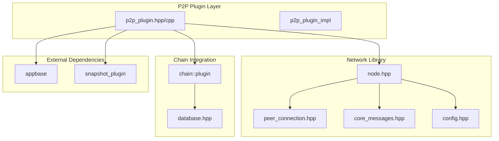
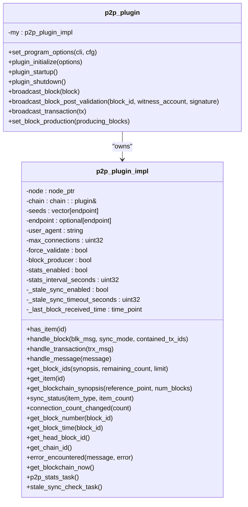
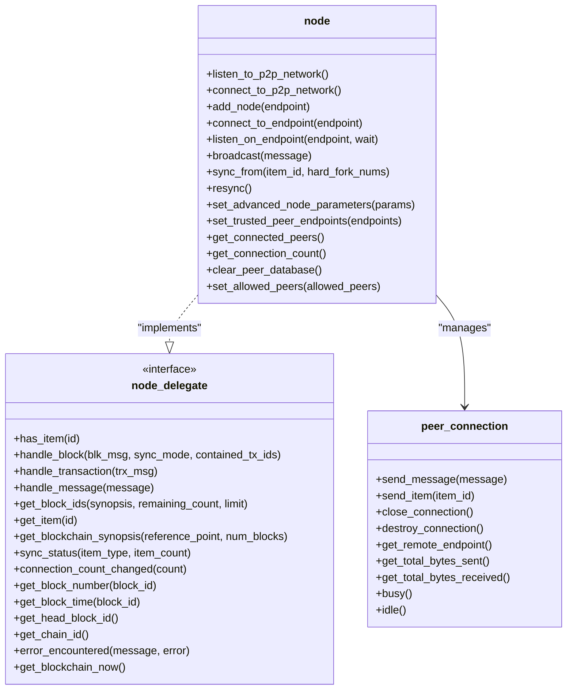
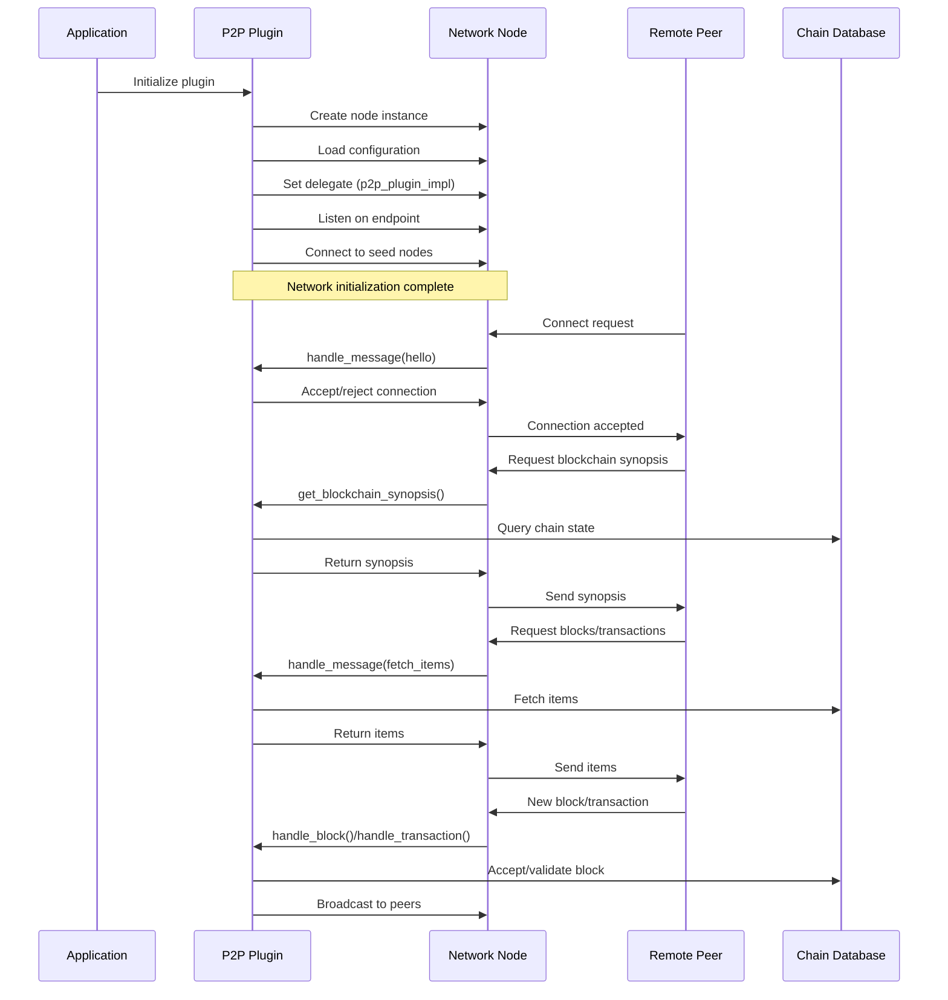
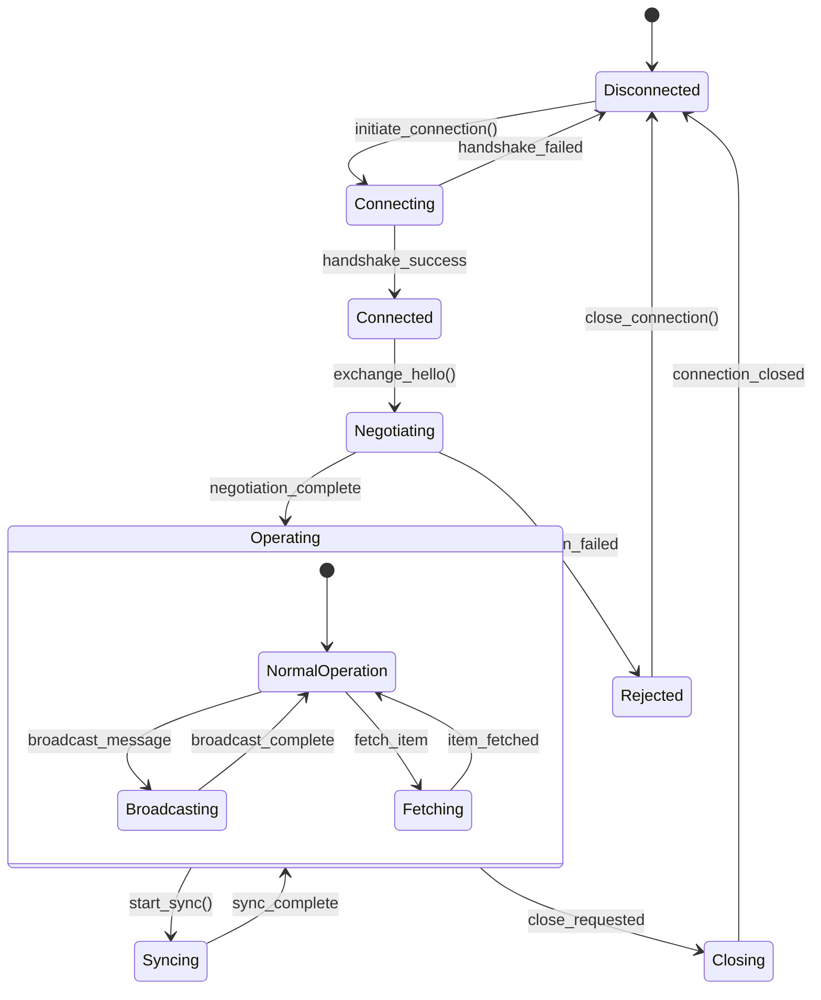
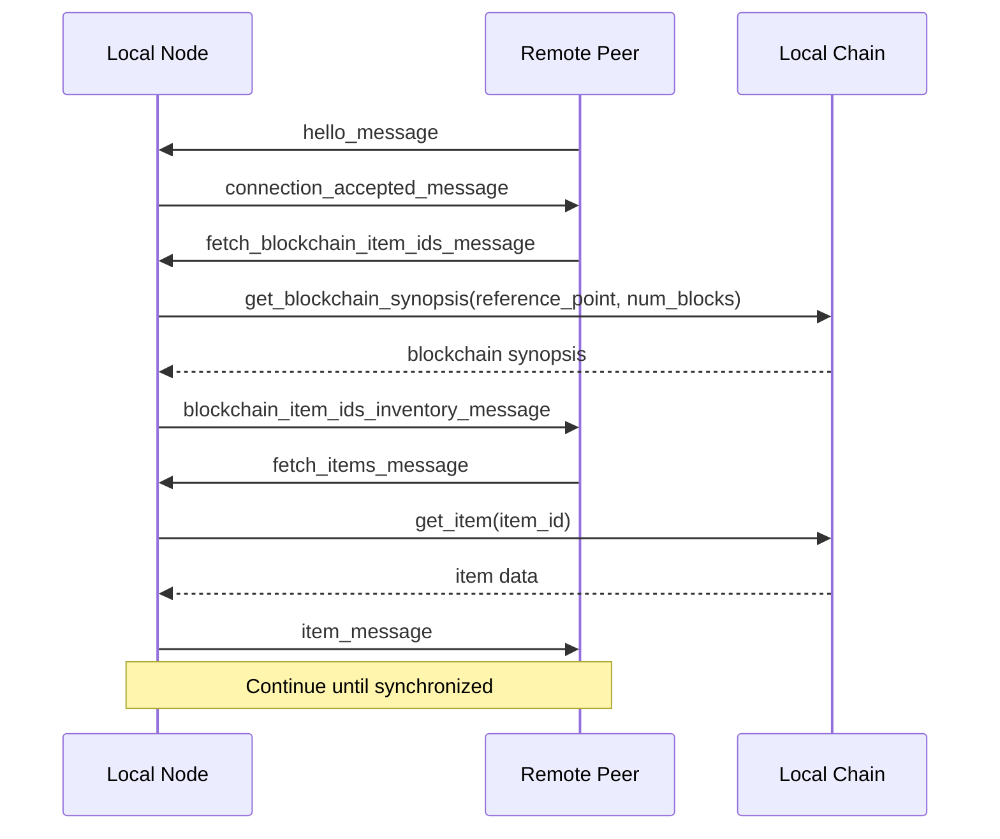
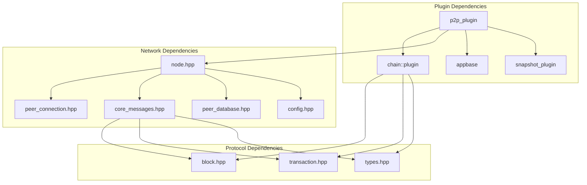

# P2P Plugin

<cite>
**Referenced Files in This Document**
- [p2p_plugin.hpp](file://plugins/p2p/include/graphene/plugins/p2p/p2p_plugin.hpp)
- [p2p_plugin.cpp](file://plugins/p2p/p2p_plugin.cpp)
- [node.hpp](file://libraries/network/include/graphene/network/node.hpp)
- [peer_connection.hpp](file://libraries/network/include/graphene/network/peer_connection.hpp)
- [peer_database.hpp](file://libraries/network/include/graphene/network/peer_database.hpp)
- [core_messages.hpp](file://libraries/network/include/graphene/network/core_messages.hpp)
- [message.hpp](file://libraries/network/include/graphene/network/message.hpp)
- [config.hpp](file://libraries/network/include/graphene/network/config.hpp)
- [node.cpp](file://libraries/network/node.cpp)
- [CMakeLists.txt](file://plugins/p2p/CMakeLists.txt)
- [config.ini](file://share/vizd/config/config.ini)
</cite>

## Table of Contents
1. [Introduction](#introduction)
2. [Project Structure](#project-structure)
3. [Core Components](#core-components)
4. [Architecture Overview](#architecture-overview)
5. [Detailed Component Analysis](#detailed-component-analysis)
6. [Dependency Analysis](#dependency-analysis)
7. [Performance Considerations](#performance-considerations)
8. [Troubleshooting Guide](#troubleshooting-guide)
9. [Conclusion](#conclusion)

## Introduction

The P2P (Peer-to-Peer) Plugin is a critical component of the VIZ blockchain node that enables decentralized communication between nodes in the network. This plugin provides the foundation for blockchain synchronization, transaction propagation, and peer discovery mechanisms that keep the entire network synchronized and functional.

The plugin implements a sophisticated networking layer built on top of the Graphene network library, providing features such as automatic peer discovery, blockchain synchronization protocols, transaction broadcasting, and advanced peer management capabilities including soft-ban mechanisms and connection monitoring.

## Project Structure

The P2P plugin follows a modular architecture with clear separation of concerns:

**Diagram sources**
- [p2p_plugin.hpp:18-52](file://plugins/p2p/include/graphene/plugins/p2p/p2p_plugin.hpp#L18-L52)
- [node.hpp:190-320](file://libraries/network/include/graphene/network/node.hpp#L190-L320)

**Section sources**
- [p2p_plugin.hpp:1-57](file://plugins/p2p/include/graphene/plugins/p2p/p2p_plugin.hpp#L1-L57)
- [CMakeLists.txt:1-49](file://plugins/p2p/CMakeLists.txt#L1-L49)

## Core Components

### P2P Plugin Interface

The main plugin class provides a clean interface for managing P2P networking functionality:

**Diagram sources**
- [p2p_plugin.hpp:18-52](file://plugins/p2p/include/graphene/plugins/p2p/p2p_plugin.hpp#L18-L52)
- [p2p_plugin.cpp:49-126](file://plugins/p2p/p2p_plugin.cpp#L49-L126)

### Network Node Architecture

The plugin integrates with the underlying network infrastructure through a sophisticated node abstraction:

**Diagram sources**
- [node.hpp:190-320](file://libraries/network/include/graphene/network/node.hpp#L190-L320)
- [node.hpp:60-167](file://libraries/network/include/graphene/network/node.hpp#L60-L167)
- [peer_connection.hpp:79-354](file://libraries/network/include/graphene/network/peer_connection.hpp#L79-L354)

**Section sources**
- [p2p_plugin.hpp:18-52](file://plugins/p2p/include/graphene/plugins/p2p/p2p_plugin.hpp#L18-L52)
- [node.hpp:190-320](file://libraries/network/include/graphene/network/node.hpp#L190-L320)

## Architecture Overview

The P2P plugin architecture implements a layered approach to blockchain networking:

**Diagram sources**
- [p2p_plugin.cpp:758-823](file://plugins/p2p/p2p_plugin.cpp#L758-L823)
- [node.cpp:1-200](file://libraries/network/node.cpp#L1-L200)

The architecture provides several key capabilities:

1. **Automatic Peer Discovery**: The plugin automatically discovers and connects to seed nodes specified in configuration
2. **Blockchain Synchronization**: Implements efficient blockchain synchronization using selective block fetching
3. **Transaction Propagation**: Broadcasts transactions to connected peers with intelligent caching
4. **Peer Management**: Manages peer connections with soft-ban mechanisms and connection limits
5. **Monitoring and Statistics**: Provides comprehensive peer statistics and network health monitoring

## Detailed Component Analysis

### Block Validation Protocol

The P2P plugin implements a sophisticated block validation mechanism that enhances security and prevents malicious attacks:

**Diagram sources**
- [p2p_plugin.cpp:216-245](file://plugins/p2p/p2p_plugin.cpp#L216-L245)
- [p2p_plugin.cpp:855-865](file://plugins/p2p/p2p_plugin.cpp#L855-L865)

The block validation protocol includes several security enhancements:

1. **Witness Signature Verification**: Validates that the block signature matches the claimed witness's public key
2. **Chain ID Consistency**: Ensures blocks belong to the correct blockchain instance
3. **Hard Fork Protection**: Handles different validation requirements across blockchain hard forks
4. **Post-Validation Processing**: Applies additional validation steps after initial acceptance

### Peer Connection Management

The plugin manages peer connections through a sophisticated state machine:

**Diagram sources**
- [peer_connection.hpp:82-106](file://libraries/network/include/graphene/network/peer_connection.hpp#L82-L106)

### Blockchain Synchronization Protocol

The synchronization protocol efficiently handles blockchain state reconciliation:

**Diagram sources**
- [core_messages.hpp:188-218](file://libraries/network/include/graphene/network/core_messages.hpp#L188-L218)
- [p2p_plugin.cpp:247-301](file://plugins/p2p/p2p_plugin.cpp#L247-L301)

**Section sources**
- [p2p_plugin.cpp:129-208](file://plugins/p2p/p2p_plugin.cpp#L129-L208)
- [p2p_plugin.cpp:247-301](file://plugins/p2p/p2p_plugin.cpp#L247-L301)
- [peer_connection.hpp:79-354](file://libraries/network/include/graphene/network/peer_connection.hpp#L79-L354)

## Dependency Analysis

The P2P plugin has well-defined dependencies that enable modularity and maintainability:

**Diagram sources**
- [CMakeLists.txt:27-34](file://plugins/p2p/CMakeLists.txt#L27-L34)
- [p2p_plugin.cpp:1-13](file://plugins/p2p/p2p_plugin.cpp#L1-L13)

Key dependency relationships:

1. **Chain Integration**: Direct dependency on the chain plugin for blockchain state access
2. **Network Foundation**: Relies on the network library for peer communication
3. **Application Framework**: Uses appbase for plugin lifecycle management
4. **Snapshot Coordination**: Integrates with snapshot plugin for trusted peer management

**Section sources**
- [CMakeLists.txt:27-34](file://plugins/p2p/CMakeLists.txt#L27-L34)
- [p2p_plugin.cpp:1-13](file://plugins/p2p/p2p_plugin.cpp#L1-L13)

## Performance Considerations

The P2P plugin implements several performance optimization strategies:

### Connection Management
- **Connection Limits**: Configurable maximum connections to prevent resource exhaustion
- **Soft-Ban Mechanisms**: Automatic peer banning for misbehaving nodes
- **Trusted Peer System**: Reduced soft-ban duration for snapshot-provided trusted peers

### Network Efficiency
- **Selective Synchronization**: Only fetches missing blockchain data
- **Message Caching**: Prevents redundant message propagation
- **Bandwidth Throttling**: Configurable upload/download limits

### Monitoring and Diagnostics
- **Periodic Statistics**: Configurable logging intervals for peer statistics
- **Stale Sync Detection**: Automatic recovery from stalled synchronization
- **Connection Health Monitoring**: Real-time peer connection quality metrics

**Section sources**
- [p2p_plugin.cpp:659-756](file://plugins/p2p/p2p_plugin.cpp#L659-L756)
- [p2p_plugin.cpp:512-649](file://plugins/p2p/p2p_plugin.cpp#L512-L649)

## Troubleshooting Guide

### Common Issues and Solutions

#### Connection Problems
- **Symptom**: Unable to connect to seed nodes
- **Solution**: Verify network connectivity and check firewall settings
- **Configuration**: Review `p2p-seed-node` entries in configuration file

#### Synchronization Delays
- **Symptom**: Slow blockchain synchronization
- **Solution**: Increase `p2p-max-connections` setting
- **Monitoring**: Enable P2P statistics to identify slow peers

#### Peer Quality Issues
- **Symptom**: Frequent peer disconnections
- **Solution**: Check network stability and bandwidth limitations
- **Diagnostics**: Monitor peer statistics for connection patterns

### Configuration Reference

The P2P plugin supports extensive configuration options:

| Configuration Option | Description | Default Value |
|---------------------|-------------|---------------|
| `p2p-endpoint` | Local IP and port for incoming connections | 127.0.0.1:9876 |
| `p2p-max-connections` | Maximum incoming connections | 0 (unlimited) |
| `p2p-seed-node` | Seed node endpoints | None |
| `p2p-stats-enabled` | Enable peer statistics logging | true |
| `p2p-stats-interval` | Statistics logging interval (seconds) | 300 |
| `p2p-stale-sync-detection` | Enable stale sync detection | false |
| `p2p-stale-sync-timeout-seconds` | Stale sync timeout | 120 |

**Section sources**
- [p2p_plugin.cpp:659-683](file://plugins/p2p/p2p_plugin.cpp#L659-L683)
- [config.ini:1-136](file://share/vizd/config/config.ini#L1-L136)

## Conclusion

The P2P Plugin represents a sophisticated implementation of blockchain networking infrastructure that provides essential functionality for distributed consensus systems. Its modular architecture, comprehensive peer management, and robust synchronization protocols make it a cornerstone component of the VIZ blockchain ecosystem.

Key strengths of the implementation include:

1. **Security Focus**: Advanced block validation and witness verification mechanisms
2. **Performance Optimization**: Efficient synchronization and connection management
3. **Operational Excellence**: Comprehensive monitoring and diagnostic capabilities
4. **Extensibility**: Clean interfaces that support future enhancements

The plugin's design demonstrates best practices in distributed systems engineering, balancing security, performance, and maintainability while providing the foundation for scalable blockchain networks.