# Plugin System

<cite>
**Referenced Files in This Document**
- [README.md](file://README.md)
- [documentation/plugin.md](file://documentation/plugin.md)
- [plugins/CMakeLists.txt](file://plugins/CMakeLists.txt)
- [plugins/chain/include/graphene/plugins/chain/plugin.hpp](file://plugins/chain/include/graphene/plugins/chain/plugin.hpp)
- [plugins/webserver/include/graphene/plugins/webserver/webserver_plugin.hpp](file://plugins/webserver/include/graphene/plugins/webserver/webserver_plugin.hpp)
- [plugins/database_api/include/graphene/plugins/database_api/plugin.hpp](file://plugins/database_api/include/graphene/plugins/database_api/plugin.hpp)
- [plugins/json_rpc/include/graphene/plugins/json_rpc/plugin.hpp](file://plugins/json_rpc/include/graphene/plugins/json_rpc/plugin.hpp)
- [plugins/account_history/include/graphene/plugins/account_history/plugin.hpp](file://plugins/account_history/include/graphene/plugins/account_history/plugin.hpp)
- [plugins/p2p/include/graphene/plugins/p2p/p2p_plugin.hpp](file://plugins/p2p/include/graphene/plugins/p2p/p2p_plugin.hpp)
- [plugins/mongo_db/include/graphene/plugins/mongo_db/mongo_db_plugin.hpp](file://plugins/mongo_db/include/graphene/plugins/mongo_db/mongo_db_plugin.hpp)
- [plugins/debug_node/plugin.cpp](file://plugins/debug_node/plugin.cpp)
- [plugins/p2p/p2p_plugin.cpp](file://plugins/p2p/p2p_plugin.cpp)
- [libraries/protocol/include/graphene/protocol/operations.hpp](file://libraries/protocol/include/graphene/protocol/operations.hpp)
- [libraries/chain/chain_evaluator.cpp](file://libraries/chain/chain_evaluator.cpp)
- [programs/util/newplugin.py](file://programs/util/newplugin.py)
- [share/vizd/config/config.ini](file://share/vizd/config/config.ini)
</cite>

## Update Summary
**Changes Made**
- Added comprehensive plugin deprecation status section documenting deprecated operations and maintenance practices
- Updated troubleshooting guide with deprecation-related guidance
- Enhanced plugin lifecycle documentation to include maintenance considerations
- Added practical examples for handling deprecated functionality

## Table of Contents
1. [Introduction](#introduction)
2. [Project Structure](#project-structure)
3. [Core Components](#core-components)
4. [Architecture Overview](#architecture-overview)
5. [Detailed Component Analysis](#detailed-component-analysis)
6. [Dependency Analysis](#dependency-analysis)
7. [Plugin Deprecation Status and Maintenance Practices](#plugin-deprecation-status-and-maintenance-practices)
8. [Performance Considerations](#performance-considerations)
9. [Troubleshooting Guide](#troubleshooting-guide)
10. [Conclusion](#conclusion)
11. [Appendices](#appendices)

## Introduction
This document explains the VIZ C++ Node plugin system architecture, focusing on how the appbase-based framework enables modular functionality, the plugin lifecycle from registration to shutdown, and inter-plugin communication patterns. It documents the built-in plugin ecosystem (40+ plugins) ranging from core blockchain functions to specialized APIs and integrations, and provides practical guidance for developing, testing, and deploying custom plugins using the template-based tooling.

**Updated** Enhanced with comprehensive plugin deprecation status documentation and maintenance practices to help developers understand which plugins are deprecated and should be avoided for new implementations.

## Project Structure
The plugin system is organized around the appbase application framework and a dedicated plugins directory. Each plugin is a self-contained module that registers APIs, subscribes to chain events, and optionally depends on other plugins. The top-level plugins build script enumerates subdirectories and exposes a runtime-accessible list of available plugins. Built-in plugins are located under libraries/plugins/<plugin_name>, while external plugins can be added similarly.

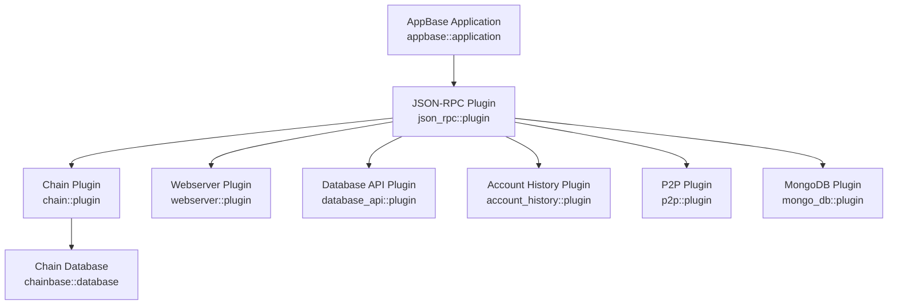

**Diagram sources**
- [plugins/json_rpc/include/graphene/plugins/json_rpc/plugin.hpp](file://plugins/json_rpc/include/graphene/plugins/json_rpc/plugin.hpp#L84-L118)
- [plugins/chain/include/graphene/plugins/chain/plugin.hpp](file://plugins/chain/include/graphene/plugins/chain/plugin.hpp#L21-L96)
- [plugins/webserver/include/graphene/plugins/webserver/webserver_plugin.hpp](file://plugins/webserver/include/graphene/plugins/webserver/webserver_plugin.hpp#L32-L57)
- [plugins/database_api/include/graphene/plugins/database_api/plugin.hpp](file://plugins/database_api/include/graphene/plugins/database_api/plugin.hpp#L179-L403)
- [plugins/account_history/include/graphene/plugins/account_history/plugin.hpp](file://plugins/account_history/include/graphene/plugins/account_history/plugin.hpp#L59-L97)
- [plugins/p2p/include/graphene/plugins/p2p/p2p_plugin.hpp](file://plugins/p2p/include/graphene/plugins/p2p/p2p_plugin.hpp#L18-L52)
- [plugins/mongo_db/include/graphene/plugins/mongo_db/mongo_db_plugin.hpp](file://plugins/mongo_db/include/graphene/plugins/mongo_db/mongo_db_plugin.hpp#L14-L47)

**Section sources**
- [plugins/CMakeLists.txt](file://plugins/CMakeLists.txt#L1-L12)
- [documentation/plugin.md](file://documentation/plugin.md#L1-L28)

## Core Components
- JSON-RPC Plugin: Central dispatcher for API method routing and request handling. It maintains a registry of API names and methods and delegates calls to registered APIs.
- Chain Plugin: Provides blockchain database access, block acceptance, transaction acceptance, and synchronization signals for other plugins.
- Webserver Plugin: Starts an HTTP/WebSocket server and dispatches JSON-RPC queries to registered handlers on the app's io_service thread.
- Database API Plugin: Exposes read-only database queries via JSON-RPC, including blocks, accounts, balances, and chain metadata.
- Account History Plugin: Tracks per-account operation histories and exposes retrieval APIs.
- P2P Plugin: Manages peer-to-peer networking, broadcasting blocks/transactions, and block production controls.
- Mongo DB Plugin: Integrates with MongoDB for indexing and archival of chain data.

**Section sources**
- [plugins/json_rpc/include/graphene/plugins/json_rpc/plugin.hpp](file://plugins/json_rpc/include/graphene/plugins/json_rpc/plugin.hpp#L84-L118)
- [plugins/chain/include/graphene/plugins/chain/plugin.hpp](file://plugins/chain/include/graphene/plugins/chain/plugin.hpp#L21-L96)
- [plugins/webserver/include/graphene/plugins/webserver/webserver_plugin.hpp](file://plugins/webserver/include/graphene/plugins/webserver/webserver_plugin.hpp#L32-L57)
- [plugins/database_api/include/graphene/plugins/database_api/plugin.hpp](file://plugins/database_api/include/graphene/plugins/database_api/plugin.hpp#L179-L403)
- [plugins/account_history/include/graphene/plugins/account_history/plugin.hpp](file://plugins/account_history/include/graphene/plugins/account_history/plugin.hpp#L59-L97)
- [plugins/p2p/include/graphene/plugins/p2p/p2p_plugin.hpp](file://plugins/p2p/include/graphene/plugins/p2p/p2p_plugin.hpp#L18-L52)
- [plugins/mongo_db/include/graphene/plugins/mongo_db/mongo_db_plugin.hpp](file://plugins/mongo_db/include/graphene/plugins/mongo_db/mongo_db_plugin.hpp#L14-L47)

## Architecture Overview
The plugin architecture follows appbase conventions:
- Plugins derive from appbase::plugin and declare dependencies via APPBASE_PLUGIN_REQUIRES.
- Plugins register APIs during startup and expose methods via JSON-RPC.
- Inter-plugin communication occurs through:
  - Shared application services (e.g., chain database).
  - Signals/slots (Boost.Signals2) for event-driven coordination.
  - Explicit API calls across plugin boundaries.

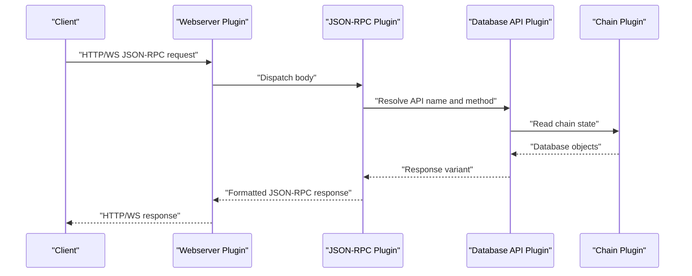

**Diagram sources**
- [plugins/webserver/include/graphene/plugins/webserver/webserver_plugin.hpp](file://plugins/webserver/include/graphene/plugins/webserver/webserver_plugin.hpp#L32-L57)
- [plugins/json_rpc/include/graphene/plugins/json_rpc/plugin.hpp](file://plugins/json_rpc/include/graphene/plugins/json_rpc/plugin.hpp#L109-L113)
- [plugins/database_api/include/graphene/plugins/database_api/plugin.hpp](file://plugins/database_api/include/graphene/plugins/database_api/plugin.hpp#L179-L403)
- [plugins/chain/include/graphene/plugins/chain/plugin.hpp](file://plugins/chain/include/graphene/plugins/chain/plugin.hpp#L88-L91)

## Detailed Component Analysis

### JSON-RPC Plugin
- Role: Registers API method bindings and routes incoming JSON-RPC requests to the appropriate plugin API.
- Key behaviors:
  - Maintains a registry of API names and methods.
  - Dispatches calls using a visitor pattern that binds method pointers to variants.
  - Supports error codes standardized for JSON-RPC.

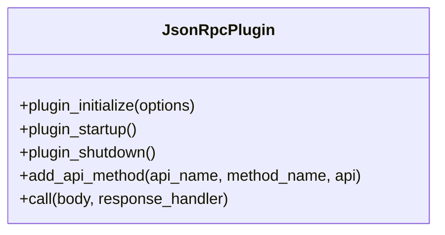

**Diagram sources**
- [plugins/json_rpc/include/graphene/plugins/json_rpc/plugin.hpp](file://plugins/json_rpc/include/graphene/plugins/json_rpc/plugin.hpp#L84-L118)

**Section sources**
- [plugins/json_rpc/include/graphene/plugins/json_rpc/plugin.hpp](file://plugins/json_rpc/include/graphene/plugins/json_rpc/plugin.hpp#L38-L55)
- [plugins/json_rpc/include/graphene/plugins/json_rpc/plugin.hpp](file://plugins/json_rpc/include/graphene/plugins/json_rpc/plugin.hpp#L109-L113)

### Chain Plugin
- Role: Core blockchain engine exposing database accessors, block/transaction acceptance, and synchronization signals.
- Lifecycle hooks: initialize, startup, shutdown.
- Public API surface includes helpers for indices and objects, plus a synchronization signal for dependent plugins.

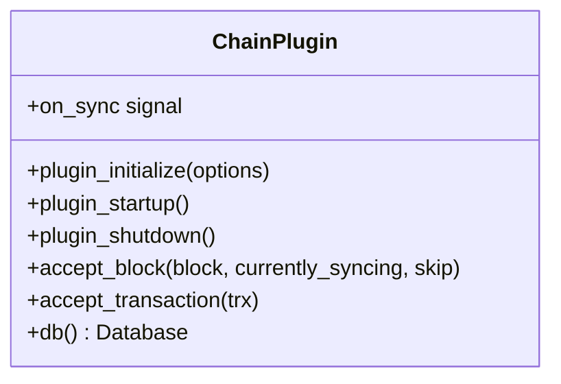

**Diagram sources**
- [plugins/chain/include/graphene/plugins/chain/plugin.hpp](file://plugins/chain/include/graphene/plugins/chain/plugin.hpp#L21-L96)

**Section sources**
- [plugins/chain/include/graphene/plugins/chain/plugin.hpp](file://plugins/chain/include/graphene/plugins/chain/plugin.hpp#L36-L42)
- [plugins/chain/include/graphene/plugins/chain/plugin.hpp](file://plugins/chain/include/graphene/plugins/chain/plugin.hpp#L88-L91)

### Webserver Plugin
- Role: Starts an HTTP/WebSocket server and dispatches JSON-RPC queries to registered handlers on the application io_service thread.
- Dependencies: Requires JSON-RPC plugin.

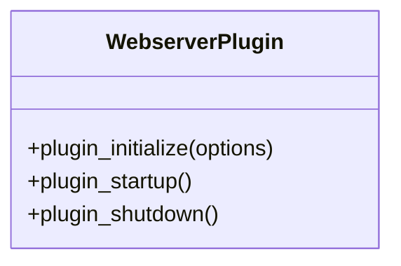

**Diagram sources**
- [plugins/webserver/include/graphene/plugins/webserver/webserver_plugin.hpp](file://plugins/webserver/include/graphene/plugins/webserver/webserver_plugin.hpp#L32-L57)

**Section sources**
- [plugins/webserver/include/graphene/plugins/webserver/webserver_plugin.hpp](file://plugins/webserver/include/graphene/plugins/webserver/webserver_plugin.hpp#L19-L31)

### Database API Plugin
- Role: Exposes read-only database queries via JSON-RPC, including blocks, accounts, balances, and chain metadata.
- Dependencies: Requires JSON-RPC and Chain plugins.
- API coverage includes block retrieval, dynamic/global properties, account queries, and more.

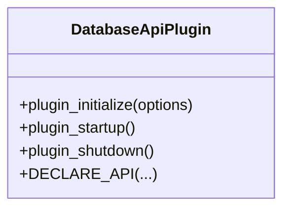

**Diagram sources**
- [plugins/database_api/include/graphene/plugins/database_api/plugin.hpp](file://plugins/database_api/include/graphene/plugins/database_api/plugin.hpp#L179-L403)

**Section sources**
- [plugins/database_api/include/graphene/plugins/database_api/plugin.hpp](file://plugins/database_api/include/graphene/plugins/database_api/plugin.hpp#L188-L191)
- [plugins/database_api/include/graphene/plugins/database_api/plugin.hpp](file://plugins/database_api/include/graphene/plugins/database_api/plugin.hpp#L227-L398)

### Account History Plugin
- Role: Tracks per-account operation histories and exposes retrieval APIs.
- Dependencies: Requires JSON-RPC, Chain, and Operation History plugins.

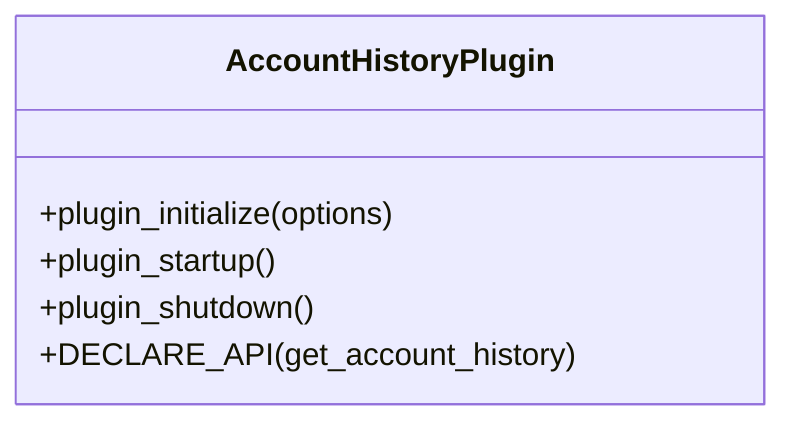

**Diagram sources**
- [plugins/account_history/include/graphene/plugins/account_history/plugin.hpp](file://plugins/account_history/include/graphene/plugins/account_history/plugin.hpp#L59-L97)

**Section sources**
- [plugins/account_history/include/graphene/plugins/account_history/plugin.hpp](file://plugins/account_history/include/graphene/plugins/account_history/plugin.hpp#L61-L65)
- [plugins/account_history/include/graphene/plugins/account_history/plugin.hpp](file://plugins/account_history/include/graphene/plugins/account_history/plugin.hpp#L83-L92)

### P2P Plugin
- Role: Manages peer-to-peer networking, broadcasting blocks/transactions, and block production controls.
- Dependencies: Requires Chain plugin.
- **Maintenance Note**: Uses deprecated configuration options with warnings for migration.

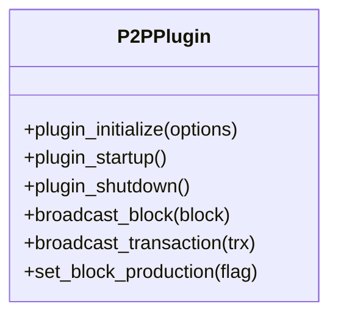

**Diagram sources**
- [plugins/p2p/include/graphene/plugins/p2p/p2p_plugin.hpp](file://plugins/p2p/include/graphene/plugins/p2p/p2p_plugin.hpp#L18-L52)

**Section sources**
- [plugins/p2p/include/graphene/plugins/p2p/p2p_plugin.hpp](file://plugins/p2p/include/graphene/plugins/p2p/p2p_plugin.hpp#L20-L20)
- [plugins/p2p/include/graphene/plugins/p2p/p2p_plugin.hpp](file://plugins/p2p/include/graphene/plugins/p2p/p2p_plugin.hpp#L40-L49)

### Mongo DB Plugin
- Role: Integrates with MongoDB for indexing and archival of chain data.
- Dependencies: Requires Chain plugin.

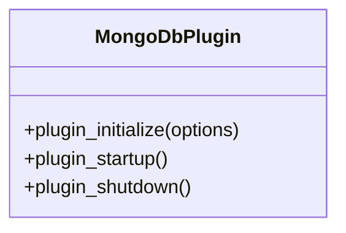

**Diagram sources**
- [plugins/mongo_db/include/graphene/plugins/mongo_db/mongo_db_plugin.hpp](file://plugins/mongo_db/include/graphene/plugins/mongo_db/mongo_db_plugin.hpp#L14-L47)

**Section sources**
- [plugins/mongo_db/include/graphene/plugins/mongo_db/mongo_db_plugin.hpp](file://plugins/mongo_db/include/graphene/plugins/mongo_db/mongo_db_plugin.hpp#L17-L19)

### Plugin Registration and Lifecycle
- Registration: Plugins are enumerated by the build system and registered with the application. Built-in plugins are discovered via the plugins directory traversal.
- Startup: Plugins initialize dependencies, set up program options, and register APIs with the JSON-RPC dispatcher.
- Shutdown: Plugins clean up resources and disconnect signals.

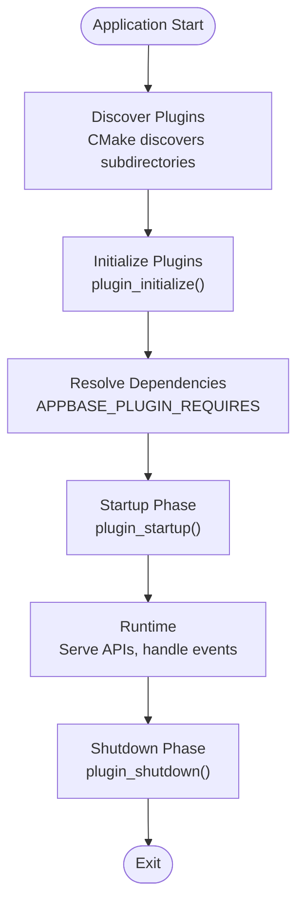

**Diagram sources**
- [plugins/CMakeLists.txt](file://plugins/CMakeLists.txt#L1-L12)
- [plugins/json_rpc/include/graphene/plugins/json_rpc/plugin.hpp](file://plugins/json_rpc/include/graphene/plugins/json_rpc/plugin.hpp#L84-L118)
- [plugins/chain/include/graphene/plugins/chain/plugin.hpp](file://plugins/chain/include/graphene/plugins/chain/plugin.hpp#L36-L42)

**Section sources**
- [documentation/plugin.md](file://documentation/plugin.md#L11-L20)
- [plugins/CMakeLists.txt](file://plugins/CMakeLists.txt#L1-L12)

### Inter-Plugin Communication Patterns
- Shared Database Access: Plugins like Database API and Account History rely on Chain plugin's database interface.
- Event Synchronization: Plugins can subscribe to Chain plugin signals (e.g., on_sync) to coordinate startup behavior.
- Explicit API Calls: Plugins can call APIs exposed by other plugins via the JSON-RPC registry.

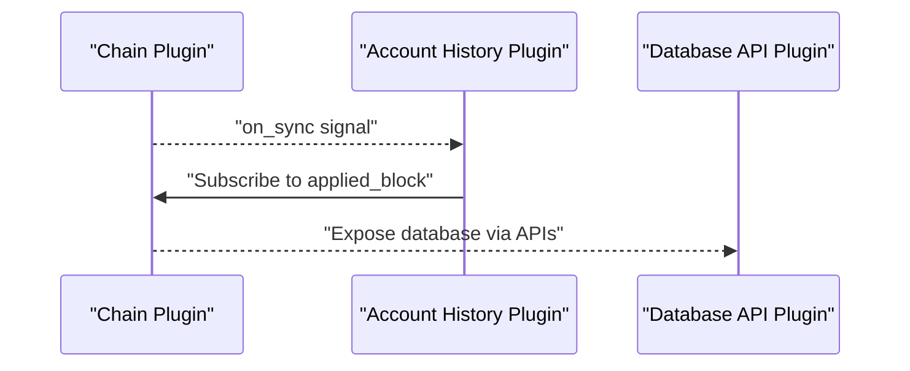

**Diagram sources**
- [plugins/chain/include/graphene/plugins/chain/plugin.hpp](file://plugins/chain/include/graphene/plugins/chain/plugin.hpp#L88-L91)
- [plugins/account_history/include/graphene/plugins/account_history/plugin.hpp](file://plugins/account_history/include/graphene/plugins/account_history/plugin.hpp#L77-L77)
- [plugins/database_api/include/graphene/plugins/database_api/plugin.hpp](file://plugins/database_api/include/graphene/plugins/database_api/plugin.hpp#L179-L403)

**Section sources**
- [plugins/chain/include/graphene/plugins/chain/plugin.hpp](file://plugins/chain/include/graphene/plugins/chain/plugin.hpp#L88-L91)
- [plugins/account_history/include/graphene/plugins/account_history/plugin.hpp](file://plugins/account_history/include/graphene/plugins/account_history/plugin.hpp#L77-L77)

### Built-in Plugins Catalog (Overview)
The following plugins are part of the built-in set. Each plugin exposes specific APIs and integrates with the appbase framework and JSON-RPC dispatcher. Consult individual plugin headers for API declarations and lifecycle hooks.

- chain: Core blockchain database access and block/transaction acceptance.
- webserver: HTTP/WebSocket server for JSON-RPC.
- database_api: Read-only chain state queries.
- account_history: Per-account operation history.
- p2p: Peer-to-peer networking and broadcasting.
- mongo_db: MongoDB integration for archival/indexing.
- json_rpc: JSON-RPC dispatcher and method registry.
- snapshot: Full chainbase state export/import for fast node recovery (API: snapshot_export, snapshot_info, snapshot_verify; CLI: --load-snapshot; auto-export via --snapshot-every; manual trigger via SIGUSR1).
- Additional plugins include: account_by_key, auth_util, block_info, committee_api, custom_protocol_api, debug_node, follow, invite_api, network_broadcast_api, operation_history, paid_subscription_api, private_message, raw_block, social_network, tags, test_api, witness, witness_api.

**Section sources**
- [plugins/chain/include/graphene/plugins/chain/plugin.hpp](file://plugins/chain/include/graphene/plugins/chain/plugin.hpp#L21-L42)
- [plugins/webserver/include/graphene/plugins/webserver/webserver_plugin.hpp](file://plugins/webserver/include/graphene/plugins/webserver/webserver_plugin.hpp#L32-L43)
- [plugins/database_api/include/graphene/plugins/database_api/plugin.hpp](file://plugins/database_api/include/graphene/plugins/database_api/plugin.hpp#L179-L186)
- [plugins/account_history/include/graphene/plugins/account_history/plugin.hpp](file://plugins/account_history/include/graphene/plugins/account_history/plugin.hpp#L59-L70)
- [plugins/p2p/include/graphene/plugins/p2p/p2p_plugin.hpp](file://plugins/p2p/include/graphene/plugins/p2p/p2p_plugin.hpp#L18-L32)
- [plugins/mongo_db/include/graphene/plugins/mongo_db/mongo_db_plugin.hpp](file://plugins/mongo_db/include/graphene/plugins/mongo_db/mongo_db_plugin.hpp#L14-L41)

### Plugin Development Workflow
- Template-based Creation Tool: Use the provided Python script to generate a plugin skeleton with CMake targets, API headers, and implementation stubs.
- Steps:
  - Run the generator with provider and plugin name to scaffold files.
  - Implement plugin lifecycle methods and register API factory in startup.
  - Declare API methods and integrate with JSON-RPC.
  - Build and enable the plugin via configuration.

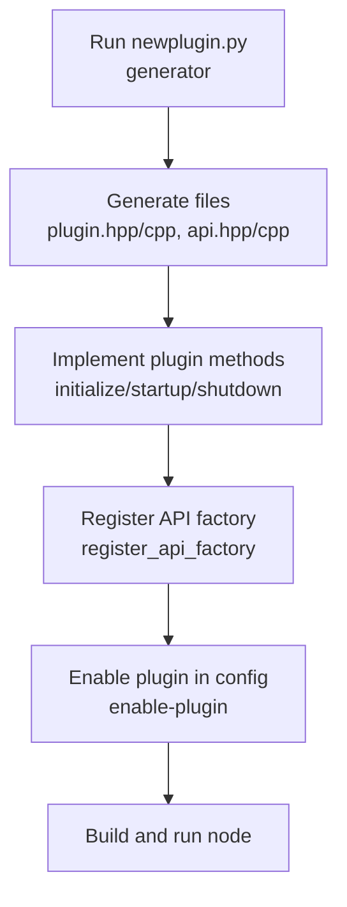

**Diagram sources**
- [programs/util/newplugin.py](file://programs/util/newplugin.py#L225-L246)
- [programs/util/newplugin.py](file://programs/util/newplugin.py#L168-L173)

**Section sources**
- [documentation/plugin.md](file://documentation/plugin.md#L21-L28)
- [programs/util/newplugin.py](file://programs/util/newplugin.py#L225-L246)

## Dependency Analysis
Plugins declare explicit dependencies using APPBASE_PLUGIN_REQUIRES. The JSON-RPC plugin is a central dependency for most plugins that expose APIs. The Chain plugin is often required by stateful plugins.

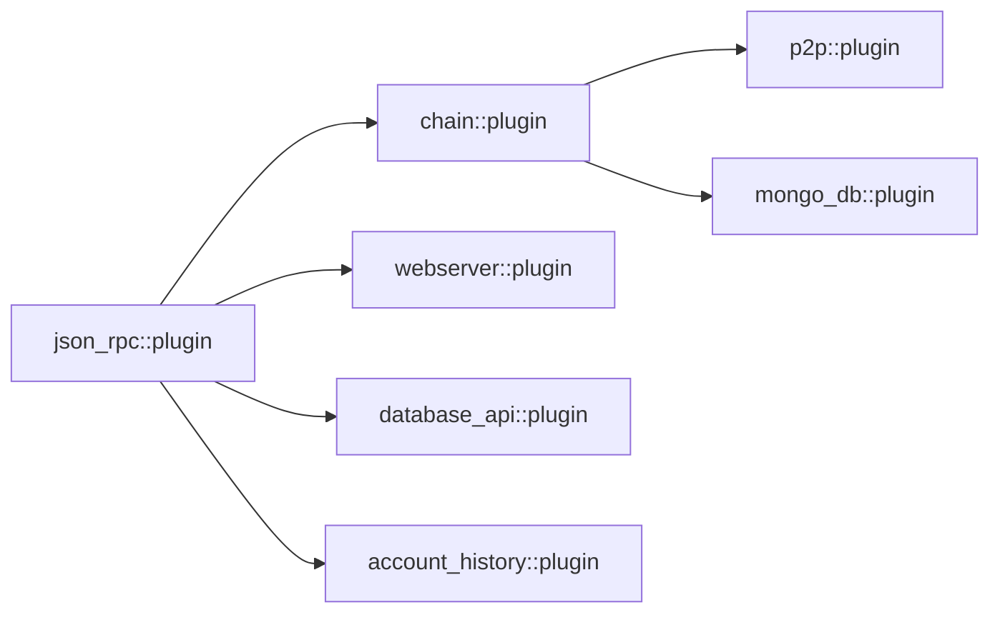

**Diagram sources**
- [plugins/json_rpc/include/graphene/plugins/json_rpc/plugin.hpp](file://plugins/json_rpc/include/graphene/plugins/json_rpc/plugin.hpp#L84-L118)
- [plugins/chain/include/graphene/plugins/chain/plugin.hpp](file://plugins/chain/include/graphene/plugins/chain/plugin.hpp#L21-L24)
- [plugins/webserver/include/graphene/plugins/webserver/webserver_plugin.hpp](file://plugins/webserver/include/graphene/plugins/webserver/webserver_plugin.hpp#L32-L38)
- [plugins/database_api/include/graphene/plugins/database_api/plugin.hpp](file://plugins/database_api/include/graphene/plugins/database_api/plugin.hpp#L188-L191)
- [plugins/account_history/include/graphene/plugins/account_history/plugin.hpp](file://plugins/account_history/include/graphene/plugins/account_history/plugin.hpp#L61-L65)
- [plugins/p2p/include/graphene/plugins/p2p/p2p_plugin.hpp](file://plugins/p2p/include/graphene/plugins/p2p/p2p_plugin.hpp#L20-L20)
- [plugins/mongo_db/include/graphene/plugins/mongo_db/mongo_db_plugin.hpp](file://plugins/mongo_db/include/graphene/plugins/mongo_db/mongo_db_plugin.hpp#L17-L19)

**Section sources**
- [plugins/chain/include/graphene/plugins/chain/plugin.hpp](file://plugins/chain/include/graphene/plugins/chain/plugin.hpp#L21-L24)
- [plugins/database_api/include/graphene/plugins/database_api/plugin.hpp](file://plugins/database_api/include/graphene/plugins/database_api/plugin.hpp#L188-L191)
- [plugins/account_history/include/graphene/plugins/account_history/plugin.hpp](file://plugins/account_history/include/graphene/plugins/account_history/plugin.hpp#L61-L65)
- [plugins/p2p/include/graphene/plugins/p2p/p2p_plugin.hpp](file://plugins/p2p/include/graphene/plugins/p2p/p2p_plugin.hpp#L20-L20)
- [plugins/mongo_db/include/graphene/plugins/mongo_db/mongo_db_plugin.hpp](file://plugins/mongo_db/include/graphene/plugins/mongo_db/mongo_db_plugin.hpp#L17-L19)

## Plugin Deprecation Status and Maintenance Practices

### Deprecation Overview
The VIZ blockchain platform maintains strict deprecation policies for operations and plugins that are no longer supported. Understanding deprecation status is crucial for maintaining compatibility and avoiding runtime errors.

### Deprecated Operations
Several blockchain operations have been deprecated as part of hardfork implementations:

#### Hardfork 4 Deprecations
- **vote_operation**: Voting operations are deprecated as of Hardfork 4
- **content_operation**: Content creation/update operations are deprecated as of Hardfork 4  
- **delete_content_operation**: Content deletion operations are deprecated as of Hardfork 4

These operations are explicitly marked as deprecated in the operations header and validated in chain evaluators with hardfork checks.

**Section sources**
- [libraries/protocol/include/graphene/protocol/operations.hpp](file://libraries/protocol/include/graphene/protocol/operations.hpp#L14-L27)
- [libraries/chain/chain_evaluator.cpp](file://libraries/chain/chain_evaluator.cpp#L216-L216)
- [libraries/chain/chain_evaluator.cpp](file://libraries/chain/chain_evaluator.cpp#L551-L551)
- [libraries/chain/chain_evaluator.cpp](file://libraries/chain/chain_evaluator.cpp#L1296-L1296)

### Plugin Configuration Deprecations
Several plugin configuration options have been deprecated in favor of newer alternatives:

#### P2P Plugin Deprecations
- **seed-node**: Deprecated in favor of `p2p-seed-node`
- **force-validate**: Deprecated in favor of `p2p-force-validate`

Both deprecations emit warnings during plugin initialization and support graceful migration by accepting both old and new option formats.

**Section sources**
- [plugins/p2p/p2p_plugin.cpp](file://plugins/p2p/p2p_plugin.cpp#L499-L528)

#### Debug Node Plugin Deprecations
- **edit-script**: Deprecated in favor of `debug-node-edit-script`

The debug node plugin maintains backward compatibility by logging warnings and merging deprecated options with their modern equivalents.

**Section sources**
- [plugins/debug_node/plugin.cpp](file://plugins/debug_node/plugin.cpp#L124-L128)

### Maintenance Best Practices

#### Migration Strategies
1. **Configuration Migration**: Replace deprecated configuration options with their modern equivalents
2. **Operation Updates**: Update client applications to use supported alternatives
3. **Plugin Updates**: Monitor plugin deprecation notices and migrate to maintained alternatives

#### Monitoring Deprecation Warnings
Plugins emit warnings when deprecated features are detected:
- P2P plugin logs warnings for deprecated seed-node and force-validate options
- Debug node plugin logs warnings for deprecated edit-script option
- Chain evaluators enforce hardfork-based operation deprecations

#### Testing and Validation
- Test with deprecated operations to identify compatibility issues
- Monitor warning logs for deprecated feature usage
- Validate migration paths before hardfork activation

### Practical Examples

#### Handling Deprecated P2P Configuration
```ini
# Deprecated (will show warning)
seed-node = 192.168.0.1:4243

# Recommended approach
p2p-seed-node = 192.168.0.1:4243
```

#### Managing Deprecated Operations
When encountering deprecation errors:
1. Check current hardfork status using chain operations
2. Update client applications to use supported alternatives
3. Monitor deprecation warnings in plugin logs

**Section sources**
- [plugins/p2p/p2p_plugin.cpp](file://plugins/p2p/p2p_plugin.cpp#L499-L528)
- [plugins/debug_node/plugin.cpp](file://plugins/debug_node/plugin.cpp#L124-L128)
- [libraries/chain/chain_evaluator.cpp](file://libraries/chain/chain_evaluator.cpp#L216-L216)

## Performance Considerations
- JSON-RPC Overhead: Each request incurs serialization/deserialization and method dispatch overhead. Batch requests and minimize unnecessary API calls.
- Database Access: Heavy queries against the chain database should be cached or paginated to avoid latency spikes.
- Threading Model: Webserver runs on its own io_service thread to isolate HTTP processing from other plugins.
- Signal Usage: Prefer signals for lightweight coordination; avoid heavy computation inside connected slots.
- Storage Backends: Plugins like mongo_db introduce additional write amplification; tune indexing and batching strategies.
- **Maintenance Impact**: Deprecated plugins may have reduced performance due to compatibility layers and should be migrated to supported alternatives.

## Troubleshooting Guide
- Plugin Not Found:
  - Ensure the plugin directory exists and contains a CMakeLists.txt; the build system enumerates subdirectories.
- API Not Available:
  - Verify the plugin is enabled and public-api is configured if exposing public endpoints.
  - Confirm the plugin registered its API factory during startup.
- Replay Required:
  - Some plugins maintain persistent records; disabling/enabling them may require a replay.
- Authentication:
  - Use api-user to protect sensitive APIs.
- **Deprecation Issues**:
  - Check for deprecation warnings in plugin logs
  - Review deprecated operations and migrate to supported alternatives
  - Update configuration options to use non-deprecated values
  - Monitor hardfork compliance for operation usage

**Section sources**
- [documentation/plugin.md](file://documentation/plugin.md#L11-L20)
- [plugins/CMakeLists.txt](file://plugins/CMakeLists.txt#L1-L12)
- [plugins/p2p/p2p_plugin.cpp](file://plugins/p2p/p2p_plugin.cpp#L499-L528)
- [plugins/debug_node/plugin.cpp](file://plugins/debug_node/plugin.cpp#L124-L128)

## Conclusion
The VIZ C++ Node plugin system leverages appbase to deliver a modular, extensible architecture. Plugins integrate seamlessly through JSON-RPC, share the chain database, and coordinate via signals. The template-based development tool accelerates custom plugin creation, while configuration options govern exposure and security. With 40+ built-in plugins spanning core blockchain functionality to specialized integrations, the system supports diverse use cases from public APIs to archival pipelines.

**Updated** The system now includes comprehensive deprecation management with clear migration paths, warning systems for deprecated features, and maintenance practices to ensure long-term sustainability of plugin implementations.

## Appendices

### Appendix A: Plugin Lifecycle Reference
- Discovery: Build system scans plugins directory and sets available plugin list.
- Initialization: plugin_initialize parses options and prepares state.
- Startup: plugin_startup registers APIs and connects to chain/database signals.
- Shutdown: plugin_shutdown tears down connections and cleans up.

**Section sources**
- [plugins/CMakeLists.txt](file://plugins/CMakeLists.txt#L1-L12)
- [plugins/json_rpc/include/graphene/plugins/json_rpc/plugin.hpp](file://plugins/json_rpc/include/graphene/plugins/json_rpc/plugin.hpp#L103-L107)
- [plugins/chain/include/graphene/plugins/chain/plugin.hpp](file://plugins/chain/include/graphene/plugins/chain/plugin.hpp#L36-L42)

### Appendix B: Configuration Options
- enable-plugin: Comma-separated list of plugin names to activate.
- public-api: Comma-separated list of public API names to expose.
- api-user: Username/password protection for APIs.
- **Deprecated Options**: seed-node (use p2p-seed-node), force-validate (use p2p-force-validate), edit-script (use debug-node-edit-script).

**Section sources**
- [documentation/plugin.md](file://documentation/plugin.md#L11-L20)
- [share/vizd/config/config.ini](file://share/vizd/config/config.ini)
- [plugins/p2p/p2p_plugin.cpp](file://plugins/p2p/p2p_plugin.cpp#L499-L528)
- [plugins/debug_node/plugin.cpp](file://plugins/debug_node/plugin.cpp#L124-L128)

### Appendix C: Deprecation Timeline
- Hardfork 4: vote_operation, content_operation, delete_content_operation deprecated
- Future Hardforks: Monitor operation deprecation notices and prepare migration plans
- Plugin Deprecations: Regular review and replacement of deprecated plugin functionality

**Section sources**
- [libraries/protocol/include/graphene/protocol/operations.hpp](file://libraries/protocol/include/graphene/protocol/operations.hpp#L14-L27)
- [libraries/chain/chain_evaluator.cpp](file://libraries/chain/chain_evaluator.cpp#L216-L216)
- [libraries/chain/chain_evaluator.cpp](file://libraries/chain/chain_evaluator.cpp#L551-L551)
- [libraries/chain/chain_evaluator.cpp](file://libraries/chain/chain_evaluator.cpp#L1296-L1296)