# Plugin System

<cite>
**Referenced Files in This Document**
- [README.md](file://README.md)
- [documentation/plugin.md](file://documentation/plugin.md)
- [documentation/snapshot-plugin.md](file://documentation/snapshot-plugin.md)
- [plugins/CMakeLists.txt](file://plugins/CMakeLists.txt)
- [plugins/chain/include/graphene/plugins/chain/plugin.hpp](file://plugins/chain/include/graphene/plugins/chain/plugin.hpp)
- [plugins/webserver/include/graphene/plugins/webserver/webserver_plugin.hpp](file://plugins/webserver/include/graphene/plugins/webserver/webserver_plugin.hpp)
- [plugins/database_api/include/graphene/plugins/database_api/plugin.hpp](file://plugins/database_api/include/graphene/plugins/database_api/plugin.hpp)
- [plugins/json_rpc/include/graphene/plugins/json_rpc/plugin.hpp](file://plugins/json_rpc/include/graphene/plugins/json_rpc/plugin.hpp)
- [plugins/account_history/include/graphene/plugins/account_history/plugin.hpp](file://plugins/account_history/include/graphene/plugins/account_history/plugin.hpp)
- [plugins/p2p/include/graphene/plugins/p2p/p2p_plugin.hpp](file://plugins/p2p/include/graphene/plugins/p2p/p2p_plugin.hpp)
- [plugins/mongo_db/include/graphene/plugins/mongo_db/mongo_db_plugin.hpp](file://plugins/mongo_db/include/graphene/plugins/mongo_db/mongo_db_plugin.hpp)
- [plugins/snapshot/include/graphene/plugins/snapshot/plugin.hpp](file://plugins/snapshot/include/graphene/plugins/snapshot/plugin.hpp)
- [plugins/debug_node/plugin.cpp](file://plugins/debug_node/plugin.cpp)
- [plugins/p2p/p2p_plugin.cpp](file://plugins/p2p/p2p_plugin.cpp)
- [libraries/protocol/include/graphene/protocol/operations.hpp](file://libraries/protocol/include/graphene/protocol/operations.hpp)
- [libraries/chain/chain_evaluator.cpp](file://libraries/chain/chain_evaluator.cpp)
- [libraries/chain/database.cpp](file://libraries/chain/database.cpp)
- [libraries/chain/dlt_block_log.cpp](file://libraries/chain/dlt_block_log.cpp)
- [libraries/chain/include/graphene/chain/dlt_block_log.hpp](file://libraries/chain/include/graphene/chain/dlt_block_log.hpp)
- [programs/util/newplugin.py](file://programs/util/newplugin.py)
- [share/vizd/config/config.ini](file://share/vizd/config/config.ini)
</cite>

## Update Summary
**Changes Made**
- Enhanced P2P plugin integration with DLT mode awareness for improved error handling and logging
- Added comprehensive DLT rolling block log integration details
- Updated plugin architecture to reflect snapshot plugin's role in DLT mode operations
- Expanded P2P plugin integration documentation for DLT mode compatibility
- Added new sections covering snapshot-based node bootstrap and DLT-specific configurations
- Improved error handling patterns with enhanced logging for DLT mode block serving operations

## Table of Contents
1. [Introduction](#introduction)
2. [Project Structure](#project-structure)
3. [Core Components](#core-components)
4. [Architecture Overview](#architecture-overview)
5. [Detailed Component Analysis](#detailed-component-analysis)
6. [DLT Mode and Snapshot Integration](#dlt-mode-and-snapshot-integration)
7. [Enhanced P2P Plugin Integration with DLT Mode Awareness](#enhanced-p2p-plugin-integration-with-dlt-mode-awareness)
8. [Dependency Analysis](#dependency-analysis)
9. [Plugin Deprecation Status and Maintenance Practices](#plugin-deprecation-status-and-maintenance-practices)
10. [Performance Considerations](#performance-considerations)
11. [Troubleshooting Guide](#troubleshooting-guide)
12. [Conclusion](#conclusion)
13. [Appendices](#appendices)

## Introduction
This document explains the VIZ C++ Node plugin system architecture, focusing on how the appbase-based framework enables modular functionality, the plugin lifecycle from registration to shutdown, and inter-plugin communication patterns. It documents the built-in plugin ecosystem (40+ plugins) ranging from core blockchain functions to specialized APIs and integrations, including the enhanced snapshot plugin capabilities for DLT (Distributed Ledger Technology) mode operations and integration with rolling block log features.

**Updated** Enhanced with comprehensive DLT mode documentation covering snapshot-based node bootstrap, rolling block log integration, and P2P layer compatibility for distributed ledger deployments. The P2P plugin now includes sophisticated DLT mode awareness with improved error handling and logging capabilities for DLT mode block serving operations.

## Project Structure
The plugin system is organized around the appbase application framework and a dedicated plugins directory. Each plugin is a self-contained module that registers APIs, subscribes to chain events, and optionally depends on other plugins. The top-level plugins build script enumerates subdirectories and exposes a runtime-accessible list of available plugins. Built-in plugins are located under libraries/plugins/<plugin_name>, while external plugins can be added similarly.

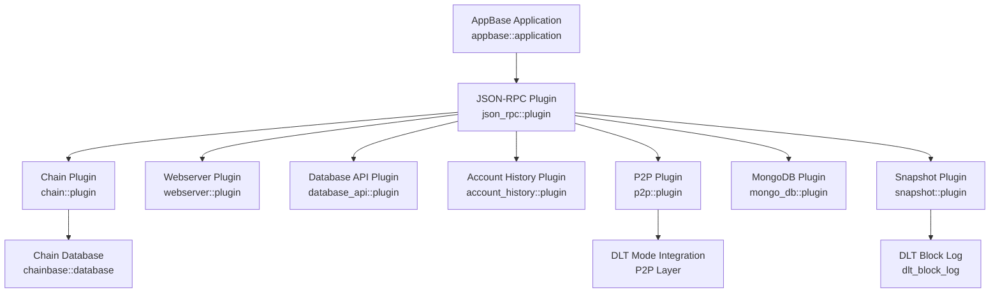

**Diagram sources**
- [plugins/json_rpc/include/graphene/plugins/json_rpc/plugin.hpp:84-118](file://plugins/json_rpc/include/graphene/plugins/json_rpc/plugin.hpp#L84-L118)
- [plugins/chain/include/graphene/plugins/chain/plugin.hpp:21-96](file://plugins/chain/include/graphene/plugins/chain/plugin.hpp#L21-L96)
- [plugins/webserver/include/graphene/plugins/webserver/webserver_plugin.hpp:32-57](file://plugins/webserver/include/graphene/plugins/webserver/webserver_plugin.hpp#L32-L57)
- [plugins/database_api/include/graphene/plugins/database_api/plugin.hpp:179-403](file://plugins/database_api/include/graphene/plugins/database_api/plugin.hpp#L179-L403)
- [plugins/account_history/include/graphene/plugins/account_history/plugin.hpp:59-97](file://plugins/account_history/include/graphene/plugins/account_history/plugin.hpp#L59-L97)
- [plugins/p2p/include/graphene/plugins/p2p/p2p_plugin.hpp:18-52](file://plugins/p2p/include/graphene/plugins/p2p/p2p_plugin.hpp#L18-L52)
- [plugins/mongo_db/include/graphene/plugins/mongo_db/mongo_db_plugin.hpp:14-47](file://plugins/mongo_db/include/graphene/plugins/mongo_db/mongo_db_plugin.hpp#L14-L47)
- [plugins/snapshot/include/graphene/plugins/snapshot/plugin.hpp:42-76](file://plugins/snapshot/include/graphene/plugins/snapshot/plugin.hpp#L42-L76)
- [libraries/chain/include/graphene/chain/dlt_block_log.hpp:35-72](file://libraries/chain/include/graphene/chain/dlt_block_log.hpp#L35-L72)
- [plugins/p2p/p2p_plugin.cpp:203-257](file://plugins/p2p/p2p_plugin.cpp#L203-L257)

**Section sources**
- [plugins/CMakeLists.txt:1-12](file://plugins/CMakeLists.txt#L1-L12)
- [documentation/plugin.md:1-28](file://documentation/plugin.md#L1-L28)

## Core Components
- JSON-RPC Plugin: Central dispatcher for API method routing and request handling. It maintains a registry of API names and methods and delegates calls to registered APIs.
- Chain Plugin: Provides blockchain database access, block acceptance, transaction acceptance, and synchronization signals for other plugins.
- Webserver Plugin: Starts an HTTP/WebSocket server and dispatches JSON-RPC queries to registered handlers on the app's io_service thread.
- Database API Plugin: Exposes read-only database queries via JSON-RPC, including blocks, accounts, balances, and chain metadata.
- Account History Plugin: Tracks per-account operation histories and exposes retrieval APIs.
- P2P Plugin: Manages peer-to-peer networking, broadcasting blocks/transactions, and block production controls. **Enhanced** with DLT mode awareness and improved error handling.
- Mongo DB Plugin: Integrates with MongoDB for indexing and archival of chain data.
- **Snapshot Plugin**: Enables DLT (Distributed Ledger Technology) mode operations including snapshot creation, loading, P2P snapshot synchronization, and integration with rolling block logs.

**Section sources**
- [plugins/json_rpc/include/graphene/plugins/json_rpc/plugin.hpp:84-118](file://plugins/json_rpc/include/graphene/plugins/json_rpc/plugin.hpp#L84-L118)
- [plugins/chain/include/graphene/plugins/chain/plugin.hpp:21-96](file://plugins/chain/include/graphene/plugins/chain/plugin.hpp#L21-L96)
- [plugins/webserver/include/graphene/plugins/webserver/webserver_plugin.hpp:32-57](file://plugins/webserver/include/graphene/plugins/webserver/webserver_plugin.hpp#L32-L57)
- [plugins/database_api/include/graphene/plugins/database_api/plugin.hpp:179-403](file://plugins/database_api/include/graphene/plugins/database_api/plugin.hpp#L179-L403)
- [plugins/account_history/include/graphene/plugins/account_history/plugin.hpp:59-97](file://plugins/account_history/include/graphene/plugins/account_history/plugin.hpp#L59-L97)
- [plugins/p2p/include/graphene/plugins/p2p/p2p_plugin.hpp:18-52](file://plugins/p2p/include/graphene/plugins/p2p/p2p_plugin.hpp#L18-L52)
- [plugins/mongo_db/include/graphene/plugins/mongo_db/mongo_db_plugin.hpp:14-47](file://plugins/mongo_db/include/graphene/plugins/mongo_db/mongo_db_plugin.hpp#L14-L47)
- [plugins/snapshot/include/graphene/plugins/snapshot/plugin.hpp:42-76](file://plugins/snapshot/include/graphene/plugins/snapshot/plugin.hpp#L42-L76)

## Architecture Overview
The plugin architecture follows appbase conventions:
- Plugins derive from appbase::plugin and declare dependencies via APPBASE_PLUGIN_REQUIRES.
- Plugins register APIs during startup and expose methods via JSON-RPC.
- Inter-plugin communication occurs through:
  - Shared application services (e.g., chain database).
  - Signals/slots (Boost.Signals2) for event-driven coordination.
  - Explicit API calls across plugin boundaries.

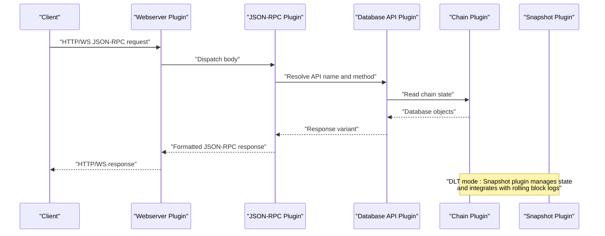

**Diagram sources**
- [plugins/webserver/include/graphene/plugins/webserver/webserver_plugin.hpp:32-57](file://plugins/webserver/include/graphene/plugins/webserver/webserver_plugin.hpp#L32-L57)
- [plugins/json_rpc/include/graphene/plugins/json_rpc/plugin.hpp:109-113](file://plugins/json_rpc/include/graphene/plugins/json_rpc/plugin.hpp#L109-L113)
- [plugins/database_api/include/graphene/plugins/database_api/plugin.hpp:179-403](file://plugins/database_api/include/graphene/plugins/database_api/plugin.hpp#L179-L403)
- [plugins/chain/include/graphene/plugins/chain/plugin.hpp:88-91](file://plugins/chain/include/graphene/plugins/chain/plugin.hpp#L88-L91)
- [plugins/snapshot/include/graphene/plugins/snapshot/plugin.hpp:60-76](file://plugins/snapshot/include/graphene/plugins/snapshot/plugin.hpp#L60-L76)

## Detailed Component Analysis

### JSON-RPC Plugin
- Role: Registers API method bindings and routes incoming JSON-RPC requests to the appropriate plugin API.
- Key behaviors:
  - Maintains a registry of API names and methods.
  - Dispatches calls using a visitor pattern that binds method pointers to variants.
  - Supports error codes standardized for JSON-RPC.

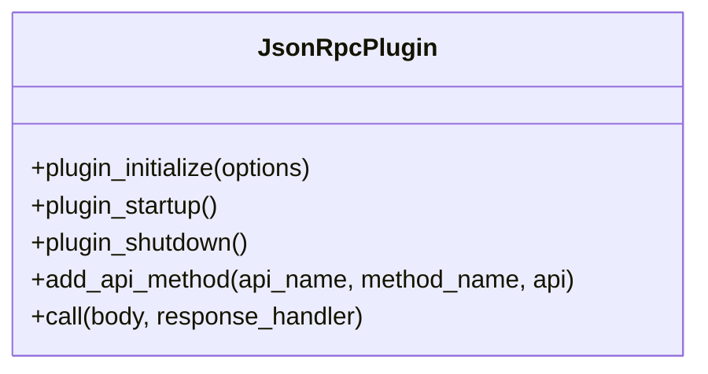

**Diagram sources**
- [plugins/json_rpc/include/graphene/plugins/json_rpc/plugin.hpp:84-118](file://plugins/json_rpc/include/graphene/plugins/json_rpc/plugin.hpp#L84-L118)

**Section sources**
- [plugins/json_rpc/include/graphene/plugins/json_rpc/plugin.hpp:38-55](file://plugins/json_rpc/include/graphene/plugins/json_rpc/plugin.hpp#L38-L55)
- [plugins/json_rpc/include/graphene/plugins/json_rpc/plugin.hpp:109-113](file://plugins/json_rpc/include/graphene/plugins/json_rpc/plugin.hpp#L109-L113)

### Chain Plugin
- Role: Core blockchain engine exposing database accessors, block/transaction acceptance, and synchronization signals.
- Lifecycle hooks: initialize, startup, shutdown.
- Public API surface includes helpers for indices and objects, plus a synchronization signal for dependent plugins.

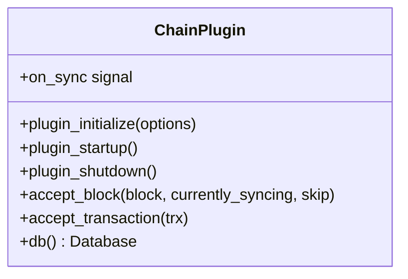

**Diagram sources**
- [plugins/chain/include/graphene/plugins/chain/plugin.hpp:21-96](file://plugins/chain/include/graphene/plugins/chain/plugin.hpp#L21-L96)

**Section sources**
- [plugins/chain/include/graphene/plugins/chain/plugin.hpp:36-42](file://plugins/chain/include/graphene/plugins/chain/plugin.hpp#L36-L42)
- [plugins/chain/include/graphene/plugins/chain/plugin.hpp:88-91](file://plugins/chain/include/graphene/plugins/chain/plugin.hpp#L88-L91)

### Webserver Plugin
- Role: Starts an HTTP/WebSocket server and dispatches JSON-RPC queries to registered handlers on the application io_service thread.
- Dependencies: Requires JSON-RPC plugin.

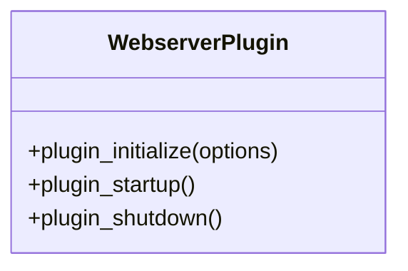

**Diagram sources**
- [plugins/webserver/include/graphene/plugins/webserver/webserver_plugin.hpp:32-57](file://plugins/webserver/include/graphene/plugins/webserver/webserver_plugin.hpp#L32-L57)

**Section sources**
- [plugins/webserver/include/graphene/plugins/webserver/webserver_plugin.hpp:19-31](file://plugins/webserver/include/graphene/plugins/webserver/webserver_plugin.hpp#L19-L31)

### Database API Plugin
- Role: Exposes read-only database queries via JSON-RPC, including blocks, accounts, balances, and chain metadata.
- Dependencies: Requires JSON-RPC and Chain plugins.
- API coverage includes block retrieval, dynamic/global properties, account queries, and more.

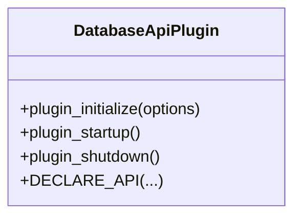

**Diagram sources**
- [plugins/database_api/include/graphene/plugins/database_api/plugin.hpp:179-403](file://plugins/database_api/include/graphene/plugins/database_api/plugin.hpp#L179-L403)

**Section sources**
- [plugins/database_api/include/graphene/plugins/database_api/plugin.hpp:188-191](file://plugins/database_api/include/graphene/plugins/database_api/plugin.hpp#L188-L191)
- [plugins/database_api/include/graphene/plugins/database_api/plugin.hpp:227-398](file://plugins/database_api/include/graphene/plugins/database_api/plugin.hpp#L227-L398)

### Account History Plugin
- Role: Tracks per-account operation histories and exposes retrieval APIs.
- Dependencies: Requires JSON-RPC, Chain, and Operation History plugins.

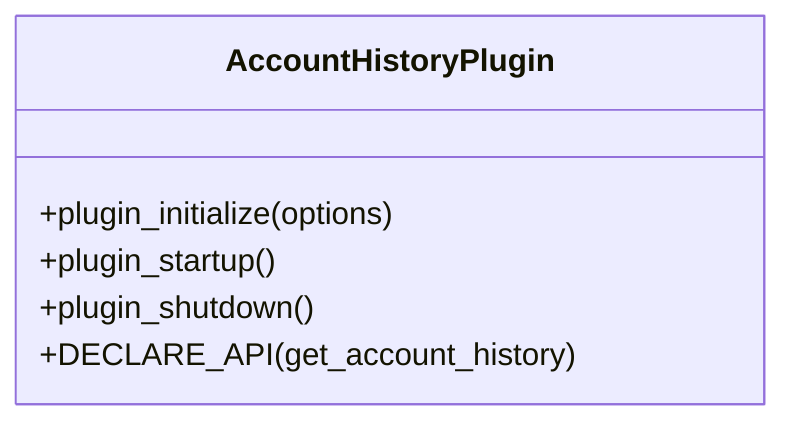

**Diagram sources**
- [plugins/account_history/include/graphene/plugins/account_history/plugin.hpp:59-97](file://plugins/account_history/include/graphene/plugins/account_history/plugin.hpp#L59-L97)

**Section sources**
- [plugins/account_history/include/graphene/plugins/account_history/plugin.hpp:61-65](file://plugins/account_history/include/graphene/plugins/account_history/plugin.hpp#L61-L65)
- [plugins/account_history/include/graphene/plugins/account_history/plugin.hpp:83-92](file://plugins/account_history/include/graphene/plugins/account_history/plugin.hpp#L83-L92)

### P2P Plugin
- Role: Manages peer-to-peer networking, broadcasting blocks/transactions, and block production controls.
- Dependencies: Requires Chain plugin.
- **Maintenance Note**: Uses deprecated configuration options with warnings for migration.
- **DLT Integration**: Automatically falls back to DLT block log when serving blocks not found in main block log.
- **Enhanced Error Handling**: Improved logging and error handling specifically for DLT mode scenarios.

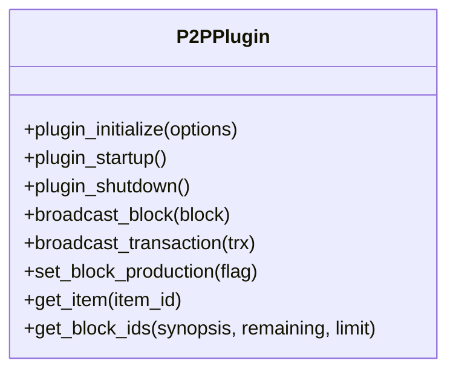

**Diagram sources**
- [plugins/p2p/include/graphene/plugins/p2p/p2p_plugin.hpp:18-52](file://plugins/p2p/include/graphene/plugins/p2p/p2p_plugin.hpp#L18-L52)
- [plugins/p2p/p2p_plugin.cpp:259-277](file://plugins/p2p/p2p_plugin.cpp#L259-L277)

**Section sources**
- [plugins/p2p/include/graphene/plugins/p2p/p2p_plugin.hpp:20-20](file://plugins/p2p/include/graphene/plugins/p2p/p2p_plugin.hpp#L20-L20)
- [plugins/p2p/include/graphene/plugins/p2p/p2p_plugin.hpp:40-49](file://plugins/p2p/include/graphene/plugins/p2p/p2p_plugin.hpp#L40-L49)
- [plugins/p2p/p2p_plugin.cpp:259-277](file://plugins/p2p/p2p_plugin.cpp#L259-L277)

### Mongo DB Plugin
- Role: Integrates with MongoDB for indexing and archival of chain data.
- Dependencies: Requires Chain plugin.

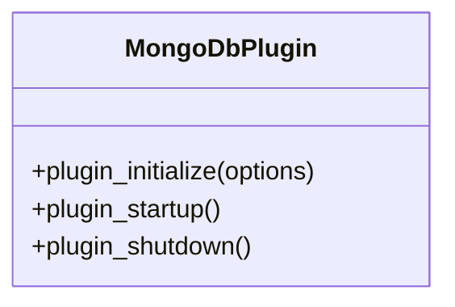

**Diagram sources**
- [plugins/mongo_db/include/graphene/plugins/mongo_db/mongo_db_plugin.hpp:14-47](file://plugins/mongo_db/include/graphene/plugins/mongo_db/mongo_db_plugin.hpp#L14-L47)

**Section sources**
- [plugins/mongo_db/include/graphene/plugins/mongo_db/mongo_db_plugin.hpp:17-19](file://plugins/mongo_db/include/graphene/plugins/mongo_db/mongo_db_plugin.hpp#L17-L19)

### Snapshot Plugin
- Role: Enables DLT (Distributed Ledger Technology) mode operations including snapshot creation, loading, P2P snapshot synchronization, and integration with rolling block logs.
- Dependencies: Requires Chain plugin.
- Key capabilities:
  - Creates compressed state snapshots at specific blocks or periodically
  - Loads state from snapshot files for fast node bootstrap
  - Serves snapshots to other nodes via TCP protocol
  - Manages automatic snapshot cleanup and rotation
  - Integrates with DLT mode for distributed ledger deployments

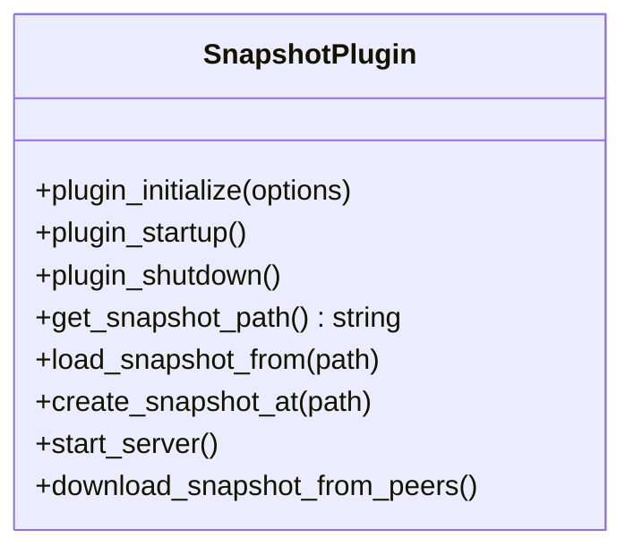

**Diagram sources**
- [plugins/snapshot/include/graphene/plugins/snapshot/plugin.hpp:42-76](file://plugins/snapshot/include/graphene/plugins/snapshot/plugin.hpp#L42-L76)

**Section sources**
- [plugins/snapshot/include/graphene/plugins/snapshot/plugin.hpp:46-87](file://plugins/snapshot/include/graphene/plugins/snapshot/plugin.hpp#L46-L87)

### Plugin Registration and Lifecycle
- Registration: Plugins are enumerated by the build system and registered with the application. Built-in plugins are discovered via the plugins directory traversal.
- Startup: Plugins initialize dependencies, set up program options, and register APIs with the JSON-RPC dispatcher.
- Shutdown: Plugins clean up resources and disconnect signals.

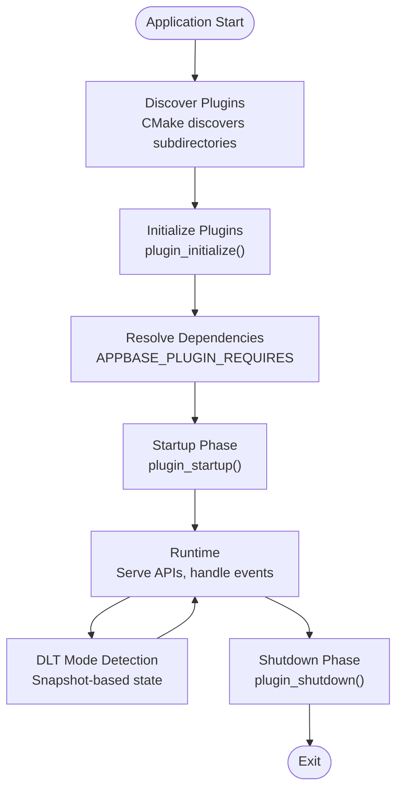

**Diagram sources**
- [plugins/CMakeLists.txt:1-12](file://plugins/CMakeLists.txt#L1-L12)
- [plugins/json_rpc/include/graphene/plugins/json_rpc/plugin.hpp:84-118](file://plugins/json_rpc/include/graphene/plugins/json_rpc/plugin.hpp#L84-L118)
- [plugins/chain/include/graphene/plugins/chain/plugin.hpp:36-42](file://plugins/chain/include/graphene/plugins/chain/plugin.hpp#L36-L42)
- [plugins/snapshot/include/graphene/plugins/snapshot/plugin.hpp:60-76](file://plugins/snapshot/include/graphene/plugins/snapshot/plugin.hpp#L60-L76)

**Section sources**
- [documentation/plugin.md:11-20](file://documentation/plugin.md#L11-L20)
- [plugins/CMakeLists.txt:1-12](file://plugins/CMakeLists.txt#L1-L12)

### Inter-Plugin Communication Patterns
- Shared Database Access: Plugins like Database API and Account History rely on Chain plugin's database interface.
- Event Synchronization: Plugins can subscribe to Chain plugin signals (e.g., on_sync) to coordinate startup behavior.
- Explicit API Calls: Plugins can call APIs exposed by other plugins via the JSON-RPC registry.
- **DLT Mode Coordination**: Snapshot plugin coordinates with Chain plugin for state management and with P2P plugin for snapshot distribution.

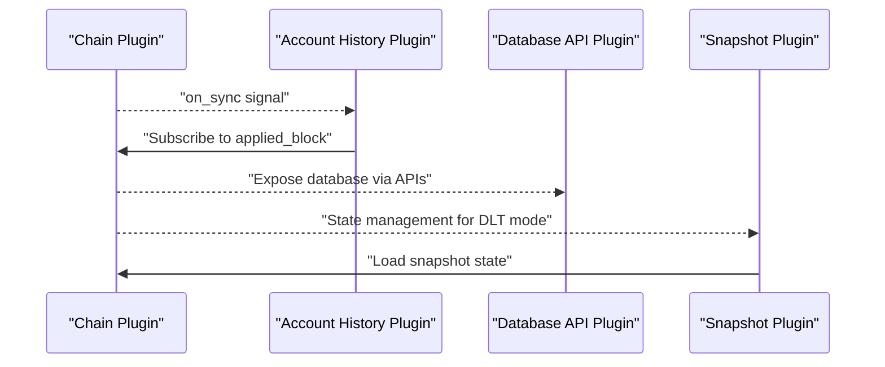

**Diagram sources**
- [plugins/chain/include/graphene/plugins/chain/plugin.hpp:88-91](file://plugins/chain/include/graphene/plugins/chain/plugin.hpp#L88-L91)
- [plugins/account_history/include/graphene/plugins/account_history/plugin.hpp:77-77](file://plugins/account_history/include/graphene/plugins/account_history/plugin.hpp#L77-L77)
- [plugins/database_api/include/graphene/plugins/database_api/plugin.hpp:179-403](file://plugins/database_api/include/graphene/plugins/database_api/plugin.hpp#L179-L403)
- [plugins/snapshot/include/graphene/plugins/snapshot/plugin.hpp:60-76](file://plugins/snapshot/include/graphene/plugins/snapshot/plugin.hpp#L60-L76)

**Section sources**
- [plugins/chain/include/graphene/plugins/chain/plugin.hpp:88-91](file://plugins/chain/include/graphene/plugins/chain/plugin.hpp#L88-L91)
- [plugins/account_history/include/graphene/plugins/account_history/plugin.hpp:77-77](file://plugins/account_history/include/graphene/plugins/account_history/plugin.hpp#L77-L77)

### Built-in Plugins Catalog (Overview)
The following plugins are part of the built-in set. Each plugin exposes specific APIs and integrates with the appbase framework and JSON-RPC dispatcher. Consult individual plugin headers for API declarations and lifecycle hooks.

- chain: Core blockchain database access and block/transaction acceptance.
- webserver: HTTP/WebSocket server for JSON-RPC.
- database_api: Read-only chain state queries.
- account_history: Per-account operation history.
- p2p: Peer-to-peer networking and broadcasting.
- mongo_db: MongoDB integration for archival/indexing.
- json_rpc: JSON-RPC dispatcher and method registry.
- **snapshot**: DLT mode snapshot management and P2P synchronization.
- Additional plugins include: account_by_key, auth_util, block_info, committee_api, custom_protocol_api, debug_node, follow, invite_api, network_broadcast_api, operation_history, paid_subscription_api, private_message, raw_block, social_network, tags, test_api, witness, witness_api.

**Section sources**
- [plugins/chain/include/graphene/plugins/chain/plugin.hpp:21-42](file://plugins/chain/include/graphene/plugins/chain/plugin.hpp#L21-L42)
- [plugins/webserver/include/graphene/plugins/webserver/webserver_plugin.hpp:32-43](file://plugins/webserver/include/graphene/plugins/webserver/webserver_plugin.hpp#L32-L43)
- [plugins/database_api/include/graphene/plugins/database_api/plugin.hpp:179-186](file://plugins/database_api/include/graphene/plugins/database_api/plugin.hpp#L179-L186)
- [plugins/account_history/include/graphene/plugins/account_history/plugin.hpp:59-70](file://plugins/account_history/include/graphene/plugins/account_history/plugin.hpp#L59-L70)
- [plugins/p2p/include/graphene/plugins/p2p/p2p_plugin.hpp:18-32](file://plugins/p2p/include/graphene/plugins/p2p/p2p_plugin.hpp#L18-L32)
- [plugins/mongo_db/include/graphene/plugins/mongo_db/mongo_db_plugin.hpp:14-41](file://plugins/mongo_db/include/graphene/plugins/mongo_db/mongo_db_plugin.hpp#L14-L41)
- [plugins/snapshot/include/graphene/plugins/snapshot/plugin.hpp:42-54](file://plugins/snapshot/include/graphene/plugins/snapshot/plugin.hpp#L42-L54)

### Plugin Development Workflow
- Template-based Creation Tool: Use the provided Python script to generate a plugin skeleton with CMake targets, API headers, and implementation stubs.
- Steps:
  - Run the generator with provider and plugin name to scaffold files.
  - Implement plugin lifecycle methods and register API factory in startup.
  - Declare API methods and integrate with JSON-RPC.
  - Build and enable the plugin via configuration.

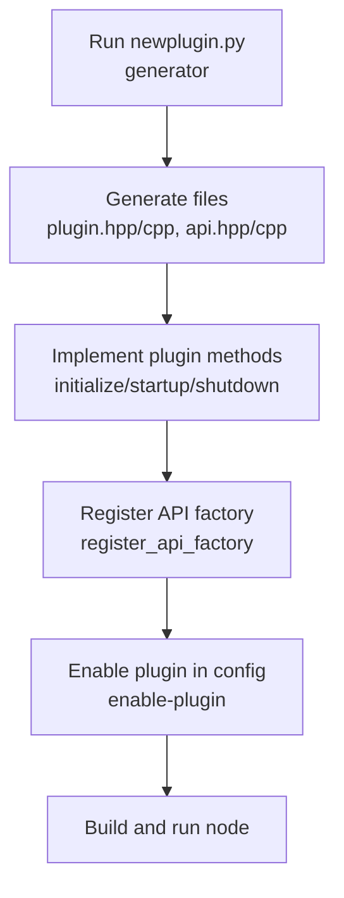

**Diagram sources**
- [programs/util/newplugin.py:225-246](file://programs/util/newplugin.py#L225-L246)
- [programs/util/newplugin.py:168-173](file://programs/util/newplugin.py#L168-L173)

**Section sources**
- [documentation/plugin.md:21-28](file://documentation/plugin.md#L21-L28)
- [programs/util/newplugin.py:225-246](file://programs/util/newplugin.py#L225-L246)

## DLT Mode and Snapshot Integration

### DLT Mode Overview
DLT (Distributed Ledger Technology) mode enables snapshot-based node deployments where the main block log is empty and state is managed through snapshots. This approach significantly reduces bootstrap time and storage requirements for distributed ledger applications.

### Snapshot-Based State Management
The snapshot plugin manages DLT mode operations including:
- **State Loading**: Loads complete blockchain state from snapshot files
- **Periodic Snapshots**: Automatic snapshot creation at specified intervals
- **Snapshot Distribution**: TCP-based P2P synchronization for node bootstrap
- **State Validation**: Integrity checking and verification during snapshot operations

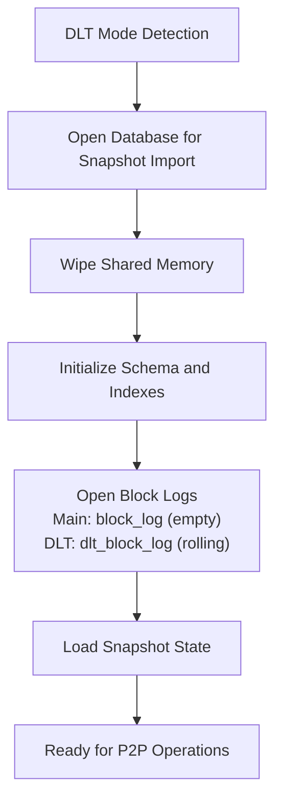

**Diagram sources**
- [libraries/chain/database.cpp:281-324](file://libraries/chain/database.cpp#L281-L324)
- [libraries/chain/database.cpp:292-292](file://libraries/chain/database.cpp#L292-L292)
- [libraries/chain/database.cpp:313-317](file://libraries/chain/database.cpp#L313-L317)

**Section sources**
- [libraries/chain/database.cpp:281-324](file://libraries/chain/database.cpp#L281-L324)
- [libraries/chain/database.cpp:292-292](file://libraries/chain/database.cpp#L292-L292)
- [libraries/chain/database.cpp:313-317](file://libraries/chain/database.cpp#L313-L317)

### DLT Rolling Block Log
In DLT mode, a separate rolling block log (`dlt_block_log`) serves as the primary storage for recent irreversible blocks:

**Key Features:**
- **Offset-Aware Index**: 8-byte header storing first block number
- **Rolling Window**: Configurable size (default: 100,000 blocks)
- **Amortized Cost**: Truncation when window exceeds 2x limit
- **Fallback Mechanism**: P2P layer automatically falls back to DLT log

**Implementation Details:**
- Same binary format as regular block_log
- Memory-mapped file access for performance
- Automatic reconstruction of corrupted indexes
- Temporary file swapping for efficient truncation

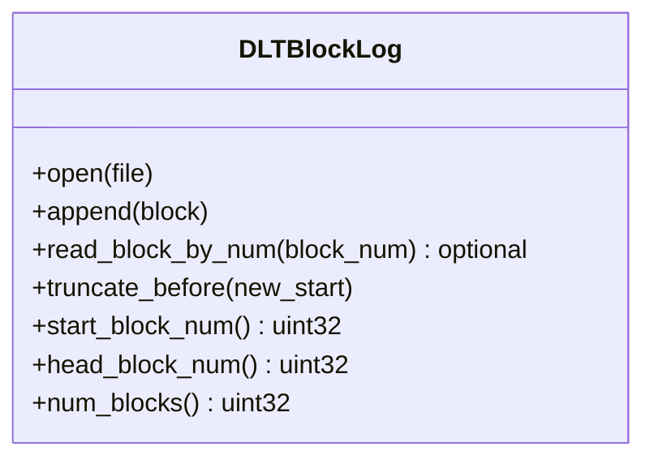

**Diagram sources**
- [libraries/chain/include/graphene/chain/dlt_block_log.hpp:35-72](file://libraries/chain/include/graphene/chain/dlt_block_log.hpp#L35-L72)

**Section sources**
- [libraries/chain/include/graphene/chain/dlt_block_log.hpp:13-33](file://libraries/chain/include/graphene/chain/dlt_block_log.hpp#L13-L33)
- [libraries/chain/dlt_block_log.cpp:1-200](file://libraries/chain/dlt_block_log.cpp#L1-L200)
- [libraries/chain/dlt_block_log.cpp:356-382](file://libraries/chain/dlt_block_log.cpp#L356-L382)

### P2P Integration with DLT Mode
The P2P plugin seamlessly integrates with DLT mode through automatic fallback mechanisms:

**Block Retrieval Flow:**
1. Check main block_log for requested block
2. If not found, check DLT block_log fallback
3. If still not found, check fork database
4. Return appropriate error if block unavailable

**Configuration Options:**
- `dlt-block-log-max-blocks`: Rolling window size (default: 100,000)
- Automatic truncation when exceeding 2x limit
- Amortized cost distribution across block writes

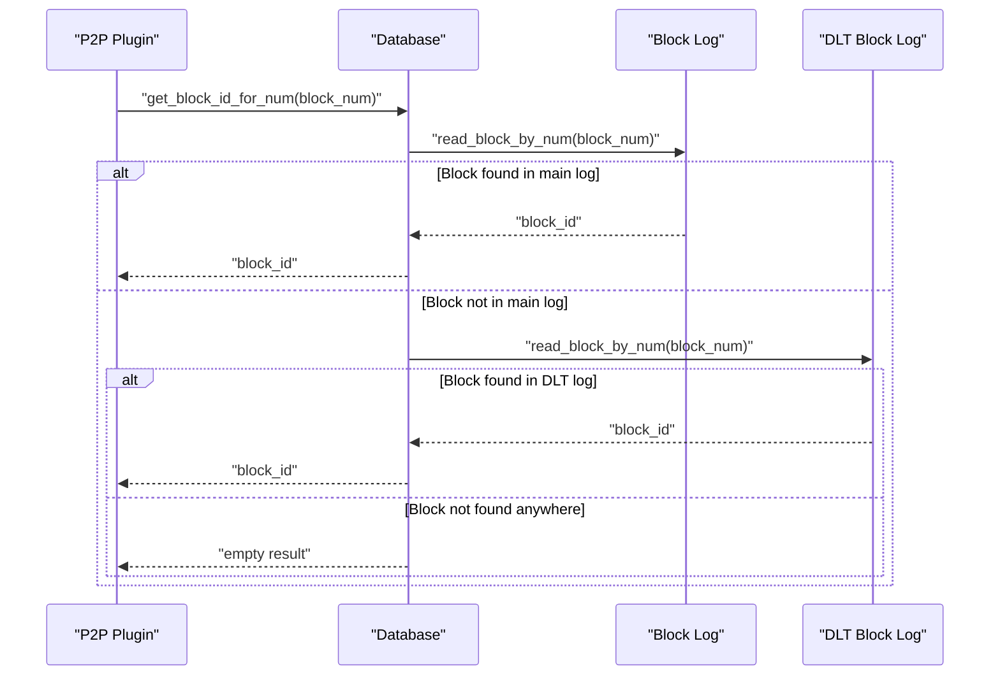

**Diagram sources**
- [plugins/p2p/p2p_plugin.cpp:259-277](file://plugins/p2p/p2p_plugin.cpp#L259-L277)
- [libraries/chain/database.cpp:558-567](file://libraries/chain/database.cpp#L558-L567)
- [libraries/chain/database.cpp:596-600](file://libraries/chain/database.cpp#L596-L600)

**Section sources**
- [libraries/chain/database.cpp:558-567](file://libraries/chain/database.cpp#L558-L567)
- [libraries/chain/database.cpp:596-600](file://libraries/chain/database.cpp#L596-L600)
- [libraries/chain/database.cpp:618-622](file://libraries/chain/database.cpp#L618-L622)

### Snapshot P2P Synchronization
The snapshot plugin provides TCP-based synchronization for distributed deployments:

**Protocol Features:**
- Binary request-response protocol over TCP
- Anti-spam protection (1 connection/IP, 3 connections/hour)
- Chunked transfer with progress reporting
- Integrity verification via checksums

**Trust Model:**
- Public serving: Any IP can download snapshots
- Trusted-only serving: Only IPs from trusted list can download
- Client-side trust: Connects only to specified trusted peers

**Section sources**
- [documentation/snapshot-plugin.md:104-164](file://documentation/snapshot-plugin.md#L104-L164)
- [plugins/snapshot/include/graphene/plugins/snapshot/plugin.hpp:15-41](file://plugins/snapshot/include/graphene/plugins/snapshot/plugin.hpp#L15-L41)

## Enhanced P2P Plugin Integration with DLT Mode Awareness

### Improved Error Handling and Logging
The P2P plugin now includes sophisticated DLT mode awareness with enhanced error handling and logging capabilities:

**DLT Mode Detection Logic:**
- When serving blocks in DLT mode, the P2P plugin detects when block data is not available for blocks outside the DLT log range
- Instead of logging generic errors, it provides specific DLT mode context information
- Uses debug logging (`dlog`) for DLT mode scenarios to avoid flooding error logs

**Enhanced Block Serving Flow:**
1. Attempt to fetch block from main chain database
2. If block not found and DLT mode is active:
   - Log specific DLT mode information using debug logging
   - Throw appropriate exception to indicate block unavailability
3. If not in DLT mode, log detailed error information with block ID correlation

**Logging Improvements:**
- **Debug Logging**: `dlog` statements provide DLT mode context without polluting error logs
- **Error Logging**: `elog` statements provide detailed error information with block ID correlation
- **Context Information**: Both debug and error logs include block ID and expected block number context

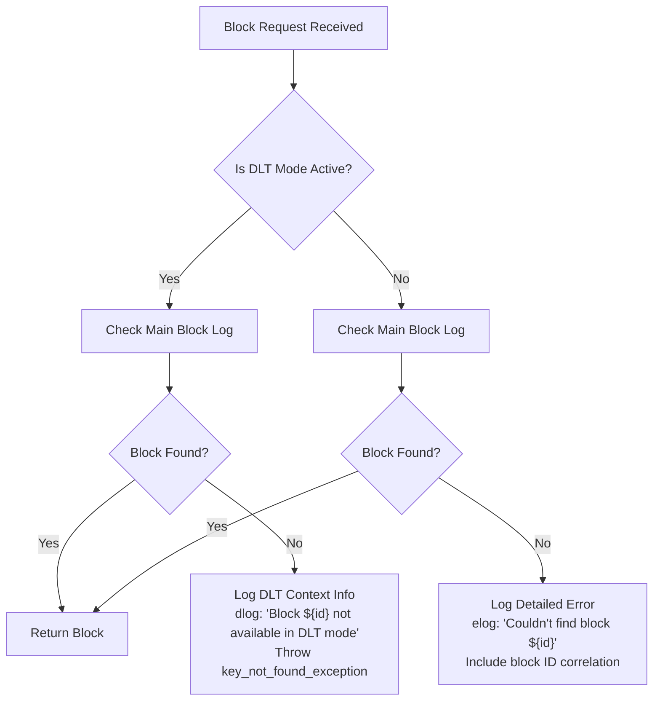

**Diagram sources**
- [plugins/p2p/p2p_plugin.cpp:265-276](file://plugins/p2p/p2p_plugin.cpp#L265-L276)

**Section sources**
- [plugins/p2p/p2p_plugin.cpp:265-276](file://plugins/p2p/p2p_plugin.cpp#L265-L276)

### DLT Mode Block Serving Operations
The P2P plugin now provides enhanced error handling specifically for DLT mode block serving operations:

**Expected Behavior in DLT Mode:**
- Blocks outside the DLT log range are intentionally not available
- This is expected behavior and should not be logged as errors
- The P2P layer handles this gracefully by falling back to other peers

**Error Handling Strategy:**
- **DLT Mode**: Use debug logging with `dlog` to indicate expected unavailability
- **Non-DLT Mode**: Use error logging with `elog` to report unexpected failures
- **Exception Handling**: Throw appropriate exceptions to signal block unavailability

**Section sources**
- [plugins/p2p/p2p_plugin.cpp:265-276](file://plugins/p2p/p2p_plugin.cpp#L265-L276)

### Database Integration Enhancements
The database layer provides comprehensive fallback mechanisms for DLT mode:

**Multi-Level Block Retrieval:**
1. **TAPoS Buffer**: Fastest check for reversible blocks
2. **Main Block Log**: Irreversible blocks
3. **DLT Block Log**: Recent blocks in DLT mode
4. **Fork Database**: Alternative chain blocks

**DLT Mode Fallback Logic:**
- Main block log fallback for DLT mode scenarios
- Automatic detection of DLT mode availability
- Graceful degradation when DLT log is empty or unavailable

**Section sources**
- [libraries/chain/database.cpp:558-580](file://libraries/chain/database.cpp#L558-L580)
- [libraries/chain/database.cpp:599-620](file://libraries/chain/database.cpp#L599-L620)
- [libraries/chain/database.cpp:623-640](file://libraries/chain/database.cpp#L623-L640)

## Dependency Analysis
Plugins declare explicit dependencies using APPBASE_PLUGIN_REQUIRES. The JSON-RPC plugin is a central dependency for most plugins that expose APIs. The Chain plugin is often required by stateful plugins.

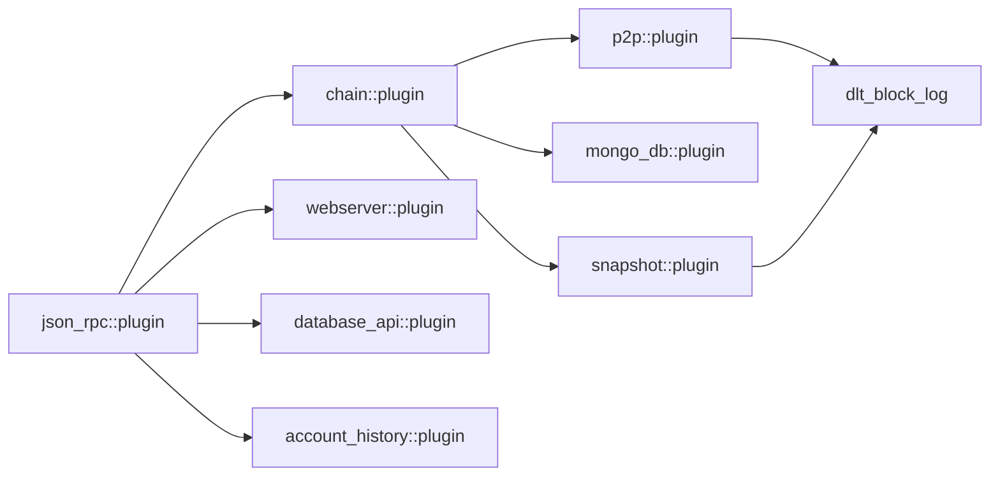

**Diagram sources**
- [plugins/json_rpc/include/graphene/plugins/json_rpc/plugin.hpp:84-118](file://plugins/json_rpc/include/graphene/plugins/json_rpc/plugin.hpp#L84-L118)
- [plugins/chain/include/graphene/plugins/chain/plugin.hpp:21-24](file://plugins/chain/include/graphene/plugins/chain/plugin.hpp#L21-L24)
- [plugins/webserver/include/graphene/plugins/webserver/webserver_plugin.hpp:32-38](file://plugins/webserver/include/graphene/plugins/webserver/webserver_plugin.hpp#L32-L38)
- [plugins/database_api/include/graphene/plugins/database_api/plugin.hpp:188-191](file://plugins/database_api/include/graphene/plugins/database_api/plugin.hpp#L188-L191)
- [plugins/account_history/include/graphene/plugins/account_history/plugin.hpp:61-65](file://plugins/account_history/include/graphene/plugins/account_history/plugin.hpp#L61-L65)
- [plugins/p2p/include/graphene/plugins/p2p/p2p_plugin.hpp:20-20](file://plugins/p2p/include/graphene/plugins/p2p/p2p_plugin.hpp#L20-L20)
- [plugins/mongo_db/include/graphene/plugins/mongo_db/mongo_db_plugin.hpp:17-19](file://plugins/mongo_db/include/graphene/plugins/mongo_db/mongo_db_plugin.hpp#L17-L19)
- [plugins/snapshot/include/graphene/plugins/snapshot/plugin.hpp:44-44](file://plugins/snapshot/include/graphene/plugins/snapshot/plugin.hpp#L44-L44)
- [libraries/chain/include/graphene/chain/dlt_block_log.hpp:35-35](file://libraries/chain/include/graphene/chain/dlt_block_log.hpp#L35-L35)

**Section sources**
- [plugins/chain/include/graphene/plugins/chain/plugin.hpp:21-24](file://plugins/chain/include/graphene/plugins/chain/plugin.hpp#L21-L24)
- [plugins/database_api/include/graphene/plugins/database_api/plugin.hpp:188-191](file://plugins/database_api/include/graphene/plugins/database_api/plugin.hpp#L188-L191)
- [plugins/account_history/include/graphene/plugins/account_history/plugin.hpp:61-65](file://plugins/account_history/include/graphene/plugins/account_history/plugin.hpp#L61-L65)
- [plugins/p2p/include/graphene/plugins/p2p/p2p_plugin.hpp:20-20](file://plugins/p2p/include/graphene/plugins/p2p/p2p_plugin.hpp#L20-L20)
- [plugins/mongo_db/include/graphene/plugins/mongo_db/mongo_db_plugin.hpp:17-19](file://plugins/mongo_db/include/graphene/plugins/mongo_db/mongo_db_plugin.hpp#L17-L19)
- [plugins/snapshot/include/graphene/plugins/snapshot/plugin.hpp:44-44](file://plugins/snapshot/include/graphene/plugins/snapshot/plugin.hpp#L44-L44)

## Plugin Deprecation Status and Maintenance Practices

### Deprecation Overview
The VIZ blockchain platform maintains strict deprecation policies for operations and plugins that are no longer supported. Understanding deprecation status is crucial for maintaining compatibility and avoiding runtime errors.

### Deprecated Operations
Several blockchain operations have been deprecated as part of hardfork implementations:

#### Hardfork 4 Deprecations
- **vote_operation**: Voting operations are deprecated as of Hardfork 4
- **content_operation**: Content creation/update operations are deprecated as of Hardfork 4  
- **delete_content_operation**: Content deletion operations are deprecated as of Hardfork 4

These operations are explicitly marked as deprecated in the operations header and validated in chain evaluators with hardfork checks.

**Section sources**
- [libraries/protocol/include/graphene/protocol/operations.hpp:14-27](file://libraries/protocol/include/graphene/protocol/operations.hpp#L14-L27)
- [libraries/chain/chain_evaluator.cpp:216-216](file://libraries/chain/chain_evaluator.cpp#L216-L216)
- [libraries/chain/chain_evaluator.cpp:551-551](file://libraries/chain/chain_evaluator.cpp#L551-L551)
- [libraries/chain/chain_evaluator.cpp:1296-1296](file://libraries/chain/chain_evaluator.cpp#L1296-L1296)

### Plugin Configuration Deprecations
Several plugin configuration options have been deprecated in favor of newer alternatives:

#### P2P Plugin Deprecations
- **seed-node**: Deprecated in favor of `p2p-seed-node`
- **force-validate**: Deprecated in favor of `p2p-force-validate`

Both deprecations emit warnings during plugin initialization and support graceful migration by accepting both old and new option formats.

**Section sources**
- [plugins/p2p/p2p_plugin.cpp:499-528](file://plugins/p2p/p2p_plugin.cpp#L499-L528)

#### Debug Node Plugin Deprecations
- **edit-script**: Deprecated in favor of `debug-node-edit-script`

The debug node plugin maintains backward compatibility by logging warnings and merging deprecated options with their modern equivalents.

**Section sources**
- [plugins/debug_node/plugin.cpp:124-128](file://plugins/debug_node/plugin.cpp#L124-L128)

### Maintenance Best Practices

#### Migration Strategies
1. **Configuration Migration**: Replace deprecated configuration options with their modern equivalents
2. **Operation Updates**: Update client applications to use supported alternatives
3. **Plugin Updates**: Monitor plugin deprecation notices and migrate to maintained alternatives
4. **DLT Mode Adoption**: Consider migrating to DLT mode for improved performance and reduced storage requirements

#### Monitoring Deprecation Warnings
Plugins emit warnings when deprecated features are detected:
- P2P plugin logs warnings for deprecated seed-node and force-validate options
- Debug node plugin logs warnings for deprecated edit-script option
- Chain evaluators enforce hardfork-based operation deprecations

#### Testing and Validation
- Test with deprecated operations to identify compatibility issues
- Monitor warning logs for deprecated feature usage
- Validate migration paths before hardfork activation
- Test DLT mode configurations for proper snapshot and block log operation

### Practical Examples

#### Handling Deprecated P2P Configuration
```ini
# Deprecated (will show warning)
seed-node = 192.168.0.1:4243

# Recommended approach
p2p-seed-node = 192.168.0.1:4243
```

#### Managing Deprecated Operations
When encountering deprecation errors:
1. Check current hardfork status using chain operations
2. Update client applications to use supported alternatives
3. Monitor deprecation warnings in plugin logs

#### DLT Mode Configuration Example
```ini
# Enable DLT mode with snapshot support
plugin = snapshot
snapshot-every-n-blocks = 100000
snapshot-dir = /var/lib/vizd/snapshots
dlt-block-log-max-blocks = 100000

# Configure P2P for DLT mode
plugin = p2p
```

**Section sources**
- [plugins/p2p/p2p_plugin.cpp:499-528](file://plugins/p2p/p2p_plugin.cpp#L499-L528)
- [plugins/debug_node/plugin.cpp:124-128](file://plugins/debug_node/plugin.cpp#L124-L128)
- [libraries/chain/chain_evaluator.cpp:216-216](file://libraries/chain/chain_evaluator.cpp#L216-L216)

## Performance Considerations
- JSON-RPC Overhead: Each request incurs serialization/deserialization and method dispatch overhead. Batch requests and minimize unnecessary API calls.
- Database Access: Heavy queries against the chain database should be cached or paginated to avoid latency spikes.
- Threading Model: Webserver runs on its own io_service thread to isolate HTTP processing from other plugins.
- Signal Usage: Prefer signals for lightweight coordination; avoid heavy computation inside connected slots.
- Storage Backends: Plugins like mongo_db introduce additional write amplification; tune indexing and batching strategies.
- **DLT Mode Benefits**: Snapshot-based nodes eliminate block log storage requirements and enable instant bootstrap times.
- **DLT Mode Overhead**: Rolling block log requires additional disk I/O for recent block storage and truncation operations.
- **Enhanced Error Handling**: Improved logging reduces error noise while providing better context information for debugging.
- **Maintenance Impact**: Deprecated plugins may have reduced performance due to compatibility layers and should be migrated to supported alternatives.

## Troubleshooting Guide
- Plugin Not Found:
  - Ensure the plugin directory exists and contains a CMakeLists.txt; the build system enumerates subdirectories.
- API Not Available:
  - Verify the plugin is enabled and public-api is configured if exposing public endpoints.
  - Confirm the plugin registered its API factory during startup.
- Replay Required:
  - Some plugins maintain persistent records; disabling/enabling them may require a replay.
- Authentication:
  - Use api-user to protect sensitive APIs.
- **DLT Mode Issues**:
  - Verify snapshot files exist and are accessible
  - Check DLT block log configuration and permissions
  - Monitor rolling window truncation logs
  - Validate P2P fallback to DLT block log
  - **Enhanced Error Handling**: Check debug logs for DLT mode context information
  - **DLT Mode Logging**: Look for specific DLT mode debug messages indicating expected block unavailability
- **Deprecation Issues**:
  - Check for deprecation warnings in plugin logs
  - Review deprecated operations and migrate to supported alternatives
  - Update configuration options to use non-deprecated values
  - Monitor hardfork compliance for operation usage

**Section sources**
- [documentation/plugin.md:11-20](file://documentation/plugin.md#L11-L20)
- [plugins/CMakeLists.txt:1-12](file://plugins/CMakeLists.txt#L1-L12)
- [plugins/p2p/p2p_plugin.cpp:499-528](file://plugins/p2p/p2p_plugin.cpp#L499-L528)
- [plugins/debug_node/plugin.cpp:124-128](file://plugins/debug_node/plugin.cpp#L124-L128)
- [libraries/chain/database.cpp:292-292](file://libraries/chain/database.cpp#L292-L292)

## Conclusion
The VIZ C++ Node plugin system leverages appbase to deliver a modular, extensible architecture. Plugins integrate seamlessly through JSON-RPC, share the chain database, and coordinate via signals. The template-based development tool accelerates custom plugin creation, while configuration options govern exposure and security. With 40+ built-in plugins spanning core blockchain functionality to specialized integrations, the system supports diverse use cases from public APIs to archival pipelines.

**Updated** The system now includes comprehensive DLT mode support with snapshot-based state management, rolling block log integration, and P2P layer compatibility. The enhanced P2P plugin integration with DLT mode awareness provides improved error handling and logging capabilities for DLT mode block serving operations, reducing error noise while providing better context information for debugging distributed ledger deployments.

## Appendices

### Appendix A: Plugin Lifecycle Reference
- Discovery: Build system scans plugins directory and sets available plugin list.
- Initialization: plugin_initialize parses options and prepares state.
- Startup: plugin_startup registers APIs and connects to chain/database signals.
- Shutdown: plugin_shutdown tears down connections and cleans up.

**Section sources**
- [plugins/CMakeLists.txt:1-12](file://plugins/CMakeLists.txt#L1-L12)
- [plugins/json_rpc/include/graphene/plugins/json_rpc/plugin.hpp:103-107](file://plugins/json_rpc/include/graphene/plugins/json_rpc/plugin.hpp#L103-L107)
- [plugins/chain/include/graphene/plugins/chain/plugin.hpp:36-42](file://plugins/chain/include/graphene/plugins/chain/plugin.hpp#L36-L42)

### Appendix B: Configuration Options
- enable-plugin: Comma-separated list of plugin names to activate.
- public-api: Comma-separated list of public API names to expose.
- api-user: Username/password protection for APIs.
- **DLT Mode Options**: 
  - `dlt-block-log-max-blocks`: Rolling window size for DLT block log (default: 100,000)
  - `snapshot-at-block`: Create snapshot at specific block number
  - `snapshot-every-n-blocks`: Create periodic snapshots (0 = disabled)
  - `snapshot-dir`: Directory for auto-generated snapshots
- **Deprecated Options**: seed-node (use p2p-seed-node), force-validate (use p2p-force-validate), edit-script (use debug-node-edit-script).

**Section sources**
- [documentation/plugin.md:11-20](file://documentation/plugin.md#L11-L20)
- [share/vizd/config/config.ini](file://share/vizd/config/config.ini)
- [plugins/p2p/p2p_plugin.cpp:499-528](file://plugins/p2p/p2p_plugin.cpp#L499-L528)
- [plugins/debug_node/plugin.cpp:124-128](file://plugins/debug_node/plugin.cpp#L124-L128)
- [documentation/snapshot-plugin.md:142-164](file://documentation/snapshot-plugin.md#L142-L164)

### Appendix C: Deprecation Timeline
- Hardfork 4: vote_operation, content_operation, delete_content_operation deprecated
- Future Hardforks: Monitor operation deprecation notices and prepare migration plans
- Plugin Deprecations: Regular review and replacement of deprecated plugin functionality
- **DLT Mode Introduction**: Snapshot-based DLT mode with rolling block log support
- **Enhanced P2P Integration**: Improved DLT mode awareness with sophisticated error handling and logging

**Section sources**
- [libraries/protocol/include/graphene/protocol/operations.hpp:14-27](file://libraries/protocol/include/graphene/protocol/operations.hpp#L14-L27)
- [libraries/chain/chain_evaluator.cpp:216-216](file://libraries/chain/chain_evaluator.cpp#L216-L216)
- [libraries/chain/chain_evaluator.cpp:551-551](file://libraries/chain/chain_evaluator.cpp#L551-L551)
- [libraries/chain/chain_evaluator.cpp:1296-1296](file://libraries/chain/chain_evaluator.cpp#L1296-L1296)
- [libraries/chain/database.cpp:292-292](file://libraries/chain/database.cpp#L292-L292)