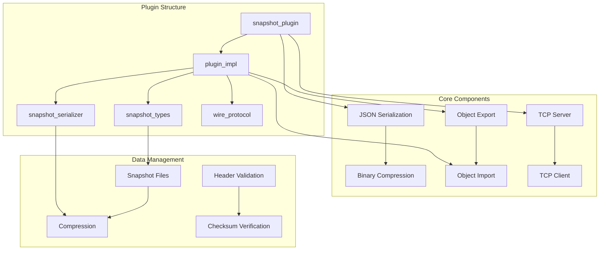
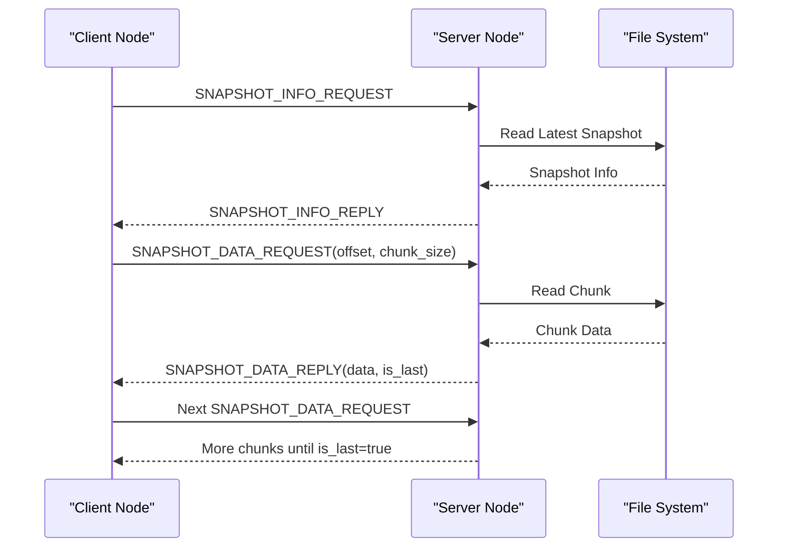
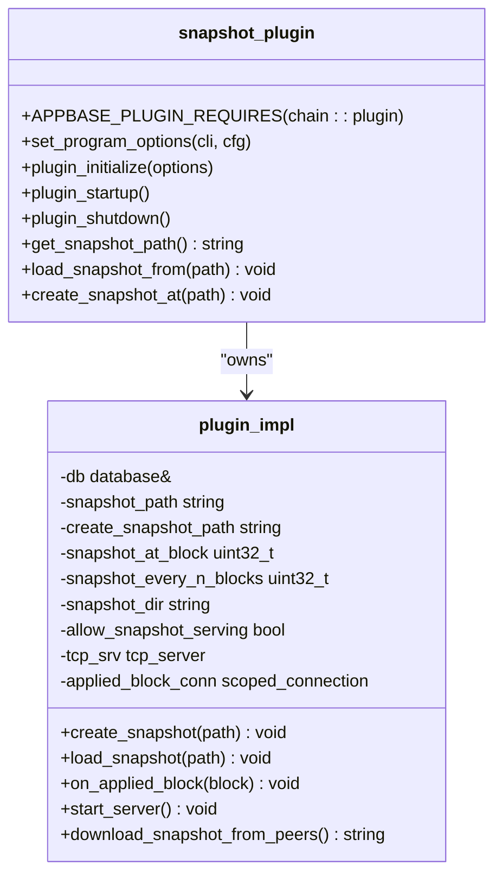
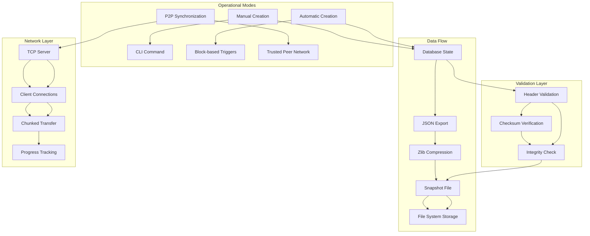
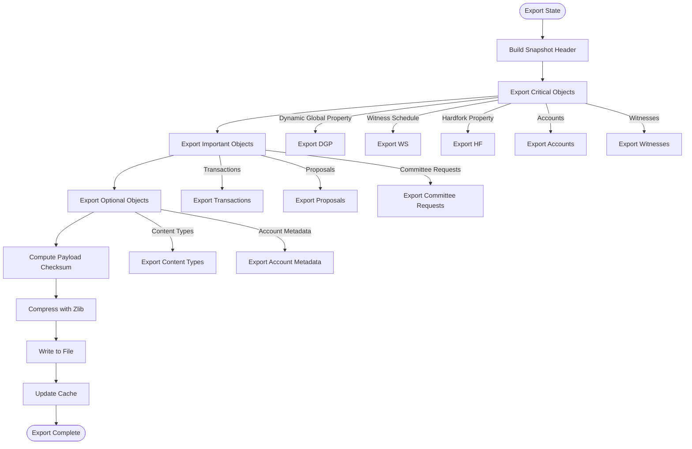
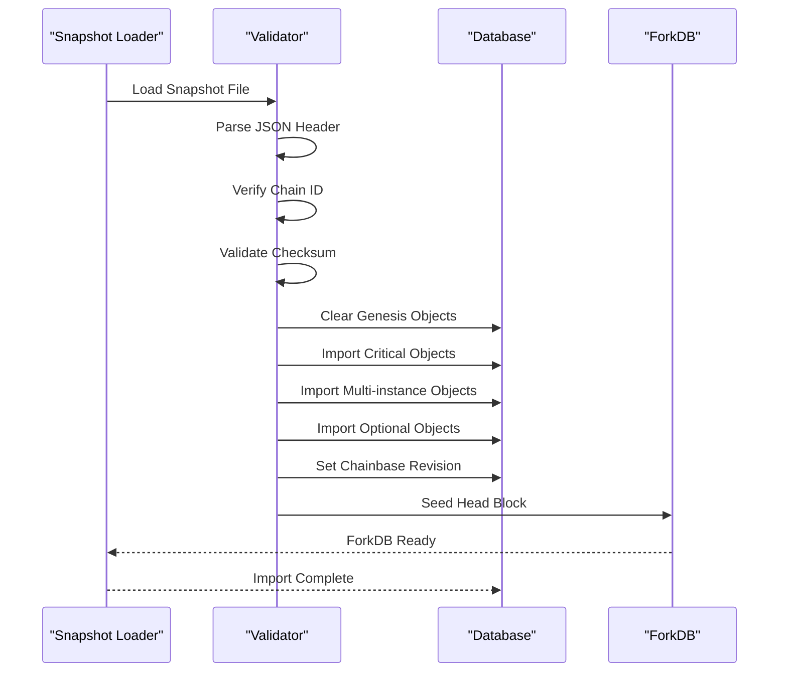
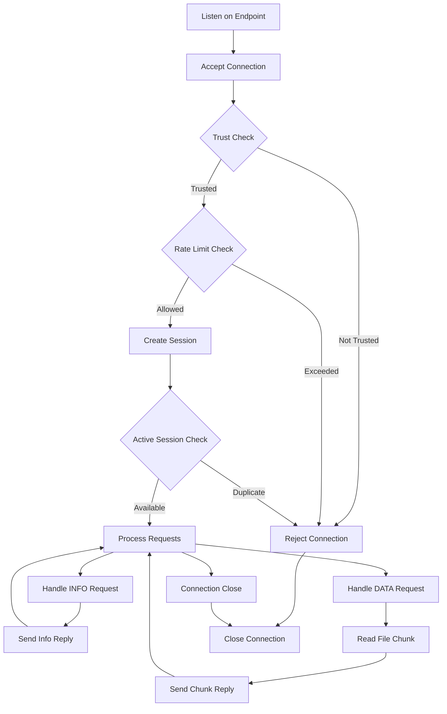
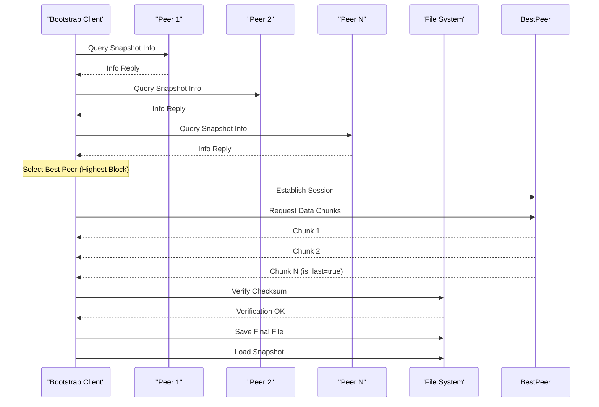
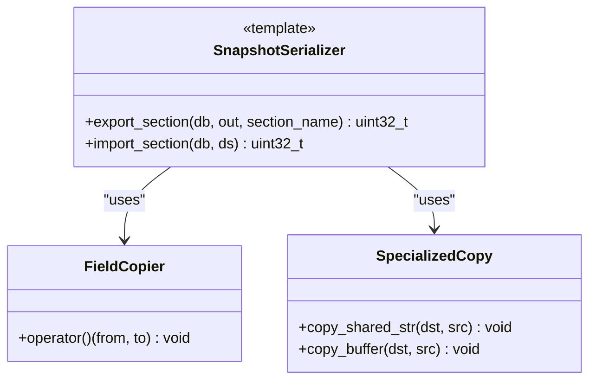
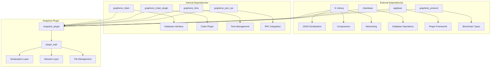

# Snapshot Plugin System

<cite>
**Referenced Files in This Document**
- [plugin.hpp](file://plugins/snapshot/include/graphene/plugins/snapshot/plugin.hpp)
- [snapshot_serializer.hpp](file://plugins/snapshot/include/graphene/plugins/snapshot/snapshot_serializer.hpp)
- [snapshot_types.hpp](file://plugins/snapshot/include/graphene/plugins/snapshot/snapshot_types.hpp)
- [plugin.cpp](file://plugins/snapshot/plugin.cpp)
- [CMakeLists.txt](file://plugins/snapshot/CMakeLists.txt)
- [snapshot-plugin.md](file://documentation/snapshot-plugin.md)
- [snapshot.json](file://share/vizd/snapshot.json)
</cite>

## Table of Contents
1. [Introduction](#introduction)
2. [Project Structure](#project-structure)
3. [Core Components](#core-components)
4. [Architecture Overview](#architecture-overview)
5. [Detailed Component Analysis](#detailed-component-analysis)
6. [Dependency Analysis](#dependency-analysis)
7. [Performance Considerations](#performance-considerations)
8. [Troubleshooting Guide](#troubleshooting-guide)
9. [Conclusion](#conclusion)

## Introduction

The Snapshot Plugin System is a comprehensive solution for managing DLT (Distributed Ledger Technology) state snapshots in VIZ blockchain nodes. This system enables efficient node bootstrapping, state synchronization between nodes, and automated snapshot management through a sophisticated TCP-based protocol.

The plugin provides three primary capabilities:
- **State Creation**: Generate compressed JSON snapshots containing complete blockchain state
- **State Loading**: Rapidly bootstrap nodes from existing snapshots instead of replaying blocks
- **P2P Synchronization**: Enable nodes to serve and download snapshots from trusted peers

This system is particularly valuable for DLT mode operations where traditional block logs are not maintained, allowing nodes to quickly synchronize state from any recent block.

## Project Structure

The snapshot plugin follows a modular architecture with clear separation of concerns:



**Diagram sources**
- [plugin.cpp:40-745](file://plugins/snapshot/plugin.cpp#L40-L745)
- [plugin.hpp:42-76](file://plugins/snapshot/include/graphene/plugins/snapshot/plugin.hpp#L42-L76)

**Section sources**
- [plugin.cpp:1-800](file://plugins/snapshot/plugin.cpp#L1-L800)
- [CMakeLists.txt:1-51](file://plugins/snapshot/CMakeLists.txt#L1-L51)

## Core Components

### Snapshot Types and Constants

The plugin defines a comprehensive set of types and constants for snapshot management:

**Snapshot Format Specifications:**
- **Magic Bytes**: `0x015A4956` (VIZ signature)
- **Format Version**: 1.0
- **Compression**: Zlib-compressed JSON format
- **File Extensions**: `.vizjson` or `.json`

**Section Types:**
- `section_header`: Contains snapshot metadata
- `section_objects`: Serialized blockchain objects
- `section_fork_db_block`: Fork database initialization
- `section_checksum`: Integrity verification data
- `section_end`: File termination marker

**Section sources**
- [snapshot_types.hpp:16-43](file://plugins/snapshot/include/graphene/plugins/snapshot/snapshot_types.hpp#L16-L43)

### Wire Protocol Messages

The snapshot synchronization protocol uses a binary message format:



**Diagram sources**
- [plugin.cpp:1249-1617](file://plugins/snapshot/plugin.cpp#L1249-L1617)

**Section sources**
- [plugin.hpp:15-40](file://plugins/snapshot/include/graphene/plugins/snapshot/plugin.hpp#L15-L40)

### Plugin Implementation Classes

The plugin uses a two-tier architecture with clear separation between public interface and implementation:



**Diagram sources**
- [plugin.hpp:42-76](file://plugins/snapshot/include/graphene/plugins/snapshot/plugin.hpp#L42-L76)
- [plugin.cpp:665-745](file://plugins/snapshot/plugin.cpp#L665-L745)

**Section sources**
- [plugin.cpp:665-745](file://plugins/snapshot/plugin.cpp#L665-L745)

## Architecture Overview

The snapshot plugin implements a comprehensive state management system with multiple operational modes:



**Diagram sources**
- [plugin.cpp:843-1203](file://plugins/snapshot/plugin.cpp#L843-L1203)
- [plugin.cpp:1409-1617](file://plugins/snapshot/plugin.cpp#L1409-L1617)

The architecture supports three primary use cases:
1. **Manual Snapshot Creation**: Generate snapshots on demand for backup or distribution
2. **Automatic Snapshot Generation**: Create snapshots at specific block heights or intervals
3. **P2P Snapshot Synchronization**: Enable nodes to bootstrap from trusted peers

**Section sources**
- [plugin.cpp:1767-1976](file://plugins/snapshot/plugin.cpp#L1767-L1976)
- [snapshot-plugin.md:1-164](file://documentation/snapshot-plugin.md#L1-L164)

## Detailed Component Analysis

### State Export and Serialization

The snapshot system employs a sophisticated export mechanism that converts database state into a portable format:



**Diagram sources**
- [plugin.cpp:747-841](file://plugins/snapshot/plugin.cpp#L747-L841)
- [plugin.cpp:843-935](file://plugins/snapshot/plugin.cpp#L843-L935)

The export process handles different object categories with varying complexity:

**Critical Objects**: Singleton objects that require modification rather than creation
- Dynamic Global Property
- Witness Schedule  
- Hardfork Property

**Multi-instance Objects**: Objects that require ID management and creation
- Accounts and Authorities
- Witnesses and Votes
- Content and Content Types
- Transactions and Block Summaries

**Section sources**
- [plugin.cpp:1036-1186](file://plugins/snapshot/plugin.cpp#L1036-L1186)

### Object Import and Validation

The import process reverses the export operation with comprehensive validation:



**Diagram sources**
- [plugin.cpp:980-1203](file://plugins/snapshot/plugin.cpp#L980-L1203)

The import process includes several validation steps:
1. **File Format Validation**: Ensures proper JSON structure and magic bytes
2. **Chain ID Verification**: Confirms compatibility with local chain configuration
3. **Checksum Validation**: Verifies data integrity using SHA256
4. **Object Validation**: Validates each imported object against protocol requirements

**Section sources**
- [plugin.cpp:1010-1032](file://plugins/snapshot/plugin.cpp#L1010-L1032)

### TCP Server Implementation

The snapshot server provides secure, rate-limited access to snapshot files:



**Diagram sources**
- [plugin.cpp:1409-1544](file://plugins/snapshot/plugin.cpp#L1409-L1544)

The server implements multiple anti-abuse mechanisms:
- **Session Limiting**: Prevents multiple concurrent downloads per IP
- **Rate Limiting**: Limits connections to 3 per hour per IP
- **Trust Enforcement**: Optional restriction to trusted peer list
- **Timeout Protection**: 60-second connection timeout

**Section sources**
- [plugin.cpp:1449-1500](file://plugins/snapshot/plugin.cpp#L1449-L1500)

### TCP Client Implementation

The client component enables automatic snapshot synchronization from trusted peers:



**Diagram sources**
- [plugin.cpp:1623-1758](file://plugins/snapshot/plugin.cpp#L1623-L1758)

**Section sources**
- [plugin.cpp:1623-1758](file://plugins/snapshot/plugin.cpp#L1623-L1758)

### Snapshot Serializer Utilities

The serializer provides specialized handling for complex object types:



**Diagram sources**
- [snapshot_serializer.hpp:37-157](file://plugins/snapshot/include/graphene/plugins/snapshot/snapshot_serializer.hpp#L37-L157)

The serializer handles two distinct object categories:
- **Simple Objects**: Standard types with straightforward field copying
- **Complex Objects**: Types with shared_string and buffer_type members requiring specialized handling

**Section sources**
- [snapshot_serializer.hpp:125-157](file://plugins/snapshot/include/graphene/plugins/snapshot/snapshot_serializer.hpp#L125-L157)

## Dependency Analysis

The snapshot plugin has a well-defined dependency structure that integrates with the broader VIZ ecosystem:



**Diagram sources**
- [CMakeLists.txt:27-37](file://plugins/snapshot/CMakeLists.txt#L27-L37)

The plugin's dependencies are carefully managed to minimize coupling while maximizing functionality:

**External Dependencies**:
- **fc Library**: Provides core serialization, compression, and networking capabilities
- **chainbase**: Handles database operations and object lifecycle management
- **appbase**: Manages plugin lifecycle and application integration

**Internal Dependencies**:
- **graphene_chain**: Access to blockchain state and database operations
- **graphene_protocol**: Blockchain-specific data types and structures
- **graphene_time**: Time-related operations for snapshot metadata

**Section sources**
- [CMakeLists.txt:27-37](file://plugins/snapshot/CMakeLists.txt#L27-L37)

## Performance Considerations

The snapshot plugin is designed with several performance optimizations:

### Memory Management
- **Streaming Operations**: Large snapshot files are processed in chunks to minimize memory usage
- **Lazy Loading**: Objects are imported incrementally rather than loading entire datasets
- **Efficient Compression**: Zlib compression reduces storage requirements by 70-85%

### Network Efficiency
- **Chunked Transfers**: 1MB chunk sizes balance throughput and memory usage
- **Connection Pooling**: Limited concurrent connections prevent resource exhaustion
- **Anti-Spam Measures**: Rate limiting prevents abuse while maintaining service availability

### Database Optimization
- **Batch Operations**: Objects are imported in batches to reduce database overhead
- **ID Management**: Pre-allocated ID spaces prevent database fragmentation
- **Transaction Batching**: Multiple objects are committed in single transactions

### File System Operations
- **Asynchronous I/O**: Non-blocking file operations improve responsiveness
- **Atomic Operations**: Temporary files ensure data integrity during transfers
- **Cleanup Automation**: Automatic removal of old snapshots prevents disk space accumulation

## Troubleshooting Guide

### Common Issues and Solutions

**Snapshot Creation Failures**
- **Symptom**: `Failed to open snapshot file for writing`
- **Cause**: Insufficient permissions or invalid path
- **Solution**: Verify write permissions and directory existence

**Snapshot Loading Errors**
- **Symptom**: `Chain ID mismatch: snapshot=${s}, node=${n}`
- **Cause**: Attempting to load snapshot from different blockchain network
- **Solution**: Use compatible snapshot or reconfigure chain parameters

**Network Connection Problems**
- **Symptom**: `Connection closed while reading/writing`
- **Cause**: Network interruption or peer shutdown
- **Solution**: Retry connection or check peer availability

**Memory Exhaustion During Import**
- **Symptom**: Out-of-memory errors during snapshot import
- **Cause**: Insufficient RAM for large snapshot files
- **Solution**: Increase system memory or use smaller snapshot files

**Section sources**
- [plugin.cpp:986-1032](file://plugins/snapshot/plugin.cpp#L986-L1032)
- [plugin.cpp:1252-1303](file://plugins/snapshot/plugin.cpp#L1252-L1303)

### Diagnostic Commands

**Verify Snapshot Integrity**
```bash
# Check snapshot file validity
file /path/to/snapshot-file.vizjson

# Verify compression
zcat /path/to/snapshot-file.vizjson | head -n 5

# Check file size and modification time
ls -la /path/to/snapshot-file.vizjson
```

**Monitor Network Activity**
```bash
# Monitor snapshot server connections
netstat -an | grep :8092

# Check firewall rules
iptables -L | grep 8092

# Monitor bandwidth usage
iftop -i eth0
```

**Debug Plugin Operations**
```bash
# Enable verbose logging
vizd --plugin=snapshot --log-level=debug

# Check plugin configuration
vizd --help | grep snapshot
```

## Conclusion

The Snapshot Plugin System represents a sophisticated solution for blockchain state management, providing essential capabilities for node bootstrapping, state synchronization, and automated snapshot management. The system's modular architecture, comprehensive validation mechanisms, and robust networking support make it suitable for production environments requiring reliable and efficient state synchronization.

Key strengths of the system include:
- **Comprehensive Coverage**: Handles all major blockchain object types
- **Robust Security**: Multiple layers of validation and anti-abuse protection
- **Scalable Design**: Efficient memory and network usage patterns
- **Flexible Deployment**: Supports manual, automatic, and P2P synchronization modes

The plugin's integration with the broader VIZ ecosystem ensures seamless operation alongside existing blockchain infrastructure, while its well-documented APIs and configuration options facilitate easy deployment and maintenance.

Future enhancements could include support for incremental snapshots, distributed snapshot verification, and enhanced compression algorithms to further optimize storage and transfer efficiency.