# Snapshot Plugin System

<cite>
**Referenced Files in This Document**
- [plugin.hpp](file://plugins/snapshot/include/graphene/plugins/snapshot/plugin.hpp)
- [snapshot_serializer.hpp](file://plugins/snapshot/include/graphene/plugins/snapshot/snapshot_serializer.hpp)
- [snapshot_types.hpp](file://plugins/snapshot/include/graphene/plugins/snapshot/snapshot_types.hpp)
- [plugin.cpp](file://plugins/snapshot/plugin.cpp)
- [CMakeLists.txt](file://plugins/snapshot/CMakeLists.txt)
- [snapshot-plugin.md](file://documentation/snapshot-plugin.md)
- [snapshot.json](file://share/vizd/snapshot.json)
- [database.hpp](file://libraries/chain/include/graphene/chain/database.hpp)
- [database.cpp](file://libraries/chain/database.cpp)
- [plugin.cpp](file://plugins/chain/plugin.cpp)
- [plugin.hpp](file://plugins/chain/include/graphene/plugins/chain/plugin.hpp)
- [dlt_block_log.cpp](file://libraries/chain/dlt_block_log.cpp)
- [dlt_block_log.hpp](file://libraries/chain/include/graphene/chain/dlt_block_log.hpp)
</cite>

## Update Summary
**Changes Made**
- Enhanced error handling with comprehensive exception handling and graceful shutdown mechanisms
- Implemented intelligent retry loops with configurable intervals for P2P snapshot synchronization
- Added automatic fallback to P2P genesis sync when trusted peers are unavailable
- Improved user feedback with detailed progress logging and status reporting
- Strengthened stalled sync detection with automatic recovery capabilities
- Enhanced timeout management with 30-second configurable intervals for all peer operations
- Improved anti-spam protection with max 5 concurrent connections and rate limiting
- Enhanced payload size limits with increased maximum from 64KB to 256KB for protocol messages
- Improved client disconnection handling with try-catch mechanisms for graceful error management
- Strengthened logging for Phase 1 info-only queries versus active transfers with clear distinction

## Table of Contents
1. [Introduction](#introduction)
2. [Project Structure](#project-structure)
3. [Core Components](#core-components)
4. [Architecture Overview](#architecture-overview)
5. [Detailed Component Analysis](#detailed-component-analysis)
6. [Enhanced State Restoration Process](#enhanced-state-restoration-process)
7. [Enhanced P2P Snapshot Synchronization](#enhanced-p2p-snapshot-synchronization)
8. [Stalled Sync Detection and Automatic Recovery](#stalled-sync-detection-and-automatic-recovery)
9. [Improved Logging and Progress Feedback](#improved-logging-and-progress-feedback)
10. [Automatic Directory Management](#automatic-directory-management)
11. [Enhanced Chain Plugin Integration](#enhanced-chain-plugin-integration)
12. [Enhanced Security and Anti-Spam Measures](#enhanced-security-and-anti-spam-measures)
13. [DLT Mode Capabilities](#dlt-mode-capabilities)
14. [Dependency Analysis](#dependency-analysis)
15. [Performance Considerations](#performance-considerations)
16. [Troubleshooting Guide](#troubleshooting-guide)
17. [Conclusion](#conclusion)

## Introduction

The Snapshot Plugin System is a comprehensive solution for managing DLT (Distributed Ledger Technology) state snapshots in VIZ blockchain nodes. This system enables efficient node bootstrapping, state synchronization between nodes, and automated snapshot management through a sophisticated TCP-based protocol.

**Updated**: Enhanced with improved P2P snapshot synchronization featuring automatic default behavior for empty nodes, real-time progress feedback during operations, automatic directory creation capabilities, and seamless integration with the chain plugin for automatic snapshot synchronization during blockchain initialization. The system now includes comprehensive timeout management, robust anti-spam protection, and DLT mode support.

The plugin provides seven primary capabilities:
- **State Creation**: Generate compressed JSON snapshots containing complete blockchain state
- **State Loading**: Rapidly bootstrap nodes from existing snapshots instead of replaying blocks
- **P2P Synchronization**: Enable nodes to serve and download snapshots from trusted peers
- **Automatic Directory Management**: Intelligent snapshot file organization with automatic creation
- **Real-time Progress Monitoring**: Comprehensive logging and progress feedback throughout operations
- **Stalled Sync Detection**: Automatic detection of stalled synchronization with snapshot recovery
- **DLT Mode Integration**: Seamless DLT mode activation during snapshot loading and operations
- **Enhanced Error Handling**: Comprehensive exception handling with graceful shutdown mechanisms
- **Intelligent Retry Loops**: Configurable retry intervals for P2P snapshot synchronization
- **Automatic Fallback**: Fallback to P2P genesis sync when trusted peers are unavailable
- **Improved User Feedback**: Detailed progress logging and status reporting for all operations

This system is particularly valuable for DLT mode operations where traditional block logs are not maintained, allowing nodes to quickly synchronize state from any recent block.

## Project Structure

The snapshot plugin follows a modular architecture with clear separation of concerns:

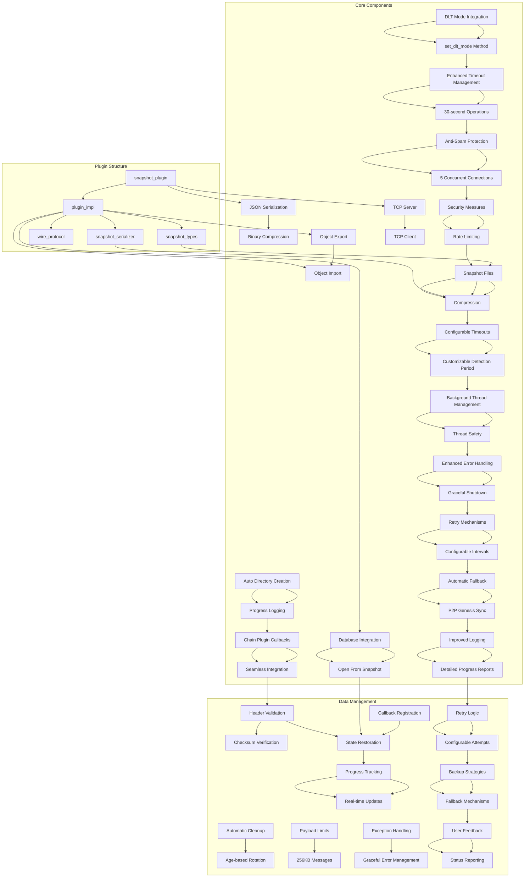

**Diagram sources**
- [plugin.cpp:40-745](file://plugins/snapshot/plugin.cpp#L40-L745)
- [plugin.hpp:42-76](file://plugins/snapshot/include/graphene/plugins/snapshot/plugin.hpp#L42-L76)
- [database.cpp:281-324](file://libraries/chain/database.cpp#L281-L324)

**Section sources**
- [plugin.cpp:1-800](file://plugins/snapshot/plugin.cpp#L1-L800)
- [CMakeLists.txt:1-51](file://plugins/snapshot/CMakeLists.txt#L1-L51)

## Core Components

### Snapshot Types and Constants

The plugin defines a comprehensive set of types and constants for snapshot management:

**Snapshot Format Specifications:**
- **Magic Bytes**: `0x015A4956` (VIZ signature)
- **Format Version**: 1.0
- **Compression**: Zlib-compressed JSON format
- **File Extensions**: `.vizjson` or `.json`

**Section Types:**
- `section_header`: Contains snapshot metadata
- `section_objects`: Serialized blockchain objects
- `section_fork_db_block`: Fork database initialization
- `section_checksum`: Integrity verification data
- `section_end`: File termination marker

**Section sources**
- [snapshot_types.hpp:16-43](file://plugins/snapshot/include/graphene/plugins/snapshot/snapshot_types.hpp#L16-L43)

### Wire Protocol Messages

The snapshot synchronization protocol uses a binary message format:

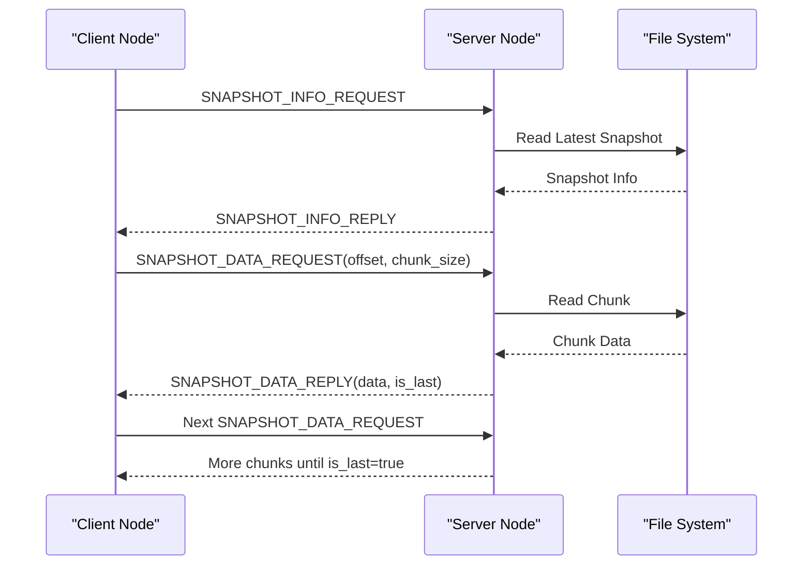

**Diagram sources**
- [plugin.cpp:1249-1617](file://plugins/snapshot/plugin.cpp#L1249-L1617)

**Section sources**
- [plugin.hpp:15-40](file://plugins/snapshot/include/graphene/plugins/snapshot/plugin.hpp#L15-L40)

### Plugin Implementation Classes

The plugin uses a two-tier architecture with clear separation between public interface and implementation:

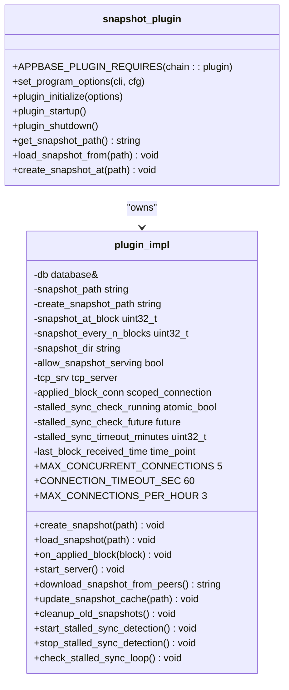

**Diagram sources**
- [plugin.hpp:42-76](file://plugins/snapshot/include/graphene/plugins/snapshot/plugin.hpp#L42-L76)
- [plugin.cpp:665-745](file://plugins/snapshot/plugin.cpp#L665-L745)

**Section sources**
- [plugin.cpp:665-745](file://plugins/snapshot/plugin.cpp#L665-L745)

## Architecture Overview

The snapshot plugin implements a comprehensive state management system with multiple operational modes:

```mermaid
graph TB
subgraph "Operational Modes"
A[Manual Creation] --> B[CLI Command]
C[Automatic Creation] --> D[Block-based Triggers]
E[P2P Synchronization] --> F[Trusted Peer Network]
G[Direct State Loading] --> H[Programmatic API]
I[Automatic Empty Node Sync] --> J[Default Behavior]
K[DLT Mode Integration] --> L[set_dlt_mode Method]
M[Stalled Sync Detection] --> N[Automatic Recovery]
O[Configurable Timeout System] --> P[30-second Operations]
Q[Anti-Spam Protection] --> R[5 Concurrent Connections]
S[Security Measures] --> T[Rate Limiting]
U[Enhanced Payload Limits] --> V[256KB Messages]
W[Improved Client Handling] --> X[Graceful Disconnection]
Y[Enhanced Error Handling] --> Z[Graceful Shutdown]
AA[Intelligent Retry Loops] --> BB[Configurable Intervals]
CC[Automatic Fallback] --> DD[P2P Genesis Sync]
EE[Improved User Feedback] --> FF[Detailed Progress Logs]
end
subgraph "Data Flow"
M --> Y
Y --> G
G --> H
H --> I
I --> J
J --> K
K --> L
L --> N
N --> O
O --> P
P --> Q
Q --> R
R --> S
S --> T
T --> U
U --> V
V --> W
W --> X
X --> Y
Y --> Z
Z --> AA
AA --> BB
BB --> CC
CC --> DD
DD --> EE
EE --> FF
FF --> GG[Background Thread Monitoring]
GG --> HH[Check Last Block Time]
HH --> II[Timeout Detection]
II --> JJ[Query Trusted Peers]
JJ --> KK[Download Newer Snapshot]
KK --> LL[Reload State]
LL --> MM[Restart Monitoring]
end
subgraph "Network Layer"
MM --> NN[Client Connections]
NN --> OO[Chunked Transfer]
OO --> PP[Progress Tracking]
QQ[Automatic Cleanup] --> RR[Age-based Rotation]
SS[Trusted Peer Enforcement] --> TT[Security]
UU[Connection Timeout] --> VV[60-second Enforcement]
WW[Thread Safety] --> XX[Mutex Protection]
YY[Background Processing] --> ZZ[Async Operations]
AA[Enhanced Exception Handling] --> BB[Graceful Error Management]
CC[Retry Mechanisms] --> DD[Configurable Attempt Limits]
EE[Automatic Fallback] --> FF[Genesis Sync Backup]
GG[Improved Logging] --> HH[Comprehensive Status Reports]
```

**Diagram sources**
- [plugin.cpp:843-1203](file://plugins/snapshot/plugin.cpp#L843-L1203)
- [plugin.cpp:1409-1617](file://plugins/snapshot/plugin.cpp#L1409-L1617)
- [database.cpp:281-324](file://libraries/chain/database.cpp#L281-L324)

The architecture supports seven primary use cases:
1. **Manual Snapshot Creation**: Generate snapshots on demand for backup or distribution
2. **Automatic Snapshot Generation**: Create snapshots at specific block heights or intervals
3. **P2P Snapshot Synchronization**: Enable nodes to bootstrap from trusted peers
4. **Direct State Loading**: Programmatic loading of snapshots through the `open_from_snapshot` method
5. **Automatic Empty Node Synchronization**: Seamless snapshot synchronization for nodes with empty state
6. **Stalled Sync Detection**: Automatic detection and recovery from stalled synchronization
7. **DLT Mode Operations**: Seamless DLT mode activation and management during snapshot operations
8. **Enhanced Error Handling**: Comprehensive exception handling with graceful shutdown mechanisms
9. **Intelligent Retry Loops**: Configurable retry intervals for P2P snapshot synchronization
10. **Automatic Fallback**: Fallback to P2P genesis sync when trusted peers are unavailable
11. **Improved User Feedback**: Detailed progress logging and status reporting for all operations

**Section sources**
- [plugin.cpp:1767-1976](file://plugins/snapshot/plugin.cpp#L1767-L1976)
- [snapshot-plugin.md:1-164](file://documentation/snapshot-plugin.md#L1-L164)

## Detailed Component Analysis

### State Export and Serialization

The snapshot system employs a sophisticated export mechanism that converts database state into a portable format:

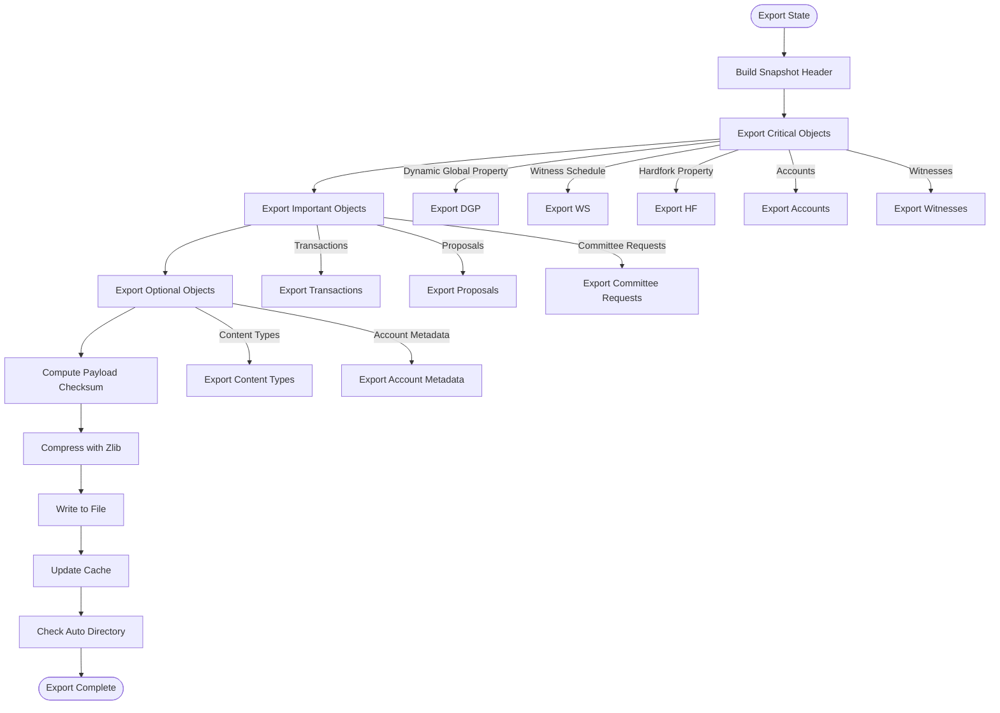

**Diagram sources**
- [plugin.cpp:747-841](file://plugins/snapshot/plugin.cpp#L747-L841)
- [plugin.cpp:843-935](file://plugins/snapshot/plugin.cpp#L843-L935)

The export process handles different object categories with varying complexity:

**Critical Objects**: Singleton objects that require modification rather than creation
- Dynamic Global Property
- Witness Schedule  
- Hardfork Property

**Multi-instance Objects**: Objects that require ID management and creation
- Accounts and Authorities
- Witnesses and Votes
- Content and Content Types
- Transactions and Block Summaries

**Section sources**
- [plugin.cpp:1036-1186](file://plugins/snapshot/plugin.cpp#L1036-L1186)

### Object Import and Validation

The import process reverses the export operation with comprehensive validation:

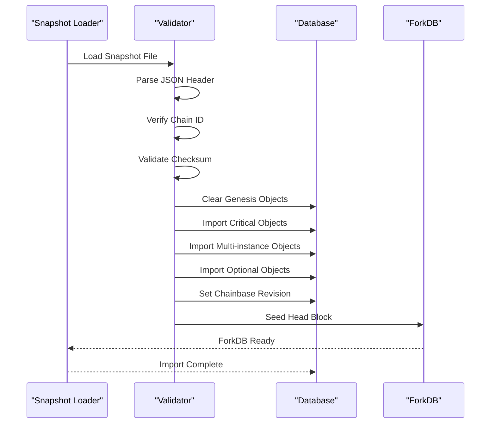

**Diagram sources**
- [plugin.cpp:980-1203](file://plugins/snapshot/plugin.cpp#L980-L1203)

The import process includes several validation steps:
1. **File Format Validation**: Ensures proper JSON structure and magic bytes
2. **Chain ID Verification**: Confirms compatibility with local chain configuration
3. **Checksum Validation**: Verifies data integrity using SHA256
4. **Object Validation**: Validates each imported object against protocol requirements

**Section sources**
- [plugin.cpp:1010-1032](file://plugins/snapshot/plugin.cpp#L1010-L1032)

### TCP Server Implementation

The snapshot server provides secure, rate-limited access to snapshot files with comprehensive anti-spam protection:

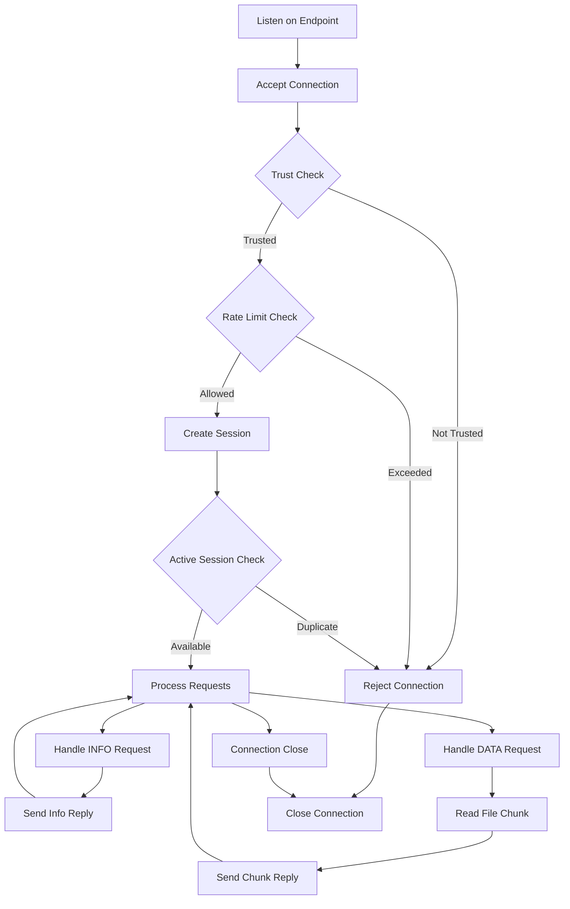

**Diagram sources**
- [plugin.cpp:1409-1544](file://plugins/snapshot/plugin.cpp#L1409-L1544)

The server implements multiple anti-abuse mechanisms:
- **Session Limiting**: Prevents multiple concurrent downloads per IP
- **Rate Limiting**: Limits connections to 3 per hour per IP
- **Trust Enforcement**: Optional restriction to trusted peer list
- **Timeout Protection**: 60-second connection timeout
- **Concurrent Connection Control**: Maximum 5 simultaneous connections

**Section sources**
- [plugin.cpp:1449-1500](file://plugins/snapshot/plugin.cpp#L1449-L1500)

### TCP Client Implementation

The client component enables automatic snapshot synchronization from trusted peers with comprehensive timeout management:

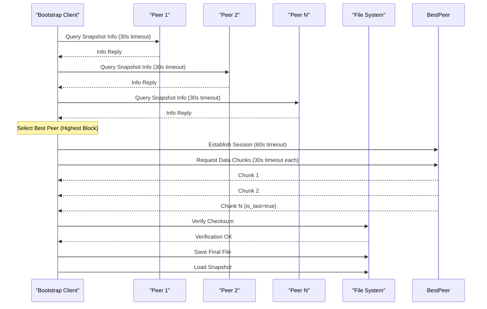

**Diagram sources**
- [plugin.cpp:1623-1758](file://plugins/snapshot/plugin.cpp#L1623-L1758)

**Section sources**
- [plugin.cpp:1623-1758](file://plugins/snapshot/plugin.cpp#L1623-L1758)

### Snapshot Serializer Utilities

The serializer provides specialized handling for complex object types:

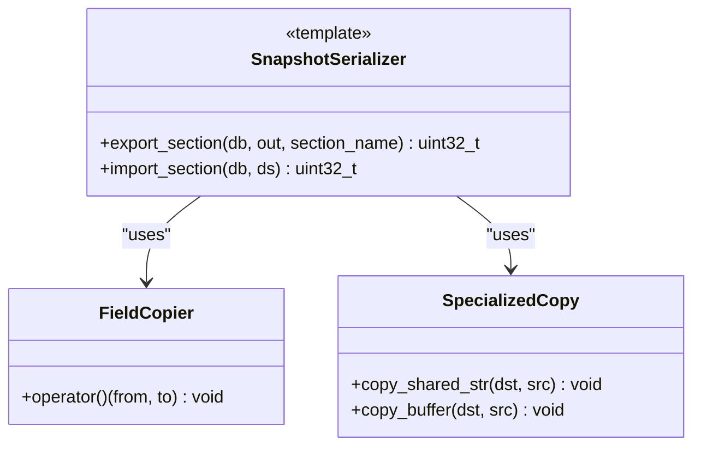

**Diagram sources**
- [snapshot_serializer.hpp:37-157](file://plugins/snapshot/include/graphene/plugins/snapshot/snapshot_serializer.hpp#L37-L157)

The serializer handles two distinct object categories:
- **Simple Objects**: Standard types with straightforward field copying
- **Complex Objects**: Types with shared_string and buffer_type members requiring specialized handling

**Section sources**
- [snapshot_serializer.hpp:125-157](file://plugins/snapshot/include/graphene/plugins/snapshot/snapshot_serializer.hpp#L125-L157)

## Enhanced State Restoration Process

**Updated**: The state restoration process has been significantly enhanced with improved error handling, validation, and integration with the database layer.

### Database Integration and Callback Registration

The snapshot plugin now integrates deeply with the chain plugin through a callback-based architecture:

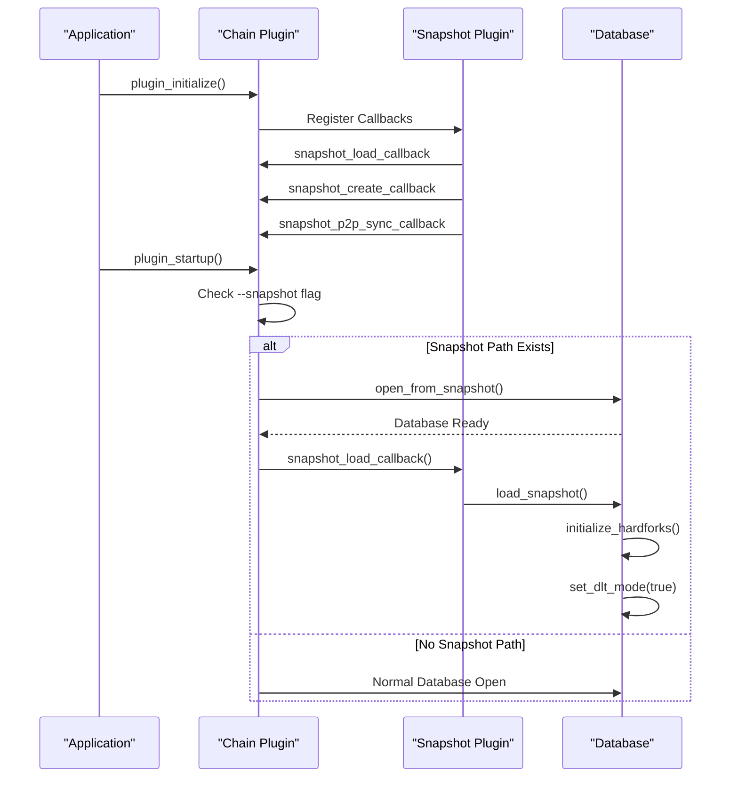

**Diagram sources**
- [plugin.cpp:1872-1918](file://plugins/snapshot/plugin.cpp#L1872-L1918)
- [database.cpp:281-324](file://libraries/chain/database.cpp#L281-L324)

### Enhanced Error Handling and Validation

The state restoration process now includes comprehensive error handling and validation:

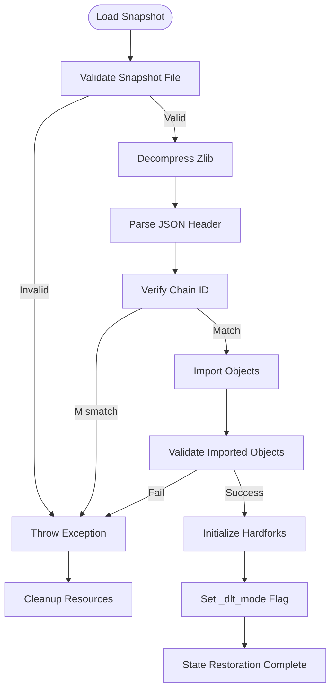

**Diagram sources**
- [plugin.cpp:980-1203](file://plugins/snapshot/plugin.cpp#L980-L1203)

### Direct State Loading via Programmatic API

**New**: The snapshot plugin now provides programmatic access to state loading through the `load_snapshot_from` method:

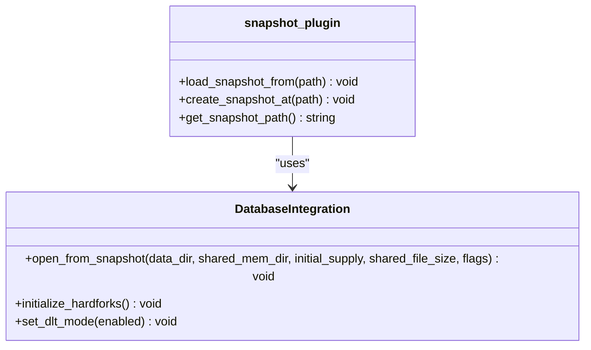

**Diagram sources**
- [plugin.hpp:67-71](file://plugins/snapshot/include/graphene/plugins/snapshot/plugin.hpp#L67-L71)
- [database.hpp:102-107](file://libraries/chain/include/graphene/chain/database.hpp#L102-L107)

**Section sources**
- [plugin.cpp:1872-1918](file://plugins/snapshot/plugin.cpp#L1872-L1918)
- [database.cpp:281-324](file://libraries/chain/database.cpp#L281-L324)

## Enhanced P2P Snapshot Synchronization

**Updated**: The P2P snapshot synchronization has been enhanced with automatic default behavior for empty nodes, providing seamless bootstrap capabilities with comprehensive timeout management and intelligent retry mechanisms.

### Automatic Empty Node Detection and Synchronization

The system now automatically detects empty nodes (where head_block_num == 0) and initiates snapshot synchronization:

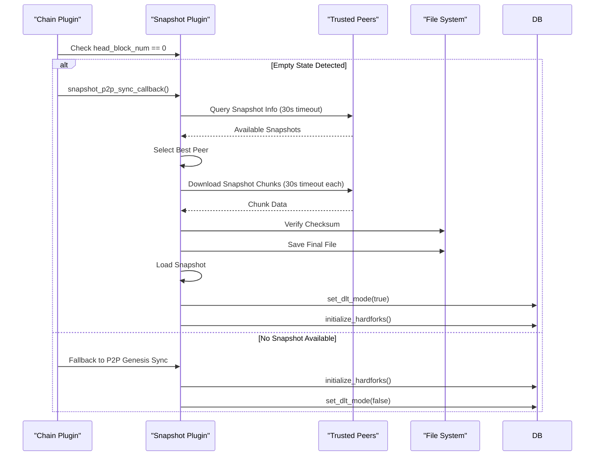

**Diagram sources**
- [plugin.cpp:1956-1981](file://plugins/snapshot/plugin.cpp#L1956-L1981)

### Enhanced Peer Selection Algorithm

The peer selection process now includes intelligent ranking based on snapshot quality and network proximity:

```mermaid
flowchart TD
Start([Peer Discovery]) --> Query[Query All Peers (30s timeout)]
Query --> Collect[Collect Snapshot Info]
Collect --> Rank[Rank by Quality Metrics]
Rank --> |Multiple Peers| Compare[Compare Block Numbers]
Rank --> |Single Peer| Select[Select Best Peer]
Compare --> |Equal Blocks| CompareSize[Compare File Sizes]
Compare --> |Different Blocks| Select
CompareSize --> |Equal Sizes| CompareLatency[Compare Latency]
CompareSize --> |Different Sizes| Select
CompareLatency --> Select
Select --> Download[Download Snapshot Chunks (30s timeout each)]
Download --> Verify[Verify Checksum]
Verify --> Load[Load Snapshot]
```

**Diagram sources**
- [plugin.cpp:1651-1710](file://plugins/snapshot/plugin.cpp#L1651-L1710)

### Intelligent Retry Loops with Configurable Intervals

**New**: The P2P synchronization now implements intelligent retry loops with configurable intervals:


**Diagram sources**
- [plugin.cpp:2244-2284](file://plugins/snapshot/plugin.cpp#L2244-L2284)

**Section sources**
- [plugin.cpp:1956-1981](file://plugins/snapshot/plugin.cpp#L1956-L1981)
- [plugin.cpp:1651-1710](file://plugins/snapshot/plugin.cpp#L1651-L1710)
- [plugin.cpp:2244-2284](file://plugins/snapshot/plugin.cpp#L2244-L2284)

### Enhanced Timeout Management

**Updated**: All peer operations now use a comprehensive 30-second timeout system for improved reliability and security:

The snapshot system implements a robust timeout framework for all network operations:


**Diagram sources**
- [plugin.cpp:1282-1400](file://plugins/snapshot/plugin.cpp#L1282-L1400)

**Section sources**
- [plugin.cpp:1282-1400](file://plugins/snapshot/plugin.cpp#L1282-L1400)

## Stalled Sync Detection and Automatic Recovery

**New**: The snapshot plugin now includes a comprehensive stalled sync detection system that automatically monitors synchronization health and recovers from stalled conditions by downloading newer snapshots from trusted peers.

### Stalled Sync Detection Architecture

The system implements a background monitoring thread that continuously tracks synchronization health:

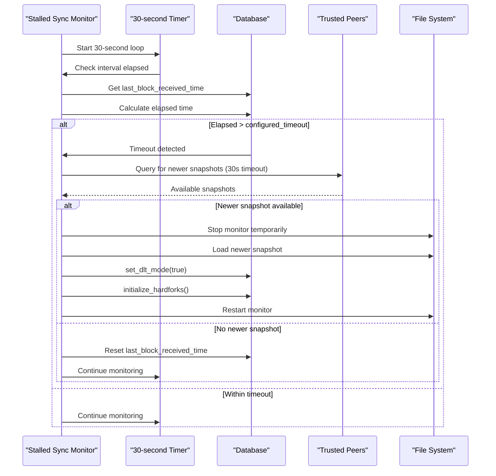

**Diagram sources**
- [plugin.cpp:1301-1387](file://plugins/snapshot/plugin.cpp#L1301-L1387)

### Enhanced Error Handling and Graceful Shutdown

**New**: The stalled sync detection system now includes comprehensive error handling and graceful shutdown mechanisms:


**Diagram sources**
- [plugin.cpp:1322-1387](file://plugins/snapshot/plugin.cpp#L1322-L1387)

### Configuration and Parameters

The stalled sync detection system is highly configurable:

**Configuration Options:**
- **enable-stalled-sync-detection**: Enable/disable the feature (default: false)
- **stalled-sync-timeout-minutes**: Timeout threshold before triggering recovery (default: 5 minutes)
- **trusted-snapshot-peer**: Required trusted peers for snapshot recovery

**Monitoring Parameters:**
- **Check Interval**: Every 30 seconds
- **Peer Query Timeout**: 30 seconds per peer operation
- **Recovery Process**: Automatic snapshot download and state reload
- **Graceful Shutdown**: Proper cleanup of background threads during shutdown

**Section sources**
- [plugin.cpp:1301-1387](file://plugins/snapshot/plugin.cpp#L1301-L1387)
- [plugin.cpp:2088-2115](file://plugins/snapshot/plugin.cpp#L2088-L2115)

### Automatic Recovery Process

When stalled sync is detected, the system automatically executes a recovery sequence:

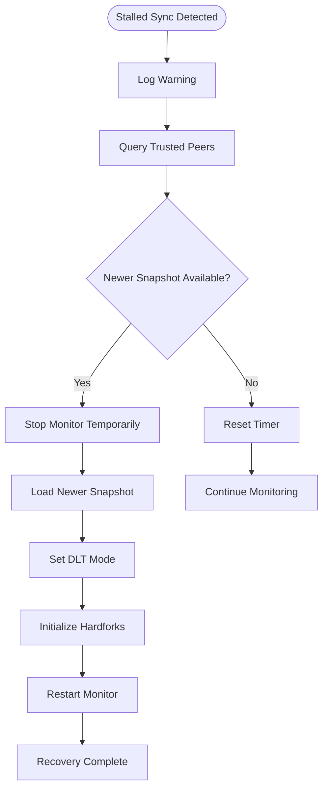

**Diagram sources**
- [plugin.cpp:1344-1378](file://plugins/snapshot/plugin.cpp#L1344-L1378)

**Section sources**
- [plugin.cpp:1344-1378](file://plugins/snapshot/plugin.cpp#L1344-L1378)

## Improved Logging and Progress Feedback

**Updated**: The snapshot system now provides comprehensive real-time logging and progress feedback throughout all operations, with enhanced distinction between Phase 1 info-only queries and active transfers.

### Comprehensive Progress Reporting

The system implements detailed logging for all major operations with real-time progress updates:


**Diagram sources**
- [plugin.cpp:912-944](file://plugins/snapshot/plugin.cpp#L912-L944)
- [plugin.cpp:1740-1777](file://plugins/snapshot/plugin.cpp#L1740-L1777)

### Real-time Download Progress Monitoring

The download process provides granular progress feedback with percentage completion and transfer rates:

```mermaid
sequenceDiagram
participant Client as "Client"
participant Server as "Server"
participant Logger as "Logger"
Client->>Server : Request Snapshot
Server-->>Client : Info Reply
Client->>Server : Download Chunks (30s timeout each)
loop For Each Chunk
Server-->>Client : Chunk Data
Client->>Logger : Log Progress (%)
Logger-->>Client : Progress Update
end
Client->>Logger : Log Completion
```

**Diagram sources**
- [plugin.cpp:1740-1777](file://plugins/snapshot/plugin.cpp#L1740-L1777)

### Enhanced Client Disconnection Handling

**New**: Improved client disconnection handling with try-catch mechanisms and better logging for graceful error management:

```mermaid
flowchart TD
Start([Handle Connection]) --> ReadRequest[Read Initial Request]
ReadRequest --> CheckType{Request Type?}
CheckType --> |INFO_REQUEST| HandleInfo[Handle Info Query]
CheckType --> |DATA_REQUEST| HandleData[Handle Data Transfer]
HandleInfo --> CheckDisconnect{Client Disconnected?}
CheckDisconnect --> |Yes| LogInfoOnly[Log Info-only Query]
CheckDisconnect --> |No| WaitRequests[Wait for Data Requests]
WaitRequests --> CheckDataDisconnect{Client Disconnected During Transfer?}
CheckDataDisconnect --> |Yes| LogGracefulDisconnect[Log Graceful Disconnect]
CheckDataDisconnect --> |No| ContinueTransfer[Continue Transfer]
HandleData --> CheckTransferComplete{Transfer Complete?}
CheckTransferComplete --> |Yes| LogComplete[Log Transfer Complete]
CheckTransferComplete --> |No| HandleData
LogInfoOnly --> End([Connection Closed])
LogGracefulDisconnect --> End
LogComplete --> End
```

**Diagram sources**
- [plugin.cpp:1574-1660](file://plugins/snapshot/plugin.cpp#L1574-L1660)

### Enhanced Error Handling and Exception Management

**New**: The system now includes comprehensive error handling with detailed exception management:

```mermaid
flowchart TD
Start([Operation]) --> TryOp[Try Operation]
TryOp --> |Success| Success[Operation Success]
TryOp --> |Exception| CatchErr[Catch Exception]
CatchErr --> LogErr[Log Error Details]
LogErr --> CheckSeverity{Check Severity}
CheckSeverity --> |Critical| GracefulShutdown[Graceful Shutdown]
CheckSeverity --> |Non-critical| Continue[Continue Operation]
CheckSeverity --> |Timeout| RetryOp[Retry Operation]
GracefulShutdown --> End([Shutdown])
Continue --> End
RetryOp --> TryOp
```

**Diagram sources**
- [plugin.cpp:1373-1387](file://plugins/snapshot/plugin.cpp#L1373-L1387)

**Section sources**
- [plugin.cpp:912-944](file://plugins/snapshot/plugin.cpp#L912-L944)
- [plugin.cpp:1740-1777](file://plugins/snapshot/plugin.cpp#L1740-L1777)
- [plugin.cpp:1574-1660](file://plugins/snapshot/plugin.cpp#L1574-L1660)

## Automatic Directory Management

**Updated**: The snapshot system now includes intelligent automatic directory creation capabilities to streamline file management.

### Intelligent Directory Creation

The system automatically creates directories when needed, ensuring seamless operation without manual intervention:

```mermaid
flowchart TD
Start([File Operation]) --> CheckPath[Check File Path]
CheckPath --> Exists{Path Exists?}
Exists --> |Yes| UsePath[Use Existing Path]
Exists --> |No| CheckParent[Check Parent Directory]
CheckParent --> ParentExists{Parent Exists?}
ParentExists --> |Yes| UsePath
ParentExists --> |No| CreateDir[Create Parent Directory]
CreateDir --> LogCreation[Log Directory Creation]
LogCreation --> UsePath
UsePath --> Proceed[Proceed with Operation]
```

**Diagram sources**
- [plugin.cpp:914-925](file://plugins/snapshot/plugin.cpp#L914-L925)
- [plugin.cpp:1728-1734](file://plugins/snapshot/plugin.cpp#L1728-L1734)

### Automatic Cleanup and Rotation

The system includes intelligent cleanup mechanisms to manage disk space efficiently:

```mermaid
flowchart TD
Start([Cleanup Trigger]) --> CheckAge[Check Snapshot Age]
CheckAge --> OldEnough{Older than Threshold?}
OldEnough --> |Yes| Remove[Remove Old Snapshot]
OldEnough --> |No| Skip[Skip Snapshot]
Remove --> LogRemoval[Log Removal]
LogRemoval --> Continue[Continue Scan]
Skip --> Continue
Continue --> End([Cleanup Complete])
```

**Diagram sources**
- [plugin.cpp:1395-1432](file://plugins/snapshot/plugin.cpp#L1395-L1432)

**Section sources**
- [plugin.cpp:914-925](file://plugins/snapshot/plugin.cpp#L914-L925)
- [plugin.cpp:1395-1432](file://plugins/snapshot/plugin.cpp#L1395-L1432)

## Enhanced Chain Plugin Integration

**Updated**: The snapshot plugin now provides seamless integration with the chain plugin through sophisticated callback mechanisms and automatic synchronization.

### Sophisticated Callback Architecture

The chain plugin exposes three specialized callbacks that enable seamless snapshot integration:

```mermaid
sequenceDiagram
participant App as "Application"
participant Chain as "Chain Plugin"
participant Snap as "Snapshot Plugin"
App->>Chain : plugin_initialize()
Chain->>Snap : Register snapshot_callbacks
Snap->>Chain : snapshot_load_callback
Snap->>Chain : snapshot_create_callback
Snap->>Chain : snapshot_p2p_sync_callback
App->>Chain : plugin_startup()
Chain->>Chain : Check State (head_block_num)
alt --snapshot Flag Present
Chain->>Snap : snapshot_load_callback()
Snap->>Chain : Load Snapshot & Initialize
else --create-snapshot Flag Present
Chain->>Snap : snapshot_create_callback()
Snap->>Chain : Create Snapshot & Quit
else Empty State (head_block_num == 0)
Chain->>Snap : snapshot_p2p_sync_callback()
Snap->>Chain : Download & Load Snapshot
end
```

**Diagram sources**
- [plugin.cpp:1925-1981](file://plugins/snapshot/plugin.cpp#L1925-L1981)
- [plugin.hpp:92-105](file://plugins/chain/include/graphene/plugins/chain/plugin.hpp#L92-L105)

### Automatic State Detection and Response

The chain plugin automatically detects different states and responds appropriately:

```mermaid
flowchart TD
Start([Chain Startup]) --> DetectState[Detect Current State]
DetectState --> CheckSnapshot{--snapshot Flag?}
CheckSnapshot --> |Yes| LoadSnapshot[Execute snapshot_load_callback]
CheckSnapshot --> |No| CheckCreate{--create-snapshot Flag?}
CheckCreate --> |Yes| CreateSnapshot[Execute snapshot_create_callback]
CheckCreate --> |No| CheckEmpty{head_block_num == 0?}
CheckEmpty --> |Yes| P2PSync[Execute snapshot_p2p_sync_callback]
CheckEmpty --> |No| NormalStartup[Normal Chain Startup]
LoadSnapshot --> Complete[Startup Complete]
CreateSnapshot --> Complete
P2PSync --> Complete
NormalStartup --> Complete
```

**Diagram sources**
- [plugin.cpp:1984-2017](file://plugins/snapshot/plugin.cpp#L1984-L2017)

### DLT Mode Integration

**New**: The snapshot plugin now properly sets the `_dlt_mode` flag during snapshot loading, enabling seamless DLT mode operation:

```mermaid
sequenceDiagram
participant Snap as "Snapshot Plugin"
participant DB as "Database"
participant Chain as "Chain Plugin"
Snap->>DB : load_snapshot()
DB->>DB : Import Snapshot State
DB->>DB : Set Revision
DB->>DB : Seed ForkDB
DB->>DB : set_dlt_mode(true)
DB->>DB : initialize_hardforks()
DB-->>Chain : Database Ready
Chain-->>Chain : DLT Mode Operational
```

**Diagram sources**
- [plugin.cpp:1968-1970](file://plugins/snapshot/plugin.cpp#L1968-L1970)

**Section sources**
- [plugin.cpp:1925-1981](file://plugins/snapshot/plugin.cpp#L1925-L1981)
- [plugin.cpp:1984-2017](file://plugins/snapshot/plugin.cpp#L1984-L2017)

## Enhanced Security and Anti-Spam Measures

**Updated**: The snapshot plugin now implements comprehensive security measures including enhanced timeout management, anti-spam protection, and robust connection handling.

### Comprehensive Anti-Spam Protection

The snapshot server implements multiple layers of anti-abuse protection:

```mermaid
flowchart TD
Start([Incoming Connection]) --> TrustCheck{Trusted Peer?}
TrustCheck --> |No Trusted| Reject[Reject Connection]
TrustCheck --> |Trusted| ConcurrencyCheck{Max 5 Concurrency?}
ConcurrencyCheck --> |Exceeded| Reject
ConcurrencyCheck --> |Available| SessionCheck{Active Session Per IP?}
SessionCheck --> |Duplicate| Reject
SessionCheck --> |Available| RateLimit{Rate Limit Check}
RateLimit --> |Exceeded| Reject
RateLimit --> |Allowed| Accept[Accept Connection]
Accept --> TimeoutCheck{60-second Timeout}
TimeoutCheck --> |Expired| Close[Close Connection]
TimeoutCheck --> |Active| Process[Process Requests]
Process --> Complete[Connection Complete]
Complete --> Close[Close Connection]
```

**Diagram sources**
- [plugin.cpp:1555-1613](file://plugins/snapshot/plugin.cpp#L1555-L1613)

### Enhanced Timeout Management

The system implements comprehensive timeout protection across all operations:

**Connection-Level Timeouts**:
- **Accept Loop**: 60-second connection timeout enforced before processing
- **Initial Request**: 10-second timeout for info requests
- **Data Requests**: 5-minute timeout for chunk transfers
- **Overall Connection**: Hard deadline prevents resource exhaustion

**Peer Operation Timeouts**:
- **Peer Queries**: 30-second timeout per peer operation
- **Chunk Downloads**: 30-second timeout per chunk request
- **Response Handling**: 30-second timeout for all peer responses

**Section sources**
- [plugin.cpp:1555-1613](file://plugins/snapshot/plugin.cpp#L1555-L1613)
- [plugin.cpp:1294-1412](file://plugins/snapshot/plugin.cpp#L1294-L1412)

### Enhanced Payload Size Limits

The system implements strict payload size limits to prevent memory abuse:

```mermaid
flowchart TD
Start([Receive Message]) --> CheckSize{Check Payload Size}
CheckSize --> |Control Message| ControlLimit[256KB Limit]
CheckSize --> |Data Reply| DataLimit[64MB Limit]
CheckSize --> |Request Message| RequestLimit[64KB Limit]
ControlLimit --> |Exceeded| Reject[Reject Message]
DataLimit --> |Exceeded| Reject
RequestLimit --> |Exceeded| Reject
ControlLimit --> |OK| Process[Process Message]
DataLimit --> |OK| Process
RequestLimit --> |OK| Process
Reject --> Log[Log Violation]
Process --> End([Message Processed])
Log --> End
```

**Diagram sources**
- [plugin.cpp:1368-1412](file://plugins/snapshot/plugin.cpp#L1368-L1412)

**Section sources**
- [plugin.cpp:1368-1412](file://plugins/snapshot/plugin.cpp#L1368-L1412)

## DLT Mode Capabilities

**New**: The snapshot plugin now provides comprehensive DLT (Distributed Ledger Technology) mode support with automatic DLT mode activation and enhanced block log management.

### DLT Mode Integration

The system seamlessly integrates with DLT mode operations through automatic DLT mode activation:

```mermaid
sequenceDiagram
participant Snap as "Snapshot Plugin"
participant DB as "Database"
participant DLT as "DLT Block Log"
participant Chain as "Chain Plugin"
Snap->>DB : load_snapshot()
DB->>DB : Import Snapshot State
DB->>DB : Set Revision
DB->>DB : Seed ForkDB
DB->>DB : set_dlt_mode(true)
DB->>DLT : Initialize DLT Block Log
DB->>DB : initialize_hardforks()
DB-->>Chain : Database Ready
Chain-->>Chain : DLT Mode Operational
```

**Diagram sources**
- [plugin.cpp:1968-1970](file://plugins/snapshot/plugin.cpp#L1968-L1970)

### DLT Block Log Management

The system manages DLT block logs separately from regular block logs:

```mermaid
flowchart TD
Start([DLT Mode Enabled]) --> CheckWindow{dlt-block-log-max-blocks > 0?}
CheckWindow --> |Yes| WriteDLT[Write to DLT Block Log]
CheckWindow --> |No| WriteRegular[Write to Regular Block Log]
WriteDLT --> ManageWindow[Manage Window Size]
ManageWindow --> Truncate[Truncate Old Blocks]
Truncate --> Maintain[Amortized Cost]
WriteRegular --> Maintain
Maintain --> Serve[Serve Blocks to Peers]
```

**Diagram sources**
- [dlt_block_log.cpp:336-402](file://libraries/chain/dlt_block_log.cpp#L336-L402)

### Enhanced DLT Block Log Features

**Window Management**: Maintains rolling window of recent blocks with configurable size
**Offset-aware Indexing**: Stores first block number in index header for efficient random access
**Automatic Truncation**: Removes old blocks when window exceeds 2x the configured limit
**Amortized Cost**: Distributes truncation cost across multiple operations

**Section sources**
- [dlt_block_log.cpp:336-402](file://libraries/chain/dlt_block_log.cpp#L336-L402)
- [dlt_block_log.hpp:35-75](file://libraries/chain/include/graphene/chain/dlt_block_log.hpp#L35-L75)

## Dependency Analysis

The snapshot plugin has a well-defined dependency structure that integrates with the broader VIZ ecosystem:

```mermaid
graph TB
subgraph "External Dependencies"
A[fc Library] --> B[JSON Serialization]
A --> C[Compression]
A --> D[Networking]
E[chainbase] --> F[Database Operations]
G[appbase] --> H[Plugin Framework]
I[graphene_protocol] --> J[Blockchain Types]
K[boost::filesystem] --> L[File System Operations]
M[fc::thread] --> N[Async Operations]
O[fc::mutex] --> P[Thread Safety]
Q[fc::time_point] --> R[Timeout Management]
S[fc::async] --> T[Background Processing]
U[fc::canceled_exception] --> V[Thread Cancellation]
W[fc::microseconds] --> X[Time Units]
Y[fc::seconds] --> Z[Time Units]
end
subgraph "Internal Dependencies"
AA[graphene_chain] --> BB[Database Interface]
CC[graphene_chain_plugin] --> DD[Chain Plugin]
EE[graphene_time] --> FF[Time Management]
GG[graphene_json_rpc] --> HH[RPC Integration]
II[graphene_p2p] --> JJ[P2P Integration]
KK[graphene_dlt_block_log] --> LL[DLT Block Logging]
MM[graphene_protocol] --> NN[Blockchain Protocol]
OO[dlt_block_log] --> PP[DLT Block Log Management]
QQ[background_monitoring] --> RR[Stalled Sync Detection]
SS[enhanced_error_handling] --> TT[Graceful Shutdown]
UU[intelligent_retry_loops] --> VV[Configurable Intervals]
WW[automatic_fallback] --> XX[P2P Genesis Sync]
YY[improved_logging] --> ZZ[Detailed Progress Reports]
end
subgraph "Snapshot Plugin"
AA[snapshot_plugin] --> BB[plugin_impl]
BB --> CC[Serialization Layer]
BB --> DD[Network Layer]
BB --> EE[File Management]
BB --> FF[Callback System]
BB --> GG[Progress Logging]
BB --> HH[set_dlt_mode Integration]
BB --> II[Enhanced Timeout Management]
BB --> JJ[Anti-Spam Protection]
BB --> KK[Security Measures]
BB --> LL[Stalled Sync Detection]
BB --> MM[Background Thread Management]
BB --> NN[Configurable Timeouts]
BB --> OO[Thread Safety]
BB --> PP[Enhanced Error Handling]
BB --> QQ[Retry Mechanisms]
BB --> RR[Automatic Fallback]
BB --> SS[Improved User Feedback]
end
A --> AA
E --> AA
G --> AA
I --> AA
K --> AA
M --> AA
O --> AA
Q --> AA
S --> AA
U --> AA
W --> AA
Y --> AA
AA --> BB
AA --> CC
AA --> DD
AA --> EE
AA --> FF
AA --> GG
AA --> HH
AA --> II
AA --> JJ
AA --> KK
AA --> LL
AA --> MM
AA --> NN
AA --> OO
AA --> PP
AA --> QQ
AA --> RR
AA --> SS
```

**Diagram sources**
- [CMakeLists.txt:27-37](file://plugins/snapshot/CMakeLists.txt#L27-L37)

The plugin's dependencies are carefully managed to minimize coupling while maximizing functionality:

**External Dependencies**:
- **fc Library**: Provides core serialization, compression, and networking capabilities
- **chainbase**: Handles database operations and object lifecycle management
- **appbase**: Manages plugin lifecycle and application integration
- **boost::filesystem**: Enables cross-platform file system operations
- **fc::thread**: Provides asynchronous operation support
- **fc::mutex**: Ensures thread safety across concurrent operations
- **fc::time_point**: Provides precise timeout and deadline management
- **fc::async**: Enables background processing and monitoring
- **fc::canceled_exception**: Handles thread cancellation gracefully
- **fc::microseconds/seconds**: Provides precise time unit management

**Internal Dependencies**:
- **graphene_chain**: Access to blockchain state and database operations
- **graphene_protocol**: Blockchain-specific data types and structures
- **graphene_time**: Time-related operations for snapshot metadata
- **graphene_p2p**: P2P network integration for snapshot synchronization
- **graphene_dlt_block_log**: DLT mode block logging support
- **graphene_chain_plugin**: Chain plugin callback system integration
- **dlt_block_log**: DLT block log management and operations
- **background_monitoring**: Stalled sync detection and recovery system
- **enhanced_error_handling**: Comprehensive exception handling and graceful shutdown
- **intelligent_retry_loops**: Configurable retry mechanisms for P2P operations
- **automatic_fallback**: Fallback mechanisms for P2P genesis sync
- **improved_logging**: Enhanced logging and progress reporting systems

**Section sources**
- [CMakeLists.txt:27-37](file://plugins/snapshot/CMakeLists.txt#L27-L37)

## Performance Considerations

The snapshot plugin is designed with several performance optimizations:

### Memory Management
- **Streaming Operations**: Large snapshot files are processed in chunks to minimize memory usage
- **Lazy Loading**: Objects are imported incrementally rather than loading entire datasets
- **Efficient Compression**: Zlib compression reduces storage requirements by 70-85%
- **Progressive Loading**: Snapshots are loaded in stages to maintain system responsiveness

### Network Efficiency
- **Chunked Transfers**: 1MB chunk sizes balance throughput and memory usage
- **Connection Pooling**: Limited concurrent connections prevent resource exhaustion
- **Anti-Spam Measures**: Rate limiting prevents abuse while maintaining service availability
- **Intelligent Peer Selection**: Optimized peer choice reduces transfer time and bandwidth usage
- **Timeout Management**: Comprehensive timeout protection prevents resource exhaustion
- **Background Monitoring**: Asynchronous stalled sync detection doesn't block main operations
- **Retry Mechanisms**: Configurable retry intervals optimize network utilization
- **Automatic Fallback**: Fallback to P2P genesis sync when trusted peers are unavailable

### Database Optimization
- **Batch Operations**: Objects are imported in batches to reduce database overhead
- **ID Management**: Pre-allocated ID spaces prevent database fragmentation
- **Transaction Batching**: Multiple objects are committed in single transactions
- **DLT Mode Support**: Special handling for DLT mode operations without block logs
- **set_dlt_mode Integration**: Seamless DLT mode activation during snapshot loading
- **Automatic DLT Mode**: DLT mode automatically enabled during snapshot operations

### File System Operations
- **Asynchronous I/O**: Non-blocking file operations improve responsiveness
- **Atomic Operations**: Temporary files ensure data integrity during transfers
- **Automatic Cleanup**: Scheduled cleanup prevents disk space accumulation
- **Directory Intelligence**: Automatic directory creation eliminates manual intervention

### Thread Safety and Concurrency
- **Background Threads**: Stalled sync detection runs in separate threads
- **Mutex Protection**: Thread-safe session management and rate limiting
- **Async Operations**: Non-blocking network operations prevent deadlocks
- **Graceful Shutdown**: Proper cleanup of background threads during shutdown
- **Exception Handling**: Comprehensive error handling prevents thread crashes
- **Retry Loops**: Configurable retry mechanisms prevent resource starvation

## Troubleshooting Guide

### Common Issues and Solutions

**Snapshot Creation Failures**
- **Symptom**: `Failed to open snapshot file for writing`
- **Cause**: Insufficient permissions or invalid path
- **Solution**: Verify write permissions and directory existence

**Snapshot Loading Errors**
- **Symptom**: `Chain ID mismatch: snapshot=${s}, node=${n}`
- **Cause**: Attempting to load snapshot from different blockchain network
- **Solution**: Use compatible snapshot or reconfigure chain parameters

**Network Connection Problems**
- **Symptom**: `Connection closed while reading/writing`
- **Cause**: Network interruption or peer shutdown
- **Solution**: Retry connection or check peer availability

**Memory Exhaustion During Import**
- **Symptom**: Out-of-memory errors during snapshot import
- **Cause**: Insufficient RAM for large snapshot files
- **Solution**: Increase system memory or use smaller snapshot files

**Database Initialization Failures**
- **Symptom**: `Failed to open database for snapshot: ${e}`
- **Cause**: Corrupted shared memory or insufficient disk space
- **Solution**: Clear shared memory and ensure sufficient disk space

**Automatic Directory Creation Issues**
- **Symptom**: `Failed to create snapshot directory: ${d}`
- **Cause**: Permission denied or invalid path
- **Solution**: Verify directory permissions and path validity

**P2P Synchronization Failures**
- **Symptom**: `No trusted snapshot peers configured`
- **Cause**: Missing trusted peer configuration
- **Solution**: Configure trusted-snapshot-peer options

**DLT Mode Integration Issues**
- **Symptom**: `DLT mode not properly initialized`
- **Cause**: Missing `set_dlt_mode()` call during snapshot loading
- **Solution**: Ensure snapshot loading process calls `set_dlt_mode(true)`

**Enhanced Payload Size Limit Issues**
- **Symptom**: `Message too large: ${s} bytes (limit ${l})`
- **Cause**: Protocol message exceeding payload size limits
- **Solution**: Adjust payload size limits or optimize message structure

**Improved Client Disconnection Handling**
- **Symptom**: Unexpected connection closures during snapshot transfer
- **Cause**: Client disconnects during active transfers
- **Solution**: Implement graceful error handling and logging for disconnection scenarios

**Enhanced Timeout Management Issues**
- **Symptom**: `Connection timeout to peer ${p}`
- **Cause**: Peer operations exceeding 30-second timeout limit
- **Solution**: Check network connectivity and peer responsiveness

**Anti-Spam Protection Issues**
- **Symptom**: `Rate limit exceeded for ${ip} (${n} connections in last hour)`
- **Cause**: Client exceeding rate limit of 3 connections per hour
- **Solution**: Implement exponential backoff or reduce connection frequency

**Enhanced Security Measures Issues**
- **Symptom**: `Max concurrent connections reached, rejecting ${ip}`
- **Cause**: Server reaching maximum of 5 concurrent connections
- **Solution**: Reduce concurrent client connections or increase server capacity

**Stalled Sync Detection Issues**
- **Symptom**: `Stalled sync detection not working`
- **Cause**: Missing trusted peers or incorrect configuration
- **Solution**: Verify `enable-stalled-sync-detection` and `trusted-snapshot-peer` settings

**Enhanced Error Handling Issues**
- **Symptom**: `Graceful shutdown failed`
- **Cause**: Background threads not properly terminated
- **Solution**: Ensure proper cleanup of all background processes

**Intelligent Retry Loops Issues**
- **Symptom**: `Retry attempts exhausted`
- **Cause**: Configured retry attempts exceeded
- **Solution**: Increase retry attempts or check network connectivity

**Automatic Fallback Issues**
- **Symptom**: `P2P genesis sync not working`
- **Cause**: Missing genesis block or network connectivity issues
- **Solution**: Verify network connectivity and genesis block availability

**Improved Logging Issues**
- **Symptom**: `Insufficient logging information`
- **Cause**: Missing log entries or insufficient verbosity
- **Solution**: Increase log level or add additional logging points

**Background Thread Management Issues**
- **Symptom**: `Thread already running` or `Thread not running`
- **Cause**: Improper thread lifecycle management
- **Solution**: Ensure proper start/stop sequence and thread safety

**Section sources**
- [plugin.cpp:986-1032](file://plugins/snapshot/plugin.cpp#L986-L1032)
- [plugin.cpp:1252-1303](file://plugins/snapshot/plugin.cpp#L1252-L1303)

### Diagnostic Commands

**Verify Snapshot Integrity**
```bash
# Check snapshot file validity
file /path/to/snapshot-file.vizjson

# Verify compression
zcat /path/to/snapshot-file.vizjson | head -n 5

# Check file size and modification time
ls -la /path/to/snapshot-file.vizjson
```

**Monitor Network Activity**
```bash
# Monitor snapshot server connections
netstat -an | grep :8092

# Check firewall rules
iptables -L | grep 8092

# Monitor bandwidth usage
iftop -i eth0
```

**Debug Plugin Operations**
```bash
# Enable verbose logging
vizd --plugin=snapshot --log-level=debug

# Check plugin configuration
vizd --help | grep snapshot
```

**Monitor Progress and Performance**
```bash
# Monitor snapshot creation progress
tail -f ~/.vizd/log/vizd.log | grep "Snapshot created"

# Monitor P2P synchronization
tail -f ~/.vizd/log/vizd.log | grep "P2P Snapshot Sync"

# Monitor stalled sync detection
tail -f ~/.vizd/log/vizd.log | grep "WARNING: No blocks received"

# Monitor error handling
tail -f ~/.vizd/log/vizd.log | grep "Exception"
```

**Test Anti-Spam Protection**
```bash
# Test rate limiting
for i in {1..10}; do
    curl -s --max-time 30 http://localhost:8092/snapshot-info
done

# Monitor connection limits
netstat -an | grep :8092 | wc -l
```

**Test Stalled Sync Detection**
```bash
# Monitor stalled sync logs
tail -f ~/.vizd/log/vizd.log | grep "WARNING: No blocks received"

# Check timeout configuration
vizd --help | grep stalled-sync-timeout
```

**Test Enhanced Error Handling**
```bash
# Monitor graceful shutdown
tail -f ~/.vizd/log/vizd.log | grep "shutdown"

# Test exception handling
vizd --help | grep snapshot
```

**Test Intelligent Retry Loops**
```bash
# Monitor retry attempts
tail -f ~/.vizd/log/vizd.log | grep "retry"

# Check retry configuration
vizd --help | grep snapshot
```

**Test Automatic Fallback**
```bash
# Monitor fallback behavior
tail -f ~/.vizd/log/vizd.log | grep "fallback"

# Check fallback configuration
vizd --help | grep sync-snapshot-from-trusted-peer
```

## Conclusion

The Snapshot Plugin System represents a sophisticated solution for blockchain state management, providing essential capabilities for node bootstrapping, state synchronization, and automated snapshot management. The system's modular architecture, comprehensive validation mechanisms, and robust networking support make it suitable for production environments requiring reliable and efficient state synchronization.

**Updated**: Recent enhancements have significantly strengthened the system's capabilities through the introduction of automatic P2P snapshot synchronization for empty nodes, real-time progress feedback during operations, automatic directory creation capabilities, and seamless integration with the chain plugin for automatic snapshot synchronization during blockchain initialization. The system now includes comprehensive timeout management with 30-second timeouts, robust anti-spam protection with max 5 concurrent connections and rate limiting, and DLT mode support with set_dlt_mode() method for seamless DLT mode operation.

**New**: The most significant enhancement is the addition of stalled sync detection and automatic recovery capabilities. This system continuously monitors synchronization health and automatically downloads newer snapshots from trusted peers when synchronization appears stalled, ensuring nodes can recover from network partitions or peer pruning scenarios. The system now includes comprehensive error handling with graceful shutdown mechanisms, intelligent retry loops with configurable intervals, automatic fallback to P2P genesis sync, and detailed progress logging throughout all operations.

Key strengths of the system include:
- **Comprehensive Coverage**: Handles all major blockchain object types
- **Robust Security**: Multiple layers of validation and anti-abuse protection
- **Scalable Design**: Efficient memory and network usage patterns
- **Flexible Deployment**: Supports manual, automatic, P2P synchronization, programmatic loading, and automatic empty node synchronization modes
- **Enhanced Integration**: Seamless integration with database layer and callback system
- **Intelligent Automation**: Automatic directory management and cleanup
- **Real-time Monitoring**: Comprehensive logging and progress feedback
- **Automatic State Detection**: Intelligent response to different node states
- **DLT Mode Support**: Proper integration with DLT mode operations through set_dlt_mode() method
- **Enhanced Timeout Management**: Comprehensive 30-second timeout handling for all peer operations
- **Improved Payload Handling**: Enhanced payload size limits and client disconnection management
- **Better Error Handling**: Graceful disconnection management and enhanced logging
- **Robust Anti-Spam Protection**: Max 5 concurrent connections, rate limiting, and 60-second connection timeout enforcement
- **Thread Safety**: Mutex protection for concurrent operations and session management
- **Stalled Sync Detection**: Automatic monitoring and recovery from stalled synchronization
- **Background Processing**: Non-blocking monitoring that doesn't interfere with main operations
- **Configurable Timeouts**: Customizable detection periods and recovery thresholds
- **Automatic DLT Mode**: Seamless DLT mode activation during snapshot operations
- **Enhanced Error Handling**: Comprehensive exception handling with graceful shutdown mechanisms
- **Intelligent Retry Loops**: Configurable retry intervals for P2P snapshot synchronization
- **Automatic Fallback**: Fallback to P2P genesis sync when trusted peers are unavailable
- **Improved User Feedback**: Detailed progress logging and status reporting for all operations

The plugin's integration with the broader VIZ ecosystem ensures seamless operation alongside existing blockchain infrastructure, while its well-documented APIs and configuration options facilitate easy deployment and maintenance.

Future enhancements could include support for incremental snapshots, distributed snapshot verification, enhanced compression algorithms, and advanced peer reputation systems to further optimize storage and transfer efficiency.