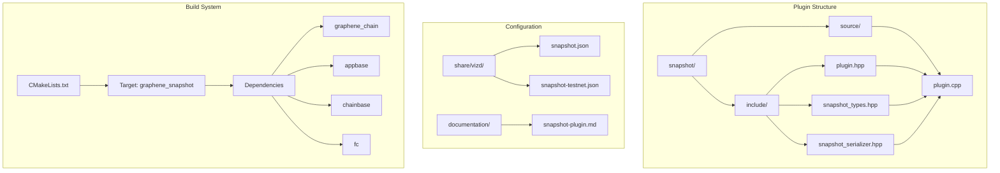
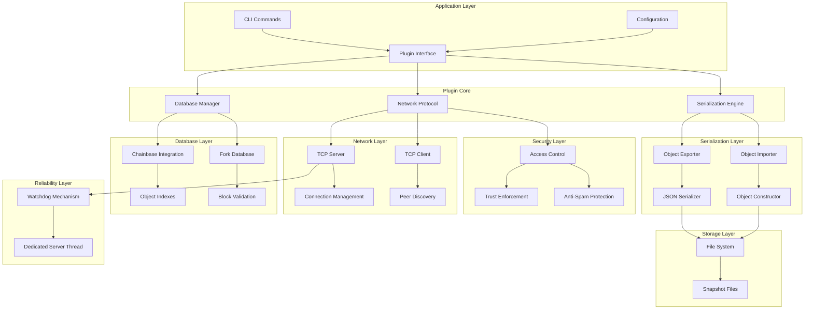
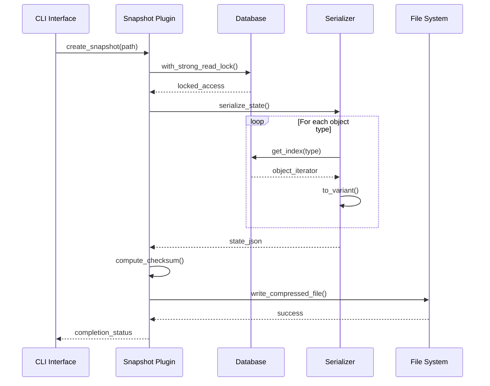
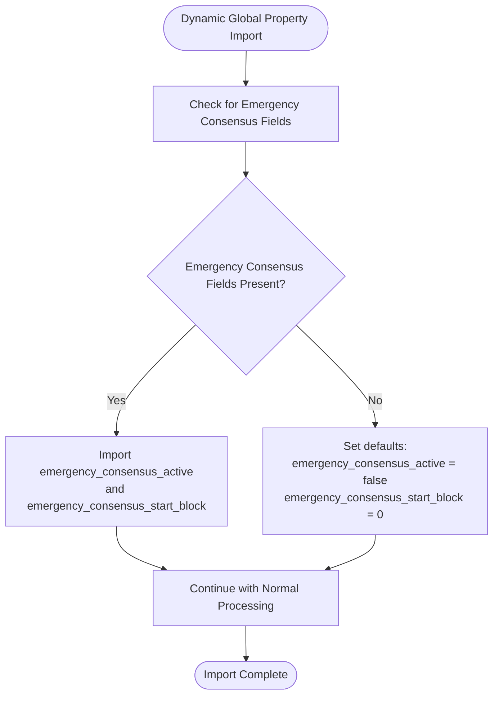
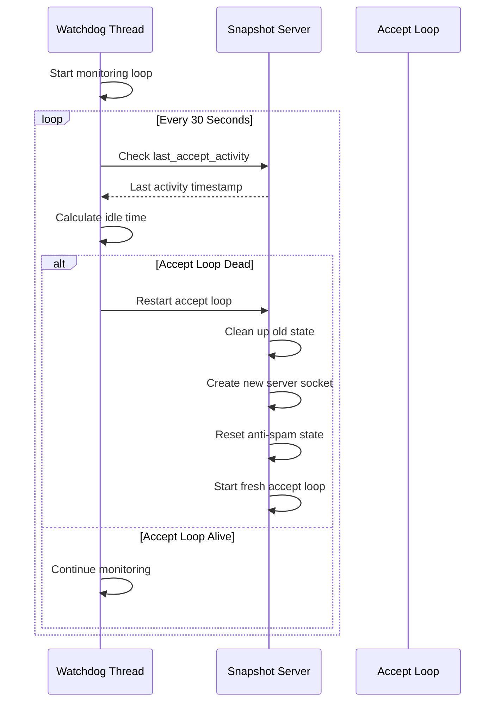
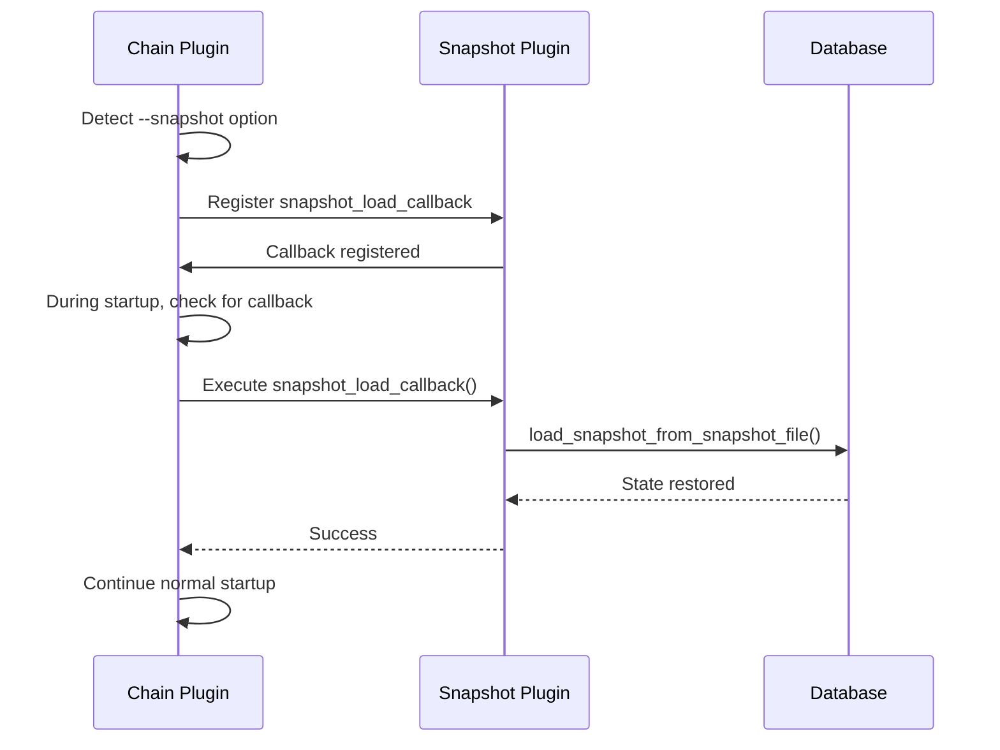
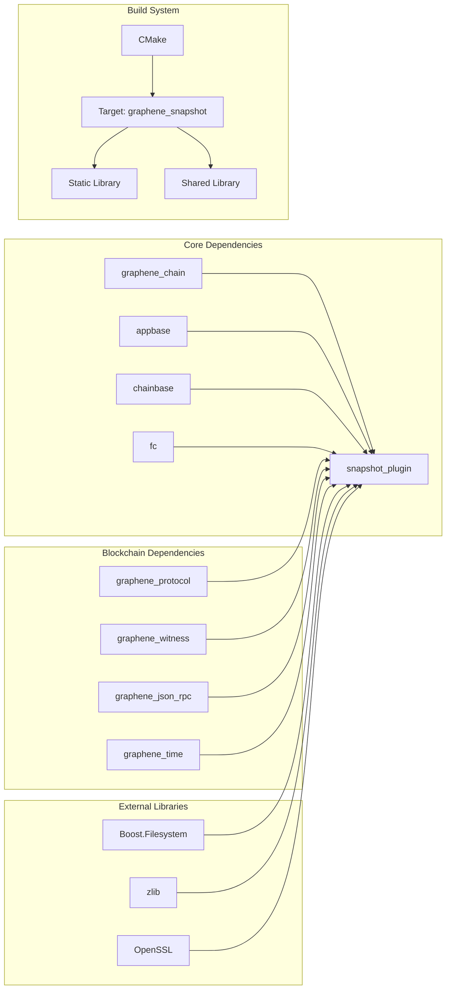

# Snapshot Plugin System

<cite>
**Referenced Files in This Document**
- [plugin.cpp](file://plugins/snapshot/plugin.cpp)
- [plugin.hpp](file://plugins/snapshot/include/graphene/plugins/snapshot/plugin.hpp)
- [snapshot_types.hpp](file://plugins/snapshot/include/graphene/plugins/snapshot/snapshot_types.hpp)
- [snapshot_serializer.hpp](file://plugins/snapshot/include/graphene/plugins/snapshot/snapshot_serializer.hpp)
- [CMakeLists.txt](file://plugins/snapshot/CMakeLists.txt)
- [snapshot.json](file://share/vizd/snapshot.json)
- [snapshot-testnet.json](file://share/vizd/snapshot-testnet.json)
- [snapshot-plugin.md](file://documentation/snapshot-plugin.md)
- [plugin.cpp](file://plugins/chain/plugin.cpp)
</cite>

## Update Summary
**Changes Made**
- Enhanced emergency consensus handling with forward-compatible fields for emergency consensus activation
- Added comprehensive watchdog mechanism for detecting and restarting dead accept loops
- Implemented dedicated server thread architecture mirroring P2P plugin's approach
- Introduced new anti-spam configuration options including disable-snapshot-anti-spam and snapshot-serve-allow-ip
- Enhanced access control system with improved trust enforcement and session management
- Added comprehensive documentation for emergency consensus features and watchdog mechanisms

## Table of Contents
1. [Introduction](#introduction)
2. [Project Structure](#project-structure)
3. [Core Components](#core-components)
4. [Architecture Overview](#architecture-overview)
5. [Detailed Component Analysis](#detailed-component-analysis)
6. [Emergency Consensus Handling](#emergency-consensus-handling)
7. [Enhanced Anti-Spam Protection](#enhanced-anti-spam-protection)
8. [Watchdog Mechanism](#watchdog-mechanism)
9. [Access Control and Security Mechanisms](#access-control-and-security-mechanisms)
10. [Integration with Chain Plugin](#integration-with-chain-plugin)
11. [Dependency Analysis](#dependency-analysis)
12. [Performance Considerations](#performance-considerations)
13. [Troubleshooting Guide](#troubleshooting-guide)
14. [Conclusion](#conclusion)

## Introduction

The Snapshot Plugin System is a comprehensive solution for VIZ blockchain nodes that enables efficient state synchronization through distributed ledger technology (DLT). This system provides mechanisms for creating, loading, serving, and downloading blockchain state snapshots, significantly reducing bootstrap times and enabling rapid node initialization.

The plugin addresses the fundamental challenge of blockchain bootstrapping by allowing nodes to jump directly to a recent state rather than replaying thousands of blocks. This is particularly crucial for VIZ's social media and content platform characteristics, where rapid deployment and scaling are essential.

**Updated** The system has been enhanced with comprehensive emergency consensus handling, watchdog mechanisms for server reliability, dedicated server thread architecture, and advanced anti-spam protection with new configuration options. The recent additions include forward-compatible emergency consensus fields, improved trust enforcement, and robust resource management for snapshot distribution services.

## Project Structure

The snapshot plugin is organized within the VIZ C++ node codebase following a modular architecture:



**Diagram sources**
- [plugin.cpp:1-50](file://plugins/snapshot/plugin.cpp#L1-L50)
- [plugin.hpp:1-88](file://plugins/snapshot/include/graphene/plugins/snapshot/plugin.hpp#L1-L88)
- [snapshot_types.hpp:1-52](file://plugins/snapshot/include/graphene/plugins/snapshot/snapshot_types.hpp#L1-L52)
- [CMakeLists.txt:1-52](file://plugins/snapshot/CMakeLists.txt#L1-L52)

**Section sources**
- [plugin.cpp:1-50](file://plugins/snapshot/plugin.cpp#L1-L50)
- [CMakeLists.txt:1-52](file://plugins/snapshot/CMakeLists.txt#L1-L52)

## Core Components

The snapshot plugin consists of several interconnected components that work together to provide comprehensive state synchronization capabilities:

### Modular Layer Architecture
The plugin has been refactored into distinct functional layers:

#### Interface Layer
The main plugin class provides the primary interface for external systems to interact with the snapshot functionality. It implements the appbase plugin interface and exposes methods for loading and creating snapshots programmatically.

#### Serialization Engine Layer
A sophisticated serialization system handles the conversion of blockchain state objects to/from compressed JSON format. This engine manages different object types with varying memory layouts and special data structures.

#### Network Protocol Layer
The plugin implements a custom TCP protocol for peer-to-peer snapshot distribution, including message framing, authentication, and transfer optimization. **Enhanced** with comprehensive access control mechanisms and denial reasons.

#### Database Integration Layer
Deep integration with the VIZ blockchain database ensures seamless state transitions and maintains consistency during snapshot operations.

**Updated** The modular architecture provides enhanced extensibility and maintainability through clear separation of concerns between interface, serialization, network, and database components. The recent additions include emergency consensus handling, watchdog mechanisms, and improved anti-spam protection.

**Section sources**
- [plugin.hpp:42-76](file://plugins/snapshot/include/graphene/plugins/snapshot/plugin.hpp#L42-L76)
- [snapshot_types.hpp:16-52](file://plugins/snapshot/include/graphene/plugins/snapshot/snapshot_types.hpp#L16-L52)
- [snapshot_serializer.hpp:30-158](file://plugins/snapshot/include/graphene/plugins/snapshot/snapshot_serializer.hpp#L30-L158)

## Architecture Overview

The snapshot plugin follows a layered architecture designed for modularity and extensibility:



**Updated** The architecture emphasizes separation of concerns with clear boundaries between serialization, networking, database operations, and security controls. The modular design enables independent development and testing of each component while maintaining system coherence. Recent enhancements include watchdog mechanisms, dedicated server threads, and comprehensive emergency consensus handling.

**Diagram sources**
- [plugin.cpp:675-780](file://plugins/snapshot/plugin.cpp#L675-L780)
- [snapshot_serializer.hpp:37-107](file://plugins/snapshot/include/graphene/plugins/snapshot/snapshot_serializer.hpp#L37-L107)

**Section sources**
- [plugin.cpp:675-780](file://plugins/snapshot/plugin.cpp#L675-L780)
- [snapshot_serializer.hpp:37-107](file://plugins/snapshot/include/graphene/plugins/snapshot/snapshot_serializer.hpp#L37-L107)

## Detailed Component Analysis

### Snapshot Creation and Management

The snapshot creation process involves comprehensive state serialization with careful handling of different object types:



**Updated** The creation process handles over 30 different object types, from critical singleton objects to optional metadata. Each object type receives specialized treatment based on its memory layout and data structure complexity, demonstrating the modular architecture's flexibility. The recent enhancements include witness-aware deferral to prevent missed block production slots and improved anti-spam protection.

**Diagram sources**
- [plugin.cpp:885-987](file://plugins/snapshot/plugin.cpp#L885-L987)
- [plugin.cpp:789-883](file://plugins/snapshot/plugin.cpp#L789-L883)

### Snapshot Loading and Validation

Snapshot loading implements rigorous validation and reconstruction procedures:


**Updated** The loading process includes extensive validation steps to ensure data integrity and compatibility with the current node configuration, showcasing the robustness of the modular design. Recent improvements include enhanced LIB promotion for DLT mode and improved fork database seeding for reliable P2P synchronization.

**Diagram sources**
- [plugin.cpp:1046-1288](file://plugins/snapshot/plugin.cpp#L1046-L1288)

### Network Protocol Implementation

The snapshot protocol provides efficient peer-to-peer distribution with robust error handling and comprehensive access control:

```mermaid
sequenceDiagram
participant Client as Client Node
participant Server as Server Node
participant AntiSpam as Anti-Spam
participant Security as Security Layer
Client->>Server : SNAPSHOT_INFO_REQUEST
Server->>Security : Check Trust Status
Security-->>Server : Trusted/Untrusted
alt Untrusted IP
Server->>Client : SNAPSHOT_ACCESS_DENIED (untrusted)
else Trusted IP
Server->>AntiSpam : Check Rate Limits
AntiSpam-->>Server : Allow/Deny
alt Rate Limit Exceeded
Server->>Client : SNAPSHOT_ACCESS_DENIED (rate_limited)
else Within Limits
Server->>Server : Check Session Limits
alt Too Many Active Sessions
Server->>Client : SNAPSHOT_ACCESS_DENIED (session_limit)
else Within Session Limits
Server->>Server : Check Concurrent Connections
alt Max Connections Reached
Server->>Client : SNAPSHOT_ACCESS_DENIED (max_connections)
else Within Connection Limits
Server->>Server : Find Latest Snapshot
Server-->>Client : SNAPSHOT_INFO_REPLY
Client->>Server : SNAPSHOT_DATA_REQUEST(offset, size)
loop Until Complete
Server->>Server : Read Chunk
Server-->>Client : SNAPSHOT_DATA_REPLY
Client->>Server : Next Request
end
end
end
end
Note over Client,Server : Connection Closed
```

**Updated** The protocol includes sophisticated anti-spam protection mechanisms, trust enforcement, and detailed denial reasons. The security layer provides comprehensive access control with specific reason codes for different violation types. Recent enhancements include watchdog mechanisms for server reliability and improved peer selection algorithms.

**Diagram sources**
- [plugin.cpp:1902-2038](file://plugins/snapshot/plugin.cpp#L1902-L2038)
- [plugin.cpp:1470-1599](file://plugins/snapshot/plugin.cpp#L1470-L1599)

### Configuration and Options

The plugin supports extensive configuration through both command-line arguments and configuration files:

| Option | Type | Default | Description |
|--------|------|---------|-------------|
| `snapshot-at-block` | uint32 | 0 | Create snapshot at specific block number |
| `snapshot-every-n-blocks` | uint32 | 0 | Create periodic snapshots |
| `snapshot-dir` | string | "" | Directory for auto-generated snapshots |
| `allow-snapshot-serving` | bool | false | Enable TCP snapshot serving |
| `allow-snapshot-serving-only-trusted` | bool | false | Restrict serving to trusted peers |
| `snapshot-serve-endpoint` | string | "0.0.0.0:8092" | TCP listen endpoint |
| `trusted-snapshot-peer` | string[] | [] | Trusted peer endpoints |
| `sync-snapshot-from-trusted-peer` | bool | false | Download snapshot on empty state |
| `enable-stalled-sync-detection` | bool | false | Auto-detect stalled sync |
| `stalled-sync-timeout-minutes` | uint32 | 5 | Timeout for stalled sync |
| `test-trusted-seeds` | bool | false | Test trusted peers connectivity |
| `dlt-block-log-max-blocks` | uint32 | 100000 | Rolling DLT block log window |
| `disable-snapshot-anti-spam` | bool | false | Disable anti-spam checks |
| `snapshot-serve-allow-ip` | string[] | [] | Allowed client IPs for serving |

**Updated** The configuration system now includes new options for enhanced anti-spam protection and emergency consensus handling. The `disable-snapshot-anti-spam` option allows disabling all anti-spam checks for trusted networks, while `snapshot-serve-allow-ip` provides granular control over client IP permissions.

**Section sources**
- [plugin.cpp:2473-2510](file://plugins/snapshot/plugin.cpp#L2473-L2510)
- [snapshot-plugin.md:247-273](file://documentation/snapshot-plugin.md#L247-L273)

## Emergency Consensus Handling

**Updated** The snapshot plugin now includes comprehensive emergency consensus handling with forward-compatible fields for emergency consensus activation.

### Emergency Consensus Fields

The dynamic global property object now includes emergency consensus fields for enhanced network resilience:



### Forward-Compatible Design

The emergency consensus handling implements a forward-compatible approach:

- **Backward Compatibility**: Nodes without emergency consensus fields gracefully handle snapshots from newer nodes
- **Default Values**: Missing fields are assigned sensible defaults
- **Runtime Activation**: Emergency consensus can be activated dynamically without requiring snapshot regeneration

**Section sources**
- [plugin.cpp:165-176](file://plugins/snapshot/plugin.cpp#L165-L176)

## Enhanced Anti-Spam Protection

**Updated** The snapshot plugin now includes comprehensive anti-spam protection with new configuration options and improved trust enforcement mechanisms.

### Anti-Spam Architecture

The anti-spam system provides multiple layers of protection against abuse:


### New Configuration Options

The anti-spam system introduces several new configuration options:

#### disable-snapshot-anti-spam
- **Purpose**: Disable all anti-spam checks for snapshot serving
- **Use Case**: Trusted networks where anti-spam protection is not needed
- **Security Implications**: Removes all rate limiting and session management

#### snapshot-serve-allow-ip
- **Purpose**: Specify which client IPs are allowed to connect for snapshot serving
- **Use Case**: Private networks with controlled access
- **Implementation**: Maintains whitelist of approved client IP addresses

### Enhanced Trust Enforcement

The trust enforcement system now operates independently of anti-spam protection:

- **Separate Logic**: Trust validation occurs before anti-spam checks
- **Whitelist Management**: Dynamic updates to trusted IP lists
- **Consistent Enforcement**: Anti-spam rules apply uniformly regardless of trust status

**Section sources**
- [plugin.cpp:1587-1596](file://plugins/snapshot/plugin.cpp#L1587-L1596)
- [plugin.cpp:1610-1620](file://plugins/snapshot/plugin.cpp#L1610-L1620)
- [plugin.cpp:1812-1877](file://plugins/snapshot/plugin.cpp#L1812-L1877)

## Watchdog Mechanism

**Updated** The snapshot plugin now includes a comprehensive watchdog mechanism for detecting and restarting dead accept loops, ensuring server reliability and continuous operation.

### Watchdog Architecture

The watchdog system provides continuous monitoring and automatic recovery:



### Watchdog Features

The watchdog mechanism includes several key features:

#### Dead Accept Loop Detection
- **Monitoring Interval**: Checks every 30 seconds
- **Activity Tracking**: Monitors last accept loop activity timestamp
- **Automatic Restart**: Restarts dead accept loops with full cleanup

#### Graceful Recovery
- **State Cleanup**: Resets all anti-spam state to prevent corruption
- **Socket Recreation**: Creates fresh server sockets for new connections
- **Thread Safety**: Properly shuts down dedicated server thread before restart

#### Reliability Enhancements
- **Memory Leak Prevention**: Prevents accumulation of stale session data
- **Resource Management**: Ensures proper cleanup of all server resources
- **Continuous Operation**: Maintains server availability even during accept loop failures

**Section sources**
- [plugin.cpp:735-740](file://plugins/snapshot/plugin.cpp#L735-L740)
- [plugin.cpp:1814-1862](file://plugins/snapshot/plugin.cpp#L1814-L1862)

## Access Control and Security Mechanisms

**Updated** The snapshot plugin now includes comprehensive access control mechanisms with detailed denial reasons for enhanced security and resource management.

### Access Control Architecture

The access control system provides multiple layers of security enforcement:


### Denial Reason Codes

The system provides specific denial reasons for different violation types:

| Reason Code | Enum Value | Description |
|-------------|------------|-------------|
| `deny_untrusted` | 1 | IP address not in trusted list |
| `deny_max_connections` | 2 | Server has reached maximum concurrent connections (5) |
| `deny_session_limit` | 3 | Too many active sessions from this IP (2 per IP limit) |
| `deny_rate_limited` | 4 | Too many connections per hour from this IP (6 per hour limit) |

### Anti-Spam Protection Features

The access control system implements multiple anti-spam mechanisms:

#### Connection Throttling
- **Maximum Concurrent Connections**: 5 simultaneous connections
- **Per-IP Session Limit**: 2 active sessions per IP address
- **Rate Limiting**: 6 connections per hour per IP address

#### Session Management
- **Active Session Tracking**: Monitors concurrent sessions per IP
- **Connection History**: Tracks connection timestamps for rate limiting
- **RAII Session Guards**: Ensures proper cleanup of session resources

#### Trust Enforcement
- **Trusted IP Validation**: Maintains whitelist of approved IP addresses
- **Dynamic Trust Updates**: Supports runtime updates to trusted peer lists
- **Consistent Enforcement**: Anti-spam rules apply uniformly to all connections

**Section sources**
- [plugin.hpp:24-34](file://plugins/snapshot/include/graphene/plugins/snapshot/plugin.hpp#L24-L34)
- [plugin.cpp:1587-1596](file://plugins/snapshot/plugin.cpp#L1587-L1596)
- [plugin.cpp:1610-1620](file://plugins/snapshot/plugin.cpp#L1610-L1620)
- [plugin.cpp:1812-1877](file://plugins/snapshot/plugin.cpp#L1812-L1877)

## Integration with Chain Plugin

**Updated** The snapshot plugin has been integrated with the chain plugin through a sophisticated callback system that enables programmatic state restoration and enhanced P2P synchronization.

The integration works through three key callback mechanisms registered during plugin initialization:

### Snapshot Loading Callback


**Diagram sources**
- [plugin.cpp:2601-2612](file://plugins/snapshot/plugin.cpp#L2601-L2612)
- [plugin.cpp:396-417](file://plugins/chain/plugin.cpp#L396-L417)

### Snapshot Creation Callback
The snapshot plugin registers a callback that executes during chain plugin startup to create snapshots after full database load, ensuring proper state capture.

### P2P Snapshot Sync Callback
For nodes with empty state, the snapshot plugin registers a callback that downloads and loads snapshots from trusted peers before normal P2P synchronization begins. **Enhanced** with automatic retry logic and improved peer selection algorithms.

**Section sources**
- [plugin.cpp:2598-2680](file://plugins/snapshot/plugin.cpp#L2598-L2680)
- [plugin.cpp:364-432](file://plugins/chain/plugin.cpp#L364-L432)

## Dependency Analysis

The snapshot plugin has carefully managed dependencies to ensure modularity and maintainability:



**Updated** The dependency graph reveals a clean separation between core blockchain functionality and plugin-specific features. The plugin relies on established VIZ infrastructure while maintaining independence from external systems, demonstrating the benefits of the modular architecture. Recent enhancements include watchdog dependencies and enhanced P2P integration.

**Diagram sources**
- [CMakeLists.txt:27-38](file://plugins/snapshot/CMakeLists.txt#L27-L38)

**Section sources**
- [CMakeLists.txt:27-38](file://plugins/snapshot/CMakeLists.txt#L27-L38)

## Performance Considerations

The snapshot plugin implements several performance optimization strategies through its modular architecture:

### Compression and Storage Efficiency
- Uses zlib compression to reduce snapshot file sizes by approximately 70-80%
- Implements streaming compression/decompression to minimize memory usage
- Supports automatic snapshot rotation to manage storage requirements

### Network Transfer Optimization
- Chunked transfer protocol with configurable chunk sizes (up to 1MB)
- Connection pooling and reuse for efficient peer communication
- Anti-spam measures prevent resource exhaustion during transfers

### Database Operation Optimization
- Uses strong read locks during snapshot creation to ensure consistency
- Implements witness-aware deferral to prevent missed block production slots
- Optimized object serialization minimizes CPU overhead

### Memory Management
- Streaming JSON parsing prevents loading entire snapshots into memory
- Efficient object copying mechanisms handle complex data structures
- Automatic cleanup of temporary files and resources

**Updated** The modular architecture enhances performance by enabling independent optimization of each layer while maintaining system cohesion. The watchdog mechanism and enhanced anti-spam protections are designed to minimize performance impact while providing comprehensive security. Recent improvements include dedicated server thread optimizations and emergency consensus handling efficiency.

### Security Performance Considerations
- Access control checks are performed efficiently using hash maps for IP lookups
- Session tracking uses atomic counters for thread-safe operations
- Rate limiting maintains minimal memory overhead through sliding window algorithm
- Watchdog mechanism operates with minimal CPU overhead through efficient monitoring

## Troubleshooting Guide

### Common Issues and Solutions

**Snapshot Creation Failures**
- **Symptom**: Snapshot creation fails with database lock errors
- **Cause**: Witness production conflicts with snapshot creation
- **Solution**: Configure witness-aware deferral or schedule snapshots during maintenance windows

**Network Transfer Problems**
- **Symptom**: Peers fail to respond to snapshot requests
- **Cause**: Firewall restrictions or anti-spam protection
- **Solution**: Verify port accessibility and adjust anti-spam thresholds

**Memory Issues During Loading**
- **Symptom**: Loading fails due to insufficient memory
- **Cause**: Large snapshot files exceeding available RAM
- **Solution**: Use streaming loading or increase system resources

**Checksum Validation Errors**
- **Symptom**: Snapshot loading fails with checksum mismatch
- **Cause**: Corrupted snapshot file or tampering
- **Solution**: Recreate snapshot from source or download from trusted peer

### Access Control Issues

**Connection Denied - Untrusted IP**
- **Symptom**: Clients receive `SNAPSHOT_ACCESS_DENIED` with reason "untrusted IP"
- **Cause**: Client IP not in `trusted-snapshot-peer` list
- **Solution**: Add client IP to trusted list or disable trust enforcement

**Connection Denied - Maximum Connections**
- **Symptom**: Server responds with "server at max concurrent connections"
- **Cause**: 5 concurrent connections already active
- **Solution**: Reduce concurrent clients or increase connection limits

**Connection Denied - Session Limit**
- **Symptom**: "too many active sessions from this IP" error
- **Cause**: Client already has 2 active sessions
- **Solution**: Wait for session cleanup or reduce concurrent sessions

**Connection Denied - Rate Limited**
- **Symptom**: "rate limit exceeded (too many connections per hour)" error
- **Cause**: Client exceeded 6 connections per hour limit
- **Solution**: Wait for rate limit window to reset or reduce connection frequency

### Watchdog and Server Issues

**Accept Loop Dead**
- **Symptom**: Server appears to stop accepting connections
- **Cause**: Accept loop fiber died or became unresponsive
- **Solution**: Watchdog automatically restarts accept loop with full cleanup

**Server Thread Issues**
- **Symptom**: Server becomes unresponsive or crashes
- **Cause**: Resource exhaustion or memory leaks in server thread
- **Solution**: Watchdog detects and restarts server thread with clean state

**Anti-Spam State Corruption**
- **Symptom**: Anti-spam counters show inconsistent values
- **Cause**: Memory corruption or race conditions
- **Solution**: Watchdog resets anti-spam state during restart

### Emergency Consensus Issues

**Emergency Consensus Not Activating**
- **Symptom**: Emergency consensus fields ignored during import
- **Cause**: Missing emergency consensus fields in snapshot
- **Solution**: Use snapshots from nodes with emergency consensus support

**Forward Compatibility Problems**
- **Symptom**: New emergency consensus fields cause import errors
- **Cause**: Old nodes lack emergency consensus support
- **Solution**: Upgrade nodes to support emergency consensus fields

### P2P Synchronization Issues

**Stalled Sync Detection**
- **Symptom**: Node stops receiving blocks after extended period
- **Cause**: Peers have pruned old blocks in DLT mode
- **Solution**: Enable `enable-stalled-sync-detection` and configure trusted peers

**Early Block Rejection**
- **Symptom**: Sync blocks not being accepted despite availability
- **Cause**: Fork database empty after snapshot import
- **Solution**: Verify LIB promotion and fork database seeding

**Fork Database Bugs**
- **Symptom**: Out-of-order blocks not linking correctly
- **Cause**: Previous fork database implementation issues
- **Solution**: Update to latest version with bug fixes

**Automatic Recovery from Network Partitions**
- **Symptom**: Node cannot sync due to network partition
- **Cause**: Peers no longer have required blocks
- **Solution**: Enable stalled sync detection with automatic snapshot re-download

### Diagnostic Tools

The plugin includes comprehensive diagnostic capabilities:

- **Trusted Seeds Test**: Validates connectivity and performance of configured peers
- **Stalled Sync Detection**: Automatically recovers from network partitions
- **Watchdog Monitoring**: Real-time server health and accept loop status
- **Access Control Logging**: Detailed logs for denial reasons and security events
- **Emergency Consensus Monitoring**: Tracks emergency consensus activation status

**Updated** The modular architecture provides enhanced diagnostic capabilities through separate layers for serialization, networking, database operations, and security controls, enabling more precise troubleshooting. Recent improvements include watchdog monitoring, enhanced P2P fallback diagnostics, and emergency consensus status tracking.

**Section sources**
- [plugin.cpp:2294-2464](file://plugins/snapshot/plugin.cpp#L2294-L2464)
- [plugin.cpp:1378-1464](file://plugins/snapshot/plugin.cpp#L1378-L1464)

## Conclusion

The Snapshot Plugin System represents a sophisticated solution for blockchain state synchronization that significantly improves the VIZ node bootstrapping experience. Through careful architectural design, comprehensive feature coverage, and robust error handling, it enables efficient deployment and scaling of VIZ-based applications.

**Updated** The recent enhancements with comprehensive emergency consensus handling, watchdog mechanisms, dedicated server thread architecture, and improved anti-spam protection have significantly strengthened the security, reliability, and resource management capabilities of the snapshot distribution services. The system now provides robust protection against abuse while maintaining efficient operation, with comprehensive monitoring and automatic recovery capabilities.

Key strengths of the system include its modular architecture, extensive configuration options, built-in performance optimizations, and comprehensive security features. The plugin seamlessly integrates with existing VIZ infrastructure while providing powerful new capabilities for state management and peer-to-peer synchronization.

The implementation demonstrates best practices in blockchain plugin development, including proper resource management, error handling, user experience considerations, and security through layered access control. The modular design enables independent development and testing of each component while maintaining system coherence, representing a significant advancement in extensibility and maintainability.

Future enhancements could focus on additional compression algorithms, enhanced security features, expanded monitoring capabilities, and more sophisticated access control policies, leveraging the solid foundation provided by the modular architecture with comprehensive emergency consensus handling, watchdog mechanisms, and advanced anti-spam protection.