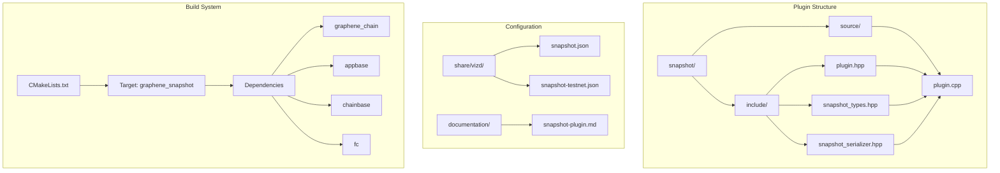
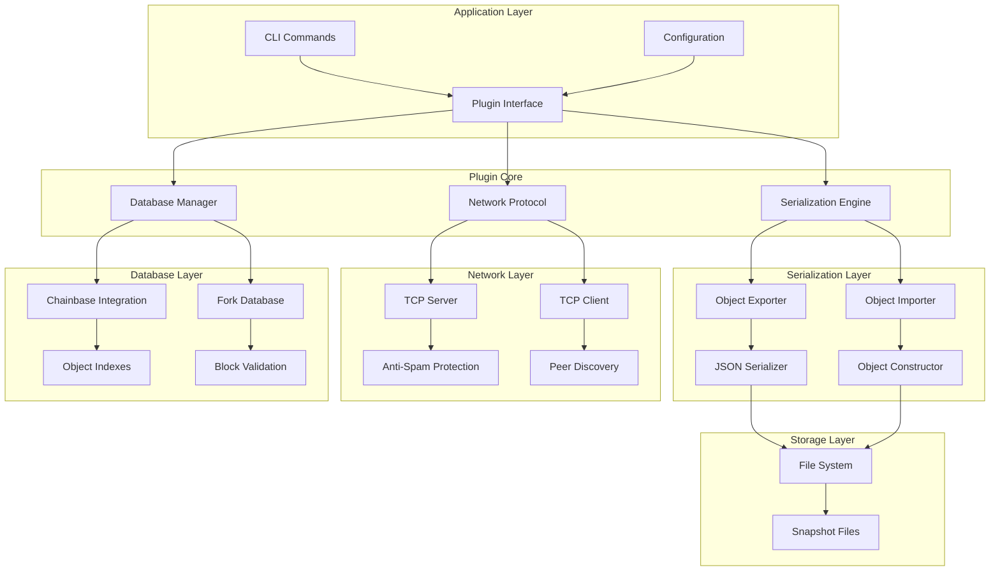
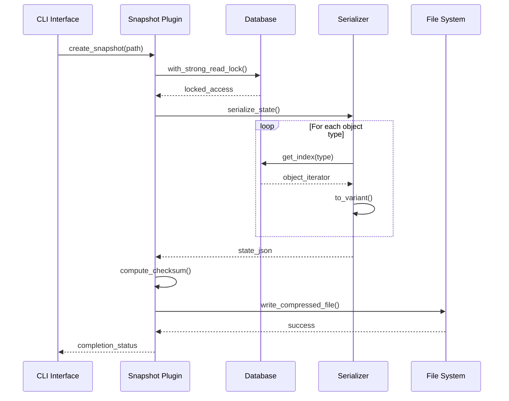
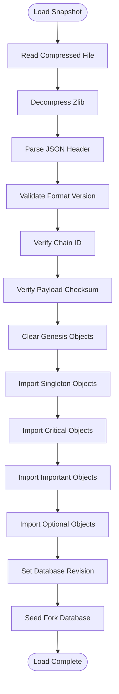
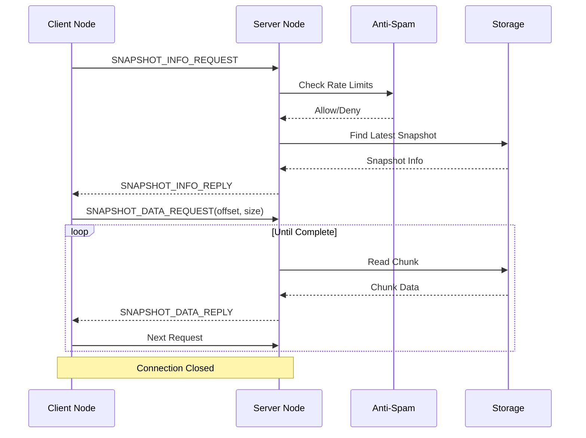
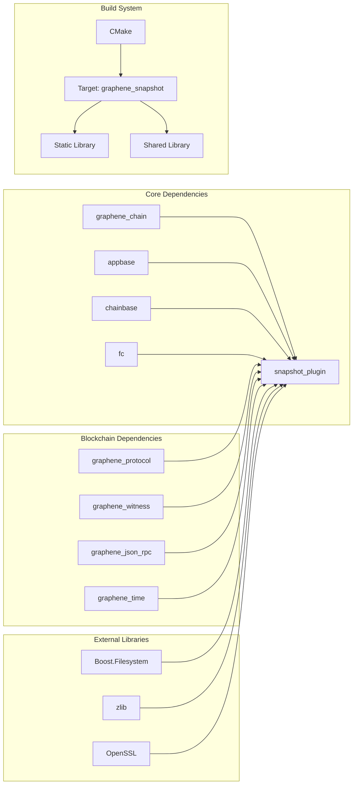

# Snapshot Plugin System

<cite>
**Referenced Files in This Document**
- [plugin.cpp](file://plugins/snapshot/plugin.cpp)
- [plugin.hpp](file://plugins/snapshot/include/graphene/plugins/snapshot/plugin.hpp)
- [snapshot_types.hpp](file://plugins/snapshot/include/graphene/plugins/snapshot/snapshot_types.hpp)
- [snapshot_serializer.hpp](file://plugins/snapshot/include/graphene/plugins/snapshot/snapshot_serializer.hpp)
- [CMakeLists.txt](file://plugins/snapshot/CMakeLists.txt)
- [snapshot.json](file://share/vizd/snapshot.json)
- [snapshot-testnet.json](file://share/vizd/snapshot-testnet.json)
- [snapshot-plugin.md](file://documentation/snapshot-plugin.md)
</cite>

## Table of Contents
1. [Introduction](#introduction)
2. [Project Structure](#project-structure)
3. [Core Components](#core-components)
4. [Architecture Overview](#architecture-overview)
5. [Detailed Component Analysis](#detailed-component-analysis)
6. [Dependency Analysis](#dependency-analysis)
7. [Performance Considerations](#performance-considerations)
8. [Troubleshooting Guide](#troubleshooting-guide)
9. [Conclusion](#conclusion)

## Introduction

The Snapshot Plugin System is a comprehensive solution for VIZ blockchain nodes that enables efficient state synchronization through distributed ledger technology (DLT). This system provides mechanisms for creating, loading, serving, and downloading blockchain state snapshots, significantly reducing bootstrap times and enabling rapid node initialization.

The plugin addresses the fundamental challenge of blockchain bootstrapping by allowing nodes to jump directly to a recent state rather than replaying thousands of blocks. This is particularly crucial for VIZ's social media and content platform characteristics, where rapid deployment and scaling are essential.

## Project Structure

The snapshot plugin is organized within the VIZ C++ node codebase following a modular architecture:

**Diagram sources**
- [plugin.cpp:1-50](file://plugins/snapshot/plugin.cpp#L1-L50)
- [plugin.hpp:1-88](file://plugins/snapshot/include/graphene/plugins/snapshot/plugin.hpp#L1-L88)
- [snapshot_types.hpp:1-52](file://plugins/snapshot/include/graphene/plugins/snapshot/snapshot_types.hpp#L1-L52)
- [CMakeLists.txt:1-52](file://plugins/snapshot/CMakeLists.txt#L1-L52)

**Section sources**
- [plugin.cpp:1-50](file://plugins/snapshot/plugin.cpp#L1-L50)
- [CMakeLists.txt:1-52](file://plugins/snapshot/CMakeLists.txt#L1-L52)

## Core Components

The snapshot plugin consists of several interconnected components that work together to provide comprehensive state synchronization capabilities:

### Plugin Interface Layer
The main plugin class provides the primary interface for external systems to interact with the snapshot functionality. It implements the appbase plugin interface and exposes methods for loading and creating snapshots programmatically.

### Serialization Engine
A sophisticated serialization system handles the conversion of blockchain state objects to/from compressed JSON format. This engine manages different object types with varying memory layouts and special data structures.

### Network Protocol Implementation
The plugin implements a custom TCP protocol for peer-to-peer snapshot distribution, including message framing, authentication, and transfer optimization.

### Database Integration
Deep integration with the VIZ blockchain database ensures seamless state transitions and maintains consistency during snapshot operations.

**Section sources**
- [plugin.hpp:42-76](file://plugins/snapshot/include/graphene/plugins/snapshot/plugin.hpp#L42-L76)
- [snapshot_types.hpp:16-52](file://plugins/snapshot/include/graphene/plugins/snapshot/snapshot_types.hpp#L16-L52)

## Architecture Overview

The snapshot plugin follows a layered architecture designed for modularity and extensibility:

**Diagram sources**
- [plugin.cpp:675-780](file://plugins/snapshot/plugin.cpp#L675-L780)
- [snapshot_serializer.hpp:37-107](file://plugins/snapshot/include/graphene/plugins/snapshot/snapshot_serializer.hpp#L37-L107)

The architecture emphasizes separation of concerns with clear boundaries between serialization, networking, and database operations. This design enables independent development and testing of each component while maintaining system coherence.

**Section sources**
- [plugin.cpp:675-780](file://plugins/snapshot/plugin.cpp#L675-L780)
- [snapshot_serializer.hpp:37-107](file://plugins/snapshot/include/graphene/plugins/snapshot/snapshot_serializer.hpp#L37-L107)

## Detailed Component Analysis

### Snapshot Creation and Management

The snapshot creation process involves comprehensive state serialization with careful handling of different object types:

**Diagram sources**
- [plugin.cpp:885-987](file://plugins/snapshot/plugin.cpp#L885-L987)
- [plugin.cpp:789-883](file://plugins/snapshot/plugin.cpp#L789-L883)

The creation process handles over 30 different object types, from critical singleton objects to optional metadata. Each object type receives specialized treatment based on its memory layout and data structure complexity.

### Snapshot Loading and Validation

Snapshot loading implements rigorous validation and reconstruction procedures:

**Diagram sources**
- [plugin.cpp:1046-1288](file://plugins/snapshot/plugin.cpp#L1046-L1288)

The loading process includes extensive validation steps to ensure data integrity and compatibility with the current node configuration.

### Network Protocol Implementation

The snapshot protocol provides efficient peer-to-peer distribution with robust error handling:

**Diagram sources**
- [plugin.cpp:1902-2038](file://plugins/snapshot/plugin.cpp#L1902-L2038)
- [plugin.cpp:1470-1599](file://plugins/snapshot/plugin.cpp#L1470-L1599)

The protocol includes sophisticated anti-spam protection mechanisms and supports large file transfers through chunked delivery.

### Configuration and Options

The plugin supports extensive configuration through both command-line arguments and configuration files:

| Option | Type | Default | Description |
|--------|------|---------|-------------|
| `snapshot-at-block` | uint32 | 0 | Create snapshot at specific block number |
| `snapshot-every-n-blocks` | uint32 | 0 | Create periodic snapshots |
| `snapshot-dir` | string | "" | Directory for auto-generated snapshots |
| `allow-snapshot-serving` | bool | false | Enable TCP snapshot serving |
| `allow-snapshot-serving-only-trusted` | bool | false | Restrict serving to trusted peers |
| `snapshot-serve-endpoint` | string | "0.0.0.0:8092" | TCP listen endpoint |
| `trusted-snapshot-peer` | string[] | [] | Trusted peer endpoints |
| `sync-snapshot-from-trusted-peer` | bool | false | Download snapshot on empty state |
| `enable-stalled-sync-detection` | bool | false | Auto-detect stalled sync |
| `stalled-sync-timeout-minutes` | uint32 | 5 | Timeout for stalled sync |

**Section sources**
- [plugin.cpp:2473-2510](file://plugins/snapshot/plugin.cpp#L2473-L2510)
- [snapshot-plugin.md:247-273](file://documentation/snapshot-plugin.md#L247-L273)

## Dependency Analysis

The snapshot plugin has carefully managed dependencies to ensure modularity and maintainability:

**Diagram sources**
- [CMakeLists.txt:27-38](file://plugins/snapshot/CMakeLists.txt#L27-L38)

The dependency graph reveals a clean separation between core blockchain functionality and plugin-specific features. The plugin relies on established VIZ infrastructure while maintaining independence from external systems.

**Section sources**
- [CMakeLists.txt:27-38](file://plugins/snapshot/CMakeLists.txt#L27-L38)

## Performance Considerations

The snapshot plugin implements several performance optimization strategies:

### Compression and Storage Efficiency
- Uses zlib compression to reduce snapshot file sizes by approximately 70-80%
- Implements streaming compression/decompression to minimize memory usage
- Supports automatic snapshot rotation to manage storage requirements

### Network Transfer Optimization
- Chunked transfer protocol with configurable chunk sizes (up to 1MB)
- Connection pooling and reuse for efficient peer communication
- Anti-spam measures prevent resource exhaustion during transfers

### Database Operation Optimization
- Uses strong read locks during snapshot creation to ensure consistency
- Implements witness-aware deferral to prevent missed block production slots
- Optimized object serialization minimizes CPU overhead

### Memory Management
- Streaming JSON parsing prevents loading entire snapshots into memory
- Efficient object copying mechanisms handle complex data structures
- Automatic cleanup of temporary files and resources

## Troubleshooting Guide

### Common Issues and Solutions

**Snapshot Creation Failures**
- **Symptom**: Snapshot creation fails with database lock errors
- **Cause**: Witness production conflicts with snapshot creation
- **Solution**: Configure witness-aware deferral or schedule snapshots during maintenance windows

**Network Transfer Problems**
- **Symptom**: Peers fail to respond to snapshot requests
- **Cause**: Firewall restrictions or anti-spam protection
- **Solution**: Verify port accessibility and adjust anti-spam thresholds

**Memory Issues During Loading**
- **Symptom**: Loading fails due to insufficient memory
- **Cause**: Large snapshot files exceeding available RAM
- **Solution**: Use streaming loading or increase system resources

**Checksum Validation Errors**
- **Symptom**: Snapshot loading fails with checksum mismatch
- **Cause**: Corrupted snapshot file or tampering
- **Solution**: Recreate snapshot from source or download from trusted peer

### Diagnostic Tools

The plugin includes comprehensive diagnostic capabilities:

- **Trusted Seeds Test**: Validates connectivity and performance of configured peers
- **Stalled Sync Detection**: Automatically recovers from network partitions
- **Progress Monitoring**: Real-time feedback during long-running operations

**Section sources**
- [plugin.cpp:2294-2464](file://plugins/snapshot/plugin.cpp#L2294-L2464)
- [plugin.cpp:1378-1464](file://plugins/snapshot/plugin.cpp#L1378-L1464)

## Conclusion

The Snapshot Plugin System represents a sophisticated solution for blockchain state synchronization that significantly improves the VIZ node bootstrapping experience. Through careful architectural design, comprehensive feature coverage, and robust error handling, it enables efficient deployment and scaling of VIZ-based applications.

Key strengths of the system include its modular architecture, extensive configuration options, and built-in performance optimizations. The plugin seamlessly integrates with existing VIZ infrastructure while providing powerful new capabilities for state management and peer-to-peer synchronization.

The implementation demonstrates best practices in blockchain plugin development, including proper resource management, error handling, and user experience considerations. Future enhancements could focus on additional compression algorithms, enhanced security features, and expanded monitoring capabilities.