# Snapshot Plugin System

<cite>
**Referenced Files in This Document**
- [plugin.hpp](file://plugins/snapshot/include/graphene/plugins/snapshot/plugin.hpp)
- [snapshot_serializer.hpp](file://plugins/snapshot/include/graphene/plugins/snapshot/snapshot_serializer.hpp)
- [snapshot_types.hpp](file://plugins/snapshot/include/graphene/plugins/snapshot/snapshot_types.hpp)
- [plugin.cpp](file://plugins/snapshot/plugin.cpp)
- [CMakeLists.txt](file://plugins/snapshot/CMakeLists.txt)
- [snapshot-plugin.md](file://documentation/snapshot-plugin.md)
- [snapshot.json](file://share/vizd/snapshot.json)
- [database.hpp](file://libraries/chain/include/graphene/chain/database.hpp)
- [database.cpp](file://libraries/chain/database.cpp)
- [plugin.cpp](file://plugins/chain/plugin.cpp)
- [plugin.hpp](file://plugins/chain/include/graphene/plugins/chain/plugin.hpp)
</cite>

## Update Summary
**Changes Made**
- Enhanced P2P snapshot synchronization with automatic default behavior for empty nodes
- Improved logging with real-time progress feedback during snapshot operations
- Added automatic directory creation capabilities for snapshot file management
- Enhanced chain plugin integration for seamless snapshot synchronization during blockchain initialization
- Updated snapshot creation and loading processes with improved error handling and validation

## Table of Contents
1. [Introduction](#introduction)
2. [Project Structure](#project-structure)
3. [Core Components](#core-components)
4. [Architecture Overview](#architecture-overview)
5. [Detailed Component Analysis](#detailed-component-analysis)
6. [Enhanced State Restoration Process](#enhanced-state-restoration-process)
7. [Enhanced P2P Snapshot Synchronization](#enhanced-p2p-snapshot-synchronization)
8. [Improved Logging and Progress Feedback](#improved-logging-and-progress-feedback)
9. [Automatic Directory Management](#automatic-directory-management)
10. [Enhanced Chain Plugin Integration](#enhanced-chain-plugin-integration)
11. [Dependency Analysis](#dependency-analysis)
12. [Performance Considerations](#performance-considerations)
13. [Troubleshooting Guide](#troubleshooting-guide)
14. [Conclusion](#conclusion)

## Introduction

The Snapshot Plugin System is a comprehensive solution for managing DLT (Distributed Ledger Technology) state snapshots in VIZ blockchain nodes. This system enables efficient node bootstrapping, state synchronization between nodes, and automated snapshot management through a sophisticated TCP-based protocol.

**Updated**: Enhanced with improved P2P snapshot synchronization featuring automatic default behavior for empty nodes, real-time progress feedback during operations, automatic directory creation capabilities, and seamless integration with the chain plugin for automatic snapshot synchronization during blockchain initialization.

The plugin provides five primary capabilities:
- **State Creation**: Generate compressed JSON snapshots containing complete blockchain state
- **State Loading**: Rapidly bootstrap nodes from existing snapshots instead of replaying blocks
- **P2P Synchronization**: Enable nodes to serve and download snapshots from trusted peers
- **Automatic Directory Management**: Intelligent snapshot file organization with automatic creation
- **Real-time Progress Monitoring**: Comprehensive logging and progress feedback throughout operations

This system is particularly valuable for DLT mode operations where traditional block logs are not maintained, allowing nodes to quickly synchronize state from any recent block.

## Project Structure

The snapshot plugin follows a modular architecture with clear separation of concerns:

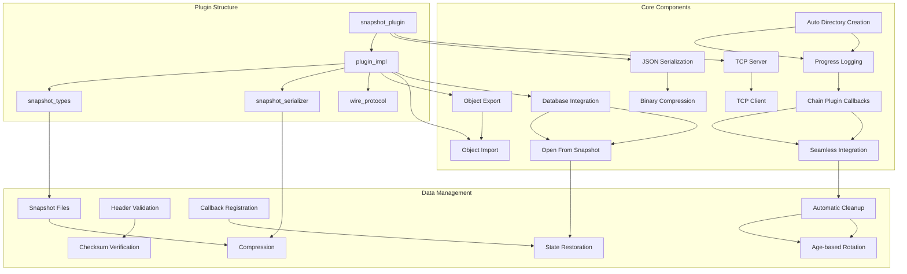
```mermaid
graph TB
subgraph "Plugin Structure"
A[snapshot_plugin] --> B[plugin_impl]
B --> C[snapshot_types]
B --> D[snapshot_serializer]
B --> E[wire_protocol]
end
subgraph "Core Components"
F[JSON Serialization] --> G[Binary Compression]
H[Object Export] --> I[Object Import]
J[TCP Server] --> K[TCP Client]
L[Database Integration] --> M[Open From Snapshot]
N[Auto Directory Creation] --> O[Progress Logging]
P[Chain Plugin Callbacks] --> Q[Seamless Integration]
end
subgraph "Data Management"
R[Snapshot Files] --> S[Compression]
T[Header Validation] --> U[Checksum Verification]
V[Callback Registration] --> W[State Restoration]
X[Automatic Cleanup] --> Y[Age-based Rotation]
end
A --> F
A --> J
B --> H
B --> I
C --> R
D --> S
B --> L
L --> M
M --> W
N --> O
O --> P
P --> Q
Q --> X
X --> Y
```

**Diagram sources**
- [plugin.cpp:40-745](file://plugins/snapshot/plugin.cpp#L40-L745)
- [plugin.hpp:42-76](file://plugins/snapshot/include/graphene/plugins/snapshot/plugin.hpp#L42-L76)
- [database.cpp:281-324](file://libraries/chain/database.cpp#L281-L324)

**Section sources**
- [plugin.cpp:1-800](file://plugins/snapshot/plugin.cpp#L1-L800)
- [CMakeLists.txt:1-51](file://plugins/snapshot/CMakeLists.txt#L1-L51)

## Core Components

### Snapshot Types and Constants

The plugin defines a comprehensive set of types and constants for snapshot management:

**Snapshot Format Specifications:**
- **Magic Bytes**: `0x015A4956` (VIZ signature)
- **Format Version**: 1.0
- **Compression**: Zlib-compressed JSON format
- **File Extensions**: `.vizjson` or `.json`

**Section Types:**
- `section_header`: Contains snapshot metadata
- `section_objects`: Serialized blockchain objects
- `section_fork_db_block`: Fork database initialization
- `section_checksum`: Integrity verification data
- `section_end`: File termination marker

**Section sources**
- [snapshot_types.hpp:16-43](file://plugins/snapshot/include/graphene/plugins/snapshot/snapshot_types.hpp#L16-L43)

### Wire Protocol Messages

The snapshot synchronization protocol uses a binary message format:

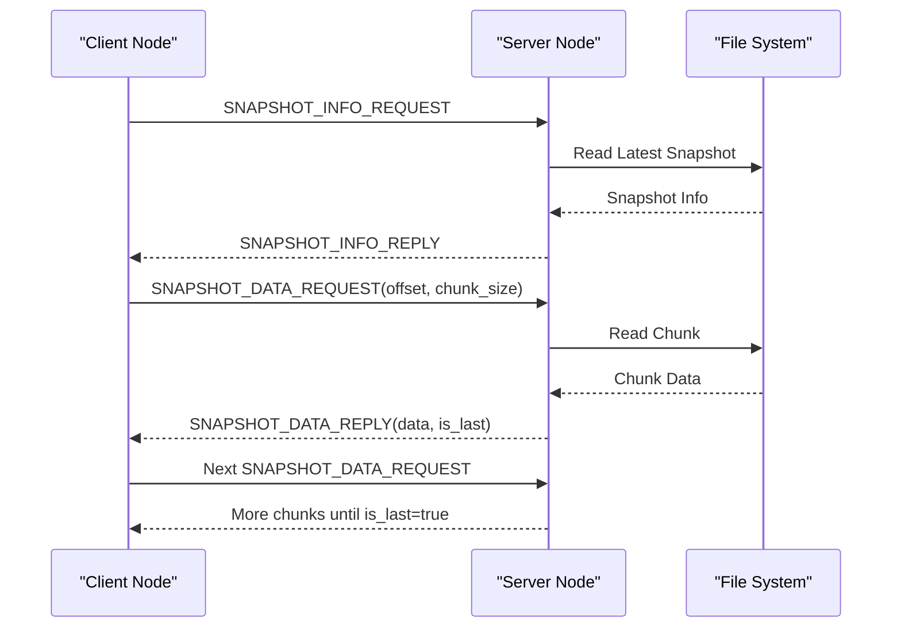
```mermaid
sequenceDiagram
participant Client as "Client Node"
participant Server as "Server Node"
participant FS as "File System"
Client->>Server : SNAPSHOT_INFO_REQUEST
Server->>FS : Read Latest Snapshot
FS-->>Server : Snapshot Info
Server-->>Client : SNAPSHOT_INFO_REPLY
Client->>Server : SNAPSHOT_DATA_REQUEST(offset, chunk_size)
Server->>FS : Read Chunk
FS-->>Server : Chunk Data
Server-->>Client : SNAPSHOT_DATA_REPLY(data, is_last)
Client->>Server : Next SNAPSHOT_DATA_REQUEST
Server-->>Client : More chunks until is_last=true
```

**Diagram sources**
- [plugin.cpp:1249-1617](file://plugins/snapshot/plugin.cpp#L1249-L1617)

**Section sources**
- [plugin.hpp:15-40](file://plugins/snapshot/include/graphene/plugins/snapshot/plugin.hpp#L15-L40)

### Plugin Implementation Classes

The plugin uses a two-tier architecture with clear separation between public interface and implementation:

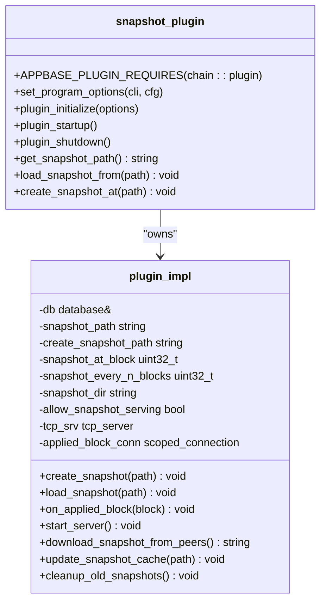
```mermaid
classDiagram
class snapshot_plugin {
+APPBASE_PLUGIN_REQUIRES(chain : : plugin)
+set_program_options(cli, cfg)
+plugin_initialize(options)
+plugin_startup()
+plugin_shutdown()
+get_snapshot_path() string
+load_snapshot_from(path) void
+create_snapshot_at(path) void
}
class plugin_impl {
-db database&
-snapshot_path string
-create_snapshot_path string
-snapshot_at_block uint32_t
-snapshot_every_n_blocks uint32_t
-snapshot_dir string
-allow_snapshot_serving bool
-tcp_srv tcp_server
-applied_block_conn scoped_connection
+create_snapshot(path) void
+load_snapshot(path) void
+on_applied_block(block) void
+start_server() void
+download_snapshot_from_peers() string
+update_snapshot_cache(path) void
+cleanup_old_snapshots() void
}
snapshot_plugin --> plugin_impl : "owns"
```

**Diagram sources**
- [plugin.hpp:42-76](file://plugins/snapshot/include/graphene/plugins/snapshot/plugin.hpp#L42-L76)
- [plugin.cpp:665-745](file://plugins/snapshot/plugin.cpp#L665-L745)

**Section sources**
- [plugin.cpp:665-745](file://plugins/snapshot/plugin.cpp#L665-L745)

## Architecture Overview

The snapshot plugin implements a comprehensive state management system with multiple operational modes:

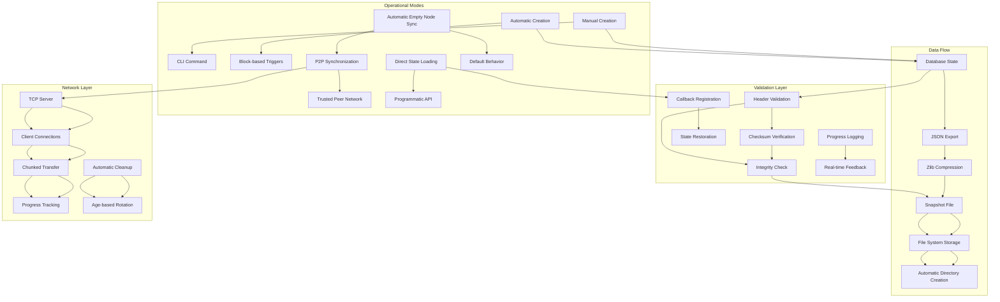
```mermaid
graph TB
subgraph "Operational Modes"
A[Manual Creation] --> B[CLI Command]
C[Automatic Creation] --> D[Block-based Triggers]
E[P2P Synchronization] --> F[Trusted Peer Network]
G[Direct State Loading] --> H[Programmatic API]
I[Automatic Empty Node Sync] --> J[Default Behavior]
end
subgraph "Data Flow"
K[Database State] --> L[JSON Export]
L --> M[Zlib Compression]
M --> N[Snapshot File]
N --> O[File System Storage]
O --> P[Automatic Directory Creation]
end
subgraph "Validation Layer"
Q[Header Validation] --> R[Checksum Verification]
R --> S[Integrity Check]
T[Callback Registration] --> U[State Restoration]
V[Progress Logging] --> W[Real-time Feedback]
end
subgraph "Network Layer"
X[TCP Server] --> Y[Client Connections]
Y --> Z[Chunked Transfer]
Z --> AA[Progress Tracking]
BB[Automatic Cleanup] --> CC[Age-based Rotation]
end
A --> K
C --> K
E --> X
G --> T
I --> E
K --> Q
Q --> S
S --> N
N --> O
O --> P
X --> Y
Y --> Z
Z --> AA
BB --> CC
```

**Diagram sources**
- [plugin.cpp:843-1203](file://plugins/snapshot/plugin.cpp#L843-L1203)
- [plugin.cpp:1409-1617](file://plugins/snapshot/plugin.cpp#L1409-L1617)
- [database.cpp:281-324](file://libraries/chain/database.cpp#L281-L324)

The architecture supports five primary use cases:
1. **Manual Snapshot Creation**: Generate snapshots on demand for backup or distribution
2. **Automatic Snapshot Generation**: Create snapshots at specific block heights or intervals
3. **P2P Snapshot Synchronization**: Enable nodes to bootstrap from trusted peers
4. **Direct State Loading**: Programmatic loading of snapshots through the `open_from_snapshot` method
5. **Automatic Empty Node Synchronization**: Seamless snapshot synchronization for nodes with empty state

**Section sources**
- [plugin.cpp:1767-1976](file://plugins/snapshot/plugin.cpp#L1767-L1976)
- [snapshot-plugin.md:1-164](file://documentation/snapshot-plugin.md#L1-L164)

## Detailed Component Analysis

### State Export and Serialization

The snapshot system employs a sophisticated export mechanism that converts database state into a portable format:


```mermaid
flowchart TD
Start([Export State]) --> Header[Build Snapshot Header]
Header --> Critical[Export Critical Objects]
Critical --> Important[Export Important Objects]
Important --> Optional[Export Optional Objects]
Optional --> Checksum[Compute Payload Checksum]
Checksum --> Compress[Compress with Zlib]
Compress --> Write[Write to File]
Write --> Cache[Update Cache]
Cache --> AutoDir[Check Auto Directory]
AutoDir --> End([Export Complete])
Critical --> |Dynamic Global Property| DGP[Export DGP]
Critical --> |Witness Schedule| WS[Export WS]
Critical --> |Hardfork Property| HF[Export HF]
Critical --> |Accounts| ACC[Export Accounts]
Critical --> |Witnesses| WIT[Export Witnesses]
Important --> |Transactions| TRX[Export Transactions]
Important --> |Proposals| PROP[Export Proposals]
Important --> |Committee Requests| CR[Export Committee Requests]
Optional --> |Content Types| CT[Export Content Types]
Optional --> |Account Metadata| AM[Export Account Metadata]
```

**Diagram sources**
- [plugin.cpp:747-841](file://plugins/snapshot/plugin.cpp#L747-L841)
- [plugin.cpp:843-935](file://plugins/snapshot/plugin.cpp#L843-L935)

The export process handles different object categories with varying complexity:

**Critical Objects**: Singleton objects that require modification rather than creation
- Dynamic Global Property
- Witness Schedule  
- Hardfork Property

**Multi-instance Objects**: Objects that require ID management and creation
- Accounts and Authorities
- Witnesses and Votes
- Content and Content Types
- Transactions and Block Summaries

**Section sources**
- [plugin.cpp:1036-1186](file://plugins/snapshot/plugin.cpp#L1036-L1186)

### Object Import and Validation

The import process reverses the export operation with comprehensive validation:

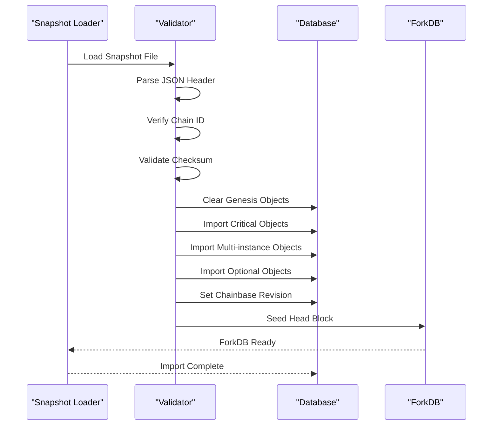
```mermaid
sequenceDiagram
participant Loader as "Snapshot Loader"
participant Validator as "Validator"
participant DB as "Database"
participant ForkDB as "ForkDB"
Loader->>Validator : Load Snapshot File
Validator->>Validator : Parse JSON Header
Validator->>Validator : Verify Chain ID
Validator->>Validator : Validate Checksum
Validator->>DB : Clear Genesis Objects
Validator->>DB : Import Critical Objects
Validator->>DB : Import Multi-instance Objects
Validator->>DB : Import Optional Objects
Validator->>DB : Set Chainbase Revision
Validator->>ForkDB : Seed Head Block
ForkDB-->>Loader : ForkDB Ready
Loader-->>DB : Import Complete
```

**Diagram sources**
- [plugin.cpp:980-1203](file://plugins/snapshot/plugin.cpp#L980-L1203)

The import process includes several validation steps:
1. **File Format Validation**: Ensures proper JSON structure and magic bytes
2. **Chain ID Verification**: Confirms compatibility with local chain configuration
3. **Checksum Validation**: Verifies data integrity using SHA256
4. **Object Validation**: Validates each imported object against protocol requirements

**Section sources**
- [plugin.cpp:1010-1032](file://plugins/snapshot/plugin.cpp#L1010-L1032)

### TCP Server Implementation

The snapshot server provides secure, rate-limited access to snapshot files:

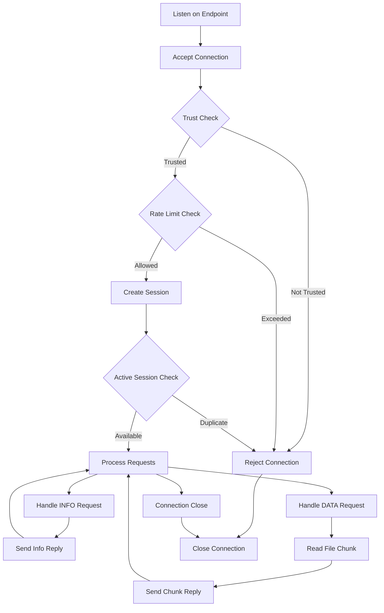
```mermaid
flowchart TD
Listen[Listen on Endpoint] --> Accept[Accept Connection]
Accept --> Trust{Trust Check}
Trust --> |Not Trusted| Reject[Reject Connection]
Trust --> |Trusted| Rate{Rate Limit Check}
Rate --> |Exceeded| Reject
Rate --> |Allowed| Session[Create Session]
Session --> Active{Active Session Check}
Active --> |Duplicate| Reject
Active --> |Available| Process[Process Requests]
Process --> Info[Handle INFO Request]
Process --> Data[Handle DATA Request]
Info --> ReplyInfo[Send Info Reply]
Data --> ReadChunk[Read File Chunk]
ReadChunk --> SendChunk[Send Chunk Reply]
ReplyInfo --> Process
SendChunk --> Process
Process --> Done[Connection Close]
Reject --> Close[Close Connection]
Done --> Close
```

**Diagram sources**
- [plugin.cpp:1409-1544](file://plugins/snapshot/plugin.cpp#L1409-L1544)

The server implements multiple anti-abuse mechanisms:
- **Session Limiting**: Prevents multiple concurrent downloads per IP
- **Rate Limiting**: Limits connections to 3 per hour per IP
- **Trust Enforcement**: Optional restriction to trusted peer list
- **Timeout Protection**: 60-second connection timeout

**Section sources**
- [plugin.cpp:1449-1500](file://plugins/snapshot/plugin.cpp#L1449-L1500)

### TCP Client Implementation

The client component enables automatic snapshot synchronization from trusted peers:

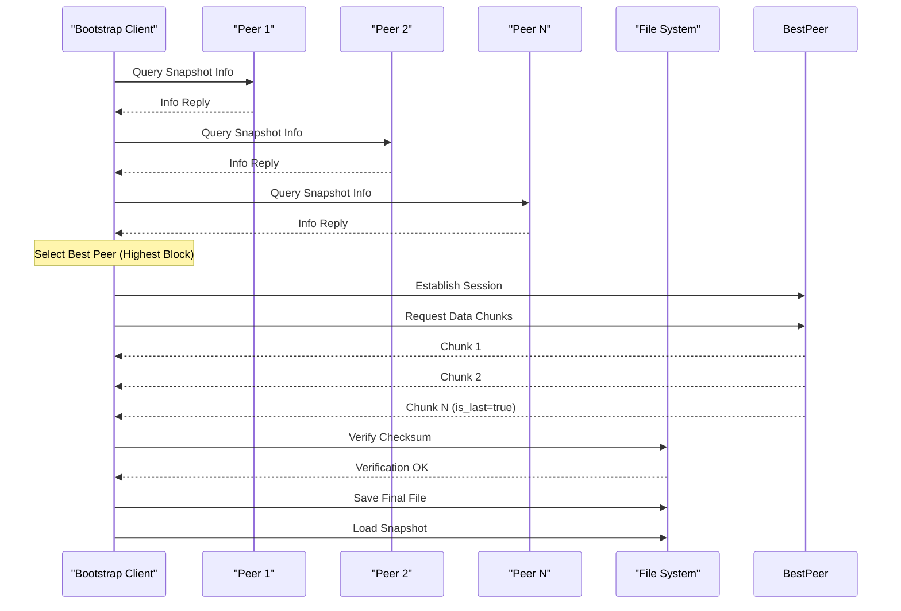
```mermaid
sequenceDiagram
participant Client as "Bootstrap Client"
participant Peer1 as "Peer 1"
participant Peer2 as "Peer 2"
participant PeerN as "Peer N"
participant FS as "File System"
Client->>Peer1 : Query Snapshot Info
Peer1-->>Client : Info Reply
Client->>Peer2 : Query Snapshot Info
Peer2-->>Client : Info Reply
Client->>PeerN : Query Snapshot Info
PeerN-->>Client : Info Reply
Note over Client : Select Best Peer (Highest Block)
Client->>BestPeer : Establish Session
Client->>BestPeer : Request Data Chunks
BestPeer-->>Client : Chunk 1
BestPeer-->>Client : Chunk 2
BestPeer-->>Client : Chunk N (is_last=true)
Client->>FS : Verify Checksum
FS-->>Client : Verification OK
Client->>FS : Save Final File
Client->>FS : Load Snapshot
```

**Diagram sources**
- [plugin.cpp:1623-1758](file://plugins/snapshot/plugin.cpp#L1623-L1758)

**Section sources**
- [plugin.cpp:1623-1758](file://plugins/snapshot/plugin.cpp#L1623-L1758)

### Snapshot Serializer Utilities

The serializer provides specialized handling for complex object types:

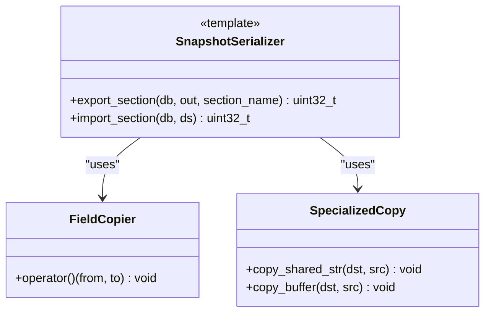
```mermaid
classDiagram
class SnapshotSerializer {
<<template>>
+export_section(db, out, section_name) uint32_t
+import_section(db, ds) uint32_t
}
class FieldCopier {
+operator()(from, to) void
}
class SpecializedCopy {
+copy_shared_str(dst, src) void
+copy_buffer(dst, src) void
}
SnapshotSerializer --> FieldCopier : "uses"
SnapshotSerializer --> SpecializedCopy : "uses"
```

**Diagram sources**
- [snapshot_serializer.hpp:37-157](file://plugins/snapshot/include/graphene/plugins/snapshot/snapshot_serializer.hpp#L37-L157)

The serializer handles two distinct object categories:
- **Simple Objects**: Standard types with straightforward field copying
- **Complex Objects**: Types with shared_string and buffer_type members requiring specialized handling

**Section sources**
- [snapshot_serializer.hpp:125-157](file://plugins/snapshot/include/graphene/plugins/snapshot/snapshot_serializer.hpp#L125-L157)

## Enhanced State Restoration Process

**Updated**: The state restoration process has been significantly enhanced with improved error handling, validation, and integration with the database layer.

### Database Integration and Callback Registration

The snapshot plugin now integrates deeply with the chain plugin through a callback-based architecture:

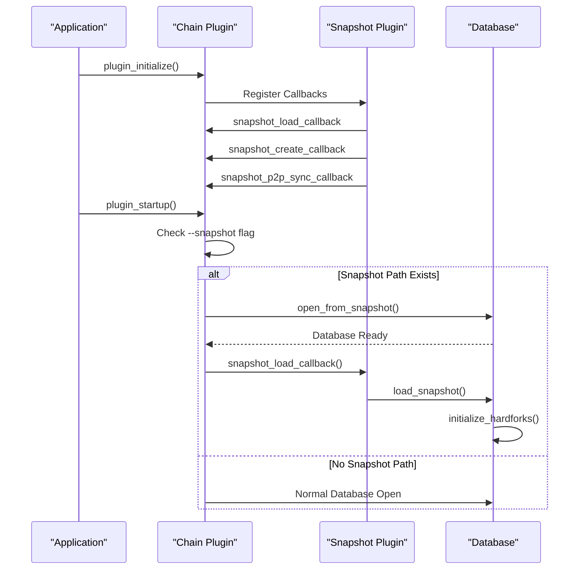
```mermaid
sequenceDiagram
participant App as "Application"
participant Chain as "Chain Plugin"
participant Snap as "Snapshot Plugin"
participant DB as "Database"
App->>Chain : plugin_initialize()
Chain->>Snap : Register Callbacks
Snap->>Chain : snapshot_load_callback
Snap->>Chain : snapshot_create_callback
Snap->>Chain : snapshot_p2p_sync_callback
App->>Chain : plugin_startup()
Chain->>Chain : Check --snapshot flag
alt Snapshot Path Exists
Chain->>DB : open_from_snapshot()
DB-->>Chain : Database Ready
Chain->>Snap : snapshot_load_callback()
Snap->>DB : load_snapshot()
DB->>DB : initialize_hardforks()
else No Snapshot Path
Chain->>DB : Normal Database Open
end
```

**Diagram sources**
- [plugin.cpp:1872-1918](file://plugins/snapshot/plugin.cpp#L1872-L1918)
- [database.cpp:281-324](file://libraries/chain/database.cpp#L281-L324)

### Enhanced Error Handling and Validation

The state restoration process now includes comprehensive error handling and validation:

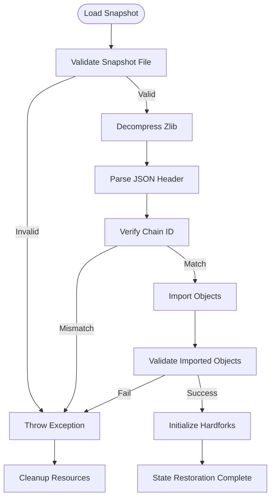
```mermaid
flowchart TD
Start([Load Snapshot]) --> Validate[Validate Snapshot File]
Validate --> |Invalid| Error[Throw Exception]
Validate --> |Valid| Decompress[Decompress Zlib]
Decompress --> Parse[Parse JSON Header]
Parse --> Verify[Verify Chain ID]
Verify --> |Mismatch| Error
Verify --> |Match| Import[Import Objects]
Import --> ValidateObjects[Validate Imported Objects]
ValidateObjects --> |Fail| Error
ValidateObjects --> |Success| InitializeHF[Initialize Hardforks]
InitializeHF --> Success[State Restoration Complete]
Error --> Cleanup[Cleanup Resources]
```

**Diagram sources**
- [plugin.cpp:980-1203](file://plugins/snapshot/plugin.cpp#L980-L1203)

### Direct State Loading via Programmatic API

**New**: The snapshot plugin now provides programmatic access to state loading through the `load_snapshot_from` method:

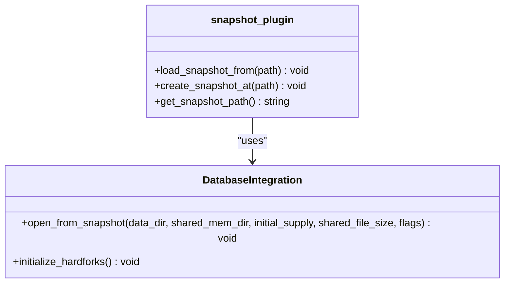
```mermaid
classDiagram
class snapshot_plugin {
+load_snapshot_from(path) void
+create_snapshot_at(path) void
+get_snapshot_path() string
}
class DatabaseIntegration {
+open_from_snapshot(data_dir, shared_mem_dir, initial_supply, shared_file_size, flags) void
+initialize_hardforks() void
}
snapshot_plugin --> DatabaseIntegration : "uses"
```

**Diagram sources**
- [plugin.hpp:67-71](file://plugins/snapshot/include/graphene/plugins/snapshot/plugin.hpp#L67-L71)
- [database.hpp:102-107](file://libraries/chain/include/graphene/chain/database.hpp#L102-L107)

**Section sources**
- [plugin.cpp:1872-1918](file://plugins/snapshot/plugin.cpp#L1872-L1918)
- [database.cpp:281-324](file://libraries/chain/database.cpp#L281-L324)

## Enhanced P2P Snapshot Synchronization

**Updated**: The P2P snapshot synchronization has been enhanced with automatic default behavior for empty nodes, providing seamless bootstrap capabilities.

### Automatic Empty Node Detection and Synchronization

The system now automatically detects empty nodes (where head_block_num == 0) and initiates snapshot synchronization:

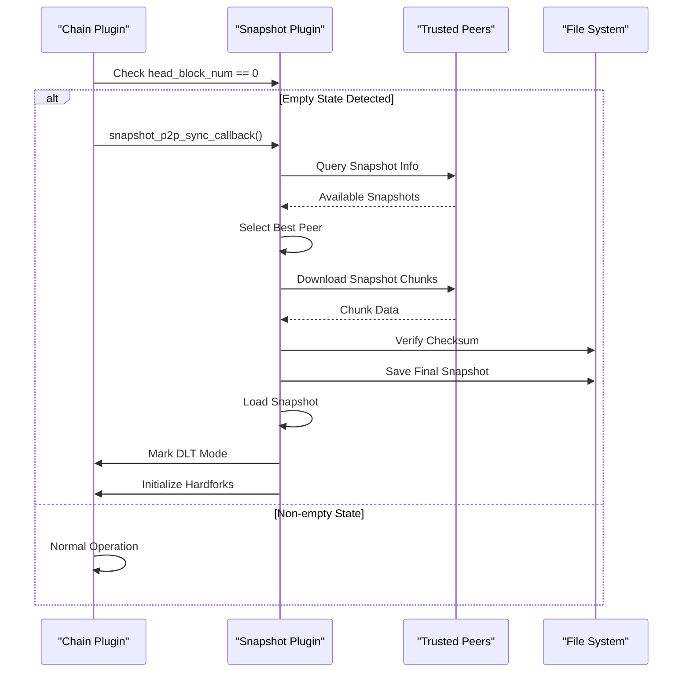
```mermaid
sequenceDiagram
participant Chain as "Chain Plugin"
participant Snap as "Snapshot Plugin"
participant Peers as "Trusted Peers"
participant FS as "File System"
Chain->>Snap : Check head_block_num == 0
alt Empty State Detected
Chain->>Snap : snapshot_p2p_sync_callback()
Snap->>Peers : Query Snapshot Info
Peers-->>Snap : Available Snapshots
Snap->>Snap : Select Best Peer
Snap->>Peers : Download Snapshot Chunks
Peers-->>Snap : Chunk Data
Snap->>FS : Verify Checksum
Snap->>FS : Save Final Snapshot
Snap->>Snap : Load Snapshot
Snap->>Chain : Mark DLT Mode
Snap->>Chain : Initialize Hardforks
else Non-empty State
Chain->>Chain : Normal Operation
end
```

**Diagram sources**
- [plugin.cpp:1956-1981](file://plugins/snapshot/plugin.cpp#L1956-L1981)

### Enhanced Peer Selection Algorithm

The peer selection process now includes intelligent ranking based on snapshot quality and network proximity:

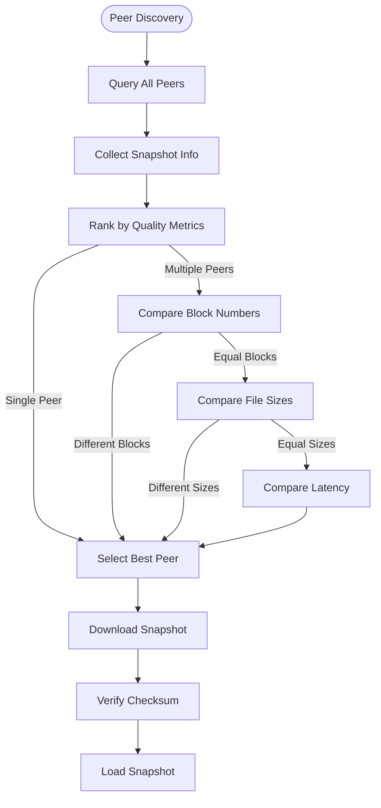
```mermaid
flowchart TD
Start([Peer Discovery]) --> Query[Query All Peers]
Query --> Collect[Collect Snapshot Info]
Collect --> Rank[Rank by Quality Metrics]
Rank --> |Multiple Peers| Compare[Compare Block Numbers]
Rank --> |Single Peer| Select[Select Best Peer]
Compare --> |Equal Blocks| CompareSize[Compare File Sizes]
Compare --> |Different Blocks| Select
CompareSize --> |Equal Sizes| CompareLatency[Compare Latency]
CompareSize --> |Different Sizes| Select
CompareLatency --> Select
Select --> Download[Download Snapshot]
Download --> Verify[Verify Checksum]
Verify --> Load[Load Snapshot]
```

**Diagram sources**
- [plugin.cpp:1651-1710](file://plugins/snapshot/plugin.cpp#L1651-L1710)

**Section sources**
- [plugin.cpp:1956-1981](file://plugins/snapshot/plugin.cpp#L1956-L1981)
- [plugin.cpp:1651-1710](file://plugins/snapshot/plugin.cpp#L1651-L1710)

## Improved Logging and Progress Feedback

**Updated**: The snapshot system now provides comprehensive real-time logging and progress feedback throughout all operations.

### Comprehensive Progress Reporting

The system implements detailed logging for all major operations with real-time progress updates:

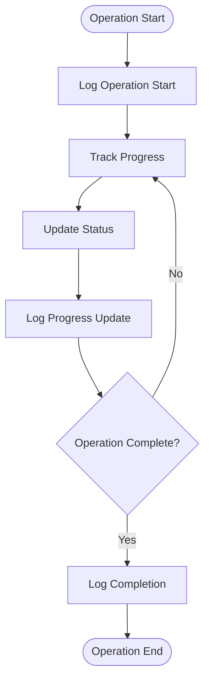
```mermaid
flowchart TD
Start([Operation Start]) --> LogStart[Log Operation Start]
LogStart --> Progress[Track Progress]
Progress --> Status[Update Status]
Status --> LogProgress[Log Progress Update]
LogProgress --> CheckComplete{Operation Complete?}
CheckComplete --> |No| Progress
CheckComplete --> |Yes| LogComplete[Log Completion]
LogComplete --> End([Operation End])
```

**Diagram sources**
- [plugin.cpp:912-944](file://plugins/snapshot/plugin.cpp#L912-L944)
- [plugin.cpp:1740-1777](file://plugins/snapshot/plugin.cpp#L1740-L1777)

### Real-time Download Progress Monitoring

The download process provides granular progress feedback with percentage completion and transfer rates:

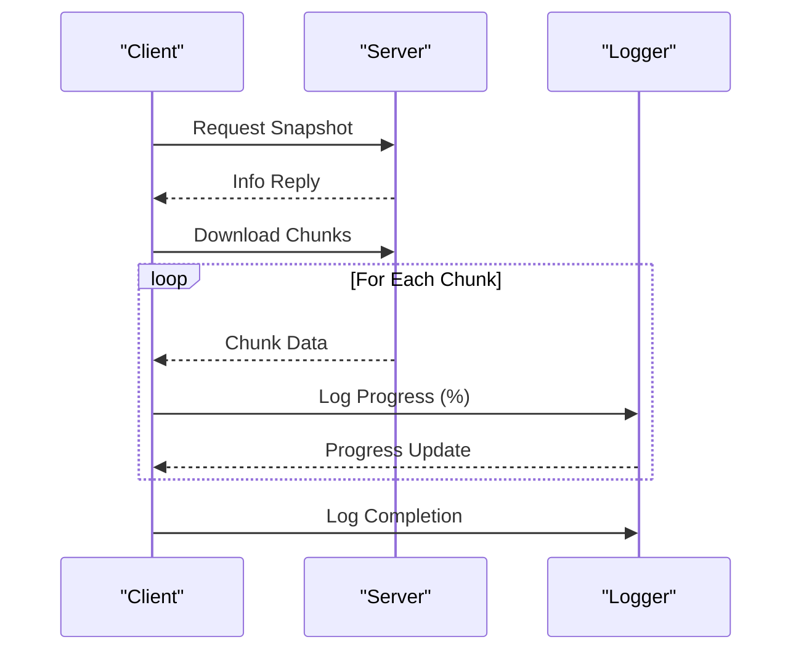
```mermaid
sequenceDiagram
participant Client as "Client"
participant Server as "Server"
participant Logger as "Logger"
Client->>Server : Request Snapshot
Server-->>Client : Info Reply
Client->>Server : Download Chunks
loop For Each Chunk
Server-->>Client : Chunk Data
Client->>Logger : Log Progress (%)
Logger-->>Client : Progress Update
end
Client->>Logger : Log Completion
```

**Diagram sources**
- [plugin.cpp:1740-1777](file://plugins/snapshot/plugin.cpp#L1740-L1777)

**Section sources**
- [plugin.cpp:912-944](file://plugins/snapshot/plugin.cpp#L912-L944)
- [plugin.cpp:1740-1777](file://plugins/snapshot/plugin.cpp#L1740-L1777)

## Automatic Directory Management

**Updated**: The snapshot system now includes intelligent automatic directory creation capabilities to streamline file management.

### Intelligent Directory Creation

The system automatically creates directories when needed, ensuring seamless operation without manual intervention:

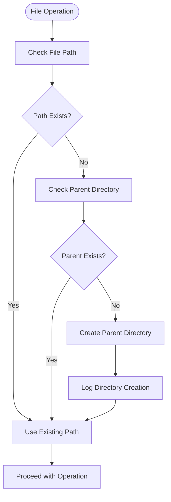
```mermaid
flowchart TD
Start([File Operation]) --> CheckPath[Check File Path]
CheckPath --> Exists{Path Exists?}
Exists --> |Yes| UsePath[Use Existing Path]
Exists --> |No| CheckParent[Check Parent Directory]
CheckParent --> ParentExists{Parent Exists?}
ParentExists --> |Yes| UsePath
ParentExists --> |No| CreateDir[Create Parent Directory]
CreateDir --> LogCreation[Log Directory Creation]
LogCreation --> UsePath
UsePath --> Proceed[Proceed with Operation]
```

**Diagram sources**
- [plugin.cpp:914-925](file://plugins/snapshot/plugin.cpp#L914-L925)
- [plugin.cpp:1728-1734](file://plugins/snapshot/plugin.cpp#L1728-L1734)

### Automatic Cleanup and Rotation

The system includes intelligent cleanup mechanisms to manage disk space efficiently:

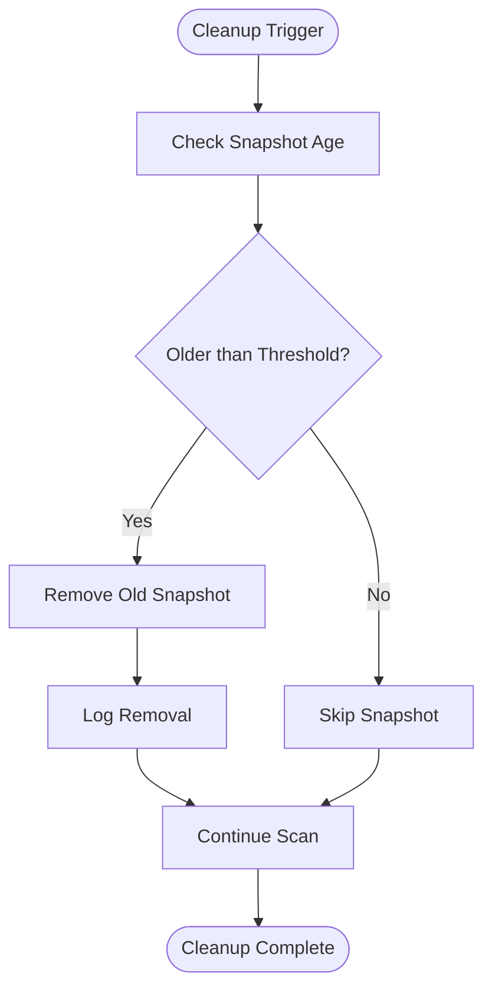
```mermaid
flowchart TD
Start([Cleanup Trigger]) --> CheckAge[Check Snapshot Age]
CheckAge --> OldEnough{Older than Threshold?}
OldEnough --> |Yes| Remove[Remove Old Snapshot]
OldEnough --> |No| Skip[Skip Snapshot]
Remove --> LogRemoval[Log Removal]
LogRemoval --> Continue[Continue Scan]
Skip --> Continue
Continue --> End([Cleanup Complete])
```

**Diagram sources**
- [plugin.cpp:1395-1432](file://plugins/snapshot/plugin.cpp#L1395-L1432)

**Section sources**
- [plugin.cpp:914-925](file://plugins/snapshot/plugin.cpp#L914-L925)
- [plugin.cpp:1395-1432](file://plugins/snapshot/plugin.cpp#L1395-L1432)

## Enhanced Chain Plugin Integration

**Updated**: The snapshot plugin now provides seamless integration with the chain plugin through sophisticated callback mechanisms and automatic synchronization.

### Sophisticated Callback Architecture

The chain plugin exposes three specialized callbacks that enable seamless snapshot integration:

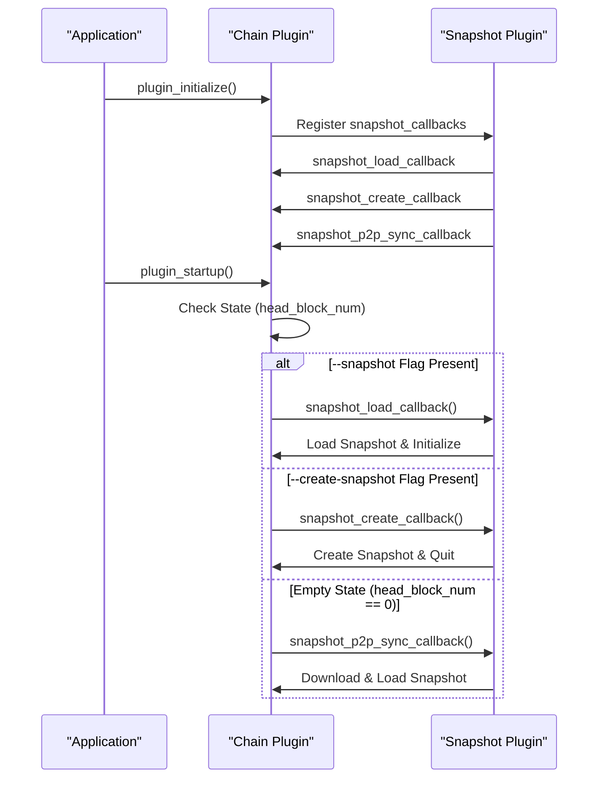
```mermaid
sequenceDiagram
participant App as "Application"
participant Chain as "Chain Plugin"
participant Snap as "Snapshot Plugin"
App->>Chain : plugin_initialize()
Chain->>Snap : Register snapshot_callbacks
Snap->>Chain : snapshot_load_callback
Snap->>Chain : snapshot_create_callback
Snap->>Chain : snapshot_p2p_sync_callback
App->>Chain : plugin_startup()
Chain->>Chain : Check State (head_block_num)
alt --snapshot Flag Present
Chain->>Snap : snapshot_load_callback()
Snap->>Chain : Load Snapshot & Initialize
else --create-snapshot Flag Present
Chain->>Snap : snapshot_create_callback()
Snap->>Chain : Create Snapshot & Quit
else Empty State (head_block_num == 0)
Chain->>Snap : snapshot_p2p_sync_callback()
Snap->>Chain : Download & Load Snapshot
end
```

**Diagram sources**
- [plugin.cpp:1925-1981](file://plugins/snapshot/plugin.cpp#L1925-L1981)
- [plugin.hpp:92-105](file://plugins/chain/include/graphene/plugins/chain/plugin.hpp#L92-L105)

### Automatic State Detection and Response

The chain plugin automatically detects different states and responds appropriately:

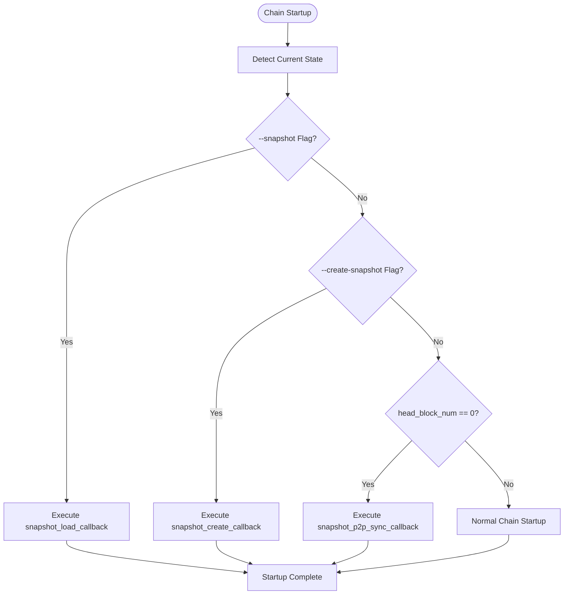
```mermaid
flowchart TD
Start([Chain Startup]) --> DetectState[Detect Current State]
DetectState --> CheckSnapshot{--snapshot Flag?}
CheckSnapshot --> |Yes| LoadSnapshot[Execute snapshot_load_callback]
CheckSnapshot --> |No| CheckCreate{--create-snapshot Flag?}
CheckCreate --> |Yes| CreateSnapshot[Execute snapshot_create_callback]
CheckCreate --> |No| CheckEmpty{head_block_num == 0?}
CheckEmpty --> |Yes| P2PSync[Execute snapshot_p2p_sync_callback]
CheckEmpty --> |No| NormalStartup[Normal Chain Startup]
LoadSnapshot --> Complete[Startup Complete]
CreateSnapshot --> Complete
P2PSync --> Complete
NormalStartup --> Complete
```

**Diagram sources**
- [plugin.cpp:1984-2017](file://plugins/snapshot/plugin.cpp#L1984-L2017)

**Section sources**
- [plugin.cpp:1925-1981](file://plugins/snapshot/plugin.cpp#L1925-L1981)
- [plugin.cpp:1984-2017](file://plugins/snapshot/plugin.cpp#L1984-L2017)

## Dependency Analysis

The snapshot plugin has a well-defined dependency structure that integrates with the broader VIZ ecosystem:

```mermaid
graph TB
subgraph "External Dependencies"
A[fc Library] --> B[JSON Serialization]
A --> C[Compression]
A --> D[Networking]
E[chainbase] --> F[Database Operations]
G[appbase] --> H[Plugin Framework]
I[graphene_protocol] --> J[Blockchain Types]
K[boost::filesystem] --> L[File System Operations]
M[fc::thread] --> N[Async Operations]
end
subgraph "Internal Dependencies"
O[graphene_chain] --> P[Database Interface]
Q[graphene_chain_plugin] --> R[Chain Plugin]
S[graphene_time] --> T[Time Management]
U[graphene_json_rpc] --> V[RPC Integration]
W[graphene_p2p] --> X[P2P Integration]
end
subgraph "Snapshot Plugin"
Y[snapshot_plugin] --> Z[plugin_impl]
Z --> AA[Serialization Layer]
Z --> BB[Network Layer]
Z --> CC[File Management]
Z --> DD[Callback System]
Z --> EE[Progress Logging]
end
A --> Y
E --> Y
G --> Y
I --> Y
K --> Y
M --> Y
O --> Y
Q --> Y
S --> Y
U --> Y
W --> Y
DD --> Y
EE --> Y
```

**Diagram sources**
- [CMakeLists.txt:27-37](file://plugins/snapshot/CMakeLists.txt#L27-L37)

The plugin's dependencies are carefully managed to minimize coupling while maximizing functionality:

**External Dependencies**:
- **fc Library**: Provides core serialization, compression, and networking capabilities
- **chainbase**: Handles database operations and object lifecycle management
- **appbase**: Manages plugin lifecycle and application integration
- **boost::filesystem**: Enables cross-platform file system operations
- **fc::thread**: Provides asynchronous operation support

**Internal Dependencies**:
- **graphene_chain**: Access to blockchain state and database operations
- **graphene_protocol**: Blockchain-specific data types and structures
- **graphene_time**: Time-related operations for snapshot metadata
- **graphene_p2p**: P2P network integration for snapshot synchronization

**Section sources**
- [CMakeLists.txt:27-37](file://plugins/snapshot/CMakeLists.txt#L27-L37)

## Performance Considerations

The snapshot plugin is designed with several performance optimizations:

### Memory Management
- **Streaming Operations**: Large snapshot files are processed in chunks to minimize memory usage
- **Lazy Loading**: Objects are imported incrementally rather than loading entire datasets
- **Efficient Compression**: Zlib compression reduces storage requirements by 70-85%
- **Progressive Loading**: Snapshots are loaded in stages to maintain system responsiveness

### Network Efficiency
- **Chunked Transfers**: 1MB chunk sizes balance throughput and memory usage
- **Connection Pooling**: Limited concurrent connections prevent resource exhaustion
- **Anti-Spam Measures**: Rate limiting prevents abuse while maintaining service availability
- **Intelligent Peer Selection**: Optimized peer choice reduces transfer time and bandwidth usage

### Database Optimization
- **Batch Operations**: Objects are imported in batches to reduce database overhead
- **ID Management**: Pre-allocated ID spaces prevent database fragmentation
- **Transaction Batching**: Multiple objects are committed in single transactions
- **DLT Mode Support**: Special handling for DLT mode operations without block logs

### File System Operations
- **Asynchronous I/O**: Non-blocking file operations improve responsiveness
- **Atomic Operations**: Temporary files ensure data integrity during transfers
- **Automatic Cleanup**: Scheduled cleanup prevents disk space accumulation
- **Directory Intelligence**: Automatic directory creation eliminates manual intervention

## Troubleshooting Guide

### Common Issues and Solutions

**Snapshot Creation Failures**
- **Symptom**: `Failed to open snapshot file for writing`
- **Cause**: Insufficient permissions or invalid path
- **Solution**: Verify write permissions and directory existence

**Snapshot Loading Errors**
- **Symptom**: `Chain ID mismatch: snapshot=${s}, node=${n}`
- **Cause**: Attempting to load snapshot from different blockchain network
- **Solution**: Use compatible snapshot or reconfigure chain parameters

**Network Connection Problems**
- **Symptom**: `Connection closed while reading/writing`
- **Cause**: Network interruption or peer shutdown
- **Solution**: Retry connection or check peer availability

**Memory Exhaustion During Import**
- **Symptom**: Out-of-memory errors during snapshot import
- **Cause**: Insufficient RAM for large snapshot files
- **Solution**: Increase system memory or use smaller snapshot files

**Database Initialization Failures**
- **Symptom**: `Failed to open database for snapshot: ${e}`
- **Cause**: Corrupted shared memory or insufficient disk space
- **Solution**: Clear shared memory and ensure sufficient disk space

**Automatic Directory Creation Issues**
- **Symptom**: `Failed to create snapshot directory: ${d}`
- **Cause**: Permission denied or invalid path
- **Solution**: Verify directory permissions and path validity

**P2P Synchronization Failures**
- **Symptom**: `No trusted snapshot peers configured`
- **Cause**: Missing trusted peer configuration
- **Solution**: Configure trusted-snapshot-peer options

**Section sources**
- [plugin.cpp:986-1032](file://plugins/snapshot/plugin.cpp#L986-L1032)
- [plugin.cpp:1252-1303](file://plugins/snapshot/plugin.cpp#L1252-L1303)

### Diagnostic Commands

**Verify Snapshot Integrity**
```bash
# Check snapshot file validity
file /path/to/snapshot-file.vizjson

# Verify compression
zcat /path/to/snapshot-file.vizjson | head -n 5

# Check file size and modification time
ls -la /path/to/snapshot-file.vizjson
```

**Monitor Network Activity**
```bash
# Monitor snapshot server connections
netstat -an | grep :8092

# Check firewall rules
iptables -L | grep 8092

# Monitor bandwidth usage
iftop -i eth0
```

**Debug Plugin Operations**
```bash
# Enable verbose logging
vizd --plugin=snapshot --log-level=debug

# Check plugin configuration
vizd --help | grep snapshot
```

**Monitor Progress and Performance**
```bash
# Monitor snapshot creation progress
tail -f ~/.vizd/log/vizd.log | grep "Snapshot created"

# Monitor P2P synchronization
tail -f ~/.vizd/log/vizd.log | grep "P2P Snapshot Sync"
```

## Conclusion

The Snapshot Plugin System represents a sophisticated solution for blockchain state management, providing essential capabilities for node bootstrapping, state synchronization, and automated snapshot management. The system's modular architecture, comprehensive validation mechanisms, and robust networking support make it suitable for production environments requiring reliable and efficient state synchronization.

**Updated**: Recent enhancements have significantly strengthened the system's capabilities through the introduction of automatic P2P snapshot synchronization for empty nodes, real-time progress feedback during operations, automatic directory creation capabilities, and seamless integration with the chain plugin for automatic snapshot synchronization during blockchain initialization.

Key strengths of the system include:
- **Comprehensive Coverage**: Handles all major blockchain object types
- **Robust Security**: Multiple layers of validation and anti-abuse protection
- **Scalable Design**: Efficient memory and network usage patterns
- **Flexible Deployment**: Supports manual, automatic, P2P synchronization, programmatic loading, and automatic empty node synchronization modes
- **Enhanced Integration**: Seamless integration with database layer and callback system
- **Intelligent Automation**: Automatic directory management and cleanup
- **Real-time Monitoring**: Comprehensive logging and progress feedback
- **Automatic State Detection**: Intelligent response to different node states

The plugin's integration with the broader VIZ ecosystem ensures seamless operation alongside existing blockchain infrastructure, while its well-documented APIs and configuration options facilitate easy deployment and maintenance.

Future enhancements could include support for incremental snapshots, distributed snapshot verification, enhanced compression algorithms, and advanced peer reputation systems to further optimize storage and transfer efficiency.