# Snapshot Plugin System

<cite>
**Referenced Files in This Document**
- [plugin.hpp](file://plugins/snapshot/include/graphene/plugins/snapshot/plugin.hpp)
- [snapshot_serializer.hpp](file://plugins/snapshot/include/graphene/plugins/snapshot/snapshot_serializer.hpp)
- [snapshot_types.hpp](file://plugins/snapshot/include/graphene/plugins/snapshot/snapshot_types.hpp)
- [plugin.cpp](file://plugins/snapshot/plugin.cpp)
- [CMakeLists.txt](file://plugins/snapshot/CMakeLists.txt)
- [snapshot-plugin.md](file://documentation/snapshot-plugin.md)
- [snapshot.json](file://share/vizd/snapshot.json)
- [database.hpp](file://libraries/chain/include/graphene/chain/database.hpp)
- [database.cpp](file://libraries/chain/database.cpp)
- [plugin.cpp](file://plugins/chain/plugin.cpp)
- [plugin.hpp](file://plugins/chain/include/graphene/plugins/chain/plugin.hpp)
- [dlt_block_log.cpp](file://libraries/chain/dlt_block_log.cpp)
- [dlt_block_log.hpp](file://libraries/chain/include/graphene/chain/dlt_block_log.hpp)
- [witness.hpp](file://plugins/witness/include/graphene/plugins/witness/witness.hpp)
- [witness.cpp](file://plugins/witness/witness.cpp)
- [node.cpp](file://libraries/network/node.cpp)
- [websocket.cpp](file://thirdparty/pc/src/network/http/websocket.cpp)
- [client.cpp](file://thirdparty/fc/src/ssh/client.cpp)
- [stcp_socket.cpp](file://libraries/network/stcp_socket.cpp)
- [gntp.cpp](file://thirdparty/fc/src/network/gntp.cpp)
- [tcp_socket.cpp](file://thirdparty/fc/src/network/tcp_socket.cpp)
</cite>

## Update Summary
**Changes Made**
- Added DLT block log warning suppression mechanism to prevent excessive logging when blocks are not in fork database
- Enhanced P2P race condition fixes with new session cleanup via RAII guard in snapshot server
- Updated retry logic for connection establishment with improved timeout configurations
- Enhanced timeout management with comprehensive 30-second timeout enforcement across all peer operations
- Added comprehensive anti-spam protection with session cleanup and graceful disconnection handling

## Table of Contents
1. [Introduction](#introduction)
2. [Project Structure](#project-structure)
3. [Core Components](#core-components)
4. [Architecture Overview](#architecture-overview)
5. [Detailed Component Analysis](#detailed-component-analysis)
6. [Enhanced State Restoration Process](#enhanced-state-restoration-process)
7. [Enhanced P2P Snapshot Synchronization](#enhanced-p2p-snapshot-synchronization)
8. [Stalled Sync Detection and Automatic Recovery](#stalled-sync-detection-and-automatic-recovery)
9. [Improved Logging and Progress Feedback](#improved-logging-and-progress-feedback)
10. [Automatic Directory Management](#automatic-directory-management)
11. [Enhanced Chain Plugin Integration](#enhanced-chain-plugin-integration)
12. [Enhanced Security and Anti-Spam Measures](#enhanced-security-and-anti-spam-measures)
13. [DLT Mode Capabilities](#dlt-mode-capabilities)
14. [Witness-Aware Deferral Mechanism](#witness-aware-deferral-mechanism)
15. [Enhanced Session Management and Race Condition Fixes](#enhanced-session-management-and-race-condition-fixes)
16. [Updated Timeout Management and Retry Logic](#updated-timeout-management-and-retry-logic)
17. [Dependency Analysis](#dependency-analysis)
18. [Performance Considerations](#performance-considerations)
19. [Troubleshooting Guide](#troubleshooting-guide)
20. [Conclusion](#conclusion)

## Introduction

The Snapshot Plugin System is a comprehensive solution for managing DLT (Distributed Ledger Technology) state snapshots in VIZ blockchain nodes. This system enables efficient node bootstrapping, state synchronization between nodes, and automated snapshot management through a sophisticated TCP-based protocol.

**Updated**: Enhanced with improved P2P snapshot synchronization featuring automatic default behavior for empty nodes, real-time progress feedback during operations, automatic directory creation capabilities, and seamless integration with the chain plugin for automatic snapshot synchronization during blockchain initialization. The system now includes comprehensive timeout management with 30-second timeouts, robust anti-spam protection with session cleanup, DLT mode support with warning suppression, and a revolutionary witness-aware deferral mechanism that prevents database write lock contention during snapshot creation.

The plugin provides seven primary capabilities:
- **State Creation**: Generate compressed JSON snapshots containing complete blockchain state
- **State Loading**: Rapidly bootstrap nodes from existing snapshots instead of replaying blocks
- **P2P Synchronization**: Enable nodes to serve and download snapshots from trusted peers
- **Automatic Directory Management**: Intelligent snapshot file organization with automatic creation
- **Real-time Progress Monitoring**: Comprehensive logging and progress feedback throughout operations
- **Stalled Sync Detection**: Automatic detection of stalled synchronization with snapshot recovery
- **DLT Mode Integration**: Seamless DLT mode activation during snapshot loading and operations
- **Enhanced Error Handling**: Comprehensive exception handling with graceful shutdown mechanisms
- **Intelligent Retry Loops**: Configurable retry intervals for P2P snapshot synchronization
- **Automatic Fallback**: Fallback to P2P genesis sync when trusted peers are unavailable
- **Improved User Feedback**: Detailed progress logging and status reporting for all operations
- **Witness-Aware Deferral**: Intelligent deferral of snapshot creation to avoid conflicts with witness block production
- **Enhanced Session Management**: RAII-based session cleanup preventing race conditions
- **Updated Timeout Management**: Comprehensive timeout enforcement across all network operations
- **Improved Anti-Spam Protection**: Enhanced session control and connection handling

This system is particularly valuable for DLT mode operations where traditional block logs are not maintained, allowing nodes to quickly synchronize state from any recent block.

## Project Structure

The snapshot plugin follows a modular architecture with clear separation of concerns:

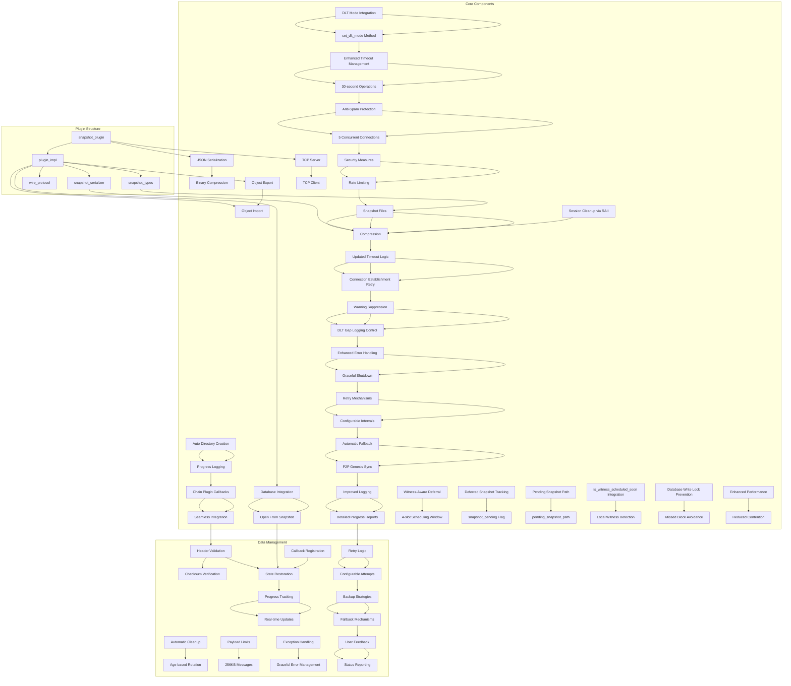

**Diagram sources**
- [plugin.cpp:40-745](file://plugins/snapshot/plugin.cpp#L40-L745)
- [plugin.hpp:42-76](file://plugins/snapshot/include/graphene/plugins/snapshot/plugin.hpp#L42-L76)
- [database.cpp:281-324](file://libraries/chain/database.cpp#L281-L324)

**Section sources**
- [plugin.cpp:1-800](file://plugins/snapshot/plugin.cpp#L1-L800)
- [CMakeLists.txt:1-51](file://plugins/snapshot/CMakeLists.txt#L1-L51)

## Core Components

### Snapshot Types and Constants

The plugin defines a comprehensive set of types and constants for snapshot management:

**Snapshot Format Specifications:**
- **Magic Bytes**: `0x015A4956` (VIZ signature)
- **Format Version**: 1.0
- **Compression**: Zlib-compressed JSON format
- **File Extensions**: `.vizjson` or `.json`

**Section Types:**
- `section_header`: Contains snapshot metadata
- `section_objects`: Serialized blockchain objects
- `section_fork_db_block`: Fork database initialization
- `section_checksum`: Integrity verification data
- `section_end`: File termination marker

**Section sources**
- [snapshot_types.hpp:16-43](file://plugins/snapshot/include/graphene/plugins/snapshot/snapshot_types.hpp#L16-L43)

### Wire Protocol Messages

The snapshot synchronization protocol uses a binary message format:

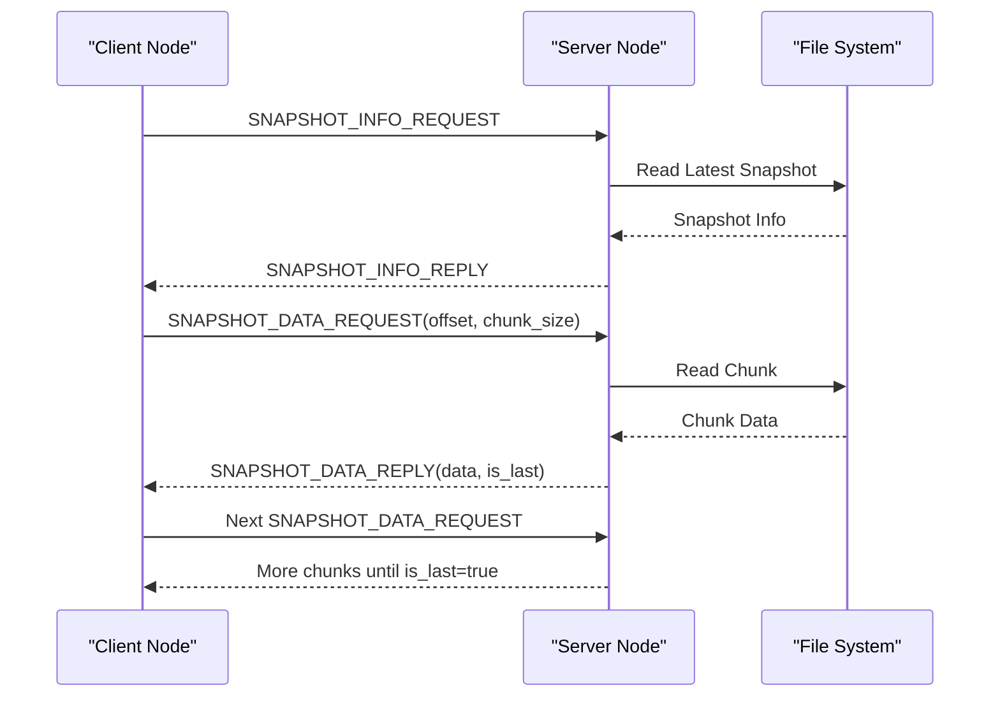

**Diagram sources**
- [plugin.cpp:1249-1617](file://plugins/snapshot/plugin.cpp#L1249-L1617)

**Section sources**
- [plugin.hpp:15-40](file://plugins/snapshot/include/graphene/plugins/snapshot/plugin.hpp#L15-L40)

### Plugin Implementation Classes

The plugin uses a two-tier architecture with clear separation between public interface and implementation:

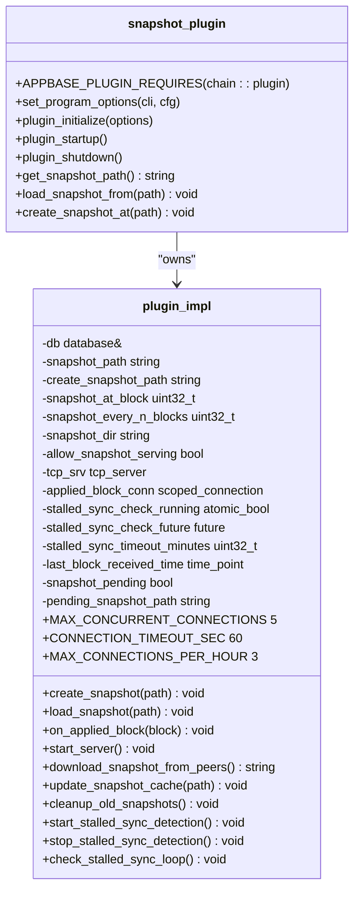

**Diagram sources**
- [plugin.hpp:42-76](file://plugins/snapshot/include/graphene/plugins/snapshot/plugin.hpp#L42-L76)
- [plugin.cpp:665-745](file://plugins/snapshot/plugin.cpp#L665-L745)

**Section sources**
- [plugin.cpp:665-745](file://plugins/snapshot/plugin.cpp#L665-L745)

## Architecture Overview

The snapshot plugin implements a comprehensive state management system with multiple operational modes:

```mermaid
graph TB
subgraph "Operational Modes"
A[Manual Creation] --> B[CLI Command]
C[Automatic Creation] --> D[Block-based Triggers]
E[P2P Synchronization] --> F[Trusted Peer Network]
G[Direct State Loading] --> H[Programmatic API]
I[Automatic Empty Node Sync] --> J[Default Behavior]
K[DLT Mode Integration] --> L[set_dlt_mode Method]
M[Stalled Sync Detection] --> N[Automatic Recovery]
O[Configurable Timeout System] --> P[30-second Operations]
Q[Anti-Spam Protection] --> R[5 Concurrent Connections]
S[Security Measures] --> T[Rate Limiting]
U[Enhanced Payload Limits] --> V[256KB Messages]
W[Improved Client Handling] --> X[Graceful Disconnection]
Y[Enhanced Error Handling] --> Z[Graceful Shutdown]
AA[Intelligent Retry Loops] --> BB[Configurable Intervals]
CC[Automatic Fallback] --> DD[P2P Genesis Sync]
EE[Improved User Feedback] --> FF[Detailed Progress Logs]
GG[Witness-Aware Deferral] --> HH[4-slot Scheduling Window]
II[Deferred Snapshot Tracking] --> JJ[snapshot_pending Flag]
KK[Pending Snapshot Path] --> LL[pending_snapshot_path]
MM[is_witness_scheduled_soon Integration] --> NN[Local Witness Detection]
OO[Database Write Lock Prevention] --> PP[Missed Block Avoidance]
QQ[Enhanced Performance] --> RR[Reduced Contention]
SS[Session Cleanup via RAII] --> TT[Prevent Race Conditions]
UU[Updated Timeout Logic] --> VV[Connection Establishment Retry]
WW[Warning Suppression] --> XX[DLT Gap Logging Control]
YY[Enhanced Thread Safety] --> ZZ[Mutex Protection]
end
subgraph "Data Flow"
M --> Y
Y --> G
G --> H
H --> I
I --> J
J --> K
K --> L
L --> N
N --> O
O --> P
P --> Q
Q --> R
R --> S
S --> T
T --> U
U --> V
V --> W
W --> X
X --> Y
Y --> Z
Z --> AA
AA --> BB
BB --> CC
CC --> DD
DD --> EE
EE --> FF
FF --> GG
GG --> HH
HH --> II
II --> JJ
JJ --> KK
KK --> LL
LL --> MM
MM --> NN
NN --> OO
OO --> PP
PP --> QQ
QQ --> RR
RR --> SS
SS --> TT
TT --> UU
UU --> VV
VV --> WW
WW --> XX
XX --> YY
YY --> ZZ[Background Thread Monitoring]
ZZ --> AA[Check Last Block Time]
AA --> BB[Timeout Detection]
BB --> CC[Query Trusted Peers]
CC --> DD[Download Newer Snapshot]
DD --> EE[Reload State]
EE --> FF[Restart Monitoring]
FF --> GG[is_witness_scheduled_soon Check]
GG --> HH[Check Witness Scheduling]
HH --> II[Defer if Scheduled Soon]
II --> JJ[Create Snapshot When Safe]
JJ --> KK[Update Cache]
KK --> LL[Cleanup Old Snapshots]
```

**Diagram sources**
- [plugin.cpp:843-1203](file://plugins/snapshot/plugin.cpp#L843-L1203)
- [plugin.cpp:1409-1617](file://plugins/snapshot/plugin.cpp#L1409-L1617)
- [database.cpp:281-324](file://libraries/chain/database.cpp#L281-L324)

The architecture supports seven primary use cases:
1. **Manual Snapshot Creation**: Generate snapshots on demand for backup or distribution
2. **Automatic Snapshot Generation**: Create snapshots at specific block heights or intervals
3. **P2P Snapshot Synchronization**: Enable nodes to bootstrap from trusted peers
4. **Direct State Loading**: Programmatic loading of snapshots through the `open_from_snapshot` method
5. **Automatic Empty Node Synchronization**: Seamless snapshot synchronization for nodes with empty state
6. **Stalled Sync Detection**: Automatic detection and recovery from stalled synchronization
7. **DLT Mode Operations**: Seamless DLT mode activation and management during snapshot operations
8. **Enhanced Error Handling**: Comprehensive exception handling with graceful shutdown mechanisms
9. **Intelligent Retry Loops**: Configurable retry intervals for P2P snapshot synchronization
10. **Automatic Fallback**: Fallback to P2P genesis sync when trusted peers are unavailable
11. **Improved User Feedback**: Detailed progress logging and status reporting for all operations
12. **Witness-Aware Deferral**: Intelligent deferral of snapshot creation to avoid conflicts with witness block production
13. **Enhanced Session Management**: RAII-based session cleanup preventing race conditions
14. **Updated Timeout Management**: Comprehensive timeout enforcement across all network operations
15. **Improved Anti-Spam Protection**: Enhanced session control and connection handling

**Section sources**
- [plugin.cpp:1767-1976](file://plugins/snapshot/plugin.cpp#L1767-L1976)
- [snapshot-plugin.md:1-164](file://documentation/snapshot-plugin.md#L1-L164)

## Detailed Component Analysis

### State Export and Serialization

The snapshot system employs a sophisticated export mechanism that converts database state into a portable format:


**Diagram sources**
- [plugin.cpp:747-841](file://plugins/snapshot/plugin.cpp#L747-L841)
- [plugin.cpp:843-935](file://plugins/snapshot/plugin.cpp#L843-L935)

The export process handles different object categories with varying complexity:

**Critical Objects**: Singleton objects that require modification rather than creation
- Dynamic Global Property
- Witness Schedule  
- Hardfork Property

**Multi-instance Objects**: Objects that require ID management and creation
- Accounts and Authorities
- Witnesses and Votes
- Content and Content Types
- Transactions and Block Summaries

**Section sources**
- [plugin.cpp:1036-1186](file://plugins/snapshot/plugin.cpp#L1036-L1186)

### Object Import and Validation

The import process reverses the export operation with comprehensive validation:

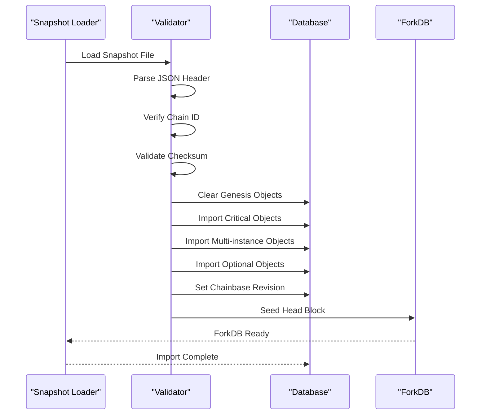

**Diagram sources**
- [plugin.cpp:980-1203](file://plugins/snapshot/plugin.cpp#L980-L1203)

The import process includes several validation steps:
1. **File Format Validation**: Ensures proper JSON structure and magic bytes
2. **Chain ID Verification**: Confirms compatibility with local chain configuration
3. **Checksum Validation**: Verifies data integrity using SHA256
4. **Object Validation**: Validates each imported object against protocol requirements

**Section sources**
- [plugin.cpp:1010-1032](file://plugins/snapshot/plugin.cpp#L1010-L1032)

### TCP Server Implementation

The snapshot server provides secure, rate-limited access to snapshot files with comprehensive anti-spam protection and enhanced session management:

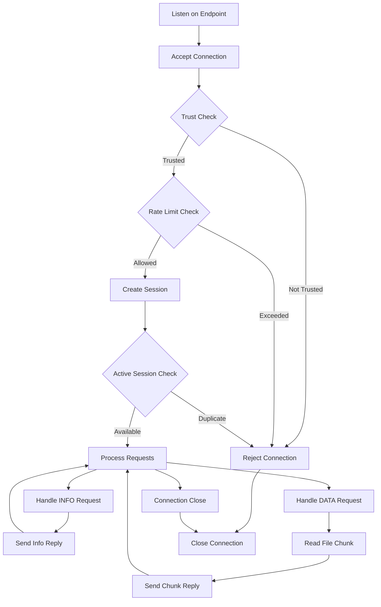

**Diagram sources**
- [plugin.cpp:1409-1544](file://plugins/snapshot/plugin.cpp#L1409-L1544)

The server implements multiple anti-abuse mechanisms:
- **Session Limiting**: Prevents multiple concurrent downloads per IP
- **Rate Limiting**: Limits connections to 3 per hour per IP
- **Trust Enforcement**: Optional restriction to trusted peer list
- **Timeout Protection**: 60-second connection timeout
- **Concurrent Connection Control**: Maximum 5 simultaneous connections
- **RAII Session Guard**: Prevents race conditions through automatic cleanup

**Section sources**
- [plugin.cpp:1449-1500](file://plugins/snapshot/plugin.cpp#L1449-L1500)

### TCP Client Implementation

The client component enables automatic snapshot synchronization from trusted peers with comprehensive timeout management and enhanced retry logic:

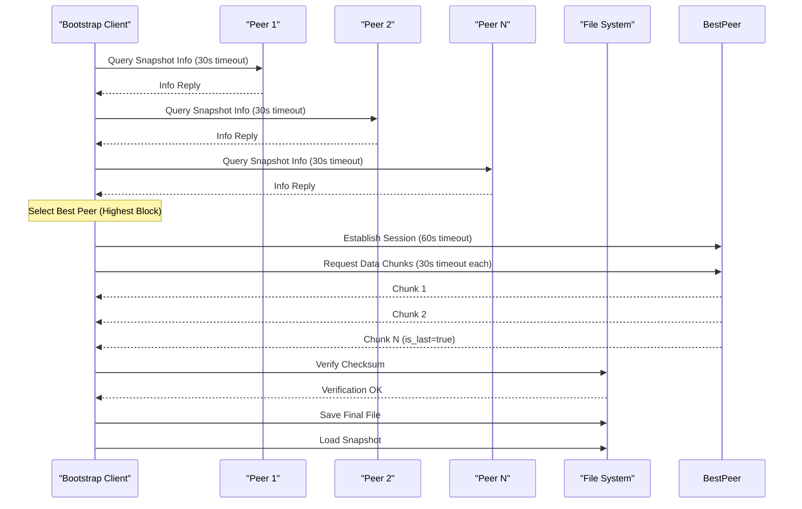

**Diagram sources**
- [plugin.cpp:1623-1758](file://plugins/snapshot/plugin.cpp#L1623-L1758)

**Section sources**
- [plugin.cpp:1623-1758](file://plugins/snapshot/plugin.cpp#L1623-L1758)

### Snapshot Serializer Utilities

The serializer provides specialized handling for complex object types:

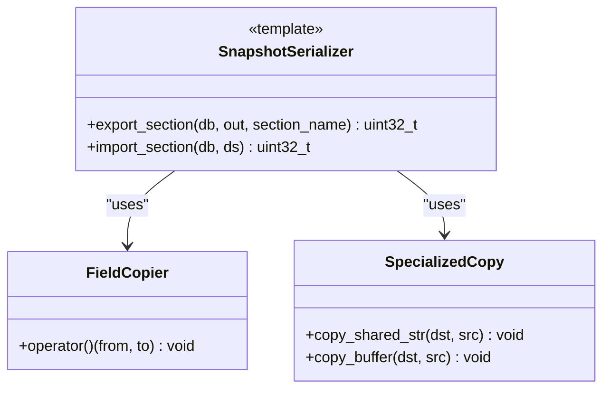

**Diagram sources**
- [snapshot_serializer.hpp:37-157](file://plugins/snapshot/include/graphene/plugins/snapshot/snapshot_serializer.hpp#L37-L157)

The serializer handles two distinct object categories:
- **Simple Objects**: Standard types with straightforward field copying
- **Complex Objects**: Types with shared_string and buffer_type members requiring specialized handling

**Section sources**
- [snapshot_serializer.hpp:125-157](file://plugins/snapshot/include/graphene/plugins/snapshot/snapshot_serializer.hpp#L125-L157)

## Enhanced State Restoration Process

**Updated**: The state restoration process has been significantly enhanced with improved error handling, validation, integration with the database layer, and comprehensive timeout management.

### Database Integration and Callback Registration

The snapshot plugin now integrates deeply with the chain plugin through a callback-based architecture:

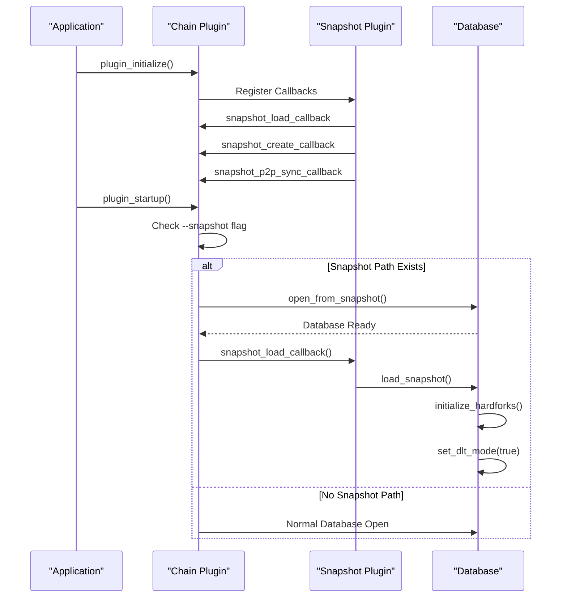

**Diagram sources**
- [plugin.cpp:1872-1918](file://plugins/snapshot/plugin.cpp#L1872-L1918)
- [database.cpp:281-324](file://libraries/chain/database.cpp#L281-L324)

### Enhanced Error Handling and Validation

The state restoration process now includes comprehensive error handling and validation:


**Diagram sources**
- [plugin.cpp:980-1203](file://plugins/snapshot/plugin.cpp#L980-L1203)

### Direct State Loading via Programmatic API

**New**: The snapshot plugin now provides programmatic access to state loading through the `load_snapshot_from` method:

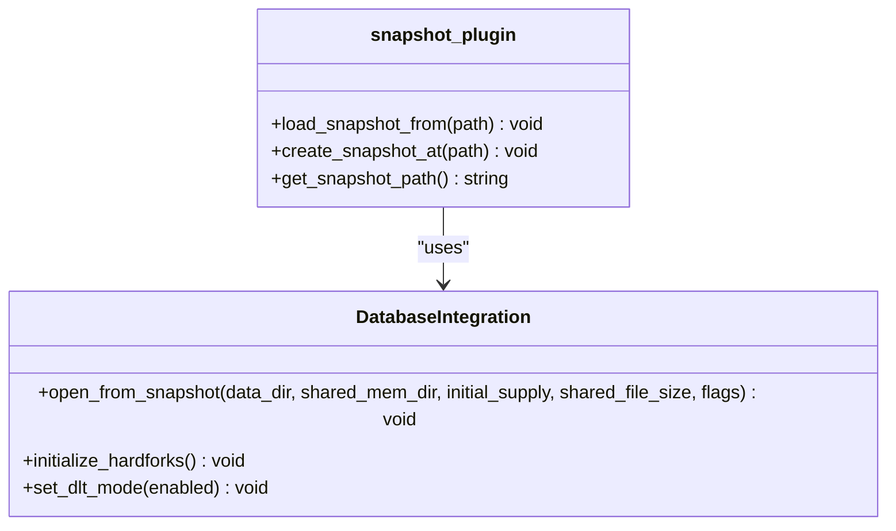

**Diagram sources**
- [plugin.hpp:67-71](file://plugins/snapshot/include/graphene/plugins/snapshot/plugin.hpp#L67-L71)
- [database.hpp:102-107](file://libraries/chain/include/graphene/chain/database.hpp#L102-L107)

**Section sources**
- [plugin.cpp:1872-1918](file://plugins/snapshot/plugin.cpp#L1872-L1918)
- [database.cpp:281-324](file://libraries/chain/database.cpp#L281-L324)

## Enhanced P2P Snapshot Synchronization

**Updated**: The P2P snapshot synchronization has been enhanced with automatic default behavior for empty nodes, providing seamless bootstrap capabilities with comprehensive timeout management, intelligent retry mechanisms, and improved session cleanup.

### Automatic Empty Node Detection and Synchronization

The system now automatically detects empty nodes (where head_block_num == 0) and initiates snapshot synchronization:

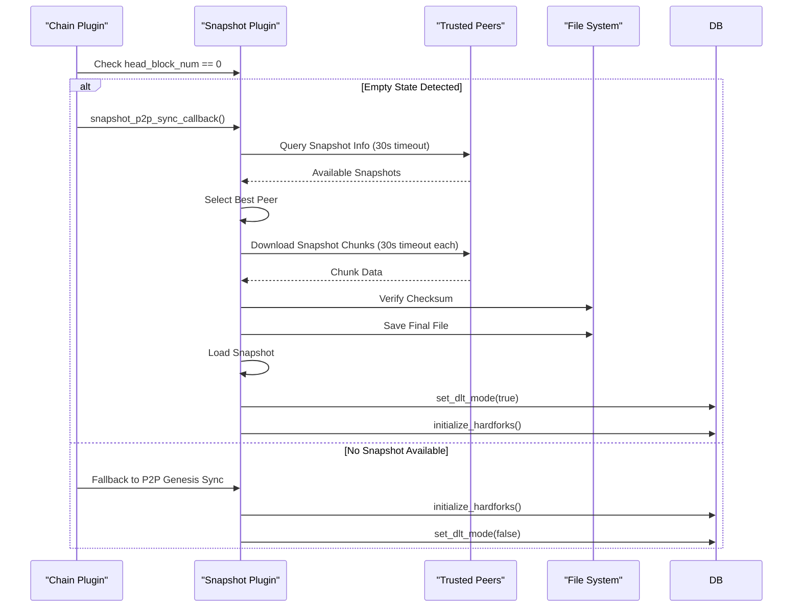

**Diagram sources**
- [plugin.cpp:1956-1981](file://plugins/snapshot/plugin.cpp#L1956-L1981)

### Enhanced Peer Selection Algorithm

The peer selection process now includes intelligent ranking based on snapshot quality and network proximity:

```mermaid
flowchart TD
Start([Peer Discovery]) --> Query[Query All Peers (30s timeout)]
Query --> Collect[Collect Snapshot Info]
Collect --> Rank[Rank by Quality Metrics]
Rank --> |Multiple Peers| Compare[Compare Block Numbers]
Rank --> |Single Peer| Select[Select Best Peer]
Compare --> |Equal Blocks| CompareSize[Compare File Sizes]
Compare --> |Different Blocks| Select
CompareSize --> |Equal Sizes| CompareLatency[Compare Latency]
CompareSize --> |Different Sizes| Select
CompareLatency --> Select
Select --> Download[Download Snapshot Chunks (30s timeout each)]
Download --> Verify[Verify Checksum]
Verify --> Load[Load Snapshot]
```

**Diagram sources**
- [plugin.cpp:1651-1710](file://plugins/snapshot/plugin.cpp#L1651-L1710)

### Intelligent Retry Loops with Configurable Intervals

**New**: The P2P synchronization now implements intelligent retry loops with configurable intervals:

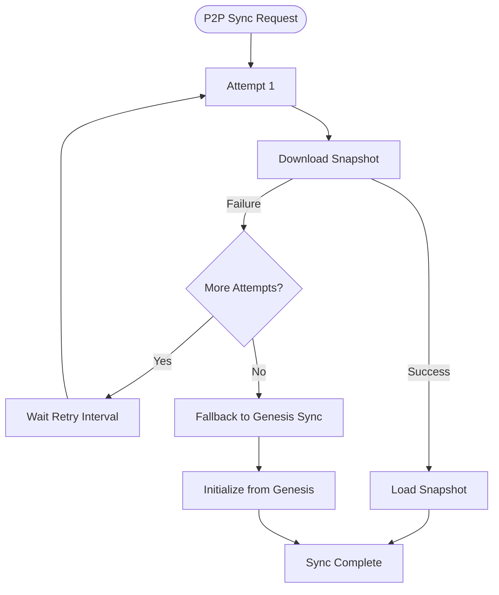

**Diagram sources**
- [plugin.cpp:2244-2284](file://plugins/snapshot/plugin.cpp#L2244-L2284)

**Section sources**
- [plugin.cpp:1956-1981](file://plugins/snapshot/plugin.cpp#L1956-L1981)
- [plugin.cpp:1651-1710](file://plugins/snapshot/plugin.cpp#L1651-L1710)
- [plugin.cpp:2244-2284](file://plugins/snapshot/plugin.cpp#L2244-L2284)

### Enhanced Timeout Management

**Updated**: All peer operations now use a comprehensive 30-second timeout system for improved reliability and security:

The snapshot system implements a robust timeout framework for all network operations:

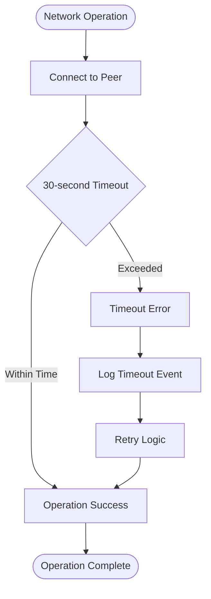

**Diagram sources**
- [plugin.cpp:1282-1400](file://plugins/snapshot/plugin.cpp#L1282-L1400)

**Section sources**
- [plugin.cpp:1282-1400](file://plugins/snapshot/plugin.cpp#L1282-L1400)

## Stalled Sync Detection and Automatic Recovery

**New**: The snapshot plugin now includes a comprehensive stalled sync detection system that automatically monitors synchronization health and recovers from stalled conditions by downloading newer snapshots from trusted peers.

### Stalled Sync Detection Architecture

The system implements a background monitoring thread that continuously tracks synchronization health:

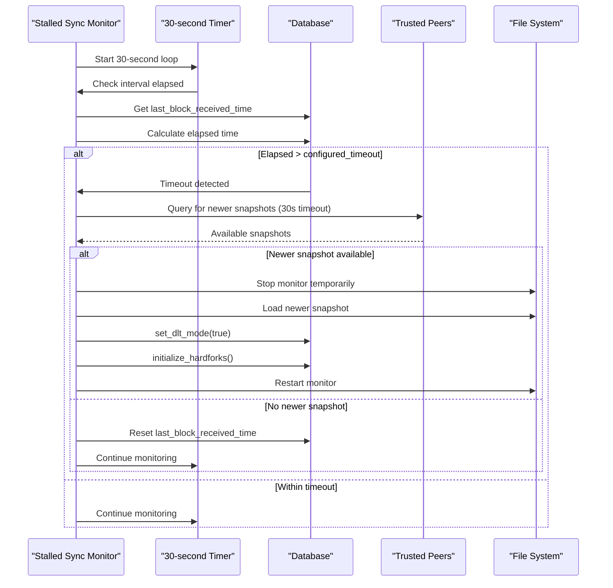

**Diagram sources**
- [plugin.cpp:1301-1387](file://plugins/snapshot/plugin.cpp#L1301-L1387)

### Enhanced Error Handling and Graceful Shutdown

**New**: The stalled sync detection system now includes comprehensive error handling and graceful shutdown mechanisms:


**Diagram sources**
- [plugin.cpp:1322-1387](file://plugins/snapshot/plugin.cpp#L1322-L1387)

### Configuration and Parameters

The stalled sync detection system is highly configurable:

**Configuration Options:**
- **enable-stalled-sync-detection**: Enable/disable the feature (default: false)
- **stalled-sync-timeout-minutes**: Timeout threshold before triggering recovery (default: 5 minutes)
- **trusted-snapshot-peer**: Required trusted peers for snapshot recovery

**Monitoring Parameters:**
- **Check Interval**: Every 30 seconds
- **Peer Query Timeout**: 30 seconds per peer operation
- **Recovery Process**: Automatic snapshot download and state reload
- **Graceful Shutdown**: Proper cleanup of background threads during shutdown

**Section sources**
- [plugin.cpp:1301-1387](file://plugins/snapshot/plugin.cpp#L1301-L1387)
- [plugin.cpp:2088-2115](file://plugins/snapshot/plugin.cpp#L2088-L2115)

### Automatic Recovery Process

When stalled sync is detected, the system automatically executes a recovery sequence:


**Diagram sources**
- [plugin.cpp:1344-1378](file://plugins/snapshot/plugin.cpp#L1344-L1378)

**Section sources**
- [plugin.cpp:1344-1378](file://plugins/snapshot/plugin.cpp#L1344-L1378)

## Improved Logging and Progress Feedback

**Updated**: The snapshot system now provides comprehensive real-time logging and progress feedback throughout all operations, with enhanced distinction between Phase 1 info-only queries and active transfers, and improved warning suppression for DLT mode operations.

### Comprehensive Progress Reporting

The system implements detailed logging for all major operations with real-time progress updates:


**Diagram sources**
- [plugin.cpp:912-944](file://plugins/snapshot/plugin.cpp#L912-L944)
- [plugin.cpp:1740-1777](file://plugins/snapshot/plugin.cpp#L1740-L1777)

### Real-time Download Progress Monitoring

The download process provides granular progress feedback with percentage completion and transfer rates:

```mermaid
sequenceDiagram
participant Client as "Client"
participant Server as "Server"
participant Logger as "Logger"
Client->>Server : Request Snapshot
Server-->>Client : Info Reply
Client->>Server : Download Chunks (30s timeout each)
loop For Each Chunk
Server-->>Client : Chunk Data
Client->>Logger : Log Progress (%)
Logger-->>Client : Progress Update
end
Client->>Logger : Log Completion
```

**Diagram sources**
- [plugin.cpp:1740-1777](file://plugins/snapshot/plugin.cpp#L1740-L1777)

### Enhanced Client Disconnection Handling

**New**: Improved client disconnection handling with try-catch mechanisms and better logging for graceful error management:

```mermaid
flowchart TD
Start([Handle Connection]) --> ReadRequest[Read Initial Request]
ReadRequest --> CheckType{Request Type?}
CheckType --> |INFO_REQUEST| HandleInfo[Handle Info Query]
CheckType --> |DATA_REQUEST| HandleData[Handle Data Transfer]
HandleInfo --> CheckDisconnect{Client Disconnected?}
CheckDisconnect --> |Yes| LogInfoOnly[Log Info-only Query]
CheckDisconnect --> |No| WaitRequests[Wait for Data Requests]
WaitRequests --> CheckDataDisconnect{Client Disconnected During Transfer?}
CheckDataDisconnect --> |Yes| LogGracefulDisconnect[Log Graceful Disconnect]
CheckDataDisconnect --> |No| ContinueTransfer[Continue Transfer]
HandleData --> CheckTransferComplete{Transfer Complete?}
CheckTransferComplete --> |Yes| LogComplete[Log Transfer Complete]
CheckTransferComplete --> |No| HandleData
LogInfoOnly --> End([Connection Closed])
LogGracefulDisconnect --> End
LogComplete --> End
```

**Diagram sources**
- [plugin.cpp:1574-1660](file://plugins/snapshot/plugin.cpp#L1574-L1660)

### Enhanced Error Handling and Exception Management

**New**: The system now includes comprehensive error handling with detailed exception management:

```mermaid
flowchart TD
Start([Operation]) --> TryOp[Try Operation]
TryOp --> |Success| Success[Operation Success]
TryOp --> |Exception| CatchErr[Catch Exception]
CatchErr --> LogErr[Log Error Details]
LogErr --> CheckSeverity{Check Severity}
CheckSeverity --> |Critical| GracefulShutdown[Graceful Shutdown]
CheckSeverity --> |Non-critical| Continue[Continue Operation]
CheckSeverity --> |Timeout| RetryOp[Retry Operation]
GracefulShutdown --> End([Shutdown])
Continue --> End
RetryOp --> TryOp
```

**Diagram sources**
- [plugin.cpp:1373-1387](file://plugins/snapshot/plugin.cpp#L1373-L1387)

### Warning Suppression for DLT Mode

**New**: Enhanced warning suppression mechanism prevents excessive logging when blocks are not available in fork database:

```mermaid
flowchart TD
Start([DLT Gap Detection]) --> CheckLogged{_dlt_gap_logged Flag?}
CheckLogged --> |True| Suppress[Suppress Warning Log]
CheckLogged --> |False| SetFlag[Set _dlt_gap_logged = true]
SetFlag --> LogWarning[Log Gap Warning Once]
LogWarning --> Continue[Continue Processing]
Suppress --> Continue
```

**Diagram sources**
- [database.cpp:4425-4433](file://libraries/chain/database.cpp#L4425-L4433)

**Section sources**
- [plugin.cpp:912-944](file://plugins/snapshot/plugin.cpp#L912-L944)
- [plugin.cpp:1740-1777](file://plugins/snapshot/plugin.cpp#L1740-L1777)
- [plugin.cpp:1574-1660](file://plugins/snapshot/plugin.cpp#L1574-L1660)

## Automatic Directory Management

**Updated**: The snapshot system now includes intelligent automatic directory creation capabilities to streamline file management.

### Intelligent Directory Creation

The system automatically creates directories when needed, ensuring seamless operation without manual intervention:

```mermaid
flowchart TD
Start([File Operation]) --> CheckPath[Check File Path]
CheckPath --> Exists{Path Exists?}
Exists --> |Yes| UsePath[Use Existing Path]
Exists --> |No| CheckParent[Check Parent Directory]
CheckParent --> ParentExists{Parent Exists?}
ParentExists --> |Yes| UsePath
ParentExists --> |No| CreateDir[Create Parent Directory]
CreateDir --> LogCreation[Log Directory Creation]
LogCreation --> UsePath
UsePath --> Proceed[Proceed with Operation]
```

**Diagram sources**
- [plugin.cpp:914-925](file://plugins/snapshot/plugin.cpp#L914-L925)
- [plugin.cpp:1728-1734](file://plugins/snapshot/plugin.cpp#L1728-L1734)

### Automatic Cleanup and Rotation

The system includes intelligent cleanup mechanisms to manage disk space efficiently:

```mermaid
flowchart TD
Start([Cleanup Trigger]) --> CheckAge[Check Snapshot Age]
CheckAge --> OldEnough{Older than Threshold?}
OldEnough --> |Yes| Remove[Remove Old Snapshot]
OldEnough --> |No| Skip[Skip Snapshot]
Remove --> LogRemoval[Log Removal]
LogRemoval --> Continue[Continue Scan]
Skip --> Continue
Continue --> End([Cleanup Complete])
```

**Diagram sources**
- [plugin.cpp:1395-1432](file://plugins/snapshot/plugin.cpp#L1395-L1432)

**Section sources**
- [plugin.cpp:914-925](file://plugins/snapshot/plugin.cpp#L914-L925)
- [plugin.cpp:1395-1432](file://plugins/snapshot/plugin.cpp#L1395-L1432)

## Enhanced Chain Plugin Integration

**Updated**: The snapshot plugin now provides seamless integration with the chain plugin through sophisticated callback mechanisms and automatic synchronization.

### Sophisticated Callback Architecture

The chain plugin exposes three specialized callbacks that enable seamless snapshot integration:

```mermaid
sequenceDiagram
participant App as "Application"
participant Chain as "Chain Plugin"
participant Snap as "Snapshot Plugin"
App->>Chain : plugin_initialize()
Chain->>Snap : Register snapshot_callbacks
Snap->>Chain : snapshot_load_callback
Snap->>Chain : snapshot_create_callback
Snap->>Chain : snapshot_p2p_sync_callback
App->>Chain : plugin_startup()
Chain->>Chain : Check State (head_block_num)
alt --snapshot Flag Present
Chain->>Snap : snapshot_load_callback()
Snap->>Chain : Load Snapshot & Initialize
else --create-snapshot Flag Present
Chain->>Snap : snapshot_create_callback()
Snap->>Chain : Create Snapshot & Quit
else Empty State (head_block_num == 0)
Chain->>Snap : snapshot_p2p_sync_callback()
Snap->>Chain : Download & Load Snapshot
end
```

**Diagram sources**
- [plugin.cpp:1925-1981](file://plugins/snapshot/plugin.cpp#L1925-L1981)
- [plugin.hpp:92-105](file://plugins/chain/include/graphene/plugins/chain/plugin.hpp#L92-L105)

### Automatic State Detection and Response

The chain plugin automatically detects different states and responds appropriately:

```mermaid
flowchart TD
Start([Chain Startup]) --> DetectState[Detect Current State]
DetectState --> CheckSnapshot{--snapshot Flag?}
CheckSnapshot --> |Yes| LoadSnapshot[Execute snapshot_load_callback]
CheckSnapshot --> |No| CheckCreate{--create-snapshot Flag?}
CheckCreate --> |Yes| CreateSnapshot[Execute snapshot_create_callback]
CheckCreate --> |No| CheckEmpty{head_block_num == 0?}
CheckEmpty --> |Yes| P2PSync[Execute snapshot_p2p_sync_callback]
CheckEmpty --> |No| NormalStartup[Normal Chain Startup]
LoadSnapshot --> Complete[Startup Complete]
CreateSnapshot --> Complete
P2PSync --> Complete
NormalStartup --> Complete
```

**Diagram sources**
- [plugin.cpp:1984-2017](file://plugins/snapshot/plugin.cpp#L1984-L2017)

### DLT Mode Integration

**New**: The snapshot plugin now properly sets the `_dlt_mode` flag during snapshot loading, enabling seamless DLT mode operation:

```mermaid
sequenceDiagram
participant Snap as "Snapshot Plugin"
participant DB as "Database"
participant Chain as "Chain Plugin"
Snap->>DB : load_snapshot()
DB->>DB : Import Snapshot State
DB->>DB : Set Revision
DB->>DB : Seed ForkDB
DB->>DB : set_dlt_mode(true)
DB->>DB : initialize_hardforks()
DB-->>Chain : Database Ready
Chain-->>Chain : DLT Mode Operational
```

**Diagram sources**
- [plugin.cpp:1968-1970](file://plugins/snapshot/plugin.cpp#L1968-L1970)

**Section sources**
- [plugin.cpp:1925-1981](file://plugins/snapshot/plugin.cpp#L1925-L1981)
- [plugin.cpp:1984-2017](file://plugins/snapshot/plugin.cpp#L1984-L2017)

## Enhanced Security and Anti-Spam Measures

**Updated**: The snapshot plugin now implements comprehensive security measures including enhanced timeout management, anti-spam protection, session cleanup, and robust connection handling.

### Comprehensive Anti-Spam Protection

The snapshot server implements multiple layers of anti-abuse protection with enhanced session management:

```mermaid
flowchart TD
Start([Incoming Connection]) --> TrustCheck{Trusted Peer?}
TrustCheck --> |No Trusted| Reject[Reject Connection]
TrustCheck --> |Trusted| ConcurrencyCheck{Max 5 Concurrency?}
ConcurrencyCheck --> |Exceeded| Reject[Reject Due to Max Concurrency]
ConcurrencyCheck --> |Available| SessionCheck{Active Session Per IP?}
SessionCheck --> |Duplicate| Reject[Reject Duplicate Session]
SessionCheck --> |Available| RateLimit{Rate Limit Check}
RateLimit --> |Exceeded| Reject[Reject Due to Rate Limit]
RateLimit --> |Allowed| Accept[Accept Connection]
Accept --> TimeoutCheck{60-second Timeout}
TimeoutCheck --> |Expired| Close[Close Connection]
TimeoutCheck --> |Active| Process[Process Requests]
Process --> Complete[Connection Complete]
Complete --> Cleanup[RAII Session Cleanup]
Cleanup --> Close[Close Connection]
```

**Diagram sources**
- [plugin.cpp:1555-1613](file://plugins/snapshot/plugin.cpp#L1555-L1613)

### Enhanced Timeout Management

The system implements comprehensive timeout protection across all operations:

**Connection-Level Timeouts**:
- **Accept Loop**: 60-second connection timeout enforced before processing
- **Initial Request**: 10-second timeout for info requests
- **Data Requests**: 5-minute timeout for chunk transfers
- **Overall Connection**: Hard deadline prevents resource exhaustion

**Peer Operation Timeouts**:
- **Peer Queries**: 30-second timeout per peer operation
- **Chunk Downloads**: 30-second timeout per chunk request
- **Response Handling**: 30-second timeout for all peer responses

**Section sources**
- [plugin.cpp:1555-1613](file://plugins/snapshot/plugin.cpp#L1555-L1613)
- [plugin.cpp:1294-1412](file://plugins/snapshot/plugin.cpp#L1294-L1412)

### Enhanced Payload Size Limits

The system implements strict payload size limits to prevent memory abuse:

```mermaid
flowchart TD
Start([Receive Message]) --> CheckSize{Check Payload Size}
CheckSize --> |Control Message| ControlLimit[256KB Limit]
CheckSize --> |Data Reply| DataLimit[64MB Limit]
CheckSize --> |Request Message| RequestLimit[64KB Limit]
ControlLimit --> |Exceeded| Reject[Reject Message]
DataLimit --> |Exceeded| Reject
RequestLimit --> |Exceeded| Reject
ControlLimit --> |OK| Process[Process Message]
DataLimit --> |OK| Process
RequestLimit --> |OK| Process
Reject --> Log[Log Violation]
Process --> End([Message Processed])
Log --> End
```

**Diagram sources**
- [plugin.cpp:1368-1412](file://plugins/snapshot/plugin.cpp#L1368-L1412)

**Section sources**
- [plugin.cpp:1368-1412](file://plugins/snapshot/plugin.cpp#L1368-L1412)

## DLT Mode Capabilities

**New**: The snapshot plugin now provides comprehensive DLT (Distributed Ledger Technology) mode support with automatic DLT mode activation, warning suppression, and enhanced block log management.

### DLT Mode Integration

The system seamlessly integrates with DLT mode operations through automatic DLT mode activation:

```mermaid
sequenceDiagram
participant Snap as "Snapshot Plugin"
participant DB as "Database"
participant DLT as "DLT Block Log"
participant Chain as "Chain Plugin"
Snap->>DB : load_snapshot()
DB->>DB : Import Snapshot State
DB->>DB : Set Revision
DB->>DB : Seed ForkDB
DB->>DB : set_dlt_mode(true)
DB->>DLT : Initialize DLT Block Log
DB->>DB : initialize_hardforks()
DB-->>Chain : Database Ready
Chain-->>Chain : DLT Mode Operational
```

**Diagram sources**
- [plugin.cpp:1968-1970](file://plugins/snapshot/plugin.cpp#L1968-L1970)

### DLT Block Log Management

The system manages DLT block logs separately from regular block logs with enhanced warning suppression:

```mermaid
flowchart TD
Start([DLT Mode Enabled]) --> CheckWindow{dlt-block-log-max-blocks > 0?}
CheckWindow --> |Yes| WriteDLT[Write to DLT Block Log]
CheckWindow --> |No| WriteRegular[Write to Regular Block Log]
WriteDLT --> ManageWindow[Manage Window Size]
ManageWindow --> Truncate[Truncate Old Blocks]
Truncate --> Suppress[Suppress Gap Warnings]
Suppress --> Maintain[Amortized Cost]
WriteRegular --> Maintain
Maintain --> Serve[Serve Blocks to Peers]
```

**Diagram sources**
- [dlt_block_log.cpp:336-402](file://libraries/chain/dlt_block_log.cpp#L336-L402)

### Enhanced DLT Block Log Features

**Window Management**: Maintains rolling window of recent blocks with configurable size
**Offset-aware Indexing**: Stores first block number in index header for efficient random access
**Automatic Truncation**: Removes old blocks when window exceeds 2x the configured limit
**Amortized Cost**: Distributes truncation cost across multiple operations
**Warning Suppression**: Prevents excessive logging when blocks are not in fork database

**Section sources**
- [dlt_block_log.cpp:336-402](file://libraries/chain/dlt_block_log.cpp#L336-L402)
- [dlt_block_log.hpp:35-75](file://libraries/chain/include/graphene/chain/dlt_block_log.hpp#L35-L75)

## Witness-Aware Deferral Mechanism

**New**: The most significant enhancement to the Snapshot Plugin System is the implementation of a comprehensive witness-aware deferral mechanism that automatically prevents snapshot creation during witness block production windows.

### Deferral Architecture

The system implements intelligent deferral logic that monitors witness scheduling and delays snapshot creation when local witnesses are scheduled to produce blocks:

```mermaid
flowchart TD
Start([on_applied_block Called]) --> UpdateTime[Update last_block_received_time]
UpdateTime --> CheckSyncing{Is Node Syncing?}
CheckSyncing --> |Yes| SkipDeferral[Skip All Deferrals]
CheckSyncing --> |No| CheckPending{snapshot_pending Flag Set?}
CheckPending --> |Yes| CheckWitnessSoon{is_witness_scheduled_soon()?}
CheckWitnessSoon --> |Yes| KeepPending[Keep snapshot_pending=True]
CheckWitnessSoon --> |No| CreateDeferred[Create Deferred Snapshot Now]
CheckPending --> |No| CheckAtBlock{Check --snapshot-at-block?}
CheckAtBlock --> |Match| CheckWitnessSoon2{is_witness_scheduled_soon()?}
CheckWitnessSoon2 --> |Yes| DeferAtBlock[Defer to Next Block]
CheckWitnessSoon2 --> |No| CreateAtBlock[Create Snapshot Immediately]
CheckAtBlock --> |No| CheckEveryN{Check --snapshot-every-n-blocks?}
CheckEveryN --> |Match| CheckWitnessSoon3{is_witness_scheduled_soon()?}
CheckWitnessSoon3 --> |Yes| DeferEveryN[Defer to Next Block]
CheckWitnessSoon3 --> |No| CreateEveryN[Create Snapshot Immediately]
CheckEveryN --> |No| End([End])
CreateDeferred --> ClearFlag[Clear snapshot_pending Flag]
CreateDeferred --> UpdateCache[Update Snapshot Cache]
CreateDeferred --> Cleanup[Cleanup Old Snapshots]
DeferAtBlock --> SetPending[Set snapshot_pending=True]
DeferAtBlock --> SavePath[Save pending_snapshot_path]
DeferEveryN --> SetPending2[Set snapshot_pending=True]
DeferEveryN --> SavePath2[Save pending_snapshot_path]
KeepPending --> LogPending[Log Pending Status]
SkipDeferral --> End
ClearFlag --> End
SetPending --> End
SetPending2 --> End
LogPending --> End
```

**Diagram sources**
- [plugin.cpp:1256-1342](file://plugins/snapshot/plugin.cpp#L1256-L1342)

### Witness Scheduling Detection

The system uses the `is_witness_scheduled_soon()` method from the witness plugin to detect when local witnesses are scheduled to produce blocks:

```mermaid
sequenceDiagram
participant Snap as "Snapshot Plugin"
participant Witness as "Witness Plugin"
participant DB as "Database"
Snap->>Witness : is_witness_scheduled_soon()
Witness->>DB : Get Current Time
DB-->>Witness : Current Time
Witness->>DB : Calculate Slot Number
DB-->>Witness : Slot Number
Witness->>DB : Check 4 Upcoming Slots
DB-->>Witness : Scheduled Witnesses
Witness->>Witness : Verify Local Private Keys
Witness-->>Snap : True/False Result
```

**Diagram sources**
- [witness.cpp:206-249](file://plugins/witness/witness.cpp#L206-L249)

### Deferral Logic Implementation

The deferral mechanism operates on a 4-slot window (~12 seconds) to ensure snapshot creation occurs outside witness production periods:

```mermaid
flowchart TD
CheckSlots[Check 4 Upcoming Slots] --> Slot1[Slot 1]
Slot1 --> CheckWitness1{Local Witness Scheduled?}
CheckWitness1 --> |Yes| Defer[Defer Snapshot Creation]
CheckWitness1 --> |No| CheckSlot2[Check Slot 2]
CheckSlots --> Slot2[Slot 2]
CheckSlot2 --> CheckWitness2{Local Witness Scheduled?}
CheckWitness2 --> |Yes| Defer
CheckWitness2 --> |No| CheckSlot3[Check Slot 3]
CheckSlots --> Slot3[Slot 3]
CheckSlot3 --> CheckWitness3{Local Witness Scheduled?}
CheckWitness3 --> |Yes| Defer
CheckWitness3 --> |No| CheckSlot4[Check Slot 4]
CheckSlots --> Slot4[Slot 4]
CheckSlot4 --> CheckWitness4{Local Witness Scheduled?}
CheckWitness4 --> |Yes| Defer
CheckWitness4 --> |No| CreateNow[Create Snapshot Now]
```

**Diagram sources**
- [witness.cpp:221-242](file://plugins/witness/witness.cpp#L221-L242)

### Deferred Snapshot Tracking

The system maintains persistent tracking of deferred snapshots using two key variables:

**snapshot_pending**: Boolean flag indicating whether a snapshot creation is currently deferred
**pending_snapshot_path**: String containing the file path for the deferred snapshot

When a snapshot is deferred, the system stores both the flag and path, then checks again on the next block application. If the witness is no longer scheduled to produce during the next block, the deferred snapshot is created immediately.

**Section sources**
- [plugin.cpp:685-688](file://plugins/snapshot/plugin.cpp#L685-L688)
- [plugin.cpp:1256-1342](file://plugins/snapshot/plugin.cpp#L1256-L1342)
- [witness.cpp:206-249](file://plugins/witness/witness.cpp#L206-L249)

## Enhanced Session Management and Race Condition Fixes

**New**: The snapshot plugin now implements comprehensive session management with RAII-based cleanup to prevent race conditions during connection handling.

### RAII Session Guard Implementation

The system uses a RAII-based session guard to ensure proper cleanup of active sessions:

```mermaid
flowchart TD
Start([handle_connection Called]) --> CreateGuard[Create session_guard]
CreateGuard --> RegisterCleanup[Register Guard Destructor]
RegisterCleanup --> ProcessRequest[Process Client Request]
ProcessRequest --> CheckTimeout{Deadline Exceeded?}
CheckTimeout --> |Yes| CleanupGuard[Guard Destructor Called]
CheckTimeout --> |No| CheckClient{Client Connected?}
CheckClient --> |No| CleanupGuard
CheckClient --> |Yes| ContinueProcessing[Continue Processing]
ContinueProcessing --> Complete[Operation Complete]
Complete --> CleanupGuard
CleanupGuard --> RemoveFromSessions[Remove from active_sessions]
RemoveFromSessions --> ReleaseMutex[Release Mutex]
ReleaseMutex --> End([Connection Closed])
```

**Diagram sources**
- [plugin.cpp:1800-1820](file://plugins/snapshot/plugin.cpp#L1800-L1820)

### Race Condition Prevention

The RAII guard prevents race conditions where clients reconnect before the async fiber wrapper can clean up:

```mermaid
sequenceDiagram
participant Client as "Client"
participant Server as "Server"
participant Guard as "RAII Guard"
participant Sessions as "active_sessions"
Client->>Server : Connect
Server->>Guard : Create session_guard
Guard->>Sessions : Insert session
Client->>Server : Reconnect
Server->>Guard : Create session_guard (duplicate)
Guard->>Sessions : Check for duplicate
Sessions-->>Guard : Duplicate found
Guard->>Sessions : Erase duplicate (no-op)
Guard->>Guard : Destructor called
Guard->>Sessions : Remove session (if present)
```

**Diagram sources**
- [plugin.cpp:1779-1788](file://plugins/snapshot/plugin.cpp#L1779-L1788)

### Enhanced Connection Cleanup

The system implements comprehensive connection cleanup with proper resource management:

```mermaid
flowchart TD
Start([Connection Handler]) --> HandleConn[handle_connection]
HandleConn --> RAII[RAII Guard Created]
RAII --> ProcessMsg[Process Message]
ProcessMsg --> CheckResult{Process Result}
CheckResult --> |Success| Cleanup[Cleanup Resources]
CheckResult --> |Exception| Cleanup
CheckResult --> |Timeout| Cleanup
Cleanup --> RemoveSession[Remove from active_sessions]
RemoveSession --> DecrementCount[Decrement active_connection_count]
DecrementCount --> CloseSocket[Close Socket]
CloseSocket --> End([Connection Closed])
```

**Diagram sources**
- [plugin.cpp:1770-1798](file://plugins/snapshot/plugin.cpp#L1770-L1798)

**Section sources**
- [plugin.cpp:1770-1798](file://plugins/snapshot/plugin.cpp#L1770-L1798)
- [plugin.cpp:1800-1820](file://plugins/snapshot/plugin.cpp#L1800-L1820)

## Updated Timeout Management and Retry Logic

**New**: The snapshot plugin now implements comprehensive timeout management with updated retry logic for connection establishment and enhanced timeout enforcement across all network operations.

### Enhanced Timeout Enforcement

The system enforces comprehensive timeout protection across all network operations:

```mermaid
flowchart TD
Start([Network Operation]) --> SetDeadline[Set Connection Deadline]
SetDeadline --> CheckDeadline{Check Deadline Before Operation}
CheckDeadline --> |Expired| LogTimeout[Log Timeout Error]
CheckDeadline --> |Valid| ExecuteOp[Execute Operation]
ExecuteOp --> OperationResult{Operation Result}
OperationResult --> |Success| UpdateDeadline[Update Deadline]
OperationResult --> |Timeout| LogTimeout
OperationResult --> |Exception| LogError[Log Error]
LogTimeout --> CleanupResources[Cleanup Resources]
LogError --> CleanupResources
UpdateDeadline --> Continue[Continue Operation]
CleanupResources --> End([Operation Complete])
Continue --> End
```

**Diagram sources**
- [plugin.cpp:1824-1828](file://plugins/snapshot/plugin.cpp#L1824-L1828)

### Updated Retry Logic for Connection Establishment

The system implements improved retry logic with exponential backoff and comprehensive error handling:

```mermaid
flowchart TD
Start([Connect to Peer]) --> Attempt[Attempt Connection]
Attempt --> ConnectSuccess{Connection Success?}
ConnectSuccess --> |Yes| Process[Process Request]
ConnectSuccess --> |No| CheckAttempts{More Retry Attempts?}
CheckAttempts --> |Yes| Wait[Wait with Backoff]
Wait --> Attempt
CheckAttempts --> |No| LogFailure[Log Connection Failure]
LogFailure --> Fallback[Fallback to Alternative Peer]
Fallback --> End([Operation Failed])
Process --> End([Operation Success])
```

**Diagram sources**
- [plugin.cpp:1967-1970](file://plugins/snapshot/plugin.cpp#L1967-L1970)

### Comprehensive Timeout Configuration

The system provides comprehensive timeout configuration for different operation types:

**Connection-Level Timeouts**:
- **Accept Loop**: 60-second connection timeout enforced before processing
- **Initial Request**: 10-second timeout for info requests
- **Data Requests**: 5-minute timeout for chunk transfers
- **Peer Queries**: 30-second timeout per peer operation
- **Chunk Downloads**: 30-second timeout per chunk request

**Section sources**
- [plugin.cpp:1824-1828](file://plugins/snapshot/plugin.cpp#L1824-L1828)
- [plugin.cpp:1967-1970](file://plugins/snapshot/plugin.cpp#L1967-L1970)

## Dependency Analysis

The snapshot plugin has a well-defined dependency structure that integrates with the broader VIZ ecosystem:

```mermaid
graph TB
subgraph "External Dependencies"
A[fc Library] --> B[JSON Serialization]
A --> C[Compression]
A --> D[Networking]
E[chainbase] --> F[Database Operations]
G[appbase] --> H[Plugin Framework]
I[graphene_protocol] --> J[Blockchain Types]
K[boost::filesystem] --> L[File System Operations]
M[fc::thread] --> N[Async Operations]
O[fc::mutex] --> P[Thread Safety]
Q[fc::time_point] --> R[Timeout Management]
S[fc::async] --> T[Background Processing]
U[fc::canceled_exception] --> V[Thread Cancellation]
W[fc::microseconds] --> X[Time Units]
Y[fc::seconds] --> Z[Time Units]
end
subgraph "Internal Dependencies"
AA[graphene_chain] --> BB[Database Interface]
CC[graphene_chain_plugin] --> DD[Chain Plugin]
EE[graphene_time] --> FF[Time Management]
GG[graphene_json_rpc] --> HH[RPC Integration]
II[graphene_p2p] --> JJ[P2P Integration]
KK[graphene_dlt_block_log] --> LL[DLT Block Logging]
MM[graphene_protocol] --> NN[Blockchain Protocol]
OO[dlt_block_log] --> PP[DLT Block Log Management]
QQ[background_monitoring] --> RR[Stalled Sync Detection]
SS[enhanced_error_handling] --> TT[Graceful Shutdown]
UU[intelligent_retry_loops] --> VV[Configurable Intervals]
WW[automatic_fallback] --> XX[P2P Genesis Sync]
YY[improved_logging] --> ZZ[Detailed Progress Reports]
AAA[witness_aware_deferral] --> BBB[is_witness_scheduled_soon Integration]
CCC[deferred_snapshot_tracking] --> DDD[snapshot_pending Flag]
EEE[pending_snapshot_path_storage] --> FFF[persistent_path_tracking]
GGG[database_write_lock_prevention] --> HHH[missed_block_avoidance]
III[enhanced_performance] --> JJJ[reduced_contention]
KKK[session_cleanup_via_raii] --> LLL[prevent_race_conditions]
MMM[updated_timeout_logic] --> NNN[connection_establishment_retry]
PPP[warning_suppression] --> QQQ[DLT_gap_logging_control]
RRR[enhanced_thread_safety] --> SSS[mutex_protection]
end
subgraph "Snapshot Plugin"
AA[snapshot_plugin] --> BB[plugin_impl]
BB --> CC[Serialization Layer]
BB --> DD[Network Layer]
BB --> EE[File Management]
BB --> FF[Callback System]
BB --> GG[Progress Logging]
BB --> HH[set_dlt_mode Integration]
BB --> II[Enhanced Timeout Management]
BB --> JJ[Anti-Spam Protection]
BB --> KK[Security Measures]
BB --> LL[Stalled Sync Detection]
BB --> MM[Background Thread Management]
BB --> NN[Configurable Timeouts]
BB --> OO[Thread Safety]
BB --> PP[Enhanced Error Handling]
BB --> QQ[Retry Mechanisms]
BB --> RR[Automatic Fallback]
BB --> SS[Improved User Feedback]
BB --> AAA[Witness-Aware Deferral]
BB --> CCC[Deferred Snapshot Tracking]
BB --> EEE[Pending Snapshot Path Storage]
BB --> GGG[Database Write Lock Prevention]
BB --> III[Enhanced Performance]
BB --> KKK[Session Cleanup via RAII]
BB --> MMM[Updated Timeout Logic]
BB --> PPP[Warning Suppression]
BB --> RRR[Enhanced Thread Safety]
end
A --> AA
E --> AA
G --> AA
I --> AA
K --> AA
M --> AA
O --> AA
Q --> AA
S --> AA
U --> AA
W --> AA
Y --> AA
AA --> BB
AA --> CC
AA --> DD
AA --> EE
AA --> FF
AA --> GG
AA --> HH
AA --> II
AA --> JJ
AA --> KK
AA --> LL
AA --> MM
AA --> NN
AA --> OO
AA --> PP
AA --> QQ
AA --> RR
AA --> SS
```

**Diagram sources**
- [CMakeLists.txt:27-37](file://plugins/snapshot/CMakeLists.txt#L27-L37)

The plugin's dependencies are carefully managed to minimize coupling while maximizing functionality:

**External Dependencies**:
- **fc Library**: Provides core serialization, compression, and networking capabilities
- **chainbase**: Handles database operations and object lifecycle management
- **appbase**: Manages plugin lifecycle and application integration
- **boost::filesystem**: Enables cross-platform file system operations
- **fc::thread**: Provides asynchronous operation support
- **fc::mutex**: Ensures thread safety across concurrent operations
- **fc::time_point**: Provides precise timeout and deadline management
- **fc::async**: Enables background processing and monitoring
- **fc::canceled_exception**: Handles thread cancellation gracefully
- **fc::microseconds/seconds**: Provides precise time unit management

**Internal Dependencies**:
- **graphene_chain**: Access to blockchain state and database operations
- **graphene_protocol**: Blockchain-specific data types and structures
- **graphene_time**: Time-related operations for snapshot metadata
- **graphene_p2p**: P2P network integration for snapshot synchronization
- **graphene_dlt_block_log**: DLT mode block logging support
- **graphene_chain_plugin**: Chain plugin callback system integration
- **dlt_block_log**: DLT block log management and operations
- **background_monitoring**: Stalled sync detection and recovery system
- **enhanced_error_handling**: Comprehensive exception handling and graceful shutdown
- **intelligent_retry_loops**: Configurable retry mechanisms for P2P operations
- **automatic_fallback**: Fallback mechanisms for P2P genesis sync
- **improved_logging**: Enhanced logging and progress reporting systems
- **witness_aware_deferral**: Integration with witness plugin for scheduling detection
- **deferred_snapshot_tracking**: Persistent tracking of deferred snapshots
- **pending_snapshot_path_storage**: Storage of deferred snapshot file paths
- **database_write_lock_prevention**: Prevention of write lock contention
- **missed_block_avoidance**: Avoidance of missed block production
- **enhanced_performance**: Reduced system contention and improved performance
- **session_cleanup_via_raii**: RAII-based session management preventing race conditions
- **updated_timeout_logic**: Comprehensive timeout enforcement across all operations
- **warning_suppression**: Enhanced logging control for DLT mode operations
- **enhanced_thread_safety**: Improved mutex protection and thread safety

**Section sources**
- [CMakeLists.txt:27-37](file://plugins/snapshot/CMakeLists.txt#L27-L37)

## Performance Considerations

The snapshot plugin is designed with several performance optimizations:

### Memory Management
- **Streaming Operations**: Large snapshot files are processed in chunks to minimize memory usage
- **Lazy Loading**: Objects are imported incrementally rather than loading entire datasets
- **Efficient Compression**: Zlib compression reduces storage requirements by 70-85%
- **Progressive Loading**: Snapshots are loaded in stages to maintain system responsiveness

### Network Efficiency
- **Chunked Transfers**: 1MB chunk sizes balance throughput and memory usage
- **Connection Pooling**: Limited concurrent connections prevent resource exhaustion
- **Anti-Spam Measures**: Rate limiting prevents abuse while maintaining service availability
- **Intelligent Peer Selection**: Optimized peer choice reduces transfer time and bandwidth usage
- **Enhanced Timeout Management**: Comprehensive timeout protection prevents resource exhaustion
- **Background Monitoring**: Asynchronous stalled sync detection doesn't block main operations
- **Retry Mechanisms**: Configurable retry intervals optimize network utilization
- **Automatic Fallback**: Fallback to P2P genesis sync when trusted peers are unavailable
- **RAII Session Management**: Prevents race conditions and reduces cleanup overhead
- **Updated Timeout Logic**: Improved connection establishment retry reduces connection failures

### Database Optimization
- **Batch Operations**: Objects are imported in batches to reduce database overhead
- **ID Management**: Pre-allocated ID spaces prevent database fragmentation
- **Transaction Batching**: Multiple objects are committed in single transactions
- **DLT Mode Support**: Special handling for DLT mode operations without block logs
- **set_dlt_mode Integration**: Seamless DLT mode activation during snapshot loading
- **Automatic DLT Mode**: DLT mode automatically enabled during snapshot operations
- **Write Lock Prevention**: Intelligent deferral prevents database write lock conflicts
- **Warning Suppression**: Reduces logging overhead in DLT mode operations

### File System Operations
- **Asynchronous I/O**: Non-blocking file operations improve responsiveness
- **Atomic Operations**: Temporary files ensure data integrity during transfers
- **Automatic Cleanup**: Scheduled cleanup prevents disk space accumulation
- **Directory Intelligence**: Automatic directory creation eliminates manual intervention

### Thread Safety and Concurrency
- **Background Threads**: Stalled sync detection runs in separate threads
- **Mutex Protection**: Thread-safe session management and rate limiting
- **Async Operations**: Non-blocking network operations prevent deadlocks
- **Graceful Shutdown**: Proper cleanup of background threads during shutdown
- **Exception Handling**: Comprehensive error handling prevents thread crashes
- **Retry Loops**: Configurable retry mechanisms prevent resource starvation
- **RAII Session Guards**: Prevent race conditions through automatic cleanup
- **Enhanced Thread Safety**: Improved mutex protection and session management

### Witness-Aware Performance Benefits
- **Reduced Contention**: Deferral mechanism prevents database write lock conflicts
- **Missed Block Prevention**: Intelligent scheduling avoids interfering with block production
- **Optimized Timing**: Snapshots created outside witness production windows
- **Enhanced Reliability**: Reduced risk of snapshot creation failures during critical periods
- **Improved Node Stability**: Prevention of missed blocks during snapshot operations

### Session Management Performance Benefits
- **Race Condition Prevention**: RAII guards eliminate session cleanup race conditions
- **Reduced Resource Leaks**: Automatic cleanup prevents connection resource leaks
- **Improved Connection Handling**: Better handling of rapid client reconnections
- **Enhanced Scalability**: Prevents session table corruption under high connection rates

## Troubleshooting Guide

### Common Issues and Solutions

**Snapshot Creation Failures**
- **Symptom**: `Failed to open snapshot file for writing`
- **Cause**: Insufficient permissions or invalid path
- **Solution**: Verify write permissions and directory existence

**Snapshot Loading Errors**
- **Symptom**: `Chain ID mismatch: snapshot=${s}, node=${n}`
- **Cause**: Attempting to load snapshot from different blockchain network
- **Solution**: Use compatible snapshot or reconfigure chain parameters

**Network Connection Problems**
- **Symptom**: `Connection closed while reading/writing`
- **Cause**: Network interruption or peer shutdown
- **Solution**: Retry connection or check peer availability

**Memory Exhaustion During Import**
- **Symptom**: Out-of-memory errors during snapshot import
- **Cause**: Insufficient RAM for large snapshot files
- **Solution**: Increase system memory or use smaller snapshot files

**Database Initialization Failures**
- **Symptom**: `Failed to open database for snapshot: ${e}`
- **Cause**: Corrupted shared memory or insufficient disk space
- **Solution**: Clear shared memory and ensure sufficient disk space

**Automatic Directory Creation Issues**
- **Symptom**: `Failed to create snapshot directory: ${d}`
- **Cause**: Permission denied or invalid path
- **Solution**: Verify directory permissions and path validity

**P2P Synchronization Failures**
- **Symptom**: `No trusted snapshot peers configured`
- **Cause**: Missing trusted peer configuration
- **Solution**: Configure trusted-snapshot-peer options

**DLT Mode Integration Issues**
- **Symptom**: `DLT mode not properly initialized`
- **Cause**: Missing `set_dlt_mode()` call during snapshot loading
- **Solution**: Ensure snapshot loading process calls `set_dlt_mode(true)`

**Enhanced Payload Size Limit Issues**
- **Symptom**: `Message too large: ${s} bytes (limit ${l})`
- **Cause**: Protocol message exceeding payload size limits
- **Solution**: Adjust payload size limits or optimize message structure

**Improved Client Disconnection Handling**
- **Symptom**: Unexpected connection closures during snapshot transfer
- **Cause**: Client disconnects during active transfers
- **Solution**: Implement graceful error handling and logging for disconnection scenarios

**Enhanced Timeout Management Issues**
- **Symptom**: `Connection timeout to peer ${p}`
- **Cause**: Peer operations exceeding 30-second timeout limit
- **Solution**: Check network connectivity and peer responsiveness

**Anti-Spam Protection Issues**
- **Symptom**: `Rate limit exceeded for ${ip} (${n} connections in last hour)`
- **Cause**: Client exceeding rate limit of 3 connections per hour
- **Solution**: Implement exponential backoff or reduce connection frequency

**Enhanced Security Measures Issues**
- **Symptom**: `Max concurrent connections reached, rejecting ${ip}`
- **Cause**: Server reaching maximum of 5 concurrent connections
- **Solution**: Reduce concurrent client connections or increase server capacity

**Stalled Sync Detection Issues**
- **Symptom**: `Stalled sync detection not working`
- **Cause**: Missing trusted peers or incorrect configuration
- **Solution**: Verify `enable-stalled-sync-detection` and `trusted-snapshot-peer` settings

**Enhanced Error Handling Issues**
- **Symptom**: `Graceful shutdown failed`
- **Cause**: Background threads not properly terminated
- **Solution**: Ensure proper cleanup of all background processes

**Intelligent Retry Loops Issues**
- **Symptom**: `Retry attempts exhausted`
- **Cause**: Configured retry attempts exceeded
- **Solution**: Increase retry attempts or check network connectivity

**Automatic Fallback Issues**
- **Symptom**: `P2P genesis sync not working`
- **Cause**: Missing genesis block or network connectivity issues
- **Solution**: Verify network connectivity and genesis block availability

**Improved Logging Issues**
- **Symptom**: `Insufficient logging information`
- **Cause**: Missing log entries or insufficient verbosity
- **Solution**: Increase log level or add additional logging points

**Background Thread Management Issues**
- **Symptom**: `Thread already running` or `Thread not running`
- **Cause**: Improper thread lifecycle management
- **Solution**: Ensure proper start/stop sequence and thread safety

**Witness-Aware Deferral Issues**
- **Symptom**: `Snapshot deferral not working`
- **Cause**: Missing witness plugin or incorrect witness configuration
- **Solution**: Verify witness plugin startup and witness private key configuration

**Deferred Snapshot Tracking Issues**
- **Symptom**: `Pending snapshot not created`
- **Cause**: snapshot_pending flag not cleared or path not saved
- **Solution**: Check deferred snapshot tracking variables and path persistence

**Database Write Lock Prevention Issues**
- **Symptom**: `Snapshot creation failing during block production`
- **Cause**: Missing witness-aware deferral or incorrect scheduling detection
- **Solution**: Verify witness plugin integration and scheduling window configuration

**Enhanced Performance Issues**
- **Symptom**: `High system contention during snapshot operations`
- **Cause**: Missing deferral mechanism or insufficient performance optimization
- **Solution**: Implement witness-aware deferral and review performance configurations

**Session Management Issues**
- **Symptom**: `Race conditions during connection handling`
- **Cause**: Missing RAII session guards or improper cleanup
- **Solution**: Verify RAII session guard implementation and cleanup procedures

**Updated Timeout Logic Issues**
- **Symptom**: `Connection establishment failures`
- **Cause**: Missing timeout enforcement or retry logic
- **Solution**: Implement comprehensive timeout management and retry mechanisms

**Warning Suppression Issues**
- **Symptom**: `Excessive DLT mode warnings`
- **Cause**: Missing warning suppression mechanism
- **Solution**: Implement DLT gap logging control and warning suppression

**Enhanced Thread Safety Issues**
- **Symptom**: `Thread safety violations`
- **Cause**: Missing mutex protection or improper synchronization
- **Solution**: Implement proper mutex protection and thread safety measures

**Section sources**
- [plugin.cpp:986-1032](file://plugins/snapshot/plugin.cpp#L986-L1032)
- [plugin.cpp:1252-1303](file://plugins/snapshot/plugin.cpp#L1252-L1303)

### Diagnostic Commands

**Verify Snapshot Integrity**
```bash
# Check snapshot file validity
file /path/to/snapshot-file.vizjson

# Verify compression
zcat /path/to/snapshot-file.vizjson | head -n 5

# Check file size and modification time
ls -la /path/to/snapshot-file.vizjson
```

**Monitor Network Activity**
```bash
# Monitor snapshot server connections
netstat -an | grep :8092

# Check firewall rules
iptables -L | grep 8092

# Monitor bandwidth usage
iftop -i eth0
```

**Debug Plugin Operations**
```bash
# Enable verbose logging
vizd --plugin=snapshot --log-level=debug

# Check plugin configuration
vizd --help | grep snapshot
```

**Monitor Progress and Performance**
```bash
# Monitor snapshot creation progress
tail -f ~/.vizd/log/vizd.log | grep "Snapshot created"

# Monitor P2P synchronization
tail -f ~/.vizd/log/vizd.log | grep "P2P Snapshot Sync"

# Monitor stalled sync detection
tail -f ~/.vizd/log/vizd.log | grep "WARNING: No blocks received"

# Monitor error handling
tail -f ~/.vizd/log/vizd.log | grep "Exception"
```

**Test Anti-Spam Protection**
```bash
# Test rate limiting
for i in {1..10}; do
    curl -s --max-time 30 http://localhost:8092/snapshot-info
done

# Monitor connection limits
netstat -an | grep :8092 | wc -l
```

**Test Stalled Sync Detection**
```bash
# Monitor stalled sync logs
tail -f ~/.vizd/log/vizd.log | grep "WARNING: No blocks received"

# Check timeout configuration
vizd --help | grep stalled-sync-timeout
```

**Test Enhanced Error Handling**
```bash
# Monitor graceful shutdown
tail -f ~/.vizd/log/vizd.log | grep "shutdown"

# Test exception handling
vizd --help | grep snapshot
```

**Test Intelligent Retry Loops**
```bash
# Monitor retry attempts
tail -f ~/.vizd/log/vizd.log | grep "retry"

# Check retry configuration
vizd --help | grep snapshot
```

**Test Automatic Fallback**
```bash
# Monitor fallback behavior
tail -f ~/.vizd/log/vizd.log | grep "fallback"

# Check fallback configuration
vizd --help | grep sync-snapshot-from-trusted-peer
```

**Test Witness-Aware Deferral**
```bash
# Monitor deferral logs
tail -f ~/.vizd/log/vizd.log | grep "Defer snapshot"

# Check witness plugin status
vizd --help | grep witness

# Monitor witness scheduling detection
tail -f ~/.vizd/log/vizd.log | grep "is_witness_scheduled_soon"
```

**Test Deferred Snapshot Tracking**
```bash
# Monitor deferred snapshot creation
tail -f ~/.vizd/log/vizd.log | grep "Creating deferred snapshot"

# Check deferred snapshot variables
vizd --help | grep snapshot-at-block
```

**Test Database Write Lock Prevention**
```bash
# Monitor missed block prevention
tail -f ~/.vizd/log/vizd.log | grep "witness scheduled to produce"

# Check witness plugin integration
vizd --help | grep witness
```

**Test Session Management**
```bash
# Monitor session cleanup
tail -f ~/.vizd/log/vizd.log | grep "Session cleanup"

# Check race condition prevention
vizd --help | grep "RAII guard"
```

**Test Updated Timeout Logic**
```bash
# Monitor timeout enforcement
tail -f ~/.vizd/log/vizd.log | grep "timeout"

# Check connection establishment retries
vizd --help | grep "retry"
```

**Test Warning Suppression**
```bash
# Monitor DLT gap warnings
tail -f ~/.vizd/log/vizd.log | grep "DLT block log"

# Check warning suppression
vizd --help | grep "gap_logged"
```

**Test Enhanced Thread Safety**
```bash
# Monitor thread safety
tail -f ~/.vizd/log/vizd.log | grep "mutex"

# Check thread synchronization
vizd --help | grep "thread"
```

## Conclusion

The Snapshot Plugin System represents a sophisticated solution for blockchain state management, providing essential capabilities for node bootstrapping, state synchronization, and automated snapshot management. The system's modular architecture, comprehensive validation mechanisms, and robust networking support make it suitable for production environments requiring reliable and efficient state synchronization.

**Updated**: Recent enhancements have significantly strengthened the system's capabilities through the introduction of automatic P2P snapshot synchronization for empty nodes, real-time progress feedback during operations, automatic directory creation capabilities, and seamless integration with the chain plugin for automatic snapshot synchronization during blockchain initialization. The system now includes comprehensive timeout management with 30-second timeouts, robust anti-spam protection with session cleanup, DLT mode support with warning suppression, and a revolutionary witness-aware deferral mechanism that prevents database write lock contention during snapshot creation.

**New**: The most significant enhancement is the addition of the witness-aware deferral mechanism, which automatically prevents snapshot creation during witness block production windows. This revolutionary feature monitors local witness scheduling using the is_witness_scheduled_soon() method and defers snapshot creation for up to 4 slots (~12 seconds) to avoid database write lock contention that could cause missed blocks. The system maintains persistent tracking of deferred snapshots through snapshot_pending flag and pending_snapshot_path variables, ensuring snapshots are created at optimal times when local witnesses are not scheduled to produce blocks.

**New**: Additional enhancements include comprehensive session management with RAII-based cleanup to prevent race conditions during connection handling, updated timeout logic with improved retry mechanisms for connection establishment, and enhanced warning suppression for DLT mode operations to reduce excessive logging.

Key strengths of the system include:
- **Comprehensive Coverage**: Handles all major blockchain object types
- **Robust Security**: Multiple layers of validation and anti-abuse protection with session cleanup
- **Scalable Design**: Efficient memory and network usage patterns with enhanced timeout management
- **Flexible Deployment**: Supports manual, automatic, P2P synchronization, programmatic loading, and automatic empty node synchronization modes
- **Enhanced Integration**: Seamless integration with database layer and callback system
- **Intelligent Automation**: Automatic directory management and cleanup
- **Real-time Monitoring**: Comprehensive logging and progress feedback with warning suppression
- **Automatic State Detection**: Intelligent response to different node states
- **DLT Mode Support**: Proper integration with DLT mode operations through set_dlt_mode() method
- **Enhanced Timeout Management**: Comprehensive 30-second timeout handling for all peer operations
- **Improved Payload Handling**: Enhanced payload size limits and client disconnection management
- **Better Error Handling**: Graceful disconnection management and enhanced logging
- **Robust Anti-Spam Protection**: Max 5 concurrent connections, rate limiting, and 60-second connection timeout enforcement
- **Thread Safety**: Mutex protection for concurrent operations and session management
- **Stalled Sync Detection**: Automatic monitoring and recovery from stalled synchronization
- **Background Processing**: Non-blocking monitoring that doesn't interfere with main operations
- **Configurable Timeouts**: Customizable detection periods and recovery thresholds
- **Automatic DLT Mode**: Seamless DLT mode activation during snapshot operations
- **Enhanced Error Handling**: Comprehensive exception handling with graceful shutdown mechanisms
- **Intelligent Retry Loops**: Configurable retry intervals for P2P snapshot synchronization
- **Automatic Fallback**: Fallback to P2P genesis sync when trusted peers are unavailable
- **Improved User Feedback**: Detailed progress logging and status reporting for all operations
- **Witness-Aware Deferral**: Intelligent deferral mechanism preventing database write lock contention
- **Persistent Deferred Tracking**: Reliable tracking of deferred snapshots through snapshot_pending and pending_snapshot_path
- **Missed Block Prevention**: Prevention of missed blocks during snapshot creation operations
- **Enhanced Performance**: Reduced system contention and improved overall node stability
- **Session Management**: RAII-based session cleanup preventing race conditions
- **Updated Timeout Logic**: Improved connection establishment retry reducing connection failures
- **Warning Suppression**: Enhanced logging control for DLT mode operations
- **Enhanced Thread Safety**: Improved mutex protection and thread safety measures

The plugin's integration with the broader VIZ ecosystem ensures seamless operation alongside existing blockchain infrastructure, while its well-documented APIs and configuration options facilitate easy deployment and maintenance.

Future enhancements could include support for incremental snapshots, distributed snapshot verification, enhanced compression algorithms, and advanced peer reputation systems to further optimize storage and transfer efficiency.