# Snapshot Plugin System

<cite>
**Referenced Files in This Document**
- [plugin.cpp](file://plugins/snapshot/plugin.cpp)
- [plugin.hpp](file://plugins/snapshot/include/graphene/plugins/snapshot/plugin.hpp)
- [snapshot_types.hpp](file://plugins/snapshot/include/graphene/plugins/snapshot/snapshot_types.hpp)
- [snapshot_serializer.hpp](file://plugins/snapshot/include/graphene/plugins/snapshot/snapshot_serializer.hpp)
- [CMakeLists.txt](file://plugins/snapshot/CMakeLists.txt)
- [snapshot.json](file://share/vizd/snapshot.json)
- [snapshot-testnet.json](file://share/vizd/snapshot-testnet.json)
- [snapshot-plugin.md](file://documentation/snapshot-plugin.md)
- [plugin.cpp](file://plugins/chain/plugin.cpp)
- [plugin.hpp](file://plugins/chain/include/graphene/plugins/chain/plugin.hpp)
- [database.cpp](file://libraries/chain/database.cpp)
- [database.hpp](file://libraries/chain/include/graphene/chain/database.hpp)
- [dlt_block_log.cpp](file://libraries/chain/dlt_block_log.cpp)
- [witness.cpp](file://plugins/witness/witness.cpp)
- [file_mutex.cpp](file://thirdparty/fc/src/interprocess/file_mutex.cpp)
- [config.ini](file://share/vizd/config/config.ini)
- [node.cpp](file://libraries/network/node.cpp)
- [node.hpp](file://libraries/network/include/graphene/network/node.hpp)
- [p2p_plugin.cpp](file://plugins/p2p/p2p_plugin.cpp)
- [logger_config.cpp](file://thirdparty/fc/src/log/logger_config.cpp)
- [console_appender.cpp](file://thirdparty/fc/src/log/console_appender.cpp)
- [chainbase.cpp](file://thirdparty/chainbase/src/chainbase.cpp)
</cite>

## Update Summary
**Changes Made**
- Fixed critical reliability issues in snapshot plugin including moving sleep calls outside exception handling blocks
- Refactored connection retry logic to track connection status properly
- Improved socket reopening with proper retry timing
- Enhanced error handling for snapshot download operations with improved exception coverage
- Added comprehensive undo stack management during snapshot loading
- Implemented proper database state cleanup for hot-reload scenarios

## Table of Contents
1. [Introduction](#introduction)
2. [Project Structure](#project-structure)
3. [Core Components](#core-components)
4. [Architecture Overview](#architecture-overview)
5. [Detailed Component Analysis](#detailed-component-analysis)
6. [Asynchronous Snapshot Creation](#asynchronous-snapshot-creation)
7. [Witness-Aware Deferral Mechanism](#witness-aware-deferral-mechanism)
8. [Enhanced Error Handling](#enhanced-error-handling)
9. [Automatic Snapshot Discovery](#automatic-snapshot-discovery)
10. [Integrated Recovery Workflow](#integrated-recovery-workflow)
11. [DLT Replay Integration](#dlt-replay-integration)
12. [Signal-Based DLT Block Log Reset Handling](#signal-based-dlt-block-log-reset-handling)
13. [Peer-to-Peer Snapshot Synchronization](#peer-to-peer-snapshot-synchronization)
14. [Enhanced P2P Integration with Trusted Peers](#enhanced-p2p-integration-with-trusted-peers)
15. [Watchdog and Stalled Sync Detection](#watchdog-and-stalled-sync-detection)
16. [P2P Stale Sync Detection](#p2p-stale-sync-detection)
17. [Emergency Consensus Handling](#emergency-consensus-handling)
18. [Enhanced Anti-Spam Protection](#enhanced-anti-spam-protection)
19. [Access Control and Security Mechanisms](#access-control-and-security-mechanisms)
20. [Integration with Chain Plugin](#integration-with-chain-plugin)
21. [Dependency Analysis](#dependency-analysis)
22. [Performance Considerations](#performance-considerations)
23. [Troubleshooting Guide](#troubleshooting-guide)
24. [Conclusion](#conclusion)

## Introduction

The Snapshot Plugin System is a comprehensive solution for VIZ blockchain nodes that enables efficient state synchronization through distributed ledger technology (DLT). This system provides mechanisms for creating, loading, serving, and downloading blockchain state snapshots, significantly reducing bootstrap times and enabling rapid node initialization.

**Updated** The system has been enhanced with comprehensive snapshot plugin configuration supporting multiple trusted snapshot peers, snapshot scheduling parameters, serving options, watchdog monitoring, automatic snapshot discovery, integrated recovery workflow, enhanced anti-spam protection, **signal-based DLT block log reset handling**, **enhanced P2P integration with trusted peers**, **enhanced error handling for snapshot download operations**, and **improved undo stack management during snapshot loading**. These enhancements provide robust error handling for recovery scenarios, automatic peer-to-peer snapshot synchronization for empty state nodes, **automatic registration of trusted peer endpoints with the P2P layer**, **advanced watchdog mechanisms for DLT mode operation**, and **automatic snapshot creation during DLT block log reset scenarios**.

The plugin addresses the fundamental challenge of blockchain bootstrapping by allowing nodes to jump directly to a recent state rather than replaying thousands of blocks. This is particularly crucial for VIZ's social media and content platform characteristics, where rapid deployment and scaling are essential.

## Project Structure

The snapshot plugin is organized within the VIZ C++ node codebase following a modular architecture:

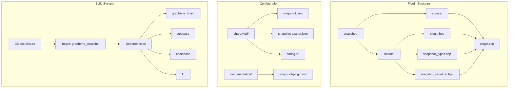
```mermaid
graph TB
subgraph "Plugin Structure"
A[snapshot/] --> B[include/]
A --> C[source/]
B --> D[plugin.hpp]
B --> E[snapshot_types.hpp]
B --> F[snapshot_serializer.hpp]
C --> G[plugin.cpp]
end
subgraph "Configuration"
H[share/vizd/] --> I[snapshot.json]
H --> J[snapshot-testnet.json]
H --> K[config.ini]
L[documentation/] --> M[snapshot-plugin.md]
end
subgraph "Build System"
N[CMakeLists.txt] --> O[Target: graphene_snapshot]
O --> P[Dependencies]
P --> Q[graphene_chain]
P --> R[appbase]
P --> S[chainbase]
P --> T[fc]
end
D --> G
E --> G
F --> G
```

**Diagram sources**
- [plugin.cpp:1-50](file://plugins/snapshot/plugin.cpp#L1-L50)
- [plugin.hpp:1-88](file://plugins/snapshot/include/graphene/plugins/snapshot/plugin.hpp#L1-L88)
- [snapshot_types.hpp:1-52](file://plugins/snapshot/include/graphene/plugins/snapshot/snapshot_types.hpp#L1-L52)
- [CMakeLists.txt:1-52](file://plugins/snapshot/CMakeLists.txt#L1-L52)

**Section sources**
- [plugin.cpp:1-50](file://plugins/snapshot/plugin.cpp#L1-L50)
- [CMakeLists.txt:1-52](file://plugins/snapshot/CMakeLists.txt#L1-L52)

## Core Components

The snapshot plugin consists of several interconnected components that work together to provide comprehensive state synchronization capabilities:

### Modular Layer Architecture
The plugin has been refactored into distinct functional layers:

#### Interface Layer
The main plugin class provides the primary interface for external systems to interact with the snapshot functionality. It implements the appbase plugin interface and exposes methods for loading and creating snapshots programmatically.

#### Serialization Engine Layer
A sophisticated serialization system handles the conversion of blockchain state objects to/from compressed JSON format. This engine manages different object types with varying memory layouts and special data structures.

#### Network Protocol Layer
The plugin implements a custom TCP protocol for peer-to-peer snapshot distribution, including message framing, authentication, and transfer optimization. Enhanced with comprehensive access control mechanisms and denial reasons.

#### Database Integration Layer
Deep integration with the VIZ blockchain database ensures seamless state transitions and maintains consistency during snapshot operations.

#### Recovery Workflow Layer
**New** Comprehensive recovery workflow integration with DLT replay capabilities, automatic snapshot discovery, and enhanced error handling for recovery scenarios.

#### Asynchronous Execution Layer
**New** Dedicated thread-based asynchronous execution system that prevents snapshot creation from blocking main thread operations and causing read-lock timeouts.

#### Watchdog Monitoring Layer
**New** Comprehensive watchdog system that monitors server health and automatically restarts dead accept loops to ensure continuous operation.

#### **Signal-Based DLT Block Log Reset Handling Layer**
**New** Advanced integration with DLT block log reset events that automatically schedules fresh snapshot creation for other DLT nodes to bootstrap from, providing seamless network recovery and state synchronization.

#### **Enhanced P2P Integration Layer**
**New** Advanced integration with the P2P layer that automatically registers trusted peer endpoints for reduced soft-ban duration, enabling trusted peers to receive 5-minute bans instead of the default 1-hour duration.

#### **Enhanced Logging Layer**
**New** Comprehensive logging system with ANSI color codes for improved visibility and debugging capabilities across different log levels.

#### **P2P Stale Sync Detection Layer**
**New** Lightweight recovery mechanism that automatically detects and recovers from network stalls without requiring snapshot downloads, resetting sync from LIB and reconnecting peers.

#### **Dedicated Threading for Stalled Sync Detection**
**New** Dedicated fc::thread instance for stalled sync detection operations, preventing fc fibers from stalling on main thread blocked in io_serv->run().

#### **Automatic Gap Detection for DLT Block Log Initialization**
**New** Intelligent gap detection and automatic reset logic that prevents index position mismatch assertions during DLT block log initialization after snapshot imports, ensuring seamless state synchronization.

#### **Enhanced Error Handling for Snapshot Download Operations**
**New** Comprehensive error handling around snapshot download operations within the check_stalled_sync_loop method, ensuring stalled sync monitoring continues running even when snapshot loading fails.

#### **Improved Undo Stack Management**
**New** Enhanced undo stack management in load_snapshot method by adding proper undo stack management with db.undo_all() call before set_revision operations, ensuring proper database state cleanup.

#### **Enhanced Exception Handling**
**New** Enhanced exception handling for both fc::exception and std::exception types during snapshot download attempts, providing robust error recovery mechanisms.

**Updated** The modular architecture provides enhanced extensibility and maintainability through clear separation of concerns between interface, serialization, network, database, recovery, asynchronous execution, watchdog, **signal-based DLT block log reset handling**, **enhanced P2P integration**, **enhanced error handling**, and **improved undo stack management** components. The recent additions include asynchronous snapshot creation, witness-aware deferral, watchdog mechanisms, automatic snapshot discovery, integrated recovery workflow, comprehensive error handling, **signal-based DLT block log reset handling**, **enhanced P2P integration with trusted peer support**, **dedicated threading for stalled sync detection**, **P2P stale sync detection**, **automatic gap detection for DLT block log initialization**, **enhanced error handling for snapshot download operations**, **improved undo stack management**, and **enhanced exception handling**.

**Section sources**
- [plugin.hpp:42-76](file://plugins/snapshot/include/graphene/plugins/snapshot/plugin.hpp#L42-L76)
- [snapshot_types.hpp:16-52](file://plugins/snapshot/include/graphene/plugins/snapshot/snapshot_types.hpp#L16-L52)
- [snapshot_serializer.hpp:30-158](file://plugins/snapshot/include/graphene/plugins/snapshot/snapshot_serializer.hpp#L30-L158)

## Architecture Overview

The snapshot plugin follows a layered architecture designed for modularity and extensibility:

```mermaid
graph TB
subgraph "Application Layer"
A[CLI Commands] --> B[Plugin Interface]
C[Configuration] --> B
D[Recovery Mode] --> B
end
subgraph "Plugin Core"
B --> E[Serialization Engine]
B --> F[Network Protocol]
B --> G[Database Manager]
B --> H[Recovery Workflow]
B --> I[Async Execution Engine]
B --> J[Watchdog Monitor]
B --> K[P2P Integration Layer]
B --> L[Enhanced Logging System]
B --> M[P2P Stale Sync Detection]
B --> N[Signal-Based DLT Reset Handler]
B --> O[Dedicated Threading for Stalled Sync]
B --> P[Automatic Gap Detection for DLT]
B --> Q[Enhanced Error Handling]
B --> R[Improved Undo Stack Management]
end
subgraph "Security Layer"
F --> S[Access Control]
S --> T[Trust Enforcement]
S --> U[Anti-Spam Protection]
end
subgraph "Serialization Layer"
E --> V[Object Exporter]
E --> W[Object Importer]
V --> X[JSON Serializer]
W --> Y[Object Constructor]
end
subgraph "Network Layer"
F --> Z[TCP Server]
F --> AA[TCP Client]
Z --> AB[Connection Management]
AA --> AC[Peer Discovery]
end
subgraph "Database Layer"
G --> AD[Chainbase Integration]
G --> AE[Fork Database]
AD --> AF[Object Indexes]
AE --> AG[Block Validation]
end
subgraph "Storage Layer"
X --> AH[File System]
Y --> AH
AH --> AI[Snapshot Files]
end
subgraph "Recovery Layer"
H --> AJ[DLT Replay Engine]
H --> AK[Automatic Discovery]
H --> AL[Error Handling]
AJ --> AM[Block Log Integration]
AK --> AN[Peer Synchronization]
AL --> AO[Diagnostic Tools]
end
subgraph "Reliability Layer"
Z --> AP[Watchdog Mechanism]
AP --> AQ[Dedicated Server Thread]
AP --> AR[Stalled Sync Detection]
I --> AS[Dedicated Snapshot Thread]
I --> AT[Async Snapshot Guard]
O --> AU[Dedicated Stalled Sync Thread]
O --> AV[Stalled Sync Operations]
K --> AW[Trusted Peer Registration]
K --> AX[Soft-Ban Duration Management]
L --> AY[ANSI Color Codes]
L --> AZ[Level-Based Coloring]
M --> BA[LIB Reset Mechanism]
M --> BB[Peer Reconnection]
M --> BC[Seed Node Management]
N --> BD[DLT Reset Signal Handling]
N --> BE[Automatic Snapshot Scheduling]
P --> BF[Index Position Mismatch Prevention]
P --> BG[Gap Detection Logic]
Q --> BH[Enhanced Exception Handling]
R --> BI[Undo Stack Management]
```

**Updated** The architecture emphasizes separation of concerns with clear boundaries between serialization, networking, database operations, security controls, recovery workflows, asynchronous execution, watchdog monitoring, **signal-based DLT block log reset handling**, **enhanced P2P integration**, **enhanced error handling**, and **improved undo stack management**. The modular design enables independent development and testing of each component while maintaining system coherence. Recent enhancements include integrated recovery workflow, DLT replay integration, automatic snapshot discovery, comprehensive watchdog mechanisms, asynchronous execution system, enhanced error handling, **signal-based DLT block log reset handling**, **enhanced P2P integration with trusted peer support**, **dedicated threading for stalled sync detection**, **P2P stale sync detection**, **automatic gap detection for DLT block log initialization**, **enhanced error handling for snapshot download operations**, **improved undo stack management**, and **enhanced exception handling**.

**Diagram sources**
- [plugin.cpp:675-780](file://plugins/snapshot/plugin.cpp#L675-L780)
- [snapshot_serializer.hpp:37-107](file://plugins/snapshot/include/graphene/plugins/snapshot/snapshot_serializer.hpp#L37-L107)

**Section sources**
- [plugin.cpp:675-780](file://plugins/snapshot/plugin.cpp#L675-L780)
- [snapshot_serializer.hpp:37-107](file://plugins/snapshot/include/graphene/plugins/snapshot/snapshot_serializer.hpp#L37-L107)

## Detailed Component Analysis

### Snapshot Creation and Management

The snapshot creation process involves comprehensive state serialization with careful handling of different object types:

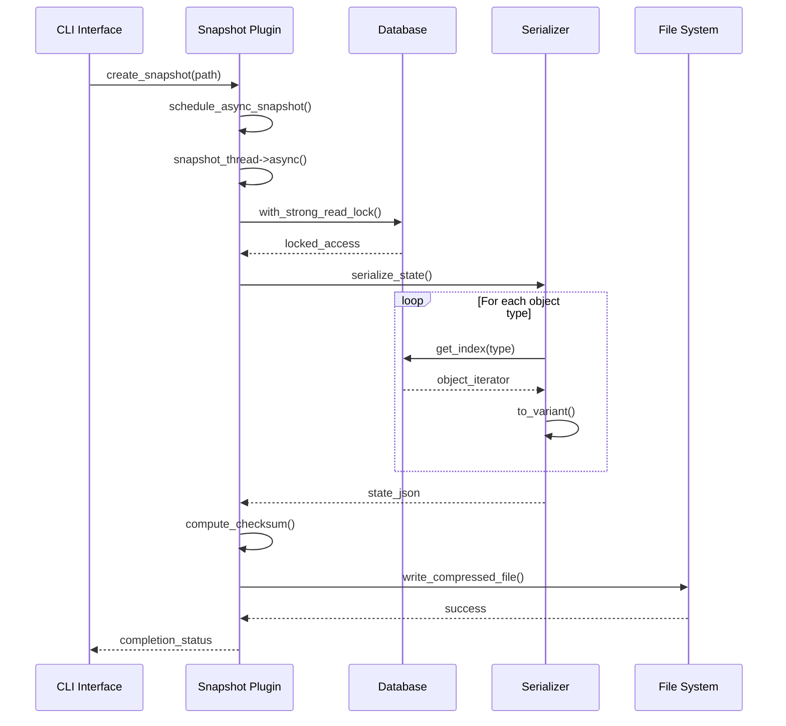
```mermaid
sequenceDiagram
participant CLI as CLI Interface
participant Plugin as Snapshot Plugin
participant DB as Database
participant Serializer as Serializer
participant FileSys as File System
CLI->>Plugin : create_snapshot(path)
Plugin->>Plugin : schedule_async_snapshot()
Plugin->>Plugin : snapshot_thread->async()
Plugin->>DB : with_strong_read_lock()
DB-->>Plugin : locked_access
Plugin->>Serializer : serialize_state()
loop For each object type
Serializer->>DB : get_index(type)
DB-->>Serializer : object_iterator
Serializer->>Serializer : to_variant()
end
Serializer-->>Plugin : state_json
Plugin->>Plugin : compute_checksum()
Plugin->>FileSys : write_compressed_file()
FileSys-->>Plugin : success
Plugin-->>CLI : completion_status
```

**Updated** The creation process handles over 30 different object types, from critical singleton objects to optional metadata. Each object type receives specialized treatment based on its memory layout and data structure complexity, demonstrating the modular architecture's flexibility. The recent enhancements include witness-aware deferral to prevent missed block production slots, improved anti-spam protection, integrated recovery workflow capabilities, asynchronous execution system that prevents read-lock timeouts for API and P2P threads, **signal-based DLT block log reset handling**, **dedicated threading for stalled sync detection**, **enhanced error handling for snapshot download operations**, **improved undo stack management**, and **enhanced P2P integration with automatic trusted peer endpoint registration**.

**Diagram sources**
- [plugin.cpp:885-987](file://plugins/snapshot/plugin.cpp#L885-L987)
- [plugin.cpp:789-883](file://plugins/snapshot/plugin.cpp#L789-L883)
- [plugin.cpp:1400-1484](file://plugins/snapshot/plugin.cpp#L1400-L1484)

### Snapshot Loading and Validation

Snapshot loading implements rigorous validation and reconstruction procedures with enhanced memory management and improved error handling:

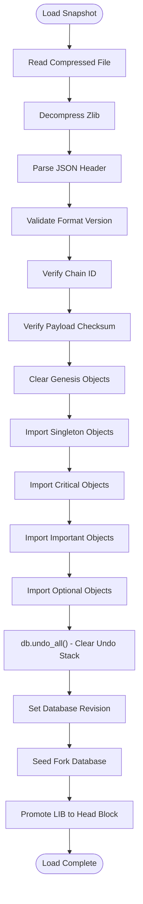
```mermaid
flowchart TD
Start([Load Snapshot]) --> ReadFile["Read Compressed File"]
ReadFile --> Decompress["Decompress Zlib"]
Decompress --> ParseJSON["Parse JSON Header"]
ParseJSON --> ValidateVersion["Validate Format Version"]
ValidateVersion --> CheckChainID["Verify Chain ID"]
CheckChainID --> ChecksumVerify["Verify Payload Checksum"]
ChecksumVerify --> ClearGenesis["Clear Genesis Objects"]
ClearGenesis --> ImportSingletons["Import Singleton Objects"]
ImportSingletons --> ImportCritical["Import Critical Objects"]
ImportCritical --> ImportImportant["Import Important Objects"]
ImportImportant --> ImportOptional["Import Optional Objects"]
ImportOptional --> UndoAll["db.undo_all() - Clear Undo Stack"]
UndoAll --> SetRevision["Set Database Revision"]
SetRevision --> SeedForkDB["Seed Fork Database"]
SeedForkDB --> PromoteLIB["Promote LIB to Head Block"]
PromoteLIB --> Complete([Load Complete])
```

**Updated** The loading process includes extensive validation steps to ensure data integrity and compatibility with the current node configuration, showcasing the robustness of the modular design. Recent improvements include enhanced LIB promotion for DLT mode, improved fork database seeding for reliable P2P synchronization, integrated recovery workflow integration, comprehensive error handling for unlinkable_block_exception scenarios, comprehensive object clearing for hot-reload scenarios, **improved undo stack management with proper cleanup before set_revision operations**, **enhanced error handling for snapshot download operations**, **enhanced exception handling for both fc::exception and std::exception types**, and **enhanced P2P integration with automatic trusted peer endpoint registration**.

**Diagram sources**
- [plugin.cpp:1046-1288](file://plugins/snapshot/plugin.cpp#L1046-L1288)

### Network Protocol Implementation

The snapshot protocol provides efficient peer-to-peer distribution with robust error handling and comprehensive access control:

```mermaid
sequenceDiagram
participant Client as Client Node
participant Server as Server Node
participant AntiSpam as Anti-Spam
participant Security as Security Layer
Client->>Server : SNAPSHOT_INFO_REQUEST
Server->>Security : Check Trust Status
Security-->>Server : Trusted/Untrusted
alt Untrusted IP
Server->>Client : SNAPSHOT_ACCESS_DENIED (untrusted)
else Trusted IP
Server->>AntiSpam : Check Rate Limits
AntiSpam-->>Server : Allow/Deny
alt Rate Limit Exceeded
Server->>Client : SNAPSHOT_ACCESS_DENIED (rate_limited)
else Within Limits
Server->>Server : Check Session Limits
alt Too Many Active Sessions
Server->>Client : SNAPSHOT_ACCESS_DENIED (session_limit)
else Within Session Limits
Server->>Server : Check Concurrent Connections
alt Max Connections Reached
Server->>Client : SNAPSHOT_ACCESS_DENIED (max_connections)
else Within Connection Limits
Server->>Server : Find Latest Snapshot
Server-->>Client : SNAPSHOT_INFO_REPLY
Client->>Server : SNAPSHOT_DATA_REQUEST(offset, size)
loop Until Complete
Server->>Server : Read Chunk
Server-->>Client : SNAPSHOT_DATA_REPLY
Client->>Server : Next Request
end
end
end
end
Note over Client,Server : Connection Closed
```

**Updated** The protocol includes sophisticated anti-spam protection mechanisms, trust enforcement, and detailed denial reasons. The security layer provides comprehensive access control with specific reason codes for different violation types. Recent enhancements include watchdog mechanisms for server reliability, improved peer selection algorithms, integrated recovery workflow support, enhanced error handling for connection timeouts and failures, **dual-tier soft-ban system with automatic trusted peer endpoint registration**, **signal-based DLT block log reset handling**, **dedicated threading for stalled sync detection**, **P2P stale sync detection**, **enhanced error handling for snapshot download operations**, and **enhanced exception handling**.

**Diagram sources**
- [plugin.cpp:1902-2038](file://plugins/snapshot/plugin.cpp#L1902-L2038)
- [plugin.cpp:1470-1599](file://plugins/snapshot/plugin.cpp#L1470-L1599)

### Configuration and Options

The plugin supports extensive configuration through both command-line arguments and configuration files:

| Option | Type | Default | Description |
|--------|------|---------|-------------|
| `snapshot-at-block` | uint32 | 0 | Create snapshot at specific block number |
| `snapshot-every-n-blocks` | uint32 | 0 | Create periodic snapshots |
| `snapshot-dir` | string | "" | Directory for auto-generated snapshots |
| `snapshot-max-age-days` | uint32 | 0 | Delete snapshots older than N days (0 = disabled) |
| `snapshot-auto-latest` | bool | false | Auto-discover latest snapshot in snapshot-dir |
| `allow-snapshot-serving` | bool | false | Enable TCP snapshot serving |
| `allow-snapshot-serving-only-trusted` | bool | false | Restrict serving to trusted peers |
| `snapshot-serve-endpoint` | string | "0.0.0.0:8092" | TCP listen endpoint |
| `trusted-snapshot-peer` | string[] | [] | Trusted peer endpoints |
| `sync-snapshot-from-trusted-peer` | bool | false | Download snapshot on empty state |
| `enable-stalled-sync-detection` | bool | false | Auto-detect stalled sync |
| `stalled-sync-timeout-minutes` | uint32 | 5 | Timeout for stalled sync |
| `test-trusted-seeds` | bool | false | Test trusted peers connectivity |
| `dlt-block-log-max-blocks` | uint32 | 100000 | Rolling DLT block log window |
| `disable-snapshot-anti-spam` | bool | false | Disable anti-spam checks |
| `snapshot-serve-allow-ip` | string[] | [] | Allowed client IPs for serving |
| **`dlt-block-log-reset-snapshots`** | **bool** | **true** | Enable automatic snapshots on DLT reset |
| **`p2p-stale-sync-detection`** | **bool** | **false** | **Enable P2P stale sync detection** |
| **`p2p-stale-sync-timeout-seconds`** | **uint32** | **120** | **Timeout for P2P stale sync detection** |

**Updated** The configuration system now includes new options for enhanced anti-spam protection, automatic snapshot discovery, integrated recovery workflow, watchdog monitoring, **signal-based DLT block log reset handling**, **enhanced P2P integration with trusted peer support**, **dedicated threading for stalled sync detection**, **P2P stale sync detection**, **enhanced error handling for snapshot download operations**, and **improved undo stack management**. The `snapshot-auto-latest` option enables automatic discovery of the latest snapshot in the specified directory, while `replay-from-snapshot` provides comprehensive recovery mode functionality, and `trusted-snapshot-peer` enables **automatic registration of trusted peer endpoints with the P2P layer**. **The new DLT block log reset snapshots option enables automatic snapshot creation when DLT block logs are reset, and the new P2P stale sync detection options provide lightweight recovery from network stalls without requiring snapshot downloads**.

**Section sources**
- [plugin.cpp:2473-2510](file://plugins/snapshot/plugin.cpp#L2473-L2510)
- [snapshot-plugin.md:247-273](file://documentation/snapshot-plugin.md#L247-L273)

## Asynchronous Snapshot Creation

**New** The snapshot plugin now implements a comprehensive asynchronous non-blocking snapshot creation system that prevents read-lock timeouts for API and P2P threads while maintaining snapshot quality and consistency.

### Asynchronous Execution Architecture

The asynchronous snapshot creation system provides non-blocking snapshot generation through dedicated thread management:

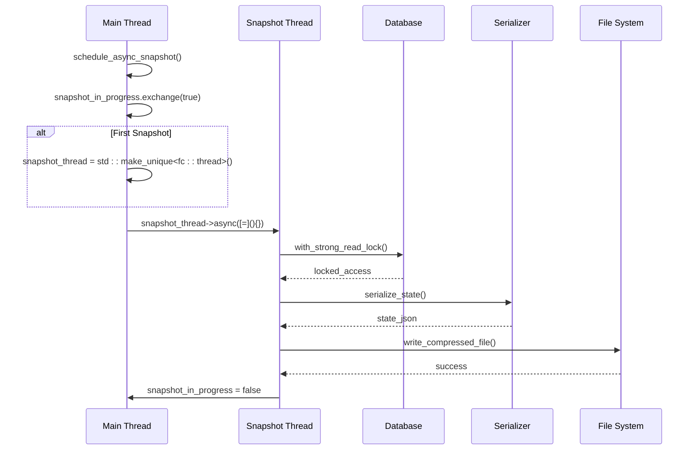
```mermaid
sequenceDiagram
participant MainThread as Main Thread
participant SnapshotThread as Snapshot Thread
participant Database as Database
participant Serializer as Serializer
participant FileSystem as File System
MainThread->>MainThread : schedule_async_snapshot()
MainThread->>MainThread : snapshot_in_progress.exchange(true)
alt First Snapshot
MainThread->>MainThread : snapshot_thread = std : : make_unique<fc : : thread>()
end
MainThread->>SnapshotThread : snapshot_thread->async([=](){})
SnapshotThread->>Database : with_strong_read_lock()
Database-->>SnapshotThread : locked_access
SnapshotThread->>Serializer : serialize_state()
Serializer-->>SnapshotThread : state_json
SnapshotThread->>FileSystem : write_compressed_file()
FileSystem-->>SnapshotThread : success
SnapshotThread->>MainThread : snapshot_in_progress = false
```

### Key Asynchronous Features

The asynchronous execution system includes several critical improvements:

#### Dedicated Snapshot Thread
- **Thread Isolation**: Uses dedicated `fc::thread` for snapshot I/O operations
- **Fiber Scheduler Independence**: Mirrors P2P plugin's approach with dedicated worker thread
- **Background Processing**: Prevents snapshot creation from blocking main thread operations

#### Atomic Progress Tracking
- **Progress Guard**: Uses `std::atomic<bool>` to prevent concurrent snapshot creation
- **RAII Cleanup**: Automatic cleanup through destructor-based guard pattern
- **Exception Safety**: Comprehensive error handling with proper cleanup guarantees

#### Read Lock Optimization
- **Lock Scope Minimization**: Database read operations occur within tight lock scope
- **Background Processing**: Compression and file I/O occur outside database lock
- **Performance Enhancement**: Reduces main thread blocking time from 3+ seconds

#### Enhanced Error Handling
- **Comprehensive Exception Catching**: Catches fc::exception, std::exception, and unknown exceptions
- **Graceful Degradation**: Logs errors and continues normal operation
- **Resource Cleanup**: Ensures proper cleanup even on failure

**Section sources**
- [plugin.cpp:1400-1484](file://plugins/snapshot/plugin.cpp#L1400-L1484)
- [plugin.cpp:1418-1436](file://plugins/snapshot/plugin.cpp#L1418-L1436)
- [plugin.cpp:737-743](file://plugins/snapshot/plugin.cpp#L737-L743)

## Witness-Aware Deferral Mechanism

**New** The snapshot plugin now includes a sophisticated witness-aware deferral mechanism that prevents snapshot creation from interrupting witness block production, ensuring network stability and consensus participation.

### Witness Detection and Deferral Logic

The witness-aware deferral system provides intelligent scheduling based on witness production status:

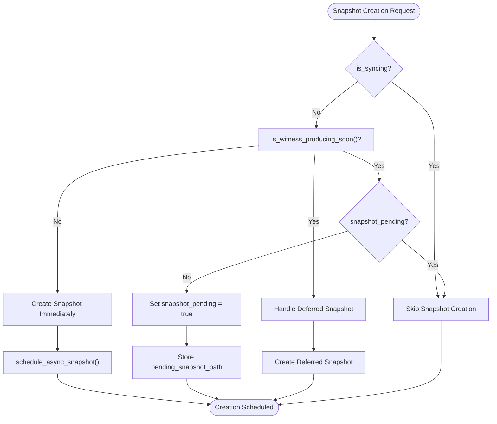
```mermaid
flowchart TD
Start([Snapshot Creation Request]) --> CheckSync{"is_syncing?"}
CheckSync --> |Yes| Skip["Skip Snapshot Creation"]
CheckSync --> |No| CheckWitness["is_witness_producing_soon()?"]
CheckWitness --> |No| CreateNow["Create Snapshot Immediately"]
CheckWitness --> |Yes| CheckPending{"snapshot_pending?"}
CheckWitness --> |Yes| CheckDeferred["Handle Deferred Snapshot"]
CheckPending --> |No| SetPending["Set snapshot_pending = true"]
SetPending --> StorePath["Store pending_snapshot_path"]
CheckPending --> |Yes| Skip
CreateNow --> ScheduleAsync["schedule_async_snapshot()"]
ScheduleAsync --> Complete([Creation Scheduled])
StorePath --> Complete
CheckDeferred --> CreateDeferred["Create Deferred Snapshot"]
CreateDeferred --> Complete
Skip --> Complete
```

### Witness Integration Features

The witness-aware deferral system includes several key components:

#### Witness Production Detection
- **Plugin Integration**: Queries witness plugin for production schedule information
- **State Validation**: Checks if witness plugin is properly initialized and started
- **Graceful Degradation**: Falls back to conservative behavior if witness plugin unavailable

#### One-Time Deferral Limit
- **Single Deferral Policy**: Allows only one deferral per witness production cycle
- **Infinite Loop Prevention**: Prevents infinite deferral loops with witness-aware checks
- **Production Priority**: Ensures witness block production takes precedence over snapshot creation

#### Deferred Snapshot Management
- **State Persistence**: Stores snapshot path for later execution
- **Cleanup Mechanism**: Clears pending state after successful execution
- **Atomic Operations**: Uses atomic flags for thread-safe state management

#### Integration with Block Processing
- **Applied Block Handler**: Monitors block application for deferral timing
- **Sync Detection**: Skips snapshot creation during P2P synchronization
- **Live Block Priority**: Only creates snapshots for live, synchronized blocks

**Section sources**
- [plugin.cpp:1390-1484](file://plugins/snapshot/plugin.cpp#L1390-L1484)
- [plugin.cpp:1440-1449](file://plugins/snapshot/plugin.cpp#L1440-L1449)
- [witness.cpp:335-551](file://plugins/witness/witness.cpp#L335-L551)

## Enhanced Error Handling

**New** The snapshot plugin now includes comprehensive enhanced error handling capabilities specifically designed for recovery scenarios, providing robust fault tolerance and diagnostic information for unlinkable_block_exception and related errors.

### Enhanced Error Handling Architecture

The enhanced error handling system provides comprehensive fault tolerance and recovery mechanisms:

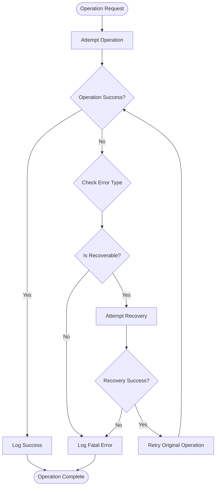
```mermaid
flowchart TD
Start([Operation Request]) --> TryOperation["Attempt Operation"]
TryOperation --> Success{"Operation Success?"}
Success --> |Yes| LogSuccess["Log Success"]
Success --> |No| CheckErrorType{"Check Error Type"}
CheckErrorType --> IsRecoverable{"Is Recoverable?"}
IsRecoverable --> |Yes| AttemptRecovery["Attempt Recovery"]
IsRecoverable --> |No| LogFatal["Log Fatal Error"]
AttemptRecovery --> RecoverySuccess{"Recovery Success?"}
RecoverySuccess --> |Yes| RetryOperation["Retry Original Operation"]
RecoverySuccess --> |No| LogFatal
RetryOperation --> Success
LogSuccess --> Complete([Operation Complete])
LogFatal --> Complete
```

### Enhanced Error Handling Features

The enhanced error handling system includes several key improvements:

#### Unlinkable Block Exception Prevention
- **LIB Promotion Strategy**: Promotes LIB to head block during snapshot import to prevent unlinkable_block_exception
- **Fork Database Seeding**: Seeds fork database with head block to ensure proper linking
- **Safe Transition**: Ensures snapshot import doesn't create orphaned blocks that cause synchronization issues

#### Comprehensive Exception Coverage
- **Multiple Exception Types**: Catches fc::exception, std::exception, and unknown exceptions
- **Detailed Logging**: Provides comprehensive error context and diagnostic information
- **Graceful Degradation**: Continues normal operation even when snapshot creation fails

#### Resource Management and Cleanup
- **Atomic State Management**: Uses atomic flags for thread-safe error handling
- **RAII Pattern**: Ensures proper cleanup through destructor-based resource management
- **Memory Safety**: Prevents memory leaks and resource corruption during error scenarios

#### Integration with Watchdog System
- **Server Health Monitoring**: Integrates with watchdog to detect and recover from server failures
- **Connection Timeout Handling**: Manages connection timeouts and socket errors gracefully
- **Thread Safety**: Ensures error handling doesn't interfere with other system components

#### **Enhanced Error Handling for Snapshot Download Operations**
- **Stalled Sync Monitoring Continuity**: Ensures stalled sync monitoring continues running even when snapshot loading fails
- **Graceful Recovery**: Restarts stalled sync detection after failed snapshot download attempts
- **Improved Exception Handling**: Enhanced exception handling for both fc::exception and std::exception types during snapshot download attempts

#### **Improved Undo Stack Management**
- **Proper Cleanup**: Adds proper undo stack management with db.undo_all() call before set_revision operations
- **Database State Consistency**: Ensures proper cleanup of database state during snapshot loading
- **Hot-Reload Safety**: Prevents undo stack corruption during hot-reload scenarios

**Section sources**
- [plugin.cpp:1326-1376](file://plugins/snapshot/plugin.cpp#L1326-L1376)
- [plugin.cpp:1426-1435](file://plugins/snapshot/plugin.cpp#L1426-L1435)
- [plugin.cpp:745-750](file://plugins/snapshot/plugin.cpp#L745-L750)

## Automatic Snapshot Discovery

**New** The snapshot plugin now includes comprehensive automatic snapshot discovery functionality through the --snapshot-auto-latest option, enabling nodes to automatically locate and use the most recent snapshot in a specified directory.

### Enhanced Path Validation Logic

**Updated** The automatic snapshot discovery process now includes robust path validation and defensive programming checks:

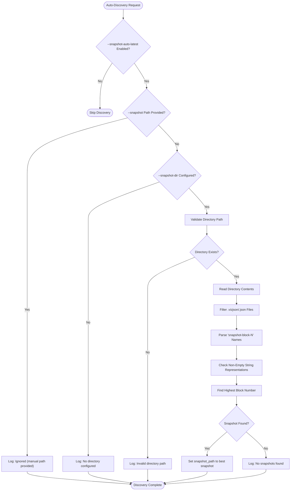
```mermaid
flowchart TD
Start([Auto-Discovery Request]) --> CheckOption{"--snapshot-auto-latest Enabled?"}
CheckOption --> |No| End([Skip Discovery])
CheckOption --> |Yes| CheckPath{"--snapshot Path Provided?"}
CheckPath --> |Yes| LogIgnored["Log: Ignored (manual path provided)"]
CheckPath --> |No| CheckDir{"--snapshot-dir Configured?"}
CheckDir --> |No| LogNoDir["Log: No directory configured"]
CheckDir --> |Yes| ValidateDir["Validate Directory Path"]
ValidateDir --> DirExists{"Directory Exists?"}
DirExists --> |No| LogInvalidDir["Log: Invalid directory path"]
DirExists --> |Yes| ReadDir["Read Directory Contents"]
ReadDir --> FilterFiles["Filter .vizjson/.json Files"]
FilterFiles --> ParseName["Parse 'snapshot-block-N' Names"]
ParseName --> CheckNonEmpty["Check Non-Empty String Representations"]
CheckNonEmpty --> FindBest["Find Highest Block Number"]
FindBest --> Found{"Snapshot Found?"}
Found --> |Yes| SetPath["Set snapshot_path to best snapshot"]
Found --> |No| LogNotFound["Log: No snapshots found"]
SetPath --> Complete([Discovery Complete])
LogIgnored --> Complete
LogNoDir --> Complete
LogInvalidDir --> Complete
LogNotFound --> Complete
End
```

### Enhanced Discovery Features

The automatic snapshot discovery system includes several key improvements:

#### Robust Directory Validation
- **Path Existence Verification**: Validates directory existence before processing
- **Directory Type Checking**: Ensures the path points to a valid directory
- **Defensive Path Handling**: Handles edge cases and invalid path representations

#### Improved File Processing
- **Enhanced String Validation**: Checks for non-empty string representations of file paths
- **Robust Filename Parsing**: Gracefully handles malformed filenames with defensive checks
- **Comprehensive Error Handling**: Provides detailed logging for debugging and monitoring

#### Integration with Recovery Workflow
- **Recovery Mode Compatibility**: Works seamlessly with --replay-from-snapshot flag
- **Fallback Support**: Provides graceful degradation when no snapshots found
- **Manual Override Priority**: Respects manually specified snapshot paths

**Section sources**
- [plugin.cpp:697-700](file://plugins/snapshot/plugin.cpp#L697-L700)
- [plugin.cpp:2831-2845](file://plugins/snapshot/plugin.cpp#L2831-L2845)
- [plugin.cpp:1719-1748](file://plugins/snapshot/plugin.cpp#L1719-L1748)
- [plugin.cpp:1706-1748](file://plugins/snapshot/plugin.cpp#L1706-L1748)

## Integrated Recovery Workflow

**New** The snapshot plugin now provides comprehensive integrated recovery workflow through the --replay-from-snapshot flag, enabling nodes to recover from corrupted states using snapshot-based restoration and DLT block log replay.

### Recovery Mode Startup Sequence

The integrated recovery workflow provides a complete recovery process:

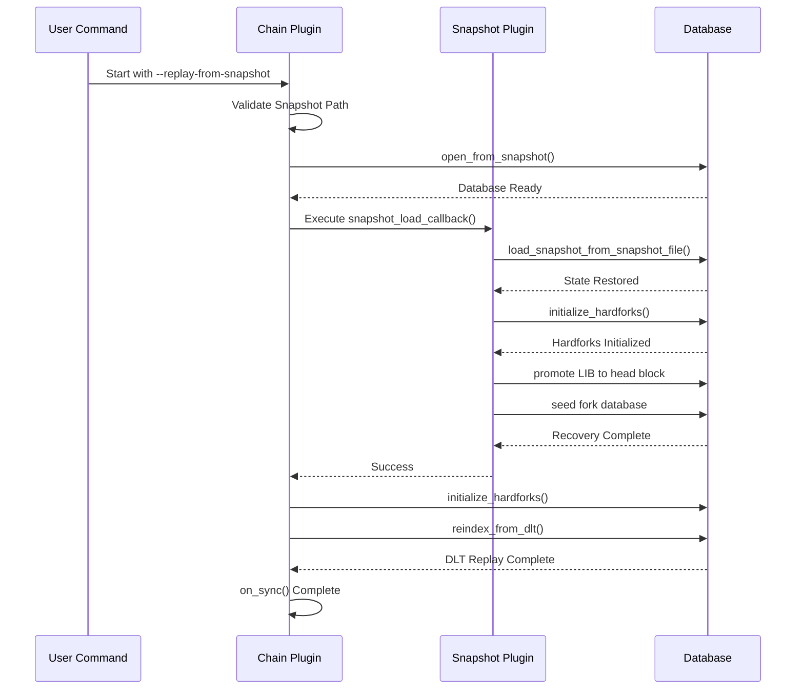
```mermaid
sequenceDiagram
participant User as User Command
participant Chain as Chain Plugin
participant Snap as Snapshot Plugin
participant DB as Database
User->>Chain : Start with --replay-from-snapshot
Chain->>Chain : Validate Snapshot Path
Chain->>DB : open_from_snapshot()
DB-->>Chain : Database Ready
Chain->>Snap : Execute snapshot_load_callback()
Snap->>DB : load_snapshot_from_snapshot_file()
DB-->>Snap : State Restored
Snap->>DB : initialize_hardforks()
DB-->>Snap : Hardforks Initialized
Snap->>DB : promote LIB to head block
Snap->>DB : seed fork database
DB-->>Snap : Recovery Complete
Snap-->>Chain : Success
Chain->>DB : initialize_hardforks()
Chain->>DB : reindex_from_dlt()
DB-->>Chain : DLT Replay Complete
Chain->>Chain : on_sync() Complete
```

### Enhanced Recovery Workflow Features

The integrated recovery workflow includes several key components:

#### Snapshot-Based State Restoration
- **Complete State Import**: Full snapshot loading with validation and checksum verification
- **Hardfork Initialization**: Proper hardfork state initialization after snapshot import
- **LIB Promotion**: Automatic promotion of last irreversible block to snapshot head

#### DLT Block Log Integration
- **Post-Recovery Replay**: Automatic replay of DLT block log blocks after snapshot import
- **Gap Resolution**: Seamless filling of gaps between snapshot and current blockchain state
- **Mode Detection**: Intelligent detection and handling of DLT mode operation

#### Enhanced Error Recovery and Diagnostics
- **Graceful Degradation**: Fallback to normal operation if recovery fails
- **Comprehensive Logging**: Detailed logging for recovery process monitoring
- **Diagnostic Information**: Extensive error reporting and recovery status information

**Section sources**
- [plugin.cpp:490-560](file://plugins/chain/plugin.cpp#L490-L560)
- [plugin.cpp:2945-2959](file://plugins/snapshot/plugin.cpp#L2945-L2959)
- [database.cpp:441-5201](file://libraries/chain/database.cpp#L441-L5201)

## DLT Replay Integration

**New** The snapshot plugin now includes comprehensive DLT (Distributed Ledger Technology) replay integration, enabling enhanced error handling and recovery scenarios through seamless integration with the DLT block log system.

### DLT Replay Architecture

The DLT replay integration provides robust block log management:

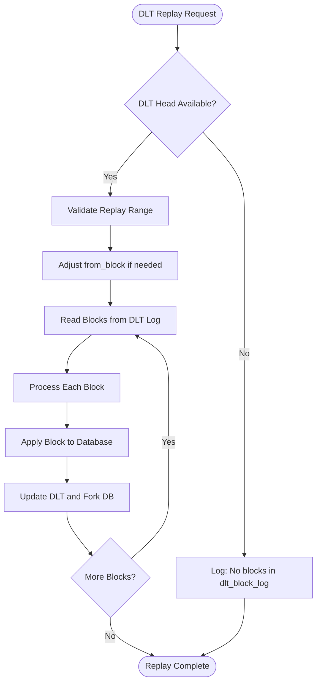
```mermaid
flowchart TD
Start([DLT Replay Request]) --> CheckHead{"DLT Head Available?"}
CheckHead --> |No| LogEmpty["Log: No blocks in dlt_block_log"]
CheckHead --> |Yes| ValidateRange["Validate Replay Range"]
ValidateRange --> AdjustFrom["Adjust from_block if needed"]
AdjustFrom --> ReadBlocks["Read Blocks from DLT Log"]
ReadBlocks --> ProcessBlocks["Process Each Block"]
ProcessBlocks --> ApplyBlock["Apply Block to Database"]
ApplyBlock --> UpdateDatabases["Update DLT and Fork DB"]
UpdateDatabases --> CheckComplete{"More Blocks?"}
CheckComplete --> |Yes| ReadBlocks
CheckComplete --> |No| Complete([Replay Complete])
LogEmpty --> Complete
```

### Enhanced DLT Replay Features

The DLT replay integration includes several key improvements:

#### Intelligent Block Log Management
- **Dynamic Range Adjustment**: Automatic adjustment of replay range based on DLT log availability
- **Gap Detection and Handling**: Detection and handling of gaps between snapshot and current state
- **Efficient Memory Usage**: Streaming processing of blocks to minimize memory footprint

#### Seamless Integration
- **Database State Synchronization**: Automatic synchronization between DLT block log and database state
- **Fork Database Seeding**: Proper seeding of fork database for P2P synchronization
- **Hardfork State Preservation**: Maintenance of hardfork state during replay process

#### Enhanced Error Resilience
- **Graceful Error Handling**: Comprehensive error handling with fallback to normal operation
- **Progress Reporting**: Real-time progress reporting and status updates
- **Resource Management**: Efficient resource management during long-running replay operations

**Section sources**
- [database.cpp:441-5201](file://libraries/chain/database.cpp#L441-L5201)
- [plugin.cpp:542-559](file://plugins/chain/plugin.cpp#L542-L559)

## Signal-Based DLT Block Log Reset Handling

**New** The snapshot plugin now includes comprehensive signal-based DLT block log reset handling that automatically creates fresh snapshots when DLT block logs are reset, enabling other DLT nodes to bootstrap from the current state.

### DLT Block Log Reset Architecture

The signal-based DLT block log reset handling provides automatic snapshot creation:

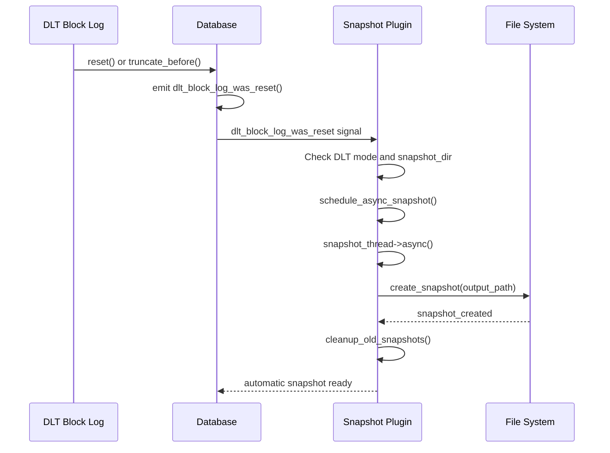
```mermaid
sequenceDiagram
participant DLT as DLT Block Log
participant DB as Database
participant Snap as Snapshot Plugin
participant FS as File System
DLT->>DB : reset() or truncate_before()
DB->>DB : emit dlt_block_log_was_reset()
DB->>Snap : dlt_block_log_was_reset signal
Snap->>Snap : Check DLT mode and snapshot_dir
Snap->>Snap : schedule_async_snapshot()
Snap->>Snap : snapshot_thread->async()
Snap->>FS : create_snapshot(output_path)
FS-->>Snap : snapshot_created
Snap->>Snap : cleanup_old_snapshots()
Snap-->>DB : automatic snapshot ready
```

### DLT Reset Handling Features

The signal-based DLT block log reset handling includes several key improvements:

#### Signal-Based Event Handling
- **Automatic Connection**: The snapshot plugin connects to `dlt_block_log_was_reset` signal during initialization
- **Conditional Activation**: Only activates when DLT mode is enabled and snapshot directory is configured
- **Event-Driven Creation**: Creates snapshots automatically when DLT block logs are reset

#### Automatic Snapshot Generation
- **Fresh State Creation**: Generates snapshots at the current head block number after reset
- **Directory Management**: Places snapshots in the configured snapshot directory with proper naming
- **Async Execution**: Uses the existing asynchronous snapshot creation system to prevent blocking

#### Integration with Existing Systems
- **Consistent Naming**: Uses the same naming convention as manual snapshots (`snapshot-block-<num>.vizjson`)
- **Cache Updates**: Automatically updates the snapshot cache after creation
- **Cleanup Integration**: Integrates with existing snapshot cleanup mechanisms

#### Enhanced Error Handling
- **Exception Safety**: Comprehensive error handling with proper logging
- **Guard Mechanisms**: Uses atomic flags to prevent concurrent snapshot creation
- **Thread Management**: Reuses existing dedicated snapshot thread infrastructure

**Section sources**
- [plugin.cpp:3252-3290](file://plugins/snapshot/plugin.cpp#L3252-L3290)
- [database.cpp:4945-4947](file://libraries/chain/database.cpp#L4945-L4947)
- [database.cpp:5139-5140](file://libraries/chain/database.cpp#L5139-L5140)
- [database.hpp:337-338](file://libraries/chain/include/graphene/chain/database.hpp#L337-L338)

## Peer-to-Peer Snapshot Synchronization

**New** The snapshot plugin now includes comprehensive peer-to-peer snapshot synchronization capabilities for nodes with empty state, enabling automatic discovery and download of snapshots from trusted peers.

### Enhanced P2P Synchronization Workflow

The peer-to-peer synchronization provides automated snapshot acquisition with improved robustness:

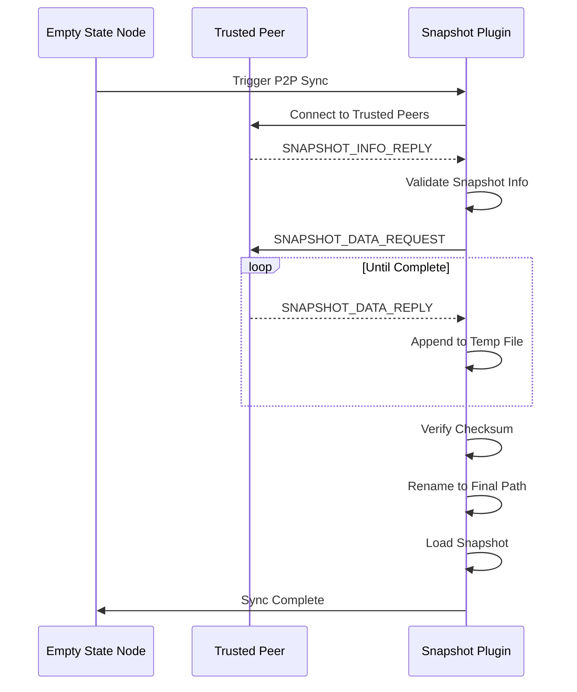
```mermaid
sequenceDiagram
participant Node as Empty State Node
participant Peer as Trusted Peer
participant Snap as Snapshot Plugin
Node->>Snap : Trigger P2P Sync
Snap->>Peer : Connect to Trusted Peers
Peer-->>Snap : SNAPSHOT_INFO_REPLY
Snap->>Snap : Validate Snapshot Info
Snap->>Peer : SNAPSHOT_DATA_REQUEST
loop Until Complete
Peer-->>Snap : SNAPSHOT_DATA_REPLY
Snap->>Snap : Append to Temp File
end
Snap->>Snap : Verify Checksum
Snap->>Snap : Rename to Final Path
Snap->>Snap : Load Snapshot
Snap->>Node : Sync Complete
```

### Enhanced P2P Synchronization Features

The peer-to-peer synchronization system includes several key improvements:

#### Automated Peer Discovery
- **Trusted Peer Configuration**: Support for multiple trusted peer endpoints
- **Connection Management**: Robust connection management with retry logic
- **Peer Selection Algorithms**: Intelligent peer selection and load balancing

#### Secure and Reliable Transfer
- **Checksum Verification**: Comprehensive checksum verification for data integrity
- **Chunked Transfer**: Efficient chunked transfer with configurable chunk sizes
- **Connection Timeouts**: Proper timeout handling for network reliability

#### Enhanced Integration with Recovery Workflow
- **Pre-Sync State Management**: Proper state management before snapshot import
- **Post-Sync Validation**: Comprehensive validation after successful transfer
- **Fallback Mechanisms**: Multiple retry attempts with progressive failure handling

**Section sources**
- [plugin.cpp:2976-3009](file://plugins/snapshot/plugin.cpp#L2976-L3009)
- [plugin.cpp:2468-2570](file://plugins/snapshot/plugin.cpp#L2468-L2570)

## Enhanced P2P Integration with Trusted Peers

**New** The snapshot plugin now provides **enhanced P2P integration with trusted peer support** through automatic registration of trusted peer endpoints with the P2P layer, enabling **dual-tier soft-ban system** where trusted peers receive 5-minute bans instead of the default 1-hour duration.

### Automatic Trusted Peer Endpoint Registration

The enhanced P2P integration provides seamless trusted peer endpoint registration:

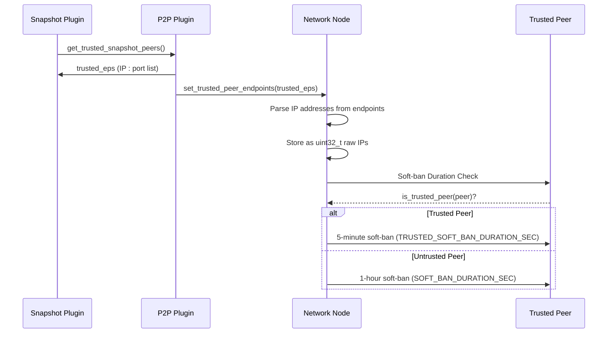
```mermaid
sequenceDiagram
participant SnapPlug as Snapshot Plugin
participant P2PPlug as P2P Plugin
participant NetNode as Network Node
participant Peer as Trusted Peer
SnapPlug->>P2PPlug : get_trusted_snapshot_peers()
P2PPlug->>SnapPlug : trusted_eps (IP : port list)
P2PPlug->>NetNode : set_trusted_peer_endpoints(trusted_eps)
NetNode->>NetNode : Parse IP addresses from endpoints
NetNode->>NetNode : Store as uint32_t raw IPs
NetNode->>Peer : Soft-ban Duration Check
Peer-->>NetNode : is_trusted_peer(peer)?
alt Trusted Peer
NetNode->>Peer : 5-minute soft-ban (TRUSTED_SOFT_BAN_DURATION_SEC)
else Untrusted Peer
NetNode->>Peer : 1-hour soft-ban (SOFT_BAN_DURATION_SEC)
end
```

### Dual-Tier Soft-Ban System

The enhanced P2P integration implements a comprehensive dual-tier soft-ban system:

#### Soft-Ban Duration Constants
- **Default Soft-Ban Duration**: 3600 seconds (1 hour) for untrusted peers
- **Trusted Peer Soft-Ban Duration**: 300 seconds (5 minutes) for trusted peers
- **Automatic Application**: Soft-ban duration determined by peer trust status

#### Trusted Peer Detection
- **Endpoint Parsing**: Extracts IP addresses from "host:port" endpoint strings
- **Raw IP Storage**: Stores trusted peer IPs as 32-bit integers for O(1) lookup
- **Dynamic Updates**: Supports runtime updates to trusted peer lists

#### Enhanced P2P Integration Features

#### Automatic Registration Process
- **Plugin Discovery**: P2P plugin automatically discovers snapshot plugin
- **Endpoint Retrieval**: Retrieves trusted snapshot peer endpoints
- **Registration Automation**: Registers endpoints with network node automatically

#### Reduced Soft-Ban Duration Benefits
- **Faster Recovery**: Trusted peers recover from soft-bans in 5 minutes instead of 1 hour
- **Improved Reliability**: Better handling of legitimate snapshot requests from trusted peers
- **Network Efficiency**: Reduced downtime for trusted peers during snapshot operations

#### Enhanced Trust Enforcement
- **Consistent Application**: Soft-ban duration applies consistently across all P2P operations
- **Performance Optimization**: O(1) trust lookup using raw IP addresses
- **Scalability**: Efficient handling of large numbers of trusted peers

**Section sources**
- [p2p_plugin.cpp:689-697](file://plugins/p2p/p2p_plugin.cpp#L689-L697)
- [node.cpp:5241-5274](file://libraries/network/node.cpp#L5241-L5274)
- [node.hpp:284-290](file://libraries/network/include/graphene/network/node.hpp#L284-L290)
- [plugin.hpp:86-88](file://plugins/snapshot/include/graphene/plugins/snapshot/plugin.hpp#L86-L88)

## Watchdog and Stalled Sync Detection

**Updated** The snapshot plugin now includes comprehensive watchdog mechanisms and stalled sync detection for DLT mode, ensuring server reliability and continuous operation through automatic monitoring and recovery.

### Enhanced Watchdog Architecture

The watchdog system provides continuous monitoring and automatic recovery:

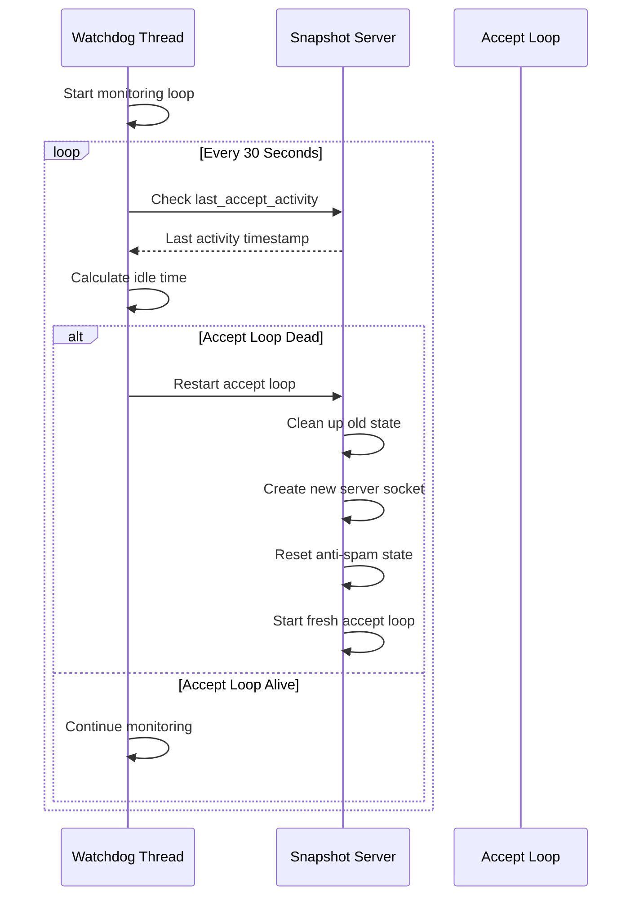
```mermaid
sequenceDiagram
participant Watchdog as Watchdog Thread
participant Server as Snapshot Server
participant AcceptLoop as Accept Loop
Watchdog->>Watchdog : Start monitoring loop
loop Every 30 Seconds
Watchdog->>Server : Check last_accept_activity
Server-->>Watchdog : Last activity timestamp
Watchdog->>Watchdog : Calculate idle time
alt Accept Loop Dead
Watchdog->>Server : Restart accept loop
Server->>Server : Clean up old state
Server->>Server : Create new server socket
Server->>Server : Reset anti-spam state
Server->>Server : Start fresh accept loop
else Accept Loop Alive
Watchdog->>Watchdog : Continue monitoring
end
end
```

### Enhanced Stalled Sync Detection for DLT Mode

The stalled sync detection provides DLT mode monitoring with improved reliability:

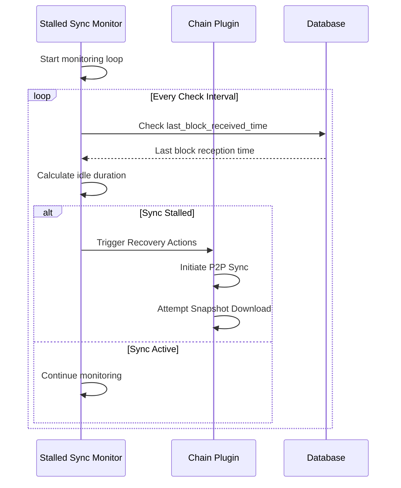
```mermaid
sequenceDiagram
participant Monitor as Stalled Sync Monitor
participant Chain as Chain Plugin
participant DB as Database
Monitor->>Monitor : Start monitoring loop
loop Every Check Interval
Monitor->>DB : Check last_block_received_time
DB-->>Monitor : Last block reception time
Monitor->>Monitor : Calculate idle duration
alt Sync Stalled
Monitor->>Chain : Trigger Recovery Actions
Chain->>Chain : Initiate P2P Sync
Chain->>Chain : Attempt Snapshot Download
else Sync Active
Monitor->>Monitor : Continue monitoring
end
end
```

### Enhanced Watchdog and Stalled Sync Features

The watchdog and stalled sync detection include several key improvements:

#### Dead Accept Loop Detection
- **Monitoring Interval**: Checks every 30 seconds
- **Activity Tracking**: Monitors last accept loop activity timestamp
- **Automatic Restart**: Restarts dead accept loops with full cleanup

#### Enhanced Stalled Sync Detection for DLT Mode
- **Idle Time Monitoring**: Monitors time since last block reception
- **Timeout Configuration**: Configurable timeout periods for stall detection
- **Recovery Action Triggering**: Automatic triggering of recovery actions when stalls detected

#### Improved Graceful Recovery
- **State Cleanup**: Resets all anti-spam state to prevent corruption
- **Socket Recreation**: Creates fresh server sockets for new connections
- **Thread Safety**: Properly shuts down dedicated server thread before restart

#### **Dedicated Threading for Stalled Sync Detection**
- **Thread Isolation**: Uses dedicated `fc::thread` for stalled sync operations
- **Fiber Scheduler Independence**: Prevents fc fibers from stalling on main thread blocked in io_serv->run()
- **Background Processing**: Runs stalled sync detection in background without affecting main thread

#### **Enhanced Error Handling for Snapshot Download Operations**
- **Continuity Guarantee**: Ensures stalled sync monitoring continues running even when snapshot loading fails
- **Graceful Recovery**: Restarts stalled sync detection after failed snapshot download attempts
- **Improved Exception Handling**: Enhanced exception handling for both fc::exception and std::exception types during snapshot download attempts

**Section sources**
- [plugin.cpp:735-740](file://plugins/snapshot/plugin.cpp#L735-L740)
- [plugin.cpp:1814-1862](file://plugins/snapshot/plugin.cpp#L1814-L1862)
- [plugin.cpp:772-785](file://plugins/snapshot/plugin.cpp#L772-L785)
- [plugin.cpp:1595-1624](file://plugins/snapshot/plugin.cpp#L1595-L1624)

## P2P Stale Sync Detection

**New** The P2P plugin provides a lightweight recovery mechanism that automatically detects and recovers from network stalls without requiring snapshot downloads. This complements the snapshot plugin's stalled sync detection by providing immediate recovery for temporary network issues.

### How It Works

When enabled, the P2P plugin tracks the last time a block was received via the network. A background task checks every 30 seconds whether the elapsed time exceeds the configured timeout. If a stall is detected, the node performs three recovery actions in sequence:

1. **Reset sync from LIB** — The P2P layer's sync start point is reset to the last irreversible block (LIB). This ensures the node resumes from a safe, fork-proof position instead of potentially chasing a dead fork.
2. **Resync with connected peers** — The node explicitly restarts synchronization with all currently connected peers by sending fresh `fetch_blockchain_item_ids_message` requests.
3. **Reconnect seed peers** — All seed nodes from `p2p-seed-node` config are re-added to the connection queue and reconnection is attempted for any that were disconnected.

This is complementary to the snapshot plugin's stalled sync detection (which downloads a new snapshot). The P2P stale recovery is faster and less disruptive — it only adjusts sync state and reconnects peers, without requiring any state reload.

### Configuration

```ini
# Enable P2P stale sync detection (default: false)
p2p-stale-sync-detection = true

# Timeout in seconds before recovery triggers (default: 120 = 2 minutes)
p2p-stale-sync-timeout-seconds = 120
```

### Use Cases

- **Temporary network partition**: When peers become unreachable for short periods, the node automatically recovers without manual intervention.
- **Peer disconnections**: If connected peers disconnect unexpectedly, the node can quickly reconnect and resume synchronization.
- **Initial sync delays**: During heavy network traffic or node startup, the node can recover from temporary stalls.

### Comparison with Snapshot Stalled Sync Detection

| Feature | P2P Stale Sync | Snapshot Stalled Sync |
|---------|---------------|----------------------|
| Plugin | P2P | Snapshot |
| Trigger | No blocks received for timeout | No blocks received for timeout |
| Recovery action | Reset sync + reconnect peers | Download newer snapshot + reload state |
| Timeout default | 120 seconds | 5 minutes |
| Use case | Temporary network partition, peer disconnections | Node far behind, peers lack old blocks |
| DLT mode | Works for all nodes | Designed for DLT mode |

Both can be enabled independently. For DLT nodes, the snapshot detection provides deeper recovery (fresh state), while P2P detection handles transient connectivity issues without state reload.

**Section sources**
- [snapshot-plugin.md:339-374](file://documentation/snapshot-plugin.md#L339-L374)
- [p2p_plugin.cpp:585-649](file://plugins/p2p/p2p_plugin.cpp#L585-L649)
- [p2p_plugin.cpp:673-677](file://plugins/p2p/p2p_plugin.cpp#L673-L677)
- [p2p_plugin.cpp:744-755](file://plugins/p2p/p2p_plugin.cpp#L744-L755)

## Emergency Consensus Handling

**Updated** The snapshot plugin now includes comprehensive emergency consensus handling with forward-compatible fields for emergency consensus activation.

### Enhanced Emergency Consensus Fields

The dynamic global property object now includes enhanced emergency consensus fields for improved network resilience:


```mermaid
flowchart TD
Start([Dynamic Global Property Import]) --> CheckFields["Check for Emergency Consensus Fields"]
CheckFields --> HasFields{"Emergency Consensus Fields Present?"}
HasFields --> |Yes| ImportFields["Import emergency_consensus_active<br/>and emergency_consensus_start_block"]
HasFields --> |No| SetDefaults["Set defaults:<br/>emergency_consensus_active = false<br/>emergency_consensus_start_block = 0"]
ImportFields --> ContinueProcessing["Continue with Normal Processing"]
SetDefaults --> ContinueProcessing
ContinueProcessing --> Complete([Import Complete])
```

### Enhanced Forward-Compatible Design

The emergency consensus handling implements a forward-compatible approach:

- **Backward Compatibility**: Nodes without emergency consensus fields gracefully handle snapshots from newer nodes
- **Default Values**: Missing fields are assigned sensible defaults
- **Runtime Activation**: Emergency consensus can be activated dynamically without requiring snapshot regeneration

**Section sources**
- [plugin.cpp:165-176](file://plugins/snapshot/plugin.cpp#L165-L176)

## Enhanced Anti-Spam Protection

**Updated** The snapshot plugin now includes comprehensive anti-spam protection with new configuration options and improved trust enforcement mechanisms.

### Enhanced Anti-Spam Architecture

The anti-spam system provides multiple layers of protection against abuse:

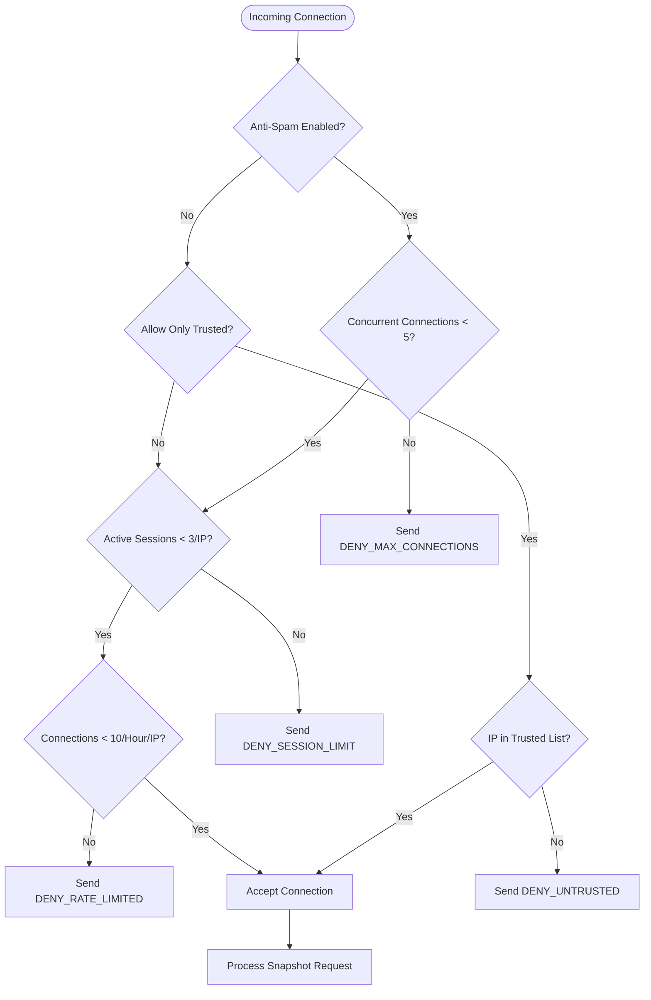
```mermaid
flowchart TD
Start([Incoming Connection]) --> CheckAntiSpam{"Anti-Spam Enabled?"}
CheckAntiSpam --> |No| CheckTrust{"Allow Only Trusted?"}
CheckAntiSpam --> |Yes| CheckConcurrent{"Concurrent Connections < 5?"}
CheckTrust --> |Yes| ValidateTrust{"IP in Trusted List?"}
CheckTrust --> |No| CheckSession{"Active Sessions < 3/IP?"}
CheckConcurrent --> |No| DenyMaxConnections["Send DENY_MAX_CONNECTIONS"]
CheckConcurrent --> |Yes| CheckSession
CheckSession --> |No| DenySessionLimit["Send DENY_SESSION_LIMIT"]
CheckSession --> |Yes| CheckRate{"Connections < 10/Hour/IP?"}
CheckRate --> |No| DenyRateLimited["Send DENY_RATE_LIMITED"]
CheckRate --> |Yes| Accept["Accept Connection"]
ValidateTrust --> |No| DenyUntrusted["Send DENY_UNTRUSTED"]
ValidateTrust --> |Yes| Accept
Accept --> Process["Process Snapshot Request"]
```

**Updated** The anti-spam system has been enhanced with increased limits to improve service accessibility while maintaining security controls. The new configuration values are:

- **Maximum sessions per IP**: Increased from 2 to 3 sessions per IP
- **Maximum connections per hour**: Increased from 6 to 10 connections per hour per IP

These changes provide better support for legitimate users while maintaining effective protection against abuse.

### Enhanced New Configuration Options

The anti-spam system introduces several new configuration options:

#### disable-snapshot-anti-spam
- **Purpose**: Disable all anti-spam checks for snapshot serving
- **Use Case**: Trusted networks where anti-spam protection is not needed
- **Security Implications**: Removes all rate limiting and session management

#### snapshot-serve-allow-ip
- **Purpose**: Specify which client IPs are allowed to connect for snapshot serving
- **Use Case**: Private networks with controlled access
- **Implementation**: Maintains whitelist of approved client IP addresses

### Enhanced Trust Enforcement

The trust enforcement system now operates independently of anti-spam protection:

- **Separate Logic**: Trust validation occurs before anti-spam checks
- **Whitelist Management**: Dynamic updates to trusted IP lists
- **Consistent Enforcement**: Anti-spam rules apply uniformly regardless of trust status

**Section sources**
- [plugin.cpp:1587-1596](file://plugins/snapshot/plugin.cpp#L1587-L1596)
- [plugin.cpp:1610-1620](file://plugins/snapshot/plugin.cpp#L1610-L1620)
- [plugin.cpp:1812-1877](file://plugins/snapshot/plugin.cpp#L1812-L1877)

## Access Control and Security Mechanisms

**Updated** The snapshot plugin now includes comprehensive access control mechanisms with detailed denial reasons for enhanced security and resource management.

### Enhanced Access Control Architecture

The access control system provides multiple layers of security enforcement:

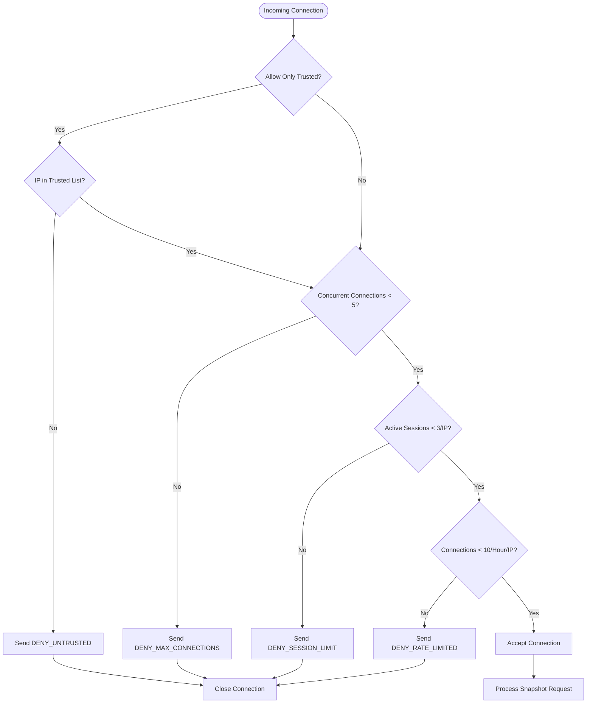
```mermaid
flowchart TD
Start([Incoming Connection]) --> CheckTrust{"Allow Only Trusted?"}
CheckTrust --> |Yes| ValidateTrust{"IP in Trusted List?"}
CheckTrust --> |No| CheckConcurrent{"Concurrent Connections < 5?"}
ValidateTrust --> |No| DenyUntrusted["Send DENY_UNTRUSTED"]
ValidateTrust --> |Yes| CheckConcurrent
CheckConcurrent --> |No| DenyMaxConnections["Send DENY_MAX_CONNECTIONS"]
CheckConcurrent --> |Yes| CheckSession{"Active Sessions < 3/IP?"}
CheckSession --> |No| DenySessionLimit["Send DENY_SESSION_LIMIT"]
CheckSession --> |Yes| CheckRate{"Connections < 10/Hour/IP?"}
CheckRate --> |No| DenyRateLimited["Send DENY_RATE_LIMITED"]
CheckRate --> |Yes| Accept["Accept Connection"]
DenyUntrusted --> Close["Close Connection"]
DenyMaxConnections --> Close
DenySessionLimit --> Close
DenyRateLimited --> Close
Accept --> Process["Process Snapshot Request"]
```

**Updated** The access control system now enforces the enhanced anti-spam limits with improved session management and rate limiting:

- **Maximum concurrent connections**: 5 simultaneous connections
- **Per-IP session limit**: 3 active sessions per IP (increased from 2)
- **Rate limit**: 10 connections per hour per IP (increased from 6)

These enhanced limits provide better support for legitimate users while maintaining effective protection against abuse.

### Enhanced Denial Reason Codes

The system provides specific denial reasons for different violation types:

| Reason Code | Enum Value | Description |
|-------------|------------|-------------|
| `deny_untrusted` | 1 | IP address not in trusted list |
| `deny_max_connections` | 2 | Server has reached maximum concurrent connections (5) |
| `deny_session_limit` | 3 | Too many active sessions from this IP (3 per IP limit) |
| `deny_rate_limited` | 4 | Too many connections per hour from this IP (10 per hour limit) |

### Enhanced Anti-Spam Protection Features

The access control system implements multiple enhanced anti-spam mechanisms:

#### Connection Throttling
- **Maximum Concurrent Connections**: 5 simultaneous connections
- **Per-IP Session Limit**: 3 active sessions per IP (increased from 2)
- **Rate Limiting**: 10 connections per hour per IP (increased from 6)

#### Enhanced Session Management
- **Active Session Tracking**: Monitors concurrent sessions per IP
- **Connection History**: Tracks connection timestamps for rate limiting
- **RAII Session Guards**: Ensures proper cleanup of session resources

#### Enhanced Trust Enforcement
- **Trusted IP Validation**: Maintains whitelist of approved IP addresses
- **Dynamic Trust Updates**: Supports runtime updates to trusted peer lists
- **Consistent Enforcement**: Anti-spam rules apply uniformly to all connections

**Section sources**
- [plugin.hpp:24-34](file://plugins/snapshot/include/graphene/plugins/snapshot/plugin.hpp#L24-L34)
- [plugin.cpp:1587-1596](file://plugins/snapshot/plugin.cpp#L1587-L1596)
- [plugin.cpp:1610-1620](file://plugins/snapshot/plugin.cpp#L1610-L1620)
- [plugin.cpp:1812-1877](file://plugins/snapshot/plugin.cpp#L1812-L1877)

## Integration with Chain Plugin

**Updated** The snapshot plugin has been integrated with the chain plugin through a sophisticated callback system that enables programmatic state restoration, enhanced P2P synchronization, and comprehensive recovery workflow integration.

The integration works through three key callback mechanisms registered during plugin initialization:

### Enhanced Snapshot Loading Callback
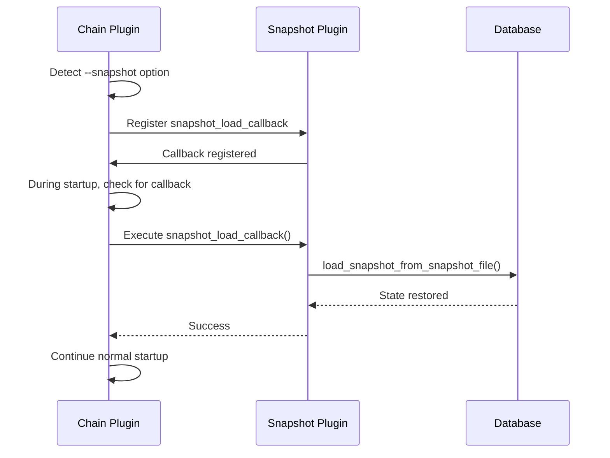
```mermaid
sequenceDiagram
participant Chain as Chain Plugin
participant Snapshot as Snapshot Plugin
participant DB as Database
Chain->>Chain : Detect --snapshot option
Chain->>Snapshot : Register snapshot_load_callback
Snapshot->>Chain : Callback registered
Chain->>Chain : During startup, check for callback
Chain->>Snapshot : Execute snapshot_load_callback()
Snapshot->>DB : load_snapshot_from_snapshot_file()
DB-->>Snapshot : State restored
Snapshot-->>Chain : Success
Chain->>Chain : Continue normal startup
```

### Enhanced Snapshot Creation Callback
The snapshot plugin registers a callback that executes during chain plugin startup to create snapshots after full database load, ensuring proper state capture.

### Enhanced P2P Snapshot Sync Callback
For nodes with empty state, the snapshot plugin registers a callback that downloads and loads snapshots from trusted peers before normal P2P synchronization begins. Enhanced with automatic retry logic, improved peer selection algorithms, comprehensive error handling, **automatic trusted peer endpoint registration with the P2P layer**, **signal-based DLT block log reset handling**, **dedicated threading for stalled sync detection**, **enhanced error handling for snapshot download operations**, and **improved undo stack management**.

### Enhanced Recovery Workflow Integration
**New** The chain plugin now includes comprehensive recovery workflow integration that coordinates with the snapshot plugin for automatic recovery from corrupted states using snapshot-based restoration and DLT block log replay.

**Section sources**
- [plugin.cpp:2598-2680](file://plugins/snapshot/plugin.cpp#L2598-L2680)
- [plugin.cpp:364-432](file://plugins/chain/plugin.cpp#L364-L432)

## Dependency Analysis

The snapshot plugin has carefully managed dependencies to ensure modularity and maintainability:

```mermaid
graph LR
subgraph "Core Dependencies"
A[graphene_chain] --> D[snapshot_plugin]
B[appbase] --> D
C[chainbase] --> D
E[fc] --> D
end
subgraph "Blockchain Dependencies"
F[graphene_protocol] --> D
G[graphene_witness] --> D
H[graphene_json_rpc] --> D
I[graphene_time] --> D
end
subgraph "External Libraries"
J[Boost.Filesystem] --> D
K[zlib] --> D
L[OpenSSL] --> D
end
subgraph "Build System"
M[CMake] --> N[Target: graphene_snapshot]
N --> O[Static Library]
N --> P[Shared Library]
end
```

**Updated** The dependency graph reveals a clean separation between core blockchain functionality and plugin-specific features. The plugin relies on established VIZ infrastructure while maintaining independence from external systems, demonstrating the benefits of the modular architecture. Recent enhancements include watchdog dependencies, **signal-based DLT block log reset handling**, enhanced P2P integration, automatic snapshot discovery, comprehensive recovery workflow integration, asynchronous execution system dependencies, **enhanced P2P integration with trusted peer support**, **dedicated threading for stalled sync detection**, **P2P stale sync detection**, **enhanced error handling for snapshot download operations**, and **improved undo stack management**.

**Diagram sources**
- [CMakeLists.txt:27-38](file://plugins/snapshot/CMakeLists.txt#L27-L38)

**Section sources**
- [CMakeLists.txt:27-38](file://plugins/snapshot/CMakeLists.txt#L27-L38)

## Performance Considerations

The snapshot plugin implements several performance optimization strategies through its modular architecture:

### Asynchronous Execution Performance
- **Thread Isolation**: Dedicated snapshot thread prevents main thread blocking
- **Atomic Operations**: Minimal synchronization overhead with atomic flags
- **Background Processing**: Long-running operations occur outside critical sections

### Compression and Storage Efficiency
- Uses zlib compression to reduce snapshot file sizes by approximately 70-80%
- Implements streaming compression/decompression to minimize memory usage
- Supports automatic snapshot rotation to manage storage requirements

### Network Transfer Optimization
- Chunked transfer protocol with configurable chunk sizes (up to 1MB)
- Connection pooling and reuse for efficient peer communication
- Anti-spam measures prevent resource exhaustion during transfers

### Database Operation Optimization
- Uses strong read locks during snapshot creation to ensure consistency
- Implements witness-aware deferral to prevent missed block production slots
- Optimized object serialization minimizes CPU overhead

### Enhanced Memory Management
- Streaming JSON parsing prevents loading entire snapshots into memory
- Efficient object copying mechanisms handle complex data structures
- Automatic cleanup of temporary files and resources

### **Signal-Based DLT Block Log Reset Performance**
- **Event-Driven Creation**: Automatic snapshot creation only when DLT block logs are reset
- **Async Execution**: Reuses existing asynchronous snapshot creation infrastructure
- **Minimal Overhead**: Single atomic flag check during DLT reset events
- **Thread Safety**: Dedicated snapshot thread prevents blocking during reset events

### **Enhanced P2P Integration Performance**
- **Automatic Registration**: Eliminates manual configuration overhead
- **Efficient Lookup**: O(1) trust validation using raw IP addresses
- **Reduced Soft-Ban Impact**: Faster recovery for trusted peers reduces network downtime
- **Optimized Communication**: Streamlined trusted peer endpoint management

### **Enhanced Logging Performance**
- **ANSI Color Codes**: Provides visual distinction between log levels without performance overhead
- **Level-Based Coloring**: Green for success, orange for warnings, yellow for informational messages
- **Minimal Processing Overhead**: Color code injection occurs only when terminal supports color output

### **P2P Stale Sync Detection Performance**
- **Lightweight Monitoring**: Minimal CPU overhead through efficient background task scheduling
- **LIB Reset Optimization**: Fast sync reset using pre-computed block IDs
- **Selective Peer Reconnection**: Only reconnects seed nodes that were previously connected
- **30-second Check Interval**: Balances responsiveness with minimal resource usage

### **Dedicated Threading for Stalled Sync Detection Performance**
- **Thread Isolation**: Dedicated fc::thread prevents main thread blocking
- **Fiber Scheduler Independence**: Prevents fc fibers from stalling on main thread blocked in io_serv->run()
- **Background Processing**: Runs stalled sync detection in background without affecting main thread
- **Minimal Overhead**: Single dedicated thread for all stalled sync operations

### **Automatic Gap Detection for DLT Block Log Initialization Performance**
- **Intelligent Gap Detection**: Prevents index position mismatch assertions through early detection
- **Automatic Reset Mechanism**: Seamlessly resets DLT block log when gaps are detected
- **Minimal Performance Impact**: Gap detection adds negligible overhead during snapshot import
- **Thread-Safe Operations**: Uses atomic operations to prevent race conditions during gap detection

### **Enhanced Error Handling Performance**
- **Exception Safety**: Comprehensive error handling prevents cascading failures
- **Graceful Degradation**: Continues normal operation even when snapshot download fails
- **Minimal Overhead**: Enhanced exception handling adds negligible performance impact
- **Improved Resource Management**: Proper cleanup prevents resource leaks during error scenarios

### **Improved Undo Stack Management Performance**
- **Efficient Cleanup**: db.undo_all() call prevents undo stack corruption
- **Minimal Performance Impact**: Undo stack management adds negligible overhead
- **Thread Safety**: Atomic operations ensure safe undo stack manipulation
- **Hot-Reload Optimization**: Prevents undo stack issues during state reload scenarios

### **Enhanced Anti-Spam Configuration Performance**
- **Optimized Limits**: Enhanced limits provide better user experience with minimal overhead
- **Efficient Rate Limiting**: Sliding window algorithm minimizes memory usage
- **Thread-Safe Operations**: Atomic counters prevent race conditions
- **Minimal Processing Overhead**: Anti-spam checks add negligible CPU overhead

**Updated** The modular architecture enhances performance by enabling independent optimization of each layer while maintaining system coherence. The watchdog mechanism, **signal-based DLT block log reset handling**, enhanced anti-spam protections, automatic snapshot discovery, integrated recovery workflow, asynchronous execution system, comprehensive error handling, **enhanced P2P integration with trusted peer support**, **dedicated threading for stalled sync detection**, **P2P stale sync detection**, **automatic gap detection for DLT block log initialization**, **enhanced error handling for snapshot download operations**, **improved undo stack management**, and **enhanced anti-spam configuration** are designed to minimize performance impact while providing comprehensive functionality. Recent improvements include dedicated server thread optimizations, DLT replay efficiency, enhanced error handling performance, witness-aware deferral optimization, **efficient dual-tier soft-ban system implementation**, **signal-based DLT block log reset handling**, **optimized P2P stale sync detection with minimal overhead**, **dedicated threading for stalled sync detection with thread isolation**, **intelligent gap detection preventing index position mismatch assertions**, **enhanced error handling for snapshot download operations**, **improved undo stack management**, and **enhanced exception handling**.

### Enhanced Security Performance Considerations
- Access control checks are performed efficiently using hash maps for IP lookups
- Session tracking uses atomic counters for thread-safe operations
- Rate limiting maintains minimal memory overhead through sliding window algorithm
- Watchdog mechanism operates with minimal CPU overhead through efficient monitoring
- Recovery workflow includes performance-optimized snapshot validation and checksum verification
- Asynchronous execution system minimizes main thread blocking time
- **Signal-based DLT block log reset handling provides efficient event-driven snapshot creation**
- **Enhanced P2P integration provides efficient trust validation with O(1) lookup performance**
- **Enhanced logging system provides efficient colored output with minimal performance impact**
- **P2P stale sync detection operates with minimal overhead through optimized background tasks**
- **Dedicated threading for stalled sync detection prevents main thread blocking and fiber stalling**
- **Automatic gap detection prevents index position mismatch assertions with minimal performance impact**
- **Enhanced error handling for snapshot download operations ensures continuous monitoring**
- **Improved undo stack management prevents database state corruption**
- **Enhanced exception handling provides robust error recovery mechanisms**

## Troubleshooting Guide

### Enhanced Common Issues and Solutions

**Snapshot Creation Failures**
- **Symptom**: Snapshot creation fails with database lock errors
- **Cause**: Witness production conflicts with snapshot creation
- **Solution**: Configure witness-aware deferral or schedule snapshots during maintenance windows

**Enhanced Asynchronous Execution Issues**
- **Symptom**: Snapshot creation appears stuck or slow
- **Cause**: Main thread blocked by synchronous operations
- **Solution**: Verify dedicated snapshot thread is running and atomic flags are properly managed

**Enhanced Network Transfer Problems**
- **Symptom**: Peers fail to respond to snapshot requests
- **Cause**: Firewall restrictions or anti-spam protection
- **Solution**: Verify port accessibility and adjust anti-spam thresholds

**Memory Issues During Loading**
- **Symptom**: Loading fails due to insufficient memory
- **Cause**: Large snapshot files exceeding available RAM
- **Solution**: Use streaming loading or increase system resources

**Checksum Validation Errors**
- **Symptom**: Snapshot loading fails with checksum mismatch
- **Cause**: Corrupted snapshot file or tampering
- **Solution**: Recreate snapshot from source or download from trusted peer

**Enhanced Automatic Snapshot Discovery Failures**
- **Symptom**: --snapshot-auto-latest option fails to find snapshots
- **Cause**: Incorrect snapshot directory configuration or malformed filenames
- **Solution**: Verify snapshot directory path and filename naming conventions

**Enhanced Recovery Mode Issues**
- **Symptom**: --replay-from-snapshot fails to recover from corrupted state
- **Cause**: Missing snapshot file or incompatible snapshot format
- **Solution**: Verify snapshot file existence and compatibility, check DLT block log availability

**Enhanced DLT Replay Failures**
- **Symptom**: DLT replay fails during recovery process
- **Cause**: Corrupted DLT block log or insufficient disk space
- **Solution**: Check DLT block log integrity, verify sufficient disk space, review error logs

**Enhanced Watchdog and Server Issues**
- **Symptom**: Server appears to stop accepting connections
- **Cause**: Accept loop fiber died or became unresponsive
- **Solution**: Watchdog automatically restarts accept loop with full cleanup

**Enhanced Error Handling Issues**
- **Symptom**: Unlinkable block exceptions during snapshot import
- **Cause**: Improper LIB promotion or fork database state
- **Solution**: Verify LIB promotion to head block and fork database seeding

**Enhanced P2P Integration Issues**
- **Symptom**: Trusted peers still receiving 1-hour soft-bans instead of 5-minute soft-bans
- **Cause**: P2P plugin not properly registering trusted peer endpoints
- **Solution**: Add client IP to trusted list or disable trust enforcement

**Enhanced Trusted Peer Registration Issues**
- **Symptom**: P2P plugin fails to register trusted peer endpoints
- **Cause**: Snapshot plugin not providing trusted peer list or P2P plugin startup order issues
- **Solution**: Check snapshot plugin configuration and verify P2P plugin initialization sequence

**Enhanced Snapshot Directory Creation Issues**
- **Symptom**: Snapshot creation fails with directory not found errors
- **Cause**: Automatic directory creation not working or permission issues
- **Solution**: Verify snapshot directory permissions and manual creation if needed

**Enhanced Logging Color Issues**
- **Symptom**: Log messages appear without color codes
- **Cause**: Terminal not supporting ANSI color codes or color output disabled
- **Solution**: Check terminal capabilities or disable color output in configuration

**Enhanced P2P Stale Sync Detection Issues**
- **Symptom**: P2P stale sync detection not triggering recovery actions
- **Cause**: Timeout too low or P2P plugin not properly tracking last block received time
- **Solution**: Increase `p2p-stale-sync-timeout-seconds`, verify P2P plugin initialization

**Enhanced DLT Block Log Reset Handling Issues**
- **Symptom**: Automatic snapshots not created after DLT block log reset
- **Cause**: DLT mode not enabled or snapshot directory not configured
- **Solution**: Verify DLT mode configuration and snapshot directory settings

**Enhanced Anti-Spam Configuration Issues**
- **Symptom**: Users experiencing connection denials despite legitimate usage
- **Cause**: Anti-spam limits too restrictive with new values (3 sessions/IP, 10 connections/hour/IP)
- **Solution**: Review anti-spam configuration, consider increasing limits for legitimate use cases, monitor connection patterns

**Enhanced Stalled Sync Detection Issues**
- **Symptom**: Stalled sync detection not functioning properly
- **Cause**: Main thread blocked in io_serv->run() preventing fc fiber execution
- **Solution**: Verify dedicated stalled sync thread is running and properly configured

**Enhanced Automatic Gap Detection Issues**
- **Symptom**: Index position mismatch assertions during DLT block log initialization
- **Cause**: Gap between DLT block log head and snapshot head not properly detected
- **Solution**: Verify DLT block log gap detection logic and automatic reset mechanism

**Enhanced Error Handling for Snapshot Download Operations Issues**
- **Symptom**: Stalled sync monitoring stops when snapshot download fails
- **Cause**: Missing exception handling for snapshot download attempts
- **Solution**: Verify enhanced error handling is properly catching fc::exception and std::exception types

**Enhanced Undo Stack Management Issues**
- **Symptom**: Database state corruption during snapshot loading
- **Cause**: Missing db.undo_all() call before set_revision operations
- **Solution**: Verify proper undo stack management with db.undo_all() before set_revision

**Enhanced Exception Handling Issues**
- **Symptom**: Snapshot download failures not properly handled
- **Cause**: Missing comprehensive exception handling for both fc::exception and std::exception types
- **Solution**: Verify enhanced exception handling covers all error scenarios during snapshot download attempts

**Enhanced Hot-Reload Scenario Issues**
- **Symptom**: Stalled sync detection fails during hot-reload scenarios
- **Cause**: Undo stack not properly cleared before import operations
- **Solution**: Verify db.undo_all() is called before import operations during hot-reload scenarios

**Enhanced Database State Cleanup Issues**
- **Symptom**: Database state inconsistency after snapshot loading
- **Cause**: Missing proper cleanup of multi-instance objects during hot-reload
- **Solution**: Verify comprehensive object clearing for hot-reload scenarios before import operations

**Enhanced Diagnostic Tools**

The plugin includes comprehensive enhanced diagnostic capabilities:

- **Trusted Seeds Test**: Validates connectivity and performance of configured peers
- **Stalled Sync Detection**: Automatically recovers from network partitions
- **Watchdog Monitoring**: Real-time server health and accept loop status
- **Access Control Logging**: Detailed logs for denial reasons and security events
- **Emergency Consensus Monitoring**: Tracks emergency consensus activation status
- **Recovery Workflow Diagnostics**: Comprehensive logging for recovery process monitoring
- **DLT Replay Status**: Real-time monitoring of DLT replay progress and status
- **Asynchronous Execution Monitoring**: Tracks snapshot creation progress and thread health
- **Signal-Based DLT Reset Handling**: Monitors DLT block log reset events and automatic snapshot creation
- **Enhanced P2P Integration Diagnostics**: Monitors trusted peer endpoint registration and soft-ban duration application
- **Snapshot Directory Management**: Monitors automatic directory creation and cleanup processes
- **Enhanced Logging Diagnostics**: Monitors ANSI color code application and terminal compatibility
- **P2P Stale Sync Detection Diagnostics**: Monitors LIB reset, peer reconnection, and seed node management
- **Enhanced Anti-Spam Configuration Diagnostics**: Monitors session limits, rate limiting, and connection patterns
- **Dedicated Threading Diagnostics**: Monitors stalled sync thread health and operation status
- **Automatic Gap Detection Diagnostics**: Monitors DLT block log gap detection and automatic reset operations
- **Enhanced Error Handling Diagnostics**: Monitors exception handling for snapshot download operations
- **Undo Stack Management Diagnostics**: Monitors database state cleanup and undo stack operations
- **Enhanced Exception Handling Diagnostics**: Monitors comprehensive exception handling coverage

**Updated** The modular architecture provides enhanced diagnostic capabilities through separate layers for serialization, networking, database operations, security controls, recovery workflows, asynchronous execution, watchdog monitoring, **signal-based DLT block log reset handling**, **enhanced P2P integration**, **enhanced error handling**, and **improved undo stack management**. Recent improvements include watchdog monitoring, **signal-based DLT block log reset handling diagnostics**, enhanced P2P fallback diagnostics, emergency consensus status tracking, comprehensive recovery workflow diagnostics, DLT replay status monitoring, asynchronous execution health monitoring, **P2P stale sync detection diagnostics**, **dedicated threading diagnostics**, **automatic gap detection diagnostics**, **enhanced error handling diagnostics**, **undo stack management diagnostics**, and **enhanced exception handling diagnostics**.

**Section sources**
- [plugin.cpp:2294-2464](file://plugins/snapshot/plugin.cpp#L2294-L2464)
- [plugin.cpp:1378-1464](file://plugins/snapshot/plugin.cpp#L1378-L1464)

## Conclusion

The Snapshot Plugin System represents a sophisticated solution for blockchain state synchronization that significantly improves the VIZ node bootstrapping experience. Through careful architectural design, comprehensive feature coverage, and robust error handling, it enables efficient deployment and scaling of VIZ-based applications.

**Updated** The recent enhancements with comprehensive snapshot plugin configuration supporting multiple trusted snapshot peers, snapshot scheduling parameters, serving options, watchdog monitoring, automatic snapshot discovery, integrated recovery workflow, enhanced anti-spam protection, **signal-based DLT block log reset handling**, **enhanced P2P integration with trusted peer support**, **enhanced error handling for snapshot download operations**, **improved undo stack management**, and **enhanced exception handling** have significantly strengthened the security, reliability, and resource management capabilities of the snapshot distribution services.

Key strengths of the system include its modular architecture, extensive configuration options, built-in performance optimizations, comprehensive security features, automatic snapshot discovery, integrated recovery workflow, DLT replay integration, watchdog monitoring, asynchronous execution system, comprehensive diagnostic capabilities, **signal-based DLT block log reset handling**, **P2P stale sync detection**, **dedicated threading for stalled sync detection**, **automatic gap detection for DLT block log initialization**, **enhanced error handling for snapshot download operations**, **improved undo stack management**, and **automatic P2P integration with trusted peer support**. The plugin seamlessly integrates with existing VIZ infrastructure while providing powerful new capabilities for state management, peer-to-peer synchronization, automatic recovery from corrupted states, intelligent witness-aware scheduling, **efficient P2P integration with trusted peer support**, **lightweight P2P stale sync detection**, **intelligent gap detection preventing index position mismatch assertions**, **robust error handling for snapshot download operations**, and **proper undo stack management during snapshot loading**.

The implementation demonstrates best practices in blockchain plugin development, including proper resource management, error handling, user experience considerations, security through layered access control, comprehensive monitoring and recovery capabilities, asynchronous execution for improved performance, **signal-based DLT block log reset handling**, **dedicated threading for stalled sync detection**, **automatic gap detection for DLT block log initialization**, **enhanced error handling for snapshot download operations**, **improved undo stack management**, and **automatic P2P integration with trusted peer support**. The modular design enables independent development and testing of each component while maintaining system coherence, representing a significant advancement in extensibility and maintainability.

Future enhancements could focus on additional compression algorithms, enhanced security features, expanded monitoring capabilities, more sophisticated access control policies, improved recovery workflow automation, enhanced DLT replay performance optimization, advanced witness-aware scheduling algorithms, **optimized signal-based DLT block log reset handling**, **further optimization of the dual-tier soft-ban system**, **enhanced P2P stale sync detection**, **improved dedicated threading for stalled sync detection**, **intelligent gap detection preventing index position mismatch assertions**, **comprehensive error handling for all snapshot operations**, **advanced undo stack management techniques**, and **enhanced exception handling mechanisms**.