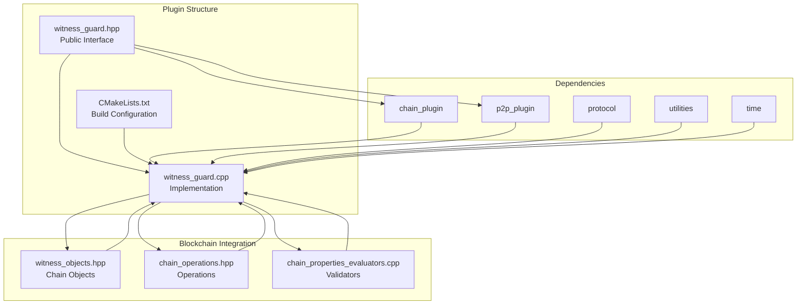
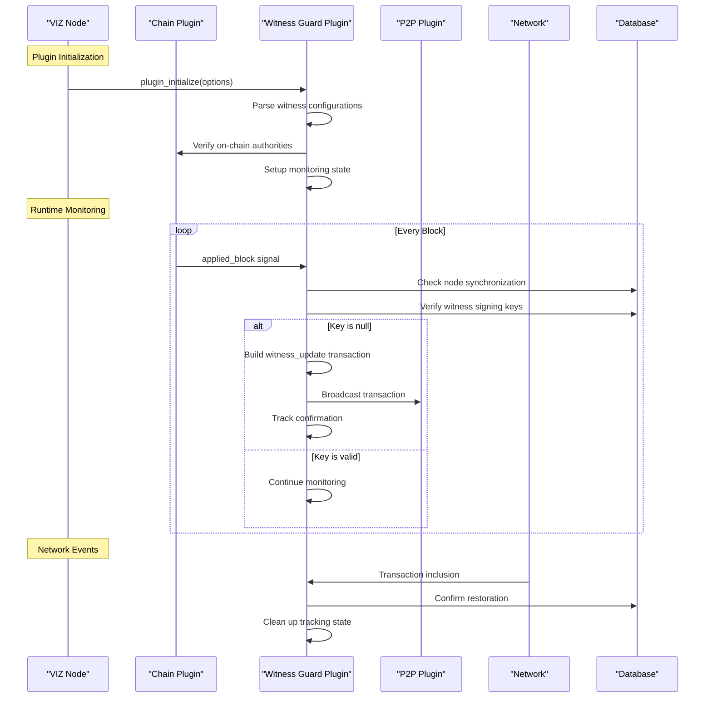
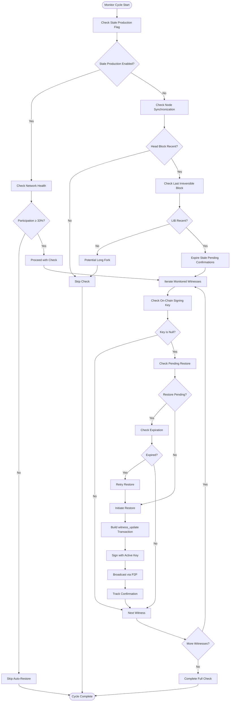
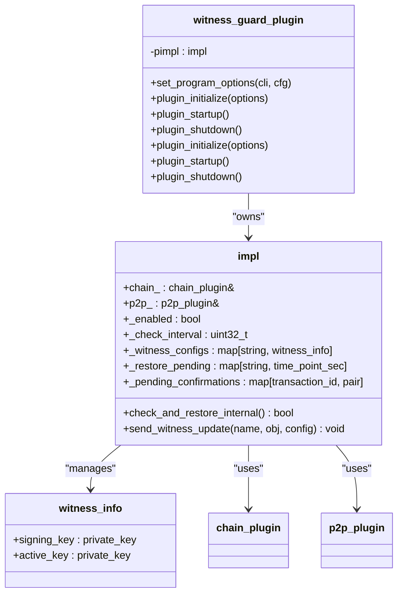
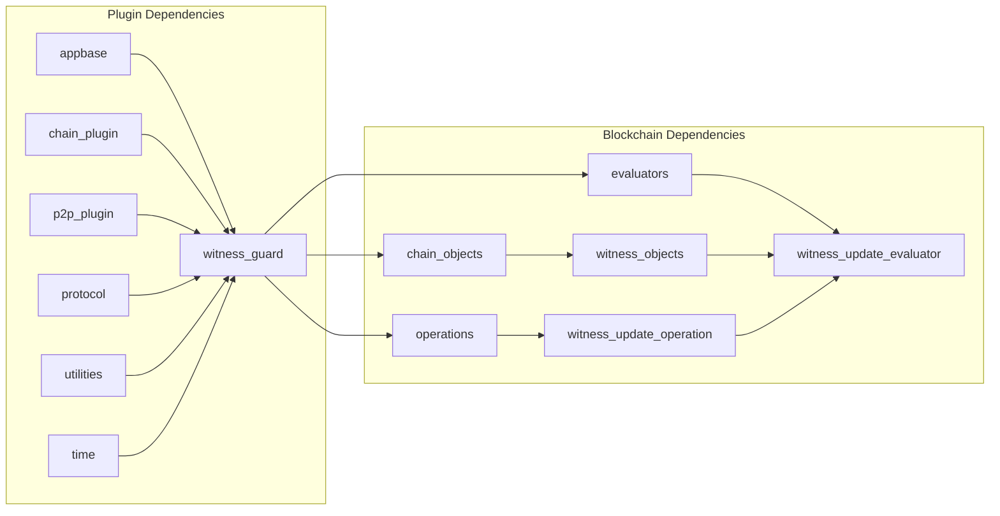

# Witness Guard Plugin

<cite>
**Referenced Files in This Document**
- [witness_guard.hpp](file://plugins/witness_guard/include/graphene/plugins/witness_guard/witness_guard.hpp)
- [witness_guard.cpp](file://plugins/witness_guard/witness_guard.cpp)
- [CMakeLists.txt](file://plugins/witness_guard/CMakeLists.txt)
- [witness.hpp](file://plugins/witness/include/graphene/plugins/witness/witness.hpp)
- [witness_objects.hpp](file://libraries/chain/include/graphene/chain/witness_objects.hpp)
- [chain_operations.hpp](file://libraries/protocol/include/graphene/protocol/chain_operations.hpp)
- [chain_properties_evaluators.cpp](file://libraries/chain/chain_properties_evaluators.cpp)
- [config_witness.ini](file://share/vizd/config/config_witness.ini)
</cite>

## Table of Contents
1. [Introduction](#introduction)
2. [Project Structure](#project-structure)
3. [Core Components](#core-components)
4. [Architecture Overview](#architecture-overview)
5. [Detailed Component Analysis](#detailed-component-analysis)
6. [Dependency Analysis](#dependency-analysis)
7. [Performance Considerations](#performance-considerations)
8. [Troubleshooting Guide](#troubleshooting-guide)
9. [Conclusion](#conclusion)

## Introduction

The Witness Guard Plugin is a specialized monitoring and automation component for the VIZ blockchain node that ensures witness signing keys remain properly configured and active. This plugin serves as a critical maintenance tool that automatically detects when a witness's on-chain signing key has been reset to null and initiates corrective action by broadcasting witness_update transactions to restore the proper key configuration.

The plugin operates continuously, monitoring configured witnesses and performing periodic checks to ensure block production capabilities are maintained. It integrates seamlessly with the VIZ blockchain's witness system while providing intelligent safeguards against network instability and operational failures.

## Project Structure

The Witness Guard Plugin follows the standard VIZ plugin architecture pattern, implementing the appbase plugin interface with clear separation of concerns between public interfaces and internal implementation details.

**Diagram sources**
- [witness_guard.hpp:1-48](file://plugins/witness_guard/include/graphene/plugins/witness_guard/witness_guard.hpp#L1-L48)
- [witness_guard.cpp:1-50](file://plugins/witness_guard/witness_guard.cpp#L1-L50)
- [CMakeLists.txt:26-34](file://plugins/witness_guard/CMakeLists.txt#L26-L34)

**Section sources**
- [witness_guard.hpp:1-48](file://plugins/witness_guard/include/graphene/plugins/witness_guard/witness_guard.hpp#L1-L48)
- [witness_guard.cpp:1-50](file://plugins/witness_guard/witness_guard.cpp#L1-L50)
- [CMakeLists.txt:1-44](file://plugins/witness_guard/CMakeLists.txt#L1-L44)

## Core Components

The Witness Guard Plugin consists of several key components that work together to provide comprehensive witness key monitoring and restoration capabilities:

### Plugin Interface Layer
The public interface defines the standard appbase plugin contract with explicit requirements for chain and p2p plugin dependencies. The plugin exposes three primary lifecycle methods: `set_program_options`, `plugin_initialize`, `plugin_startup`, and `plugin_shutdown`.

### Internal Implementation Structure
The implementation uses a private `impl` class pattern to encapsulate all plugin logic, maintaining clean separation between interface and implementation. The internal structure manages configuration state, witness monitoring data, and operational metadata.

### Configuration Management
The plugin supports flexible configuration through command-line options and runtime parameters, allowing operators to define which witnesses to monitor, how frequently to check for key validity, and whether automatic restoration should be enabled.

**Section sources**
- [witness_guard.hpp:11-44](file://plugins/witness_guard/include/graphene/plugins/witness_guard/witness_guard.hpp#L11-L44)
- [witness_guard.cpp:27-67](file://plugins/witness_guard/witness_guard.cpp#L27-L67)

## Architecture Overview

The Witness Guard Plugin implements a sophisticated monitoring architecture that integrates with multiple subsystems of the VIZ blockchain node:

**Diagram sources**
- [witness_guard.cpp:325-425](file://plugins/witness_guard/witness_guard.cpp#L325-L425)
- [witness_guard.cpp:72-169](file://plugins/witness_guard/witness_guard.cpp#L72-L169)

The architecture demonstrates several key design patterns:

1. **Event-Driven Architecture**: The plugin subscribes to blockchain events and responds to changes in real-time
2. **State Management**: Maintains persistent state across plugin lifecycle events
3. **Transaction Broadcasting**: Integrates with the P2P layer for transaction propagation
4. **Database Integration**: Directly accesses chain state for witness validation

## Detailed Component Analysis

### Witness Monitoring Engine

The core monitoring engine performs comprehensive checks on configured witnesses to ensure their signing keys remain valid and functional:

**Diagram sources**
- [witness_guard.cpp:72-169](file://plugins/witness_guard/witness_guard.cpp#L72-L169)
- [witness_guard.cpp:175-224](file://plugins/witness_guard/witness_guard.cpp#L175-L224)

### Transaction Construction and Broadcasting

The plugin constructs and broadcasts witness_update transactions with careful attention to security and reliability:

**Diagram sources**
- [witness_guard.hpp:11-44](file://plugins/witness_guard/include/graphene/plugins/witness_guard/witness_guard.hpp#L11-L44)
- [witness_guard.cpp:27-67](file://plugins/witness_guard/witness_guard.cpp#L27-L67)

### Configuration Management System

The plugin provides flexible configuration options that allow operators to customize monitoring behavior:

| Configuration Option | Type | Default | Description |
|---------------------|------|---------|-------------|
| `witness-guard-enabled` | Boolean | `true` | Enables or disables the plugin |
| `witness-guard-witness` | Array | None | Defines witness monitoring configuration as `[name, signing_wif, active_wif]` triplets |
| `witness-guard-interval` | Integer | `20` | Blocks between periodic checks |

**Section sources**
- [witness_guard.cpp:231-252](file://plugins/witness_guard/witness_guard.cpp#L231-L252)
- [witness_guard.cpp:254-323](file://plugins/witness_guard/witness_guard.cpp#L254-L323)

### Security and Validation Mechanisms

The plugin implements multiple layers of security validation to prevent unauthorized or unsafe operations:

1. **Authority Verification**: Ensures the configured active key has proper authority on-chain
2. **Network Health Checks**: Validates node synchronization and network participation rates
3. **Emergency Consensus Awareness**: Respects emergency consensus mode operations
4. **Transaction Expiration Management**: Prevents transaction accumulation and ensures timely cleanup

**Section sources**
- [witness_guard.cpp:334-359](file://plugins/witness_guard/witness_guard.cpp#L334-L359)
- [witness_guard.cpp:79-96](file://plugins/witness_guard/witness_guard.cpp#L79-L96)

## Dependency Analysis

The Witness Guard Plugin maintains minimal but essential dependencies that enable its core functionality:

**Diagram sources**
- [CMakeLists.txt:26-34](file://plugins/witness_guard/CMakeLists.txt#L26-L34)
- [witness_guard.cpp:3-12](file://plugins/witness_guard/witness_guard.cpp#L3-L12)

The dependency structure reveals several important characteristics:

1. **Minimal Coupling**: The plugin depends only on essential core components
2. **Interface-Based Design**: Uses well-defined plugin interfaces rather than internal implementation details
3. **Protocol Integration**: Leverages blockchain protocol definitions for operation validation
4. **Utility Integration**: Utilizes cryptographic utilities for key conversion and validation

**Section sources**
- [CMakeLists.txt:26-34](file://plugins/witness_guard/CMakeLists.txt#L26-L34)
- [witness_guard.cpp:3-12](file://plugins/witness_guard/witness_guard.cpp#L3-L12)

## Performance Considerations

The Witness Guard Plugin is designed with performance efficiency as a primary consideration:

### Memory Management
- **Limited State Storage**: Maintains only essential monitoring state in memory
- **Automatic Cleanup**: Implements expiration-based cleanup for pending transactions
- **Size Limits**: Enforces limits on tracking collections to prevent memory growth

### Network Efficiency
- **Selective Broadcasting**: Only broadcasts transactions when key restoration is needed
- **Event-Driven Updates**: Responds to blockchain events rather than polling continuously
- **Batch Processing**: Processes multiple witnesses efficiently within single monitoring cycles

### Computational Efficiency
- **Minimal Database Queries**: Performs necessary database operations during initialization and monitoring
- **Optimized Key Validation**: Uses efficient key comparison and validation mechanisms
- **Smart Scheduling**: Adjusts monitoring frequency based on network conditions and witness schedules

**Section sources**
- [witness_guard.cpp:203-206](file://plugins/witness_guard/witness_guard.cpp#L203-L206)
- [witness_guard.cpp:410-421](file://plugins/witness_guard/witness_guard.cpp#L410-L421)

## Troubleshooting Guide

### Common Issues and Solutions

#### Plugin Not Activating
**Symptoms**: Plugin appears disabled or inactive
**Causes**: 
- Plugin disabled via configuration (`witness-guard-enabled=false`)
- No witnesses configured for monitoring
- Node synchronization issues preventing monitoring

**Solutions**:
- Verify configuration includes proper witness definitions
- Check node synchronization status
- Review plugin logs for initialization errors

#### Witness Key Restoration Failures
**Symptoms**: Transactions broadcast but not included in blocks
**Causes**:
- Insufficient transaction fees
- Incorrect witness configuration
- Network congestion or delays

**Solutions**:
- Verify witness configuration includes valid WIF keys
- Check transaction fee requirements
- Monitor network transaction pool status

#### Network Health Detection Issues
**Symptoms**: Plugin skips restoration during network instability
**Causes**:
- Stale production mode enabled
- Low network participation rates
- Emergency consensus active

**Solutions**:
- Disable stale production mode when network stabilizes
- Monitor participation rate improvements
- Allow emergency consensus to complete

### Diagnostic Commands and Logs

The plugin provides comprehensive logging throughout its operation:

- **Initialization Logs**: Configuration parsing and setup completion
- **Monitoring Logs**: Periodic check results and key validation outcomes
- **Transaction Logs**: Broadcasting and confirmation tracking
- **Error Logs**: Exception handling and failure scenarios

**Section sources**
- [witness_guard.cpp:258-323](file://plugins/witness_guard/witness_guard.cpp#L258-L323)
- [witness_guard.cpp:365-425](file://plugins/witness_guard/witness_guard.cpp#L365-L425)

## Conclusion

The Witness Guard Plugin represents a sophisticated solution for maintaining witness key integrity in the VIZ blockchain ecosystem. Through its comprehensive monitoring capabilities, intelligent safety mechanisms, and efficient resource management, it provides essential infrastructure support for witness operators and network stability.

The plugin's design demonstrates several key strengths:
- **Robust Architecture**: Clean separation of concerns with minimal dependencies
- **Security Focus**: Multi-layer validation and safety checks
- **Performance Efficiency**: Optimized resource usage and computational overhead
- **Operational Reliability**: Comprehensive error handling and recovery mechanisms

As the VIZ blockchain continues to evolve, the Witness Guard Plugin serves as a foundation for advanced witness management capabilities, providing the reliability and automation necessary for professional witness operations.