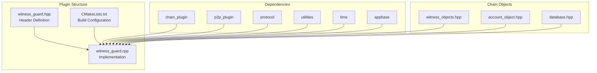
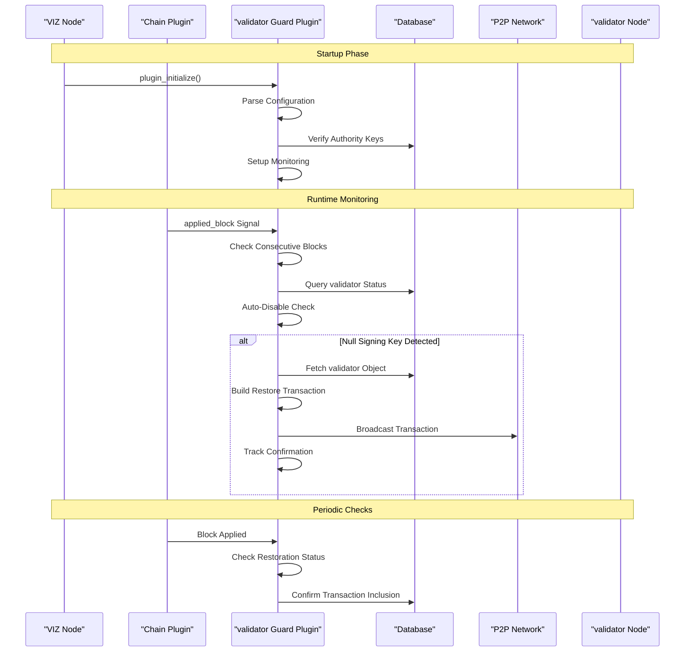
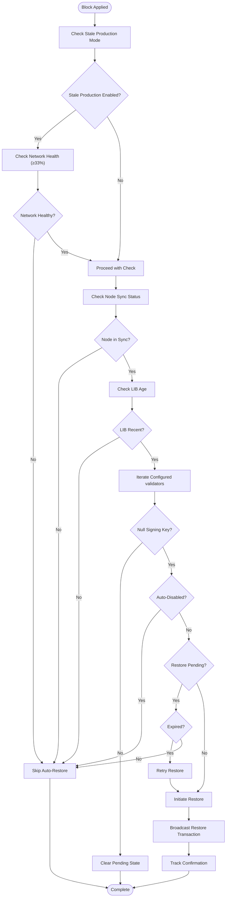
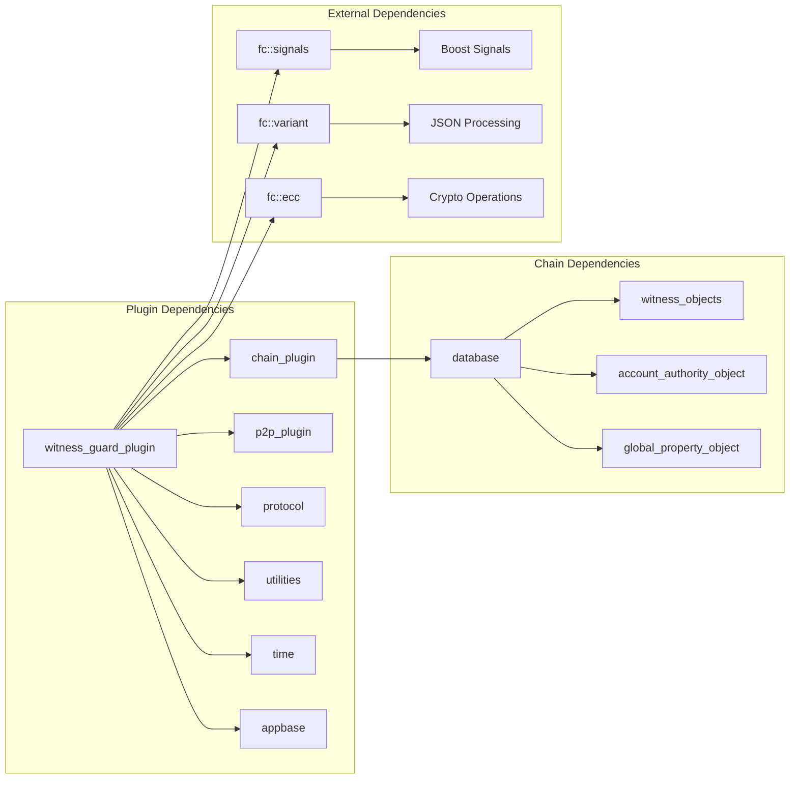

# validator Guard Plugin

<cite>
**Referenced Files in This Document**
- [witness_guard.hpp](file://plugins/witness_guard/include/graphene/plugins/witness_guard/witness_guard.hpp)
- [witness_guard.cpp](file://plugins/witness_guard/witness_guard.cpp)
- [CMakeLists.txt](file://plugins/witness_guard/CMakeLists.txt)
- [witness_objects.hpp](file://libraries/chain/include/graphene/chain/witness_objects.hpp)
- [account_object.hpp](file://libraries/chain/include/graphene/chain/account_object.hpp)
- [database.hpp](file://libraries/chain/include/graphene/chain/database.hpp)
- [config.ini](file://share/vizd/config/config.ini)
- [plugin.md](file://documentation/plugin.md)
</cite>

## Table of Contents
1. [Introduction](#introduction)
2. [Project Structure](#project-structure)
3. [Core Components](#core-components)
4. [Architecture Overview](#architecture-overview)
5. [Detailed Component Analysis](#detailed-component-analysis)
6. [Dependency Analysis](#dependency-analysis)
7. [Performance Considerations](#performance-considerations)
8. [Troubleshooting Guide](#troubleshooting-guide)
9. [Conclusion](#conclusion)

## Introduction

The validator Guard Plugin is a specialized plugin for the VIZ blockchain node that automatically monitors and maintains validator signing keys to prevent downtime in block production. This plugin serves as a critical safety mechanism for validator operators who want to ensure their validators remain productive even when encountering issues with their signing keys.

The plugin operates by continuously monitoring configured validators and automatically restoring their on-chain signing keys when they become null or invalid. It also includes intelligent auto-disable functionality to prevent excessive block production by a single validator, protecting the network from potential centralization risks.

## Project Structure

The validator Guard Plugin follows the standard VIZ plugin architecture pattern with a clear separation between interface and implementation:

**Diagram sources**
- [witness_guard.hpp:1-48](file://plugins/witness_guard/include/graphene/plugins/witness_guard/witness_guard.hpp#L1-L48)
- [witness_guard.cpp:1-559](file://plugins/witness_guard/witness_guard.cpp#L1-L559)
- [CMakeLists.txt:1-44](file://plugins/witness_guard/CMakeLists.txt#L1-L44)

**Section sources**
- [witness_guard.hpp:1-48](file://plugins/witness_guard/include/graphene/plugins/witness_guard/witness_guard.hpp#L1-L48)
- [witness_guard.cpp:1-559](file://plugins/witness_guard/witness_guard.cpp#L1-L559)
- [CMakeLists.txt:1-44](file://plugins/witness_guard/CMakeLists.txt#L1-L44)

## Core Components

The validator Guard Plugin consists of several key components that work together to provide comprehensive validator monitoring and protection:

### Main Plugin Class
The primary plugin class implements the appbase plugin interface and manages the plugin lifecycle. It requires both the chain plugin and p2p plugin to function properly.

### Internal Implementation (impl)
The internal implementation class contains all the core logic for:
- Configuration management and validation
- Periodic monitoring and restoration processes
- Auto-disable functionality for excessive block production
- Transaction broadcasting and confirmation tracking

### Data Structures
The plugin maintains several critical data structures:
- **validator Configuration Map**: Stores validator names with their associated key pairs
- **Consecutive Block Counters**: Tracks blocks produced by each validator
- **Pending Restoration Tracking**: Manages in-flight transactions
- **Auto-Disabled validators**: Prevents automatic restoration of problematic validators

**Section sources**
- [witness_guard.hpp:11-44](file://plugins/witness_guard/include/graphene/plugins/witness_guard/witness_guard.hpp#L11-L44)
- [witness_guard.cpp:27-78](file://plugins/witness_guard/witness_guard.cpp#L27-L78)

## Architecture Overview

The validator Guard Plugin integrates deeply with the VIZ blockchain's core infrastructure through a sophisticated event-driven architecture:

**Diagram sources**
- [witness_guard.cpp:410-548](file://plugins/witness_guard/witness_guard.cpp#L410-L548)
- [witness_guard.cpp:83-191](file://plugins/witness_guard/witness_guard.cpp#L83-L191)

The architecture follows a reactive pattern where the plugin listens for blockchain events and responds appropriately. The plugin subscribes to the `applied_block` signal from the chain database, enabling it to monitor block production in real-time.

**Section sources**
- [witness_guard.cpp:455-544](file://plugins/witness_guard/witness_guard.cpp#L455-L544)
- [database.hpp:1-200](file://libraries/chain/include/graphene/chain/database.hpp#L1-L200)

## Detailed Component Analysis

### Configuration Management

The plugin supports extensive configuration options that allow fine-tuned control over its behavior:

#### Core Configuration Options
- **validator-guard-enabled**: Enables or disables the entire plugin functionality
- **validator-guard-validator**: Configures individual validators with their key pairs
- **validator-guard-interval**: Sets the frequency of periodic checks in blocks
- **validator-guard-disable**: Controls auto-disable threshold for excessive block production

#### validator Configuration Format
Each validator configuration requires three components:
1. **validator Name**: The account name of the validator
2. **Signing WIF**: Private key for signing blocks
3. **Active WIF**: Private key for transaction authorization

The plugin validates all configurations during initialization and performs authority verification against the blockchain state.

**Section sources**
- [witness_guard.cpp:301-408](file://plugins/witness_guard/witness_guard.cpp#L301-L408)

### Monitoring and Restoration Logic

The core monitoring functionality operates through a sophisticated state machine that tracks validator health and automatically restores compromised keys:

**Diagram sources**
- [witness_guard.cpp:83-191](file://plugins/witness_guard/witness_guard.cpp#L83-L191)

The restoration process includes comprehensive error handling and retry mechanisms to ensure reliable key restoration even in challenging network conditions.

**Section sources**
- [witness_guard.cpp:197-246](file://plugins/witness_guard/witness_guard.cpp#L197-L246)
- [witness_guard.cpp:252-294](file://plugins/witness_guard/witness_guard.cpp#L252-L294)

### Auto-Disable Mechanism

The plugin includes an intelligent auto-disable feature designed to prevent excessive block production by a single validator:

#### Consecutive Block Detection
The system tracks blocks produced by each validator and increments counters when the same validator produces consecutive blocks. When the counter reaches the configured threshold, the system automatically disables the validator by broadcasting a transaction that sets the signing key to null.

#### Prevention of Excessive Centralization
This mechanism serves as a safeguard against:
- Single-validator dominance in block production
- Potential malicious behavior by a single validator
- Network instability caused by excessive block production

#### Operator Intervention Required
When a validator is auto-disabled, the plugin prevents automatic restoration to ensure operators investigate and address underlying issues. Manual intervention is required to re-enable the validator.

**Section sources**
- [witness_guard.cpp:459-495](file://plugins/witness_guard/witness_guard.cpp#L459-L495)
- [witness_guard.cpp:467-484](file://plugins/witness_guard/witness_guard.cpp#L467-L484)

### Transaction Broadcasting and Confirmation

The plugin implements robust transaction management for both restoration and disabling operations:

#### Transaction Construction
Each operation constructs a properly formatted `witness_update` transaction with:
- Correct validator owner identification
- Appropriate URL preservation
- Proper key updates (restore or disable)
- Transaction expiration handling

#### Broadcasting Strategy
Transactions are broadcast through the P2P network with careful consideration of:
- Transaction fee optimization
- Network congestion handling
- Confirmation tracking mechanisms

#### Confirmation Tracking
The plugin maintains detailed tracking of all broadcast transactions:
- Transaction ID correlation
- Expiration time management
- Confirmation verification in subsequent blocks
- Automatic retry for failed transactions

**Section sources**
- [witness_guard.cpp:197-246](file://plugins/witness_guard/witness_guard.cpp#L197-L246)
- [witness_guard.cpp:252-294](file://plugins/witness_guard/witness_guard.cpp#L252-L294)

## Dependency Analysis

The validator Guard Plugin has carefully managed dependencies that enable it to function effectively within the VIZ ecosystem:

**Diagram sources**
- [CMakeLists.txt:26-34](file://plugins/witness_guard/CMakeLists.txt#L26-L34)
- [witness_guard.cpp:3-18](file://plugins/witness_guard/witness_guard.cpp#L3-L18)

### Core Dependencies

#### Chain Plugin Integration
The plugin requires the chain plugin for:
- Database access and manipulation
- Block production scheduling
- validator object management
- Authority verification

#### P2P Plugin Integration
The plugin requires the p2p plugin for:
- Transaction broadcasting
- Network connectivity
- Peer communication
- Transaction propagation

#### Protocol Dependencies
The plugin relies on protocol definitions for:
- Operation structures
- Authority formats
- Transaction construction
- Cryptographic operations

**Section sources**
- [CMakeLists.txt:26-34](file://plugins/witness_guard/CMakeLists.txt#L26-L34)
- [witness_guard.hpp:3-6](file://plugins/witness_guard/include/graphene/plugins/witness_guard/witness_guard.hpp#L3-L6)

## Performance Considerations

The validator Guard Plugin is designed with performance optimization in mind to minimize impact on node operations:

### Efficient Monitoring Strategy
- **Event-Driven Architecture**: Uses blockchain event signals rather than polling
- **Intelligent Scheduling**: Adjusts check frequency based on network conditions
- **Selective Processing**: Only processes blocks that affect monitored validators
- **Memory Management**: Implements efficient data structures for tracking state

### Resource Optimization
- **Minimal Memory Footprint**: Uses compact data structures for tracking
- **Efficient Key Storage**: Optimizes storage of validator configurations
- **Connection Management**: Properly manages database connections
- **Signal Handling**: Efficient signal connection and disconnection

### Network Efficiency
- **Transaction Batching**: Minimizes unnecessary transaction broadcasts
- **Confirmation Optimization**: Reduces redundant processing of confirmed transactions
- **Network Awareness**: Adapts behavior based on network conditions
- **Timeout Management**: Implements appropriate timeouts for various operations

## Troubleshooting Guide

### Common Issues and Solutions

#### Plugin Not Starting
**Symptoms**: Plugin fails to initialize or appears disabled
**Causes**:
- Missing configuration options
- Invalid validator configurations
- Missing required plugins (chain, p2p)
- Authority verification failures

**Solutions**:
- Verify all configuration options are properly set
- Check validator configuration format and validity
- Ensure required plugins are enabled in config.ini
- Validate validator authority keys against blockchain state

#### validator Restoration Failures
**Symptoms**: validator keys not being restored despite null signing keys
**Causes**:
- Active authority key mismatch
- Insufficient network synchronization
- Stale production mode interference
- Transaction broadcast failures

**Solutions**:
- Verify active authority key matches on-chain authority
- Ensure node is fully synchronized with network
- Check stale production mode configuration
- Monitor P2P network connectivity and transaction propagation

#### Auto-Disable Issues
**Symptoms**: validators being auto-disabled unexpectedly or not being disabled
**Causes**:
- Incorrect disable threshold configuration
- Network timing issues
- validator scheduling conflicts
- Database access problems

**Solutions**:
- Review and adjust disable threshold settings
- Monitor validator production patterns
- Check network stability and block times
- Verify database connectivity and performance

### Configuration Validation

The plugin performs extensive validation during initialization:

#### Configuration Validation Steps
1. **Option Parsing**: Validates all command-line and config file options
2. **validator Entry Validation**: Verifies each validator configuration triplet
3. **Authority Verification**: Confirms active keys have proper authority
4. **Network Health Assessment**: Evaluates current network conditions
5. **Stale Production Detection**: Identifies stale production mode activation

#### Error Handling and Logging
The plugin implements comprehensive logging for troubleshooting:
- **Debug Information**: Detailed operational information
- **Warning Messages**: Potential issues and recommendations
- **Error Reporting**: Critical failures and resolution steps
- **Success Confirmations**: Successful operations and outcomes

**Section sources**
- [witness_guard.cpp:330-408](file://plugins/witness_guard/witness_guard.cpp#L330-L408)
- [witness_guard.cpp:410-548](file://plugins/witness_guard/witness_guard.cpp#L410-L548)

## Conclusion

The validator Guard Plugin represents a sophisticated solution for maintaining validator reliability in the VIZ blockchain ecosystem. Its comprehensive monitoring capabilities, intelligent auto-disable mechanisms, and robust restoration processes provide essential protection against validator downtime while preventing excessive centralization risks.

The plugin's architecture demonstrates best practices in blockchain plugin development, including proper separation of concerns, efficient resource management, and comprehensive error handling. Its integration with the VIZ blockchain's event-driven architecture enables real-time monitoring and response to network conditions.

Key benefits of the validator Guard Plugin include:
- **Automated Reliability**: Continuous monitoring reduces manual intervention requirements
- **Network Protection**: Prevents excessive validator dominance and centralization
- **Operational Efficiency**: Intelligent scheduling minimizes performance impact
- **Security Enhancement**: Comprehensive validation protects against unauthorized operations

For optimal deployment, operators should carefully configure the plugin according to their specific needs, monitor its performance regularly, and maintain awareness of network conditions that may affect its operation. The plugin's comprehensive logging and error reporting capabilities provide excellent visibility into its operations and help ensure reliable validator protection.